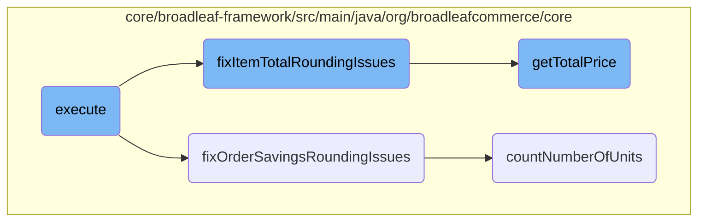

In this document, we will explain the process of executing the pricing workflow for fulfillment items in an order. The process involves calculating item totals, fixing rounding issues, distributing order savings, and updating taxable amounts.

The flow starts by calculating the total amounts for each item in the order. Then, it fixes any rounding issues that might have occurred at the item level. Next, it calculates the total price for all items and distributes any savings across these items. Finally, it fixes any rounding issues related to the order adjustments and updates the taxable amounts for each item.

# Flow drill down



<SwmSnippet path="/core/broadleaf-framework/src/main/java/org/broadleafcommerce/core/pricing/service/workflow/FulfillmentItemPricingActivity.java" line="83">

---

## Execute Method

The <SwmToken path="core/broadleaf-framework/src/main/java/org/broadleafcommerce/core/pricing/service/workflow/FulfillmentItemPricingActivity.java" pos="84:8:8" line-data="    public ProcessContext&lt;Order&gt; execute(ProcessContext&lt;Order&gt; context) throws Exception {">`execute`</SwmToken> method is the main entry point for processing the order's pricing workflow. It starts by populating the item total amounts and then calls <SwmToken path="core/broadleaf-framework/src/main/java/org/broadleafcommerce/core/pricing/service/workflow/FulfillmentItemPricingActivity.java" pos="90:1:1" line-data="        fixItemTotalRoundingIssues(order, partialOrderItemMap);">`fixItemTotalRoundingIssues`</SwmToken> to ensure there are no rounding discrepancies at the item level. Next, it calculates the total price for all fulfillment items and distributes order savings across these items. Finally, it calls <SwmToken path="core/broadleaf-framework/src/main/java/org/broadleafcommerce/core/pricing/service/workflow/FulfillmentItemPricingActivity.java" pos="95:1:1" line-data="        fixOrderSavingsRoundingIssues(order, totalOrderAdjustmentDistributed);">`fixOrderSavingsRoundingIssues`</SwmToken> to correct any rounding issues related to order adjustments and updates the taxable amounts on items.

```java
    @Override
    public ProcessContext<Order> execute(ProcessContext<Order> context) throws Exception {
        Order order = context.getSeedData();
        Map<OrderItem,List<FulfillmentGroupItem>> partialOrderItemMap = new HashMap<>();

        // Calculate the fulfillmentGroupItem total
        populateItemTotalAmount(order, partialOrderItemMap);
        fixItemTotalRoundingIssues(order, partialOrderItemMap);
        
        // Calculate the fulfillmentGroupItem prorated orderSavings
        Money totalAllItemsAmount = calculateTotalPriceForAllFulfillmentItems(order);
        Money totalOrderAdjustmentDistributed = distributeOrderSavingsToItems(order, totalAllItemsAmount.getAmount());
        fixOrderSavingsRoundingIssues(order, totalOrderAdjustmentDistributed);
        
        // Step 3: Finalize the taxable amounts
        updateTaxableAmountsOnItems(order);
        context.setSeedData(order);

        return context;
    }
```

---

</SwmSnippet>

<SwmSnippet path="/core/broadleaf-framework/src/main/java/org/broadleafcommerce/core/pricing/service/workflow/FulfillmentItemPricingActivity.java" line="136">

---

### Fixing Item Total Rounding Issues

The <SwmToken path="core/broadleaf-framework/src/main/java/org/broadleafcommerce/core/pricing/service/workflow/FulfillmentItemPricingActivity.java" pos="148:5:5" line-data="    protected void fixItemTotalRoundingIssues(Order order, Map&lt;OrderItem, List&lt;FulfillmentGroupItem&gt;&gt; partialOrderItemMap) {">`fixItemTotalRoundingIssues`</SwmToken> method addresses potential rounding issues that may arise when an item's multiple price details do not round cleanly. It ensures that the total item amount matches the sum of its fulfillment group items by distributing any leftover pennies.

```java
    /**
     * Because an item may have multiple price details that don't round cleanly, we may have pennies
     * left over that need to be distributed.
     * 
     * This method may not be needed because the sum of the item amounts is derived from a double price (OrderItem's total)
     * being multiplied and divided by whole numbers of which guarantees that each item amount is a clean multiple
     * of the price of a single unit of that item. This behavior being enforced in populateItemTotalAmount. So we will
     * never get a fraction of a cent that could cause totalItemAmount and totalFGItemAmount to be different values.
     * 
     * @param order
     * @param partialOrderItemMap
     */
    protected void fixItemTotalRoundingIssues(Order order, Map<OrderItem, List<FulfillmentGroupItem>> partialOrderItemMap) {
        for (OrderItem orderItem : partialOrderItemMap.keySet()) {
            Money totalItemAmount = orderItem.getTotalPrice();
            Money totalFGItemAmount = sumItemAmount(partialOrderItemMap.get(orderItem), order);
            Money amountDiff = totalItemAmount.subtract(totalFGItemAmount);

            if (!(amountDiff.getAmount().compareTo(BigDecimal.ZERO) == 0)) {
                long numApplicationsNeeded = countNumberOfUnits(amountDiff);
                Money unitAmount = getUnitAmount(amountDiff);
```

---

</SwmSnippet>

<SwmSnippet path="/core/broadleaf-framework/src/main/java/org/broadleafcommerce/core/pricing/service/workflow/FulfillmentItemPricingActivity.java" line="205">

---

### Fixing Order Savings Rounding Issues

The <SwmToken path="core/broadleaf-framework/src/main/java/org/broadleafcommerce/core/pricing/service/workflow/FulfillmentItemPricingActivity.java" pos="211:5:5" line-data="    protected void fixOrderSavingsRoundingIssues(Order order, Money totalOrderAdjustmentDistributed) {">`fixOrderSavingsRoundingIssues`</SwmToken> method ensures that the order adjustments match the total order savings by adding or removing pennies as necessary. It calculates the difference between the order adjustment total and the distributed order savings, then applies this difference to the prorated adjustments of fulfillment group items.

```java
    /**
     * It is possible due to rounding that the order adjustments do not match the 
     * total.   This method fixes by adding or removing the pennies.
     * @param order
     * @param partialOrderItemMap
     */
    protected void fixOrderSavingsRoundingIssues(Order order, Money totalOrderAdjustmentDistributed) {
        if (!order.getHasOrderAdjustments()) {
            return;
        }

        Money orderAdjustmentTotal = order.getOrderAdjustmentsValue();
        Money amountDiff = orderAdjustmentTotal.subtract(totalOrderAdjustmentDistributed);

        if (!(amountDiff.getAmount().compareTo(BigDecimal.ZERO) == 0)) {
            long numApplicationsNeeded = countNumberOfUnits(amountDiff);
            Money unitAmount = getUnitAmount(amountDiff);

            for (FulfillmentGroup fulfillmentGroup : order.getFulfillmentGroups()) {
                for (FulfillmentGroupItem fgItem : fulfillmentGroup.getFulfillmentGroupItems()) {
                    numApplicationsNeeded = numApplicationsNeeded -
```

---

</SwmSnippet>

<SwmSnippet path="/core/broadleaf-framework/src/main/java/org/broadleafcommerce/core/order/domain/BundleOrderItemImpl.java" line="416">

---

### Calculating Total Price

The <SwmToken path="core/broadleaf-framework/src/main/java/org/broadleafcommerce/core/order/domain/BundleOrderItemImpl.java" pos="417:5:5" line-data="    public Money getTotalPrice() {">`getTotalPrice`</SwmToken> method calculates the total price of a bundle order item. It sums the total prices of all contained items and multiplies by the quantity if necessary, ensuring an accurate total price for the bundle.

```java
    @Override
    public Money getTotalPrice() {
        Money returnValue = convertToMoney(BigDecimal.ZERO);
        if (shouldSumItems()) {
            for (OrderItem containedItem : getOrderItems()) {
                returnValue = returnValue.add(containedItem.getTotalPrice());
            }
            returnValue = returnValue.multiply(quantity);
        } else {
            returnValue = super.getTotalPrice();
        }
        return returnValue;
    }
```

---

</SwmSnippet>

<SwmSnippet path="/core/broadleaf-framework/src/main/java/org/broadleafcommerce/core/pricing/service/workflow/FulfillmentItemPricingActivity.java" line="274">

---

### Counting Number of Units

The <SwmToken path="core/broadleaf-framework/src/main/java/org/broadleafcommerce/core/pricing/service/workflow/FulfillmentItemPricingActivity.java" pos="274:5:5" line-data="    public long countNumberOfUnits(Money difference) {">`countNumberOfUnits`</SwmToken> method calculates the number of units needed to correct a rounding difference. It converts the monetary difference to the smallest currency unit and rounds to the nearest whole number.

```java
    public long countNumberOfUnits(Money difference) {
        double numUnits = difference.multiply(Math.pow(10, difference.getCurrency().getDefaultFractionDigits())).doubleValue();
        return Math.round(Math.abs(numUnits));
    }
```

---

</SwmSnippet>

&nbsp;

*This is an auto-generated document by Swimm AI 🌊 and has not yet been verified by a human*

<SwmMeta version="3.0.0" repo-id="Z2l0aHViJTNBJTNBQnJvYWRsZWFmQ29tbWVyY2UtZGVtby1uZXclM0ElM0FTd2ltbS1EZW1v" repo-name="BroadleafCommerce-demo-new" doc-type="flows"><sup>Powered by [Swimm](/)</sup></SwmMeta>
