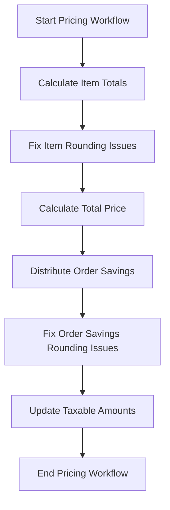

This document will cover the process of executing the pricing workflow for fulfillment items in an order. We'll cover:

1. Calculating item totals
2. Fixing rounding issues
3. Distributing order savings
4. Updating taxable amounts.

Technical document: <SwmLink doc-title="Executing the Pricing Workflow">[Executing the Pricing Workflow](/.swm/executing-the-pricing-workflow.g5lcguyx.sw.md)</SwmLink>

# [Calculating Item Totals](https://app.swimm.io/repos/Z2l0aHViJTNBJTNBQnJvYWRsZWFmQ29tbWVyY2UtZGVtby1uZXclM0ElM0FTd2ltbS1EZW1v/docs/g5lcguyx#execute-method)

The first step in the pricing workflow is to calculate the total amounts for each item in the order. This involves summing up the prices of all items within each fulfillment group. This ensures that the total price reflects the sum of all individual item prices, providing an accurate base for further calculations.

# [Fixing Item Rounding Issues](https://app.swimm.io/repos/Z2l0aHViJTNBJTNBQnJvYWRsZWFmQ29tbWVyY2UtZGVtby1uZXclM0ElM0FTd2ltbS1EZW1v/docs/g5lcguyx#fixing-item-total-rounding-issues)

Rounding issues can occur when an item's multiple price details do not round cleanly. To address this, we ensure that the total item amount matches the sum of its fulfillment group items by distributing any leftover pennies. This step is crucial to maintain pricing accuracy and avoid discrepancies in the final total.

# [Calculating Total Price](https://app.swimm.io/repos/Z2l0aHViJTNBJTNBQnJvYWRsZWFmQ29tbWVyY2UtZGVtby1uZXclM0ElM0FTd2ltbS1EZW1v/docs/g5lcguyx#calculating-total-price)

After fixing item rounding issues, the next step is to calculate the total price for all items in the order. This involves summing the total prices of all contained items and multiplying by the quantity if necessary. This ensures an accurate total price for the entire order, which is essential for subsequent steps like savings distribution.

# [Distributing Order Savings](https://app.swimm.io/repos/Z2l0aHViJTNBJTNBQnJvYWRsZWFmQ29tbWVyY2UtZGVtby1uZXclM0ElM0FTd2ltbS1EZW1v/docs/g5lcguyx#execute-method)

Once the total price is calculated, any savings or discounts applied to the order need to be distributed across the items. This step ensures that the savings are prorated correctly, maintaining fairness and accuracy in the final pricing. The savings distribution affects the final amount the customer pays and needs to be handled meticulously.

# [Fixing Order Savings Rounding Issues](https://app.swimm.io/repos/Z2l0aHViJTNBJTNBQnJvYWRsZWFmQ29tbWVyY2UtZGVtby1uZXclM0ElM0FTd2ltbS1EZW1v/docs/g5lcguyx#fixing-order-savings-rounding-issues)

Similar to item rounding issues, order savings rounding issues can occur due to the distribution of savings. This step ensures that the order adjustments match the total order savings by adding or removing pennies as necessary. This correction is vital to ensure that the final order total is accurate and reflects the intended savings.

# [Updating Taxable Amounts](https://app.swimm.io/repos/Z2l0aHViJTNBJTNBQnJvYWRsZWFmQ29tbWVyY2UtZGVtby1uZXclM0ElM0FTd2ltbS1EZW1v/docs/g5lcguyx#execute-method)

The final step in the pricing workflow is to update the taxable amounts for each item. This involves recalculating the taxable amounts based on the final item prices after all adjustments and savings have been applied. Accurate taxable amounts are essential for correct tax calculation and compliance with tax regulations.

&nbsp;

*This is an auto-generated document by Swimm AI 🌊 and has not yet been verified by a human*

<SwmMeta version="3.0.0" repo-id="Z2l0aHViJTNBJTNBQnJvYWRsZWFmQ29tbWVyY2UtZGVtby1uZXclM0ElM0FTd2ltbS1EZW1v" repo-name="BroadleafCommerce-demo-new" doc-type="product-flows">Powered by [Swimm](/)</SwmMeta>
