```mermaid
classDiagram
    class EntityValidatorService {
        +validate(Entity entity, Serializable instance, Map<String, FieldMetadata> entityFieldMetadata, Map<String, String> ValidationConfiguration, BasicFieldMetadata propertyMetadata, String propertyName, String value)
    }
    class PropertyValidator {
        +validate(Entity entity, Serializable instance, Map<String, FieldMetadata> entityFieldMetadata, Map<String, String> ValidationConfiguration, BasicFieldMetadata propertyMetadata, String propertyName, String value)
    }
    class ValidationConfigurationBasedPropertyValidator {
        +validateInternal(Entity entity, Serializable instance, Map<String, FieldMetadata> entityFieldMetadata, Map<String, String> ValidationConfiguration, BasicFieldMetadata propertyMetadata, String propertyName, String value)
    }
    PropertyValidator <|-- ValidationConfigurationBasedPropertyValidator
    EntityValidatorService <|-- PropertyValidator

%% Swimm:
%% classDiagram
%%     class <SwmToken path="admin/broadleaf-open-admin-platform/src/main/java/org/broadleafcommerce/openadmin/server/service/persistence/validation/EntityValidatorService.java" pos="39:4:4" line-data="public interface EntityValidatorService {">`EntityValidatorService`</SwmToken> {
%%         +validate(Entity entity, Serializable instance, <SwmToken path="admin/broadleaf-open-admin-platform/src/main/java/org/broadleafcommerce/openadmin/server/service/persistence/validation/ValidationConfigurationBasedPropertyValidator.java" pos="41:17:19" line-data="    public PropertyValidationResult validate(Entity entity, Serializable instance, Map&lt;String, FieldMetadata&gt; entityFieldMetadata,">`Map<String`</SwmToken>, <SwmToken path="admin/broadleaf-open-admin-platform/src/main/java/org/broadleafcommerce/openadmin/server/service/persistence/validation/ValidationConfigurationBasedPropertyValidator.java" pos="41:22:23" line-data="    public PropertyValidationResult validate(Entity entity, Serializable instance, Map&lt;String, FieldMetadata&gt; entityFieldMetadata,">`FieldMetadata>`</SwmToken> <SwmToken path="admin/broadleaf-open-admin-platform/src/main/java/org/broadleafcommerce/openadmin/server/service/persistence/validation/ValidationConfigurationBasedPropertyValidator.java" pos="41:25:25" line-data="    public PropertyValidationResult validate(Entity entity, Serializable instance, Map&lt;String, FieldMetadata&gt; entityFieldMetadata,">`entityFieldMetadata`</SwmToken>, <SwmToken path="admin/broadleaf-open-admin-platform/src/main/java/org/broadleafcommerce/openadmin/server/service/persistence/validation/ValidationConfigurationBasedPropertyValidator.java" pos="41:17:19" line-data="    public PropertyValidationResult validate(Entity entity, Serializable instance, Map&lt;String, FieldMetadata&gt; entityFieldMetadata,">`Map<String`</SwmToken>, String> <SwmToken path="admin/broadleaf-open-admin-platform/src/main/java/org/broadleafcommerce/openadmin/server/service/persistence/validation/ValidationConfigurationBasedPropertyValidator.java" pos="34:41:41" line-data=" * This class should be used as your base if you are writing a validator based on a {@link ValidationConfiguration}">`ValidationConfiguration`</SwmToken>, <SwmToken path="admin/broadleaf-open-admin-platform/src/main/java/org/broadleafcommerce/openadmin/server/service/persistence/validation/ValidationConfigurationBasedPropertyValidator.java" pos="43:1:1" line-data="            BasicFieldMetadata propertyMetadata,">`BasicFieldMetadata`</SwmToken> <SwmToken path="admin/broadleaf-open-admin-platform/src/main/java/org/broadleafcommerce/openadmin/server/service/persistence/validation/ValidationConfigurationBasedPropertyValidator.java" pos="43:3:3" line-data="            BasicFieldMetadata propertyMetadata,">`propertyMetadata`</SwmToken>, String <SwmToken path="admin/broadleaf-open-admin-platform/src/main/java/org/broadleafcommerce/openadmin/server/service/persistence/validation/ValidationConfigurationBasedPropertyValidator.java" pos="44:3:3" line-data="            String propertyName,">`propertyName`</SwmToken>, String value)
%%     }
%%     class <SwmToken path="admin/broadleaf-open-admin-platform/src/main/java/org/broadleafcommerce/openadmin/server/service/persistence/validation/EntityValidatorService.java" pos="47:39:39" line-data="     * @param instance actual domain representation of &lt;b&gt;submittedEntity&lt;/b&gt;. If this is null, all {@link PropertyValidator}s will be skipped, as this instance type is consulted">`PropertyValidator`</SwmToken> {
%%         +validate(Entity entity, Serializable instance, <SwmToken path="admin/broadleaf-open-admin-platform/src/main/java/org/broadleafcommerce/openadmin/server/service/persistence/validation/ValidationConfigurationBasedPropertyValidator.java" pos="41:17:19" line-data="    public PropertyValidationResult validate(Entity entity, Serializable instance, Map&lt;String, FieldMetadata&gt; entityFieldMetadata,">`Map<String`</SwmToken>, <SwmToken path="admin/broadleaf-open-admin-platform/src/main/java/org/broadleafcommerce/openadmin/server/service/persistence/validation/ValidationConfigurationBasedPropertyValidator.java" pos="41:22:23" line-data="    public PropertyValidationResult validate(Entity entity, Serializable instance, Map&lt;String, FieldMetadata&gt; entityFieldMetadata,">`FieldMetadata>`</SwmToken> <SwmToken path="admin/broadleaf-open-admin-platform/src/main/java/org/broadleafcommerce/openadmin/server/service/persistence/validation/ValidationConfigurationBasedPropertyValidator.java" pos="41:25:25" line-data="    public PropertyValidationResult validate(Entity entity, Serializable instance, Map&lt;String, FieldMetadata&gt; entityFieldMetadata,">`entityFieldMetadata`</SwmToken>, <SwmToken path="admin/broadleaf-open-admin-platform/src/main/java/org/broadleafcommerce/openadmin/server/service/persistence/validation/ValidationConfigurationBasedPropertyValidator.java" pos="41:17:19" line-data="    public PropertyValidationResult validate(Entity entity, Serializable instance, Map&lt;String, FieldMetadata&gt; entityFieldMetadata,">`Map<String`</SwmToken>, String> <SwmToken path="admin/broadleaf-open-admin-platform/src/main/java/org/broadleafcommerce/openadmin/server/service/persistence/validation/ValidationConfigurationBasedPropertyValidator.java" pos="34:41:41" line-data=" * This class should be used as your base if you are writing a validator based on a {@link ValidationConfiguration}">`ValidationConfiguration`</SwmToken>, <SwmToken path="admin/broadleaf-open-admin-platform/src/main/java/org/broadleafcommerce/openadmin/server/service/persistence/validation/ValidationConfigurationBasedPropertyValidator.java" pos="43:1:1" line-data="            BasicFieldMetadata propertyMetadata,">`BasicFieldMetadata`</SwmToken> <SwmToken path="admin/broadleaf-open-admin-platform/src/main/java/org/broadleafcommerce/openadmin/server/service/persistence/validation/ValidationConfigurationBasedPropertyValidator.java" pos="43:3:3" line-data="            BasicFieldMetadata propertyMetadata,">`propertyMetadata`</SwmToken>, String <SwmToken path="admin/broadleaf-open-admin-platform/src/main/java/org/broadleafcommerce/openadmin/server/service/persistence/validation/ValidationConfigurationBasedPropertyValidator.java" pos="44:3:3" line-data="            String propertyName,">`propertyName`</SwmToken>, String value)
%%     }
%%     class <SwmToken path="admin/broadleaf-open-admin-platform/src/main/java/org/broadleafcommerce/openadmin/server/service/persistence/validation/ValidationConfigurationBasedPropertyValidator.java" pos="38:6:6" line-data="public abstract class ValidationConfigurationBasedPropertyValidator implements PropertyValidator {">`ValidationConfigurationBasedPropertyValidator`</SwmToken> {
%%         +validateInternal(Entity entity, Serializable instance, <SwmToken path="admin/broadleaf-open-admin-platform/src/main/java/org/broadleafcommerce/openadmin/server/service/persistence/validation/ValidationConfigurationBasedPropertyValidator.java" pos="41:17:19" line-data="    public PropertyValidationResult validate(Entity entity, Serializable instance, Map&lt;String, FieldMetadata&gt; entityFieldMetadata,">`Map<String`</SwmToken>, <SwmToken path="admin/broadleaf-open-admin-platform/src/main/java/org/broadleafcommerce/openadmin/server/service/persistence/validation/ValidationConfigurationBasedPropertyValidator.java" pos="41:22:23" line-data="    public PropertyValidationResult validate(Entity entity, Serializable instance, Map&lt;String, FieldMetadata&gt; entityFieldMetadata,">`FieldMetadata>`</SwmToken> <SwmToken path="admin/broadleaf-open-admin-platform/src/main/java/org/broadleafcommerce/openadmin/server/service/persistence/validation/ValidationConfigurationBasedPropertyValidator.java" pos="41:25:25" line-data="    public PropertyValidationResult validate(Entity entity, Serializable instance, Map&lt;String, FieldMetadata&gt; entityFieldMetadata,">`entityFieldMetadata`</SwmToken>, <SwmToken path="admin/broadleaf-open-admin-platform/src/main/java/org/broadleafcommerce/openadmin/server/service/persistence/validation/ValidationConfigurationBasedPropertyValidator.java" pos="41:17:19" line-data="    public PropertyValidationResult validate(Entity entity, Serializable instance, Map&lt;String, FieldMetadata&gt; entityFieldMetadata,">`Map<String`</SwmToken>, String> <SwmToken path="admin/broadleaf-open-admin-platform/src/main/java/org/broadleafcommerce/openadmin/server/service/persistence/validation/ValidationConfigurationBasedPropertyValidator.java" pos="34:41:41" line-data=" * This class should be used as your base if you are writing a validator based on a {@link ValidationConfiguration}">`ValidationConfiguration`</SwmToken>, <SwmToken path="admin/broadleaf-open-admin-platform/src/main/java/org/broadleafcommerce/openadmin/server/service/persistence/validation/ValidationConfigurationBasedPropertyValidator.java" pos="43:1:1" line-data="            BasicFieldMetadata propertyMetadata,">`BasicFieldMetadata`</SwmToken> <SwmToken path="admin/broadleaf-open-admin-platform/src/main/java/org/broadleafcommerce/openadmin/server/service/persistence/validation/ValidationConfigurationBasedPropertyValidator.java" pos="43:3:3" line-data="            BasicFieldMetadata propertyMetadata,">`propertyMetadata`</SwmToken>, String <SwmToken path="admin/broadleaf-open-admin-platform/src/main/java/org/broadleafcommerce/openadmin/server/service/persistence/validation/ValidationConfigurationBasedPropertyValidator.java" pos="44:3:3" line-data="            String propertyName,">`propertyName`</SwmToken>, String value)
%%     }
%%     <SwmToken path="admin/broadleaf-open-admin-platform/src/main/java/org/broadleafcommerce/openadmin/server/service/persistence/validation/EntityValidatorService.java" pos="47:39:39" line-data="     * @param instance actual domain representation of &lt;b&gt;submittedEntity&lt;/b&gt;. If this is null, all {@link PropertyValidator}s will be skipped, as this instance type is consulted">`PropertyValidator`</SwmToken> <|-- <SwmToken path="admin/broadleaf-open-admin-platform/src/main/java/org/broadleafcommerce/openadmin/server/service/persistence/validation/ValidationConfigurationBasedPropertyValidator.java" pos="38:6:6" line-data="public abstract class ValidationConfigurationBasedPropertyValidator implements PropertyValidator {">`ValidationConfigurationBasedPropertyValidator`</SwmToken>
%%     <SwmToken path="admin/broadleaf-open-admin-platform/src/main/java/org/broadleafcommerce/openadmin/server/service/persistence/validation/EntityValidatorService.java" pos="39:4:4" line-data="public interface EntityValidatorService {">`EntityValidatorService`</SwmToken> <|-- <SwmToken path="admin/broadleaf-open-admin-platform/src/main/java/org/broadleafcommerce/openadmin/server/service/persistence/validation/EntityValidatorService.java" pos="47:39:39" line-data="     * @param instance actual domain representation of &lt;b&gt;submittedEntity&lt;/b&gt;. If this is null, all {@link PropertyValidator}s will be skipped, as this instance type is consulted">`PropertyValidator`</SwmToken>
```

# Exploring Entity Validation

Entity validation ensures that data meets specific criteria before being persisted in the database. This process is crucial for maintaining data integrity and consistency within the application.

<SwmSnippet path="/admin/broadleaf-open-admin-platform/src/main/java/org/broadleafcommerce/openadmin/server/service/persistence/validation/BroadleafEntityValidator.java" line="1">

---

## <SwmToken path="admin/broadleaf-open-admin-platform/src/main/java/org/broadleafcommerce/openadmin/server/service/persistence/validation/BroadleafEntityValidator.java" pos="43:6:6" line-data="public abstract class BroadleafEntityValidator&lt;T&gt; {">`BroadleafEntityValidator`</SwmToken>

The <SwmToken path="admin/broadleaf-open-admin-platform/src/main/java/org/broadleafcommerce/openadmin/server/service/persistence/validation/BroadleafEntityValidator.java" pos="43:6:6" line-data="public abstract class BroadleafEntityValidator&lt;T&gt; {">`BroadleafEntityValidator`</SwmToken> class provides a mechanism to perform additional validation on entities after core validation is completed.

```java
/*-
 * #%L
 * BroadleafCommerce Open Admin Platform
 * %%
 * Copyright (C) 2009 - 2024 Broadleaf Commerce
```

---

</SwmSnippet>

<SwmSnippet path="/admin/broadleaf-open-admin-platform/src/main/java/org/broadleafcommerce/openadmin/server/service/persistence/validation/EntityValidatorService.java" line="33">

---

## <SwmToken path="admin/broadleaf-open-admin-platform/src/main/java/org/broadleafcommerce/openadmin/server/service/persistence/validation/EntityValidatorService.java" pos="39:4:4" line-data="public interface EntityValidatorService {">`EntityValidatorService`</SwmToken> Interface

The <SwmToken path="admin/broadleaf-open-admin-platform/src/main/java/org/broadleafcommerce/openadmin/server/service/persistence/validation/EntityValidatorService.java" pos="39:4:4" line-data="public interface EntityValidatorService {">`EntityValidatorService`</SwmToken> interface defines methods for validating entities and managing global validators that apply to all entities. Implement this interface to create a service that handles entity validation.

```java
/**
 * Validates all of the populated properties for entities
 *
 * @author Phillip Verheyden
 * @see {@link BasicPersistenceModule#createPopulatedInstance(Serializable, Entity, Map, Boolean)}
 */
public interface EntityValidatorService {

    /**
     * Validate the given entity. Implementers should set {@link Entity#setValidationFailure(boolean)} appropriately.
     * Validation is invoked after the entire instance has been populated according to
     * {@link BasicPersistenceModule#createPopulatedInstance(Serializable, Entity, Map, Boolean)}.
     *
     * @param entity DTO representation of <b>instance</b>
     * @param instance actual domain representation of <b>submittedEntity</b>. If this is null, all {@link PropertyValidator}s will be skipped, as this instance type is consulted
     * to match whether or not the properties from <b>propertiesMetadata</b> are applicable and should be validated
     * @param propertiesMetadata all of the merged properties metadata for the given {@link Entity}
     * @param recordHelper
     * @param validateUnsubmittedProperties if set to true, will ignore validation for properties that weren't submitted
     *                                      along with the entity
     * @throws InstantiationException
```

---

</SwmSnippet>

<SwmSnippet path="/admin/broadleaf-open-admin-platform/src/main/java/org/broadleafcommerce/openadmin/server/service/persistence/validation/AdornedTargetMaintainedFieldPropertyValidator.java" line="1">

---

## <SwmToken path="admin/broadleaf-open-admin-platform/src/main/java/org/broadleafcommerce/openadmin/server/service/persistence/validation/AdornedTargetMaintainedFieldPropertyValidator.java" pos="41:4:4" line-data="public class AdornedTargetMaintainedFieldPropertyValidator implements GlobalPropertyValidator {">`AdornedTargetMaintainedFieldPropertyValidator`</SwmToken>

The <SwmToken path="admin/broadleaf-open-admin-platform/src/main/java/org/broadleafcommerce/openadmin/server/service/persistence/validation/AdornedTargetMaintainedFieldPropertyValidator.java" pos="41:4:4" line-data="public class AdornedTargetMaintainedFieldPropertyValidator implements GlobalPropertyValidator {">`AdornedTargetMaintainedFieldPropertyValidator`</SwmToken> class is an example of a specific validator that ensures certain fields are correctly maintained.

```java
/*-
 * #%L
 * BroadleafCommerce Open Admin Platform
 * %%
 * Copyright (C) 2009 - 2024 Broadleaf Commerce
```

---

</SwmSnippet>

<SwmSnippet path="/admin/broadleaf-open-admin-platform/src/main/java/org/broadleafcommerce/openadmin/server/service/persistence/validation/PopulateValueRequestValidator.java" line="1">

---

## <SwmToken path="admin/broadleaf-open-admin-platform/src/main/java/org/broadleafcommerce/openadmin/server/service/persistence/validation/PropertyValidator.java" pos="42:18:18" line-data=" * entity) then instead look at {@link PopulateValueRequestValidator}.&lt;/p&gt;">`PopulateValueRequestValidator`</SwmToken>

The <SwmToken path="admin/broadleaf-open-admin-platform/src/main/java/org/broadleafcommerce/openadmin/server/service/persistence/validation/PropertyValidator.java" pos="42:18:18" line-data=" * entity) then instead look at {@link PopulateValueRequestValidator}.&lt;/p&gt;">`PopulateValueRequestValidator`</SwmToken> interface is used to validate requests before populating values into Hibernate entities.

```java
/*-
 * #%L
 * BroadleafCommerce Open Admin Platform
 * %%
 * Copyright (C) 2009 - 2024 Broadleaf Commerce
```

---

</SwmSnippet>

<SwmSnippet path="/admin/broadleaf-open-admin-platform/src/main/java/org/broadleafcommerce/openadmin/server/service/persistence/validation/GlobalValidationResult.java" line="26">

---

## <SwmToken path="admin/broadleaf-open-admin-platform/src/main/java/org/broadleafcommerce/openadmin/server/service/persistence/validation/GlobalValidationResult.java" pos="36:4:4" line-data="public class GlobalValidationResult {">`GlobalValidationResult`</SwmToken>

The <SwmToken path="admin/broadleaf-open-admin-platform/src/main/java/org/broadleafcommerce/openadmin/server/service/persistence/validation/GlobalValidationResult.java" pos="36:4:4" line-data="public class GlobalValidationResult {">`GlobalValidationResult`</SwmToken> class is used to manage validation error messages, allowing custom error messages to be added. It represents the result of a validation operation, indicating whether the validation passed or failed.

```java
/**
 * DTO representing a boolean whether or not it passed validation and String error message. An error message is not required
 * if the result is not an error.
 * 
 * This is most suitable for global errors like those from {@link RowLevelSecurityService}
 * 
 * @author Phillip Verheyden (phillipuniverse)
 * @see {@link RowLevelSecurityService}
 * @see {@link PropertyValidationResult}
 */
public class GlobalValidationResult {
    
    protected boolean valid;
    protected List<String> errorMessages = new ArrayList<>();
    
    public GlobalValidationResult(boolean valid, String errorMessage) {
        setValid(valid);
        addErrorMessage(errorMessage);
    }
    
    public GlobalValidationResult(boolean valid) {
```

---

</SwmSnippet>

<SwmSnippet path="/admin/broadleaf-open-admin-platform/src/main/java/org/broadleafcommerce/openadmin/server/service/persistence/validation/ValidationConfigurationBasedPropertyValidator.java" line="30">

---

## <SwmToken path="admin/broadleaf-open-admin-platform/src/main/java/org/broadleafcommerce/openadmin/server/service/persistence/validation/ValidationConfigurationBasedPropertyValidator.java" pos="38:6:6" line-data="public abstract class ValidationConfigurationBasedPropertyValidator implements PropertyValidator {">`ValidationConfigurationBasedPropertyValidator`</SwmToken>

The <SwmToken path="admin/broadleaf-open-admin-platform/src/main/java/org/broadleafcommerce/openadmin/server/service/persistence/validation/ValidationConfigurationBasedPropertyValidator.java" pos="38:6:6" line-data="public abstract class ValidationConfigurationBasedPropertyValidator implements PropertyValidator {">`ValidationConfigurationBasedPropertyValidator`</SwmToken> class provides a base implementation for validators that use a validation configuration map to determine error messages and validation logic. To create a custom validator, extend this class and override the <SwmToken path="admin/broadleaf-open-admin-platform/src/main/java/org/broadleafcommerce/openadmin/server/service/persistence/validation/ValidationConfigurationBasedPropertyValidator.java" pos="46:7:7" line-data="        return new PropertyValidationResult(validateInternal(entity,">`validateInternal`</SwmToken> method.

```java
/**
 * Provides a default validate method that uses the validation configuration map to pull out the error key and pre-populate
 * the {@link PropertyValidationResult} based on {@link ConfigurationItem#ERROR_MESSAGE}.
 * 
 * This class should be used as your base if you are writing a validator based on a {@link ValidationConfiguration}
 *
 * @author Phillip Verheyden (phillipuniverse)
 */
public abstract class ValidationConfigurationBasedPropertyValidator implements PropertyValidator {

    @Override
    public PropertyValidationResult validate(Entity entity, Serializable instance, Map<String, FieldMetadata> entityFieldMetadata,
            Map<String, String> validationConfiguration,
            BasicFieldMetadata propertyMetadata,
            String propertyName,
            String value) {
        return new PropertyValidationResult(validateInternal(entity,
                instance,
                entityFieldMetadata,
                validationConfiguration,
                propertyMetadata,
```

---

</SwmSnippet>

<SwmSnippet path="/admin/broadleaf-open-admin-platform/src/main/java/org/broadleafcommerce/openadmin/server/service/persistence/validation/PropertyValidator.java" line="30">

---

## <SwmToken path="admin/broadleaf-open-admin-platform/src/main/java/org/broadleafcommerce/openadmin/server/service/persistence/validation/PropertyValidator.java" pos="49:4:4" line-data="public interface PropertyValidator {">`PropertyValidator`</SwmToken> Interface

The <SwmToken path="admin/broadleaf-open-admin-platform/src/main/java/org/broadleafcommerce/openadmin/server/service/persistence/validation/PropertyValidator.java" pos="49:4:4" line-data="public interface PropertyValidator {">`PropertyValidator`</SwmToken> interface defines the contract for performing validation on entity properties. Implement this interface to create custom validation logic that can be applied to specific properties.

```java
/**
 * <p>Interface for performing validation on a property. If you are attempting to write a validator based on the
 * @ValidationConfiguration component, (which is the normal use case) consider subclassing
 * {@link ValidationConfigurationBasedPropertyValidator} and overriding
 * {@link ValidationConfigurationBasedPropertyValidator#validateInternal(Entity, Serializable, Map, Map, BasicFieldMetadata, String, String)}
 * as it provides a slightly more convenient step for getting the error message from the given configuration.</p>
 * 
 * <p>If instead you need to validate based on something else (like the field type, for instance) then you should instead
 * implement this interface directly so that you can provide your own error message.</p>
 * 
 * <p>Property validators are designed to be executed after an entity has been fully populated. If instead you would like
 * to validate {@link PopulationRequests} (which will be invoked immediately prior to populating a particular field on an
 * entity) then instead look at {@link PopulateValueRequestValidator}.</p>
 * 
 * @author Phillip Verheyden
 * @see {@link ValidationConfigurationBasedPropertyValidator}
 * @see {@link EntityValidatorService}
 * @see {@link GlobalPropertyValidator}
 */
public interface PropertyValidator {
```

---

</SwmSnippet>

<SwmSnippet path="/admin/broadleaf-open-admin-platform/src/main/java/org/broadleafcommerce/openadmin/server/service/persistence/validation/MaxGreaterThanMinValidator.java" line="39">

---

## Example Validators

The <SwmToken path="admin/broadleaf-open-admin-platform/src/main/java/org/broadleafcommerce/openadmin/server/service/persistence/validation/MaxGreaterThanMinValidator.java" pos="40:4:4" line-data="public class MaxGreaterThanMinValidator extends ValidationConfigurationBasedPropertyValidator {">`MaxGreaterThanMinValidator`</SwmToken> class is an example of a custom validator that ensures a maximum value is greater than a minimum value. It extends the <SwmToken path="admin/broadleaf-open-admin-platform/src/main/java/org/broadleafcommerce/openadmin/server/service/persistence/validation/MaxGreaterThanMinValidator.java" pos="40:8:8" line-data="public class MaxGreaterThanMinValidator extends ValidationConfigurationBasedPropertyValidator {">`ValidationConfigurationBasedPropertyValidator`</SwmToken> class.

```java
@Component("blMaxGreaterThanMinValidator")
public class MaxGreaterThanMinValidator extends ValidationConfigurationBasedPropertyValidator {
```

---

</SwmSnippet>

<SwmSnippet path="/admin/broadleaf-open-admin-platform/src/main/java/org/broadleafcommerce/openadmin/server/service/persistence/validation/AfterStartDateValidator.java" line="42">

---

The <SwmToken path="admin/broadleaf-open-admin-platform/src/main/java/org/broadleafcommerce/openadmin/server/service/persistence/validation/AfterStartDateValidator.java" pos="43:4:4" line-data="public class AfterStartDateValidator extends ValidationConfigurationBasedPropertyValidator {">`AfterStartDateValidator`</SwmToken> class is another example of a custom validator that checks if a date is after a specified start date. It also extends the <SwmToken path="admin/broadleaf-open-admin-platform/src/main/java/org/broadleafcommerce/openadmin/server/service/persistence/validation/AfterStartDateValidator.java" pos="43:8:8" line-data="public class AfterStartDateValidator extends ValidationConfigurationBasedPropertyValidator {">`ValidationConfigurationBasedPropertyValidator`</SwmToken> class.

```java
@Component("blAfterStartDateValidator")
public class AfterStartDateValidator extends ValidationConfigurationBasedPropertyValidator {
```

---

</SwmSnippet>

&nbsp;

*This is an auto-generated document by Swimm AI 🌊 and has not yet been verified by a human*

<SwmMeta version="3.0.0" repo-id="Z2l0aHViJTNBJTNBQnJvYWRsZWFmQ29tbWVyY2UtZGVtby1uZXclM0ElM0FTd2ltbS1EZW1v" repo-name="BroadleafCommerce-demo-new" doc-type="overview"><sup>Powered by [Swimm](/)</sup></SwmMeta>
