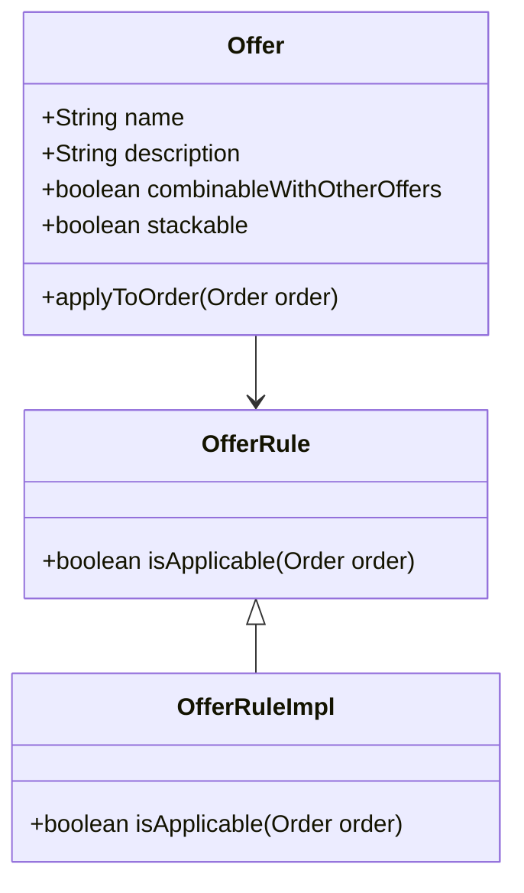

# Exploring Offer Domain

The domain in the Offer package refers to the set of classes and interfaces that define the core business logic and data structures for handling offers in the system. These classes include <SwmToken path="core/broadleaf-framework/src/main/java/org/broadleafcommerce/core/offer/domain/OfferInfo.java" pos="18:8:8" line-data="package org.broadleafcommerce.core.offer.domain;">`offer`</SwmToken>, `OfferRule`, <SwmToken path="core/broadleaf-framework/src/main/java/org/broadleafcommerce/core/offer/domain/OfferInfo.java" pos="25:4:4" line-data="public interface OfferInfo extends Serializable, MultiTenantCloneable&lt;OfferInfo&gt;{">`OfferInfo`</SwmToken>, and others, which encapsulate the properties and behaviors of different types of offers, such as discounts and promotions.

# Domain Classes

The domain classes are responsible for defining how offers are created, managed, and applied to orders, items, and customers. For example, the `OfferRuleImpl` class implements the `OfferRule` interface and contains the logic for matching rules that determine when an offer is applicable.

<SwmSnippet path="/core/broadleaf-framework/src/main/java/org/broadleafcommerce/core/offer/domain/OfferInfo.java" line="18">

---

The <SwmToken path="core/broadleaf-framework/src/main/java/org/broadleafcommerce/core/offer/domain/OfferInfo.java" pos="25:4:4" line-data="public interface OfferInfo extends Serializable, MultiTenantCloneable&lt;OfferInfo&gt;{">`OfferInfo`</SwmToken> class is part of the domain package and includes necessary imports for multi-tenancy support.

```java
package org.broadleafcommerce.core.offer.domain;

import org.broadleafcommerce.common.copy.MultiTenantCloneable;
```

---

</SwmSnippet>

# Multi-Tenancy Support

Domain classes often implement interfaces like <SwmToken path="core/broadleaf-framework/src/main/java/org/broadleafcommerce/core/offer/domain/OfferInfo.java" pos="20:10:10" line-data="import org.broadleafcommerce.common.copy.MultiTenantCloneable;">`MultiTenantCloneable`</SwmToken> to support multi-tenancy and cloning capabilities, ensuring that offers can be replicated across different tenants in a multi-tenant environment.

<SwmSnippet path="/core/broadleaf-framework/src/main/java/org/broadleafcommerce/core/offer/domain/OfferInfo.java" line="20">

---

The <SwmToken path="core/broadleaf-framework/src/main/java/org/broadleafcommerce/core/offer/domain/OfferInfo.java" pos="25:4:4" line-data="public interface OfferInfo extends Serializable, MultiTenantCloneable&lt;OfferInfo&gt;{">`OfferInfo`</SwmToken> class imports <SwmToken path="core/broadleaf-framework/src/main/java/org/broadleafcommerce/core/offer/domain/OfferInfo.java" pos="20:10:10" line-data="import org.broadleafcommerce.common.copy.MultiTenantCloneable;">`MultiTenantCloneable`</SwmToken> to support multi-tenancy.

```java
import org.broadleafcommerce.common.copy.MultiTenantCloneable;
```

---

</SwmSnippet>

# Main Functions

There are several main functions in this folder. Some of them are <SwmToken path="core/broadleaf-framework/src/main/java/org/broadleafcommerce/core/offer/domain/OfferInfo.java" pos="18:8:8" line-data="package org.broadleafcommerce.core.offer.domain;">`offer`</SwmToken>, `OfferRule`, <SwmToken path="core/broadleaf-framework/src/main/java/org/broadleafcommerce/core/offer/domain/OfferInfo.java" pos="25:4:4" line-data="public interface OfferInfo extends Serializable, MultiTenantCloneable&lt;OfferInfo&gt;{">`OfferInfo`</SwmToken>, and others. We will dive a little into <SwmToken path="core/broadleaf-framework/src/main/java/org/broadleafcommerce/core/offer/domain/OfferInfo.java" pos="18:8:8" line-data="package org.broadleafcommerce.core.offer.domain;">`offer`</SwmToken> and `OfferRule`.

## Offer

The <SwmToken path="core/broadleaf-framework/src/main/java/org/broadleafcommerce/core/offer/domain/OfferInfo.java" pos="18:8:8" line-data="package org.broadleafcommerce.core.offer.domain;">`offer`</SwmToken> class encapsulates the properties and behaviors of different types of offers, such as discounts and promotions. It defines how offers are created, managed, and applied to orders, items, and customers.

<SwmSnippet path="/common/src/main/java/org/broadleafcommerce/common/rest/api/wrapper/WrapperAdditionalFields.java" line="1">

---

The <SwmToken path="core/broadleaf-framework/src/main/java/org/broadleafcommerce/core/offer/domain/OfferInfo.java" pos="18:8:8" line-data="package org.broadleafcommerce.core.offer.domain;">`offer`</SwmToken> class is part of the common libraries and is licensed under the Broadleaf Fair Use License Agreement.

```java
/*-
 * #%L
 * BroadleafCommerce Common Libraries
 * %%
 * Copyright (C) 2009 - 2024 Broadleaf Commerce
 * %%
 * Licensed under the Broadleaf Fair Use License Agreement, Version 1.0
 * (the "Fair Use License" located  at http://license.broadleafcommerce.org/fair_use_license-1.0.txt)
 * unless the restrictions on use therein are violated and require payment to Broadleaf in which case
 * the Broadleaf End User License Agreement (EULA), Version 1.1
```

---

</SwmSnippet>

## OfferRule

The `OfferRule` interface and its implementation `OfferRuleImpl` contain the logic for matching rules that determine when an offer is applicable. This is crucial for applying the correct offers based on specific conditions.

<SwmSnippet path="/common/src/main/java/org/broadleafcommerce/common/rest/api/wrapper/WrapperAdditionalFields.java" line="11">

---

The `OfferRule` interface and its implementation `OfferRuleImpl` are part of the common libraries and are licensed under the Broadleaf Commercial License.

```java
 * (the "Commercial License" located at http://license.broadleafcommerce.org/commercial_license-1.1.txt)
 * shall apply.
 * 
 * Alternatively, the Commercial License may be replaced with a mutually agreed upon license (the "Custom License")
 * between you and Broadleaf Commerce. You may not use this file except in compliance with the applicable license.
 * #L%
 */

package org.broadleafcommerce.common.rest.api.wrapper;
```

---

</SwmSnippet>

&nbsp;

*This is an auto-generated document by Swimm AI 🌊 and has not yet been verified by a human*

<SwmMeta version="3.0.0" repo-id="Z2l0aHViJTNBJTNBQnJvYWRsZWFmQ29tbWVyY2UtZGVtby1uZXclM0ElM0FTd2ltbS1EZW1v" repo-name="BroadleafCommerce-demo-new" doc-type="overview"><sup>Powered by [Swimm](/)</sup></SwmMeta>
