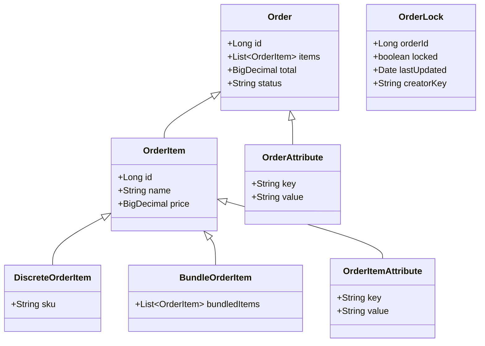

# Overview

The domain in the Order package refers to the core entities and their relationships that define the structure and behavior of orders within the Broadleaf Commerce framework. These domain entities include classes such as <SwmToken path="core/broadleaf-framework/src/main/java/org/broadleafcommerce/core/order/domain/OrderLock.java" pos="23:17:17" line-data=" * Domain object used to synchronize {@link Order} operations.">`Order`</SwmToken>, `OrderItem`, `OrderAttribute`, and `OrderItemAttribute`, which represent the various components and attributes of an order.

# Order Class

The <SwmToken path="core/broadleaf-framework/src/main/java/org/broadleafcommerce/core/order/domain/OrderLock.java" pos="23:17:17" line-data=" * Domain object used to synchronize {@link Order} operations.">`Order`</SwmToken> class is the primary entity that encapsulates the details of a customer's order, including items, pricing, and fulfillment information. It serves as the central point for managing all aspects of an order, from creation to completion.

# OrderItem Class

The `OrderItem` class represents individual items within an order. It can be further specialized into types like `DiscreteOrderItem` and `BundleOrderItem`, allowing for a flexible representation of different kinds of products within an order.

# Order Attributes

Attributes related to orders and order items, such as custom properties or additional metadata, are managed by the `OrderAttribute` and `OrderItemAttribute` classes. These attributes provide additional flexibility and customization for order management.

# <SwmToken path="core/broadleaf-framework/src/main/java/org/broadleafcommerce/core/order/domain/OrderLock.java" pos="27:4:4" line-data="public interface OrderLock extends Serializable {">`OrderLock`</SwmToken> Interface

The <SwmToken path="core/broadleaf-framework/src/main/java/org/broadleafcommerce/core/order/domain/OrderLock.java" pos="27:4:4" line-data="public interface OrderLock extends Serializable {">`OrderLock`</SwmToken> interface is a domain object used to synchronize <SwmToken path="core/broadleaf-framework/src/main/java/org/broadleafcommerce/core/order/domain/OrderLock.java" pos="23:17:17" line-data=" * Domain object used to synchronize {@link Order} operations.">`Order`</SwmToken> operations. It provides methods to get and set the order ID, lock state, last updated time, and a key identifying the creator of the lock.

<SwmSnippet path="/core/broadleaf-framework/src/main/java/org/broadleafcommerce/core/order/domain/OrderLock.java" line="22">

---

The <SwmToken path="core/broadleaf-framework/src/main/java/org/broadleafcommerce/core/order/domain/OrderLock.java" pos="27:4:4" line-data="public interface OrderLock extends Serializable {">`OrderLock`</SwmToken> interface defines methods to manage order locks, ensuring that order operations are synchronized. This is crucial for maintaining data integrity in concurrent environments.

```java
/**
 * Domain object used to synchronize {@link Order} operations.
 * 
 * @author Andre Azzolini (apazzolini)
 */
public interface OrderLock extends Serializable {

    /**
     * @return the id of the {@link Order} associated with this OrderLock
     */
    public Long getOrderId();

    /**
     * Sets the id of the {@link Order} associated with this OrderLock
     * 
     * @param orderId
     */
    public void setOrderId(Long orderId);

    /**
     * @return whether or not this OrderLock is currently locked
```

---

</SwmSnippet>

&nbsp;

*This is an auto-generated document by Swimm AI 🌊 and has not yet been verified by a human*

<SwmMeta version="3.0.0" repo-id="Z2l0aHViJTNBJTNBQnJvYWRsZWFmQ29tbWVyY2UtZGVtby1uZXclM0ElM0FTd2ltbS1EZW1v" repo-name="BroadleafCommerce-demo-new" doc-type="overview"><sup>Powered by [Swimm](/)</sup></SwmMeta>
