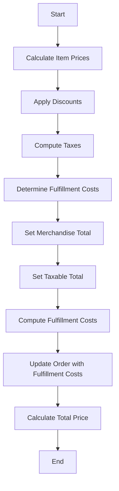

# Overview

The pricing workflow in Broadleaf Commerce involves a series of activities and processes to determine the final price of an order. This includes calculating item prices, applying discounts, computing taxes, and determining fulfillment costs.

# Fulfillment Item Pricing

The `FulfillmentItemPricingActivity` is responsible for setting each item's merchandise total and taxable total during the pricing workflow. It ensures that the total price for each item is accurately calculated and any necessary adjustments are made.

<SwmSnippet path="/core/broadleaf-framework/src/main/java/org/broadleafcommerce/core/pricing/service/workflow/CompositeActivity.java" line="43">

---

The <SwmToken path="core/broadleaf-framework/src/main/java/org/broadleafcommerce/core/pricing/service/workflow/CompositeActivity.java" pos="43:5:5" line-data="    public void setWorkflow(Processor workflow) {">`setWorkflow`</SwmToken> method is used to set the workflow for the pricing process. This method takes a <SwmToken path="core/broadleaf-framework/src/main/java/org/broadleafcommerce/core/pricing/service/workflow/CompositeActivity.java" pos="43:7:7" line-data="    public void setWorkflow(Processor workflow) {">`Processor`</SwmToken> object as a parameter and assigns it to the <SwmToken path="core/broadleaf-framework/src/main/java/org/broadleafcommerce/core/pricing/service/workflow/CompositeActivity.java" pos="43:9:9" line-data="    public void setWorkflow(Processor workflow) {">`workflow`</SwmToken> variable.

```java
    public void setWorkflow(Processor workflow) {
        this.workflow = workflow;
    }
```

---

</SwmSnippet>

# Fulfillment Group Pricing

The <SwmToken path="core/broadleaf-framework/src/main/java/org/broadleafcommerce/core/pricing/service/workflow/FulfillmentGroupPricingActivity.java" pos="42:4:4" line-data="public class FulfillmentGroupPricingActivity extends BaseActivity&lt;ProcessContext&lt;Order&gt;&gt; {">`FulfillmentGroupPricingActivity`</SwmToken> computes all fulfillment costs for the fulfillment groups on an order. It updates the order with the total price of all fulfillment groups, ensuring that shipping and handling costs are accurately reflected.

<SwmSnippet path="/core/broadleaf-framework/src/main/java/org/broadleafcommerce/core/pricing/service/workflow/FulfillmentGroupPricingActivity.java" line="57">

---

The <SwmToken path="core/broadleaf-framework/src/main/java/org/broadleafcommerce/core/pricing/service/workflow/FulfillmentGroupPricingActivity.java" pos="58:8:8" line-data="    public ProcessContext&lt;Order&gt; execute(ProcessContext&lt;Order&gt; context) throws Exception {">`execute`</SwmToken> function processes the fulfillment groups in an order to compute their fulfillment costs. It iterates through each fulfillment group, calculates the cost using the <SwmToken path="core/broadleaf-framework/src/main/java/org/broadleafcommerce/core/pricing/service/workflow/FulfillmentGroupPricingActivity.java" pos="71:5:5" line-data="                    fulfillmentGroup = fulfillmentPricingService.calculateCostForFulfillmentGroup(fulfillmentGroup);">`fulfillmentPricingService`</SwmToken>, and updates the order with the total fulfillment charges.

```java
    @Override
    public ProcessContext<Order> execute(ProcessContext<Order> context) throws Exception {
        Order order = context.getSeedData();

        /*
         * 1. Get FGs from Order
         * 2. take each FG and call shipping module with the shipping svc
         * 3. add FG back to order
         */

        Money totalFulfillmentCharges = BroadleafCurrencyUtils.getMoney(BigDecimal.ZERO, order.getCurrency());
        for (FulfillmentGroup fulfillmentGroup : order.getFulfillmentGroups()) {
            if (fulfillmentGroup != null) {
                if (!fulfillmentGroup.getShippingOverride()) {
                    fulfillmentGroup = fulfillmentPricingService.calculateCostForFulfillmentGroup(fulfillmentGroup);
                }
                if (fulfillmentGroup.getFulfillmentPrice() != null) {
                    totalFulfillmentCharges = totalFulfillmentCharges.add(fulfillmentGroup.getFulfillmentPrice());
                }
            }
        }
```

---

</SwmSnippet>

# Creating the Process Context

The <SwmToken path="core/broadleaf-framework/src/main/java/org/broadleafcommerce/core/pricing/service/workflow/PricingProcessContextFactory.java" pos="26:4:4" line-data="public class PricingProcessContextFactory implements ProcessContextFactory&lt;Order, Order&gt; {">`PricingProcessContextFactory`</SwmToken> creates the context required for the pricing workflow. It initializes the process context with the order data, allowing the workflow activities to access and modify the order as needed.

<SwmSnippet path="/core/broadleaf-framework/src/main/java/org/broadleafcommerce/core/pricing/service/workflow/PricingProcessContextFactory.java" line="26">

---

The `createProcessContext` function initializes the process context with the order data. This context is used by the workflow activities to access and modify the order as needed.

```java
public class PricingProcessContextFactory implements ProcessContextFactory<Order, Order> {
```

---

</SwmSnippet>

# Calculating the Total Price

The `TotalActivity` calculates the total price of the order, including all items, discounts, taxes, and fulfillment costs. It ensures that the final order total is accurate and reflects all pricing components.

# Main Functions

The main functions involved in the pricing workflow include <SwmToken path="core/broadleaf-framework/src/main/java/org/broadleafcommerce/core/pricing/service/workflow/CompositeActivity.java" pos="39:5:5" line-data="    public Processor getWorkflow() {">`getWorkflow`</SwmToken>, <SwmToken path="core/broadleaf-framework/src/main/java/org/broadleafcommerce/core/pricing/service/workflow/CompositeActivity.java" pos="43:5:5" line-data="    public void setWorkflow(Processor workflow) {">`setWorkflow`</SwmToken>, <SwmToken path="core/broadleaf-framework/src/main/java/org/broadleafcommerce/core/pricing/service/workflow/FulfillmentGroupPricingActivity.java" pos="58:8:8" line-data="    public ProcessContext&lt;Order&gt; execute(ProcessContext&lt;Order&gt; context) throws Exception {">`execute`</SwmToken>, and <SwmToken path="core/broadleaf-framework/src/main/java/org/broadleafcommerce/core/pricing/service/workflow/FulfillmentGroupPricingActivity.java" pos="71:7:7" line-data="                    fulfillmentGroup = fulfillmentPricingService.calculateCostForFulfillmentGroup(fulfillmentGroup);">`calculateCostForFulfillmentGroup`</SwmToken>.

<SwmSnippet path="/core/broadleaf-framework/src/main/java/org/broadleafcommerce/core/pricing/service/workflow/CompositeActivity.java" line="39">

---

The <SwmToken path="core/broadleaf-framework/src/main/java/org/broadleafcommerce/core/pricing/service/workflow/CompositeActivity.java" pos="39:5:5" line-data="    public Processor getWorkflow() {">`getWorkflow`</SwmToken> function returns the current workflow processor. This is essential for retrieving the workflow that is being executed.

```java
    public Processor getWorkflow() {
        return workflow;
    }
```

---

</SwmSnippet>

<SwmSnippet path="/core/broadleaf-framework/src/main/java/org/broadleafcommerce/core/pricing/service/workflow/FulfillmentGroupPricingActivity.java" line="71">

---

The <SwmToken path="core/broadleaf-framework/src/main/java/org/broadleafcommerce/core/pricing/service/workflow/FulfillmentGroupPricingActivity.java" pos="71:7:7" line-data="                    fulfillmentGroup = fulfillmentPricingService.calculateCostForFulfillmentGroup(fulfillmentGroup);">`calculateCostForFulfillmentGroup`</SwmToken> function in the <SwmToken path="core/broadleaf-framework/src/main/java/org/broadleafcommerce/core/pricing/service/workflow/FulfillmentGroupPricingActivity.java" pos="71:5:5" line-data="                    fulfillmentGroup = fulfillmentPricingService.calculateCostForFulfillmentGroup(fulfillmentGroup);">`fulfillmentPricingService`</SwmToken> calculates the cost for a given fulfillment group. This is used within the <SwmToken path="core/broadleaf-framework/src/main/java/org/broadleafcommerce/core/pricing/service/workflow/FulfillmentGroupPricingActivity.java" pos="58:8:8" line-data="    public ProcessContext&lt;Order&gt; execute(ProcessContext&lt;Order&gt; context) throws Exception {">`execute`</SwmToken> function to determine the shipping costs for each group.

```java
                    fulfillmentGroup = fulfillmentPricingService.calculateCostForFulfillmentGroup(fulfillmentGroup);
                }
```

---

</SwmSnippet>

&nbsp;

*This is an auto-generated document by Swimm AI 🌊 and has not yet been verified by a human*

<SwmMeta version="3.0.0" repo-id="Z2l0aHViJTNBJTNBQnJvYWRsZWFmQ29tbWVyY2UtZGVtby1uZXclM0ElM0FTd2ltbS1EZW1v" repo-name="BroadleafCommerce-demo-new" doc-type="overview"><sup>Powered by [Swimm](/)</sup></SwmMeta>
