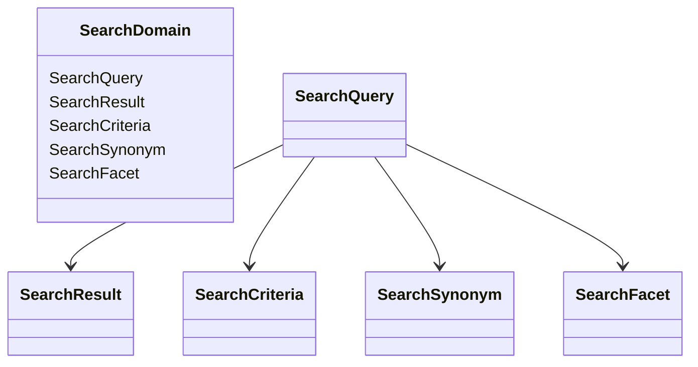

# Exploring Search Domain

The Search Domain in Broadleaf Commerce refers to the set of classes and interfaces that define the structure and behavior of search-related entities. This domain is essential for managing and executing search operations within the application, interacting with other components to facilitate efficient and accurate search functionality.

## Domain Classes

The domain includes several key classes such as <SwmToken path="core/broadleaf-framework/src/main/java/org/broadleafcommerce/core/search/domain/SearchQuery.java" pos="20:4:4" line-data="public class SearchQuery {">`SearchQuery`</SwmToken>, <SwmToken path="core/broadleaf-framework/src/main/java/org/broadleafcommerce/core/search/domain/SearchResult.java" pos="30:4:4" line-data="public class SearchResult {">`SearchResult`</SwmToken>, and <SwmToken path="core/broadleaf-framework/src/main/java/org/broadleafcommerce/core/search/domain/SearchCriteria.java" pos="34:4:4" line-data="public class SearchCriteria {">`SearchCriteria`</SwmToken>, which are used to handle search queries, results, and criteria respectively.

<SwmSnippet path="/core/broadleaf-framework/src/main/java/org/broadleafcommerce/core/search/domain/SearchQuery.java" line="9">

---

The <SwmToken path="core/broadleaf-framework/src/main/java/org/broadleafcommerce/core/search/domain/SearchQuery.java" pos="20:4:4" line-data="public class SearchQuery {">`SearchQuery`</SwmToken> class handles the construction and management of search queries. It allows users to define the parameters and conditions for their search operations, ensuring that the search criteria are accurately represented.

```java
 * unless the restrictions on use therein are violated and require payment to Broadleaf in which case
 * the Broadleaf End User License Agreement (EULA), Version 1.1
 * (the "Commercial License" located at http://license.broadleafcommerce.org/commercial_license-1.1.txt)
 * shall apply.
 * 
 * Alternatively, the Commercial License may be replaced with a mutually agreed upon license (the "Custom License")
 * between you and Broadleaf Commerce. You may not use this file except in compliance with the applicable license.
```

---

</SwmSnippet>

<SwmSnippet path="/core/broadleaf-framework/src/main/java/org/broadleafcommerce/core/search/domain/SearchResult.java" line="9">

---

The <SwmToken path="core/broadleaf-framework/src/main/java/org/broadleafcommerce/core/search/domain/SearchResult.java" pos="30:4:4" line-data="public class SearchResult {">`SearchResult`</SwmToken> class encapsulates the results of a search operation. It provides methods to access and manipulate the search results, including pagination and sorting, presenting the search outcomes to the users in an organized manner.

```java
 * unless the restrictions on use therein are violated and require payment to Broadleaf in which case
 * the Broadleaf End User License Agreement (EULA), Version 1.1
 * (the "Commercial License" located at http://license.broadleafcommerce.org/commercial_license-1.1.txt)
 * shall apply.
 * 
 * Alternatively, the Commercial License may be replaced with a mutually agreed upon license (the "Custom License")
 * between you and Broadleaf Commerce. You may not use this file except in compliance with the applicable license.
```

---

</SwmSnippet>

<SwmSnippet path="/core/broadleaf-framework/src/main/java/org/broadleafcommerce/core/search/domain/SearchCriteria.java" line="9">

---

The <SwmToken path="core/broadleaf-framework/src/main/java/org/broadleafcommerce/core/search/domain/SearchCriteria.java" pos="34:4:4" line-data="public class SearchCriteria {">`SearchCriteria`</SwmToken> class defines the specific criteria for a search operation. It includes various filters and conditions that refine the search results, playing a vital role in narrowing down the search to meet the user's exact requirements.

```java
 * unless the restrictions on use therein are violated and require payment to Broadleaf in which case
 * the Broadleaf End User License Agreement (EULA), Version 1.1
 * (the "Commercial License" located at http://license.broadleafcommerce.org/commercial_license-1.1.txt)
 * shall apply.
 * 
 * Alternatively, the Commercial License may be replaced with a mutually agreed upon license (the "Custom License")
 * between you and Broadleaf Commerce. You may not use this file except in compliance with the applicable license.
```

---

</SwmSnippet>

## Domain Interfaces

The domain also encompasses interfaces such as <SwmToken path="core/broadleaf-framework/src/main/java/org/broadleafcommerce/core/search/domain/SearchSynonym.java" pos="20:4:4" line-data="public interface SearchSynonym {">`SearchSynonym`</SwmToken> and <SwmToken path="core/broadleaf-framework/src/main/java/org/broadleafcommerce/core/search/domain/SearchFacet.java" pos="26:5:5" line-data=" * A SearchFacet is an object that represents a particular facet that can be used to guide faceted ">`SearchFacet`</SwmToken>, which provide abstractions for search synonyms and facets.

<SwmSnippet path="/core/broadleaf-framework/src/main/java/org/broadleafcommerce/core/search/domain/SearchSynonym.java" line="9">

---

The <SwmToken path="core/broadleaf-framework/src/main/java/org/broadleafcommerce/core/search/domain/SearchSynonym.java" pos="20:4:4" line-data="public interface SearchSynonym {">`SearchSynonym`</SwmToken> interface provides an abstraction for search synonyms, allowing the system to recognize and handle synonymous search terms.

```java
 * unless the restrictions on use therein are violated and require payment to Broadleaf in which case
 * the Broadleaf End User License Agreement (EULA), Version 1.1
 * (the "Commercial License" located at http://license.broadleafcommerce.org/commercial_license-1.1.txt)
 * shall apply.
 * 
 * Alternatively, the Commercial License may be replaced with a mutually agreed upon license (the "Custom License")
 * between you and Broadleaf Commerce. You may not use this file except in compliance with the applicable license.
```

---

</SwmSnippet>

<SwmSnippet path="/core/broadleaf-framework/src/main/java/org/broadleafcommerce/core/search/domain/SearchFacet.java" line="9">

---

The <SwmToken path="core/broadleaf-framework/src/main/java/org/broadleafcommerce/core/search/domain/SearchFacet.java" pos="26:5:5" line-data=" * A SearchFacet is an object that represents a particular facet that can be used to guide faceted ">`SearchFacet`</SwmToken> interface provides an abstraction for search facets, enabling the system to categorize and filter search results based on various facets.

```java
 * unless the restrictions on use therein are violated and require payment to Broadleaf in which case
 * the Broadleaf End User License Agreement (EULA), Version 1.1
 * (the "Commercial License" located at http://license.broadleafcommerce.org/commercial_license-1.1.txt)
 * shall apply.
 * 
 * Alternatively, the Commercial License may be replaced with a mutually agreed upon license (the "Custom License")
 * between you and Broadleaf Commerce. You may not use this file except in compliance with the applicable license.
```

---

</SwmSnippet>

## Main Functions

The main functions within the search domain include <SwmToken path="core/broadleaf-framework/src/main/java/org/broadleafcommerce/core/search/domain/SearchQuery.java" pos="20:4:4" line-data="public class SearchQuery {">`SearchQuery`</SwmToken>, <SwmToken path="core/broadleaf-framework/src/main/java/org/broadleafcommerce/core/search/domain/SearchResult.java" pos="30:4:4" line-data="public class SearchResult {">`SearchResult`</SwmToken>, and <SwmToken path="core/broadleaf-framework/src/main/java/org/broadleafcommerce/core/search/domain/SearchCriteria.java" pos="34:4:4" line-data="public class SearchCriteria {">`SearchCriteria`</SwmToken>. These classes are integral to the search functionality, handling the construction of search queries, encapsulating search results, and defining search criteria.

### <SwmToken path="core/broadleaf-framework/src/main/java/org/broadleafcommerce/core/search/domain/SearchResult.java" pos="30:4:4" line-data="public class SearchResult {">`SearchResult`</SwmToken>

The <SwmToken path="core/broadleaf-framework/src/main/java/org/broadleafcommerce/core/search/domain/SearchResult.java" pos="30:4:4" line-data="public class SearchResult {">`SearchResult`</SwmToken> class encapsulates the results of a search operation. It provides methods to access and manipulate the search results, including pagination and sorting, presenting the search outcomes to the users in an organized manner.

&nbsp;

*This is an auto-generated document by Swimm AI 🌊 and has not yet been verified by a human*

<SwmMeta version="3.0.0" repo-id="Z2l0aHViJTNBJTNBQnJvYWRsZWFmQ29tbWVyY2UtZGVtby1uZXclM0ElM0FTd2ltbS1EZW1v" repo-name="BroadleafCommerce-demo-new" doc-type="overview"><sup>Powered by [Swimm](/)</sup></SwmMeta>
