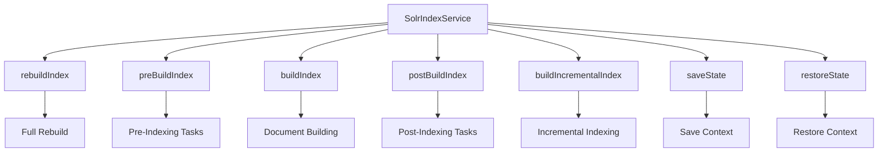

<SwmSnippet path="/core/broadleaf-framework/src/main/java/org/broadleafcommerce/core/search/service/solr/index/SolrIndexService.java" line="32">

---

# <SwmToken path="core/broadleaf-framework/src/main/java/org/broadleafcommerce/core/search/service/solr/index/SolrIndexService.java" pos="40:4:4" line-data="public interface SolrIndexService {">`SolrIndexService`</SwmToken> Interface

The <SwmToken path="core/broadleaf-framework/src/main/java/org/broadleafcommerce/core/search/service/solr/index/SolrIndexService.java" pos="40:4:4" line-data="public interface SolrIndexService {">`SolrIndexService`</SwmToken> interface exposes methods for creating and managing a Solr index, including rebuilding the index, executing indexing operations, and building incremental indexes. Key methods include <SwmToken path="core/broadleaf-framework/src/main/java/org/broadleafcommerce/core/search/service/solr/index/SolrIndexService.java" pos="60:5:5" line-data="    public void rebuildIndex() throws ServiceException, IOException;">`rebuildIndex`</SwmToken>, <SwmToken path="core/broadleaf-framework/src/main/java/org/broadleafcommerce/core/search/service/solr/index/SolrIndexService.java" pos="51:13:13" line-data="     *  &lt;li&gt;&lt;pre&gt;{@link #preBuildIndex()}&lt;/pre&gt;&lt;/li&gt;">`preBuildIndex`</SwmToken>, <SwmToken path="core/broadleaf-framework/src/main/java/org/broadleafcommerce/core/search/service/solr/index/SolrIndexService.java" pos="52:13:13" line-data="     *  &lt;li&gt;&lt;pre&gt;{@link #buildIndex()}&lt;/pre&gt;&lt;/li&gt;">`buildIndex`</SwmToken>, <SwmToken path="core/broadleaf-framework/src/main/java/org/broadleafcommerce/core/search/service/solr/index/SolrIndexService.java" pos="53:13:13" line-data="     *  &lt;li&gt;&lt;pre&gt;{@link #postBuildIndex()}&lt;/pre&gt;&lt;/li&gt;">`postBuildIndex`</SwmToken>, <SwmToken path="core/broadleaf-framework/src/main/java/org/broadleafcommerce/core/search/service/solr/index/SolrIndexService.java" pos="120:8:8" line-data="    public Collection&lt;SolrInputDocument&gt; buildIncrementalIndex(String collection, List&lt;? extends Indexable&gt; indexables, SolrClient solrServer) throws ServiceException;">`buildIncrementalIndex`</SwmToken>, <SwmToken path="core/broadleaf-framework/src/main/java/org/broadleafcommerce/core/search/service/solr/index/SolrIndexService.java" pos="140:7:7" line-data="    public Object[] saveState();">`saveState`</SwmToken>, and <SwmToken path="core/broadleaf-framework/src/main/java/org/broadleafcommerce/core/search/service/solr/index/SolrIndexService.java" pos="148:5:5" line-data="    public void restoreState(Object[] pack);">`restoreState`</SwmToken>.

```java
/**
 * Service exposing several methods for creating a Solr index based on catalog product data.
 *
 * @see org.broadleafcommerce.core.search.service.solr.index.SolrIndexCachedOperation
 * @author Andre Azzolini (apazzolini)
 * @author Jeff Fischer
 * @author Phillip Verheyden (phillipuniverse)
 */
public interface SolrIndexService {

    /**
     * <p>
     * Executes a full rebuild of the Solr index. This will rebuild the index on a separate core/collection and then swap
     * out the active core/collection with the new version of the index (essentially replacing all documents that are
     * currently in the index).
     * 
     * <p>
     * The order of methods that are apart of rebuilding the entire index:
     * <ol>
```

---

</SwmSnippet>

# Key Methods in <SwmToken path="core/broadleaf-framework/src/main/java/org/broadleafcommerce/core/search/service/solr/index/SolrIndexService.java" pos="40:4:4" line-data="public interface SolrIndexService {">`SolrIndexService`</SwmToken>

### <SwmToken path="core/broadleaf-framework/src/main/java/org/broadleafcommerce/core/search/service/solr/index/SolrIndexService.java" pos="60:5:5" line-data="    public void rebuildIndex() throws ServiceException, IOException;">`rebuildIndex`</SwmToken>

Executes a full rebuild of the Solr index, replacing all documents currently in the index.

### <SwmToken path="core/broadleaf-framework/src/main/java/org/broadleafcommerce/core/search/service/solr/index/SolrIndexService.java" pos="51:13:13" line-data="     *  &lt;li&gt;&lt;pre&gt;{@link #preBuildIndex()}&lt;/pre&gt;&lt;/li&gt;">`preBuildIndex`</SwmToken>

Executed before any indexing when rebuilding the index, usually handling the deletion of the current index.

### <SwmToken path="core/broadleaf-framework/src/main/java/org/broadleafcommerce/core/search/service/solr/index/SolrIndexService.java" pos="52:13:13" line-data="     *  &lt;li&gt;&lt;pre&gt;{@link #buildIndex()}&lt;/pre&gt;&lt;/li&gt;">`buildIndex`</SwmToken>

Handles the document building for the current index rebuild, creating and executing <SwmToken path="core/broadleaf-framework/src/main/java/org/broadleafcommerce/core/search/service/solr/index/SolrIndexOperation.java" pos="32:27:27" line-data=" *  are executed in order during different phases of {@link SolrIndexService#executeSolrIndexOperation(SolrIndexOperation)}.">`SolrIndexOperation`</SwmToken>s.

### <SwmToken path="core/broadleaf-framework/src/main/java/org/broadleafcommerce/core/search/service/solr/index/SolrIndexService.java" pos="53:13:13" line-data="     *  &lt;li&gt;&lt;pre&gt;{@link #postBuildIndex()}&lt;/pre&gt;&lt;/li&gt;">`postBuildIndex`</SwmToken>

Executed after indexing, usually handling the optimization of the index and swapping the cores.

### <SwmToken path="core/broadleaf-framework/src/main/java/org/broadleafcommerce/core/search/service/solr/index/SolrIndexService.java" pos="120:8:8" line-data="    public Collection&lt;SolrInputDocument&gt; buildIncrementalIndex(String collection, List&lt;? extends Indexable&gt; indexables, SolrClient solrServer) throws ServiceException;">`buildIncrementalIndex`</SwmToken>

Builds a set of <SwmToken path="core/broadleaf-framework/src/main/java/org/broadleafcommerce/core/search/service/solr/index/SolrIndexService.java" pos="25:12:12" line-data="import org.broadleafcommerce.core.catalog.domain.Indexable;">`Indexable`</SwmToken>s against a given <SwmToken path="core/broadleaf-framework/src/main/java/org/broadleafcommerce/core/search/service/solr/index/SolrIndexService.java" pos="111:29:29" line-data="     * Builds a set of {@link Indexable}s against the given {@link SolrServer}">`SolrServer`</SwmToken>, adding and committing the indexed documents to the server if specified.

### <SwmToken path="core/broadleaf-framework/src/main/java/org/broadleafcommerce/core/search/service/solr/index/SolrIndexService.java" pos="140:7:7" line-data="    public Object[] saveState();">`saveState`</SwmToken> and <SwmToken path="core/broadleaf-framework/src/main/java/org/broadleafcommerce/core/search/service/solr/index/SolrIndexService.java" pos="148:5:5" line-data="    public void restoreState(Object[] pack);">`restoreState`</SwmToken>

Manage the global context that might be altered during indexing.

<SwmSnippet path="/core/broadleaf-framework/src/main/java/org/broadleafcommerce/core/search/service/solr/index/IndexStatusInfo.java" line="23">

---

# <SwmToken path="core/broadleaf-framework/src/main/java/org/broadleafcommerce/core/search/service/solr/index/IndexStatusInfo.java" pos="28:4:4" line-data="public interface IndexStatusInfo {">`IndexStatusInfo`</SwmToken> Interface

The <SwmToken path="core/broadleaf-framework/src/main/java/org/broadleafcommerce/core/search/service/solr/index/IndexStatusInfo.java" pos="28:4:4" line-data="public interface IndexStatusInfo {">`IndexStatusInfo`</SwmToken> interface provides methods to get and set information about the current status of a Solr instance's index, including the most recent index date, additional information, index errors, and dead index events.

```java
/**
 * General information about the current status of a (embedded) Solr instance's index
 *
 * @author Jeff Fischer
 */
public interface IndexStatusInfo {

    /**
     * The most recent index date
     *
     * @return
     */
    Date getLastIndexDate();

    void setLastIndexDate(Date lastIndexDate);

    /**
     * Arbitrary information about the index.
     *
     * @return
     */
```

---

</SwmSnippet>

<SwmSnippet path="/core/broadleaf-framework/src/main/java/org/broadleafcommerce/core/search/service/solr/index/SolrIndexStatusServiceImpl.java" line="43">

---

# <SwmToken path="core/broadleaf-framework/src/main/java/org/broadleafcommerce/core/search/service/solr/index/SolrIndexStatusServiceImpl.java" pos="35:4:4" line-data="public class SolrIndexStatusServiceImpl implements SolrIndexStatusService {">`SolrIndexStatusServiceImpl`</SwmToken> Class

The <SwmToken path="core/broadleaf-framework/src/main/java/org/broadleafcommerce/core/search/service/solr/index/SolrIndexStatusServiceImpl.java" pos="35:4:4" line-data="public class SolrIndexStatusServiceImpl implements SolrIndexStatusService {">`SolrIndexStatusServiceImpl`</SwmToken> class implements methods to manage the index status, such as setting the index status, adding index status, and retrieving the index status.

```java
    @Override
    public synchronized void setIndexStatus(IndexStatusInfo status) {
        clearErrorStatus(status);
        updateIndexStatus(status);
    }

    @Override
    public void addIndexStatus(Long eventId, Date eventCreatedDate) {
        IndexStatusInfo statusInfo = getSeedStatusInstance();
        statusInfo.setLastIndexDate(eventCreatedDate);
        statusInfo.getAdditionalInfo().put(String.format("SystemEventId%s", eventId), String.valueOf(eventId));
        setIndexStatus(statusInfo);
    }
    
    @Override
    public synchronized IndexStatusInfo getIndexStatus() {
        IndexStatusInfo status = getSeedStatusInstance();
        for (SolrIndexStatusProvider provider : providers) {
            provider.readIndexStatus(status);
        }
        return status;
```

---

</SwmSnippet>

<SwmSnippet path="/core/broadleaf-framework/src/main/java/org/broadleafcommerce/core/search/service/solr/index/SolrIndexOperation.java" line="30">

---

# <SwmToken path="core/broadleaf-framework/src/main/java/org/broadleafcommerce/core/search/service/solr/index/SolrIndexOperation.java" pos="32:27:27" line-data=" *  are executed in order during different phases of {@link SolrIndexService#executeSolrIndexOperation(SolrIndexOperation)}.">`SolrIndexOperation`</SwmToken> Interface

The <SwmToken path="core/broadleaf-framework/src/main/java/org/broadleafcommerce/core/search/service/solr/index/SolrIndexOperation.java" pos="32:27:27" line-data=" *  are executed in order during different phases of {@link SolrIndexService#executeSolrIndexOperation(SolrIndexOperation)}.">`SolrIndexOperation`</SwmToken> interface defines the lifecycle of an indexing operation, including methods to obtain a lock, get the Solr server and collection for indexing, count indexable items, read indexable items, build pages, and release the lock.

```java
/**
 *  Defines the lifecylce of an indexing operation used in {@link SolrIndexService}. Each of the methods in this interface
 *  are executed in order during different phases of {@link SolrIndexService#executeSolrIndexOperation(SolrIndexOperation)}.
 *
 * @author Phillip Verheyden (phillipuniverse)
 */
public interface SolrIndexOperation {

    /**
     * Grab some sort of lock so that nothing else can index items at the same time
     */
    public boolean obtainLock();
    
    /**
     * Which {@link SolrClient} the index should be built on
     */
    public SolrClient getSolrServerForIndexing();

    /**
     * Which collection the index should be built on
     */
```

---

</SwmSnippet>

&nbsp;

*This is an auto-generated document by Swimm AI 🌊 and has not yet been verified by a human*

<SwmMeta version="3.0.0" repo-id="Z2l0aHViJTNBJTNBQnJvYWRsZWFmQ29tbWVyY2UtZGVtby1uZXclM0ElM0FTd2ltbS1EZW1v" repo-name="BroadleafCommerce-demo-new" doc-type="overview"><sup>Powered by [Swimm](/)</sup></SwmMeta>
