In this document, we will explain the process of fetching an entity and converting it into a dynamic format. The process involves retrieving the entity based on its ID, ensuring the field map is refreshed, and converting the entity into a dynamic format with all necessary metadata and properties.

The flow starts by fetching the entity using its ID. Once the entity is retrieved, its field map is refreshed to ensure it reflects any recent changes. The entity is then converted into a dynamic format, which includes iterating over field groups and definitions to create properties and set their values. This ensures that the dynamic entity includes all necessary metadata and properties.

# Flow drill down

```mermaid
graph TD;
      subgraph admin/broadleaf-contentmanagement-module/src/main/java/org/broadleafcommerce/cms/admin/server/handler
1f80efaec0f2f77c45b6686442bf51bc23d62d9d7dc9b6adcbb7371fe67dc757(fetch):::mainFlowStyle --> 25f9121324ed0475ac89f92cd8273f44d21b339d2e1019631fd226b82917d5f4(fetchEntityBasedOnId):::mainFlowStyle
end

subgraph admin/broadleaf-contentmanagement-module/src/main/java/org/broadleafcommerce/cms/admin/server/handler
25f9121324ed0475ac89f92cd8273f44d21b339d2e1019631fd226b82917d5f4(fetchEntityBasedOnId):::mainFlowStyle --> aca8d9c09cd107699549d8b7a2dc15c5abec92dd665ebd9bd785a483f4d22493(fetchDynamicEntity):::mainFlowStyle
end

subgraph admin/broadleaf-contentmanagement-module/src/main/java/org/broadleafcommerce/cms/admin/server/handler
aca8d9c09cd107699549d8b7a2dc15c5abec92dd665ebd9bd785a483f4d22493(fetchDynamicEntity):::mainFlowStyle --> 273647d8e3ce96335b6b2000f4e38403f6bf66e70daedf87c721b6f53c3ace6e(add):::mainFlowStyle
end

subgraph admin/broadleaf-contentmanagement-module/src/main/java/org/broadleafcommerce/cms/admin/server/handler
273647d8e3ce96335b6b2000f4e38403f6bf66e70daedf87c721b6f53c3ace6e(add):::mainFlowStyle --> 6dd4b61f03168880c5897f02ab60b7c4ad9d47376d38b284fe59568d0d9338c8(addOrUpdate):::mainFlowStyle
end

subgraph admin/broadleaf-contentmanagement-module/src/main/java/org/broadleafcommerce/cms/admin/server/handler
6dd4b61f03168880c5897f02ab60b7c4ad9d47376d38b284fe59568d0d9338c8(addOrUpdate):::mainFlowStyle --> 509fb5de4cc84f221eec2329dcf050fd604dac729f1f281f8f9bd13b26166aa9(getFieldGroups):::mainFlowStyle
end

subgraph admin/broadleaf-contentmanagement-module/src/main/java/org/broadleafcommerce/cms/admin/server/handler
509fb5de4cc84f221eec2329dcf050fd604dac729f1f281f8f9bd13b26166aa9(getFieldGroups):::mainFlowStyle --> 36360b6282409c6ff71efda7ffcf6c5e665a411b5978a733d847845ce294b16c(add):::mainFlowStyle
end

subgraph admin/broadleaf-contentmanagement-module/src/main/java/org/broadleafcommerce/cms/admin/server/handler
36360b6282409c6ff71efda7ffcf6c5e665a411b5978a733d847845ce294b16c(add):::mainFlowStyle --> 73e08a045f29e25989baee4fc7715bdb102a02a6332fae6179b4da2c166813e0(addOrUpdate):::mainFlowStyle
end

subgraph admin/broadleaf-contentmanagement-module/src/main/java/org/broadleafcommerce/cms/admin/server/handler
73e08a045f29e25989baee4fc7715bdb102a02a6332fae6179b4da2c166813e0(addOrUpdate):::mainFlowStyle --> 45e23c2854c375c1383294d3b0b8fc0ef97ada36571a8a9f1755a7629a683568(buildDynamicPropertyList):::mainFlowStyle
end

subgraph admin/broadleaf-contentmanagement-module/src/main/java/org/broadleafcommerce/cms/admin/server/handler
45e23c2854c375c1383294d3b0b8fc0ef97ada36571a8a9f1755a7629a683568(buildDynamicPropertyList):::mainFlowStyle --> 689c054fe4559f5e62d9ce806f069d2b9091d841fd2a5fc4de995bcdbc009c5e(constructPropertiesFromFieldGroup):::mainFlowStyle
end

subgraph admin/broadleaf-contentmanagement-module/src/main/java/org/broadleafcommerce/cms/admin/server/handler
689c054fe4559f5e62d9ce806f069d2b9091d841fd2a5fc4de995bcdbc009c5e(constructPropertiesFromFieldGroup):::mainFlowStyle --> 6363b5de56b25687ab9d9d007d70eaca25204239aafb715b799f3f70bbfe0e9b(buildDynamicProperty):::mainFlowStyle
end


      classDef mainFlowStyle color:#000000,fill:#7CB9F4
classDef rootsStyle color:#000000,fill:#00FFF4
classDef Style1 color:#000000,fill:#00FFAA
classDef Style2 color:#000000,fill:#FFFF00
classDef Style3 color:#000000,fill:#AA7CB9

%% Swimm:
%% graph TD;
%%       subgraph <SwmPath>[admin/broadleaf-contentmanagement-module/src/main/java/org/broadleafcommerce/cms/admin/server/handler/](admin/broadleaf-contentmanagement-module/src/main/java/org/broadleafcommerce/cms/admin/server/handler/)</SwmPath>
%% 1f80efaec0f2f77c45b6686442bf51bc23d62d9d7dc9b6adcbb7371fe67dc757(fetch):::mainFlowStyle --> 25f9121324ed0475ac89f92cd8273f44d21b339d2e1019631fd226b82917d5f4(fetchEntityBasedOnId):::mainFlowStyle
%% end
%% 
%% subgraph <SwmPath>[admin/broadleaf-contentmanagement-module/src/main/java/org/broadleafcommerce/cms/admin/server/handler/](admin/broadleaf-contentmanagement-module/src/main/java/org/broadleafcommerce/cms/admin/server/handler/)</SwmPath>
%% 25f9121324ed0475ac89f92cd8273f44d21b339d2e1019631fd226b82917d5f4(fetchEntityBasedOnId):::mainFlowStyle --> aca8d9c09cd107699549d8b7a2dc15c5abec92dd665ebd9bd785a483f4d22493(fetchDynamicEntity):::mainFlowStyle
%% end
%% 
%% subgraph <SwmPath>[admin/broadleaf-contentmanagement-module/src/main/java/org/broadleafcommerce/cms/admin/server/handler/](admin/broadleaf-contentmanagement-module/src/main/java/org/broadleafcommerce/cms/admin/server/handler/)</SwmPath>
%% aca8d9c09cd107699549d8b7a2dc15c5abec92dd665ebd9bd785a483f4d22493(fetchDynamicEntity):::mainFlowStyle --> 273647d8e3ce96335b6b2000f4e38403f6bf66e70daedf87c721b6f53c3ace6e(add):::mainFlowStyle
%% end
%% 
%% subgraph <SwmPath>[admin/broadleaf-contentmanagement-module/src/main/java/org/broadleafcommerce/cms/admin/server/handler/](admin/broadleaf-contentmanagement-module/src/main/java/org/broadleafcommerce/cms/admin/server/handler/)</SwmPath>
%% 273647d8e3ce96335b6b2000f4e38403f6bf66e70daedf87c721b6f53c3ace6e(add):::mainFlowStyle --> 6dd4b61f03168880c5897f02ab60b7c4ad9d47376d38b284fe59568d0d9338c8(addOrUpdate):::mainFlowStyle
%% end
%% 
%% subgraph <SwmPath>[admin/broadleaf-contentmanagement-module/src/main/java/org/broadleafcommerce/cms/admin/server/handler/](admin/broadleaf-contentmanagement-module/src/main/java/org/broadleafcommerce/cms/admin/server/handler/)</SwmPath>
%% 6dd4b61f03168880c5897f02ab60b7c4ad9d47376d38b284fe59568d0d9338c8(addOrUpdate):::mainFlowStyle --> 509fb5de4cc84f221eec2329dcf050fd604dac729f1f281f8f9bd13b26166aa9(getFieldGroups):::mainFlowStyle
%% end
%% 
%% subgraph <SwmPath>[admin/broadleaf-contentmanagement-module/src/main/java/org/broadleafcommerce/cms/admin/server/handler/](admin/broadleaf-contentmanagement-module/src/main/java/org/broadleafcommerce/cms/admin/server/handler/)</SwmPath>
%% 509fb5de4cc84f221eec2329dcf050fd604dac729f1f281f8f9bd13b26166aa9(getFieldGroups):::mainFlowStyle --> 36360b6282409c6ff71efda7ffcf6c5e665a411b5978a733d847845ce294b16c(add):::mainFlowStyle
%% end
%% 
%% subgraph <SwmPath>[admin/broadleaf-contentmanagement-module/src/main/java/org/broadleafcommerce/cms/admin/server/handler/](admin/broadleaf-contentmanagement-module/src/main/java/org/broadleafcommerce/cms/admin/server/handler/)</SwmPath>
%% 36360b6282409c6ff71efda7ffcf6c5e665a411b5978a733d847845ce294b16c(add):::mainFlowStyle --> 73e08a045f29e25989baee4fc7715bdb102a02a6332fae6179b4da2c166813e0(addOrUpdate):::mainFlowStyle
%% end
%% 
%% subgraph <SwmPath>[admin/broadleaf-contentmanagement-module/src/main/java/org/broadleafcommerce/cms/admin/server/handler/](admin/broadleaf-contentmanagement-module/src/main/java/org/broadleafcommerce/cms/admin/server/handler/)</SwmPath>
%% 73e08a045f29e25989baee4fc7715bdb102a02a6332fae6179b4da2c166813e0(addOrUpdate):::mainFlowStyle --> 45e23c2854c375c1383294d3b0b8fc0ef97ada36571a8a9f1755a7629a683568(buildDynamicPropertyList):::mainFlowStyle
%% end
%% 
%% subgraph <SwmPath>[admin/broadleaf-contentmanagement-module/src/main/java/org/broadleafcommerce/cms/admin/server/handler/](admin/broadleaf-contentmanagement-module/src/main/java/org/broadleafcommerce/cms/admin/server/handler/)</SwmPath>
%% 45e23c2854c375c1383294d3b0b8fc0ef97ada36571a8a9f1755a7629a683568(buildDynamicPropertyList):::mainFlowStyle --> 689c054fe4559f5e62d9ce806f069d2b9091d841fd2a5fc4de995bcdbc009c5e(constructPropertiesFromFieldGroup):::mainFlowStyle
%% end
%% 
%% subgraph <SwmPath>[admin/broadleaf-contentmanagement-module/src/main/java/org/broadleafcommerce/cms/admin/server/handler/](admin/broadleaf-contentmanagement-module/src/main/java/org/broadleafcommerce/cms/admin/server/handler/)</SwmPath>
%% 689c054fe4559f5e62d9ce806f069d2b9091d841fd2a5fc4de995bcdbc009c5e(constructPropertiesFromFieldGroup):::mainFlowStyle --> 6363b5de56b25687ab9d9d007d70eaca25204239aafb715b799f3f70bbfe0e9b(buildDynamicProperty):::mainFlowStyle
%% end
%% 
%% 
%%       classDef mainFlowStyle color:#000000,fill:#7CB9F4
%% classDef rootsStyle color:#000000,fill:#00FFF4
%% classDef Style1 color:#000000,fill:#00FFAA
%% classDef Style2 color:#000000,fill:#FFFF00
%% classDef Style3 color:#000000,fill:#AA7CB9
```



<SwmSnippet path="/admin/broadleaf-contentmanagement-module/src/main/java/org/broadleafcommerce/cms/admin/server/handler/StructuredContentTypeCustomPersistenceHandler.java" line="138">

---

## Fetching the Entity

The <SwmToken path="admin/broadleaf-contentmanagement-module/src/main/java/org/broadleafcommerce/cms/admin/server/handler/StructuredContentTypeCustomPersistenceHandler.java" pos="139:5:5" line-data="    public DynamicResultSet fetch(PersistencePackage persistencePackage, CriteriaTransferObject cto, DynamicEntityDao dynamicEntityDao, RecordHelper helper) throws ServiceException {">`fetch`</SwmToken> method initiates the process by retrieving the entity based on its ID. It calls <SwmToken path="admin/broadleaf-contentmanagement-module/src/main/java/org/broadleafcommerce/cms/admin/server/handler/StructuredContentTypeCustomPersistenceHandler.java" pos="143:7:7" line-data="            Entity entity = fetchEntityBasedOnId(structuredContentId, null);">`fetchEntityBasedOnId`</SwmToken> to get the entity and wraps it in a <SwmToken path="admin/broadleaf-contentmanagement-module/src/main/java/org/broadleafcommerce/cms/admin/server/handler/StructuredContentTypeCustomPersistenceHandler.java" pos="139:3:3" line-data="    public DynamicResultSet fetch(PersistencePackage persistencePackage, CriteriaTransferObject cto, DynamicEntityDao dynamicEntityDao, RecordHelper helper) throws ServiceException {">`DynamicResultSet`</SwmToken>.

```java
    @Override
    public DynamicResultSet fetch(PersistencePackage persistencePackage, CriteriaTransferObject cto, DynamicEntityDao dynamicEntityDao, RecordHelper helper) throws ServiceException {
        String ceilingEntityFullyQualifiedClassname = persistencePackage.getCeilingEntityFullyQualifiedClassname();
        try {
            String structuredContentId = persistencePackage.getCustomCriteria()[1];
            Entity entity = fetchEntityBasedOnId(structuredContentId, null);
            DynamicResultSet results = new DynamicResultSet(new Entity[]{entity}, 1);

            return results;
        } catch (Exception e) {
            throw new ServiceException("Unable to perform fetch for entity: "+ceilingEntityFullyQualifiedClassname, e);
        }
    }
```

---

</SwmSnippet>

<SwmSnippet path="/admin/broadleaf-contentmanagement-module/src/main/java/org/broadleafcommerce/cms/admin/server/handler/StructuredContentTypeCustomPersistenceHandler.java" line="152">

---

### Fetching Entity Based on ID

The <SwmToken path="admin/broadleaf-contentmanagement-module/src/main/java/org/broadleafcommerce/cms/admin/server/handler/StructuredContentTypeCustomPersistenceHandler.java" pos="153:5:5" line-data="    public Entity fetchEntityBasedOnId(String structuredContentId, List&lt;String&gt; dirtyFields) throws Exception {">`fetchEntityBasedOnId`</SwmToken> method retrieves the <SwmToken path="admin/broadleaf-contentmanagement-module/src/main/java/org/broadleafcommerce/cms/admin/server/handler/StructuredContentTypeCustomPersistenceHandler.java" pos="154:1:1" line-data="        StructuredContent structuredContent = structuredContentService.findStructuredContentById(Long.valueOf(structuredContentId));">`StructuredContent`</SwmToken> entity using its ID and ensures the field map is refreshed from the database. It then calls <SwmToken path="admin/broadleaf-contentmanagement-module/src/main/java/org/broadleafcommerce/cms/admin/server/handler/StructuredContentTypeCustomPersistenceHandler.java" pos="157:3:3" line-data="        return fetchDynamicEntity(structuredContent, dirtyFields, true);">`fetchDynamicEntity`</SwmToken> to convert the entity into a dynamic format.

```java
    @Override
    public Entity fetchEntityBasedOnId(String structuredContentId, List<String> dirtyFields) throws Exception {
        StructuredContent structuredContent = structuredContentService.findStructuredContentById(Long.valueOf(structuredContentId));
        //Make sure the fieldmap is refreshed from the database based on any changes introduced in addOrUpdate()
        em.refresh(structuredContent);
        return fetchDynamicEntity(structuredContent, dirtyFields, true);
    }
```

---

</SwmSnippet>

<SwmSnippet path="/admin/broadleaf-contentmanagement-module/src/main/java/org/broadleafcommerce/cms/admin/server/handler/StructuredContentTypeCustomPersistenceHandler.java" line="165">

---

### Fetching Dynamic Entity

The <SwmToken path="admin/broadleaf-contentmanagement-module/src/main/java/org/broadleafcommerce/cms/admin/server/handler/StructuredContentTypeCustomPersistenceHandler.java" pos="166:5:5" line-data="    public Entity fetchDynamicEntity(Serializable root, List&lt;String&gt; dirtyFields, boolean includeId) throws Exception {">`fetchDynamicEntity`</SwmToken> method converts the <SwmToken path="admin/broadleaf-contentmanagement-module/src/main/java/org/broadleafcommerce/cms/admin/server/handler/StructuredContentTypeCustomPersistenceHandler.java" pos="167:1:1" line-data="        StructuredContent structuredContent = (StructuredContent) root;">`StructuredContent`</SwmToken> entity into a dynamic entity. It iterates over the field groups and definitions, creating properties for each field and setting their values. This method ensures that the dynamic entity includes all necessary metadata and properties.

```java
    @Override
    public Entity fetchDynamicEntity(Serializable root, List<String> dirtyFields, boolean includeId) throws Exception {
        StructuredContent structuredContent = (StructuredContent) root;
        Map<String, StructuredContentFieldXref> structuredContentFieldMap = structuredContent.getStructuredContentFieldXrefs();
        Entity entity = new Entity();
        entity.setType(new String[]{StructuredContentType.class.getName()});
        List<Property> propertiesList = new ArrayList<Property>();
        for (FieldGroup fieldGroup : structuredContent.getStructuredContentType().getStructuredContentFieldTemplate().getFieldGroups()) {
            for (FieldDefinition def : fieldGroup.getFieldDefinitions()) {
                Property property = new Property();
                property.setName(def.getName());
                String value = null;
                if (!MapUtils.isEmpty(structuredContentFieldMap)) {
                    StructuredContentFieldXref structuredContentFieldXref = structuredContentFieldMap.get(def.getName());
                    if (structuredContentFieldXref != null) {
                        StructuredContentField structuredContentField = structuredContentFieldXref.getStructuredContentField();
                        if (structuredContentField != null) {
                            value = structuredContentField.getValue();
                        }
                    }
                }
```

---

</SwmSnippet>

<SwmSnippet path="/admin/broadleaf-contentmanagement-module/src/main/java/org/broadleafcommerce/cms/admin/server/handler/StructuredContentTypeCustomPersistenceHandler.java" line="227">

---

## Adding or Updating the Entity

The <SwmToken path="admin/broadleaf-contentmanagement-module/src/main/java/org/broadleafcommerce/cms/admin/server/handler/StructuredContentTypeCustomPersistenceHandler.java" pos="227:5:5" line-data="    protected Entity addOrUpdate(PersistencePackage persistencePackage, DynamicEntityDao dynamicEntityDao, RecordHelper helper) throws ServiceException {">`addOrUpdate`</SwmToken> method handles both adding and updating entities. It validates the dynamic fields, updates the <SwmToken path="admin/broadleaf-contentmanagement-module/src/main/java/org/broadleafcommerce/cms/admin/server/handler/StructuredContentTypeCustomPersistenceHandler.java" pos="180:1:1" line-data="                        StructuredContentField structuredContentField = structuredContentFieldXref.getStructuredContentField();">`StructuredContentField`</SwmToken> values, and merges or persists the changes. It also manages dirty fields and ensures the entity is correctly updated in the database.

```java
    protected Entity addOrUpdate(PersistencePackage persistencePackage, DynamicEntityDao dynamicEntityDao, RecordHelper helper) throws ServiceException {
        String ceilingEntityFullyQualifiedClassname = persistencePackage.getCeilingEntityFullyQualifiedClassname();
        try {
            String structuredContentId = persistencePackage.getCustomCriteria()[1];
            StructuredContent structuredContent = structuredContentService.findStructuredContentById(Long.valueOf(structuredContentId));

            Property[] properties = dynamicFieldUtil.buildDynamicPropertyList(structuredContent.getStructuredContentType().getStructuredContentFieldTemplate().getFieldGroups(), StructuredContentType.class);
            Map<String, FieldMetadata> md = new HashMap<String, FieldMetadata>();
            for (Property property : properties) {
                md.put(property.getName(), property.getMetadata());
            }

            boolean validated = helper.validate(persistencePackage.getEntity(), new StructuredContentTypeImpl(), md);
            if (!validated) {
                throw new ValidationException(persistencePackage.getEntity(), "Structured Content dynamic fields failed validation");
            }

            List<String> templateFieldNames = new ArrayList<String>(20);
            for (FieldGroup group : structuredContent.getStructuredContentType().getStructuredContentFieldTemplate().getFieldGroups()) {
                for (FieldDefinition def : group.getFieldDefinitions()) {
                    templateFieldNames.add(def.getName());
```

---

</SwmSnippet>

&nbsp;

*This is an auto-generated document by Swimm AI 🌊 and has not yet been verified by a human*

<SwmMeta version="3.0.0" repo-id="Z2l0aHViJTNBJTNBQnJvYWRsZWFmQ29tbWVyY2UtZGVtby1uZXclM0ElM0FTd2ltbS1EZW1v" repo-name="BroadleafCommerce-demo-new" doc-type="flows"><sup>Powered by [Swimm](/)</sup></SwmMeta>
