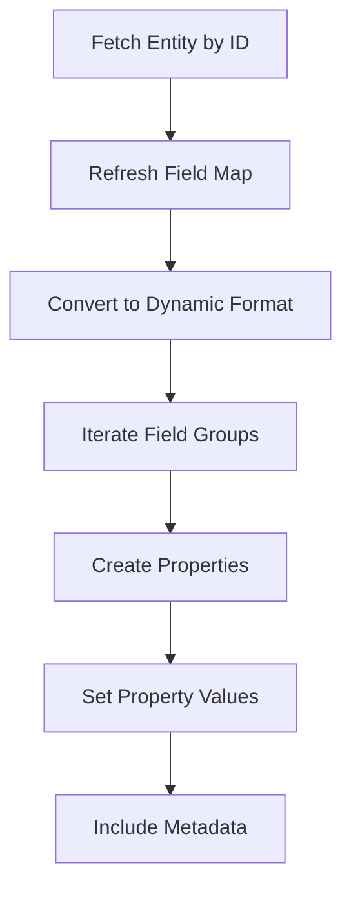

This document will cover the process of fetching and processing entities, which includes:

1. Fetching the entity based on its ID
2. Refreshing the field map
3. Converting the entity into a dynamic format

Technical document: <SwmLink doc-title="Fetching and Processing Entities">[Fetching and Processing Entities](/.swm/fetching-and-processing-entities.84cv9l7p.sw.md)</SwmLink>

# [Fetching the Entity](https://app.swimm.io/repos/Z2l0aHViJTNBJTNBQnJvYWRsZWFmQ29tbWVyY2UtZGVtby1uZXclM0ElM0FTd2ltbS1EZW1v/docs/84cv9l7p#fetching-the-entity)

The process begins by fetching the entity using its unique ID. This step ensures that we are working with the correct entity. The entity is retrieved from the database and wrapped in a `DynamicResultSet` to facilitate further processing.

# [Refreshing the Field Map](https://app.swimm.io/repos/Z2l0aHViJTNBJTNBQnJvYWRsZWFmQ29tbWVyY2UtZGVtby1uZXclM0ElM0FTd2ltbS1EZW1v/docs/84cv9l7p#fetching-entity-based-on-id)

Once the entity is fetched, its field map is refreshed. This step ensures that any recent changes to the entity's fields are reflected. The field map is a collection of all the fields associated with the entity, and refreshing it guarantees that we have the most up-to-date information.

# [Converting to Dynamic Format](https://app.swimm.io/repos/Z2l0aHViJTNBJTNBQnJvYWRsZWFmQ29tbWVyY2UtZGVtby1uZXclM0ElM0FTd2ltbS1EZW1v/docs/84cv9l7p#fetching-dynamic-entity)

The entity is then converted into a dynamic format. This involves iterating over the field groups and definitions to create properties for each field. Each property is assigned a value, ensuring that the dynamic entity includes all necessary metadata and properties. This step is crucial for making the entity adaptable and flexible for various use cases.

# [Adding or Updating the Entity](https://app.swimm.io/repos/Z2l0aHViJTNBJTNBQnJvYWRsZWFmQ29tbWVyY2UtZGVtby1uZXclM0ElM0FTd2ltbS1EZW1v/docs/84cv9l7p#adding-or-updating-the-entity)

The final step involves adding or updating the entity. This process includes validating the dynamic fields, updating the field values, and ensuring the entity is correctly updated in the database. This step is essential for maintaining data integrity and ensuring that the entity is accurately represented in the system.

&nbsp;

*This is an auto-generated document by Swimm AI 🌊 and has not yet been verified by a human*

<SwmMeta version="3.0.0" repo-id="Z2l0aHViJTNBJTNBQnJvYWRsZWFmQ29tbWVyY2UtZGVtby1uZXclM0ElM0FTd2ltbS1EZW1v" repo-name="BroadleafCommerce-demo-new" doc-type="product-flows">Powered by [Swimm](/)</SwmMeta>
