This document explains the process of fetching and processing map records. The process involves retrieving data, merging properties, constructing filter mappings, and ensuring that only one entity is returned. It also covers how map records are processed and converted into <SwmToken path="admin/broadleaf-open-admin-platform/src/main/java/org/broadleafcommerce/openadmin/server/service/persistence/module/MapStructurePersistenceModule.java" pos="169:3:3" line-data="    public Entity add(PersistencePackage persistencePackage) throws ServiceException {">`Entity`</SwmToken> objects.

The flow starts with fetching data based on certain criteria. It then merges properties and constructs filter mappings to ensure only one entity is returned. Next, it processes the retrieved records by iterating over map keys and values, filtering out map fields, and converting each entry into an <SwmToken path="admin/broadleaf-open-admin-platform/src/main/java/org/broadleafcommerce/openadmin/server/service/persistence/module/MapStructurePersistenceModule.java" pos="169:3:3" line-data="    public Entity add(PersistencePackage persistencePackage) throws ServiceException {">`Entity`</SwmToken> object. Finally, it handles the addition of new entries to the map structure and sets the value of specified fields in a given bean.

# Flow drill down

```mermaid
graph TD;
      subgraph admin/broadleaf-open-admin-platform/src/main/java/org/broadleafcommerce/openadmin/server/service/persistence/module
5b9975c4826014baa4a970f8b36389b3b1ef0b380db3b8a593c6bd223de18027(fetch):::mainFlowStyle --> 555d3bff08c82c01d7ddf7db93bd9d542b5008463348b7ef18e56b296586422a(getMapRecords):::mainFlowStyle
end

subgraph admin/broadleaf-open-admin-platform/src/main/java/org/broadleafcommerce/openadmin/server/service/persistence/module
555d3bff08c82c01d7ddf7db93bd9d542b5008463348b7ef18e56b296586422a(getMapRecords):::mainFlowStyle --> 1c298ee39ec9706bc22a5e5b62d5997ef5bc94a179c27d3ee47822bad8886b9c(getMapRecord)
end

subgraph admin/broadleaf-open-admin-platform/src/main/java/org/broadleafcommerce/openadmin/server/service/persistence/module
555d3bff08c82c01d7ddf7db93bd9d542b5008463348b7ef18e56b296586422a(getMapRecords):::mainFlowStyle --> dd6683077215bfa40cc02308ac9c6d99800864f2b5ec92600c92bb392db9b650(add):::mainFlowStyle
end

subgraph admin/broadleaf-open-admin-platform/src/main/java/org/broadleafcommerce/openadmin/server/service/persistence/module
dd6683077215bfa40cc02308ac9c6d99800864f2b5ec92600c92bb392db9b650(add):::mainFlowStyle --> e397e7a4073e60a59abecd2977d6860cc7361ba3dde7b0c462c898d8d9e01241(setFieldValue):::mainFlowStyle
end

subgraph admin/broadleaf-open-admin-platform/src/main/java/org/broadleafcommerce/openadmin/server/service/persistence/module
1c298ee39ec9706bc22a5e5b62d5997ef5bc94a179c27d3ee47822bad8886b9c(getMapRecord) --> 5a2cd347a62d6c64d7ac6e81164507333458ca3f5265c19e050b9d8900e76cd8(extractPropertiesFromPersistentEntity)
end


      classDef mainFlowStyle color:#000000,fill:#7CB9F4
classDef rootsStyle color:#000000,fill:#00FFF4
classDef Style1 color:#000000,fill:#00FFAA
classDef Style2 color:#000000,fill:#FFFF00
classDef Style3 color:#000000,fill:#AA7CB9

%% Swimm:
%% graph TD;
%%       subgraph <SwmPath>[admin/broadleaf-open-admin-platform/src/main/java/org/broadleafcommerce/openadmin/server/service/persistence/module/](admin/broadleaf-open-admin-platform/src/main/java/org/broadleafcommerce/openadmin/server/service/persistence/module/)</SwmPath>
%% 5b9975c4826014baa4a970f8b36389b3b1ef0b380db3b8a593c6bd223de18027(fetch):::mainFlowStyle --> 555d3bff08c82c01d7ddf7db93bd9d542b5008463348b7ef18e56b296586422a(getMapRecords):::mainFlowStyle
%% end
%% 
%% subgraph <SwmPath>[admin/broadleaf-open-admin-platform/src/main/java/org/broadleafcommerce/openadmin/server/service/persistence/module/](admin/broadleaf-open-admin-platform/src/main/java/org/broadleafcommerce/openadmin/server/service/persistence/module/)</SwmPath>
%% 555d3bff08c82c01d7ddf7db93bd9d542b5008463348b7ef18e56b296586422a(getMapRecords):::mainFlowStyle --> 1c298ee39ec9706bc22a5e5b62d5997ef5bc94a179c27d3ee47822bad8886b9c(getMapRecord)
%% end
%% 
%% subgraph <SwmPath>[admin/broadleaf-open-admin-platform/src/main/java/org/broadleafcommerce/openadmin/server/service/persistence/module/](admin/broadleaf-open-admin-platform/src/main/java/org/broadleafcommerce/openadmin/server/service/persistence/module/)</SwmPath>
%% 555d3bff08c82c01d7ddf7db93bd9d542b5008463348b7ef18e56b296586422a(getMapRecords):::mainFlowStyle --> dd6683077215bfa40cc02308ac9c6d99800864f2b5ec92600c92bb392db9b650(add):::mainFlowStyle
%% end
%% 
%% subgraph <SwmPath>[admin/broadleaf-open-admin-platform/src/main/java/org/broadleafcommerce/openadmin/server/service/persistence/module/](admin/broadleaf-open-admin-platform/src/main/java/org/broadleafcommerce/openadmin/server/service/persistence/module/)</SwmPath>
%% dd6683077215bfa40cc02308ac9c6d99800864f2b5ec92600c92bb392db9b650(add):::mainFlowStyle --> e397e7a4073e60a59abecd2977d6860cc7361ba3dde7b0c462c898d8d9e01241(setFieldValue):::mainFlowStyle
%% end
%% 
%% subgraph <SwmPath>[admin/broadleaf-open-admin-platform/src/main/java/org/broadleafcommerce/openadmin/server/service/persistence/module/](admin/broadleaf-open-admin-platform/src/main/java/org/broadleafcommerce/openadmin/server/service/persistence/module/)</SwmPath>
%% 1c298ee39ec9706bc22a5e5b62d5997ef5bc94a179c27d3ee47822bad8886b9c(getMapRecord) --> 5a2cd347a62d6c64d7ac6e81164507333458ca3f5265c19e050b9d8900e76cd8(extractPropertiesFromPersistentEntity)
%% end
%% 
%% 
%%       classDef mainFlowStyle color:#000000,fill:#7CB9F4
%% classDef rootsStyle color:#000000,fill:#00FFF4
%% classDef Style1 color:#000000,fill:#00FFAA
%% classDef Style2 color:#000000,fill:#FFFF00
%% classDef Style3 color:#000000,fill:#AA7CB9
```



<SwmSnippet path="/admin/broadleaf-open-admin-platform/src/main/java/org/broadleafcommerce/openadmin/server/service/persistence/module/MapStructurePersistenceModule.java" line="455">

---

## Fetching and processing map records

The <SwmToken path="admin/broadleaf-open-admin-platform/src/main/java/org/broadleafcommerce/openadmin/server/service/persistence/module/MapStructurePersistenceModule.java" pos="455:5:5" line-data="    public DynamicResultSet fetch(PersistencePackage persistencePackage, CriteriaTransferObject cto) throws ServiceException {">`fetch`</SwmToken> method is responsible for retrieving data based on the provided <SwmToken path="admin/broadleaf-open-admin-platform/src/main/java/org/broadleafcommerce/openadmin/server/service/persistence/module/MapStructurePersistenceModule.java" pos="455:7:7" line-data="    public DynamicResultSet fetch(PersistencePackage persistencePackage, CriteriaTransferObject cto) throws ServiceException {">`PersistencePackage`</SwmToken> and <SwmToken path="admin/broadleaf-open-admin-platform/src/main/java/org/broadleafcommerce/openadmin/server/service/persistence/module/MapStructurePersistenceModule.java" pos="455:12:12" line-data="    public DynamicResultSet fetch(PersistencePackage persistencePackage, CriteriaTransferObject cto) throws ServiceException {">`CriteriaTransferObject`</SwmToken>. It merges properties, constructs filter mappings, and ensures that only one entity is returned. The method then calls <SwmToken path="admin/broadleaf-open-admin-platform/src/main/java/org/broadleafcommerce/openadmin/server/service/persistence/module/MapStructurePersistenceModule.java" pos="569:7:7" line-data="    protected Entity[] getMapRecords(Serializable record,">`getMapRecords`</SwmToken> to process the retrieved records.

```java
    public DynamicResultSet fetch(PersistencePackage persistencePackage, CriteriaTransferObject cto) throws ServiceException {
        Entity[] payload;
        int totalRecords;
        String ceilingEntityFullyQualifiedClassname = persistencePackage.getCeilingEntityFullyQualifiedClassname();
        if (StringUtils.isEmpty(persistencePackage.getFetchTypeFullyQualifiedClassname())) {
            persistencePackage.setFetchTypeFullyQualifiedClassname(ceilingEntityFullyQualifiedClassname);
        }
        try {
            PersistencePerspective persistencePerspective = persistencePackage.getPersistencePerspective();
            Class<?>[] entities = persistenceManager.getPolymorphicEntities(ceilingEntityFullyQualifiedClassname);
            Map<String, FieldMetadata> mergedProperties = persistenceManager.getDynamicEntityDao().getMergedProperties(
                ceilingEntityFullyQualifiedClassname, 
                entities, 
                (ForeignKey) persistencePerspective.getPersistencePerspectiveItems().get(PersistencePerspectiveItemType.FOREIGNKEY), 
                persistencePerspective.getAdditionalNonPersistentProperties(), 
                persistencePerspective.getAdditionalForeignKeys(),
                MergedPropertyType.PRIMARY,
                persistencePerspective.getPopulateToOneFields(), 
                persistencePerspective.getIncludeFields(), 
                persistencePerspective.getExcludeFields(),
                persistencePerspective.getConfigurationKey(),
```

---

</SwmSnippet>

<SwmSnippet path="/admin/broadleaf-open-admin-platform/src/main/java/org/broadleafcommerce/openadmin/server/service/persistence/module/MapStructurePersistenceModule.java" line="569">

---

The <SwmToken path="admin/broadleaf-open-admin-platform/src/main/java/org/broadleafcommerce/openadmin/server/service/persistence/module/MapStructurePersistenceModule.java" pos="569:7:7" line-data="    protected Entity[] getMapRecords(Serializable record,">`getMapRecords`</SwmToken> method processes the map structure by iterating over the map keys and values. It filters out map fields and calls <SwmToken path="admin/broadleaf-open-admin-platform/src/main/java/org/broadleafcommerce/openadmin/server/service/persistence/module/MapStructurePersistenceModule.java" pos="603:5:5" line-data="    protected Entity getMapRecord(String ceilingClass,">`getMapRecord`</SwmToken> for each entry to convert it into an <SwmToken path="admin/broadleaf-open-admin-platform/src/main/java/org/broadleafcommerce/openadmin/server/service/persistence/module/MapStructurePersistenceModule.java" pos="569:3:3" line-data="    protected Entity[] getMapRecords(Serializable record,">`Entity`</SwmToken> object.

```java
    protected Entity[] getMapRecords(Serializable record,
                                     MapStructure mapStructure,
                                     Map<String, FieldMetadata> ceilingMergedProperties,
                                     Map<String, FieldMetadata> valueMergedProperties,
                                     Property symbolicIdProperty,
                                     String[] customCriteria) throws IllegalAccessException, InvocationTargetException, NoSuchMethodException, SecurityException, IllegalArgumentException, ClassNotFoundException, NoSuchFieldException {
        //compile a list of mapKeys that were used as mapFields
        List<String> mapFieldKeys = new ArrayList<String>();
        String mapProperty = mapStructure.getMapProperty();
        for (Map.Entry<String, FieldMetadata> entry : ceilingMergedProperties.entrySet()) {
            if (entry.getKey().startsWith(mapProperty + FieldManager.MAPFIELDSEPARATOR)) {
                mapFieldKeys.add(entry.getKey().substring(entry.getKey().indexOf(FieldManager.MAPFIELDSEPARATOR) + FieldManager.MAPFIELDSEPARATOR.length(), entry.getKey().length()));
            }
        }
        Collections.sort(mapFieldKeys);

        FieldManager fieldManager = getFieldManager();
        Map map;
        try {
            map = (Map) fieldManager.getFieldValue(record, mapProperty);
        } catch (FieldNotAvailableException e) {
```

---

</SwmSnippet>

<SwmSnippet path="/admin/broadleaf-open-admin-platform/src/main/java/org/broadleafcommerce/openadmin/server/service/persistence/module/MapStructurePersistenceModule.java" line="603">

---

The <SwmToken path="admin/broadleaf-open-admin-platform/src/main/java/org/broadleafcommerce/openadmin/server/service/persistence/module/MapStructurePersistenceModule.java" pos="603:5:5" line-data="    protected Entity getMapRecord(String ceilingClass,">`getMapRecord`</SwmToken> method creates an <SwmToken path="admin/broadleaf-open-admin-platform/src/main/java/org/broadleafcommerce/openadmin/server/service/persistence/module/MapStructurePersistenceModule.java" pos="603:3:3" line-data="    protected Entity getMapRecord(String ceilingClass,">`Entity`</SwmToken> object for each map entry. It sets the key and value properties and calls <SwmToken path="admin/broadleaf-open-admin-platform/src/main/java/org/broadleafcommerce/openadmin/server/service/persistence/module/BasicPersistenceModule.java" pos="632:5:5" line-data="    protected void extractPropertiesFromPersistentEntity(Map&lt;String, FieldMetadata&gt; mergedProperties,">`extractPropertiesFromPersistentEntity`</SwmToken> to populate additional properties.

```java
    protected Entity getMapRecord(String ceilingClass,
                                  Serializable valueInstance,
                                  MapStructure mapStructure,
                                  Map<String, FieldMetadata> valueMergedProperties,
                                  Property symbolicIdProperty,
                                  Object key,
                                  String[] customCriteria) {
        Entity entityItem = new Entity();
        entityItem.setType(new String[]{ceilingClass});
        List<Property> props = new ArrayList<Property>();

        Property keyProperty = new Property();
        keyProperty.setName(mapStructure.getKeyPropertyName());
        String keyPropertyValue;
        if (Date.class.isAssignableFrom(key.getClass())) {
            keyPropertyValue = getSimpleDateFormatter().format((Date) key);
        } else if (Timestamp.class.isAssignableFrom(key.getClass())) {
            keyPropertyValue = getSimpleDateFormatter().format(new Date(((Timestamp) key).getTime()));
        } else if (Calendar.class.isAssignableFrom(key.getClass())) {
            keyPropertyValue = getSimpleDateFormatter().format(((Calendar) key).getTime());
        } else if (Double.class.isAssignableFrom(key.getClass())) {
```

---

</SwmSnippet>

<SwmSnippet path="/admin/broadleaf-open-admin-platform/src/main/java/org/broadleafcommerce/openadmin/server/service/persistence/module/MapStructurePersistenceModule.java" line="169">

---

The <SwmToken path="admin/broadleaf-open-admin-platform/src/main/java/org/broadleafcommerce/openadmin/server/service/persistence/module/MapStructurePersistenceModule.java" pos="169:5:5" line-data="    public Entity add(PersistencePackage persistencePackage) throws ServiceException {">`add`</SwmToken> method handles the addition of new entries to the map structure. It validates the key, retrieves the existing entity, and updates the map with the new value. The method then calls <SwmToken path="admin/broadleaf-open-admin-platform/src/main/java/org/broadleafcommerce/openadmin/server/service/persistence/module/MapStructurePersistenceModule.java" pos="569:7:7" line-data="    protected Entity[] getMapRecords(Serializable record,">`getMapRecords`</SwmToken> to return the updated records.

```java
    public Entity add(PersistencePackage persistencePackage) throws ServiceException {
        String[] customCriteria = persistencePackage.getCustomCriteria();
        if (customCriteria != null && customCriteria.length > 0) {
            LOG.warn("custom persistence handlers and custom criteria not supported for add types other than BASIC");
        }
        PersistencePerspective persistencePerspective = persistencePackage.getPersistencePerspective();
        Entity entity = persistencePackage.getEntity();
        MapStructure mapStructure = (MapStructure) persistencePerspective.getPersistencePerspectiveItems().get(PersistencePerspectiveItemType.MAPSTRUCTURE);
        if (!mapStructure.getMutable()) {
            throw new SecurityServiceException("Field not mutable");
        }
        try {
            Map<String, FieldMetadata> ceilingMergedProperties = getSimpleMergedProperties(entity.getType()[0],
                    persistencePerspective);
            String mapKey = entity.findProperty(mapStructure.getKeyPropertyName()).getValue();
            if (StringUtils.isEmpty(mapKey)) {
                entity.addValidationError(mapStructure.getKeyPropertyName(), RequiredPropertyValidator.ERROR_MESSAGE);
                LOG.debug("No key property passed in for map, failing validation");
            }
            
            if (ceilingMergedProperties.containsKey(mapStructure.getMapProperty() + FieldManager.MAPFIELDSEPARATOR + mapKey)) {
```

---

</SwmSnippet>

<SwmSnippet path="/admin/broadleaf-open-admin-platform/src/main/java/org/broadleafcommerce/openadmin/server/service/persistence/module/FieldManager.java" line="121">

---

The <SwmToken path="admin/broadleaf-open-admin-platform/src/main/java/org/broadleafcommerce/openadmin/server/service/persistence/module/FieldManager.java" pos="121:5:5" line-data="    public Object setFieldValue(Object bean, String fieldName, Object newValue) throws IllegalAccessException, InstantiationException {">`setFieldValue`</SwmToken> method sets the value of a specified field in a given bean. It handles nested fields and map fields, ensuring that the correct value is assigned.

```java
    public Object setFieldValue(Object bean, String fieldName, Object newValue) throws IllegalAccessException, InstantiationException {
        StringTokenizer tokens = new StringTokenizer(fieldName, ".");
        Class<?> componentClass = bean.getClass();
        Field field;
        bean = HibernateUtils.deproxy(bean);
        Object value = bean;

        int count = tokens.countTokens();
        int j=0;
        StringBuilder sb = new StringBuilder();
        while (tokens.hasMoreTokens()) {
            String fieldNamePart = tokens.nextToken();
            sb.append(fieldNamePart);
            String mapKey = null;
            if (fieldNamePart.contains(FieldManager.MAPFIELDSEPARATOR)) {
                mapKey = fieldNamePart.substring(fieldNamePart.indexOf(FieldManager.MAPFIELDSEPARATOR) + FieldManager.MAPFIELDSEPARATOR.length(), fieldNamePart.length());
                fieldNamePart = fieldNamePart.substring(0, fieldNamePart.indexOf(FieldManager.MAPFIELDSEPARATOR));
            }

            field = getSingleField(componentClass, fieldNamePart);
            field.setAccessible(true);
```

---

</SwmSnippet>

<SwmSnippet path="/admin/broadleaf-open-admin-platform/src/main/java/org/broadleafcommerce/openadmin/server/service/persistence/module/BasicPersistenceModule.java" line="632">

---

The <SwmToken path="admin/broadleaf-open-admin-platform/src/main/java/org/broadleafcommerce/openadmin/server/service/persistence/module/BasicPersistenceModule.java" pos="632:5:5" line-data="    protected void extractPropertiesFromPersistentEntity(Map&lt;String, FieldMetadata&gt; mergedProperties,">`extractPropertiesFromPersistentEntity`</SwmToken> method extracts properties from a persistent entity and adds them to a list of properties. It handles various data types and ensures that the properties are correctly populated.

```java
    protected void extractPropertiesFromPersistentEntity(Map<String, FieldMetadata> mergedProperties,
                                                         Serializable entity,
                                                         List<Property> props,
                                                         String[] customCriteria) {
        FieldManager fieldManager = getFieldManager();
        try {
            if (entity instanceof AdminMainEntity) {
                //Create an invisible property for the admin main entity name, if applicable.
                //This is useful for ToOneLookups if that ToOneLookup uses AdminMainEntity to drive
                //its display name.
                try {
                    Property propertyItem = new Property();
                    propertyItem.setName(AdminMainEntity.MAIN_ENTITY_NAME_PROPERTY);
                    propertyItem.setValue(((AdminMainEntity) entity).getMainEntityName());
                    props.add(propertyItem);
                } catch (Exception e) {
                    //do nothing here except for not add the property. Exceptions could occur when there is a validation
                    //issue and some properties/relationships that are used for gleaning the main entity name end up
                    //not being set
                }
            }
```

---

</SwmSnippet>

&nbsp;

*This is an auto-generated document by Swimm AI 🌊 and has not yet been verified by a human*

<SwmMeta version="3.0.0" repo-id="Z2l0aHViJTNBJTNBQnJvYWRsZWFmQ29tbWVyY2UtZGVtby1uZXclM0ElM0FTd2ltbS1EZW1v" repo-name="BroadleafCommerce-demo-new" doc-type="flows"><sup>Powered by [Swimm](/)</sup></SwmMeta>
