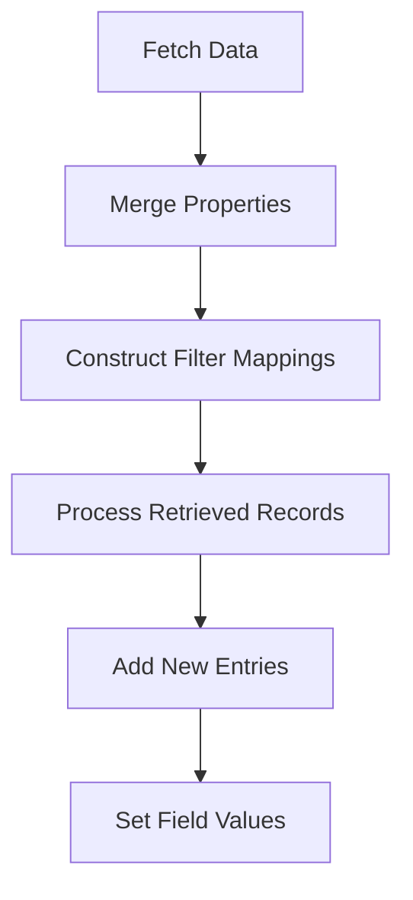

This document will cover the process of fetching and processing map records, which includes:

1. Fetching data based on criteria
2. Merging properties and constructing filter mappings
3. Processing retrieved records
4. Adding new entries to the map structure
5. Setting field values in a given bean.

Technical document: <SwmLink doc-title="Fetching and Processing Map Records">[Fetching and Processing Map Records](/.swm/fetching-and-processing-map-records.hsfara0l.sw.md)</SwmLink>

# [Fetching Data Based on Criteria](https://app.swimm.io/repos/Z2l0aHViJTNBJTNBQnJvYWRsZWFmQ29tbWVyY2UtZGVtby1uZXclM0ElM0FTd2ltbS1EZW1v/docs/hsfara0l#fetch)

The process begins by fetching data based on specific criteria provided by the user. This involves retrieving data that matches the criteria from the database. The criteria could include various filters such as date ranges, specific field values, or other conditions that narrow down the data set to only the relevant records.

# [Merging Properties and Constructing Filter Mappings](https://app.swimm.io/repos/Z2l0aHViJTNBJTNBQnJvYWRsZWFmQ29tbWVyY2UtZGVtby1uZXclM0ElM0FTd2ltbS1EZW1v/docs/hsfara0l#fetch)

Once the data is fetched, the next step is to merge properties from different sources to create a unified view of the data. This involves combining fields from various entities and ensuring that all necessary information is included. Filter mappings are then constructed to ensure that only one entity is returned for each unique set of criteria. This step is crucial for maintaining data integrity and ensuring that the user receives accurate and relevant information.

# [Processing Retrieved Records](https://app.swimm.io/repos/Z2l0aHViJTNBJTNBQnJvYWRsZWFmQ29tbWVyY2UtZGVtby1uZXclM0ElM0FTd2ltbS1EZW1v/docs/hsfara0l#getmaprecords)

After merging properties and constructing filter mappings, the retrieved records are processed. This involves iterating over the map keys and values, filtering out unnecessary fields, and converting each entry into an `Entity` object. The `Entity` object is a structured representation of the data that can be easily manipulated and displayed to the user. This step ensures that the data is in a usable format and ready for further processing or display.

# [Adding New Entries to the Map Structure](https://app.swimm.io/repos/Z2l0aHViJTNBJTNBQnJvYWRsZWFmQ29tbWVyY2UtZGVtby1uZXclM0ElM0FTd2ltbS1EZW1v/docs/hsfara0l#add)

When new data needs to be added to the map structure, the system first validates the key to ensure it is unique and not already in use. It then retrieves the existing entity and updates the map with the new value. This step is important for maintaining the integrity of the data and ensuring that new entries do not conflict with existing ones. Once the new entry is added, the system processes the updated records to reflect the changes.

# [Setting Field Values in a Given Bean](https://app.swimm.io/repos/Z2l0aHViJTNBJTNBQnJvYWRsZWFmQ29tbWVyY2UtZGVtby1uZXclM0ElM0FTd2ltbS1EZW1v/docs/hsfara0l#setfieldvalue)

The final step in the process is setting the value of a specified field in a given bean. This involves handling nested fields and map fields to ensure that the correct value is assigned. The system carefully navigates through the structure of the bean to locate the appropriate field and update its value. This step is crucial for ensuring that the data is accurately reflected in the system and that any changes are properly recorded.

&nbsp;

*This is an auto-generated document by Swimm AI 🌊 and has not yet been verified by a human*

<SwmMeta version="3.0.0" repo-id="Z2l0aHViJTNBJTNBQnJvYWRsZWFmQ29tbWVyY2UtZGVtby1uZXclM0ElM0FTd2ltbS1EZW1v" repo-name="BroadleafCommerce-demo-new" doc-type="product-flows">Powered by [Swimm](/)</SwmMeta>
