In this document, we will explain the process of fetching data and applying different criteria to filter the results. The process involves retrieving data based on client-provided criteria, applying product option value criteria, SKU bundle item value criteria, and inventory restrictions, and finally adding a new SKU.

The flow starts with fetching data based on the criteria provided by the client. It first gathers default properties from the Sku class and its subclasses. Then, it pulls back the Skus based on the criteria from the client and allows subclasses to provide additional criteria before executing the query. The fetched data is then converted into the <SwmToken path="admin/broadleaf-admin-module/src/main/java/org/broadleafcommerce/admin/server/service/handler/SkuCustomPersistenceHandler.java" pos="519:10:12" line-data="            //Convert Skus into the client-side Entity representation">`client-side`</SwmToken> entity representation. Additional steps include applying product option value criteria, SKU bundle item value criteria, and inventory restrictions to ensure the fetched data adheres to the specified criteria. Finally, a new SKU can be added by validating product options, filling out the SKU instance, verifying uniqueness, and persisting the new SKU.

# Flow drill down

```mermaid
graph TD;
      subgraph admin/broadleaf-admin-module/src/main/java/org/broadleafcommerce/admin/server/service/handler/SkuCustomPersistenceHandler.java
318258cdbf786e00ad449e58f8a2801d553af5b92880bb57bc875d8985ef6dd7(fetch):::mainFlowStyle --> 041c61a7acc5f1ec28a7c1eb01a5e127e6a60f2913615fb1dad0d6fb5d3b9c09(applyProductOptionValueCriteria)
end

subgraph admin/broadleaf-admin-module/src/main/java/org/broadleafcommerce/admin/server/service/handler/SkuCustomPersistenceHandler.java
318258cdbf786e00ad449e58f8a2801d553af5b92880bb57bc875d8985ef6dd7(fetch):::mainFlowStyle --> 412ee1fa19a65c8924431b9a89fd4f92eec4922a0887ed8bf83a3bac8adf5224(applySkuBundleItemValueCriteria)
end

subgraph admin/broadleaf-admin-module/src/main/java/org/broadleafcommerce/admin/server/service/handler/SkuCustomPersistenceHandler.java
318258cdbf786e00ad449e58f8a2801d553af5b92880bb57bc875d8985ef6dd7(fetch):::mainFlowStyle --> afd458ccae035c65347767d25c9eec780e8aedfbe547bfdce9085fe7fa7f374d(applyInventoryRestictions):::mainFlowStyle
end

subgraph admin/broadleaf-admin-module/src/main/java/org/broadleafcommerce/admin/server/service/handler/SkuCustomPersistenceHandler.java
afd458ccae035c65347767d25c9eec780e8aedfbe547bfdce9085fe7fa7f374d(applyInventoryRestictions):::mainFlowStyle --> b2253053c8662e9998983f7b0e3a1952728921c33459d3166b6e0bc79c953659(add):::mainFlowStyle
end


      classDef mainFlowStyle color:#000000,fill:#7CB9F4
classDef rootsStyle color:#000000,fill:#00FFF4
classDef Style1 color:#000000,fill:#00FFAA
classDef Style2 color:#000000,fill:#FFFF00
classDef Style3 color:#000000,fill:#AA7CB9

%% Swimm:
%% graph TD;
%%       subgraph <SwmPath>[admin/broadleaf-admin-module/src/main/java/org/broadleafcommerce/admin/server/service/handler/SkuCustomPersistenceHandler.java](admin/broadleaf-admin-module/src/main/java/org/broadleafcommerce/admin/server/service/handler/SkuCustomPersistenceHandler.java)</SwmPath>
%% 318258cdbf786e00ad449e58f8a2801d553af5b92880bb57bc875d8985ef6dd7(fetch):::mainFlowStyle --> 041c61a7acc5f1ec28a7c1eb01a5e127e6a60f2913615fb1dad0d6fb5d3b9c09(applyProductOptionValueCriteria)
%% end
%% 
%% subgraph <SwmPath>[admin/broadleaf-admin-module/src/main/java/org/broadleafcommerce/admin/server/service/handler/SkuCustomPersistenceHandler.java](admin/broadleaf-admin-module/src/main/java/org/broadleafcommerce/admin/server/service/handler/SkuCustomPersistenceHandler.java)</SwmPath>
%% 318258cdbf786e00ad449e58f8a2801d553af5b92880bb57bc875d8985ef6dd7(fetch):::mainFlowStyle --> 412ee1fa19a65c8924431b9a89fd4f92eec4922a0887ed8bf83a3bac8adf5224(applySkuBundleItemValueCriteria)
%% end
%% 
%% subgraph <SwmPath>[admin/broadleaf-admin-module/src/main/java/org/broadleafcommerce/admin/server/service/handler/SkuCustomPersistenceHandler.java](admin/broadleaf-admin-module/src/main/java/org/broadleafcommerce/admin/server/service/handler/SkuCustomPersistenceHandler.java)</SwmPath>
%% 318258cdbf786e00ad449e58f8a2801d553af5b92880bb57bc875d8985ef6dd7(fetch):::mainFlowStyle --> afd458ccae035c65347767d25c9eec780e8aedfbe547bfdce9085fe7fa7f374d(applyInventoryRestictions):::mainFlowStyle
%% end
%% 
%% subgraph <SwmPath>[admin/broadleaf-admin-module/src/main/java/org/broadleafcommerce/admin/server/service/handler/SkuCustomPersistenceHandler.java](admin/broadleaf-admin-module/src/main/java/org/broadleafcommerce/admin/server/service/handler/SkuCustomPersistenceHandler.java)</SwmPath>
%% afd458ccae035c65347767d25c9eec780e8aedfbe547bfdce9085fe7fa7f374d(applyInventoryRestictions):::mainFlowStyle --> b2253053c8662e9998983f7b0e3a1952728921c33459d3166b6e0bc79c953659(add):::mainFlowStyle
%% end
%% 
%% 
%%       classDef mainFlowStyle color:#000000,fill:#7CB9F4
%% classDef rootsStyle color:#000000,fill:#00FFF4
%% classDef Style1 color:#000000,fill:#00FFAA
%% classDef Style2 color:#000000,fill:#FFFF00
%% classDef Style3 color:#000000,fill:#AA7CB9
```



<SwmSnippet path="/admin/broadleaf-admin-module/src/main/java/org/broadleafcommerce/admin/server/service/handler/SkuCustomPersistenceHandler.java" line="502">

---

## Fetching Data

The <SwmToken path="admin/broadleaf-admin-module/src/main/java/org/broadleafcommerce/admin/server/service/handler/SkuCustomPersistenceHandler.java" pos="502:5:5" line-data="    public DynamicResultSet fetch(PersistencePackage persistencePackage, CriteriaTransferObject cto, DynamicEntityDao dynamicEntityDao, RecordHelper helper) throws ServiceException {">`fetch`</SwmToken> method is responsible for retrieving data based on the criteria provided by the client. It first gathers the default properties from the <SwmToken path="admin/broadleaf-admin-module/src/main/java/org/broadleafcommerce/admin/server/service/handler/SkuCustomPersistenceHandler.java" pos="506:12:12" line-data="            //get the default properties from Sku and its subclasses">`Sku`</SwmToken> class and its subclasses. Then, it pulls back the <SwmToken path="admin/broadleaf-admin-module/src/main/java/org/broadleafcommerce/admin/server/service/handler/SkuCustomPersistenceHandler.java" pos="509:8:8" line-data="            //Pull back the Skus based on the criteria from the client">`Skus`</SwmToken> based on the criteria from the client and allows subclasses to provide additional criteria before executing the query. Finally, it converts the <SwmToken path="admin/broadleaf-admin-module/src/main/java/org/broadleafcommerce/admin/server/service/handler/SkuCustomPersistenceHandler.java" pos="509:8:8" line-data="            //Pull back the Skus based on the criteria from the client">`Skus`</SwmToken> into the <SwmToken path="admin/broadleaf-admin-module/src/main/java/org/broadleafcommerce/admin/server/service/handler/SkuCustomPersistenceHandler.java" pos="519:10:12" line-data="            //Convert Skus into the client-side Entity representation">`client-side`</SwmToken> entity representation and returns the result set.

```java
    public DynamicResultSet fetch(PersistencePackage persistencePackage, CriteriaTransferObject cto, DynamicEntityDao dynamicEntityDao, RecordHelper helper) throws ServiceException {
        String ceilingEntityFullyQualifiedClassname = persistencePackage.getCeilingEntityFullyQualifiedClassname();
        try {
            PersistencePerspective persistencePerspective = persistencePackage.getPersistencePerspective();
            //get the default properties from Sku and its subclasses
            Map<String, FieldMetadata> originalProps = helper.getSimpleMergedProperties(Sku.class.getName(), persistencePerspective);

            //Pull back the Skus based on the criteria from the client
            List<FilterMapping> filterMappings = helper.getFilterMappings(persistencePerspective, cto, ceilingEntityFullyQualifiedClassname, originalProps);

            //allow subclasses to provide additional criteria before executing the query
            applyProductOptionValueCriteria(filterMappings, cto, persistencePackage, null);
            applySkuBundleItemValueCriteria(filterMappings, cto, persistencePackage);
            applyInventoryRestictions(filterMappings, cto, persistencePackage);
            applyAdditionalFetchCriteria(filterMappings, cto, persistencePackage);

            List<Serializable> records = helper.getPersistentRecords(persistencePackage.getCeilingEntityFullyQualifiedClassname(), filterMappings, cto.getFirstResult(), cto.getMaxResults());
            //Convert Skus into the client-side Entity representation
            Entity[] payload = helper.getRecords(originalProps, records);

            int totalRecords = helper.getTotalRecords(persistencePackage.getCeilingEntityFullyQualifiedClassname(), filterMappings);
```

---

</SwmSnippet>

<SwmSnippet path="/admin/broadleaf-admin-module/src/main/java/org/broadleafcommerce/admin/server/service/handler/SkuCustomPersistenceHandler.java" line="667">

---

## Applying Product Option Value Criteria

The <SwmToken path="admin/broadleaf-admin-module/src/main/java/org/broadleafcommerce/admin/server/service/handler/SkuCustomPersistenceHandler.java" pos="667:5:5" line-data="    public void applyProductOptionValueCriteria(List&lt;FilterMapping&gt; filterMappings, CriteriaTransferObject cto, PersistencePackage persistencePackage, String skuPropertyPrefix) {">`applyProductOptionValueCriteria`</SwmToken> method adds filter mappings based on product option values. It checks for criteria related to product options and adds appropriate filter mappings to the list. This ensures that the fetched data adheres to the specified product option values.

```java
    public void applyProductOptionValueCriteria(List<FilterMapping> filterMappings, CriteriaTransferObject cto, PersistencePackage persistencePackage, String skuPropertyPrefix) {

        //if the front
        final List<Long> productOptionValueFilterIDs = new ArrayList<>();
        for (String filterProperty : cto.getCriteriaMap().keySet()) {
            if (filterProperty.startsWith(PRODUCT_OPTION_FIELD_PREFIX)) {
                FilterAndSortCriteria criteria = cto.get(filterProperty);
                productOptionValueFilterIDs.add(Long.parseLong(criteria.getFilterValues().get(0)));
            }
        }

        //also determine if there is a consolidated POV query
        final List<String> productOptionValueFilterValues = new ArrayList<>();
        FilterAndSortCriteria consolidatedCriteria = cto.get(CONSOLIDATED_PRODUCT_OPTIONS_FIELD_NAME);
        if (!consolidatedCriteria.getFilterValues().isEmpty()) {
            //the criteria in this case would be a semi-colon delimeter value list
            productOptionValueFilterValues.addAll(Arrays.asList(StringUtils.split(consolidatedCriteria.getFilterValues().get(0), CONSOLIDATED_PRODUCT_OPTIONS_DELIMETER)));
        }

        if (productOptionValueFilterIDs.size() > 0) {
            FilterMapping filterMapping = new FilterMapping()
```

---

</SwmSnippet>

<SwmSnippet path="/admin/broadleaf-admin-module/src/main/java/org/broadleafcommerce/admin/server/service/handler/SkuCustomPersistenceHandler.java" line="612">

---

## Applying SKU Bundle Item Value Criteria

The <SwmToken path="admin/broadleaf-admin-module/src/main/java/org/broadleafcommerce/admin/server/service/handler/SkuCustomPersistenceHandler.java" pos="615:5:5" line-data="    private void applySkuBundleItemValueCriteria(List&lt;FilterMapping&gt; filterMappings, CriteriaTransferObject cto, PersistencePackage persistencePackage) {">`applySkuBundleItemValueCriteria`</SwmToken> method adds filter restrictions to ensure that a product bundle cannot add its own default SKU as a SKU bundle item. This is done by checking the section crumbs and adding a filter mapping that excludes the default SKU ID from the results.

```java
    /**
     * Add filter restriction such that a ProductBundle cannot add its own default sku as a Sku Bundle Item
     */
    private void applySkuBundleItemValueCriteria(List<FilterMapping> filterMappings, CriteriaTransferObject cto, PersistencePackage persistencePackage) {
        SectionCrumb[] sectionCrumbs = persistencePackage.getSectionCrumbs();
        if (isSkuBundleItemLookup(persistencePackage, sectionCrumbs)) {
            final Long defaultSkuId = getOwningProductBundlesDefaultSkuId(sectionCrumbs[0]);

            filterMappings.add(new FilterMapping()
                    .withDirectFilterValues(Collections.singletonList(defaultSkuId))
                    .withRestriction(new Restriction()
                                    .withPredicateProvider(new PredicateProvider() {
                                        @Override
                                        public Predicate buildPredicate(CriteriaBuilder builder,
                                                FieldPathBuilder fieldPathBuilder,
                                                From root, String ceilingEntity,
                                                String fullPropertyName, Path explicitPath,
                                                List directValues) {
                                            return builder.notEqual(root, directValues.get(0));
                                        }
                                    })
```

---

</SwmSnippet>

<SwmSnippet path="/admin/broadleaf-admin-module/src/main/java/org/broadleafcommerce/admin/server/service/handler/SkuCustomPersistenceHandler.java" line="533">

---

## Applying Inventory Restrictions

The <SwmToken path="admin/broadleaf-admin-module/src/main/java/org/broadleafcommerce/admin/server/service/handler/SkuCustomPersistenceHandler.java" pos="533:5:5" line-data="    protected void applyInventoryRestictions(List&lt;FilterMapping&gt; filterMappings, CriteriaTransferObject cto, PersistencePackage persistencePackage) {">`applyInventoryRestictions`</SwmToken> method adds filter mappings to handle inventory-related criteria. It checks if the persistence package contains inventory-related criteria and, if so, adds appropriate filter mappings to ensure that the fetched data adheres to the specified inventory restrictions.

```java
    protected void applyInventoryRestictions(List<FilterMapping> filterMappings, CriteriaTransferObject cto, PersistencePackage persistencePackage) {
        boolean hasInventory = persistencePackage.containsCriteria("owningClass=com.broadleafcommerce.inventory.advanced.domain.InventoryImpl")
                && persistencePackage.containsCriteria("requestingField=sku");
        if (hasInventory && enableUseDefaultSkuInventory) {
            filterMappings.add(new FilterMapping().withDirectFilterValues(new EmptyFilterValues()).withRestriction(new Restriction()
                    .withPredicateProvider(new PredicateProvider() {
                        @Override
                        public Predicate buildPredicate(CriteriaBuilder builder, FieldPathBuilder fieldPathBuilder, From root, String ceilingEntity, String fullPropertyName, Path explicitPath, List directValues) {

                            Join product = root.join("product", JoinType.LEFT);

                            Subquery<Long> subquery = fieldPathBuilder.getCriteria().subquery(Long.class);
                            Root<ProductImpl> productRoot = subquery.from(ProductImpl.class);
                            subquery.select(builder.count(productRoot));
                            subquery.where(
                                    builder.and(
                                            builder.equal(productRoot.get("embeddableSandBoxDiscriminator").get("tier"), 999999),
                                            builder.isNull(productRoot.get("embeddableSandBoxDiscriminator").get("sandBox")),
                                            builder.equal(productRoot.get("embeddableSandBoxDiscriminator").get("originalItemId"), root.get("product").get("id")),
                                            builder.equal(productRoot.get("useDefaultSkuInInventory"), Boolean.TRUE)
                                    )
```

---

</SwmSnippet>

<SwmSnippet path="/admin/broadleaf-admin-module/src/main/java/org/broadleafcommerce/admin/server/service/handler/SkuCustomPersistenceHandler.java" line="732">

---

## Adding a New SKU

The <SwmToken path="admin/broadleaf-admin-module/src/main/java/org/broadleafcommerce/admin/server/service/handler/SkuCustomPersistenceHandler.java" pos="733:5:5" line-data="    public Entity add(PersistencePackage persistencePackage, DynamicEntityDao dynamicEntityDao, RecordHelper helper) throws ServiceException {">`add`</SwmToken> method is responsible for adding a new SKU. It validates the product options, fills out the SKU instance from the form, verifies the uniqueness of the product option value combination, persists the newly created SKU, associates the product option values to the SKU, and finally returns the result.

```java
    @Override
    public Entity add(PersistencePackage persistencePackage, DynamicEntityDao dynamicEntityDao, RecordHelper helper) throws ServiceException {
        Entity entity = persistencePackage.getEntity();
        try {
            List<Property> productOptionProperties = getProductOptionProperties(entity);

            //Verify that none of the selected options is null
            Entity errorEntity = validateNotNullProductOptions(productOptionProperties);
            if (errorEntity != null) {
                entity.setPropertyValidationErrors(errorEntity.getPropertyValidationErrors());
                return entity;
            }

            //Fill out the Sku instance from the form
            PersistencePerspective persistencePerspective = persistencePackage.getPersistencePerspective();
            Sku adminInstance = (Sku) Class.forName(entity.getType()[0]).newInstance();
            Map<String, FieldMetadata> adminProperties = helper.getSimpleMergedProperties(Sku.class.getName(), persistencePerspective);
            filterOutProductMetadata(adminProperties);
            adminInstance = (Sku) helper.createPopulatedInstance(adminInstance, entity, adminProperties, false);

            //Verify that there isn't already a Sku for this particular product option value combo
```

---

</SwmSnippet>

&nbsp;

*This is an auto-generated document by Swimm AI 🌊 and has not yet been verified by a human*

<SwmMeta version="3.0.0" repo-id="Z2l0aHViJTNBJTNBQnJvYWRsZWFmQ29tbWVyY2UtZGVtby1uZXclM0ElM0FTd2ltbS1EZW1v" repo-name="BroadleafCommerce-demo-new" doc-type="flows"><sup>Powered by [Swimm](/)</sup></SwmMeta>
