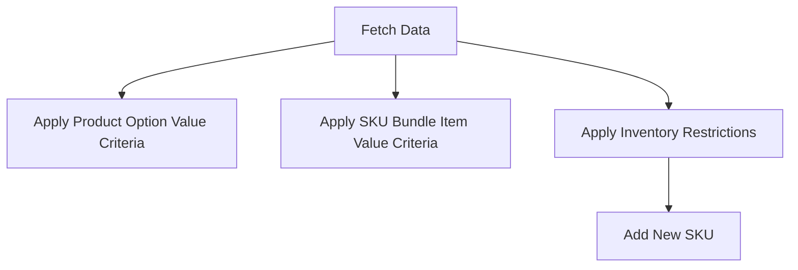

This document will cover the process of fetching data and applying criteria in the Broadleaf Commerce framework. We'll cover:

1. Fetching data based on client-provided criteria
2. Applying product option value criteria
3. Applying SKU bundle item value criteria
4. Applying inventory restrictions
5. Adding a new SKU.

Technical document: <SwmLink doc-title="Fetching Data and Applying Criteria">[Fetching Data and Applying Criteria](/.swm/fetching-data-and-applying-criteria.515c93is.sw.md)</SwmLink>

# [Fetching Data Based on Client-Provided Criteria](https://app.swimm.io/repos/Z2l0aHViJTNBJTNBQnJvYWRsZWFmQ29tbWVyY2UtZGVtby1uZXclM0ElM0FTd2ltbS1EZW1v/docs/515c93is#fetching-data)

The process begins by fetching data based on criteria provided by the client. This involves gathering default properties from the SKU class and its subclasses. The system then retrieves SKUs that match the client's criteria. Additional criteria can be provided by subclasses before executing the query. The fetched data is then converted into a format suitable for the client.

# [Applying Product Option Value Criteria](https://app.swimm.io/repos/Z2l0aHViJTNBJTNBQnJvYWRsZWFmQ29tbWVyY2UtZGVtby1uZXclM0ElM0FTd2ltbS1EZW1v/docs/515c93is#applying-product-option-value-criteria)

This step involves adding filter mappings based on product option values. The system checks for criteria related to product options and adds appropriate filter mappings to ensure that the fetched data adheres to the specified product option values. This ensures that only SKUs matching the desired product options are included in the results.

# [Applying SKU Bundle Item Value Criteria](https://app.swimm.io/repos/Z2l0aHViJTNBJTNBQnJvYWRsZWFmQ29tbWVyY2UtZGVtby1uZXclM0ElM0FTd2ltbS1EZW1v/docs/515c93is#applying-sku-bundle-item-value-criteria)

In this step, filter restrictions are added to ensure that a product bundle cannot add its own default SKU as a SKU bundle item. The system checks the section crumbs and adds a filter mapping that excludes the default SKU ID from the results. This prevents circular references and ensures data integrity.

# [Applying Inventory Restrictions](https://app.swimm.io/repos/Z2l0aHViJTNBJTNBQnJvYWRsZWFmQ29tbWVyY2UtZGVtby1uZXclM0ElM0FTd2ltbS1EZW1v/docs/515c93is#applying-inventory-restrictions)

This step involves adding filter mappings to handle inventory-related criteria. The system checks if the persistence package contains inventory-related criteria and, if so, adds appropriate filter mappings. This ensures that the fetched data adheres to the specified inventory restrictions, such as availability and stock levels.

# [Adding a New SKU](https://app.swimm.io/repos/Z2l0aHViJTNBJTNBQnJvYWRsZWFmQ29tbWVyY2UtZGVtby1uZXclM0ElM0FTd2ltbS1EZW1v/docs/515c93is#adding-a-new-sku)

The final step involves adding a new SKU. This process includes validating product options, filling out the SKU instance from the form, verifying the uniqueness of the product option value combination, and persisting the newly created SKU. The system also associates the product option values to the SKU and returns the result. This ensures that the new SKU is correctly added to the system with all necessary validations and associations.

&nbsp;

*This is an auto-generated document by Swimm AI 🌊 and has not yet been verified by a human*

<SwmMeta version="3.0.0" repo-id="Z2l0aHViJTNBJTNBQnJvYWRsZWFmQ29tbWVyY2UtZGVtby1uZXclM0ElM0FTd2ltbS1EZW1v" repo-name="BroadleafCommerce-demo-new" doc-type="product-flows">Powered by [Swimm](/)</SwmMeta>
