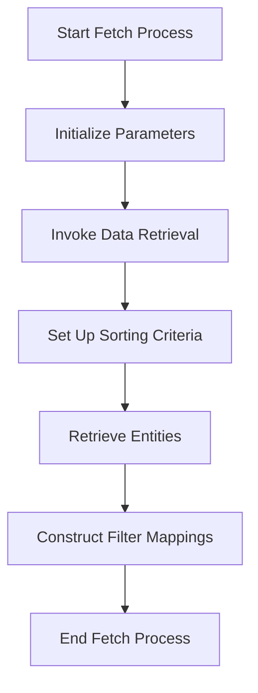

This document will cover the process of fetching records in the Broadleaf Commerce framework. We'll cover:

1. Initializing parameters
2. Invoking methods to retrieve data
3. Constructing filter mappings.

Technical document: <SwmLink doc-title="Fetching Records Flow">[Fetching Records Flow](/.swm/fetching-records-flow.qcsrfp6z.sw.md)</SwmLink>

# [Initializing Parameters](https://app.swimm.io/repos/Z2l0aHViJTNBJTNBQnJvYWRsZWFmQ29tbWVyY2UtZGVtby1uZXclM0ElM0FTd2ltbS1EZW1v/docs/qcsrfp6z#fetch-method)

The process begins by setting up the necessary parameters. This includes defining the criteria for the records to be fetched. For example, we specify the type of entities we are interested in and any additional properties or foreign keys that need to be considered. This step ensures that the subsequent data retrieval is targeted and efficient.

# [Invoking Methods to Retrieve Data](https://app.swimm.io/repos/Z2l0aHViJTNBJTNBQnJvYWRsZWFmQ29tbWVyY2UtZGVtby1uZXclM0ElM0FTd2ltbS1EZW1v/docs/qcsrfp6z#invokeforfetch-method)

Once the parameters are initialized, the system invokes a series of methods to start the data retrieval process. The first method in this chain is responsible for setting up the environment for fetching the records. It prepares the system to handle the data retrieval by ensuring all necessary components are in place.

# [Setting Up Sorting Criteria](https://app.swimm.io/repos/Z2l0aHViJTNBJTNBQnJvYWRsZWFmQ29tbWVyY2UtZGVtby1uZXclM0ElM0FTd2ltbS1EZW1v/docs/qcsrfp6z#invokeinternal-method)

During the data retrieval process, sorting criteria are established to organize the fetched records. This involves specifying the fields by which the records should be sorted and the order (ascending or descending). Proper sorting ensures that the records are presented in a meaningful and user-friendly manner.

# [Retrieving Entities](https://app.swimm.io/repos/Z2l0aHViJTNBJTNBQnJvYWRsZWFmQ29tbWVyY2UtZGVtby1uZXclM0ElM0FTd2ltbS1EZW1v/docs/qcsrfp6z#invokeinternal-method)

The next step involves retrieving the actual entities based on the initialized parameters and sorting criteria. This step fetches the records from the database or other data sources, ensuring that only the relevant entities are retrieved. This is crucial for performance and accuracy, as it minimizes the amount of data that needs to be processed.

# [Constructing Filter Mappings](https://app.swimm.io/repos/Z2l0aHViJTNBJTNBQnJvYWRsZWFmQ29tbWVyY2UtZGVtby1uZXclM0ElM0FTd2ltbS1EZW1v/docs/qcsrfp6z#getadornedtargetfiltermappings-method)

Finally, filter mappings are constructed to apply additional criteria to the fetched records. These mappings define how the records should be filtered based on specific conditions, such as matching certain field values. This step ensures that the final set of records meets the exact requirements specified by the user or the system.

&nbsp;

*This is an auto-generated document by Swimm AI 🌊 and has not yet been verified by a human*

<SwmMeta version="3.0.0" repo-id="Z2l0aHViJTNBJTNBQnJvYWRsZWFmQ29tbWVyY2UtZGVtby1uZXclM0ElM0FTd2ltbS1EZW1v" repo-name="BroadleafCommerce-demo-new" doc-type="product-flows">Powered by [Swimm](/)</SwmMeta>
