In this document, we will explain the process of fetching records. The process involves initializing parameters, invoking methods to retrieve data, and constructing filter mappings.

The fetch process starts by setting up the necessary parameters and then calls a series of methods to retrieve the data. First, it initializes parameters and invokes a method to start the data retrieval. This method then calls another method to set up sorting criteria and retrieve entities. Finally, it constructs filter mappings to filter the records during the fetch operation.

# Flow drill down

```mermaid
graph TD;
      subgraph admin/broadleaf-open-admin-platform/src/main/java/org/broadleafcommerce/openadmin/server/service/persistence/module
c1a6900df4968f9b0d66cec4c5bedc9911b87670309a3bb1f9d2ff4bbb7f8878(fetch):::mainFlowStyle --> b734bdb5efc2db2ec0d44b7bc541f46e792bc4a238f5da6cb8cbe495001e2302(invokeForFetch):::mainFlowStyle
end

subgraph admin/broadleaf-open-admin-platform/src/main/java/org/broadleafcommerce/openadmin/server/service/persistence/module
b734bdb5efc2db2ec0d44b7bc541f46e792bc4a238f5da6cb8cbe495001e2302(invokeForFetch):::mainFlowStyle --> dc7f4c6862e1bf1f6a4c2624cc09bf458152ce9f6223d500c0b1cc8cb090c1e1(invokeInternal):::mainFlowStyle
end

subgraph admin/broadleaf-open-admin-platform/src/main/java/org/broadleafcommerce/openadmin/server/service/persistence/module
dc7f4c6862e1bf1f6a4c2624cc09bf458152ce9f6223d500c0b1cc8cb090c1e1(invokeInternal):::mainFlowStyle --> 8531fa57a21daaac06520ab3529b9567acaf981f057d2d451a8003a8a9e9d398(getAdornedTargetFilterMappings):::mainFlowStyle
end

subgraph admin/broadleaf-open-admin-platform/src/main/java/org/broadleafcommerce/openadmin/server/service/persistence/module
8531fa57a21daaac06520ab3529b9567acaf981f057d2d451a8003a8a9e9d398(getAdornedTargetFilterMappings):::mainFlowStyle --> 9a58b8e17301378e74d370ad76a4ca46c55fc87350a15b855db50d64368fde05(add):::mainFlowStyle
end

subgraph admin/broadleaf-open-admin-platform/src/main/java/org/broadleafcommerce/openadmin/server/service/persistence/module
9a58b8e17301378e74d370ad76a4ca46c55fc87350a15b855db50d64368fde05(add):::mainFlowStyle --> 702310471beb81ea4dd82c91bbff830de53fc38cd7917390f5309587da2a478b(createPopulatedAdornedTargetInstance):::mainFlowStyle
end

subgraph admin/broadleaf-open-admin-platform/src/main/java/org/broadleafcommerce/openadmin/server/service/persistence/module
702310471beb81ea4dd82c91bbff830de53fc38cd7917390f5309587da2a478b(createPopulatedAdornedTargetInstance):::mainFlowStyle --> ddcb073c09911433b61933d36c041aebfceb561643ca926ffe20aa3f19eeb6e2(getFieldValue)
end

subgraph admin/broadleaf-open-admin-platform/src/main/java/org/broadleafcommerce/openadmin/server/service/persistence/module
702310471beb81ea4dd82c91bbff830de53fc38cd7917390f5309587da2a478b(createPopulatedAdornedTargetInstance):::mainFlowStyle --> e397e7a4073e60a59abecd2977d6860cc7361ba3dde7b0c462c898d8d9e01241(setFieldValue):::mainFlowStyle
end


      classDef mainFlowStyle color:#000000,fill:#7CB9F4
classDef rootsStyle color:#000000,fill:#00FFF4
classDef Style1 color:#000000,fill:#00FFAA
classDef Style2 color:#000000,fill:#FFFF00
classDef Style3 color:#000000,fill:#AA7CB9

%% Swimm:
%% graph TD;
%%       subgraph <SwmPath>[admin/broadleaf-open-admin-platform/src/main/java/org/broadleafcommerce/openadmin/server/service/persistence/module/](admin/broadleaf-open-admin-platform/src/main/java/org/broadleafcommerce/openadmin/server/service/persistence/module/)</SwmPath>
%% c1a6900df4968f9b0d66cec4c5bedc9911b87670309a3bb1f9d2ff4bbb7f8878(fetch):::mainFlowStyle --> b734bdb5efc2db2ec0d44b7bc541f46e792bc4a238f5da6cb8cbe495001e2302(invokeForFetch):::mainFlowStyle
%% end
%% 
%% subgraph <SwmPath>[admin/broadleaf-open-admin-platform/src/main/java/org/broadleafcommerce/openadmin/server/service/persistence/module/](admin/broadleaf-open-admin-platform/src/main/java/org/broadleafcommerce/openadmin/server/service/persistence/module/)</SwmPath>
%% b734bdb5efc2db2ec0d44b7bc541f46e792bc4a238f5da6cb8cbe495001e2302(invokeForFetch):::mainFlowStyle --> dc7f4c6862e1bf1f6a4c2624cc09bf458152ce9f6223d500c0b1cc8cb090c1e1(invokeInternal):::mainFlowStyle
%% end
%% 
%% subgraph <SwmPath>[admin/broadleaf-open-admin-platform/src/main/java/org/broadleafcommerce/openadmin/server/service/persistence/module/](admin/broadleaf-open-admin-platform/src/main/java/org/broadleafcommerce/openadmin/server/service/persistence/module/)</SwmPath>
%% dc7f4c6862e1bf1f6a4c2624cc09bf458152ce9f6223d500c0b1cc8cb090c1e1(invokeInternal):::mainFlowStyle --> 8531fa57a21daaac06520ab3529b9567acaf981f057d2d451a8003a8a9e9d398(getAdornedTargetFilterMappings):::mainFlowStyle
%% end
%% 
%% subgraph <SwmPath>[admin/broadleaf-open-admin-platform/src/main/java/org/broadleafcommerce/openadmin/server/service/persistence/module/](admin/broadleaf-open-admin-platform/src/main/java/org/broadleafcommerce/openadmin/server/service/persistence/module/)</SwmPath>
%% 8531fa57a21daaac06520ab3529b9567acaf981f057d2d451a8003a8a9e9d398(getAdornedTargetFilterMappings):::mainFlowStyle --> 9a58b8e17301378e74d370ad76a4ca46c55fc87350a15b855db50d64368fde05(add):::mainFlowStyle
%% end
%% 
%% subgraph <SwmPath>[admin/broadleaf-open-admin-platform/src/main/java/org/broadleafcommerce/openadmin/server/service/persistence/module/](admin/broadleaf-open-admin-platform/src/main/java/org/broadleafcommerce/openadmin/server/service/persistence/module/)</SwmPath>
%% 9a58b8e17301378e74d370ad76a4ca46c55fc87350a15b855db50d64368fde05(add):::mainFlowStyle --> 702310471beb81ea4dd82c91bbff830de53fc38cd7917390f5309587da2a478b(createPopulatedAdornedTargetInstance):::mainFlowStyle
%% end
%% 
%% subgraph <SwmPath>[admin/broadleaf-open-admin-platform/src/main/java/org/broadleafcommerce/openadmin/server/service/persistence/module/](admin/broadleaf-open-admin-platform/src/main/java/org/broadleafcommerce/openadmin/server/service/persistence/module/)</SwmPath>
%% 702310471beb81ea4dd82c91bbff830de53fc38cd7917390f5309587da2a478b(createPopulatedAdornedTargetInstance):::mainFlowStyle --> ddcb073c09911433b61933d36c041aebfceb561643ca926ffe20aa3f19eeb6e2(getFieldValue)
%% end
%% 
%% subgraph <SwmPath>[admin/broadleaf-open-admin-platform/src/main/java/org/broadleafcommerce/openadmin/server/service/persistence/module/](admin/broadleaf-open-admin-platform/src/main/java/org/broadleafcommerce/openadmin/server/service/persistence/module/)</SwmPath>
%% 702310471beb81ea4dd82c91bbff830de53fc38cd7917390f5309587da2a478b(createPopulatedAdornedTargetInstance):::mainFlowStyle --> e397e7a4073e60a59abecd2977d6860cc7361ba3dde7b0c462c898d8d9e01241(setFieldValue):::mainFlowStyle
%% end
%% 
%% 
%%       classDef mainFlowStyle color:#000000,fill:#7CB9F4
%% classDef rootsStyle color:#000000,fill:#00FFF4
%% classDef Style1 color:#000000,fill:#00FFAA
%% classDef Style2 color:#000000,fill:#FFFF00
%% classDef Style3 color:#000000,fill:#AA7CB9
```



<SwmSnippet path="/admin/broadleaf-open-admin-platform/src/main/java/org/broadleafcommerce/openadmin/server/service/persistence/module/AdornedTargetListPersistenceModule.java" line="434">

---

## Fetch Method

The <SwmToken path="admin/broadleaf-open-admin-platform/src/main/java/org/broadleafcommerce/openadmin/server/service/persistence/module/AdornedTargetListPersistenceModule.java" pos="435:5:5" line-data="    public DynamicResultSet fetch(PersistencePackage persistencePackage, CriteriaTransferObject cto) throws ServiceException {">`fetch`</SwmToken> method is responsible for retrieving a set of records based on the provided criteria. It initializes the necessary parameters and invokes the <SwmToken path="admin/broadleaf-open-admin-platform/src/main/java/org/broadleafcommerce/openadmin/server/service/persistence/module/AdornedTargetListPersistenceModule.java" pos="522:5:5" line-data="        public AdornedTargetRetrieval invokeForFetch() throws ClassNotFoundException, NoSuchMethodException, IllegalAccessException, InvocationTargetException, FieldNotAvailableException, NoSuchFieldException {">`invokeForFetch`</SwmToken> method to perform the actual data retrieval.

```java
    @Override
    public DynamicResultSet fetch(PersistencePackage persistencePackage, CriteriaTransferObject cto) throws ServiceException {
        PersistencePerspective persistencePerspective = persistencePackage.getPersistencePerspective();
        String ceilingEntityFullyQualifiedClassname = persistencePackage.getCeilingEntityFullyQualifiedClassname();
        AdornedTargetList adornedTargetList = (AdornedTargetList) persistencePerspective.getPersistencePerspectiveItems().get(PersistencePerspectiveItemType.ADORNEDTARGETLIST);
        Entity[] payload;
        int totalRecords;
        try {
            Class<?>[] entities = persistenceManager.getPolymorphicEntities(ceilingEntityFullyQualifiedClassname);
            Map<String, FieldMetadata> mergedPropertiesTarget = persistenceManager.getDynamicEntityDao().getMergedProperties(
                    ceilingEntityFullyQualifiedClassname,
                    entities,
                    null,
                    persistencePerspective.getAdditionalNonPersistentProperties(),
                    persistencePerspective.getAdditionalForeignKeys(),
                    MergedPropertyType.PRIMARY,
                    persistencePerspective.getPopulateToOneFields(),
                    persistencePerspective.getIncludeFields(),
                    persistencePerspective.getExcludeFields(),
                    persistencePerspective.getConfigurationKey(),
                    ""
```

---

</SwmSnippet>

<SwmSnippet path="/admin/broadleaf-open-admin-platform/src/main/java/org/broadleafcommerce/openadmin/server/service/persistence/module/AdornedTargetListPersistenceModule.java" line="522">

---

## <SwmToken path="admin/broadleaf-open-admin-platform/src/main/java/org/broadleafcommerce/openadmin/server/service/persistence/module/AdornedTargetListPersistenceModule.java" pos="522:5:5" line-data="        public AdornedTargetRetrieval invokeForFetch() throws ClassNotFoundException, NoSuchMethodException, IllegalAccessException, InvocationTargetException, FieldNotAvailableException, NoSuchFieldException {">`invokeForFetch`</SwmToken> Method

The <SwmToken path="admin/broadleaf-open-admin-platform/src/main/java/org/broadleafcommerce/openadmin/server/service/persistence/module/AdornedTargetListPersistenceModule.java" pos="522:5:5" line-data="        public AdornedTargetRetrieval invokeForFetch() throws ClassNotFoundException, NoSuchMethodException, IllegalAccessException, InvocationTargetException, FieldNotAvailableException, NoSuchFieldException {">`invokeForFetch`</SwmToken> method calls the <SwmToken path="admin/broadleaf-open-admin-platform/src/main/java/org/broadleafcommerce/openadmin/server/service/persistence/module/AdornedTargetListPersistenceModule.java" pos="523:1:1" line-data="            invokeInternal();">`invokeInternal`</SwmToken> method and returns the current instance of <SwmToken path="admin/broadleaf-open-admin-platform/src/main/java/org/broadleafcommerce/openadmin/server/service/persistence/module/AdornedTargetListPersistenceModule.java" pos="522:3:3" line-data="        public AdornedTargetRetrieval invokeForFetch() throws ClassNotFoundException, NoSuchMethodException, IllegalAccessException, InvocationTargetException, FieldNotAvailableException, NoSuchFieldException {">`AdornedTargetRetrieval`</SwmToken>. This method is a part of the chain that prepares and executes the fetch operation.

```java
        public AdornedTargetRetrieval invokeForFetch() throws ClassNotFoundException, NoSuchMethodException, IllegalAccessException, InvocationTargetException, FieldNotAvailableException, NoSuchFieldException {
            invokeInternal();
            return this;
        }
```

---

</SwmSnippet>

<SwmSnippet path="/admin/broadleaf-open-admin-platform/src/main/java/org/broadleafcommerce/openadmin/server/service/persistence/module/AdornedTargetListPersistenceModule.java" line="547">

---

## <SwmToken path="admin/broadleaf-open-admin-platform/src/main/java/org/broadleafcommerce/openadmin/server/service/persistence/module/AdornedTargetListPersistenceModule.java" pos="547:5:5" line-data="        private void invokeInternal() throws ClassNotFoundException {">`invokeInternal`</SwmToken> Method

The <SwmToken path="admin/broadleaf-open-admin-platform/src/main/java/org/broadleafcommerce/openadmin/server/service/persistence/module/AdornedTargetListPersistenceModule.java" pos="547:5:5" line-data="        private void invokeInternal() throws ClassNotFoundException {">`invokeInternal`</SwmToken> method sets up sorting criteria, retrieves polymorphic entities, and merges properties. It also calls <SwmToken path="admin/broadleaf-open-admin-platform/src/main/java/org/broadleafcommerce/openadmin/server/service/persistence/module/AdornedTargetListPersistenceModule.java" pos="81:8:8" line-data="    public List&lt;FilterMapping&gt; getAdornedTargetFilterMappings(PersistencePerspective persistencePerspective,">`getAdornedTargetFilterMappings`</SwmToken> to obtain filter mappings for the adorned target list.

```java
        private void invokeInternal() throws ClassNotFoundException {
            if (adornedTargetList.getSortField() != null) {
                FilterAndSortCriteria sortCriteria = cto.get(adornedTargetList.getSortField());
                sortCriteria.setSortAscending(adornedTargetList.getSortAscending());
            }
            
            Class<?>[] entities = persistenceManager.getPolymorphicEntities(adornedTargetList
                    .getAdornedTargetEntityClassname());
            mergedProperties = persistenceManager.getDynamicEntityDao().getMergedProperties(
                    adornedTargetList.getAdornedTargetEntityClassname(),
                    entities,
                    null,
                    new String[]{},
                    new ForeignKey[]{},
                    MergedPropertyType.ADORNEDTARGETLIST,
                    persistencePerspective.getPopulateToOneFields(),
                    persistencePerspective.getIncludeFields(),
                    persistencePerspective.getExcludeFields(),
                    persistencePerspective.getConfigurationKey(),
                    ""
            );
```

---

</SwmSnippet>

<SwmSnippet path="/admin/broadleaf-open-admin-platform/src/main/java/org/broadleafcommerce/openadmin/server/service/persistence/module/AdornedTargetListPersistenceModule.java" line="81">

---

## <SwmToken path="admin/broadleaf-open-admin-platform/src/main/java/org/broadleafcommerce/openadmin/server/service/persistence/module/AdornedTargetListPersistenceModule.java" pos="81:8:8" line-data="    public List&lt;FilterMapping&gt; getAdornedTargetFilterMappings(PersistencePerspective persistencePerspective,">`getAdornedTargetFilterMappings`</SwmToken> Method

The <SwmToken path="admin/broadleaf-open-admin-platform/src/main/java/org/broadleafcommerce/openadmin/server/service/persistence/module/AdornedTargetListPersistenceModule.java" pos="81:8:8" line-data="    public List&lt;FilterMapping&gt; getAdornedTargetFilterMappings(PersistencePerspective persistencePerspective,">`getAdornedTargetFilterMappings`</SwmToken> method constructs filter mappings based on the provided criteria and adorned target list. These mappings are used to filter the records during the fetch operation.

```java
    public List<FilterMapping> getAdornedTargetFilterMappings(PersistencePerspective persistencePerspective,
                    CriteriaTransferObject cto, Map<String, FieldMetadata> mergedProperties,
                    AdornedTargetList adornedTargetList) throws ClassNotFoundException {
        List<FilterMapping> filterMappings = getFilterMappings(persistencePerspective, cto, adornedTargetList.
                getAdornedTargetEntityClassname(), mergedProperties);
        FilterMapping filterMapping = new FilterMapping()
            .withFieldPath(new FieldPath()
                    .withTargetProperty(adornedTargetList.getLinkedObjectPath() + "." + adornedTargetList.getLinkedIdProperty()))
            .withFilterValues(cto.get(adornedTargetList.getCollectionFieldName()).getFilterValues())
            .withRestriction(new Restriction()
                .withPredicateProvider(new PredicateProvider<Serializable, String>() {
                    @Override
                    public Predicate buildPredicate(CriteriaBuilder builder, FieldPathBuilder fieldPathBuilder, From root,
                                                    String ceilingEntity, String fullPropertyName, Path<Serializable> explicitPath,
                                                    List<String> directValues) {
                        if (String.class.isAssignableFrom(explicitPath.getJavaType())) {
                            return builder.equal(explicitPath, directValues.get(0));
                        } else {
                            return builder.equal(explicitPath, Long.parseLong(directValues.get(0)));
                        }
                    }
```

---

</SwmSnippet>

&nbsp;

*This is an auto-generated document by Swimm AI 🌊 and has not yet been verified by a human*

<SwmMeta version="3.0.0" repo-id="Z2l0aHViJTNBJTNBQnJvYWRsZWFmQ29tbWVyY2UtZGVtby1uZXclM0ElM0FTd2ltbS1EZW1v" repo-name="BroadleafCommerce-demo-new" doc-type="flows"><sup>Powered by [Swimm](/)</sup></SwmMeta>
