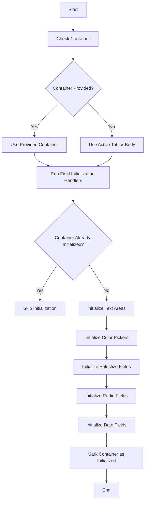

This document will cover the Field Initialization Flow, which includes:

1. Initializing the container
2. Initializing different types of fields
3. Marking the container as initialized.

Technical document: <SwmLink doc-title="Field Initialization Flow">[Field Initialization Flow](/.swm/field-initialization-flow.tj6k9r1b.sw.md)</SwmLink>

# [Initializing the container](https://app.swimm.io/repos/Z2l0aHViJTNBJTNBQnJvYWRsZWFmQ29tbWVyY2UtZGVtby1uZXclM0ElM0FTd2ltbS1EZW1v/docs/tj6k9r1b#initializefields)

The process begins by checking if a container is provided. If no container is specified, the system defaults to using the active tab or the body. This ensures that there is always a context within which the fields will be initialized.

# [Initializing different types of fields](https://app.swimm.io/repos/Z2l0aHViJTNBJTNBQnJvYWRsZWFmQ29tbWVyY2UtZGVtby1uZXclM0ElM0FTd2ltbS1EZW1v/docs/tj6k9r1b#initializefields)

Once the container is determined, the system runs field initialization handlers to prepare for the initialization process. If the container has already been initialized, the process is skipped to avoid redundant operations. Otherwise, the system proceeds to initialize various types of fields:

1. **Text Areas**: These are initialized to allow users to input large amounts of text.
2. **Color Pickers**: These fields use a color picker plugin to enable users to select colors easily. The selected color is then updated in the corresponding input field.
3. **Selectize Fields**: These fields are enhanced with a plugin to provide a better user experience for selecting options from a dropdown.
4. **Radio Fields**: Click event listeners are set up on radio buttons to ensure that the correct option is selected and any necessary actions are triggered.
5. **Date Fields**: These fields use a date and time picker plugin to allow users to select dates and times in a user-friendly manner. The selected date and time are then updated in the corresponding input field.

# [Marking the container as initialized](https://app.swimm.io/repos/Z2l0aHViJTNBJTNBQnJvYWRsZWFmQ29tbWVyY2UtZGVtby1uZXclM0ElM0FTd2ltbS1EZW1v/docs/tj6k9r1b#initializefields)

After all the fields have been initialized, the container is marked as initialized. This prevents the system from re-initializing the same container, which could lead to performance issues and redundant operations.

&nbsp;

*This is an auto-generated document by Swimm AI 🌊 and has not yet been verified by a human*

<SwmMeta version="3.0.0" repo-id="Z2l0aHViJTNBJTNBQnJvYWRsZWFmQ29tbWVyY2UtZGVtby1uZXclM0ElM0FTd2ltbS1EZW1v" repo-name="BroadleafCommerce-demo-new" doc-type="product-flows">Powered by [Swimm](/)</SwmMeta>
