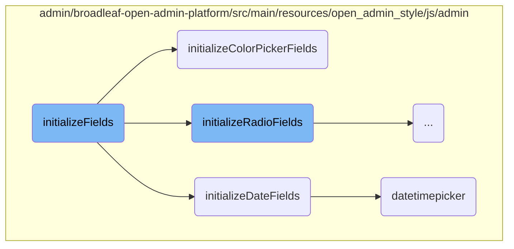

This document provides an overview of the <SwmToken path="admin/broadleaf-open-admin-platform/src/main/resources/open_admin_style/js/admin/blc-admin.js" pos="489:1:1" line-data="        initializeFields : function($container) {">`initializeFields`</SwmToken> function, which is responsible for setting up various types of fields within a specified container. It includes initializing text areas, color pickers, selectize fields, radio fields, and date fields. The document also covers the flow of how these fields are initialized and the interactions between different components.

The <SwmToken path="admin/broadleaf-open-admin-platform/src/main/resources/open_admin_style/js/admin/blc-admin.js" pos="489:1:1" line-data="        initializeFields : function($container) {">`initializeFields`</SwmToken> function starts by checking if a container is provided; if not, it defaults to the active tab or the body. It then runs field initialization handlers and checks if the container has already been initialized. If not, it proceeds to initialize different types of fields such as text areas, color pickers, selectize fields, radio fields, and date fields. Each type of field has its own initialization function, like <SwmToken path="admin/broadleaf-open-admin-platform/src/main/resources/open_admin_style/js/admin/blc-admin.js" pos="678:1:1" line-data="        initializeColorPickerFields : function($container) {">`initializeColorPickerFields`</SwmToken> for color pickers and <SwmToken path="admin/broadleaf-open-admin-platform/src/main/resources/open_admin_style/js/admin/blc-admin.js" pos="551:1:1" line-data="        initializeDateFields : function($container) {">`initializeDateFields`</SwmToken> for date fields. These functions set up the necessary plugins and event handlers to ensure the fields work correctly. Finally, the container is marked as initialized to prevent re-initialization.

Here is a high level diagram of the flow, showing only the most important functions:

```mermaid
graph TD;
      subgraph admin/broadleaf-open-admin-platform/src/main/resources/open_admin_style/js/admin
a6a3ca24e1b4b5f47b35b79ad693e368ff18f4804a874395b6067f6d5a30db79(initializeFields):::mainFlowStyle --> a3d4a3da082952a6c51bc77c5212988bb7e2598c138fd3ffa0cfe3f1a01ba1bc(initializeColorPickerFields)
end

subgraph admin/broadleaf-open-admin-platform/src/main/resources/open_admin_style/js/admin
a6a3ca24e1b4b5f47b35b79ad693e368ff18f4804a874395b6067f6d5a30db79(initializeFields):::mainFlowStyle --> 10b2ee29fed92ca2622fbc270d1a4e6fc9b58b11f9471812f331e757ce71a951(initializeDateFields)
end

subgraph admin/broadleaf-open-admin-platform/src/main/resources/open_admin_style/js/admin
a6a3ca24e1b4b5f47b35b79ad693e368ff18f4804a874395b6067f6d5a30db79(initializeFields):::mainFlowStyle --> f3f786b632f6aeed5cea30dc5e39700c333958642dd5f8e79fe0d86144a9fdf4(initializeRadioFields):::mainFlowStyle
end

subgraph admin/broadleaf-open-admin-platform/src/main/resources/open_admin_style/js/admin
f3f786b632f6aeed5cea30dc5e39700c333958642dd5f8e79fe0d86144a9fdf4(initializeRadioFields):::mainFlowStyle --> bfcca3bcd89798da9ca78e5dbdfe4aef223bf2fa67dc38b60d08dab1c4fae6e5(change):::mainFlowStyle
end

subgraph admin/broadleaf-open-admin-platform/src/main/resources/open_admin_style/js/admin
bfcca3bcd89798da9ca78e5dbdfe4aef223bf2fa67dc38b60d08dab1c4fae6e5(change):::mainFlowStyle --> 440a85073ca3327c4edf95b0c699984b90a4f5b9c208634d3b3bba254d41a188(spectrum):::mainFlowStyle
end

subgraph admin/broadleaf-open-admin-platform/src/main/resources/open_admin_style/js/admin
440a85073ca3327c4edf95b0c699984b90a4f5b9c208634d3b3bba254d41a188(spectrum):::mainFlowStyle --> 294393922a12ffaf30ffe5f21c9866f122db786b01c2d240876a4a699692c9cf(initialize):::mainFlowStyle
end


      classDef mainFlowStyle color:#000000,fill:#7CB9F4
classDef rootsStyle color:#000000,fill:#00FFF4
classDef Style1 color:#000000,fill:#00FFAA
classDef Style2 color:#000000,fill:#FFFF00
classDef Style3 color:#000000,fill:#AA7CB9

%% Swimm:
%% graph TD;
%%       subgraph <SwmPath>[admin/broadleaf-open-admin-platform/src/main/resources/open_admin_style/js/admin/](admin/broadleaf-open-admin-platform/src/main/resources/open_admin_style/js/admin/)</SwmPath>
%% a6a3ca24e1b4b5f47b35b79ad693e368ff18f4804a874395b6067f6d5a30db79(initializeFields):::mainFlowStyle --> a3d4a3da082952a6c51bc77c5212988bb7e2598c138fd3ffa0cfe3f1a01ba1bc(initializeColorPickerFields)
%% end
%% 
%% subgraph <SwmPath>[admin/broadleaf-open-admin-platform/src/main/resources/open_admin_style/js/admin/](admin/broadleaf-open-admin-platform/src/main/resources/open_admin_style/js/admin/)</SwmPath>
%% a6a3ca24e1b4b5f47b35b79ad693e368ff18f4804a874395b6067f6d5a30db79(initializeFields):::mainFlowStyle --> 10b2ee29fed92ca2622fbc270d1a4e6fc9b58b11f9471812f331e757ce71a951(initializeDateFields)
%% end
%% 
%% subgraph <SwmPath>[admin/broadleaf-open-admin-platform/src/main/resources/open_admin_style/js/admin/](admin/broadleaf-open-admin-platform/src/main/resources/open_admin_style/js/admin/)</SwmPath>
%% a6a3ca24e1b4b5f47b35b79ad693e368ff18f4804a874395b6067f6d5a30db79(initializeFields):::mainFlowStyle --> f3f786b632f6aeed5cea30dc5e39700c333958642dd5f8e79fe0d86144a9fdf4(initializeRadioFields):::mainFlowStyle
%% end
%% 
%% subgraph <SwmPath>[admin/broadleaf-open-admin-platform/src/main/resources/open_admin_style/js/admin/](admin/broadleaf-open-admin-platform/src/main/resources/open_admin_style/js/admin/)</SwmPath>
%% f3f786b632f6aeed5cea30dc5e39700c333958642dd5f8e79fe0d86144a9fdf4(initializeRadioFields):::mainFlowStyle --> bfcca3bcd89798da9ca78e5dbdfe4aef223bf2fa67dc38b60d08dab1c4fae6e5(change):::mainFlowStyle
%% end
%% 
%% subgraph <SwmPath>[admin/broadleaf-open-admin-platform/src/main/resources/open_admin_style/js/admin/](admin/broadleaf-open-admin-platform/src/main/resources/open_admin_style/js/admin/)</SwmPath>
%% bfcca3bcd89798da9ca78e5dbdfe4aef223bf2fa67dc38b60d08dab1c4fae6e5(change):::mainFlowStyle --> 440a85073ca3327c4edf95b0c699984b90a4f5b9c208634d3b3bba254d41a188(spectrum):::mainFlowStyle
%% end
%% 
%% subgraph <SwmPath>[admin/broadleaf-open-admin-platform/src/main/resources/open_admin_style/js/admin/](admin/broadleaf-open-admin-platform/src/main/resources/open_admin_style/js/admin/)</SwmPath>
%% 440a85073ca3327c4edf95b0c699984b90a4f5b9c208634d3b3bba254d41a188(spectrum):::mainFlowStyle --> 294393922a12ffaf30ffe5f21c9866f122db786b01c2d240876a4a699692c9cf(initialize):::mainFlowStyle
%% end
%% 
%% 
%%       classDef mainFlowStyle color:#000000,fill:#7CB9F4
%% classDef rootsStyle color:#000000,fill:#00FFF4
%% classDef Style1 color:#000000,fill:#00FFAA
%% classDef Style2 color:#000000,fill:#FFFF00
%% classDef Style3 color:#000000,fill:#AA7CB9
```



# Flow drill down

First, we'll zoom into this section of the flow:



<SwmSnippet path="/admin/broadleaf-open-admin-platform/src/main/resources/open_admin_style/js/admin/blc-admin.js" line="489">

---

## <SwmToken path="admin/broadleaf-open-admin-platform/src/main/resources/open_admin_style/js/admin/blc-admin.js" pos="489:1:1" line-data="        initializeFields : function($container) {">`initializeFields`</SwmToken>

The <SwmToken path="admin/broadleaf-open-admin-platform/src/main/resources/open_admin_style/js/admin/blc-admin.js" pos="489:1:1" line-data="        initializeFields : function($container) {">`initializeFields`</SwmToken> function is responsible for initializing various types of fields within a specified container. It first checks if a container is provided; if not, it defaults to the active tab or the body. It then runs field initialization handlers and checks if the container has already been initialized. If not, it proceeds to initialize different types of fields such as text areas, color pickers, selectize fields, radio fields, and date fields. Finally, it marks the container as initialized.

```javascript
        initializeFields : function($container) {

            // If there is no container specified, we'll initialize the active tab (or the body if there are no tabs)
            if ($container == null) {
                $container = BLCAdmin.getActiveTab();
            }

            // run field initialization handlers and see if we should continue initializing fields
            var continueInitialization = BLCAdmin.runFieldInitializationHandlers($container);

            // If we've already initialized this container, we'll skip it.
            if ($container.data('initialized') === 'true' || !continueInitialization) {
                if ($container.closest('.oms-tab').length) {
                    return;
                }
                // Update all listgrids sizing on the current tab just in case.
                $container.find('.listgrid-container tbody').each(function (index, element) {
                    BLCAdmin.listGrid.updateGridTitleBarSize($(element).closest('.listgrid-container').find('.fieldgroup-listgrid-wrapper-header'));
                    BLCAdmin.listGrid.paginate.updateGridSize($(element));
                });
                return;
```

---

</SwmSnippet>

<SwmSnippet path="/admin/broadleaf-open-admin-platform/src/main/resources/open_admin_style/js/admin/blc-admin.js" line="678">

---

### <SwmToken path="admin/broadleaf-open-admin-platform/src/main/resources/open_admin_style/js/admin/blc-admin.js" pos="678:1:1" line-data="        initializeColorPickerFields : function($container) {">`initializeColorPickerFields`</SwmToken>

The <SwmToken path="admin/broadleaf-open-admin-platform/src/main/resources/open_admin_style/js/admin/blc-admin.js" pos="678:1:1" line-data="        initializeColorPickerFields : function($container) {">`initializeColorPickerFields`</SwmToken> function initializes color picker fields within the specified container. It uses the <SwmToken path="admin/broadleaf-open-admin-platform/src/main/resources/open_admin_style/js/admin/blc-admin.js" pos="679:14:14" line-data="            $container.find(&quot;.color-picker&quot;).spectrum({">`spectrum`</SwmToken> plugin to set up the color picker with specific options like hiding buttons and setting the preferred format to hex. It also defines change and move event handlers to update the corresponding input field with the selected color value.

```javascript
        initializeColorPickerFields : function($container) {
            $container.find(".color-picker").spectrum({
                showButtons: false,
                preferredFormat: "hex6",
                change: function(color) {
                    $(this).closest('.field-group').find('input.color-picker-value').val(color).trigger('input');
                },
                move: function(color) {
                    $(this).closest('.field-group').find('input.color-picker-value').val(color).trigger('input');
                }
            });
        },
```

---

</SwmSnippet>

<SwmSnippet path="/admin/broadleaf-open-admin-platform/src/main/resources/open_admin_style/js/admin/blc-admin.js" line="551">

---

### <SwmToken path="admin/broadleaf-open-admin-platform/src/main/resources/open_admin_style/js/admin/blc-admin.js" pos="551:1:1" line-data="        initializeDateFields : function($container) {">`initializeDateFields`</SwmToken>

The <SwmToken path="admin/broadleaf-open-admin-platform/src/main/resources/open_admin_style/js/admin/blc-admin.js" pos="551:1:1" line-data="        initializeDateFields : function($container) {">`initializeDateFields`</SwmToken> function initializes date and time picker fields within the specified container. It sets up hidden clones for actual values, renames original fields for display values, and configures the <SwmToken path="admin/broadleaf-open-admin-platform/src/main/resources/open_admin_style/js/admin/blc-admin.js" pos="552:8:8" line-data="            $container.find(&#39;.datetimepicker&#39;).each(function (index, element) {">`datetimepicker`</SwmToken> plugin with desired display formats. It also handles input events to update hidden clones and initializes tooltips and dropdown menus for better user experience.

```javascript
        initializeDateFields : function($container) {
            $container.find('.datetimepicker').each(function (index, element) {
                // create a hidden clone, which will contain the actual value
                var $self = $(this);
                var $clone = $self.clone();
                $clone.insertAfter(this);
                $clone.hide();

                // rename the original field, used to contain the display value
                $self.attr('id', $self.attr('id') + '-display');
                $self.attr('name', $self.attr('name') + '-display');

                // create the datetimepicker with the desired display format
                $self.datetimepicker({
                    formatTime: "g:ia",
                    format: "l, F d, Y \@ g:ia",
                    onClose: function(current_time, $input) {
                        if (current_time) {
                            var dateString = '' +
                                current_time.getFullYear() + '.' +
                                ('0' + (current_time.getMonth() + 1).toString()).slice(-2) + '.' +
```

---

</SwmSnippet>

<SwmSnippet path="/admin/broadleaf-open-admin-platform/src/main/resources/open_admin_style/js/admin/lib/plugins/jquery.datetimepicker.js" line="666">

---

### datetimepicker

The <SwmToken path="admin/broadleaf-open-admin-platform/src/main/resources/open_admin_style/js/admin/lib/plugins/jquery.datetimepicker.js" pos="666:4:4" line-data="	$.fn.datetimepicker = function (opt) {">`datetimepicker`</SwmToken> function is a <SwmToken path="admin/broadleaf-open-admin-platform/src/main/resources/open_admin_style/js/admin/blc-admin.js" pos="158:10:10" line-data="         *  $form - the JQuery form object that was submitted">`JQuery`</SwmToken> plugin that provides a comprehensive date and time picker functionality. It includes various configurations and event handlers to manage the display and selection of date and time values. The plugin supports lazy initialization, custom date formats, and various utility functions to handle date and time operations.

```javascript
	$.fn.datetimepicker = function (opt) {
		var KEY0 = 48,
			KEY9 = 57,
			_KEY0 = 96,
			_KEY9 = 105,
			CTRLKEY = 17,
			DEL = 46,
			ENTER = 13,
			ESC = 27,
			BACKSPACE = 8,
			ARROWLEFT = 37,
			ARROWUP = 38,
			ARROWRIGHT = 39,
			ARROWDOWN = 40,
			TAB = 9,
			F5 = 116,
			AKEY = 65,
			CKEY = 67,
			VKEY = 86,
			ZKEY = 90,
			YKEY = 89,
```

---

</SwmSnippet>

Now, lets zoom into this section of the flow:

```mermaid
graph TD;
      subgraph admin/broadleaf-open-admin-platform/src/main/resources/open_admin_style/js/admin
f3f786b632f6aeed5cea30dc5e39700c333958642dd5f8e79fe0d86144a9fdf4(initializeRadioFields):::mainFlowStyle --> bfcca3bcd89798da9ca78e5dbdfe4aef223bf2fa67dc38b60d08dab1c4fae6e5(change):::mainFlowStyle
end

subgraph admin/broadleaf-open-admin-platform/src/main/resources/open_admin_style/js/admin
bfcca3bcd89798da9ca78e5dbdfe4aef223bf2fa67dc38b60d08dab1c4fae6e5(change):::mainFlowStyle --> 440a85073ca3327c4edf95b0c699984b90a4f5b9c208634d3b3bba254d41a188(spectrum):::mainFlowStyle
end

subgraph admin/broadleaf-open-admin-platform/src/main/resources/open_admin_style/js/admin
440a85073ca3327c4edf95b0c699984b90a4f5b9c208634d3b3bba254d41a188(spectrum):::mainFlowStyle --> 294393922a12ffaf30ffe5f21c9866f122db786b01c2d240876a4a699692c9cf(initialize):::mainFlowStyle
end


      classDef mainFlowStyle color:#000000,fill:#7CB9F4
classDef rootsStyle color:#000000,fill:#00FFF4
classDef Style1 color:#000000,fill:#00FFAA
classDef Style2 color:#000000,fill:#FFFF00
classDef Style3 color:#000000,fill:#AA7CB9

%% Swimm:
%% graph TD;
%%       subgraph <SwmPath>[admin/broadleaf-open-admin-platform/src/main/resources/open_admin_style/js/admin/](admin/broadleaf-open-admin-platform/src/main/resources/open_admin_style/js/admin/)</SwmPath>
%% f3f786b632f6aeed5cea30dc5e39700c333958642dd5f8e79fe0d86144a9fdf4(initializeRadioFields):::mainFlowStyle --> bfcca3bcd89798da9ca78e5dbdfe4aef223bf2fa67dc38b60d08dab1c4fae6e5(change):::mainFlowStyle
%% end
%% 
%% subgraph <SwmPath>[admin/broadleaf-open-admin-platform/src/main/resources/open_admin_style/js/admin/](admin/broadleaf-open-admin-platform/src/main/resources/open_admin_style/js/admin/)</SwmPath>
%% bfcca3bcd89798da9ca78e5dbdfe4aef223bf2fa67dc38b60d08dab1c4fae6e5(change):::mainFlowStyle --> 440a85073ca3327c4edf95b0c699984b90a4f5b9c208634d3b3bba254d41a188(spectrum):::mainFlowStyle
%% end
%% 
%% subgraph <SwmPath>[admin/broadleaf-open-admin-platform/src/main/resources/open_admin_style/js/admin/](admin/broadleaf-open-admin-platform/src/main/resources/open_admin_style/js/admin/)</SwmPath>
%% 440a85073ca3327c4edf95b0c699984b90a4f5b9c208634d3b3bba254d41a188(spectrum):::mainFlowStyle --> 294393922a12ffaf30ffe5f21c9866f122db786b01c2d240876a4a699692c9cf(initialize):::mainFlowStyle
%% end
%% 
%% 
%%       classDef mainFlowStyle color:#000000,fill:#7CB9F4
%% classDef rootsStyle color:#000000,fill:#00FFF4
%% classDef Style1 color:#000000,fill:#00FFAA
%% classDef Style2 color:#000000,fill:#FFFF00
%% classDef Style3 color:#000000,fill:#AA7CB9
```



<SwmSnippet path="/admin/broadleaf-open-admin-platform/src/main/resources/open_admin_style/js/admin/blc-admin.js" line="635">

---

## <SwmToken path="admin/broadleaf-open-admin-platform/src/main/resources/open_admin_style/js/admin/blc-admin.js" pos="537:3:3" line-data="            BLCAdmin.initializeRadioFields($container);">`initializeRadioFields`</SwmToken>

The <SwmToken path="admin/broadleaf-open-admin-platform/src/main/resources/open_admin_style/js/admin/blc-admin.js" pos="537:3:3" line-data="            BLCAdmin.initializeRadioFields($container);">`initializeRadioFields`</SwmToken> function sets up click event listeners on elements with the class <SwmToken path="admin/broadleaf-open-admin-platform/src/main/resources/open_admin_style/js/admin/blc-admin.js" pos="635:8:10" line-data="            $container.find(&#39;.radio-label&#39;).on(&quot;click&quot;, function(e) {">`radio-label`</SwmToken>. When a <SwmToken path="admin/broadleaf-open-admin-platform/src/main/resources/open_admin_style/js/admin/blc-admin.js" pos="635:8:10" line-data="            $container.find(&#39;.radio-label&#39;).on(&quot;click&quot;, function(e) {">`radio-label`</SwmToken> is clicked, it checks if the element is not disabled, prevents the default action, and sets the previous input element to checked, triggering a change event.

```javascript
            $container.find('.radio-label').on("click", function(e) {
                if (!$(this).hasClass('disabled')) {
                    e.preventDefault();
                    $(this).prev('input').prop("checked", true).change();
                }
            });
```

---

</SwmSnippet>

<SwmSnippet path="/admin/broadleaf-open-admin-platform/src/main/resources/open_admin_style/js/admin/blc-admin.js" line="682">

---

## change

The <SwmToken path="admin/broadleaf-open-admin-platform/src/main/resources/open_admin_style/js/admin/blc-admin.js" pos="682:1:1" line-data="                change: function(color) {">`change`</SwmToken> function is triggered when the color value changes. It updates the input field with the new color value and triggers an input event to ensure the change is registered.

```javascript
                change: function(color) {
                    $(this).closest('.field-group').find('input.color-picker-value').val(color).trigger('input');
                },
```

---

</SwmSnippet>

<SwmSnippet path="/admin/broadleaf-open-admin-platform/src/main/resources/open_admin_style/js/admin/lib/plugins/spectrum.js" line="178">

---

## spectrum

The <SwmToken path="admin/broadleaf-open-admin-platform/src/main/resources/open_admin_style/js/admin/lib/plugins/spectrum.js" pos="178:3:3" line-data="    function spectrum(element, o) {">`spectrum`</SwmToken> function initializes the color picker plugin with various options such as <SwmToken path="admin/broadleaf-open-admin-platform/src/main/resources/open_admin_style/js/admin/lib/plugins/spectrum.js" pos="181:1:1" line-data="            flat = opts.flat,">`flat`</SwmToken>, <SwmToken path="admin/broadleaf-open-admin-platform/src/main/resources/open_admin_style/js/admin/lib/plugins/spectrum.js" pos="182:1:1" line-data="            showSelectionPalette = opts.showSelectionPalette,">`showSelectionPalette`</SwmToken>, and <SwmToken path="admin/broadleaf-open-admin-platform/src/main/resources/open_admin_style/js/admin/lib/plugins/spectrum.js" pos="183:1:1" line-data="            localStorageKey = opts.localStorageKey,">`localStorageKey`</SwmToken>. It also sets up callbacks and event listeners for user interactions.

```javascript
    function spectrum(element, o) {

        var opts = instanceOptions(o, element),
            flat = opts.flat,
            showSelectionPalette = opts.showSelectionPalette,
            localStorageKey = opts.localStorageKey,
            theme = opts.theme,
            callbacks = opts.callbacks,
            resize = throttle(reflow, 10),
```

---

</SwmSnippet>

<SwmSnippet path="/admin/broadleaf-open-admin-platform/src/main/resources/open_admin_style/js/admin/lib/plugins/spectrum.js" line="276">

---

## initialize

The <SwmToken path="admin/broadleaf-open-admin-platform/src/main/resources/open_admin_style/js/admin/lib/plugins/spectrum.js" pos="276:3:3" line-data="        function initialize() {">`initialize`</SwmToken> function sets up the color picker UI and binds event listeners for various user interactions, such as clicking on the color picker, typing in the input field, and clicking on control buttons like cancel and clear.

```javascript
        function initialize() {

            if (IE) {
                container.find("*:not(input)").attr("unselectable", "on");
            }

            applyOptions();

            if (shouldReplace) {
                boundElement.after(replacer).hide();
            }

            if (!allowEmpty) {
                clearButton.hide();
            }

            if (flat) {
                boundElement.after(container).hide();
            }
            else {

```

---

</SwmSnippet>

# Where is this flow used?

This flow is used multiple times in the codebase as represented in the following diagram:

(Note - these are only some of the entry points of this flow)

```mermaid
graph TD;
      subgraph admin/broadleaf-open-admin-platform/src/main/resources/open_admin_style/js/admin/lib/plugins
7738f3e20cd9481f3a3b9a7953b673e2cb36d978facc1cbab08ed005d983ccbe(processSubmitCall):::rootsStyle --> d0cd6b095efedac3da9da17ab0d78c17b947ec2793858509752c7ee690d3c4e8(submit)
end

subgraph admin/broadleaf-open-admin-platform/src/main/resources/open_admin_style/js/admin/lib/plugins
d0cd6b095efedac3da9da17ab0d78c17b947ec2793858509752c7ee690d3c4e8(submit) --> d91b58de8bcee409a18d491461925510e05defcb6b7781c3b03f992be8224c5a(_onSend)
end

subgraph admin/broadleaf-open-admin-platform/src/main/resources/open_admin_style/js/admin/lib/plugins
d91b58de8bcee409a18d491461925510e05defcb6b7781c3b03f992be8224c5a(_onSend) --> 88d0856b4da7feb3c7f870bba8bba8c8c34db19f84c92f95f6dcd533951e5bf1(send)
end

subgraph admin/broadleaf-open-admin-platform/src/main/resources/open_admin_style/js/admin/lib/plugins
88d0856b4da7feb3c7f870bba8bba8c8c34db19f84c92f95f6dcd533951e5bf1(send) --> 58923a25f701069f5acd2d5c89e72cfe3b17759560b40c4ec9a4f4c0733ce1f7(_chunkedUpload)
end

subgraph admin/broadleaf-open-admin-platform/src/main/resources/open_admin_style/js/admin/lib/plugins
58923a25f701069f5acd2d5c89e72cfe3b17759560b40c4ec9a4f4c0733ce1f7(_chunkedUpload) --> 0deeaa034b1681b5a29ba03b362330aa439f50f2556f2b717027e32d57eda554(upload)
end

subgraph common/src/main/resources/common_style/js/BLC.js
0deeaa034b1681b5a29ba03b362330aa439f50f2556f2b717027e32d57eda554(upload) --> 735e8dabf9d808e57e1ae9226d6dc2bbd430d5caf620c06e056b1f2093d3b0a4(ajax)
end

subgraph admin/broadleaf-open-admin-platform/src/main/resources/open_admin_style/js/admin
735e8dabf9d808e57e1ae9226d6dc2bbd430d5caf620c06e056b1f2093d3b0a4(ajax) --> 27904be92202cd2eff089cef66b59791d02cebd758830360ad926dbf64c85e2d(callback)
end

subgraph admin/broadleaf-open-admin-platform/src/main/resources/open_admin_style/js/admin
27904be92202cd2eff089cef66b59791d02cebd758830360ad926dbf64c85e2d(callback) --> a6a3ca24e1b4b5f47b35b79ad693e368ff18f4804a874395b6067f6d5a30db79(initializeFields):::mainFlowStyle
end

subgraph admin/broadleaf-open-admin-platform/src/main/resources/open_admin_style/js/admin/lib/plugins
c485b096408b2a47636c40d424a269a0b75898b0026c5e264679bea5503dd47b(add):::rootsStyle --> d0cd6b095efedac3da9da17ab0d78c17b947ec2793858509752c7ee690d3c4e8(submit)
end

subgraph admin/broadleaf-open-admin-platform/src/main/resources/open_admin_style/js/admin/lib/plugins
c485b096408b2a47636c40d424a269a0b75898b0026c5e264679bea5503dd47b(add):::rootsStyle --> d0cd6b095efedac3da9da17ab0d78c17b947ec2793858509752c7ee690d3c4e8(submit)
end

subgraph admin/broadleaf-open-admin-platform/src/main/resources/open_admin_style/js/admin/lib/plugins
b72efa65c1e8e12b42248f48fd5f8df7e85d52b6407c6aa5d13d874a6bd6b567(assetSelected):::rootsStyle --> d0cd6b095efedac3da9da17ab0d78c17b947ec2793858509752c7ee690d3c4e8(submit)
end

subgraph admin/broadleaf-open-admin-platform/src/main/resources/open_admin_style/js/admin/lib/plugins
10c19510986262ace8f57ef8a362ffc3edb7637f90f058bf2e891d262a194c41(_startHandler):::rootsStyle --> d0cd6b095efedac3da9da17ab0d78c17b947ec2793858509752c7ee690d3c4e8(submit)
end


      classDef mainFlowStyle color:#000000,fill:#7CB9F4
classDef rootsStyle color:#000000,fill:#00FFF4
classDef Style1 color:#000000,fill:#00FFAA
classDef Style2 color:#000000,fill:#FFFF00
classDef Style3 color:#000000,fill:#AA7CB9

%% Swimm:
%% graph TD;
%%       subgraph <SwmPath>[admin/broadleaf-open-admin-platform/src/main/resources/open_admin_style/js/admin/lib/plugins/](admin/broadleaf-open-admin-platform/src/main/resources/open_admin_style/js/admin/lib/plugins/)</SwmPath>
%% 7738f3e20cd9481f3a3b9a7953b673e2cb36d978facc1cbab08ed005d983ccbe(processSubmitCall):::rootsStyle --> d0cd6b095efedac3da9da17ab0d78c17b947ec2793858509752c7ee690d3c4e8(submit)
%% end
%% 
%% subgraph <SwmPath>[admin/broadleaf-open-admin-platform/src/main/resources/open_admin_style/js/admin/lib/plugins/](admin/broadleaf-open-admin-platform/src/main/resources/open_admin_style/js/admin/lib/plugins/)</SwmPath>
%% d0cd6b095efedac3da9da17ab0d78c17b947ec2793858509752c7ee690d3c4e8(submit) --> d91b58de8bcee409a18d491461925510e05defcb6b7781c3b03f992be8224c5a(_onSend)
%% end
%% 
%% subgraph <SwmPath>[admin/broadleaf-open-admin-platform/src/main/resources/open_admin_style/js/admin/lib/plugins/](admin/broadleaf-open-admin-platform/src/main/resources/open_admin_style/js/admin/lib/plugins/)</SwmPath>
%% d91b58de8bcee409a18d491461925510e05defcb6b7781c3b03f992be8224c5a(_onSend) --> 88d0856b4da7feb3c7f870bba8bba8c8c34db19f84c92f95f6dcd533951e5bf1(send)
%% end
%% 
%% subgraph <SwmPath>[admin/broadleaf-open-admin-platform/src/main/resources/open_admin_style/js/admin/lib/plugins/](admin/broadleaf-open-admin-platform/src/main/resources/open_admin_style/js/admin/lib/plugins/)</SwmPath>
%% 88d0856b4da7feb3c7f870bba8bba8c8c34db19f84c92f95f6dcd533951e5bf1(send) --> 58923a25f701069f5acd2d5c89e72cfe3b17759560b40c4ec9a4f4c0733ce1f7(_chunkedUpload)
%% end
%% 
%% subgraph <SwmPath>[admin/broadleaf-open-admin-platform/src/main/resources/open_admin_style/js/admin/lib/plugins/](admin/broadleaf-open-admin-platform/src/main/resources/open_admin_style/js/admin/lib/plugins/)</SwmPath>
%% 58923a25f701069f5acd2d5c89e72cfe3b17759560b40c4ec9a4f4c0733ce1f7(_chunkedUpload) --> 0deeaa034b1681b5a29ba03b362330aa439f50f2556f2b717027e32d57eda554(upload)
%% end
%% 
%% subgraph <SwmPath>[common/src/main/resources/common_style/js/BLC.js](common/src/main/resources/common_style/js/BLC.js)</SwmPath>
%% 0deeaa034b1681b5a29ba03b362330aa439f50f2556f2b717027e32d57eda554(upload) --> 735e8dabf9d808e57e1ae9226d6dc2bbd430d5caf620c06e056b1f2093d3b0a4(ajax)
%% end
%% 
%% subgraph <SwmPath>[admin/broadleaf-open-admin-platform/src/main/resources/open_admin_style/js/admin/](admin/broadleaf-open-admin-platform/src/main/resources/open_admin_style/js/admin/)</SwmPath>
%% 735e8dabf9d808e57e1ae9226d6dc2bbd430d5caf620c06e056b1f2093d3b0a4(ajax) --> 27904be92202cd2eff089cef66b59791d02cebd758830360ad926dbf64c85e2d(callback)
%% end
%% 
%% subgraph <SwmPath>[admin/broadleaf-open-admin-platform/src/main/resources/open_admin_style/js/admin/](admin/broadleaf-open-admin-platform/src/main/resources/open_admin_style/js/admin/)</SwmPath>
%% 27904be92202cd2eff089cef66b59791d02cebd758830360ad926dbf64c85e2d(callback) --> a6a3ca24e1b4b5f47b35b79ad693e368ff18f4804a874395b6067f6d5a30db79(initializeFields):::mainFlowStyle
%% end
%% 
%% subgraph <SwmPath>[admin/broadleaf-open-admin-platform/src/main/resources/open_admin_style/js/admin/lib/plugins/](admin/broadleaf-open-admin-platform/src/main/resources/open_admin_style/js/admin/lib/plugins/)</SwmPath>
%% c485b096408b2a47636c40d424a269a0b75898b0026c5e264679bea5503dd47b(add):::rootsStyle --> d0cd6b095efedac3da9da17ab0d78c17b947ec2793858509752c7ee690d3c4e8(submit)
%% end
%% 
%% subgraph <SwmPath>[admin/broadleaf-open-admin-platform/src/main/resources/open_admin_style/js/admin/lib/plugins/](admin/broadleaf-open-admin-platform/src/main/resources/open_admin_style/js/admin/lib/plugins/)</SwmPath>
%% c485b096408b2a47636c40d424a269a0b75898b0026c5e264679bea5503dd47b(add):::rootsStyle --> d0cd6b095efedac3da9da17ab0d78c17b947ec2793858509752c7ee690d3c4e8(submit)
%% end
%% 
%% subgraph <SwmPath>[admin/broadleaf-open-admin-platform/src/main/resources/open_admin_style/js/admin/lib/plugins/](admin/broadleaf-open-admin-platform/src/main/resources/open_admin_style/js/admin/lib/plugins/)</SwmPath>
%% b72efa65c1e8e12b42248f48fd5f8df7e85d52b6407c6aa5d13d874a6bd6b567(assetSelected):::rootsStyle --> d0cd6b095efedac3da9da17ab0d78c17b947ec2793858509752c7ee690d3c4e8(submit)
%% end
%% 
%% subgraph <SwmPath>[admin/broadleaf-open-admin-platform/src/main/resources/open_admin_style/js/admin/lib/plugins/](admin/broadleaf-open-admin-platform/src/main/resources/open_admin_style/js/admin/lib/plugins/)</SwmPath>
%% 10c19510986262ace8f57ef8a362ffc3edb7637f90f058bf2e891d262a194c41(_startHandler):::rootsStyle --> d0cd6b095efedac3da9da17ab0d78c17b947ec2793858509752c7ee690d3c4e8(submit)
%% end
%% 
%% 
%%       classDef mainFlowStyle color:#000000,fill:#7CB9F4
%% classDef rootsStyle color:#000000,fill:#00FFF4
%% classDef Style1 color:#000000,fill:#00FFAA
%% classDef Style2 color:#000000,fill:#FFFF00
%% classDef Style3 color:#000000,fill:#AA7CB9
```



&nbsp;

*This is an auto-generated document by Swimm AI 🌊 and has not yet been verified by a human*

<SwmMeta version="3.0.0" repo-id="Z2l0aHViJTNBJTNBQnJvYWRsZWFmQ29tbWVyY2UtZGVtby1uZXclM0ElM0FTd2ltbS1EZW1v" repo-name="BroadleafCommerce-demo-new" doc-type="flows"><sup>Powered by [Swimm](/)</sup></SwmMeta>
