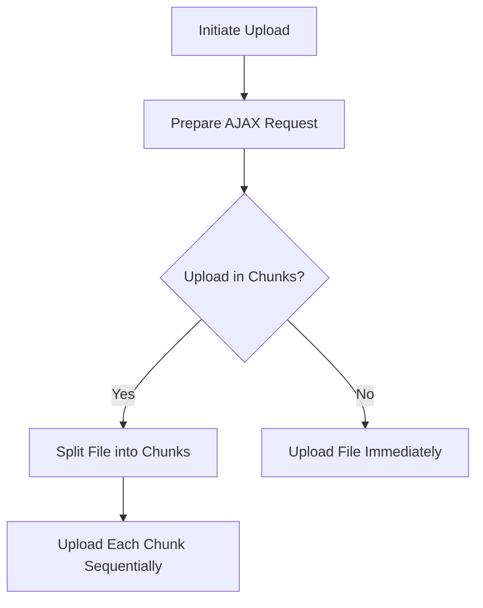

The process of submitting a file upload involves several steps:

1. Initiating the upload
2. Preparing the AJAX request
3. Handling chunked uploads if necessary.

Technical document: <SwmLink doc-title="File Upload Submit Process">[File Upload Submit Process](/.swm/file-upload-submit-process.rydghdxa.sw.md)</SwmLink>

# [Initiating the Upload](https://app.swimm.io/repos/Z2l0aHViJTNBJTNBQnJvYWRsZWFmQ29tbWVyY2UtZGVtby1uZXclM0ElM0FTd2ltbS1EZW1v/docs/rydghdxa#submit-function)

The file upload process begins when the user initiates an upload. The system first checks if the current state is valid (i.e., not 'pending'). If the state is valid, it triggers the submit event and proceeds to handle the actual sending of the file.

# [Preparing the AJAX Request](https://app.swimm.io/repos/Z2l0aHViJTNBJTNBQnJvYWRsZWFmQ29tbWVyY2UtZGVtby1uZXclM0ElM0FTd2ltbS1EZW1v/docs/rydghdxa#_onsend-function)

Once the upload is initiated, the system prepares the AJAX request. This involves adding convenience methods to the data object if they are not already present. The system then retrieves the AJAX settings, which include merging default options with data-specific options and initializing form and data settings. Based on these settings, the system decides whether to send the request immediately or queue it.

# [Handling Chunked Uploads](https://app.swimm.io/repos/Z2l0aHViJTNBJTNBQnJvYWRsZWFmQ29tbWVyY2UtZGVtby1uZXclM0ElM0FTd2ltbS1EZW1v/docs/rydghdxa#_chunkedupload-function)

If the file needs to be uploaded in chunks, the system splits the file into smaller parts. Each part is uploaded sequentially until the entire file is uploaded. This involves checking if the file should be uploaded in chunks, slicing the file to create blobs for each chunk, and processing the upload data. Progress listeners are added for each chunk upload, and events are triggered for each chunk upload. The system recursively calls the upload function until all chunks are uploaded.

&nbsp;

*This is an auto-generated document by Swimm AI 🌊 and has not yet been verified by a human*

<SwmMeta version="3.0.0" repo-id="Z2l0aHViJTNBJTNBQnJvYWRsZWFmQ29tbWVyY2UtZGVtby1uZXclM0ElM0FTd2ltbS1EZW1v" repo-name="BroadleafCommerce-demo-new" doc-type="product-flows">Powered by [Swimm](/)</SwmMeta>
