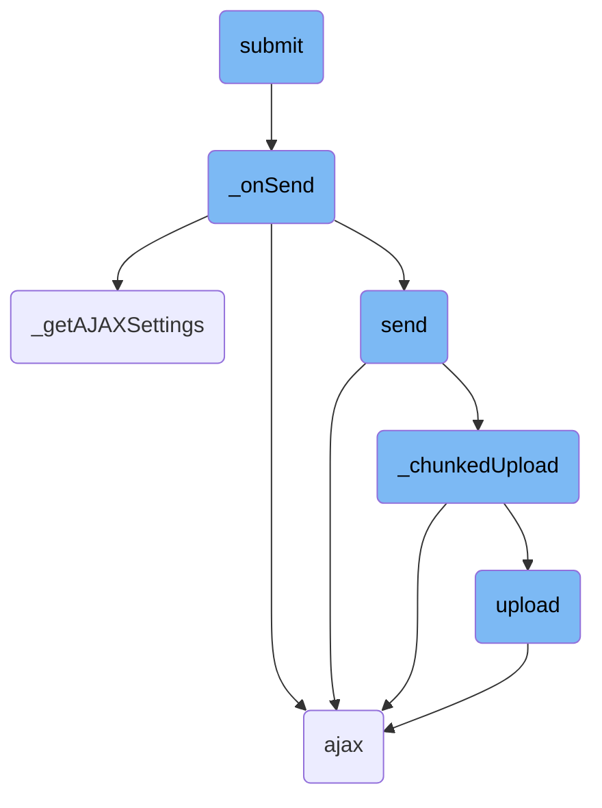
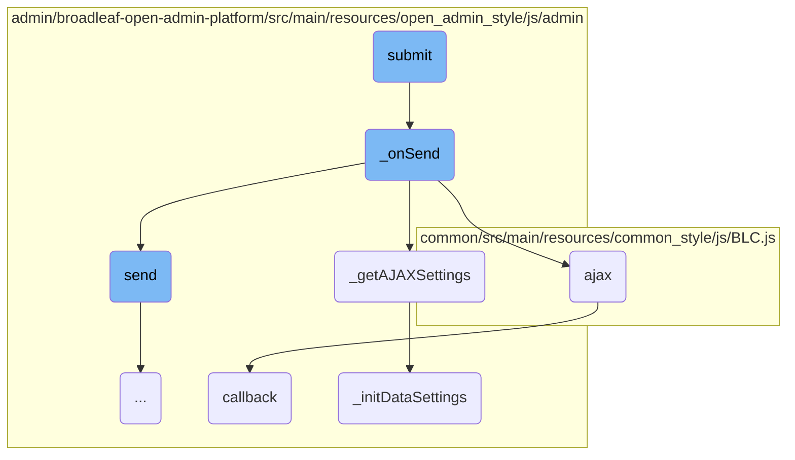
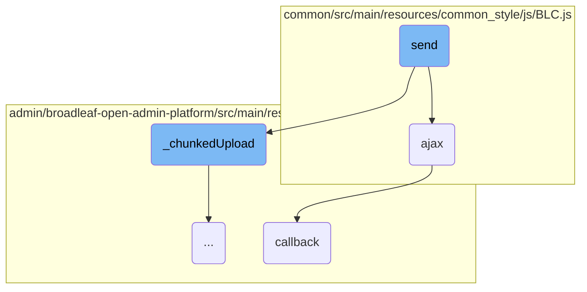
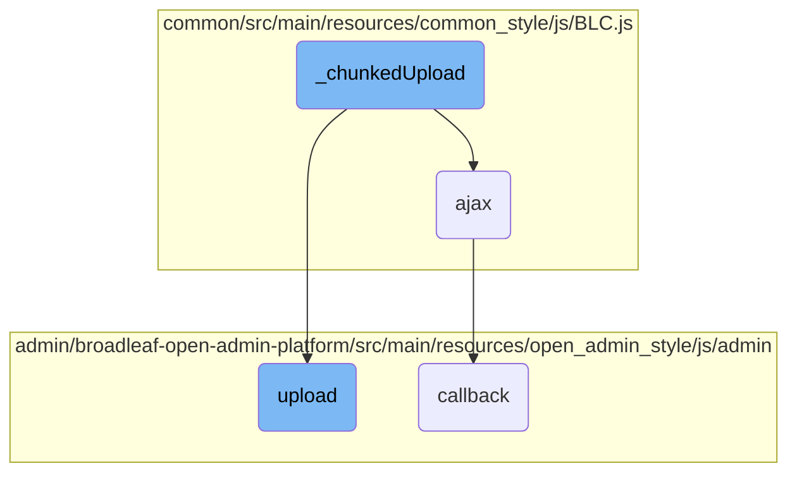
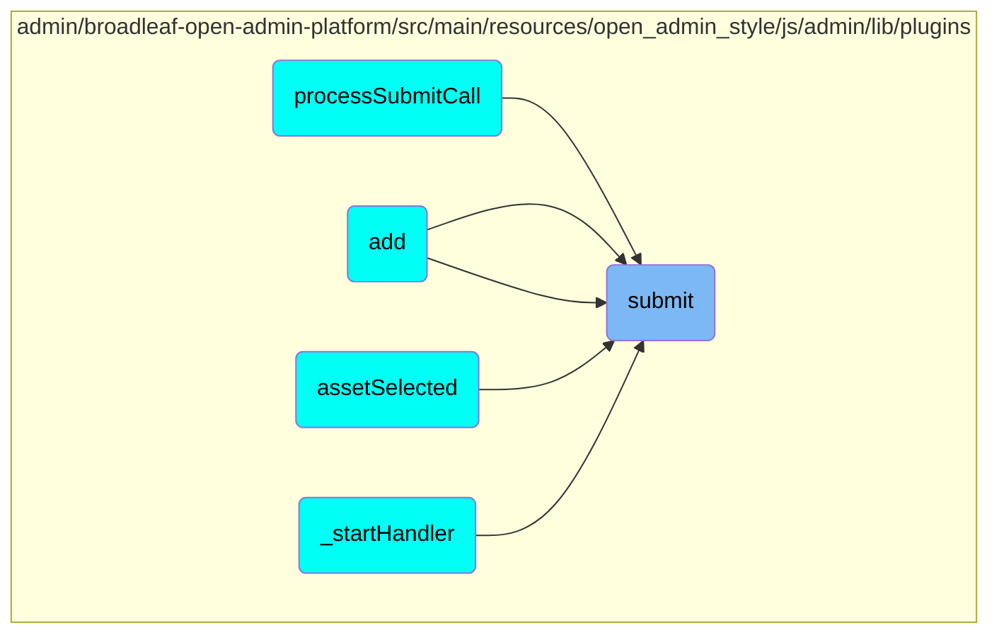

In this document, we will explain the process of submitting a file upload. The process involves several steps, including initiating the upload, preparing the AJAX request, and handling the upload in chunks if necessary.

The submit process starts when a file upload is initiated. First, it checks if the current state is valid. If it is, it triggers the submit event and calls the function to handle the actual sending of the file. The function prepares the AJAX request and either sends it immediately or queues it based on the upload settings. If the file needs to be uploaded in chunks, it splits the file into smaller parts and uploads each part sequentially until the entire file is uploaded.

Here is a high level diagram of the flow, showing only the most important functions:



# Flow drill down

First, we'll zoom into this section of the flow:



<SwmSnippet path="/admin/broadleaf-open-admin-platform/src/main/resources/open_admin_style/js/admin/lib/plugins/jquery.fileupload.js" line="532">

---

## Submit Function

The <SwmToken path="admin/broadleaf-open-admin-platform/src/main/resources/open_admin_style/js/admin/lib/plugins/jquery.fileupload.js" pos="532:3:3" line-data="            data.submit = function () {">`submit`</SwmToken> function initiates the file upload process. It first checks if the current state is not 'pending'. If the state is valid, it triggers the <SwmToken path="admin/broadleaf-open-admin-platform/src/main/resources/open_admin_style/js/admin/lib/plugins/jquery.fileupload.js" pos="532:3:3" line-data="            data.submit = function () {">`submit`</SwmToken> event and calls the <SwmToken path="admin/broadleaf-open-admin-platform/src/main/resources/open_admin_style/js/admin/lib/plugins/jquery.fileupload.js" pos="536:3:3" line-data="                        that._onSend(e, this);">`_onSend`</SwmToken> function to handle the actual sending of the file.

```javascript
            data.submit = function () {
                if (this.state() !== 'pending') {
                    data.jqXHR = this.jqXHR =
                        (that._trigger('submit', e, this) !== false) &&
                        that._onSend(e, this);
                }
                return this.jqXHR || that._getXHRPromise();
            };
```

---

</SwmSnippet>

<SwmSnippet path="/admin/broadleaf-open-admin-platform/src/main/resources/open_admin_style/js/admin/lib/plugins/jquery.fileupload.js" line="736">

---

## <SwmToken path="admin/broadleaf-open-admin-platform/src/main/resources/open_admin_style/js/admin/lib/plugins/jquery.fileupload.js" pos="736:1:1" line-data="        _onSend: function (e, data) {">`_onSend`</SwmToken> Function

The <SwmToken path="admin/broadleaf-open-admin-platform/src/main/resources/open_admin_style/js/admin/lib/plugins/jquery.fileupload.js" pos="736:1:1" line-data="        _onSend: function (e, data) {">`_onSend`</SwmToken> function is responsible for preparing and sending the AJAX request. It first adds convenience methods to the data object if they are not already present. It then retrieves the AJAX settings using <SwmToken path="admin/broadleaf-open-admin-platform/src/main/resources/open_admin_style/js/admin/lib/plugins/jquery.fileupload.js" pos="745:7:7" line-data="                options = that._getAJAXSettings(data),">`_getAJAXSettings`</SwmToken>, and either sends the request immediately or queues it based on the upload settings.

```javascript
        _onSend: function (e, data) {
            if (!data.submit) {
                this._addConvenienceMethods(e, data);
            }
            var that = this,
                jqXHR,
                aborted,
                slot,
                pipe,
                options = that._getAJAXSettings(data),
                send = function () {
                    that._sending += 1;
                    // Set timer for bitrate progress calculation:
                    options._bitrateTimer = new that._BitrateTimer();
                    jqXHR = jqXHR || (
                        ((aborted || that._trigger('send', e, options) === false) &&
                        that._getXHRPromise(false, options.context, aborted)) ||
                        that._chunkedUpload(options) || $.ajax(options)
                    ).done(function (result, textStatus, jqXHR) {
                        that._onDone(result, textStatus, jqXHR, options);
                    }).fail(function (jqXHR, textStatus, errorThrown) {
```

---

</SwmSnippet>

<SwmSnippet path="/admin/broadleaf-open-admin-platform/src/main/resources/open_admin_style/js/admin/lib/plugins/jquery.fileupload.js" line="483">

---

### Retrieving AJAX Settings

The <SwmToken path="admin/broadleaf-open-admin-platform/src/main/resources/open_admin_style/js/admin/lib/plugins/jquery.fileupload.js" pos="483:1:1" line-data="        _getAJAXSettings: function (data) {">`_getAJAXSettings`</SwmToken> function merges the default options with the data-specific options. It initializes form and data settings before returning the final options object.

```javascript
        _getAJAXSettings: function (data) {
            var options = $.extend({}, this.options, data);
            this._initFormSettings(options);
            this._initDataSettings(options);
            return options;
        },
```

---

</SwmSnippet>

<SwmSnippet path="/common/src/main/resources/common_style/js/BLC.js" line="135">

---

## AJAX Function

The <SwmToken path="common/src/main/resources/common_style/js/BLC.js" pos="135:3:3" line-data="    function ajax(options, callback) {">`ajax`</SwmToken> function is a wrapper around <SwmToken path="admin/broadleaf-open-admin-platform/src/main/resources/open_admin_style/js/admin/lib/plugins/jquery.fileupload.js" pos="138:7:9" line-data="            // handlers using jQuery&#39;s Deferred callbacks:">`jQuery's`</SwmToken> <SwmToken path="admin/broadleaf-open-admin-platform/src/main/resources/open_admin_style/js/admin/lib/plugins/jquery.fileupload.js" pos="753:10:11" line-data="                        that._chunkedUpload(options) || $.ajax(options)">`$.ajax`</SwmToken> method. It sets default values for the request type and URL parameters, handles CSRF and state version tokens, and defines success and error callbacks.

```javascript
    function ajax(options, callback) {
        if (options.type == null) {
            options.type = 'GET';
        }

        var baseUrl = window.location.href;
        if (baseUrl.indexOf('isPostAdd') != -1) {
            if (options.url.indexOf('isPostAdd') < 0) {
                if (options.url.indexOf('?') > 0) {
                    options.url += "&";
                } else {
                    options.url += "?";
                }
                options.url += "isPostAdd=true";
            }
        }
        var savedCatalogElement = $('input[name ="catalogEntityCatalogDiscriminatorId"]');
        var savedCatalog=null;

        if(savedCatalogElement.length){
            //0 should be the one we need, other can be from the modal form
```

---

</SwmSnippet>

<SwmSnippet path="/admin/broadleaf-open-admin-platform/src/main/resources/open_admin_style/js/admin/blc-admin-init.js" line="33">

---

## Callback Function

The <SwmToken path="admin/broadleaf-open-admin-platform/src/main/resources/open_admin_style/js/admin/blc-admin-init.js" pos="33:1:1" line-data="            callback: function() {">`callback`</SwmToken> function is used to initialize and update fields in the admin interface after an AJAX request completes. It calls <SwmToken path="admin/broadleaf-open-admin-platform/src/main/resources/open_admin_style/js/admin/blc-admin-init.js" pos="34:3:3" line-data="                BLCAdmin.initializeFields(BLCAdmin.getActiveTab());">`initializeFields`</SwmToken> and <SwmToken path="admin/broadleaf-open-admin-platform/src/main/resources/open_admin_style/js/admin/blc-admin-init.js" pos="35:3:3" line-data="                BLCAdmin.updateFields(BLCAdmin.getActiveTab());">`updateFields`</SwmToken> on the active tab.

```javascript
            callback: function() {
                BLCAdmin.initializeFields(BLCAdmin.getActiveTab());
                BLCAdmin.updateFields(BLCAdmin.getActiveTab());
            }
```

---

</SwmSnippet>

<SwmSnippet path="/admin/broadleaf-open-admin-platform/src/main/resources/open_admin_style/js/admin/lib/plugins/jquery.fileupload.js" line="415">

---

## Initializing Data Settings

The <SwmToken path="admin/broadleaf-open-admin-platform/src/main/resources/open_admin_style/js/admin/lib/plugins/jquery.fileupload.js" pos="415:1:1" line-data="        _initDataSettings: function (options) {">`_initDataSettings`</SwmToken> function initializes the data settings for the AJAX request. It checks if the upload is an XHR upload and sets up the necessary data and progress listeners. If the upload is not an XHR upload, it initializes iframe settings.

```javascript
        _initDataSettings: function (options) {
            if (this._isXHRUpload(options)) {
                if (!this._chunkedUpload(options, true)) {
                    if (!options.data) {
                        this._initXHRData(options);
                    }
                    this._initProgressListener(options);
                }
                if (options.postMessage) {
                    // Setting the dataType to postmessage enables the
                    // postMessage transport:
                    options.dataType = 'postmessage ' + (options.dataType || '');
                }
            } else {
                this._initIframeSettings(options, 'iframe');
            }
        },
```

---

</SwmSnippet>

Now, lets zoom into this section of the flow:



<SwmSnippet path="/admin/broadleaf-open-admin-platform/src/main/resources/open_admin_style/js/admin/lib/plugins/jquery.fileupload.js" line="746">

---

## Handling the send process

The <SwmToken path="admin/broadleaf-open-admin-platform/src/main/resources/open_admin_style/js/admin/lib/plugins/jquery.fileupload.js" pos="746:1:1" line-data="                send = function () {">`send`</SwmToken> function initiates the sending process by incrementing the <SwmToken path="admin/broadleaf-open-admin-platform/src/main/resources/open_admin_style/js/admin/lib/plugins/jquery.fileupload.js" pos="747:3:3" line-data="                    that._sending += 1;">`_sending`</SwmToken> counter and setting a timer for bitrate progress calculation. It then triggers the <SwmToken path="admin/broadleaf-open-admin-platform/src/main/resources/open_admin_style/js/admin/lib/plugins/jquery.fileupload.js" pos="746:1:1" line-data="                send = function () {">`send`</SwmToken> event and decides whether to proceed with a chunked upload or a regular AJAX request based on the conditions.

```javascript
                send = function () {
                    that._sending += 1;
                    // Set timer for bitrate progress calculation:
                    options._bitrateTimer = new that._BitrateTimer();
                    jqXHR = jqXHR || (
                        ((aborted || that._trigger('send', e, options) === false) &&
                        that._getXHRPromise(false, options.context, aborted)) ||
                        that._chunkedUpload(options) || $.ajax(options)
```

---

</SwmSnippet>

<SwmSnippet path="/admin/broadleaf-open-admin-platform/src/main/resources/open_admin_style/js/admin/lib/plugins/jquery.fileupload.js" line="766">

---

## Managing concurrent uploads

The function also manages concurrent uploads by checking if the number of concurrent uploads is within the limit. If it is, it starts the next queued upload that has not been aborted by resolving the next slot in the queue.

```javascript
                        if (options.limitConcurrentUploads &&
                                options.limitConcurrentUploads > that._sending) {
                            // Start the next queued upload,
                            // that has not been aborted:
                            var nextSlot = that._slots.shift();
                            while (nextSlot) {
                                if (that._getDeferredState(nextSlot) === 'pending') {
                                    nextSlot.resolve();
                                    break;
                                }
                                nextSlot = that._slots.shift();
                            }
```

---

</SwmSnippet>

Now, lets zoom into this section of the flow:



<SwmSnippet path="/admin/broadleaf-open-admin-platform/src/main/resources/open_admin_style/js/admin/lib/plugins/jquery.fileupload.js" line="566">

---

## <SwmToken path="admin/broadleaf-open-admin-platform/src/main/resources/open_admin_style/js/admin/lib/plugins/jquery.fileupload.js" pos="571:1:1" line-data="        _chunkedUpload: function (options, testOnly) {">`_chunkedUpload`</SwmToken> Function

The <SwmToken path="admin/broadleaf-open-admin-platform/src/main/resources/open_admin_style/js/admin/lib/plugins/jquery.fileupload.js" pos="571:1:1" line-data="        _chunkedUpload: function (options, testOnly) {">`_chunkedUpload`</SwmToken> function is responsible for uploading a file in multiple, sequential requests by splitting the file into multiple blob chunks. This function first checks if the file should be uploaded in chunks and then proceeds to upload each chunk sequentially. It handles the progress of each chunk upload and ensures that the entire file is uploaded by recursively calling the <SwmToken path="admin/broadleaf-open-admin-platform/src/main/resources/open_admin_style/js/admin/lib/plugins/jquery.fileupload.js" pos="570:3:3" line-data="        // upload requests:">`upload`</SwmToken> function until all chunks are uploaded.

```javascript
        // Uploads a file in multiple, sequential requests
        // by splitting the file up in multiple blob chunks.
        // If the second parameter is true, only tests if the file
        // should be uploaded in chunks, but does not invoke any
        // upload requests:
        _chunkedUpload: function (options, testOnly) {
            var that = this,
                file = options.files[0],
                fs = file.size,
                ub = options.uploadedBytes = options.uploadedBytes || 0,
                mcs = options.maxChunkSize || fs,
                slice = file.slice || file.webkitSlice || file.mozSlice,
                dfd = $.Deferred(),
                promise = dfd.promise(),
                jqXHR,
                upload;
            if (!(this._isXHRUpload(options) && slice && (ub || mcs < fs)) ||
                    options.data) {
                return false;
            }
            if (testOnly) {
```

---

</SwmSnippet>

<SwmSnippet path="/admin/broadleaf-open-admin-platform/src/main/resources/open_admin_style/js/admin/lib/plugins/jquery.fileupload.js" line="597">

---

### The chunk upload method

The <SwmToken path="admin/broadleaf-open-admin-platform/src/main/resources/open_admin_style/js/admin/lib/plugins/jquery.fileupload.js" pos="597:7:7" line-data="            // The chunk upload method:">`upload`</SwmToken> function within <SwmToken path="admin/broadleaf-open-admin-platform/src/main/resources/open_admin_style/js/admin/lib/plugins/jquery.fileupload.js" pos="417:7:7" line-data="                if (!this._chunkedUpload(options, true)) {">`_chunkedUpload`</SwmToken> is the core method that handles the actual uploading of each chunk. It clones the options object for each chunk, slices the file to create a blob for the current chunk, and processes the upload data. It also adds progress listeners and triggers events for each chunk upload. If the upload is not complete, it recursively calls itself to upload the next chunk.

```javascript
            // The chunk upload method:
            upload = function () {
                // Clone the options object for each chunk upload:
                var o = $.extend({}, options),
                    currentLoaded = o._progress.loaded;
                o.blob = slice.call(
                    file,
                    ub,
                    ub + mcs,
                    file.type
                );
                // Store the current chunk size, as the blob itself
                // will be dereferenced after data processing:
                o.chunkSize = o.blob.size;
                // Expose the chunk bytes position range:
                o.contentRange = 'bytes ' + ub + '-' +
                    (ub + o.chunkSize - 1) + '/' + fs;
                // Process the upload data (the blob and potential form data):
                that._initXHRData(o);
                // Add progress listeners for this chunk upload:
                that._initProgressListener(o);
```

---

</SwmSnippet>

# Where is this flow used?

This flow is used multiple times in the codebase as represented in the following diagram:

(Note - these are only some of the entry points of this flow)



&nbsp;

*This is an auto-generated document by Swimm AI 🌊 and has not yet been verified by a human*

<SwmMeta version="3.0.0" repo-id="Z2l0aHViJTNBJTNBQnJvYWRsZWFmQ29tbWVyY2UtZGVtby1uZXclM0ElM0FTd2ltbS1EZW1v" repo-name="BroadleafCommerce-demo-new" doc-type="flows"><sup>Powered by [Swimm](/)</sup></SwmMeta>
