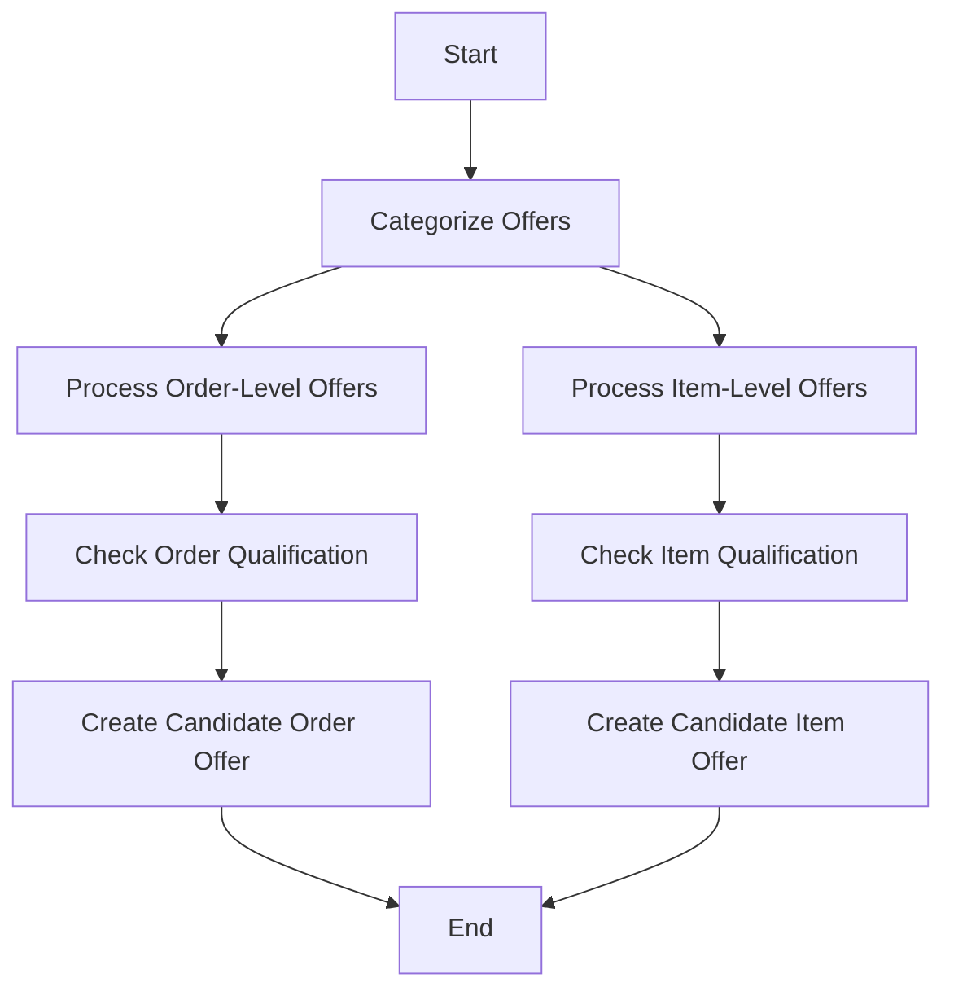

The process of filtering offers involves several steps to ensure that only applicable offers are considered for discounts. This document will cover:

1. Categorizing offers
2. Processing order-level offers
3. Processing item-level offers

Technical document: <SwmLink doc-title="Filtering Offers Process">[Filtering Offers Process](/.swm/filtering-offers-process.xwlcus1a.sw.md)</SwmLink>

# [Categorizing Offers](https://app.swimm.io/repos/Z2l0aHViJTNBJTNBQnJvYWRsZWFmQ29tbWVyY2UtZGVtby1uZXclM0ElM0FTd2ltbS1EZW1v/docs/xwlcus1a#filteroffers)

The process begins by categorizing offers into two types: order-level and item-level. This categorization is essential because it determines how each offer will be processed. Order-level offers apply to the entire order, while item-level offers apply to specific items within the order.

# [Processing Order-Level Offers](https://app.swimm.io/repos/Z2l0aHViJTNBJTNBQnJvYWRsZWFmQ29tbWVyY2UtZGVtby1uZXclM0ElM0FTd2ltbS1EZW1v/docs/xwlcus1a#filterorderleveloffer)

For order-level offers, the system checks if the offer can be applied to the entire order and its items. This involves evaluating the offer against the order, order items, and fulfillment groups. If the offer qualifies, a candidate order offer is created. This ensures that only offers that meet the criteria are considered for discounts, providing a seamless experience for the end user.

# [Processing Item-Level Offers](https://app.swimm.io/repos/Z2l0aHViJTNBJTNBQnJvYWRsZWFmQ29tbWVyY2UtZGVtby1uZXclM0ElM0FTd2ltbS1EZW1v/docs/xwlcus1a#filteritemleveloffer)

For item-level offers, the system checks if the offer can be applied to specific items in the order. This involves iterating through the discountable items in the order and determining if the offer can apply to any of them. If the offer qualifies, a candidate item offer is created. This ensures that only relevant offers are applied to the items, enhancing the user's shopping experience by providing accurate discounts.

&nbsp;

*This is an auto-generated document by Swimm AI 🌊 and has not yet been verified by a human*

<SwmMeta version="3.0.0" repo-id="Z2l0aHViJTNBJTNBQnJvYWRsZWFmQ29tbWVyY2UtZGVtby1uZXclM0ElM0FTd2ltbS1EZW1v" repo-name="BroadleafCommerce-demo-new" doc-type="product-flows">Powered by [Swimm](/)</SwmMeta>
