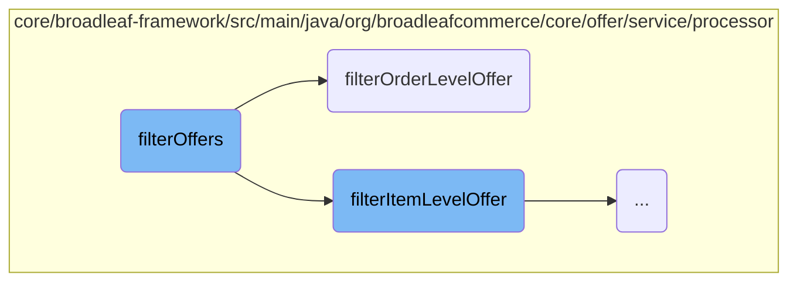
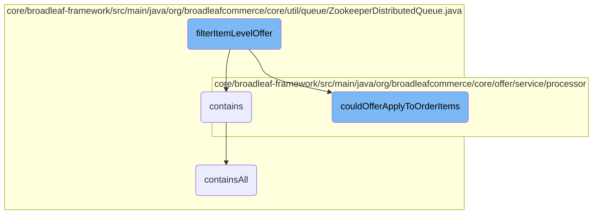

In this document, we will explain the process of filtering offers. The process involves categorizing offers into order-level and item-level offers, and then processing each category accordingly.

The flow starts by categorizing offers into two types: order-level and item-level. For order-level offers, the system checks if the offer can be applied to the entire order and its items. If it qualifies, a candidate order offer is created. For item-level offers, the system checks if the offer can be applied to specific items in the order. If it qualifies, a candidate item offer is created. The process ensures that only applicable offers are considered for discounts.

Here is a high level diagram of the flow, showing only the most important functions:

```mermaid
graph TD;
      subgraph core/broadleaf-framework/src/main/java/org/broadleafcommerce/core/offer/service/processor
f3624f26a10d82e7aec2464d8539b8335d20b7446700c149ecd7fdafedffe7db(filterOffers):::mainFlowStyle --> a76e6a14911b85456af29e713ea15bfa425f16a40bfe4bf62545d9550ee4c57c(filterOrderLevelOffer)
end

subgraph core/broadleaf-framework/src/main/java/org/broadleafcommerce/core/offer/service/processor
f3624f26a10d82e7aec2464d8539b8335d20b7446700c149ecd7fdafedffe7db(filterOffers):::mainFlowStyle --> 6c61bdf66bdd76ebfe468be7ff2d3831c493648fb99b98802861aa373a62174a(filterItemLevelOffer):::mainFlowStyle
end

subgraph core/broadleaf-framework/src/main/java/org/broadleafcommerce/core/util/queue/ZookeeperDistributedQueue.java
6c61bdf66bdd76ebfe468be7ff2d3831c493648fb99b98802861aa373a62174a(filterItemLevelOffer):::mainFlowStyle --> fafed2d65a93c8e997914f658afe91a3c2c3a41f56cfd6a3f1076580c45d4df6(contains)
end

subgraph core/broadleaf-framework/src/main/java/org/broadleafcommerce/core/offer/service/processor
6c61bdf66bdd76ebfe468be7ff2d3831c493648fb99b98802861aa373a62174a(filterItemLevelOffer):::mainFlowStyle --> dcb39c785c0783098cb9a4c693c424d2a1bed33c9b851694f101e57618f98a02(couldOfferApplyToOrderItems):::mainFlowStyle
end

subgraph core/broadleaf-framework/src/main/java/org/broadleafcommerce/core/offer/service/processor
dcb39c785c0783098cb9a4c693c424d2a1bed33c9b851694f101e57618f98a02(couldOfferApplyToOrderItems):::mainFlowStyle --> 7903879d51225eac59a830dc80d495ce23a7b424dd11fee311b6a2455575ca83(meetsItemQualifierSubtotal)
end

subgraph core/broadleaf-framework/src/main/java/org/broadleafcommerce/core/offer/service/processor
dcb39c785c0783098cb9a4c693c424d2a1bed33c9b851694f101e57618f98a02(couldOfferApplyToOrderItems):::mainFlowStyle --> 44d94cbbdcebbe353b77bd3380416466dba87dfb275a87215d4e2cdc326b1aee(checkForItemRequirements)
end


      classDef mainFlowStyle color:#000000,fill:#7CB9F4
classDef rootsStyle color:#000000,fill:#00FFF4
classDef Style1 color:#000000,fill:#00FFAA
classDef Style2 color:#000000,fill:#FFFF00
classDef Style3 color:#000000,fill:#AA7CB9

%% Swimm:
%% graph TD;
%%       subgraph <SwmPath>[core/broadleaf-framework/src/main/java/org/broadleafcommerce/core/offer/service/processor/](core/broadleaf-framework/src/main/java/org/broadleafcommerce/core/offer/service/processor/)</SwmPath>
%% f3624f26a10d82e7aec2464d8539b8335d20b7446700c149ecd7fdafedffe7db(filterOffers):::mainFlowStyle --> a76e6a14911b85456af29e713ea15bfa425f16a40bfe4bf62545d9550ee4c57c(filterOrderLevelOffer)
%% end
%% 
%% subgraph <SwmPath>[core/broadleaf-framework/src/main/java/org/broadleafcommerce/core/offer/service/processor/](core/broadleaf-framework/src/main/java/org/broadleafcommerce/core/offer/service/processor/)</SwmPath>
%% f3624f26a10d82e7aec2464d8539b8335d20b7446700c149ecd7fdafedffe7db(filterOffers):::mainFlowStyle --> 6c61bdf66bdd76ebfe468be7ff2d3831c493648fb99b98802861aa373a62174a(filterItemLevelOffer):::mainFlowStyle
%% end
%% 
%% subgraph <SwmPath>[core/broadleaf-framework/src/main/java/org/broadleafcommerce/core/util/queue/ZookeeperDistributedQueue.java](core/broadleaf-framework/src/main/java/org/broadleafcommerce/core/util/queue/ZookeeperDistributedQueue.java)</SwmPath>
%% 6c61bdf66bdd76ebfe468be7ff2d3831c493648fb99b98802861aa373a62174a(filterItemLevelOffer):::mainFlowStyle --> fafed2d65a93c8e997914f658afe91a3c2c3a41f56cfd6a3f1076580c45d4df6(contains)
%% end
%% 
%% subgraph <SwmPath>[core/broadleaf-framework/src/main/java/org/broadleafcommerce/core/offer/service/processor/](core/broadleaf-framework/src/main/java/org/broadleafcommerce/core/offer/service/processor/)</SwmPath>
%% 6c61bdf66bdd76ebfe468be7ff2d3831c493648fb99b98802861aa373a62174a(filterItemLevelOffer):::mainFlowStyle --> dcb39c785c0783098cb9a4c693c424d2a1bed33c9b851694f101e57618f98a02(couldOfferApplyToOrderItems):::mainFlowStyle
%% end
%% 
%% subgraph <SwmPath>[core/broadleaf-framework/src/main/java/org/broadleafcommerce/core/offer/service/processor/](core/broadleaf-framework/src/main/java/org/broadleafcommerce/core/offer/service/processor/)</SwmPath>
%% dcb39c785c0783098cb9a4c693c424d2a1bed33c9b851694f101e57618f98a02(couldOfferApplyToOrderItems):::mainFlowStyle --> 7903879d51225eac59a830dc80d495ce23a7b424dd11fee311b6a2455575ca83(meetsItemQualifierSubtotal)
%% end
%% 
%% subgraph <SwmPath>[core/broadleaf-framework/src/main/java/org/broadleafcommerce/core/offer/service/processor/](core/broadleaf-framework/src/main/java/org/broadleafcommerce/core/offer/service/processor/)</SwmPath>
%% dcb39c785c0783098cb9a4c693c424d2a1bed33c9b851694f101e57618f98a02(couldOfferApplyToOrderItems):::mainFlowStyle --> 44d94cbbdcebbe353b77bd3380416466dba87dfb275a87215d4e2cdc326b1aee(checkForItemRequirements)
%% end
%% 
%% 
%%       classDef mainFlowStyle color:#000000,fill:#7CB9F4
%% classDef rootsStyle color:#000000,fill:#00FFF4
%% classDef Style1 color:#000000,fill:#00FFAA
%% classDef Style2 color:#000000,fill:#FFFF00
%% classDef Style3 color:#000000,fill:#AA7CB9
```



# Flow drill down

First, we'll zoom into this section of the flow:



<SwmSnippet path="/core/broadleaf-framework/src/main/java/org/broadleafcommerce/core/offer/service/processor/ItemOfferProcessorImpl.java" line="404">

---

## <SwmToken path="core/broadleaf-framework/src/main/java/org/broadleafcommerce/core/offer/service/processor/ItemOfferProcessorImpl.java" pos="405:5:5" line-data="    public void filterOffers(PromotableOrder order, List&lt;Offer&gt; filteredOffers, List&lt;PromotableCandidateOrderOffer&gt; qualifiedOrderOffers, List&lt;PromotableCandidateItemOffer&gt; qualifiedItemOffers) {">`filterOffers`</SwmToken>

The <SwmToken path="core/broadleaf-framework/src/main/java/org/broadleafcommerce/core/offer/service/processor/ItemOfferProcessorImpl.java" pos="405:5:5" line-data="    public void filterOffers(PromotableOrder order, List&lt;Offer&gt; filteredOffers, List&lt;PromotableCandidateOrderOffer&gt; qualifiedOrderOffers, List&lt;PromotableCandidateItemOffer&gt; qualifiedItemOffers) {">`filterOffers`</SwmToken> method is responsible for categorizing offers into order-level and item-level offers. It iterates through the list of filtered offers and delegates the processing to either <SwmToken path="core/broadleaf-framework/src/main/java/org/broadleafcommerce/core/offer/service/processor/ItemOfferProcessorImpl.java" pos="411:1:1" line-data="                filterOrderLevelOffer(order, qualifiedOrderOffers, offer);">`filterOrderLevelOffer`</SwmToken> or <SwmToken path="core/broadleaf-framework/src/main/java/org/broadleafcommerce/core/offer/service/processor/ItemOfferProcessorImpl.java" pos="413:1:1" line-data="                filterItemLevelOffer(order, qualifiedItemOffers, offer);">`filterItemLevelOffer`</SwmToken> based on the offer type.

```java
    @Override
    public void filterOffers(PromotableOrder order, List<Offer> filteredOffers, List<PromotableCandidateOrderOffer> qualifiedOrderOffers, List<PromotableCandidateItemOffer> qualifiedItemOffers) {
        // set order subTotal price to total item price without adjustments
        order.setOrderSubTotalToPriceWithoutAdjustments();

        for (Offer offer : filteredOffers) {            
            if(offer.getType().equals(OfferType.ORDER)){
                filterOrderLevelOffer(order, qualifiedOrderOffers, offer);
            } else if(offer.getType().equals(OfferType.ORDER_ITEM)){
                filterItemLevelOffer(order, qualifiedItemOffers, offer);
            }
        }
    }
```

---

</SwmSnippet>

<SwmSnippet path="/core/broadleaf-framework/src/main/java/org/broadleafcommerce/core/offer/service/processor/OrderOfferProcessorImpl.java" line="89">

---

## <SwmToken path="core/broadleaf-framework/src/main/java/org/broadleafcommerce/core/offer/service/processor/OrderOfferProcessorImpl.java" pos="90:5:5" line-data="    public void filterOrderLevelOffer(PromotableOrder promotableOrder, List&lt;PromotableCandidateOrderOffer&gt; qualifiedOrderOffers, Offer offer) {">`filterOrderLevelOffer`</SwmToken>

The <SwmToken path="core/broadleaf-framework/src/main/java/org/broadleafcommerce/core/offer/service/processor/OrderOfferProcessorImpl.java" pos="90:5:5" line-data="    public void filterOrderLevelOffer(PromotableOrder promotableOrder, List&lt;PromotableCandidateOrderOffer&gt; qualifiedOrderOffers, Offer offer) {">`filterOrderLevelOffer`</SwmToken> method processes order-level offers by first checking if the offer can be applied to the order. It evaluates the offer against the order, order items, and fulfillment groups to determine if it qualifies. If the offer qualifies, it creates a candidate order offer and maps the qualifying items.

```java
    @Override
    public void filterOrderLevelOffer(PromotableOrder promotableOrder, List<PromotableCandidateOrderOffer> qualifiedOrderOffers, Offer offer) {
        if (offer.getDiscountType().getType().equals(OfferDiscountType.FIX_PRICE.getType())) {
            LOG.warn("Offers of type ORDER may not have a discount type of FIX_PRICE. Ignoring order offer (name=" + offer.getName() + ")");
            return;
        }
        boolean orderLevelQualification = false;
        //Order Qualification
        orderQualification:
        {
            if (couldOfferApplyToOrder(offer, promotableOrder)) {
                orderLevelQualification = true;
                break orderQualification;
            }
            for (PromotableOrderItem orderItem : promotableOrder.getDiscountableOrderItems(offer.getApplyDiscountToSalePrice())) {
                if (couldOfferApplyToOrder(offer, promotableOrder, orderItem)) {
                    orderLevelQualification = true;
                    break orderQualification;
                }
            }
            for (PromotableFulfillmentGroup fulfillmentGroup : promotableOrder.getFulfillmentGroups()) {
```

---

</SwmSnippet>

Now, lets zoom into this section of the flow:



<SwmSnippet path="/core/broadleaf-framework/src/main/java/org/broadleafcommerce/core/offer/service/processor/ItemOfferProcessorImpl.java" line="80">

---

## <SwmToken path="core/broadleaf-framework/src/main/java/org/broadleafcommerce/core/offer/service/processor/ItemOfferProcessorImpl.java" pos="80:5:5" line-data="    public void filterItemLevelOffer(PromotableOrder order, List&lt;PromotableCandidateItemOffer&gt; qualifiedItemOffers, Offer offer) {">`filterItemLevelOffer`</SwmToken>

The <SwmToken path="core/broadleaf-framework/src/main/java/org/broadleafcommerce/core/offer/service/processor/ItemOfferProcessorImpl.java" pos="80:5:5" line-data="    public void filterItemLevelOffer(PromotableOrder order, List&lt;PromotableCandidateItemOffer&gt; qualifiedItemOffers, Offer offer) {">`filterItemLevelOffer`</SwmToken> method is responsible for determining whether an offer can be applied to specific items in an order. It first checks if the offer is in a new format and iterates through the discountable items in the order. If the offer can apply to an item, it creates a candidate item offer. For legacy offers, it adds the item to the candidate's legacy targets. If the offer is in the new format, it checks item-level qualifications and creates candidate offers based on matched qualifiers and targets.

```java
    public void filterItemLevelOffer(PromotableOrder order, List<PromotableCandidateItemOffer> qualifiedItemOffers, Offer offer) {
        boolean isNewFormat = CollectionUtils.isNotEmpty(offer.getQualifyingItemCriteriaXref()) ||
                CollectionUtils.isNotEmpty(offer.getTargetItemCriteriaXref());
        boolean itemLevelQualification = false;
        boolean offerCreated = false;

        for (PromotableOrderItem promotableOrderItem : order.getDiscountableOrderItems()) {
            if(couldOfferApplyToOrder(offer, order, promotableOrderItem)) {
                if (!isNewFormat) {
                    //support legacy offers                   
                    PromotableCandidateItemOffer candidate = createCandidateItemOffer(qualifiedItemOffers, offer, order);
                   
                    if (!candidate.getLegacyCandidateTargets().contains(promotableOrderItem)) {
                        candidate.getLegacyCandidateTargets().add(promotableOrderItem);
                    }
                    offerCreated = true;
                    continue;
                }
                itemLevelQualification = true;
                break;
            }
```

---

</SwmSnippet>

<SwmSnippet path="/core/broadleaf-framework/src/main/java/org/broadleafcommerce/core/util/queue/ZookeeperDistributedQueue.java" line="474">

---

## contains

The <SwmToken path="core/broadleaf-framework/src/main/java/org/broadleafcommerce/core/util/queue/ZookeeperDistributedQueue.java" pos="475:5:5" line-data="    public boolean contains(Object o) {">`contains`</SwmToken> method checks if a specific object is present in the queue by calling the <SwmToken path="core/broadleaf-framework/src/main/java/org/broadleafcommerce/core/util/queue/ZookeeperDistributedQueue.java" pos="476:3:3" line-data="        return containsAll(Collections.singletonList(o));">`containsAll`</SwmToken> method with a singleton list containing the object.

```java
    @Override
    public boolean contains(Object o) {
        return containsAll(Collections.singletonList(o));
    }
```

---

</SwmSnippet>

<SwmSnippet path="/core/broadleaf-framework/src/main/java/org/broadleafcommerce/core/offer/service/processor/AbstractBaseProcessor.java" line="86">

---

## <SwmToken path="core/broadleaf-framework/src/main/java/org/broadleafcommerce/core/offer/service/processor/AbstractBaseProcessor.java" pos="86:5:5" line-data="    protected CandidatePromotionItems couldOfferApplyToOrderItems(Offer offer, List&lt;PromotableOrderItem&gt; promotableOrderItems) {">`couldOfferApplyToOrderItems`</SwmToken>

The <SwmToken path="core/broadleaf-framework/src/main/java/org/broadleafcommerce/core/offer/service/processor/AbstractBaseProcessor.java" pos="86:5:5" line-data="    protected CandidatePromotionItems couldOfferApplyToOrderItems(Offer offer, List&lt;PromotableOrderItem&gt; promotableOrderItems) {">`couldOfferApplyToOrderItems`</SwmToken> method evaluates whether an offer can be applied to the items in an order. It checks the qualifying item criteria and target item criteria of the offer. If the criteria are met, it sets the matched qualifier and target flags and returns the candidate promotion items.

```java
    protected CandidatePromotionItems couldOfferApplyToOrderItems(Offer offer, List<PromotableOrderItem> promotableOrderItems) {
        CandidatePromotionItems candidates = new CandidatePromotionItems();
        if (offer.getQualifyingItemCriteriaXref() == null || offer.getQualifyingItemCriteriaXref().size() == 0) {
            candidates.setMatchedQualifier(true);
        } else {
            for (OfferQualifyingCriteriaXref criteriaXref : offer.getQualifyingItemCriteriaXref()) {
                if (criteriaXref.getOfferItemCriteria() != null) {
                    checkForItemRequirements(offer, candidates, criteriaXref.getOfferItemCriteria(), promotableOrderItems, true);
                    if (!candidates.isMatchedQualifier()) {
                        break;
                    }
                }
            }           
        }

        if (offer.getType().equals(OfferType.ORDER_ITEM) && BooleanUtils.isTrue(offer.getUseListForDiscounts())) {
            for (OfferPriceData offerPriceData : offer.getOfferPriceData()) {
                PromotableOrderItem qualifyingOrderItem = findQualifyingItemForPriceData(offerPriceData, promotableOrderItems);
                if (qualifyingOrderItem != null) {
                    candidates.addFixedTarget(offerPriceData, qualifyingOrderItem);
                    candidates.setMatchedTarget(true);
```

---

</SwmSnippet>

<SwmSnippet path="/core/broadleaf-framework/src/main/java/org/broadleafcommerce/core/util/queue/ZookeeperDistributedQueue.java" line="285">

---

## <SwmToken path="core/broadleaf-framework/src/main/java/org/broadleafcommerce/core/util/queue/ZookeeperDistributedQueue.java" pos="286:5:5" line-data="    public boolean containsAll(Collection&lt;?&gt; c) {">`containsAll`</SwmToken>

The <SwmToken path="core/broadleaf-framework/src/main/java/org/broadleafcommerce/core/util/queue/ZookeeperDistributedQueue.java" pos="286:5:5" line-data="    public boolean containsAll(Collection&lt;?&gt; c) {">`containsAll`</SwmToken> method checks if all elements in a given collection are present in the queue. It acquires a distributed lock, reads the queue elements, and verifies if the queue contains all the elements in the collection.

```java
    @Override
    public boolean containsAll(Collection<?> c) {
        DistributedLock lock = getQueueAccessLock();
        try {
            lock.lockInterruptibly();
            try {
                Map<String, T> elements = readQueueInternal(geMaxCapacity(), false, 0L);
                if (!elements.isEmpty()) {
                    return elements.values().containsAll(c);
                }
                
                return false;
                
            } finally {
                lock.unlock();
            }
        } catch (InterruptedException e) {
            Thread.currentThread().interrupt();
            throw new DistributedQueueException("The thread was interrupted while trying to determine if elements are contained in the Zookeeper queue, " + getQueueFolderPath(), e);
        }
    }
```

---

</SwmSnippet>

&nbsp;

*This is an auto-generated document by Swimm AI 🌊 and has not yet been verified by a human*

<SwmMeta version="3.0.0" repo-id="Z2l0aHViJTNBJTNBQnJvYWRsZWFmQ29tbWVyY2UtZGVtby1uZXclM0ElM0FTd2ltbS1EZW1v" repo-name="BroadleafCommerce-demo-new" doc-type="flows"><sup>Powered by [Swimm](/)</sup></SwmMeta>
