```mermaid
classDiagram
 ArtifactService <|-- ArtifactServiceImpl
 ArtifactServiceImpl o-- ArtifactProcessor
 ArtifactProcessor <|-- ImageArtifactProcessor
 class ArtifactService {
 +convert(InputStream, Operation[], String) InputStream
 +buildOperations(Map<String, String>, InputStream, String) Operation[]
 }
 class ArtifactServiceImpl {
 +convert(InputStream, Operation[], String) InputStream
 +buildOperations(Map<String, String>, InputStream, String) Operation[]
 -List<ArtifactProcessor> artifactProcessors
 }
 class ArtifactProcessor {
 +isSupported(InputStream, String) boolean
 +convert(InputStream, Operation[], String) InputStream
 +buildOperations(Map<String, String>, InputStream, String) Operation[]
 }
 class ImageArtifactProcessor {
 +isSupported(InputStream, String) boolean
 +convert(InputStream, Operation[], String) InputStream
 +buildOperations(Map<String, String>, InputStream, String) Operation[]
 }

%% Swimm:
%% classDiagram
%%  <SwmToken path="admin/broadleaf-open-admin-platform/src/main/java/org/broadleafcommerce/openadmin/server/service/artifact/ArtifactServiceImpl.java" pos="36:8:8" line-data="public class ArtifactServiceImpl implements ArtifactService {">`ArtifactService`</SwmToken> <|-- <SwmToken path="admin/broadleaf-open-admin-platform/src/main/java/org/broadleafcommerce/openadmin/server/service/artifact/ArtifactServiceImpl.java" pos="36:4:4" line-data="public class ArtifactServiceImpl implements ArtifactService {">`ArtifactServiceImpl`</SwmToken>
%%  <SwmToken path="admin/broadleaf-open-admin-platform/src/main/java/org/broadleafcommerce/openadmin/server/service/artifact/ArtifactServiceImpl.java" pos="36:4:4" line-data="public class ArtifactServiceImpl implements ArtifactService {">`ArtifactServiceImpl`</SwmToken> o-- <SwmToken path="admin/broadleaf-open-admin-platform/src/main/java/org/broadleafcommerce/openadmin/server/service/artifact/ArtifactServiceImpl.java" pos="39:5:5" line-data="    protected List&lt;ArtifactProcessor&gt; artifactProcessors;">`ArtifactProcessor`</SwmToken>
%%  <SwmToken path="admin/broadleaf-open-admin-platform/src/main/java/org/broadleafcommerce/openadmin/server/service/artifact/ArtifactServiceImpl.java" pos="39:5:5" line-data="    protected List&lt;ArtifactProcessor&gt; artifactProcessors;">`ArtifactProcessor`</SwmToken> <|-- <SwmToken path="admin/broadleaf-open-admin-platform/src/main/java/org/broadleafcommerce/openadmin/server/service/artifact/image/ImageArtifactProcessor.java" pos="60:4:4" line-data="public class ImageArtifactProcessor implements ArtifactProcessor {">`ImageArtifactProcessor`</SwmToken>
%%  class <SwmToken path="admin/broadleaf-open-admin-platform/src/main/java/org/broadleafcommerce/openadmin/server/service/artifact/ArtifactServiceImpl.java" pos="36:8:8" line-data="public class ArtifactServiceImpl implements ArtifactService {">`ArtifactService`</SwmToken> {
%%  +convert(InputStream, Operation[], String) <SwmToken path="admin/broadleaf-open-admin-platform/src/main/java/org/broadleafcommerce/openadmin/server/service/artifact/ArtifactProcessor.java" pos="34:7:7" line-data="    public boolean isSupported(InputStream artifactStream, String mimeType);">`InputStream`</SwmToken>
%%  +buildOperations(Map<String, String>, <SwmToken path="admin/broadleaf-open-admin-platform/src/main/java/org/broadleafcommerce/openadmin/server/service/artifact/ArtifactProcessor.java" pos="34:7:7" line-data="    public boolean isSupported(InputStream artifactStream, String mimeType);">`InputStream`</SwmToken>, String) Operation[]
%%  }
%%  class <SwmToken path="admin/broadleaf-open-admin-platform/src/main/java/org/broadleafcommerce/openadmin/server/service/artifact/ArtifactServiceImpl.java" pos="36:4:4" line-data="public class ArtifactServiceImpl implements ArtifactService {">`ArtifactServiceImpl`</SwmToken> {
%%  +convert(InputStream, Operation[], String) <SwmToken path="admin/broadleaf-open-admin-platform/src/main/java/org/broadleafcommerce/openadmin/server/service/artifact/ArtifactProcessor.java" pos="34:7:7" line-data="    public boolean isSupported(InputStream artifactStream, String mimeType);">`InputStream`</SwmToken>
%%  +buildOperations(Map<String, String>, <SwmToken path="admin/broadleaf-open-admin-platform/src/main/java/org/broadleafcommerce/openadmin/server/service/artifact/ArtifactProcessor.java" pos="34:7:7" line-data="    public boolean isSupported(InputStream artifactStream, String mimeType);">`InputStream`</SwmToken>, String) Operation[]
%%  -List<ArtifactProcessor> <SwmToken path="admin/broadleaf-open-admin-platform/src/main/java/org/broadleafcommerce/openadmin/server/service/artifact/ArtifactServiceImpl.java" pos="39:8:8" line-data="    protected List&lt;ArtifactProcessor&gt; artifactProcessors;">`artifactProcessors`</SwmToken>
%%  }
%%  class <SwmToken path="admin/broadleaf-open-admin-platform/src/main/java/org/broadleafcommerce/openadmin/server/service/artifact/ArtifactServiceImpl.java" pos="39:5:5" line-data="    protected List&lt;ArtifactProcessor&gt; artifactProcessors;">`ArtifactProcessor`</SwmToken> {
%%  +isSupported(InputStream, String) boolean
%%  +convert(InputStream, Operation[], String) <SwmToken path="admin/broadleaf-open-admin-platform/src/main/java/org/broadleafcommerce/openadmin/server/service/artifact/ArtifactProcessor.java" pos="34:7:7" line-data="    public boolean isSupported(InputStream artifactStream, String mimeType);">`InputStream`</SwmToken>
%%  +buildOperations(Map<String, String>, <SwmToken path="admin/broadleaf-open-admin-platform/src/main/java/org/broadleafcommerce/openadmin/server/service/artifact/ArtifactProcessor.java" pos="34:7:7" line-data="    public boolean isSupported(InputStream artifactStream, String mimeType);">`InputStream`</SwmToken>, String) Operation[]
%%  }
%%  class <SwmToken path="admin/broadleaf-open-admin-platform/src/main/java/org/broadleafcommerce/openadmin/server/service/artifact/image/ImageArtifactProcessor.java" pos="60:4:4" line-data="public class ImageArtifactProcessor implements ArtifactProcessor {">`ImageArtifactProcessor`</SwmToken> {
%%  +isSupported(InputStream, String) boolean
%%  +convert(InputStream, Operation[], String) <SwmToken path="admin/broadleaf-open-admin-platform/src/main/java/org/broadleafcommerce/openadmin/server/service/artifact/ArtifactProcessor.java" pos="34:7:7" line-data="    public boolean isSupported(InputStream artifactStream, String mimeType);">`InputStream`</SwmToken>
%%  +buildOperations(Map<String, String>, <SwmToken path="admin/broadleaf-open-admin-platform/src/main/java/org/broadleafcommerce/openadmin/server/service/artifact/ArtifactProcessor.java" pos="34:7:7" line-data="    public boolean isSupported(InputStream artifactStream, String mimeType);">`InputStream`</SwmToken>, String) Operation[]
%%  }
```

# Getting Started with Artifact Service

Artifact refers to a digital asset or file that is processed and managed within the system. The <SwmToken path="admin/broadleaf-open-admin-platform/src/main/java/org/broadleafcommerce/openadmin/server/service/artifact/ArtifactServiceImpl.java" pos="36:8:8" line-data="public class ArtifactServiceImpl implements ArtifactService {">`ArtifactService`</SwmToken> interface defines methods for converting and building operations on these artifacts.

## <SwmToken path="admin/broadleaf-open-admin-platform/src/main/java/org/broadleafcommerce/openadmin/server/service/artifact/ArtifactServiceImpl.java" pos="36:8:8" line-data="public class ArtifactServiceImpl implements ArtifactService {">`ArtifactService`</SwmToken> Interface

The <SwmToken path="admin/broadleaf-open-admin-platform/src/main/java/org/broadleafcommerce/openadmin/server/service/artifact/ArtifactServiceImpl.java" pos="36:8:8" line-data="public class ArtifactServiceImpl implements ArtifactService {">`ArtifactService`</SwmToken> interface defines methods for converting artifact streams and building operations. The <SwmToken path="admin/broadleaf-open-admin-platform/src/main/java/org/broadleafcommerce/openadmin/server/service/artifact/ArtifactProcessor.java" pos="36:5:5" line-data="    public InputStream convert(InputStream artifactStream, Operation[] operations, String mimeType) throws Exception;">`convert`</SwmToken> method processes an artifact stream through a series of operations and returns the modified stream. The <SwmToken path="admin/broadleaf-open-admin-platform/src/main/java/org/broadleafcommerce/openadmin/server/service/artifact/ArtifactProcessor.java" pos="38:7:7" line-data="    public Operation[] buildOperations(Map&lt;String, String&gt; parameterMap, InputStream artifactStream, String mimeType);">`buildOperations`</SwmToken> method constructs a list of operations based on provided parameters and the artifact's MIME type.

## <SwmToken path="admin/broadleaf-open-admin-platform/src/main/java/org/broadleafcommerce/openadmin/server/service/artifact/ArtifactServiceImpl.java" pos="36:4:4" line-data="public class ArtifactServiceImpl implements ArtifactService {">`ArtifactServiceImpl`</SwmToken> Class

The <SwmToken path="admin/broadleaf-open-admin-platform/src/main/java/org/broadleafcommerce/openadmin/server/service/artifact/ArtifactServiceImpl.java" pos="36:4:4" line-data="public class ArtifactServiceImpl implements ArtifactService {">`ArtifactServiceImpl`</SwmToken> class implements the <SwmToken path="admin/broadleaf-open-admin-platform/src/main/java/org/broadleafcommerce/openadmin/server/service/artifact/ArtifactServiceImpl.java" pos="36:8:8" line-data="public class ArtifactServiceImpl implements ArtifactService {">`ArtifactService`</SwmToken> interface and uses a list of <SwmToken path="admin/broadleaf-open-admin-platform/src/main/java/org/broadleafcommerce/openadmin/server/service/artifact/ArtifactServiceImpl.java" pos="39:5:5" line-data="    protected List&lt;ArtifactProcessor&gt; artifactProcessors;">`ArtifactProcessor`</SwmToken> instances to handle the actual processing of artifacts. Each <SwmToken path="admin/broadleaf-open-admin-platform/src/main/java/org/broadleafcommerce/openadmin/server/service/artifact/ArtifactServiceImpl.java" pos="39:5:5" line-data="    protected List&lt;ArtifactProcessor&gt; artifactProcessors;">`ArtifactProcessor`</SwmToken> checks if it supports the given artifact stream and MIME type before performing any operations.

<SwmSnippet path="/admin/broadleaf-open-admin-platform/src/main/java/org/broadleafcommerce/openadmin/server/service/artifact/ArtifactServiceImpl.java" line="35">

---

The <SwmToken path="admin/broadleaf-open-admin-platform/src/main/java/org/broadleafcommerce/openadmin/server/service/artifact/ArtifactServiceImpl.java" pos="36:4:4" line-data="public class ArtifactServiceImpl implements ArtifactService {">`ArtifactServiceImpl`</SwmToken> class is annotated with <SwmToken path="admin/broadleaf-open-admin-platform/src/main/java/org/broadleafcommerce/openadmin/server/service/artifact/ArtifactServiceImpl.java" pos="35:0:1" line-data="@Service(&quot;blArtifactService&quot;)">`@Service`</SwmToken> and uses dependency injection to manage a list of <SwmToken path="admin/broadleaf-open-admin-platform/src/main/java/org/broadleafcommerce/openadmin/server/service/artifact/ArtifactServiceImpl.java" pos="39:5:5" line-data="    protected List&lt;ArtifactProcessor&gt; artifactProcessors;">`ArtifactProcessor`</SwmToken> instances.

```java
@Service("blArtifactService")
public class ArtifactServiceImpl implements ArtifactService {

    @Autowired
    protected List<ArtifactProcessor> artifactProcessors;
```

---

</SwmSnippet>

<SwmSnippet path="/admin/broadleaf-open-admin-platform/src/main/java/org/broadleafcommerce/openadmin/server/service/artifact/ArtifactProcessor.java" line="32">

---

The <SwmToken path="admin/broadleaf-open-admin-platform/src/main/java/org/broadleafcommerce/openadmin/server/service/artifact/ArtifactProcessor.java" pos="32:4:4" line-data="public interface ArtifactProcessor {">`ArtifactProcessor`</SwmToken> interface outlines the methods required for processing artifacts, including <SwmToken path="admin/broadleaf-open-admin-platform/src/main/java/org/broadleafcommerce/openadmin/server/service/artifact/ArtifactProcessor.java" pos="34:5:5" line-data="    public boolean isSupported(InputStream artifactStream, String mimeType);">`isSupported`</SwmToken>, <SwmToken path="admin/broadleaf-open-admin-platform/src/main/java/org/broadleafcommerce/openadmin/server/service/artifact/ArtifactProcessor.java" pos="36:5:5" line-data="    public InputStream convert(InputStream artifactStream, Operation[] operations, String mimeType) throws Exception;">`convert`</SwmToken>, and <SwmToken path="admin/broadleaf-open-admin-platform/src/main/java/org/broadleafcommerce/openadmin/server/service/artifact/ArtifactProcessor.java" pos="38:7:7" line-data="    public Operation[] buildOperations(Map&lt;String, String&gt; parameterMap, InputStream artifactStream, String mimeType);">`buildOperations`</SwmToken>.

```java
public interface ArtifactProcessor {

    public boolean isSupported(InputStream artifactStream, String mimeType);

    public InputStream convert(InputStream artifactStream, Operation[] operations, String mimeType) throws Exception;

    public Operation[] buildOperations(Map<String, String> parameterMap, InputStream artifactStream, String mimeType);

}
```

---

</SwmSnippet>

## <SwmToken path="admin/broadleaf-open-admin-platform/src/main/java/org/broadleafcommerce/openadmin/server/service/artifact/image/ImageArtifactProcessor.java" pos="60:4:4" line-data="public class ImageArtifactProcessor implements ArtifactProcessor {">`ImageArtifactProcessor`</SwmToken> Class

The <SwmToken path="admin/broadleaf-open-admin-platform/src/main/java/org/broadleafcommerce/openadmin/server/service/artifact/image/ImageArtifactProcessor.java" pos="60:4:4" line-data="public class ImageArtifactProcessor implements ArtifactProcessor {">`ImageArtifactProcessor`</SwmToken> class is an implementation of the <SwmToken path="admin/broadleaf-open-admin-platform/src/main/java/org/broadleafcommerce/openadmin/server/service/artifact/ArtifactServiceImpl.java" pos="39:5:5" line-data="    protected List&lt;ArtifactProcessor&gt; artifactProcessors;">`ArtifactProcessor`</SwmToken> interface specifically for handling image artifacts. It is annotated with <SwmToken path="admin/broadleaf-open-admin-platform/src/main/java/org/broadleafcommerce/openadmin/server/service/artifact/ArtifactServiceImpl.java" pos="35:0:1" line-data="@Service(&quot;blArtifactService&quot;)">`@Service`</SwmToken> to be recognized as a Spring service.

<SwmSnippet path="/admin/broadleaf-open-admin-platform/src/main/java/org/broadleafcommerce/openadmin/server/service/artifact/image/ImageArtifactProcessor.java" line="59">

---

The <SwmToken path="admin/broadleaf-open-admin-platform/src/main/java/org/broadleafcommerce/openadmin/server/service/artifact/image/ImageArtifactProcessor.java" pos="60:4:4" line-data="public class ImageArtifactProcessor implements ArtifactProcessor {">`ImageArtifactProcessor`</SwmToken> class implements the <SwmToken path="admin/broadleaf-open-admin-platform/src/main/java/org/broadleafcommerce/openadmin/server/service/artifact/image/ImageArtifactProcessor.java" pos="60:8:8" line-data="public class ImageArtifactProcessor implements ArtifactProcessor {">`ArtifactProcessor`</SwmToken> interface and is annotated with <SwmToken path="admin/broadleaf-open-admin-platform/src/main/java/org/broadleafcommerce/openadmin/server/service/artifact/image/ImageArtifactProcessor.java" pos="59:0:1" line-data="@Service(&quot;blImageArtifactProcessor&quot;)">`@Service`</SwmToken> for Spring to recognize it as a service.

```java
@Service("blImageArtifactProcessor")
public class ImageArtifactProcessor implements ArtifactProcessor {
```

---

</SwmSnippet>

&nbsp;

*This is an auto-generated document by Swimm AI 🌊 and has not yet been verified by a human*

<SwmMeta version="3.0.0" repo-id="Z2l0aHViJTNBJTNBQnJvYWRsZWFmQ29tbWVyY2UtZGVtby1uZXclM0ElM0FTd2ltbS1EZW1v" repo-name="BroadleafCommerce-demo-new" doc-type="overview"><sup>Powered by [Swimm](/)</sup></SwmMeta>
