```mermaid
classDiagram
    BaseProcessor <|-- OrderOfferProcessor
    OrderOfferProcessor <|-- ItemOfferProcessor
    ItemOfferProcessor <|-- ItemOfferProcessorImpl
    class BaseProcessor {
        +List<Offer> filterOffers(List<Offer> offers, Customer customer)
    }
    class OrderOfferProcessor {
        +void filterOrderLevelOffer(PromotableOrder PromotableOrder, List<PromotableCandidateOrderOffer> qualifiedOrderOffers, Offer offer)
        +Boolean executeExpression(String expression, Map<String, Object> vars)
        +boolean couldOfferApplyToOrder(Offer offer, PromotableOrder PromotableOrder)
        +List<PromotableCandidateOrderOffer> removeTrailingNotCombinableOrderOffers(List<PromotableCandidateOrderOffer> candidateOffers)
    }
    class ItemOfferProcessor {
        +void filterItemLevelOffer(PromotableOrder order, List<PromotableCandidateItemOffer> qualifiedItemOffers, Offer offer)
    }
    class ItemOfferProcessorImpl {
        +void filterItemLevelOffer(PromotableOrder order, List<PromotableCandidateItemOffer> qualifiedItemOffers, Offer offer)
    }

%% Swimm:
%% classDiagram
%%     <SwmToken path="core/broadleaf-framework/src/main/java/org/broadleafcommerce/core/offer/service/processor/OrderOfferProcessor.java" pos="35:8:8" line-data="public interface OrderOfferProcessor extends BaseProcessor {">`BaseProcessor`</SwmToken> <|-- <SwmToken path="core/broadleaf-framework/src/main/java/org/broadleafcommerce/core/offer/service/processor/OrderOfferProcessor.java" pos="35:4:4" line-data="public interface OrderOfferProcessor extends BaseProcessor {">`OrderOfferProcessor`</SwmToken>
%%     <SwmToken path="core/broadleaf-framework/src/main/java/org/broadleafcommerce/core/offer/service/processor/OrderOfferProcessor.java" pos="35:4:4" line-data="public interface OrderOfferProcessor extends BaseProcessor {">`OrderOfferProcessor`</SwmToken> <|-- <SwmToken path="core/broadleaf-framework/src/main/java/org/broadleafcommerce/core/offer/service/processor/ItemOfferProcessor.java" pos="32:4:4" line-data="public interface ItemOfferProcessor extends OrderOfferProcessor {">`ItemOfferProcessor`</SwmToken>
%%     <SwmToken path="core/broadleaf-framework/src/main/java/org/broadleafcommerce/core/offer/service/processor/ItemOfferProcessor.java" pos="32:4:4" line-data="public interface ItemOfferProcessor extends OrderOfferProcessor {">`ItemOfferProcessor`</SwmToken> <|-- ItemOfferProcessorImpl
%%     class <SwmToken path="core/broadleaf-framework/src/main/java/org/broadleafcommerce/core/offer/service/processor/OrderOfferProcessor.java" pos="35:8:8" line-data="public interface OrderOfferProcessor extends BaseProcessor {">`BaseProcessor`</SwmToken> {
%%         +List<Offer> filterOffers(List<Offer> offers, Customer customer)
%%     }
%%     class <SwmToken path="core/broadleaf-framework/src/main/java/org/broadleafcommerce/core/offer/service/processor/OrderOfferProcessor.java" pos="35:4:4" line-data="public interface OrderOfferProcessor extends BaseProcessor {">`OrderOfferProcessor`</SwmToken> {
%%         +void <SwmToken path="core/broadleaf-framework/src/main/java/org/broadleafcommerce/core/offer/service/processor/OrderOfferProcessor.java" pos="37:5:7" line-data="    public void filterOrderLevelOffer(PromotableOrder promotableOrder, List&lt;PromotableCandidateOrderOffer&gt; qualifiedOrderOffers, Offer offer);">`filterOrderLevelOffer(PromotableOrder`</SwmToken> <SwmToken path="core/broadleaf-framework/src/main/java/org/broadleafcommerce/core/offer/service/processor/OrderOfferProcessor.java" pos="37:7:7" line-data="    public void filterOrderLevelOffer(PromotableOrder promotableOrder, List&lt;PromotableCandidateOrderOffer&gt; qualifiedOrderOffers, Offer offer);">`PromotableOrder`</SwmToken>, <SwmToken path="core/broadleaf-framework/src/main/java/org/broadleafcommerce/core/offer/service/processor/OrderOfferProcessor.java" pos="37:12:15" line-data="    public void filterOrderLevelOffer(PromotableOrder promotableOrder, List&lt;PromotableCandidateOrderOffer&gt; qualifiedOrderOffers, Offer offer);">`List<PromotableCandidateOrderOffer>`</SwmToken> <SwmToken path="core/broadleaf-framework/src/main/java/org/broadleafcommerce/core/offer/service/processor/OrderOfferProcessor.java" pos="37:17:17" line-data="    public void filterOrderLevelOffer(PromotableOrder promotableOrder, List&lt;PromotableCandidateOrderOffer&gt; qualifiedOrderOffers, Offer offer);">`qualifiedOrderOffers`</SwmToken>, Offer offer)
%%         +Boolean <SwmToken path="core/broadleaf-framework/src/main/java/org/broadleafcommerce/core/offer/service/processor/OrderOfferProcessor.java" pos="39:5:7" line-data="    public Boolean executeExpression(String expression, Map&lt;String, Object&gt; vars);">`executeExpression(String`</SwmToken> expression, <SwmToken path="core/broadleaf-framework/src/main/java/org/broadleafcommerce/core/offer/service/processor/OrderOfferProcessor.java" pos="39:12:14" line-data="    public Boolean executeExpression(String expression, Map&lt;String, Object&gt; vars);">`Map<String`</SwmToken>, Object> vars)
%%         +boolean <SwmToken path="core/broadleaf-framework/src/main/java/org/broadleafcommerce/core/offer/service/processor/OrderOfferProcessor.java" pos="49:5:7" line-data="    public boolean couldOfferApplyToOrder(Offer offer, PromotableOrder promotableOrder);">`couldOfferApplyToOrder(Offer`</SwmToken> offer, <SwmToken path="core/broadleaf-framework/src/main/java/org/broadleafcommerce/core/offer/service/processor/OrderOfferProcessor.java" pos="37:7:7" line-data="    public void filterOrderLevelOffer(PromotableOrder promotableOrder, List&lt;PromotableCandidateOrderOffer&gt; qualifiedOrderOffers, Offer offer);">`PromotableOrder`</SwmToken> <SwmToken path="core/broadleaf-framework/src/main/java/org/broadleafcommerce/core/offer/service/processor/OrderOfferProcessor.java" pos="37:7:7" line-data="    public void filterOrderLevelOffer(PromotableOrder promotableOrder, List&lt;PromotableCandidateOrderOffer&gt; qualifiedOrderOffers, Offer offer);">`PromotableOrder`</SwmToken>)
%%         +List<PromotableCandidateOrderOffer> <SwmToken path="core/broadleaf-framework/src/main/java/org/broadleafcommerce/core/offer/service/processor/OrderOfferProcessor.java" pos="51:8:13" line-data="    public List&lt;PromotableCandidateOrderOffer&gt; removeTrailingNotCombinableOrderOffers(List&lt;PromotableCandidateOrderOffer&gt; candidateOffers);">`removeTrailingNotCombinableOrderOffers(List<PromotableCandidateOrderOffer>`</SwmToken> <SwmToken path="core/broadleaf-framework/src/main/java/org/broadleafcommerce/core/offer/service/processor/OrderOfferProcessor.java" pos="51:15:15" line-data="    public List&lt;PromotableCandidateOrderOffer&gt; removeTrailingNotCombinableOrderOffers(List&lt;PromotableCandidateOrderOffer&gt; candidateOffers);">`candidateOffers`</SwmToken>)
%%     }
%%     class <SwmToken path="core/broadleaf-framework/src/main/java/org/broadleafcommerce/core/offer/service/processor/ItemOfferProcessor.java" pos="32:4:4" line-data="public interface ItemOfferProcessor extends OrderOfferProcessor {">`ItemOfferProcessor`</SwmToken> {
%%         +void <SwmToken path="core/broadleaf-framework/src/main/java/org/broadleafcommerce/core/offer/service/processor/ItemOfferProcessor.java" pos="43:5:7" line-data="    public void filterItemLevelOffer(PromotableOrder order, List&lt;PromotableCandidateItemOffer&gt; qualifiedItemOffers, Offer offer);">`filterItemLevelOffer(PromotableOrder`</SwmToken> order, <SwmToken path="core/broadleaf-framework/src/main/java/org/broadleafcommerce/core/offer/service/processor/ItemOfferProcessor.java" pos="43:12:15" line-data="    public void filterItemLevelOffer(PromotableOrder order, List&lt;PromotableCandidateItemOffer&gt; qualifiedItemOffers, Offer offer);">`List<PromotableCandidateItemOffer>`</SwmToken> <SwmToken path="core/broadleaf-framework/src/main/java/org/broadleafcommerce/core/offer/service/processor/ItemOfferProcessor.java" pos="36:16:16" line-data="     * offer applies, add it to the qualifiedItemOffers list.">`qualifiedItemOffers`</SwmToken>, Offer offer)
%%     }
%%     class ItemOfferProcessorImpl {
%%         +void <SwmToken path="core/broadleaf-framework/src/main/java/org/broadleafcommerce/core/offer/service/processor/ItemOfferProcessor.java" pos="43:5:7" line-data="    public void filterItemLevelOffer(PromotableOrder order, List&lt;PromotableCandidateItemOffer&gt; qualifiedItemOffers, Offer offer);">`filterItemLevelOffer(PromotableOrder`</SwmToken> order, <SwmToken path="core/broadleaf-framework/src/main/java/org/broadleafcommerce/core/offer/service/processor/ItemOfferProcessor.java" pos="43:12:15" line-data="    public void filterItemLevelOffer(PromotableOrder order, List&lt;PromotableCandidateItemOffer&gt; qualifiedItemOffers, Offer offer);">`List<PromotableCandidateItemOffer>`</SwmToken> <SwmToken path="core/broadleaf-framework/src/main/java/org/broadleafcommerce/core/offer/service/processor/ItemOfferProcessor.java" pos="36:16:16" line-data="     * offer applies, add it to the qualifiedItemOffers list.">`qualifiedItemOffers`</SwmToken>, Offer offer)
%%     }
```

# Getting Started with Offer Processor

An Offer Processor is a component responsible for handling specific business logic related to offers in the e-commerce framework. It ensures that offers are filtered and applied correctly based on various criteria such as customer data and order details.

## <SwmToken path="core/broadleaf-framework/src/main/java/org/broadleafcommerce/core/offer/service/processor/OrderOfferProcessor.java" pos="35:8:8" line-data="public interface OrderOfferProcessor extends BaseProcessor {">`BaseProcessor`</SwmToken> Interface

The <SwmToken path="core/broadleaf-framework/src/main/java/org/broadleafcommerce/core/offer/service/processor/OrderOfferProcessor.java" pos="35:8:8" line-data="public interface OrderOfferProcessor extends BaseProcessor {">`BaseProcessor`</SwmToken> interface defines the basic contract for filtering offers based on customer data. Any class that processes offers must implement this interface.

## <SwmToken path="core/broadleaf-framework/src/main/java/org/broadleafcommerce/core/offer/service/processor/OrderOfferProcessor.java" pos="35:4:4" line-data="public interface OrderOfferProcessor extends BaseProcessor {">`OrderOfferProcessor`</SwmToken> Interface

The <SwmToken path="core/broadleaf-framework/src/main/java/org/broadleafcommerce/core/offer/service/processor/OrderOfferProcessor.java" pos="35:4:4" line-data="public interface OrderOfferProcessor extends BaseProcessor {">`OrderOfferProcessor`</SwmToken> interface extends <SwmToken path="core/broadleaf-framework/src/main/java/org/broadleafcommerce/core/offer/service/processor/OrderOfferProcessor.java" pos="35:8:8" line-data="public interface OrderOfferProcessor extends BaseProcessor {">`BaseProcessor`</SwmToken> and adds methods to filter and apply order-level offers. It includes methods to execute expressions, check if offers can be applied to orders, and apply all order offers.

<SwmSnippet path="/core/broadleaf-framework/src/main/java/org/broadleafcommerce/core/offer/service/processor/OrderOfferProcessor.java" line="35">

---

The <SwmToken path="core/broadleaf-framework/src/main/java/org/broadleafcommerce/core/offer/service/processor/OrderOfferProcessor.java" pos="35:4:4" line-data="public interface OrderOfferProcessor extends BaseProcessor {">`OrderOfferProcessor`</SwmToken> interface includes methods such as <SwmToken path="core/broadleaf-framework/src/main/java/org/broadleafcommerce/core/offer/service/processor/OrderOfferProcessor.java" pos="37:5:5" line-data="    public void filterOrderLevelOffer(PromotableOrder promotableOrder, List&lt;PromotableCandidateOrderOffer&gt; qualifiedOrderOffers, Offer offer);">`filterOrderLevelOffer`</SwmToken>, <SwmToken path="core/broadleaf-framework/src/main/java/org/broadleafcommerce/core/offer/service/processor/OrderOfferProcessor.java" pos="39:5:5" line-data="    public Boolean executeExpression(String expression, Map&lt;String, Object&gt; vars);">`executeExpression`</SwmToken>, and <SwmToken path="core/broadleaf-framework/src/main/java/org/broadleafcommerce/core/offer/service/processor/OrderOfferProcessor.java" pos="49:5:5" line-data="    public boolean couldOfferApplyToOrder(Offer offer, PromotableOrder promotableOrder);">`couldOfferApplyToOrder`</SwmToken> to handle order-level offers.

```java
public interface OrderOfferProcessor extends BaseProcessor {

    public void filterOrderLevelOffer(PromotableOrder promotableOrder, List<PromotableCandidateOrderOffer> qualifiedOrderOffers, Offer offer);
    
    public Boolean executeExpression(String expression, Map<String, Object> vars);
    
    /**
     * Executes the appliesToOrderRules in the Offer to determine if this offer
     * can be applied to the Order, OrderItem, or FulfillmentGroup.
     *
     * @param offer
     * @param order
     * @return true if offer can be applied, otherwise false
     */
    public boolean couldOfferApplyToOrder(Offer offer, PromotableOrder promotableOrder);
    
    public List<PromotableCandidateOrderOffer> removeTrailingNotCombinableOrderOffers(List<PromotableCandidateOrderOffer> candidateOffers);
    
    /**
     * Takes a list of sorted CandidateOrderOffers and determines if each offer can be
     * applied based on the restrictions (stackable and/or combinable) on that offer.  OrderAdjustments
```

---

</SwmSnippet>

<SwmSnippet path="/core/broadleaf-framework/src/main/java/org/broadleafcommerce/core/offer/service/processor/ItemOfferProcessor.java" line="32">

---

The <SwmToken path="core/broadleaf-framework/src/main/java/org/broadleafcommerce/core/offer/service/processor/ItemOfferProcessor.java" pos="32:4:4" line-data="public interface ItemOfferProcessor extends OrderOfferProcessor {">`ItemOfferProcessor`</SwmToken> interface includes methods such as <SwmToken path="core/broadleaf-framework/src/main/java/org/broadleafcommerce/core/offer/service/processor/ItemOfferProcessor.java" pos="43:5:5" line-data="    public void filterItemLevelOffer(PromotableOrder order, List&lt;PromotableCandidateItemOffer&gt; qualifiedItemOffers, Offer offer);">`filterItemLevelOffer`</SwmToken> to handle item-level offers.

```java
public interface ItemOfferProcessor extends OrderOfferProcessor {

    /**
     * Review an item level offer against the list of discountable items from the order. If the
     * offer applies, add it to the qualifiedItemOffers list.
     * 
     * @param order the BLC order
     * @param qualifiedItemOffers the container list for any qualified offers
     * @param discreteOrderItems the order items to evaluate
     * @param offer the offer in question
     */
    public void filterItemLevelOffer(PromotableOrder order, List<PromotableCandidateItemOffer> qualifiedItemOffers, Offer offer);

    /**
     * Private method that takes a list of sorted CandidateItemOffers and determines if each offer can be
     * applied based on the restrictions (stackable and/or combinable) on that offer.  OrderItemAdjustments
     * are create on the OrderItem for each applied CandidateItemOffer.  An offer with stackable equals false
     * cannot be applied to an OrderItem that already contains an OrderItemAdjustment.  An offer with combinable
     * equals false cannot be applied to an OrderItem if that OrderItem already contains an
     * OrderItemAdjustment, unless the offer is the same offer as the OrderItemAdjustment offer.
     *
```

---

</SwmSnippet>

## ItemOfferProcessorImpl Class

The `ItemOfferProcessorImpl` class implements <SwmToken path="core/broadleaf-framework/src/main/java/org/broadleafcommerce/core/offer/service/processor/ItemOfferProcessor.java" pos="32:4:4" line-data="public interface ItemOfferProcessor extends OrderOfferProcessor {">`ItemOfferProcessor`</SwmToken> and provides the concrete logic for filtering and applying item-level offers. It is annotated with `@Service` to indicate that it is a Spring service component.

## Main Functions

Several main functions are crucial for the Offer Processor's operation. These include <SwmToken path="core/broadleaf-framework/src/main/java/org/broadleafcommerce/core/offer/service/processor/ItemOfferProcessor.java" pos="59:5:5" line-data="    public void filterOffers(PromotableOrder order, List&lt;Offer&gt; filteredOffers, List&lt;PromotableCandidateOrderOffer&gt; qualifiedOrderOffers, List&lt;PromotableCandidateItemOffer&gt; qualifiedItemOffers);">`filterOffers`</SwmToken>, <SwmToken path="core/broadleaf-framework/src/main/java/org/broadleafcommerce/core/offer/service/processor/OrderOfferProcessor.java" pos="49:5:5" line-data="    public boolean couldOfferApplyToOrder(Offer offer, PromotableOrder promotableOrder);">`couldOfferApplyToOrder`</SwmToken>, <SwmToken path="core/broadleaf-framework/src/main/java/org/broadleafcommerce/core/offer/service/processor/OrderOfferProcessor.java" pos="63:5:5" line-data="    public void applyAllOrderOffers(List&lt;PromotableCandidateOrderOffer&gt; orderOffers, PromotableOrder promotableOrder);">`applyAllOrderOffers`</SwmToken>, and <SwmToken path="core/broadleaf-framework/src/main/java/org/broadleafcommerce/core/offer/service/processor/ItemOfferProcessor.java" pos="43:5:5" line-data="    public void filterItemLevelOffer(PromotableOrder order, List&lt;PromotableCandidateItemOffer&gt; qualifiedItemOffers, Offer offer);">`filterItemLevelOffer`</SwmToken>.

### <SwmToken path="core/broadleaf-framework/src/main/java/org/broadleafcommerce/core/offer/service/processor/ItemOfferProcessor.java" pos="59:5:5" line-data="    public void filterOffers(PromotableOrder order, List&lt;Offer&gt; filteredOffers, List&lt;PromotableCandidateOrderOffer&gt; qualifiedOrderOffers, List&lt;PromotableCandidateItemOffer&gt; qualifiedItemOffers);">`filterOffers`</SwmToken>

The <SwmToken path="core/broadleaf-framework/src/main/java/org/broadleafcommerce/core/offer/service/processor/ItemOfferProcessor.java" pos="59:5:5" line-data="    public void filterOffers(PromotableOrder order, List&lt;Offer&gt; filteredOffers, List&lt;PromotableCandidateOrderOffer&gt; qualifiedOrderOffers, List&lt;PromotableCandidateItemOffer&gt; qualifiedItemOffers);">`filterOffers`</SwmToken> function is used to filter a list of offers based on the customer data. This function ensures that only the relevant offers are considered for further processing.

<SwmSnippet path="/core/broadleaf-framework/src/main/java/org/broadleafcommerce/core/offer/service/processor/OrderOfferProcessor.java" line="32">

---

The <SwmToken path="core/broadleaf-framework/src/main/java/org/broadleafcommerce/core/offer/service/processor/ItemOfferProcessor.java" pos="59:5:5" line-data="    public void filterOffers(PromotableOrder order, List&lt;Offer&gt; filteredOffers, List&lt;PromotableCandidateOrderOffer&gt; qualifiedOrderOffers, List&lt;PromotableCandidateItemOffer&gt; qualifiedItemOffers);">`filterOffers`</SwmToken> function is defined in the <SwmToken path="core/broadleaf-framework/src/main/java/org/broadleafcommerce/core/offer/service/processor/OrderOfferProcessor.java" pos="35:8:8" line-data="public interface OrderOfferProcessor extends BaseProcessor {">`BaseProcessor`</SwmToken> interface.

```java
 * @author jfischer
 *
```

---

</SwmSnippet>

### <SwmToken path="core/broadleaf-framework/src/main/java/org/broadleafcommerce/core/offer/service/processor/OrderOfferProcessor.java" pos="49:5:5" line-data="    public boolean couldOfferApplyToOrder(Offer offer, PromotableOrder promotableOrder);">`couldOfferApplyToOrder`</SwmToken>

The <SwmToken path="core/broadleaf-framework/src/main/java/org/broadleafcommerce/core/offer/service/processor/OrderOfferProcessor.java" pos="49:5:5" line-data="    public boolean couldOfferApplyToOrder(Offer offer, PromotableOrder promotableOrder);">`couldOfferApplyToOrder`</SwmToken> function checks if a given offer can be applied to the order. It evaluates the offer's rules and conditions against the order's details to determine applicability.

<SwmSnippet path="/core/broadleaf-framework/src/main/java/org/broadleafcommerce/core/offer/service/processor/OrderOfferProcessor.java" line="49">

---

The <SwmToken path="core/broadleaf-framework/src/main/java/org/broadleafcommerce/core/offer/service/processor/OrderOfferProcessor.java" pos="49:5:5" line-data="    public boolean couldOfferApplyToOrder(Offer offer, PromotableOrder promotableOrder);">`couldOfferApplyToOrder`</SwmToken> function is defined in the <SwmToken path="core/broadleaf-framework/src/main/java/org/broadleafcommerce/core/offer/service/processor/OrderOfferProcessor.java" pos="35:4:4" line-data="public interface OrderOfferProcessor extends BaseProcessor {">`OrderOfferProcessor`</SwmToken> interface.

```java
    public boolean couldOfferApplyToOrder(Offer offer, PromotableOrder promotableOrder);
```

---

</SwmSnippet>

### <SwmToken path="core/broadleaf-framework/src/main/java/org/broadleafcommerce/core/offer/service/processor/OrderOfferProcessor.java" pos="63:5:5" line-data="    public void applyAllOrderOffers(List&lt;PromotableCandidateOrderOffer&gt; orderOffers, PromotableOrder promotableOrder);">`applyAllOrderOffers`</SwmToken>

The <SwmToken path="core/broadleaf-framework/src/main/java/org/broadleafcommerce/core/offer/service/processor/OrderOfferProcessor.java" pos="63:5:5" line-data="    public void applyAllOrderOffers(List&lt;PromotableCandidateOrderOffer&gt; orderOffers, PromotableOrder promotableOrder);">`applyAllOrderOffers`</SwmToken> function takes a list of candidate order offers and applies them to the order. It creates order adjustments for each applicable offer based on the offer's restrictions.

<SwmSnippet path="/core/broadleaf-framework/src/main/java/org/broadleafcommerce/core/offer/service/processor/OrderOfferProcessor.java" line="63">

---

The <SwmToken path="core/broadleaf-framework/src/main/java/org/broadleafcommerce/core/offer/service/processor/OrderOfferProcessor.java" pos="63:5:5" line-data="    public void applyAllOrderOffers(List&lt;PromotableCandidateOrderOffer&gt; orderOffers, PromotableOrder promotableOrder);">`applyAllOrderOffers`</SwmToken> function is defined in the <SwmToken path="core/broadleaf-framework/src/main/java/org/broadleafcommerce/core/offer/service/processor/OrderOfferProcessor.java" pos="35:4:4" line-data="public interface OrderOfferProcessor extends BaseProcessor {">`OrderOfferProcessor`</SwmToken> interface.

```java
    public void applyAllOrderOffers(List<PromotableCandidateOrderOffer> orderOffers, PromotableOrder promotableOrder);
```

---

</SwmSnippet>

### <SwmToken path="core/broadleaf-framework/src/main/java/org/broadleafcommerce/core/offer/service/processor/ItemOfferProcessor.java" pos="43:5:5" line-data="    public void filterItemLevelOffer(PromotableOrder order, List&lt;PromotableCandidateItemOffer&gt; qualifiedItemOffers, Offer offer);">`filterItemLevelOffer`</SwmToken>

The <SwmToken path="core/broadleaf-framework/src/main/java/org/broadleafcommerce/core/offer/service/processor/ItemOfferProcessor.java" pos="43:5:5" line-data="    public void filterItemLevelOffer(PromotableOrder order, List&lt;PromotableCandidateItemOffer&gt; qualifiedItemOffers, Offer offer);">`filterItemLevelOffer`</SwmToken> function reviews an item-level offer against the list of discountable items from the order. If the offer applies, it adds it to the list of qualified item offers.

<SwmSnippet path="/core/broadleaf-framework/src/main/java/org/broadleafcommerce/core/offer/service/processor/ItemOfferProcessor.java" line="43">

---

The <SwmToken path="core/broadleaf-framework/src/main/java/org/broadleafcommerce/core/offer/service/processor/ItemOfferProcessor.java" pos="43:5:5" line-data="    public void filterItemLevelOffer(PromotableOrder order, List&lt;PromotableCandidateItemOffer&gt; qualifiedItemOffers, Offer offer);">`filterItemLevelOffer`</SwmToken> function is defined in the <SwmToken path="core/broadleaf-framework/src/main/java/org/broadleafcommerce/core/offer/service/processor/ItemOfferProcessor.java" pos="32:4:4" line-data="public interface ItemOfferProcessor extends OrderOfferProcessor {">`ItemOfferProcessor`</SwmToken> interface.

```java
    public void filterItemLevelOffer(PromotableOrder order, List<PromotableCandidateItemOffer> qualifiedItemOffers, Offer offer);
```

---

</SwmSnippet>

&nbsp;

*This is an auto-generated document by Swimm AI 🌊 and has not yet been verified by a human*

<SwmMeta version="3.0.0" repo-id="Z2l0aHViJTNBJTNBQnJvYWRsZWFmQ29tbWVyY2UtZGVtby1uZXclM0ElM0FTd2ltbS1EZW1v" repo-name="BroadleafCommerce-demo-new" doc-type="overview"><sup>Powered by [Swimm](/)</sup></SwmMeta>
