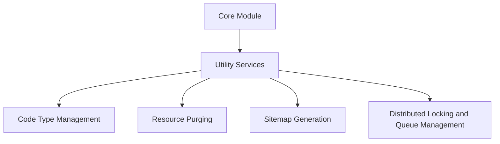

# Introduction

Utility services in the Core Module provide various helper functions and common operations used throughout the application. These services include handling code types, resource purging, sitemap generation, distributed locking mechanisms, and queue management.

# Utility Classes

Utility classes like <SwmToken path="core/broadleaf-framework/src/main/java/org/broadleafcommerce/core/util/ZookeeperUtil.java" pos="28:10:10" line-data="import org.broadleafcommerce.common.util.GenericOperationUtil;">`GenericOperationUtil`</SwmToken> are imported and used in the code to provide common operations that can be reused across the application. For example, in <SwmPath>[core/broadleaf-framework/src/main/java/org/broadleafcommerce/core/util/ZookeeperUtil.java](core/broadleaf-framework/src/main/java/org/broadleafcommerce/core/util/ZookeeperUtil.java)</SwmPath>, several utility classes are imported to facilitate various operations.

<SwmSnippet path="/core/broadleaf-framework/src/main/java/org/broadleafcommerce/core/util/ZookeeperUtil.java" line="25">

---

This snippet shows the import statements for utility classes in <SwmPath>[core/broadleaf-framework/src/main/java/org/broadleafcommerce/core/util/ZookeeperUtil.java](core/broadleaf-framework/src/main/java/org/broadleafcommerce/core/util/ZookeeperUtil.java)</SwmPath>. These imports include <SwmToken path="core/broadleaf-framework/src/main/java/org/broadleafcommerce/core/util/ZookeeperUtil.java" pos="25:6:6" line-data="import org.apache.zookeeper.ZooKeeper;">`zookeeper`</SwmToken>, <SwmToken path="core/broadleaf-framework/src/main/java/org/broadleafcommerce/core/util/ZookeeperUtil.java" pos="26:10:10" line-data="import org.apache.zookeeper.data.ACL;">`ACL`</SwmToken>, <SwmToken path="core/broadleaf-framework/src/main/java/org/broadleafcommerce/core/util/ZookeeperUtil.java" pos="27:10:10" line-data="import org.broadleafcommerce.common.util.GenericOperation;">`GenericOperation`</SwmToken>, and <SwmToken path="core/broadleaf-framework/src/main/java/org/broadleafcommerce/core/util/ZookeeperUtil.java" pos="28:10:10" line-data="import org.broadleafcommerce.common.util.GenericOperationUtil;">`GenericOperationUtil`</SwmToken>.

```java
import org.apache.zookeeper.ZooKeeper;
import org.apache.zookeeper.data.ACL;
import org.broadleafcommerce.common.util.GenericOperation;
import org.broadleafcommerce.common.util.GenericOperationUtil;

import java.util.ArrayList;
```

---

</SwmSnippet>

# Code Type Management

The `CodeTypeService` and its implementation manage different types of codes used in the application. This service helps in organizing and handling various code types efficiently.

# Sitemap Generation

The `BroadleafSitemapUtils` class provides utility methods for generating sitemaps, which are essential for SEO and site indexing. These methods help in creating and managing sitemaps effectively.

# Distributed Locking and Queue Management

Utility services also include classes for distributed locking mechanisms and queue management, such as `DistributedLock` and `DistributedBlockingQueue`. These classes are crucial for handling concurrency and ensuring data consistency in distributed environments.

&nbsp;

*This is an auto-generated document by Swimm AI 🌊 and has not yet been verified by a human*

<SwmMeta version="3.0.0" repo-id="Z2l0aHViJTNBJTNBQnJvYWRsZWFmQ29tbWVyY2UtZGVtby1uZXclM0ElM0FTd2ltbS1EZW1v" repo-name="BroadleafCommerce-demo-new" doc-type="overview"><sup>Powered by [Swimm](/)</sup></SwmMeta>
