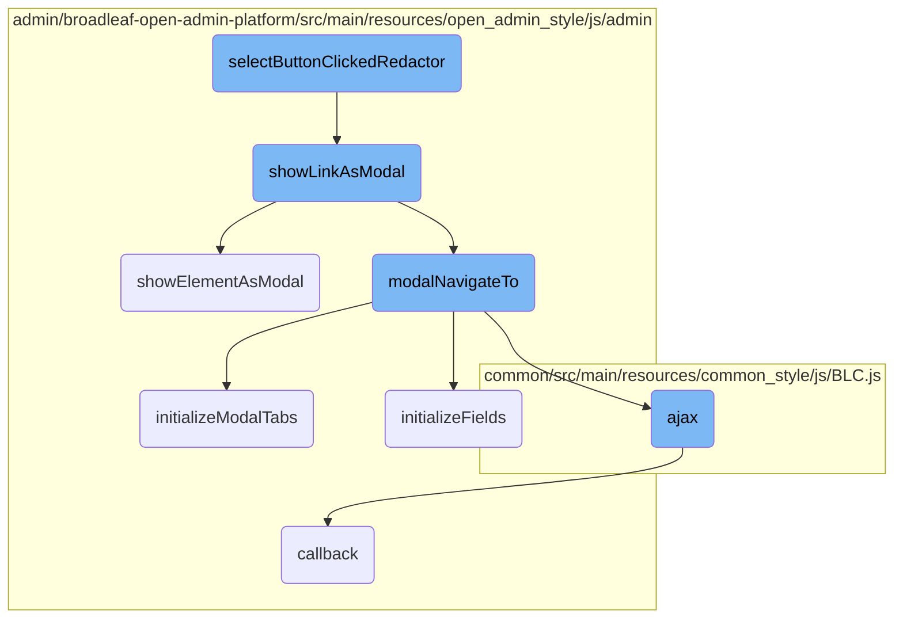

This document provides an overview of how the <SwmToken path="admin/broadleaf-open-admin-platform/src/main/resources/open_admin_style/js/admin/components/assetSelector.js" pos="50:1:1" line-data="        selectButtonClickedRedactor : function(obj, event, key) {">`selectButtonClickedRedactor`</SwmToken> function operates within the Broadleaf Commerce admin platform. It explains the steps involved in handling the click event on the select button within the Redactor editor, setting up event listeners, and displaying modals for asset selection.

When you click the select button in the Redactor editor, the <SwmToken path="admin/broadleaf-open-admin-platform/src/main/resources/open_admin_style/js/admin/components/assetSelector.js" pos="50:1:1" line-data="        selectButtonClickedRedactor : function(obj, event, key) {">`selectButtonClickedRedactor`</SwmToken> function saves your current selection and sets up a listener for when you choose an asset. It then shows a modal window where you can select an asset. Once you select an asset, the function restores your previous selection and inserts the chosen asset into the editor. Finally, it hides the modal window.

Here is a high level diagram of the flow, showing only the most important functions:



# Flow drill down

First, we'll zoom into this section of the flow:

```mermaid
graph TD;
      subgraph admin/broadleaf-open-admin-platform/src/main/resources/open_admin_style/js/admin
933e32993dfbe98523edcdf76c8a59a6503d5e8d68ddd043eeaecd7290729b21(selectButtonClickedRedactor):::mainFlowStyle --> 6f39ebef9275f7abeb84a5992b2aedc3fa23bee615eddf53e6a7f3a98777764c(showLinkAsModal):::mainFlowStyle
end

subgraph admin/broadleaf-open-admin-platform/src/main/resources/open_admin_style/js/admin
6f39ebef9275f7abeb84a5992b2aedc3fa23bee615eddf53e6a7f3a98777764c(showLinkAsModal):::mainFlowStyle --> 3bba2b0d6d38995afa22eedfb12cb9bd28db3ff0cff7702778587cbb1f41ccff(showElementAsModal)
end

subgraph admin/broadleaf-open-admin-platform/src/main/resources/open_admin_style/js/admin
6f39ebef9275f7abeb84a5992b2aedc3fa23bee615eddf53e6a7f3a98777764c(showLinkAsModal):::mainFlowStyle --> be50d404053e390164a1f7ed1303c2cd51ca7a76c002cca07f958b894bf73fbf(modalNavigateTo):::mainFlowStyle
end

subgraph admin/broadleaf-open-admin-platform/src/main/resources/open_admin_style/js/admin
be50d404053e390164a1f7ed1303c2cd51ca7a76c002cca07f958b894bf73fbf(modalNavigateTo):::mainFlowStyle --> 17ukb(...)
end

subgraph admin/broadleaf-open-admin-platform/src/main/resources/open_admin_style/js/admin
3bba2b0d6d38995afa22eedfb12cb9bd28db3ff0cff7702778587cbb1f41ccff(showElementAsModal) --> 1dc61a640b45035b4599efb7d2b5e86f5ce2a25e7a70be03b965e8a45da578ed(showModal)
end


      classDef mainFlowStyle color:#000000,fill:#7CB9F4
classDef rootsStyle color:#000000,fill:#00FFF4
classDef Style1 color:#000000,fill:#00FFAA
classDef Style2 color:#000000,fill:#FFFF00
classDef Style3 color:#000000,fill:#AA7CB9

%% Swimm:
%% graph TD;
%%       subgraph <SwmPath>[admin/broadleaf-open-admin-platform/src/main/resources/open_admin_style/js/admin/](admin/broadleaf-open-admin-platform/src/main/resources/open_admin_style/js/admin/)</SwmPath>
%% 933e32993dfbe98523edcdf76c8a59a6503d5e8d68ddd043eeaecd7290729b21(selectButtonClickedRedactor):::mainFlowStyle --> 6f39ebef9275f7abeb84a5992b2aedc3fa23bee615eddf53e6a7f3a98777764c(showLinkAsModal):::mainFlowStyle
%% end
%% 
%% subgraph <SwmPath>[admin/broadleaf-open-admin-platform/src/main/resources/open_admin_style/js/admin/](admin/broadleaf-open-admin-platform/src/main/resources/open_admin_style/js/admin/)</SwmPath>
%% 6f39ebef9275f7abeb84a5992b2aedc3fa23bee615eddf53e6a7f3a98777764c(showLinkAsModal):::mainFlowStyle --> 3bba2b0d6d38995afa22eedfb12cb9bd28db3ff0cff7702778587cbb1f41ccff(showElementAsModal)
%% end
%% 
%% subgraph <SwmPath>[admin/broadleaf-open-admin-platform/src/main/resources/open_admin_style/js/admin/](admin/broadleaf-open-admin-platform/src/main/resources/open_admin_style/js/admin/)</SwmPath>
%% 6f39ebef9275f7abeb84a5992b2aedc3fa23bee615eddf53e6a7f3a98777764c(showLinkAsModal):::mainFlowStyle --> be50d404053e390164a1f7ed1303c2cd51ca7a76c002cca07f958b894bf73fbf(modalNavigateTo):::mainFlowStyle
%% end
%% 
%% subgraph <SwmPath>[admin/broadleaf-open-admin-platform/src/main/resources/open_admin_style/js/admin/](admin/broadleaf-open-admin-platform/src/main/resources/open_admin_style/js/admin/)</SwmPath>
%% be50d404053e390164a1f7ed1303c2cd51ca7a76c002cca07f958b894bf73fbf(modalNavigateTo):::mainFlowStyle --> 17ukb(...)
%% end
%% 
%% subgraph <SwmPath>[admin/broadleaf-open-admin-platform/src/main/resources/open_admin_style/js/admin/](admin/broadleaf-open-admin-platform/src/main/resources/open_admin_style/js/admin/)</SwmPath>
%% 3bba2b0d6d38995afa22eedfb12cb9bd28db3ff0cff7702778587cbb1f41ccff(showElementAsModal) --> 1dc61a640b45035b4599efb7d2b5e86f5ce2a25e7a70be03b965e8a45da578ed(showModal)
%% end
%% 
%% 
%%       classDef mainFlowStyle color:#000000,fill:#7CB9F4
%% classDef rootsStyle color:#000000,fill:#00FFF4
%% classDef Style1 color:#000000,fill:#00FFAA
%% classDef Style2 color:#000000,fill:#FFFF00
%% classDef Style3 color:#000000,fill:#AA7CB9
```



<SwmSnippet path="/admin/broadleaf-open-admin-platform/src/main/resources/open_admin_style/js/admin/components/assetSelector.js" line="50">

---

## Handling modal display and interaction

The function <SwmToken path="admin/broadleaf-open-admin-platform/src/main/resources/open_admin_style/js/admin/components/assetSelector.js" pos="50:1:1" line-data="        selectButtonClickedRedactor : function(obj, event, key) {">`selectButtonClickedRedactor`</SwmToken> is responsible for handling the click event on the select button within the Redactor editor. It saves the current selection, sets up an event listener for when asset information is selected, and then calls <SwmToken path="admin/broadleaf-open-admin-platform/src/main/resources/open_admin_style/js/admin/components/assetSelector.js" pos="65:3:3" line-data="            BLCAdmin.showLinkAsModal($(&#39;textarea.redactor&#39;).data(&#39;select-asset-url&#39;), function() {">`showLinkAsModal`</SwmToken> to display the modal for asset selection.

```javascript
        selectButtonClickedRedactor : function(obj, event, key) {
            currentRedactor = this;
            currentRedactor.selection.save();
            var $redactor = this.$element;
            
            $redactor.on('assetInfoSelected', function(event, fields) {
                currentRedactor.selection.restore();
                var assetUrl =   fields['assetUrl'];
                var altText = fields['altText'];
                if (assetUrl.charAt(0) == "/") assetUrl = assetUrl.substr(1);
                var $img = $('', { 'src' : assetUrl, 'alt': altText });
                currentRedactor.insert.html($img.outerHTML());
                BLCAdmin.hideCurrentModal();
            });

            BLCAdmin.showLinkAsModal($('textarea.redactor').data('select-asset-url'), function() {
                $('textarea.redactor').unbind('assetInfoSelected');
                currentRedactor = null;
            });
        },
```

---

</SwmSnippet>

<SwmSnippet path="/admin/broadleaf-open-admin-platform/src/main/resources/open_admin_style/js/admin/blc-admin.js" line="364">

---

### Displaying the modal

The function <SwmToken path="admin/broadleaf-open-admin-platform/src/main/resources/open_admin_style/js/admin/blc-admin.js" pos="364:1:1" line-data="        showLinkAsModal : function(link, onModalHide, onModalHideArgs) {">`showLinkAsModal`</SwmToken> is used to display a modal with a loading message initially. It then calls <SwmToken path="admin/broadleaf-open-admin-platform/src/main/resources/open_admin_style/js/admin/blc-admin.js" pos="372:3:3" line-data="            BLCAdmin.showElementAsModal($modal, onModalHide, onModalHideArgs);">`showElementAsModal`</SwmToken> to handle the modal element and <SwmToken path="admin/broadleaf-open-admin-platform/src/main/resources/open_admin_style/js/admin/blc-admin.js" pos="375:3:3" line-data="            BLCAdmin.modalNavigateTo(link);">`modalNavigateTo`</SwmToken> to navigate to the actual content link.

```javascript
        showLinkAsModal : function(link, onModalHide, onModalHideArgs) {
            // Show a loading message
            var $modal = BLCAdmin.getModalSkeleton();
            $modal.addClass('loading-modal');
            $modal.find('.modal-header h3').text(BLCAdmin.messages.loading);
            $modal.find('.modal-body').append($('<i>', { 'class' : 'fa-pulse fa fa-spinner' }));
            $modal.find('.modal-body').css('text-align', 'center').css('font-size', '24px').css('padding-bottom', '15px');

            BLCAdmin.showElementAsModal($modal, onModalHide, onModalHideArgs);

            // Then replace it with the actual requested link
            BLCAdmin.modalNavigateTo(link);
        },
```

---

</SwmSnippet>

<SwmSnippet path="/admin/broadleaf-open-admin-platform/src/main/resources/open_admin_style/js/admin/blc-admin.js" line="348">

---

### Handling the modal element

The function <SwmToken path="admin/broadleaf-open-admin-platform/src/main/resources/open_admin_style/js/admin/blc-admin.js" pos="348:1:1" line-data="        showElementAsModal : function($element, onModalHide, onModalHideArgs) {">`showElementAsModal`</SwmToken> is responsible for preparing and displaying the modal element. It ensures that the modal content is wrapped correctly and appends the modal to the body before calling <SwmToken path="admin/broadleaf-open-admin-platform/src/main/resources/open_admin_style/js/admin/blc-admin.js" pos="361:1:1" line-data="            showModal($element, onModalHide, onModalHideArgs);">`showModal`</SwmToken>.

```javascript
        showElementAsModal : function($element, onModalHide, onModalHideArgs) {
            if (BLCAdmin.currentModal() != null && BLCAdmin.currentModal().hasClass('loading-modal')) {
                BLCAdmin.hideCurrentModal();
            }

            if (!$element.find('.content-yield').length) {
                var content = $('<div>', { 'class': 'content-yield'});
                $element.find('.modal-body').wrapInner(content);
            }
            if($element.hasClass('wrap-in-modal')) {
                $element = wrapInModal($element);
            }
            $('body').append($element);
            showModal($element, onModalHide, onModalHideArgs);
        },
```

---

</SwmSnippet>

<SwmSnippet path="/admin/broadleaf-open-admin-platform/src/main/resources/open_admin_style/js/admin/blc-admin.js" line="52">

---

### Showing the modal

The function <SwmToken path="admin/broadleaf-open-admin-platform/src/main/resources/open_admin_style/js/admin/blc-admin.js" pos="52:3:3" line-data="    function showModal($data, onModalHide, onModalHideArgs) {">`showModal`</SwmToken> handles the actual display of the modal, including setting the <SwmToken path="admin/broadleaf-open-admin-platform/src/main/resources/open_admin_style/js/admin/blc-admin.js" pos="59:28:30" line-data="        // If we already have an active modal, we need to modify its z-index so that it will be">`z-index`</SwmToken>, managing the modal stack, and initializing modal fields and buttons. It also binds a callback for when the modal is hidden to clean up and restore the previous state.

```javascript
    function showModal($data, onModalHide, onModalHideArgs) {
        // If we already have an active modal, we don't need another backdrop on subsequent modals
        $data.modal({
            backdrop: (modals.length < 1),
            keyboard: false  // disable default keyboard behavior; wasn't intended to work with layered modals
        });

        // If we already have an active modal, we need to modify its z-index so that it will be
        // hidden by the current backdrop
        if (modals.length > 0) {
            modals.last().css('z-index', '1040');

            // We will also offset modals by the given option values
            $data.css('left', $data.position().left + (stackedModalOptions.left * modals.length) + 'px');
            $data.css('top', $data.position().top + (stackedModalOptions.top * modals.length) + 'px');
        }

        // Save our new modal into our stack
        modals.push($data);
        // Bind a callback for the modal hidden event...
        $data.on('hidden', function() {
```

---

</SwmSnippet>

Now, lets zoom into this section of the flow:

```mermaid
graph TD;
      subgraph admin/broadleaf-open-admin-platform/src/main/resources/open_admin_style/js/admin
be50d404053e390164a1f7ed1303c2cd51ca7a76c002cca07f958b894bf73fbf(modalNavigateTo):::mainFlowStyle --> 20765157e7caf47cfebacf124dbb54d87c5a924adf517dbde5cfb0bca79d1b33(initializeModalTabs)
end

subgraph admin/broadleaf-open-admin-platform/src/main/resources/open_admin_style/js/admin
be50d404053e390164a1f7ed1303c2cd51ca7a76c002cca07f958b894bf73fbf(modalNavigateTo):::mainFlowStyle --> a6a3ca24e1b4b5f47b35b79ad693e368ff18f4804a874395b6067f6d5a30db79(initializeFields)
end

subgraph common/src/main/resources/common_style/js/BLC.js
be50d404053e390164a1f7ed1303c2cd51ca7a76c002cca07f958b894bf73fbf(modalNavigateTo):::mainFlowStyle --> 735e8dabf9d808e57e1ae9226d6dc2bbd430d5caf620c06e056b1f2093d3b0a4(ajax):::mainFlowStyle
end

subgraph admin/broadleaf-open-admin-platform/src/main/resources/open_admin_style/js/admin
a6a3ca24e1b4b5f47b35b79ad693e368ff18f4804a874395b6067f6d5a30db79(initializeFields) --> f3f786b632f6aeed5cea30dc5e39700c333958642dd5f8e79fe0d86144a9fdf4(initializeRadioFields)
end

subgraph admin/broadleaf-open-admin-platform/src/main/resources/open_admin_style/js/admin
a6a3ca24e1b4b5f47b35b79ad693e368ff18f4804a874395b6067f6d5a30db79(initializeFields) --> a3d4a3da082952a6c51bc77c5212988bb7e2598c138fd3ffa0cfe3f1a01ba1bc(initializeColorPickerFields)
end

subgraph admin/broadleaf-open-admin-platform/src/main/resources/open_admin_style/js/admin
20765157e7caf47cfebacf124dbb54d87c5a924adf517dbde5cfb0bca79d1b33(initializeModalTabs) --> 02f5ebfc4c173995c97e887e34854c9e5262b2d09c51754d3293f5c1f10d096f(broadleafTabs)
end


      classDef mainFlowStyle color:#000000,fill:#7CB9F4
classDef rootsStyle color:#000000,fill:#00FFF4
classDef Style1 color:#000000,fill:#00FFAA
classDef Style2 color:#000000,fill:#FFFF00
classDef Style3 color:#000000,fill:#AA7CB9

%% Swimm:
%% graph TD;
%%       subgraph <SwmPath>[admin/broadleaf-open-admin-platform/src/main/resources/open_admin_style/js/admin/](admin/broadleaf-open-admin-platform/src/main/resources/open_admin_style/js/admin/)</SwmPath>
%% be50d404053e390164a1f7ed1303c2cd51ca7a76c002cca07f958b894bf73fbf(modalNavigateTo):::mainFlowStyle --> 20765157e7caf47cfebacf124dbb54d87c5a924adf517dbde5cfb0bca79d1b33(initializeModalTabs)
%% end
%% 
%% subgraph <SwmPath>[admin/broadleaf-open-admin-platform/src/main/resources/open_admin_style/js/admin/](admin/broadleaf-open-admin-platform/src/main/resources/open_admin_style/js/admin/)</SwmPath>
%% be50d404053e390164a1f7ed1303c2cd51ca7a76c002cca07f958b894bf73fbf(modalNavigateTo):::mainFlowStyle --> a6a3ca24e1b4b5f47b35b79ad693e368ff18f4804a874395b6067f6d5a30db79(initializeFields)
%% end
%% 
%% subgraph <SwmPath>[common/src/main/resources/common_style/js/BLC.js](common/src/main/resources/common_style/js/BLC.js)</SwmPath>
%% be50d404053e390164a1f7ed1303c2cd51ca7a76c002cca07f958b894bf73fbf(modalNavigateTo):::mainFlowStyle --> 735e8dabf9d808e57e1ae9226d6dc2bbd430d5caf620c06e056b1f2093d3b0a4(ajax):::mainFlowStyle
%% end
%% 
%% subgraph <SwmPath>[admin/broadleaf-open-admin-platform/src/main/resources/open_admin_style/js/admin/](admin/broadleaf-open-admin-platform/src/main/resources/open_admin_style/js/admin/)</SwmPath>
%% a6a3ca24e1b4b5f47b35b79ad693e368ff18f4804a874395b6067f6d5a30db79(initializeFields) --> f3f786b632f6aeed5cea30dc5e39700c333958642dd5f8e79fe0d86144a9fdf4(initializeRadioFields)
%% end
%% 
%% subgraph <SwmPath>[admin/broadleaf-open-admin-platform/src/main/resources/open_admin_style/js/admin/](admin/broadleaf-open-admin-platform/src/main/resources/open_admin_style/js/admin/)</SwmPath>
%% a6a3ca24e1b4b5f47b35b79ad693e368ff18f4804a874395b6067f6d5a30db79(initializeFields) --> a3d4a3da082952a6c51bc77c5212988bb7e2598c138fd3ffa0cfe3f1a01ba1bc(initializeColorPickerFields)
%% end
%% 
%% subgraph <SwmPath>[admin/broadleaf-open-admin-platform/src/main/resources/open_admin_style/js/admin/](admin/broadleaf-open-admin-platform/src/main/resources/open_admin_style/js/admin/)</SwmPath>
%% 20765157e7caf47cfebacf124dbb54d87c5a924adf517dbde5cfb0bca79d1b33(initializeModalTabs) --> 02f5ebfc4c173995c97e887e34854c9e5262b2d09c51754d3293f5c1f10d096f(broadleafTabs)
%% end
%% 
%% 
%%       classDef mainFlowStyle color:#000000,fill:#7CB9F4
%% classDef rootsStyle color:#000000,fill:#00FFF4
%% classDef Style1 color:#000000,fill:#00FFAA
%% classDef Style2 color:#000000,fill:#FFFF00
%% classDef Style3 color:#000000,fill:#AA7CB9
```



<SwmSnippet path="/admin/broadleaf-open-admin-platform/src/main/resources/open_admin_style/js/admin/blc-admin.js" line="378">

---

## <SwmToken path="admin/broadleaf-open-admin-platform/src/main/resources/open_admin_style/js/admin/blc-admin.js" pos="379:1:1" line-data="        modalNavigateTo : function(link) {">`modalNavigateTo`</SwmToken>

The <SwmToken path="admin/broadleaf-open-admin-platform/src/main/resources/open_admin_style/js/admin/blc-admin.js" pos="379:1:1" line-data="        modalNavigateTo : function(link) {">`modalNavigateTo`</SwmToken> function is responsible for handling the navigation within a modal. It first checks if there is a current modal open using <SwmToken path="admin/broadleaf-open-admin-platform/src/main/resources/open_admin_style/js/admin/blc-admin.js" pos="380:4:8" line-data="            if (BLCAdmin.currentModal()) {">`BLCAdmin.currentModal()`</SwmToken>. If a modal is open, it sets its <SwmToken path="admin/broadleaf-open-admin-platform/src/main/resources/open_admin_style/js/admin/blc-admin.js" pos="381:10:10" line-data="                BLCAdmin.currentModal().data(&#39;initialized&#39;, &#39;false&#39;);">`initialized`</SwmToken> data attribute to `false` and makes an AJAX GET request to the provided link. Upon receiving the response, it processes the data to create a new modal content, initializes fields or tabs based on the content, and sets up various modal-specific configurations such as button states and modal height. If no modal is open, it falls back to calling <SwmToken path="admin/broadleaf-open-admin-platform/src/main/resources/open_admin_style/js/admin/blc-admin.js" pos="437:1:6" line-data="                BLCAdmin.showLinkAsModal(link);">`BLCAdmin.showLinkAsModal(link)`</SwmToken>.

```javascript
        // Convenience function for hiding the replacing the current modal with the given link
        modalNavigateTo : function(link) {
            if (BLCAdmin.currentModal()) {
                BLCAdmin.currentModal().data('initialized', 'false');
                BLC.ajax({
                    url : link,
                    type : "GET"
                }, function(data) {
                    // Create a modal out of the server response
                    var $data = $(data);

                    // check if the modal has any additional classes
                    var classes = $data.attr('class').split(' ');
                    if (classes.length > 2) {
                        for (var i = 2; i < classes.length; i++) {
                            BLCAdmin.currentModal().addClass(classes[i]);
                        }
                    }

                    $data = $data.children();

```

---

</SwmSnippet>

<SwmSnippet path="/common/src/main/resources/common_style/js/BLC.js" line="135">

---

### AJAX Request

The <SwmToken path="common/src/main/resources/common_style/js/BLC.js" pos="135:3:3" line-data="    function ajax(options, callback) {">`ajax`</SwmToken> function is used within <SwmToken path="admin/broadleaf-open-admin-platform/src/main/resources/open_admin_style/js/admin/blc-admin.js" pos="375:3:3" line-data="            BLCAdmin.modalNavigateTo(link);">`modalNavigateTo`</SwmToken> to make the GET request to the server. It handles setting up the request, including adding CSRF tokens if necessary, and processes the response data to trigger any necessary callbacks or error handlers.

```javascript
    function ajax(options, callback) {
        if (options.type == null) {
            options.type = 'GET';
        }

        var baseUrl = window.location.href;
        if (baseUrl.indexOf('isPostAdd') != -1) {
            if (options.url.indexOf('isPostAdd') < 0) {
                if (options.url.indexOf('?') > 0) {
                    options.url += "&";
                } else {
                    options.url += "?";
                }
                options.url += "isPostAdd=true";
            }
        }
        var savedCatalogElement = $('input[name ="catalogEntityCatalogDiscriminatorId"]');
        var savedCatalog=null;

        if(savedCatalogElement.length){
            //0 should be the one we need, other can be from the modal form
```

---

</SwmSnippet>

<SwmSnippet path="/admin/broadleaf-open-admin-platform/src/main/resources/open_admin_style/js/admin/blc-admin.js" line="302">

---

### Initializing Modal Tabs

The <SwmToken path="admin/broadleaf-open-admin-platform/src/main/resources/open_admin_style/js/admin/blc-admin.js" pos="302:1:1" line-data="        initializeModalTabs : function($data) {">`initializeModalTabs`</SwmToken> function is called within <SwmToken path="admin/broadleaf-open-admin-platform/src/main/resources/open_admin_style/js/admin/blc-admin.js" pos="375:3:3" line-data="            BLCAdmin.modalNavigateTo(link);">`modalNavigateTo`</SwmToken> to set up the tabs within the modal. It uses the <SwmToken path="admin/broadleaf-open-admin-platform/src/main/resources/open_admin_style/js/admin/blc-admin.js" pos="303:4:4" line-data="            $.fn.broadleafTabs();">`broadleafTabs`</SwmToken> plugin to initialize the tabs and then simulates a click on the active tab to ensure it is properly displayed.

```javascript
        initializeModalTabs : function($data) {
            $.fn.broadleafTabs();

            BLCAdmin.currentModal().find('.nav-tabs li.active > a').click();
        },
```

---

</SwmSnippet>

<SwmSnippet path="/admin/broadleaf-open-admin-platform/src/main/resources/open_admin_style/js/admin/blc-admin.js" line="489">

---

### Initializing Fields

The <SwmToken path="admin/broadleaf-open-admin-platform/src/main/resources/open_admin_style/js/admin/blc-admin.js" pos="489:1:1" line-data="        initializeFields : function($container) {">`initializeFields`</SwmToken> function is another key function called within <SwmToken path="admin/broadleaf-open-admin-platform/src/main/resources/open_admin_style/js/admin/blc-admin.js" pos="375:3:3" line-data="            BLCAdmin.modalNavigateTo(link);">`modalNavigateTo`</SwmToken>. It initializes various form fields within the modal, such as text areas, color pickers, and radio buttons. It also handles setting default values and marking the container as initialized to prevent redundant initializations.

```javascript
        initializeFields : function($container) {

            // If there is no container specified, we'll initialize the active tab (or the body if there are no tabs)
            if ($container == null) {
                $container = BLCAdmin.getActiveTab();
            }

            // run field initialization handlers and see if we should continue initializing fields
            var continueInitialization = BLCAdmin.runFieldInitializationHandlers($container);

            // If we've already initialized this container, we'll skip it.
            if ($container.data('initialized') === 'true' || !continueInitialization) {
                if ($container.closest('.oms-tab').length) {
                    return;
                }
                // Update all listgrids sizing on the current tab just in case.
                $container.find('.listgrid-container tbody').each(function (index, element) {
                    BLCAdmin.listGrid.updateGridTitleBarSize($(element).closest('.listgrid-container').find('.fieldgroup-listgrid-wrapper-header'));
                    BLCAdmin.listGrid.paginate.updateGridSize($(element));
                });
                return;
```

---

</SwmSnippet>

<SwmSnippet path="/admin/broadleaf-open-admin-platform/src/main/resources/open_admin_style/js/admin/blc-admin.js" line="634">

---

### Initializing Radio Fields

The <SwmToken path="admin/broadleaf-open-admin-platform/src/main/resources/open_admin_style/js/admin/blc-admin.js" pos="634:1:1" line-data="        initializeRadioFields : function($container) {">`initializeRadioFields`</SwmToken> function is called by <SwmToken path="admin/broadleaf-open-admin-platform/src/main/resources/open_admin_style/js/admin/blc-admin.js" pos="489:1:1" line-data="        initializeFields : function($container) {">`initializeFields`</SwmToken> to set up event handlers for radio button fields within the modal. It ensures that clicking on a radio label will check the corresponding radio button.

```javascript
        initializeRadioFields : function($container) {
            $container.find('.radio-label').on("click", function(e) {
                if (!$(this).hasClass('disabled')) {
                    e.preventDefault();
                    $(this).prev('input').prop("checked", true).change();
                }
            });
        },
```

---

</SwmSnippet>

<SwmSnippet path="/admin/broadleaf-open-admin-platform/src/main/resources/open_admin_style/js/admin/blc-admin.js" line="678">

---

### Initializing Color Picker Fields

The <SwmToken path="admin/broadleaf-open-admin-platform/src/main/resources/open_admin_style/js/admin/blc-admin.js" pos="678:1:1" line-data="        initializeColorPickerFields : function($container) {">`initializeColorPickerFields`</SwmToken> function is also called by <SwmToken path="admin/broadleaf-open-admin-platform/src/main/resources/open_admin_style/js/admin/blc-admin.js" pos="489:1:1" line-data="        initializeFields : function($container) {">`initializeFields`</SwmToken> to set up color picker fields within the modal. It uses the <SwmToken path="admin/broadleaf-open-admin-platform/src/main/resources/open_admin_style/js/admin/blc-admin.js" pos="679:14:14" line-data="            $container.find(&quot;.color-picker&quot;).spectrum({">`spectrum`</SwmToken> plugin to provide a color picker interface and updates the corresponding input field with the selected color.

```javascript
        initializeColorPickerFields : function($container) {
            $container.find(".color-picker").spectrum({
                showButtons: false,
                preferredFormat: "hex6",
                change: function(color) {
                    $(this).closest('.field-group').find('input.color-picker-value').val(color).trigger('input');
                },
                move: function(color) {
                    $(this).closest('.field-group').find('input.color-picker-value').val(color).trigger('input');
                }
            });
        },
```

---

</SwmSnippet>

<SwmSnippet path="/admin/broadleaf-open-admin-platform/src/main/resources/open_admin_style/js/admin/ui/tabs.js" line="19">

---

### Broadleaf Tabs

The <SwmToken path="admin/broadleaf-open-admin-platform/src/main/resources/open_admin_style/js/admin/ui/tabs.js" pos="21:4:4" line-data="    $.fn.broadleafTabs = function(options) {">`broadleafTabs`</SwmToken> plugin is used by <SwmToken path="admin/broadleaf-open-admin-platform/src/main/resources/open_admin_style/js/admin/blc-admin.js" pos="302:1:1" line-data="        initializeModalTabs : function($data) {">`initializeModalTabs`</SwmToken> to handle the tab functionality within the modal. It sets up click event handlers for the tabs, manages the active state of tabs and their content, and triggers the <SwmToken path="admin/broadleaf-open-admin-platform/src/main/resources/open_admin_style/js/admin/ui/tabs.js" pos="62:9:9" line-data="            $(tab).trigger(&#39;activated&#39;);">`activated`</SwmToken> event for the active tab.

```javascript
    'use strict';

    $.fn.broadleafTabs = function(options) {
        $(document).on('click', '.nav-tabs li a:not(.hidden)', function(e) {
            e.preventDefault();

            // Remove 'selected' outline from tab
            $(this).blur();

            var tabs = $(this).closest('.nav-tabs');
            // Remove 'active' class from all tabs
            $.each(tabs.find('li'), function (key, value) {
                $(value).removeClass('active');
            });

            // Add 'active' class to current tab
            $(this).parent().addClass('active');

            // Remove 'active' class from all tab content
            var entityForms = tabs.parent().parent().find('.entityFormTab');
            $.each(entityForms, function (key, value) {
```

---

</SwmSnippet>

&nbsp;

*This is an auto-generated document by Swimm AI 🌊 and has not yet been verified by a human*

<SwmMeta version="3.0.0" repo-id="Z2l0aHViJTNBJTNBQnJvYWRsZWFmQ29tbWVyY2UtZGVtby1uZXclM0ElM0FTd2ltbS1EZW1v" repo-name="BroadleafCommerce-demo-new" doc-type="flows"><sup>Powered by [Swimm](/)</sup></SwmMeta>
