In this document, we will explain the process of handling a click event outside a specific area, known as 'clickout'. This process involves checking the type of click, determining if a drag event was happening, and then either updating the input or reverting changes based on certain conditions.

The flow starts when a user clicks outside a specific area. First, it checks if the click was a right-click or if a drag event was happening. If either of these conditions is true, it stops further actions. If not, it checks a flag to decide whether to update the input or revert changes. Finally, it hides the UI.

# Flow drill down

```mermaid
graph TD;
      subgraph admin/broadleaf-open-admin-platform/src/main/resources/open_admin_style/js/admin/lib/plugins/spectrum.js
60b3c2220801342f10f8398a7ce1087ea08d77c4ea3e2bda8bb838b231df7f1e(clickout):::mainFlowStyle --> cbc22503f01d75d9ddff538d14ec95cedbdcce3768d9d6d01a8a2572f5b8a116(revert):::mainFlowStyle
end

subgraph admin/broadleaf-open-admin-platform/src/main/resources/open_admin_style/js/admin/lib/plugins/spectrum.js
cbc22503f01d75d9ddff538d14ec95cedbdcce3768d9d6d01a8a2572f5b8a116(revert):::mainFlowStyle --> 8ac981950139144735f02c34361aadcaaed8034a29c044e3122fa0c9a14e1e46(set)
end

subgraph admin/broadleaf-open-admin-platform/src/main/resources/open_admin_style/js/admin/lib/plugins/spectrum.js
cbc22503f01d75d9ddff538d14ec95cedbdcce3768d9d6d01a8a2572f5b8a116(revert):::mainFlowStyle --> 02a35d6c2f0178247bd6c332b6c7fa59f8921fcf919ca4db0a6edb85e238f53c(updateOriginalInput):::mainFlowStyle
end

subgraph admin/broadleaf-open-admin-platform/src/main/resources/open_admin_style/js/admin/lib/plugins/spectrum.js
8ac981950139144735f02c34361aadcaaed8034a29c044e3122fa0c9a14e1e46(set) --> eeefc90edb35bd32ed31ecb4a4b5b3a0b232df48d153e328de117a1fc73ad18f(updateUI)
end


      classDef mainFlowStyle color:#000000,fill:#7CB9F4
classDef rootsStyle color:#000000,fill:#00FFF4
classDef Style1 color:#000000,fill:#00FFAA
classDef Style2 color:#000000,fill:#FFFF00
classDef Style3 color:#000000,fill:#AA7CB9

%% Swimm:
%% graph TD;
%%       subgraph <SwmPath>[admin/broadleaf-open-admin-platform/src/main/resources/open_admin_style/js/admin/lib/plugins/spectrum.js](admin/broadleaf-open-admin-platform/src/main/resources/open_admin_style/js/admin/lib/plugins/spectrum.js)</SwmPath>
%% 60b3c2220801342f10f8398a7ce1087ea08d77c4ea3e2bda8bb838b231df7f1e(clickout):::mainFlowStyle --> cbc22503f01d75d9ddff538d14ec95cedbdcce3768d9d6d01a8a2572f5b8a116(revert):::mainFlowStyle
%% end
%% 
%% subgraph <SwmPath>[admin/broadleaf-open-admin-platform/src/main/resources/open_admin_style/js/admin/lib/plugins/spectrum.js](admin/broadleaf-open-admin-platform/src/main/resources/open_admin_style/js/admin/lib/plugins/spectrum.js)</SwmPath>
%% cbc22503f01d75d9ddff538d14ec95cedbdcce3768d9d6d01a8a2572f5b8a116(revert):::mainFlowStyle --> 8ac981950139144735f02c34361aadcaaed8034a29c044e3122fa0c9a14e1e46(set)
%% end
%% 
%% subgraph <SwmPath>[admin/broadleaf-open-admin-platform/src/main/resources/open_admin_style/js/admin/lib/plugins/spectrum.js](admin/broadleaf-open-admin-platform/src/main/resources/open_admin_style/js/admin/lib/plugins/spectrum.js)</SwmPath>
%% cbc22503f01d75d9ddff538d14ec95cedbdcce3768d9d6d01a8a2572f5b8a116(revert):::mainFlowStyle --> 02a35d6c2f0178247bd6c332b6c7fa59f8921fcf919ca4db0a6edb85e238f53c(updateOriginalInput):::mainFlowStyle
%% end
%% 
%% subgraph <SwmPath>[admin/broadleaf-open-admin-platform/src/main/resources/open_admin_style/js/admin/lib/plugins/spectrum.js](admin/broadleaf-open-admin-platform/src/main/resources/open_admin_style/js/admin/lib/plugins/spectrum.js)</SwmPath>
%% 8ac981950139144735f02c34361aadcaaed8034a29c044e3122fa0c9a14e1e46(set) --> eeefc90edb35bd32ed31ecb4a4b5b3a0b232df48d153e328de117a1fc73ad18f(updateUI)
%% end
%% 
%% 
%%       classDef mainFlowStyle color:#000000,fill:#7CB9F4
%% classDef rootsStyle color:#000000,fill:#00FFF4
%% classDef Style1 color:#000000,fill:#00FFAA
%% classDef Style2 color:#000000,fill:#FFFF00
%% classDef Style3 color:#000000,fill:#AA7CB9
```



<SwmSnippet path="/admin/broadleaf-open-admin-platform/src/main/resources/open_admin_style/js/admin/lib/plugins/spectrum.js" line="653">

---

## Clickout

The <SwmToken path="admin/broadleaf-open-admin-platform/src/main/resources/open_admin_style/js/admin/lib/plugins/spectrum.js" pos="653:3:3" line-data="        function clickout(e) {">`clickout`</SwmToken> function handles the event when a user clicks outside a specific area. It checks if the click was a right-click or if a drag event was happening, in which case it returns early. Depending on the <SwmToken path="admin/broadleaf-open-admin-platform/src/main/resources/open_admin_style/js/admin/lib/plugins/spectrum.js" pos="661:4:4" line-data="            if (clickoutFiresChange) {">`clickoutFiresChange`</SwmToken> flag, it either calls <SwmToken path="admin/broadleaf-open-admin-platform/src/main/resources/open_admin_style/js/admin/lib/plugins/spectrum.js" pos="662:1:1" line-data="                updateOriginalInput(true);">`updateOriginalInput`</SwmToken> or <SwmToken path="admin/broadleaf-open-admin-platform/src/main/resources/open_admin_style/js/admin/lib/plugins/spectrum.js" pos="665:1:1" line-data="                revert();">`revert`</SwmToken>, and finally hides the UI.

```javascript
        function clickout(e) {
            // Return on right click.
            if (e.button == 2) { return; }

            // If a drag event was happening during the mouseup, don't hide
            // on click.
            if (isDragging) { return; }

            if (clickoutFiresChange) {
                updateOriginalInput(true);
            }
            else {
                revert();
            }
            hide();
        }
```

---

</SwmSnippet>

<SwmSnippet path="/admin/broadleaf-open-admin-platform/src/main/resources/open_admin_style/js/admin/lib/plugins/spectrum.js" line="686">

---

## Revert

The <SwmToken path="admin/broadleaf-open-admin-platform/src/main/resources/open_admin_style/js/admin/lib/plugins/spectrum.js" pos="686:3:3" line-data="        function revert() {">`revert`</SwmToken> function is responsible for resetting the color to its original state when the UI was first shown. It calls the <SwmToken path="admin/broadleaf-open-admin-platform/src/main/resources/open_admin_style/js/admin/lib/plugins/spectrum.js" pos="687:1:1" line-data="            set(colorOnShow, true);">`set`</SwmToken> function with the original color and then updates the original input.

```javascript
        function revert() {
            set(colorOnShow, true);
            updateOriginalInput(true);
        }
```

---

</SwmSnippet>

<SwmSnippet path="/admin/broadleaf-open-admin-platform/src/main/resources/open_admin_style/js/admin/lib/plugins/spectrum.js" line="691">

---

### Set

The <SwmToken path="admin/broadleaf-open-admin-platform/src/main/resources/open_admin_style/js/admin/lib/plugins/spectrum.js" pos="691:3:3" line-data="        function set(color, ignoreFormatChange) {">`set`</SwmToken> function updates the current color state. It checks if the new color is different from the current one, updates the UI, and sets various color properties like hue, saturation, value, and alpha. If the color is valid and the format change is not ignored, it updates the preferred format.

```javascript
        function set(color, ignoreFormatChange) {
            if (tinycolor.equals(color, get())) {
                // Update UI just in case a validation error needs
                // to be cleared.
                updateUI();
                return;
            }

            var newColor, newHsv;
            if (!color && allowEmpty) {
                isEmpty = true;
            } else {
                isEmpty = false;
                newColor = tinycolor(color);
                newHsv = newColor.toHsv();

                currentHue = (newHsv.h % 360) / 360;
                currentSaturation = newHsv.s;
                currentValue = newHsv.v;
                currentAlpha = newHsv.a;
            }
```

---

</SwmSnippet>

<SwmSnippet path="/admin/broadleaf-open-admin-platform/src/main/resources/open_admin_style/js/admin/lib/plugins/spectrum.js" line="866">

---

## Update Original Input

The <SwmToken path="admin/broadleaf-open-admin-platform/src/main/resources/open_admin_style/js/admin/lib/plugins/spectrum.js" pos="866:3:3" line-data="        function updateOriginalInput(fireCallback) {">`updateOriginalInput`</SwmToken> function updates the original input element with the current color value. It also triggers a change event if the color has changed and the <SwmToken path="admin/broadleaf-open-admin-platform/src/main/resources/open_admin_style/js/admin/lib/plugins/spectrum.js" pos="866:5:5" line-data="        function updateOriginalInput(fireCallback) {">`fireCallback`</SwmToken> flag is true. This function ensures that the input element reflects the current color selection.

```javascript
        function updateOriginalInput(fireCallback) {
            var color = get(),
                displayColor = '',
                hasChanged = !tinycolor.equals(color, colorOnShow);

            if (color) {
                displayColor = color.toString(currentPreferredFormat);
                // Update the selection palette with the current color
                addColorToSelectionPalette(color);
            }

            if (isInput) {
                boundElement.val(displayColor);
            }

            if (fireCallback && hasChanged) {
                callbacks.change(color);
                boundElement.trigger('change', [ color ]);
            }
        }
```

---

</SwmSnippet>

<SwmSnippet path="/admin/broadleaf-open-admin-platform/src/main/resources/open_admin_style/js/admin/lib/plugins/spectrum.js" line="745">

---

## Update UI

The <SwmToken path="admin/broadleaf-open-admin-platform/src/main/resources/open_admin_style/js/admin/lib/plugins/spectrum.js" pos="745:3:3" line-data="        function updateUI() {">`updateUI`</SwmToken> function refreshes the UI elements to reflect the current color state. It updates various UI components like the color dragger, preview element, and text input. It also handles the display of the color palette and initial drawing of the UI.

```javascript
        function updateUI() {

            textInput.removeClass("sp-validation-error");

            updateHelperLocations();

            // Update dragger background color (gradients take care of saturation and value).
            var flatColor = tinycolor.fromRatio({ h: currentHue, s: 1, v: 1 });
            dragger.css("background-color", flatColor.toHexString());

            // Get a format that alpha will be included in (hex and names ignore alpha)
            var format = currentPreferredFormat;
            if (currentAlpha < 1 && !(currentAlpha === 0 && format === "name")) {
                if (format === "hex" || format === "hex3" || format === "hex6" || format === "name") {
                    format = "rgb";
                }
            }

            var realColor = get({ format: format }),
                displayColor = '';

```

---

</SwmSnippet>

&nbsp;

*This is an auto-generated document by Swimm AI 🌊 and has not yet been verified by a human*

<SwmMeta version="3.0.0" repo-id="Z2l0aHViJTNBJTNBQnJvYWRsZWFmQ29tbWVyY2UtZGVtby1uZXclM0ElM0FTd2ltbS1EZW1v" repo-name="BroadleafCommerce-demo-new" doc-type="flows"><sup>Powered by [Swimm](/)</sup></SwmMeta>
