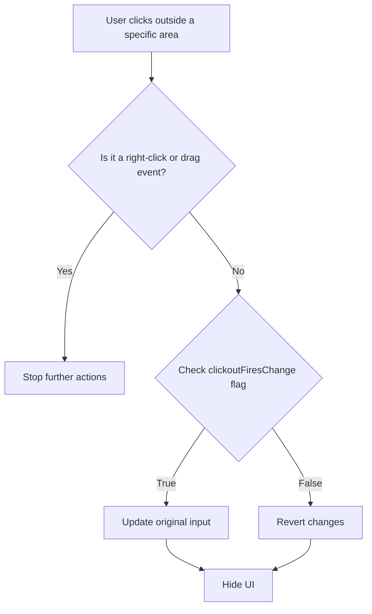

This document will cover the process of handling clickout events, which includes:

1. Identifying the type of click
2. Checking for drag events
3. Deciding whether to update input or revert changes
4. Hiding the UI.

Technical document: <SwmLink doc-title="Handling Clickout Events">[Handling Clickout Events](/.swm/handling-clickout-events.gtlupjil.sw.md)</SwmLink>

# [Identifying the type of click](https://app.swimm.io/repos/Z2l0aHViJTNBJTNBQnJvYWRsZWFmQ29tbWVyY2UtZGVtby1uZXclM0ElM0FTd2ltbS1EZW1v/docs/gtlupjil#clickout)

When a user clicks outside a specific area, the system first checks if the click was a right-click. Right-clicks are typically used for context menus and should not trigger the clickout event. If it is a right-click, no further actions are taken.

# [Checking for drag events](https://app.swimm.io/repos/Z2l0aHViJTNBJTNBQnJvYWRsZWFmQ29tbWVyY2UtZGVtby1uZXclM0ElM0FTd2ltbS1EZW1v/docs/gtlupjil#clickout)

The system then checks if a drag event was happening during the mouseup event. Drag events indicate that the user was moving an element, and thus, the clickout event should not be triggered. If a drag event is detected, no further actions are taken.

# [Deciding whether to update input or revert changes](https://app.swimm.io/repos/Z2l0aHViJTNBJTNBQnJvYWRsZWFmQ29tbWVyY2UtZGVtby1uZXclM0ElM0FTd2ltbS1EZW1v/docs/gtlupjil#clickout)

If the click is not a right-click and no drag event was happening, the system checks the `clickoutFiresChange` flag. This flag determines whether the input should be updated or if changes should be reverted. If the flag is set to true, the system updates the original input with the current value. If the flag is false, the system reverts any changes made.

# [Hiding the UI](https://app.swimm.io/repos/Z2l0aHViJTNBJTNBQnJvYWRsZWFmQ29tbWVyY2UtZGVtby1uZXclM0ElM0FTd2ltbS1EZW1v/docs/gtlupjil#clickout)

Finally, regardless of whether the input was updated or changes were reverted, the system hides the UI. This ensures that the user interface is clean and does not display unnecessary elements after the clickout event.

&nbsp;

*This is an auto-generated document by Swimm AI 🌊 and has not yet been verified by a human*

<SwmMeta version="3.0.0" repo-id="Z2l0aHViJTNBJTNBQnJvYWRsZWFmQ29tbWVyY2UtZGVtby1uZXclM0ElM0FTd2ltbS1EZW1v" repo-name="BroadleafCommerce-demo-new" doc-type="product-flows">Powered by [Swimm](/)</SwmMeta>
