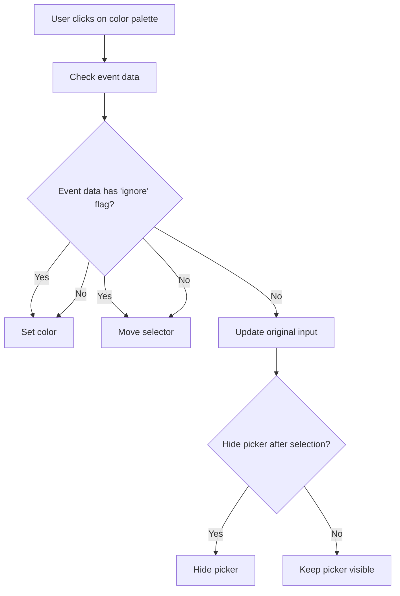

This document will cover the process of handling color palette clicks, which includes:

1. Checking event data
2. Setting the color
3. Moving the selector
4. Updating the original input
5. Hiding the color picker if necessary.

Technical document: <SwmLink doc-title="Handling Color Palette Clicks">[Handling Color Palette Clicks](/.swm/handling-color-palette-clicks.obgmaw38.sw.md)</SwmLink>

# [Checking Event Data](https://app.swimm.io/repos/Z2l0aHViJTNBJTNBQnJvYWRsZWFmQ29tbWVyY2UtZGVtby1uZXclM0ElM0FTd2ltbS1EZW1v/docs/obgmaw38#paletteelementclick)

When a user clicks on a color palette element, the system first checks if the event data contains an 'ignore' flag. This flag indicates whether the click event should bypass certain actions. If the 'ignore' flag is present, the system will proceed to set the color and move the selector without updating the original input.

# [Setting the Color](https://app.swimm.io/repos/Z2l0aHViJTNBJTNBQnJvYWRsZWFmQ29tbWVyY2UtZGVtby1uZXclM0ElM0FTd2ltbS1EZW1v/docs/obgmaw38#set)

The system sets the color based on the user's selection. This involves updating the current color state and ensuring that the new color is different from the existing one. If the color is different, the system updates the user interface to reflect the new color values, including hue, saturation, value, and alpha.

# [Moving the Selector](https://app.swimm.io/repos/Z2l0aHViJTNBJTNBQnJvYWRsZWFmQ29tbWVyY2UtZGVtby1uZXclM0ElM0FTd2ltbS1EZW1v/docs/obgmaw38#move)

After setting the color, the system moves the selector to the new color position. This step ensures that the visual representation of the color picker is updated to match the selected color. The system also triggers a 'move' event to notify other components of the change.

# [Updating the Original Input](https://app.swimm.io/repos/Z2l0aHViJTNBJTNBQnJvYWRsZWFmQ29tbWVyY2UtZGVtby1uZXclM0ElM0FTd2ltbS1EZW1v/docs/obgmaw38#updateoriginalinput)

If the 'ignore' flag is not present, the system updates the original input element with the new color value. This step ensures that the selected color is saved and can be used in other parts of the application. The system also triggers a 'change' event if the color has changed, allowing other components to react to the new color.

# [Hiding the Color Picker](https://app.swimm.io/repos/Z2l0aHViJTNBJTNBQnJvYWRsZWFmQ29tbWVyY2UtZGVtby1uZXclM0ElM0FTd2ltbS1EZW1v/docs/obgmaw38#paletteelementclick)

Depending on the configuration, the system may hide the color picker after a color is selected. This behavior is controlled by the 'hideAfterPaletteSelect' option. If this option is enabled, the color picker will close immediately after a color is selected, providing a streamlined user experience.

&nbsp;

*This is an auto-generated document by Swimm AI 🌊 and has not yet been verified by a human*

<SwmMeta version="3.0.0" repo-id="Z2l0aHViJTNBJTNBQnJvYWRsZWFmQ29tbWVyY2UtZGVtby1uZXclM0ElM0FTd2ltbS1EZW1v" repo-name="BroadleafCommerce-demo-new" doc-type="product-flows">Powered by [Swimm](/)</SwmMeta>
