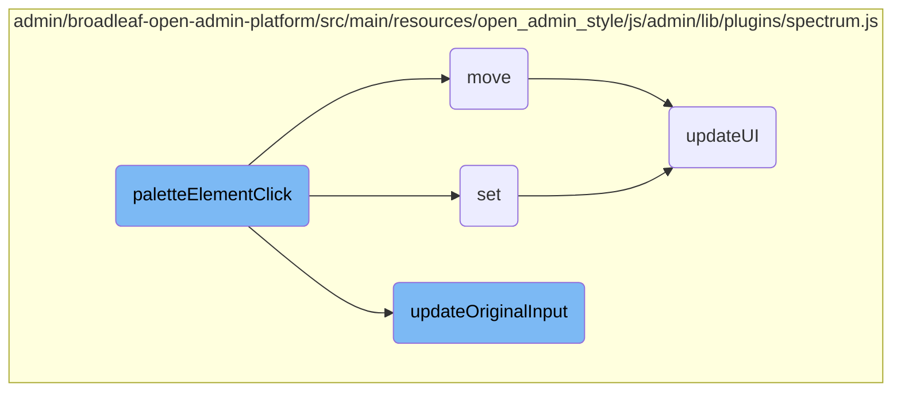

In this document, we will explain the process that occurs when a user clicks on a color palette element. The process involves checking event data, setting the color, moving the selector, and updating the original input.

When a user clicks on a color palette element, the system first checks if the event data has an 'ignore' flag. If it does, it sets the color and moves the selector. If it doesn't, it sets the color, moves the selector, and then updates the original input. Depending on whether the color picker should hide after selection, it may also hide the picker.

# Flow drill down



<SwmSnippet path="/admin/broadleaf-open-admin-platform/src/main/resources/open_admin_style/js/admin/lib/plugins/spectrum.js" line="457">

---

## <SwmToken path="admin/broadleaf-open-admin-platform/src/main/resources/open_admin_style/js/admin/lib/plugins/spectrum.js" pos="457:3:3" line-data="            function paletteElementClick(e) {">`paletteElementClick`</SwmToken>

The <SwmToken path="admin/broadleaf-open-admin-platform/src/main/resources/open_admin_style/js/admin/lib/plugins/spectrum.js" pos="457:3:3" line-data="            function paletteElementClick(e) {">`paletteElementClick`</SwmToken> function handles the event when a user clicks on a color palette element. It first checks if the event data has an <SwmToken path="admin/broadleaf-open-admin-platform/src/main/resources/open_admin_style/js/admin/lib/plugins/spectrum.js" pos="458:14:14" line-data="                if (e.data &amp;&amp; e.data.ignore) {">`ignore`</SwmToken> flag. If so, it sets the color and moves the selector. If not, it sets the color, moves the selector, and then updates the original input based on whether the picker should hide after selection.

```javascript
            function paletteElementClick(e) {
                if (e.data && e.data.ignore) {
                    set($(e.target).closest(".sp-thumb-el").data("color"));
                    move();
                }
                else {
                    set($(e.target).closest(".sp-thumb-el").data("color"));
                    move();

                    // If the picker is going to close immediately, a palette selection
                    // is a change.  Otherwise, it's a move only.
                    if (opts.hideAfterPaletteSelect) {
                        updateOriginalInput(true);
                        hide();
                    } else {
                        updateOriginalInput();
                    }
                }

                return false;
```

---

</SwmSnippet>

<SwmSnippet path="/admin/broadleaf-open-admin-platform/src/main/resources/open_admin_style/js/admin/lib/plugins/spectrum.js" line="691">

---

### set

The <SwmToken path="admin/broadleaf-open-admin-platform/src/main/resources/open_admin_style/js/admin/lib/plugins/spectrum.js" pos="691:3:3" line-data="        function set(color, ignoreFormatChange) {">`set`</SwmToken> function updates the current color state. It checks if the new color is different from the current one. If so, it updates the UI and sets the new color values, including hue, saturation, value, and alpha.

```javascript
        function set(color, ignoreFormatChange) {
            if (tinycolor.equals(color, get())) {
                // Update UI just in case a validation error needs
                // to be cleared.
                updateUI();
                return;
            }

            var newColor, newHsv;
            if (!color && allowEmpty) {
                isEmpty = true;
            } else {
                isEmpty = false;
                newColor = tinycolor(color);
                newHsv = newColor.toHsv();

                currentHue = (newHsv.h % 360) / 360;
                currentSaturation = newHsv.s;
                currentValue = newHsv.v;
                currentAlpha = newHsv.a;
            }
```

---

</SwmSnippet>

<SwmSnippet path="/admin/broadleaf-open-admin-platform/src/main/resources/open_admin_style/js/admin/lib/plugins/spectrum.js" line="738">

---

### move

The <SwmToken path="admin/broadleaf-open-admin-platform/src/main/resources/open_admin_style/js/admin/lib/plugins/spectrum.js" pos="738:3:3" line-data="        function move() {">`move`</SwmToken> function updates the UI and triggers the <SwmToken path="admin/broadleaf-open-admin-platform/src/main/resources/open_admin_style/js/admin/lib/plugins/spectrum.js" pos="738:3:3" line-data="        function move() {">`move`</SwmToken> event. This function is called after setting the new color to reflect the changes in the UI.

```javascript
        function move() {
            updateUI();

            callbacks.move(get());
            boundElement.trigger('move.spectrum', [ get() ]);
        }
```

---

</SwmSnippet>

<SwmSnippet path="/admin/broadleaf-open-admin-platform/src/main/resources/open_admin_style/js/admin/lib/plugins/spectrum.js" line="866">

---

### <SwmToken path="admin/broadleaf-open-admin-platform/src/main/resources/open_admin_style/js/admin/lib/plugins/spectrum.js" pos="866:3:3" line-data="        function updateOriginalInput(fireCallback) {">`updateOriginalInput`</SwmToken>

The <SwmToken path="admin/broadleaf-open-admin-platform/src/main/resources/open_admin_style/js/admin/lib/plugins/spectrum.js" pos="866:3:3" line-data="        function updateOriginalInput(fireCallback) {">`updateOriginalInput`</SwmToken> function updates the original input element with the new color value. It also triggers the <SwmToken path="admin/broadleaf-open-admin-platform/src/main/resources/open_admin_style/js/admin/lib/plugins/spectrum.js" pos="882:3:3" line-data="                callbacks.change(color);">`change`</SwmToken> event if the color has changed and the <SwmToken path="admin/broadleaf-open-admin-platform/src/main/resources/open_admin_style/js/admin/lib/plugins/spectrum.js" pos="866:5:5" line-data="        function updateOriginalInput(fireCallback) {">`fireCallback`</SwmToken> flag is set.

```javascript
        function updateOriginalInput(fireCallback) {
            var color = get(),
                displayColor = '',
                hasChanged = !tinycolor.equals(color, colorOnShow);

            if (color) {
                displayColor = color.toString(currentPreferredFormat);
                // Update the selection palette with the current color
                addColorToSelectionPalette(color);
            }

            if (isInput) {
                boundElement.val(displayColor);
            }

            if (fireCallback && hasChanged) {
                callbacks.change(color);
                boundElement.trigger('change', [ color ]);
            }
        }
```

---

</SwmSnippet>

<SwmSnippet path="/admin/broadleaf-open-admin-platform/src/main/resources/open_admin_style/js/admin/lib/plugins/spectrum.js" line="745">

---

### <SwmToken path="admin/broadleaf-open-admin-platform/src/main/resources/open_admin_style/js/admin/lib/plugins/spectrum.js" pos="745:3:3" line-data="        function updateUI() {">`updateUI`</SwmToken>

The <SwmToken path="admin/broadleaf-open-admin-platform/src/main/resources/open_admin_style/js/admin/lib/plugins/spectrum.js" pos="745:3:3" line-data="        function updateUI() {">`updateUI`</SwmToken> function refreshes the UI elements to reflect the current color state. It updates the color picker, preview element, and other UI components based on the selected color and its format.

```javascript
        function updateUI() {

            textInput.removeClass("sp-validation-error");

            updateHelperLocations();

            // Update dragger background color (gradients take care of saturation and value).
            var flatColor = tinycolor.fromRatio({ h: currentHue, s: 1, v: 1 });
            dragger.css("background-color", flatColor.toHexString());

            // Get a format that alpha will be included in (hex and names ignore alpha)
            var format = currentPreferredFormat;
            if (currentAlpha < 1 && !(currentAlpha === 0 && format === "name")) {
                if (format === "hex" || format === "hex3" || format === "hex6" || format === "name") {
                    format = "rgb";
                }
            }

            var realColor = get({ format: format }),
                displayColor = '';

```

---

</SwmSnippet>

&nbsp;

*This is an auto-generated document by Swimm AI 🌊 and has not yet been verified by a human*

<SwmMeta version="3.0.0" repo-id="Z2l0aHViJTNBJTNBQnJvYWRsZWFmQ29tbWVyY2UtZGVtby1uZXclM0ElM0FTd2ltbS1EZW1v" repo-name="BroadleafCommerce-demo-new" doc-type="flows"><sup>Powered by [Swimm](/)</sup></SwmMeta>
