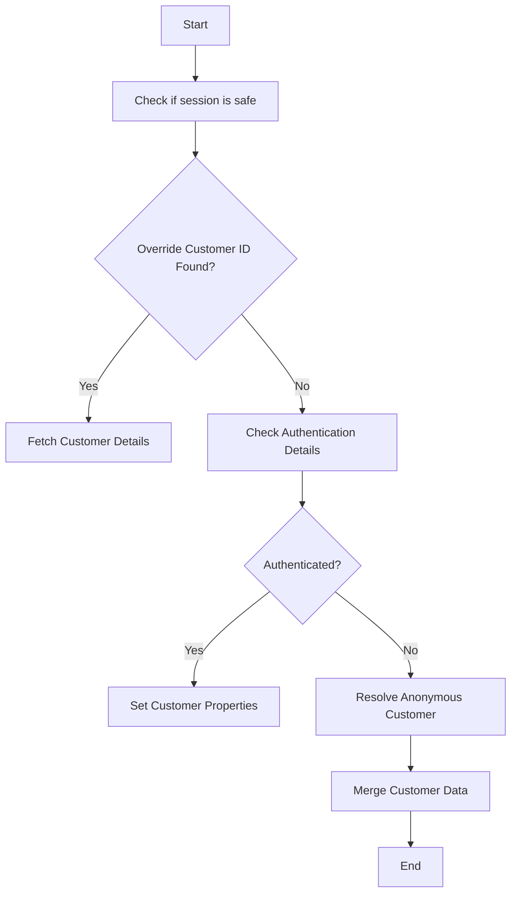

This document will cover the process of handling customer state within the Broadleaf Commerce framework. We'll cover:

1. Determining the current customer
2. Resolving anonymous customers
3. Merging customer data

Technical document: <SwmLink doc-title="Handling Customer State">[Handling Customer State](/.swm/handling-customer-state.3snpu321.sw.md)</SwmLink>

# [Determining the current customer](https://app.swimm.io/repos/Z2l0aHViJTNBJTNBQnJvYWRsZWFmQ29tbWVyY2UtZGVtby1uZXclM0ElM0FTd2ltbS1EZW1v/docs/3snpu321#handling-customer-state)

The process begins by determining the current customer based on session and authentication details. First, the system checks if it is safe to use the session. If an override customer ID is found in the session, it fetches the customer details associated with that ID. If no override ID is found, the system checks the authentication details to determine the logged-in customer. Depending on the type of authentication, it sets the appropriate customer properties and publishes relevant events.

# [Resolving anonymous customers](https://app.swimm.io/repos/Z2l0aHViJTNBJTNBQnJvYWRsZWFmQ29tbWVyY2UtZGVtby1uZXclM0ElM0FTd2ltbS1EZW1v/docs/3snpu321#resolving-anonymous-customer)

If no authenticated customer is found, the system resolves an anonymous customer. It first attempts to retrieve an anonymous customer from the session. If no such customer exists, it creates a new anonymous customer and stores it in the session. This ensures that even unauthenticated users have a customer context for their session.

# [Merging customer data](https://app.swimm.io/repos/Z2l0aHViJTNBJTNBQnJvYWRsZWFmQ29tbWVyY2UtZGVtby1uZXclM0ElM0FTd2ltbS1EZW1v/docs/3snpu321#mergecustomerifrequired)

The system merges anonymous customer data with the logged-in customer's data if necessary. This ensures that any actions or data associated with an anonymous customer are not lost when the customer logs in. The function first checks if it is permissible to use the session. If merging has not already been done, it sets an attribute to prevent repeated merging and retrieves the anonymous customer. Finally, it copies the anonymous customer's information to the logged-in customer.

&nbsp;

*This is an auto-generated document by Swimm AI 🌊 and has not yet been verified by a human*

<SwmMeta version="3.0.0" repo-id="Z2l0aHViJTNBJTNBQnJvYWRsZWFmQ29tbWVyY2UtZGVtby1uZXclM0ElM0FTd2ltbS1EZW1v" repo-name="BroadleafCommerce-demo-new" doc-type="product-flows">Powered by [Swimm](/)</SwmMeta>
