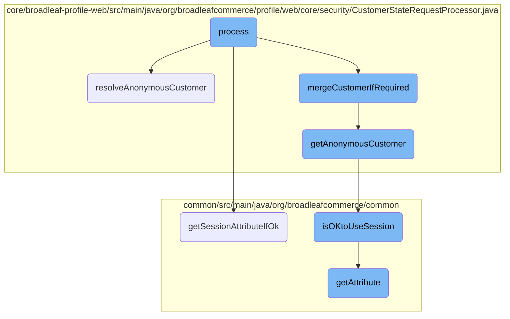
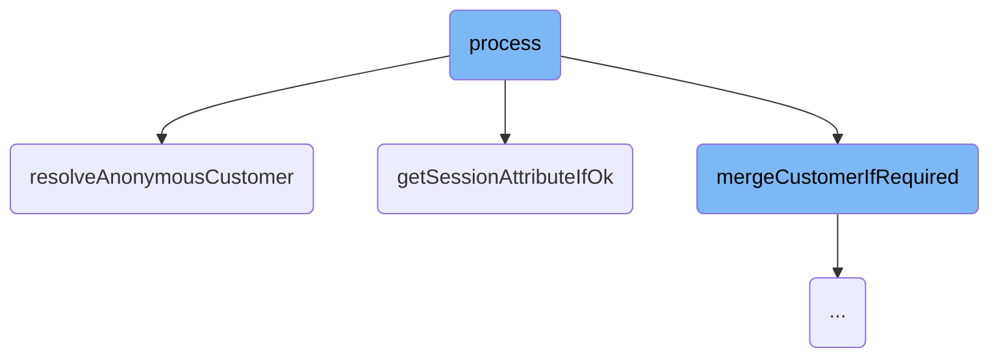
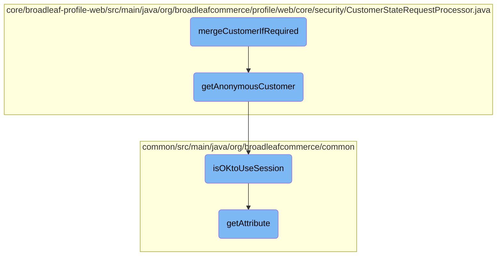
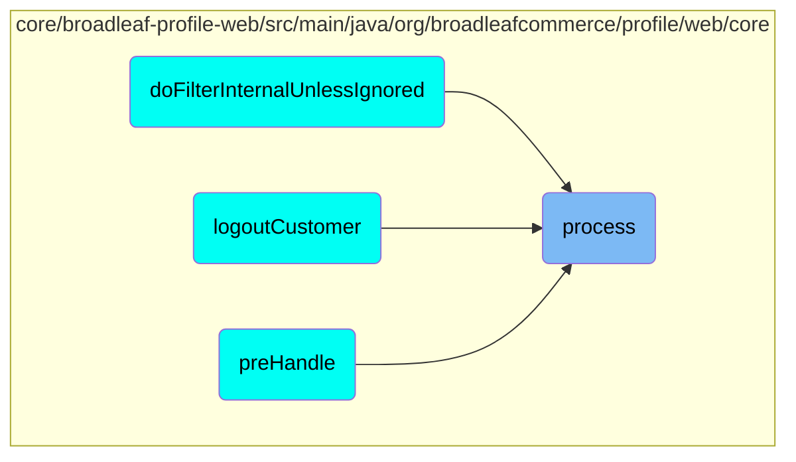

This document explains the process of handling customer state within the Broadleaf Commerce framework. It covers how the system determines the current customer based on session and authentication details, resolves anonymous customers, and merges customer data when necessary.

The process starts by checking if it's safe to use the session and retrieving any override customer ID. If an override ID is found, it fetches the customer details. If not, it checks the authentication details to determine the logged-in customer. Depending on the type of authentication, it sets the appropriate customer properties and publishes relevant events. If no customer is found, it resolves an anonymous customer and merges any necessary data. This ensures that even unauthenticated users have a customer context for their session.

Here is a high level diagram of the flow, showing only the most important functions:



# Flow drill down

First, we'll zoom into this section of the flow:



<SwmSnippet path="/core/broadleaf-profile-web/src/main/java/org/broadleafcommerce/profile/web/core/security/CustomerStateRequestProcessor.java" line="78">

---

## Handling Customer State

The <SwmToken path="core/broadleaf-profile-web/src/main/java/org/broadleafcommerce/profile/web/core/security/CustomerStateRequestProcessor.java" pos="79:5:5" line-data="    public void process(WebRequest request) {">`process`</SwmToken> method is responsible for determining the current customer state based on the session and authentication details. It first checks if it is okay to use the session and retrieves any override customer ID. If an override ID is found, it fetches the customer details. If not, it checks the authentication details to determine the logged-in customer. Depending on the type of authentication, it sets the appropriate customer properties and publishes relevant events. If no customer is found, it resolves an anonymous customer and merges any necessary data.

```java
    @Override
    public void process(WebRequest request) {
        Customer customer = null;
        Long overrideId = null;
        if (BLCRequestUtils.isOKtoUseSession(request)) {
            overrideId = (Long) request.getAttribute(OVERRIDE_CUSTOMER_SESSION_ATTR_NAME, WebRequest.SCOPE_SESSION);
        }
        if (overrideId != null) {
            customer = customerService.readCustomerById(overrideId);
            if (customer != null && !customer.isRegistered() && !customer.isLoggedIn() && !customer.isCookied()) {
                customer.setAnonymous(true);
            }
        } else {
            Authentication authentication = SecurityContextHolder.getContext().getAuthentication();
            if ((authentication != null) && !(authentication instanceof AnonymousAuthenticationToken)) {
                String userName = authentication.getName();
                customer = (Customer) BroadleafRequestCustomerResolverImpl.getRequestCustomerResolver().getCustomer(request);
                if (userName != null && (customer == null || !userName.equals(customer.getUsername()))) {
                    // can only get here if the authenticated user does not match the user in session
                    customer = customerService.readCustomerByUsername(userName);
                    if (logger.isDebugEnabled() && customer != null) {
```

---

</SwmSnippet>

<SwmSnippet path="/core/broadleaf-profile-web/src/main/java/org/broadleafcommerce/profile/web/core/security/CustomerStateRequestProcessor.java" line="232">

---

### Resolving Anonymous Customer

The <SwmToken path="core/broadleaf-profile-web/src/main/java/org/broadleafcommerce/profile/web/core/security/CustomerStateRequestProcessor.java" pos="144:5:5" line-data="            customer = resolveAnonymousCustomer(request);">`resolveAnonymousCustomer`</SwmToken> method is used to handle cases where no authenticated customer is found. It first attempts to retrieve an anonymous customer from the session. If no such customer exists, it creates a new anonymous customer and stores it in the session. This ensures that even unauthenticated users have a customer context for their session.

```java
    /**
     * <p>Implementors can subclass to change how anonymous customers are created. Note that this method is intended to actually create the anonymous
     * customer if one does not exist. If you are looking to just get the current anonymous customer (if it exists) then instead use the
     * {@link #getAnonymousCustomer(WebRequest)} method.<p>
     * 
     * <p>The intended behavior of this method is as follows:</p>
     * 
     * <ul>
     *  <li>Look for a {@link Customer} on the session</li>
     *  <ul>
     *      <li>If a customer is found in session, keep using the session-based customer</li>
     *      <li>If a customer is not found in session</li>
     *      <ul>
     *          <li>Look for a customer ID in session</li>
     *          <li>If a customer ID is found in session:</li>
     *          <ul><li>Look up the customer in the database</ul></li>
     *      </ul>
     *      <li>If no there is no customer ID in session (and thus no {@link Customer})</li>
     *      <ol>
     *          <li>Create a new customer with null customer id</li>
     *          <li>Put the newly-created {@link Customer} in session</li>
```

---

</SwmSnippet>

<SwmSnippet path="/common/src/main/java/org/broadleafcommerce/common/util/BLCRequestUtils.java" line="63">

---

## Retrieving Session Attributes

The <SwmToken path="common/src/main/java/org/broadleafcommerce/common/util/BLCRequestUtils.java" pos="67:7:7" line-data="    public static Object getSessionAttributeIfOk(WebRequest request, String attribute) {">`getSessionAttributeIfOk`</SwmToken> method is a utility function that retrieves session attributes only if it is deemed safe to use the session. This is determined by the <SwmToken path="common/src/main/java/org/broadleafcommerce/common/util/BLCRequestUtils.java" pos="64:10:10" line-data="     * Takes {@link #isOKtoUseSession(WebRequest)} into account when retrieving session attributes. If it&#39;s not ok, this">`isOKtoUseSession`</SwmToken> method. If it is not safe, the method returns null. This helps in maintaining session security and integrity.

```java
    /**
     * Takes {@link #isOKtoUseSession(WebRequest)} into account when retrieving session attributes. If it's not ok, this
     * will return null
     */
    public static Object getSessionAttributeIfOk(WebRequest request, String attribute) {
        if (isOKtoUseSession(request)) {
            return request.getAttribute(attribute, WebRequest.SCOPE_SESSION);
        }
        return null;
    }
```

---

</SwmSnippet>

Now, lets zoom into this section of the flow:



<SwmSnippet path="/core/broadleaf-profile-web/src/main/java/org/broadleafcommerce/profile/web/core/security/CustomerStateRequestProcessor.java" line="176">

---

## <SwmToken path="core/broadleaf-profile-web/src/main/java/org/broadleafcommerce/profile/web/core/security/CustomerStateRequestProcessor.java" pos="147:5:5" line-data="            customer = mergeCustomerIfRequired(request, customer);">`mergeCustomerIfRequired`</SwmToken>

The <SwmToken path="core/broadleaf-profile-web/src/main/java/org/broadleafcommerce/profile/web/core/security/CustomerStateRequestProcessor.java" pos="147:5:5" line-data="            customer = mergeCustomerIfRequired(request, customer);">`mergeCustomerIfRequired`</SwmToken> function is responsible for merging anonymous customer data with the logged-in customer's data if necessary. This ensures that any actions or data associated with an anonymous customer are not lost when the customer logs in. The function first checks if it is permissible to use the session by calling <SwmToken path="core/broadleaf-profile-web/src/main/java/org/broadleafcommerce/profile/web/core/security/CustomerStateRequestProcessor.java" pos="176:6:6" line-data="        if (BLCRequestUtils.isOKtoUseSession(request)) {">`isOKtoUseSession`</SwmToken>. If merging has not already been done, it sets an attribute to prevent repeated merging and retrieves the anonymous customer using <SwmToken path="core/broadleaf-profile-web/src/main/java/org/broadleafcommerce/profile/web/core/security/CustomerStateRequestProcessor.java" pos="182:7:7" line-data="                Customer anonymousCustomer = getAnonymousCustomer(request);">`getAnonymousCustomer`</SwmToken>. Finally, it copies the anonymous customer's information to the logged-in customer.

```java
        if (BLCRequestUtils.isOKtoUseSession(request)) {
            //Don't call this if it has already been called
            if (request.getAttribute(getAnonymousCustomerMergedSessionAttributeName(), WebRequest.SCOPE_SESSION) == null) {
                //Set this so we don't do this every time.
                request.setAttribute(getAnonymousCustomerMergedSessionAttributeName(), Boolean.TRUE, WebRequest.SCOPE_SESSION);

                Customer anonymousCustomer = getAnonymousCustomer(request);
                customer = copyAnonymousCustomerInfoToCustomer(request, anonymousCustomer, customer);
            }
        }
        return customer;
```

---

</SwmSnippet>

<SwmSnippet path="/core/broadleaf-profile-web/src/main/java/org/broadleafcommerce/profile/web/core/security/CustomerStateRequestProcessor.java" line="291">

---

### <SwmToken path="core/broadleaf-profile-web/src/main/java/org/broadleafcommerce/profile/web/core/security/CustomerStateRequestProcessor.java" pos="291:5:5" line-data="    public Customer getAnonymousCustomer(WebRequest request) {">`getAnonymousCustomer`</SwmToken>

The <SwmToken path="core/broadleaf-profile-web/src/main/java/org/broadleafcommerce/profile/web/core/security/CustomerStateRequestProcessor.java" pos="291:5:5" line-data="    public Customer getAnonymousCustomer(WebRequest request) {">`getAnonymousCustomer`</SwmToken> function retrieves the anonymous customer from the session. It first checks if an anonymous customer is available through an extension manager. If not, it checks the session for a full customer object or an anonymous customer ID. If an ID is found, it fetches the customer details from the database.

```java
    public Customer getAnonymousCustomer(WebRequest request) {
        if (anonymousCustomerExtensionManager != null) {
            ExtensionResultHolder<Customer> resultHolder = new ExtensionResultHolder<Customer>();
            anonymousCustomerExtensionManager.getProxy().getAnonymousCustomer(resultHolder, request);
            if (resultHolder.getResult() != null) {
                return resultHolder.getResult();
            }
        }

        if (BLCRequestUtils.isOKtoUseSession(request)) {
            Customer anonymousCustomer = (Customer) request.getAttribute(getAnonymousCustomerSessionAttributeName(),
                    WebRequest.SCOPE_SESSION);
            if (anonymousCustomer == null) {
                //Customer is not in session, see if we have just a customer ID in session (the anonymous customer might have
                //already been persisted)
                Long customerId = (Long) request.getAttribute(getAnonymousCustomerIdSessionAttributeName(), WebRequest.SCOPE_SESSION);
                if (customerId != null) {
                    //we have a customer ID in session, look up the customer from the database to ensure we have an up-to-date
                    //customer to store in CustomerState
                    anonymousCustomer = customerService.readCustomerById(customerId);
                }
```

---

</SwmSnippet>

<SwmSnippet path="/common/src/main/java/org/broadleafcommerce/common/util/BLCRequestUtils.java" line="43">

---

### <SwmToken path="common/src/main/java/org/broadleafcommerce/common/util/BLCRequestUtils.java" pos="43:7:7" line-data="    public static boolean isOKtoUseSession(WebRequest request) {">`isOKtoUseSession`</SwmToken>

The <SwmToken path="common/src/main/java/org/broadleafcommerce/common/util/BLCRequestUtils.java" pos="43:7:7" line-data="    public static boolean isOKtoUseSession(WebRequest request) {">`isOKtoUseSession`</SwmToken> function determines if the session can be used for the current request. It checks for a specific attribute in the request to decide this. By default, it allows session usage unless explicitly restricted.

```java
    public static boolean isOKtoUseSession(WebRequest request) {
        Boolean useSessionForRequestProcessing = (Boolean) request.getAttribute(OK_TO_USE_SESSION, WebRequest.SCOPE_REQUEST);
        if (useSessionForRequestProcessing == null) {
            // by default we will use the session
            return true;
        } else {
            return useSessionForRequestProcessing.booleanValue();
        }
```

---

</SwmSnippet>

<SwmSnippet path="/common/src/main/java/org/broadleafcommerce/common/cache/StatisticsServiceImpl.java" line="122">

---

### <SwmToken path="common/src/main/java/org/broadleafcommerce/common/cache/StatisticsServiceImpl.java" pos="122:5:5" line-data="    public Object getAttribute(String attribute) throws AttributeNotFoundException, MBeanException, ReflectionException {">`getAttribute`</SwmToken>

The <SwmToken path="common/src/main/java/org/broadleafcommerce/common/cache/StatisticsServiceImpl.java" pos="122:5:5" line-data="    public Object getAttribute(String attribute) throws AttributeNotFoundException, MBeanException, ReflectionException {">`getAttribute`</SwmToken> function retrieves specific attributes related to cache statistics. For example, it can return the log resolution or the hit rate of the cache based on the attribute requested.

```java
    public Object getAttribute(String attribute) throws AttributeNotFoundException, MBeanException, ReflectionException {
        if (attribute.equals("LOG_RESOLUTION")) {
            return getLogResolution();
        }
        return getCacheStat(attribute).getHitRate().doubleValue();
```

---

</SwmSnippet>

# Where is this flow used?

This flow is used multiple times in the codebase as represented in the following diagram:



&nbsp;

*This is an auto-generated document by Swimm AI 🌊 and has not yet been verified by a human*

<SwmMeta version="3.0.0" repo-id="Z2l0aHViJTNBJTNBQnJvYWRsZWFmQ29tbWVyY2UtZGVtby1uZXclM0ElM0FTd2ltbS1EZW1v" repo-name="BroadleafCommerce-demo-new" doc-type="flows"><sup>Powered by [Swimm](/)</sup></SwmMeta>
