```mermaid
graph TD;
      subgraph admin/broadleaf-open-admin-platform/src/main/java/org/broadleafcommerce/openadmin/server/service/persistence/module/FieldManager.java
6a6dfbed051c1c305aa8b01310971cb0adafe84519864f102506e7ec172d1864(populateSimpleRule):::mainFlowStyle --> e397e7a4073e60a59abecd2977d6860cc7361ba3dde7b0c462c898d8d9e01241(setFieldValue)
end

subgraph admin/broadleaf-open-admin-platform/src/main/java/org/broadleafcommerce/openadmin/server/service/persistence/module/provider
6a6dfbed051c1c305aa8b01310971cb0adafe84519864f102506e7ec172d1864(populateSimpleRule):::mainFlowStyle --> 691be3091cea80cdd47cb800828f916f783b06cc864f780b742f7f214013ad0c(convertSimpleMatchRuleJsonToMvel):::mainFlowStyle
end

subgraph admin/broadleaf-open-admin-platform/src/main/java/org/broadleafcommerce/openadmin/server/service/persistence/module/provider
691be3091cea80cdd47cb800828f916f783b06cc864f780b742f7f214013ad0c(convertSimpleMatchRuleJsonToMvel):::mainFlowStyle --> iheq3(...)
end


      classDef mainFlowStyle color:#000000,fill:#7CB9F4
classDef rootsStyle color:#000000,fill:#00FFF4
classDef Style1 color:#000000,fill:#00FFAA
classDef Style2 color:#000000,fill:#FFFF00
classDef Style3 color:#000000,fill:#AA7CB9

%% Swimm:
%% graph TD;
%%       subgraph <SwmPath>[admin/broadleaf-open-admin-platform/src/main/java/org/broadleafcommerce/openadmin/server/service/persistence/module/FieldManager.java](admin/broadleaf-open-admin-platform/src/main/java/org/broadleafcommerce/openadmin/server/service/persistence/module/FieldManager.java)</SwmPath>
%% 6a6dfbed051c1c305aa8b01310971cb0adafe84519864f102506e7ec172d1864(populateSimpleRule):::mainFlowStyle --> e397e7a4073e60a59abecd2977d6860cc7361ba3dde7b0c462c898d8d9e01241(setFieldValue)
%% end
%% 
%% subgraph <SwmPath>[admin/broadleaf-open-admin-platform/src/main/java/org/broadleafcommerce/openadmin/server/service/persistence/module/provider/](admin/broadleaf-open-admin-platform/src/main/java/org/broadleafcommerce/openadmin/server/service/persistence/module/provider/)</SwmPath>
%% 6a6dfbed051c1c305aa8b01310971cb0adafe84519864f102506e7ec172d1864(populateSimpleRule):::mainFlowStyle --> 691be3091cea80cdd47cb800828f916f783b06cc864f780b742f7f214013ad0c(convertSimpleMatchRuleJsonToMvel):::mainFlowStyle
%% end
%% 
%% subgraph <SwmPath>[admin/broadleaf-open-admin-platform/src/main/java/org/broadleafcommerce/openadmin/server/service/persistence/module/provider/](admin/broadleaf-open-admin-platform/src/main/java/org/broadleafcommerce/openadmin/server/service/persistence/module/provider/)</SwmPath>
%% 691be3091cea80cdd47cb800828f916f783b06cc864f780b742f7f214013ad0c(convertSimpleMatchRuleJsonToMvel):::mainFlowStyle --> iheq3(...)
%% end
%% 
%% 
%%       classDef mainFlowStyle color:#000000,fill:#7CB9F4
%% classDef rootsStyle color:#000000,fill:#00FFF4
%% classDef Style1 color:#000000,fill:#00FFAA
%% classDef Style2 color:#000000,fill:#FFFF00
%% classDef Style3 color:#000000,fill:#AA7CB9
```

```mermaid
graph TD;
      subgraph admin/broadleaf-open-admin-platform/src/main/java/org/broadleafcommerce/openadmin
691be3091cea80cdd47cb800828f916f783b06cc864f780b742f7f214013ad0c(convertSimpleMatchRuleJsonToMvel):::mainFlowStyle --> faa95f5224207fc19ee95679d16aa8a57140e5c28b85ce4ba69561de49d0facb(convertDTOToMvelString):::mainFlowStyle
end

subgraph admin/broadleaf-open-admin-platform/src/main/java/org/broadleafcommerce/openadmin
faa95f5224207fc19ee95679d16aa8a57140e5c28b85ce4ba69561de49d0facb(convertDTOToMvelString):::mainFlowStyle --> 71de47ea59923f6c4a5aba75258666f53f1a3bbed283513b4fbb4451cbcc3364(createMVEL):::mainFlowStyle
end

subgraph admin/broadleaf-open-admin-platform/src/main/java/org/broadleafcommerce/openadmin
71de47ea59923f6c4a5aba75258666f53f1a3bbed283513b4fbb4451cbcc3364(createMVEL):::mainFlowStyle --> b0bc8cfb6f5c0699617a513c48253eb6abd8577cd3457c44588d28c421551b88(buildMVEL):::mainFlowStyle
end

subgraph admin/broadleaf-open-admin-platform/src/main/java/org/broadleafcommerce/openadmin
b0bc8cfb6f5c0699617a513c48253eb6abd8577cd3457c44588d28c421551b88(buildMVEL):::mainFlowStyle --> bb21f50a7dc190e51bd78c1f14b56be501c10df080471337a85add089ef0ed65(buildExpression):::mainFlowStyle
end

subgraph admin/broadleaf-open-admin-platform/src/main/java/org/broadleafcommerce/openadmin
bb21f50a7dc190e51bd78c1f14b56be501c10df080471337a85add089ef0ed65(buildExpression):::mainFlowStyle --> 477951a0053489e092dfa10144cd2773d97cf514484bc2c82d7962915e7ef53a(buildCollectionExpression):::mainFlowStyle
end


      classDef mainFlowStyle color:#000000,fill:#7CB9F4
classDef rootsStyle color:#000000,fill:#00FFF4
classDef Style1 color:#000000,fill:#00FFAA
classDef Style2 color:#000000,fill:#FFFF00
classDef Style3 color:#000000,fill:#AA7CB9

%% Swimm:
%% graph TD;
%%       subgraph <SwmPath>[admin/broadleaf-open-admin-platform/src/main/java/org/broadleafcommerce/openadmin/](admin/broadleaf-open-admin-platform/src/main/java/org/broadleafcommerce/openadmin/)</SwmPath>
%% 691be3091cea80cdd47cb800828f916f783b06cc864f780b742f7f214013ad0c(convertSimpleMatchRuleJsonToMvel):::mainFlowStyle --> faa95f5224207fc19ee95679d16aa8a57140e5c28b85ce4ba69561de49d0facb(convertDTOToMvelString):::mainFlowStyle
%% end
%% 
%% subgraph <SwmPath>[admin/broadleaf-open-admin-platform/src/main/java/org/broadleafcommerce/openadmin/](admin/broadleaf-open-admin-platform/src/main/java/org/broadleafcommerce/openadmin/)</SwmPath>
%% faa95f5224207fc19ee95679d16aa8a57140e5c28b85ce4ba69561de49d0facb(convertDTOToMvelString):::mainFlowStyle --> 71de47ea59923f6c4a5aba75258666f53f1a3bbed283513b4fbb4451cbcc3364(createMVEL):::mainFlowStyle
%% end
%% 
%% subgraph <SwmPath>[admin/broadleaf-open-admin-platform/src/main/java/org/broadleafcommerce/openadmin/](admin/broadleaf-open-admin-platform/src/main/java/org/broadleafcommerce/openadmin/)</SwmPath>
%% 71de47ea59923f6c4a5aba75258666f53f1a3bbed283513b4fbb4451cbcc3364(createMVEL):::mainFlowStyle --> b0bc8cfb6f5c0699617a513c48253eb6abd8577cd3457c44588d28c421551b88(buildMVEL):::mainFlowStyle
%% end
%% 
%% subgraph <SwmPath>[admin/broadleaf-open-admin-platform/src/main/java/org/broadleafcommerce/openadmin/](admin/broadleaf-open-admin-platform/src/main/java/org/broadleafcommerce/openadmin/)</SwmPath>
%% b0bc8cfb6f5c0699617a513c48253eb6abd8577cd3457c44588d28c421551b88(buildMVEL):::mainFlowStyle --> bb21f50a7dc190e51bd78c1f14b56be501c10df080471337a85add089ef0ed65(buildExpression):::mainFlowStyle
%% end
%% 
%% subgraph <SwmPath>[admin/broadleaf-open-admin-platform/src/main/java/org/broadleafcommerce/openadmin/](admin/broadleaf-open-admin-platform/src/main/java/org/broadleafcommerce/openadmin/)</SwmPath>
%% bb21f50a7dc190e51bd78c1f14b56be501c10df080471337a85add089ef0ed65(buildExpression):::mainFlowStyle --> 477951a0053489e092dfa10144cd2773d97cf514484bc2c82d7962915e7ef53a(buildCollectionExpression):::mainFlowStyle
%% end
%% 
%% 
%%       classDef mainFlowStyle color:#000000,fill:#7CB9F4
%% classDef rootsStyle color:#000000,fill:#00FFF4
%% classDef Style1 color:#000000,fill:#00FFAA
%% classDef Style2 color:#000000,fill:#FFFF00
%% classDef Style3 color:#000000,fill:#AA7CB9
```

This document explains the <SwmToken path="admin/broadleaf-open-admin-platform/src/main/java/org/broadleafcommerce/openadmin/server/service/persistence/module/provider/RuleFieldPersistenceProvider.java" pos="108:5:5" line-data="    public MetadataProviderResponse populateValue(PopulateValueRequest populateValueRequest, Serializable instance) throws PersistenceException {">`populateValue`</SwmToken> method, which is responsible for handling different types of rules based on the field type specified in the <SwmToken path="admin/broadleaf-open-admin-platform/src/main/java/org/broadleafcommerce/openadmin/server/service/persistence/module/provider/RuleFieldPersistenceProvider.java" pos="108:7:7" line-data="    public MetadataProviderResponse populateValue(PopulateValueRequest populateValueRequest, Serializable instance) throws PersistenceException {">`PopulateValueRequest`</SwmToken>. It delegates the processing to specific methods like <SwmToken path="admin/broadleaf-open-admin-platform/src/main/java/org/broadleafcommerce/openadmin/server/service/persistence/module/provider/RuleFieldPersistenceProvider.java" pos="117:5:5" line-data="                    dirty = populateQuantityRule(populateValueRequest, instance);">`populateQuantityRule`</SwmToken> and <SwmToken path="admin/broadleaf-open-admin-platform/src/main/java/org/broadleafcommerce/openadmin/server/service/persistence/module/provider/RuleFieldPersistenceProvider.java" pos="121:5:5" line-data="                    dirty = populateSimpleRule(populateValueRequest, instance);">`populateSimpleRule`</SwmToken> depending on the rule type.

The <SwmToken path="admin/broadleaf-open-admin-platform/src/main/java/org/broadleafcommerce/openadmin/server/service/persistence/module/provider/RuleFieldPersistenceProvider.java" pos="108:5:5" line-data="    public MetadataProviderResponse populateValue(PopulateValueRequest populateValueRequest, Serializable instance) throws PersistenceException {">`populateValue`</SwmToken> method starts by checking if it can handle the given request. If it can, it sets some initial values and then looks at the type of rule specified. If the rule involves quantities, it calls <SwmToken path="admin/broadleaf-open-admin-platform/src/main/java/org/broadleafcommerce/openadmin/server/service/persistence/module/provider/RuleFieldPersistenceProvider.java" pos="117:5:5" line-data="                    dirty = populateQuantityRule(populateValueRequest, instance);">`populateQuantityRule`</SwmToken>, which processes the rule and updates it based on the provided data. If the rule is simple, it calls <SwmToken path="admin/broadleaf-open-admin-platform/src/main/java/org/broadleafcommerce/openadmin/server/service/persistence/module/provider/RuleFieldPersistenceProvider.java" pos="121:5:5" line-data="                    dirty = populateSimpleRule(populateValueRequest, instance);">`populateSimpleRule`</SwmToken>, which converts the rule to a specific format and sets the necessary field values. The method ensures that the rules are correctly processed and updated as needed.

Here is a high level diagram of the flow, showing only the most important functions:

```mermaid
graph TD;
      subgraph admin/broadleaf-open-admin-platform/src/main/java/org/broadleafcommerce/openadmin/server/service/persistence/module/provider
00ac309c235fd09bd0ed48c5dee4673090251645581081945ae59c170888adfc(populateValue):::mainFlowStyle --> ab5bec10f071a0e4b598e715a1bccc58689d67d994033a714723174dada85e72(populateQuantityRule)
end

subgraph admin/broadleaf-open-admin-platform/src/main/java/org/broadleafcommerce/openadmin/server/service/persistence/module/provider
00ac309c235fd09bd0ed48c5dee4673090251645581081945ae59c170888adfc(populateValue):::mainFlowStyle --> 6a6dfbed051c1c305aa8b01310971cb0adafe84519864f102506e7ec172d1864(populateSimpleRule):::mainFlowStyle
end

subgraph admin/broadleaf-open-admin-platform/src/main/java/org/broadleafcommerce/openadmin/server/service/persistence/module/FieldManager.java
6a6dfbed051c1c305aa8b01310971cb0adafe84519864f102506e7ec172d1864(populateSimpleRule):::mainFlowStyle --> e397e7a4073e60a59abecd2977d6860cc7361ba3dde7b0c462c898d8d9e01241(setFieldValue)
end

subgraph admin/broadleaf-open-admin-platform/src/main/java/org/broadleafcommerce/openadmin/server/service/persistence/module/provider
6a6dfbed051c1c305aa8b01310971cb0adafe84519864f102506e7ec172d1864(populateSimpleRule):::mainFlowStyle --> 691be3091cea80cdd47cb800828f916f783b06cc864f780b742f7f214013ad0c(convertSimpleMatchRuleJsonToMvel):::mainFlowStyle
end

subgraph admin/broadleaf-open-admin-platform/src/main/java/org/broadleafcommerce/openadmin/server/service/persistence/module/provider
691be3091cea80cdd47cb800828f916f783b06cc864f780b742f7f214013ad0c(convertSimpleMatchRuleJsonToMvel):::mainFlowStyle --> faa95f5224207fc19ee95679d16aa8a57140e5c28b85ce4ba69561de49d0facb(convertDTOToMvelString):::mainFlowStyle
end

subgraph admin/broadleaf-open-admin-platform/src/main/java/org/broadleafcommerce/openadmin/web/rulebuilder/DataDTOToMVELTranslator.java
faa95f5224207fc19ee95679d16aa8a57140e5c28b85ce4ba69561de49d0facb(convertDTOToMvelString):::mainFlowStyle --> 71de47ea59923f6c4a5aba75258666f53f1a3bbed283513b4fbb4451cbcc3364(createMVEL):::mainFlowStyle
end

subgraph admin/broadleaf-open-admin-platform/src/main/java/org/broadleafcommerce/openadmin/web/rulebuilder/DataDTOToMVELTranslator.java
71de47ea59923f6c4a5aba75258666f53f1a3bbed283513b4fbb4451cbcc3364(createMVEL):::mainFlowStyle --> b0bc8cfb6f5c0699617a513c48253eb6abd8577cd3457c44588d28c421551b88(buildMVEL):::mainFlowStyle
end

subgraph admin/broadleaf-open-admin-platform/src/main/java/org/broadleafcommerce/openadmin/web/rulebuilder/DataDTOToMVELTranslator.java
b0bc8cfb6f5c0699617a513c48253eb6abd8577cd3457c44588d28c421551b88(buildMVEL):::mainFlowStyle --> bb21f50a7dc190e51bd78c1f14b56be501c10df080471337a85add089ef0ed65(buildExpression):::mainFlowStyle
end

subgraph admin/broadleaf-open-admin-platform/src/main/java/org/broadleafcommerce/openadmin/web/rulebuilder/DataDTOToMVELTranslator.java
bb21f50a7dc190e51bd78c1f14b56be501c10df080471337a85add089ef0ed65(buildExpression):::mainFlowStyle --> 477951a0053489e092dfa10144cd2773d97cf514484bc2c82d7962915e7ef53a(buildCollectionExpression):::mainFlowStyle
end


      classDef mainFlowStyle color:#000000,fill:#7CB9F4
classDef rootsStyle color:#000000,fill:#00FFF4
classDef Style1 color:#000000,fill:#00FFAA
classDef Style2 color:#000000,fill:#FFFF00
classDef Style3 color:#000000,fill:#AA7CB9

%% Swimm:
%% graph TD;
%%       subgraph <SwmPath>[admin/broadleaf-open-admin-platform/src/main/java/org/broadleafcommerce/openadmin/server/service/persistence/module/provider/](admin/broadleaf-open-admin-platform/src/main/java/org/broadleafcommerce/openadmin/server/service/persistence/module/provider/)</SwmPath>
%% 00ac309c235fd09bd0ed48c5dee4673090251645581081945ae59c170888adfc(populateValue):::mainFlowStyle --> ab5bec10f071a0e4b598e715a1bccc58689d67d994033a714723174dada85e72(populateQuantityRule)
%% end
%% 
%% subgraph <SwmPath>[admin/broadleaf-open-admin-platform/src/main/java/org/broadleafcommerce/openadmin/server/service/persistence/module/provider/](admin/broadleaf-open-admin-platform/src/main/java/org/broadleafcommerce/openadmin/server/service/persistence/module/provider/)</SwmPath>
%% 00ac309c235fd09bd0ed48c5dee4673090251645581081945ae59c170888adfc(populateValue):::mainFlowStyle --> 6a6dfbed051c1c305aa8b01310971cb0adafe84519864f102506e7ec172d1864(populateSimpleRule):::mainFlowStyle
%% end
%% 
%% subgraph <SwmPath>[admin/broadleaf-open-admin-platform/src/main/java/org/broadleafcommerce/openadmin/server/service/persistence/module/FieldManager.java](admin/broadleaf-open-admin-platform/src/main/java/org/broadleafcommerce/openadmin/server/service/persistence/module/FieldManager.java)</SwmPath>
%% 6a6dfbed051c1c305aa8b01310971cb0adafe84519864f102506e7ec172d1864(populateSimpleRule):::mainFlowStyle --> e397e7a4073e60a59abecd2977d6860cc7361ba3dde7b0c462c898d8d9e01241(setFieldValue)
%% end
%% 
%% subgraph <SwmPath>[admin/broadleaf-open-admin-platform/src/main/java/org/broadleafcommerce/openadmin/server/service/persistence/module/provider/](admin/broadleaf-open-admin-platform/src/main/java/org/broadleafcommerce/openadmin/server/service/persistence/module/provider/)</SwmPath>
%% 6a6dfbed051c1c305aa8b01310971cb0adafe84519864f102506e7ec172d1864(populateSimpleRule):::mainFlowStyle --> 691be3091cea80cdd47cb800828f916f783b06cc864f780b742f7f214013ad0c(convertSimpleMatchRuleJsonToMvel):::mainFlowStyle
%% end
%% 
%% subgraph <SwmPath>[admin/broadleaf-open-admin-platform/src/main/java/org/broadleafcommerce/openadmin/server/service/persistence/module/provider/](admin/broadleaf-open-admin-platform/src/main/java/org/broadleafcommerce/openadmin/server/service/persistence/module/provider/)</SwmPath>
%% 691be3091cea80cdd47cb800828f916f783b06cc864f780b742f7f214013ad0c(convertSimpleMatchRuleJsonToMvel):::mainFlowStyle --> faa95f5224207fc19ee95679d16aa8a57140e5c28b85ce4ba69561de49d0facb(convertDTOToMvelString):::mainFlowStyle
%% end
%% 
%% subgraph <SwmPath>[admin/broadleaf-open-admin-platform/src/main/java/org/broadleafcommerce/openadmin/web/rulebuilder/DataDTOToMVELTranslator.java](admin/broadleaf-open-admin-platform/src/main/java/org/broadleafcommerce/openadmin/web/rulebuilder/DataDTOToMVELTranslator.java)</SwmPath>
%% faa95f5224207fc19ee95679d16aa8a57140e5c28b85ce4ba69561de49d0facb(convertDTOToMvelString):::mainFlowStyle --> 71de47ea59923f6c4a5aba75258666f53f1a3bbed283513b4fbb4451cbcc3364(createMVEL):::mainFlowStyle
%% end
%% 
%% subgraph <SwmPath>[admin/broadleaf-open-admin-platform/src/main/java/org/broadleafcommerce/openadmin/web/rulebuilder/DataDTOToMVELTranslator.java](admin/broadleaf-open-admin-platform/src/main/java/org/broadleafcommerce/openadmin/web/rulebuilder/DataDTOToMVELTranslator.java)</SwmPath>
%% 71de47ea59923f6c4a5aba75258666f53f1a3bbed283513b4fbb4451cbcc3364(createMVEL):::mainFlowStyle --> b0bc8cfb6f5c0699617a513c48253eb6abd8577cd3457c44588d28c421551b88(buildMVEL):::mainFlowStyle
%% end
%% 
%% subgraph <SwmPath>[admin/broadleaf-open-admin-platform/src/main/java/org/broadleafcommerce/openadmin/web/rulebuilder/DataDTOToMVELTranslator.java](admin/broadleaf-open-admin-platform/src/main/java/org/broadleafcommerce/openadmin/web/rulebuilder/DataDTOToMVELTranslator.java)</SwmPath>
%% b0bc8cfb6f5c0699617a513c48253eb6abd8577cd3457c44588d28c421551b88(buildMVEL):::mainFlowStyle --> bb21f50a7dc190e51bd78c1f14b56be501c10df080471337a85add089ef0ed65(buildExpression):::mainFlowStyle
%% end
%% 
%% subgraph <SwmPath>[admin/broadleaf-open-admin-platform/src/main/java/org/broadleafcommerce/openadmin/web/rulebuilder/DataDTOToMVELTranslator.java](admin/broadleaf-open-admin-platform/src/main/java/org/broadleafcommerce/openadmin/web/rulebuilder/DataDTOToMVELTranslator.java)</SwmPath>
%% bb21f50a7dc190e51bd78c1f14b56be501c10df080471337a85add089ef0ed65(buildExpression):::mainFlowStyle --> 477951a0053489e092dfa10144cd2773d97cf514484bc2c82d7962915e7ef53a(buildCollectionExpression):::mainFlowStyle
%% end
%% 
%% 
%%       classDef mainFlowStyle color:#000000,fill:#7CB9F4
%% classDef rootsStyle color:#000000,fill:#00FFF4
%% classDef Style1 color:#000000,fill:#00FFAA
%% classDef Style2 color:#000000,fill:#FFFF00
%% classDef Style3 color:#000000,fill:#AA7CB9
```



# Flow drill down

First, we'll zoom into this section of the flow:

```mermaid
graph TD;
      subgraph admin/broadleaf-open-admin-platform/src/main/java/org/broadleafcommerce/openadmin/server/service/persistence/module/provider/RuleFieldPersistenceProvider.java
00ac309c235fd09bd0ed48c5dee4673090251645581081945ae59c170888adfc(populateValue):::mainFlowStyle --> ab5bec10f071a0e4b598e715a1bccc58689d67d994033a714723174dada85e72(populateQuantityRule)
end

subgraph admin/broadleaf-open-admin-platform/src/main/java/org/broadleafcommerce/openadmin/server/service/persistence/module/provider/RuleFieldPersistenceProvider.java
00ac309c235fd09bd0ed48c5dee4673090251645581081945ae59c170888adfc(populateValue):::mainFlowStyle --> 6a6dfbed051c1c305aa8b01310971cb0adafe84519864f102506e7ec172d1864(populateSimpleRule):::mainFlowStyle
end

subgraph admin/broadleaf-open-admin-platform/src/main/java/org/broadleafcommerce/openadmin/server/service/persistence/module/provider/RuleFieldPersistenceProvider.java
6a6dfbed051c1c305aa8b01310971cb0adafe84519864f102506e7ec172d1864(populateSimpleRule):::mainFlowStyle --> 3uikb(...)
end

subgraph admin/broadleaf-open-admin-platform/src/main/java/org/broadleafcommerce/openadmin/server/service/persistence/module/provider/RuleFieldPersistenceProvider.java
ab5bec10f071a0e4b598e715a1bccc58689d67d994033a714723174dada85e72(populateQuantityRule) --> 7fe96a5b0289f94c29531248d2dfaa9d49549dbb69993589583540274985fb40(updateQuantityRule)
end


      classDef mainFlowStyle color:#000000,fill:#7CB9F4
classDef rootsStyle color:#000000,fill:#00FFF4
classDef Style1 color:#000000,fill:#00FFAA
classDef Style2 color:#000000,fill:#FFFF00
classDef Style3 color:#000000,fill:#AA7CB9

%% Swimm:
%% graph TD;
%%       subgraph <SwmPath>[admin/broadleaf-open-admin-platform/src/main/java/org/broadleafcommerce/openadmin/server/service/persistence/module/provider/RuleFieldPersistenceProvider.java](admin/broadleaf-open-admin-platform/src/main/java/org/broadleafcommerce/openadmin/server/service/persistence/module/provider/RuleFieldPersistenceProvider.java)</SwmPath>
%% 00ac309c235fd09bd0ed48c5dee4673090251645581081945ae59c170888adfc(populateValue):::mainFlowStyle --> ab5bec10f071a0e4b598e715a1bccc58689d67d994033a714723174dada85e72(populateQuantityRule)
%% end
%% 
%% subgraph <SwmPath>[admin/broadleaf-open-admin-platform/src/main/java/org/broadleafcommerce/openadmin/server/service/persistence/module/provider/RuleFieldPersistenceProvider.java](admin/broadleaf-open-admin-platform/src/main/java/org/broadleafcommerce/openadmin/server/service/persistence/module/provider/RuleFieldPersistenceProvider.java)</SwmPath>
%% 00ac309c235fd09bd0ed48c5dee4673090251645581081945ae59c170888adfc(populateValue):::mainFlowStyle --> 6a6dfbed051c1c305aa8b01310971cb0adafe84519864f102506e7ec172d1864(populateSimpleRule):::mainFlowStyle
%% end
%% 
%% subgraph <SwmPath>[admin/broadleaf-open-admin-platform/src/main/java/org/broadleafcommerce/openadmin/server/service/persistence/module/provider/RuleFieldPersistenceProvider.java](admin/broadleaf-open-admin-platform/src/main/java/org/broadleafcommerce/openadmin/server/service/persistence/module/provider/RuleFieldPersistenceProvider.java)</SwmPath>
%% 6a6dfbed051c1c305aa8b01310971cb0adafe84519864f102506e7ec172d1864(populateSimpleRule):::mainFlowStyle --> 3uikb(...)
%% end
%% 
%% subgraph <SwmPath>[admin/broadleaf-open-admin-platform/src/main/java/org/broadleafcommerce/openadmin/server/service/persistence/module/provider/RuleFieldPersistenceProvider.java](admin/broadleaf-open-admin-platform/src/main/java/org/broadleafcommerce/openadmin/server/service/persistence/module/provider/RuleFieldPersistenceProvider.java)</SwmPath>
%% ab5bec10f071a0e4b598e715a1bccc58689d67d994033a714723174dada85e72(populateQuantityRule) --> 7fe96a5b0289f94c29531248d2dfaa9d49549dbb69993589583540274985fb40(updateQuantityRule)
%% end
%% 
%% 
%%       classDef mainFlowStyle color:#000000,fill:#7CB9F4
%% classDef rootsStyle color:#000000,fill:#00FFF4
%% classDef Style1 color:#000000,fill:#00FFAA
%% classDef Style2 color:#000000,fill:#FFFF00
%% classDef Style3 color:#000000,fill:#AA7CB9
```



<SwmSnippet path="/admin/broadleaf-open-admin-platform/src/main/java/org/broadleafcommerce/openadmin/server/service/persistence/module/provider/RuleFieldPersistenceProvider.java" line="108">

---

## Handling Different Rule Types

The <SwmToken path="admin/broadleaf-open-admin-platform/src/main/java/org/broadleafcommerce/openadmin/server/service/persistence/module/provider/RuleFieldPersistenceProvider.java" pos="108:5:5" line-data="    public MetadataProviderResponse populateValue(PopulateValueRequest populateValueRequest, Serializable instance) throws PersistenceException {">`populateValue`</SwmToken> method is responsible for handling different types of rules based on the field type specified in the <SwmToken path="admin/broadleaf-open-admin-platform/src/main/java/org/broadleafcommerce/openadmin/server/service/persistence/module/provider/RuleFieldPersistenceProvider.java" pos="108:7:7" line-data="    public MetadataProviderResponse populateValue(PopulateValueRequest populateValueRequest, Serializable instance) throws PersistenceException {">`PopulateValueRequest`</SwmToken>. It delegates the processing to specific methods like <SwmToken path="admin/broadleaf-open-admin-platform/src/main/java/org/broadleafcommerce/openadmin/server/service/persistence/module/provider/RuleFieldPersistenceProvider.java" pos="117:5:5" line-data="                    dirty = populateQuantityRule(populateValueRequest, instance);">`populateQuantityRule`</SwmToken> and <SwmToken path="admin/broadleaf-open-admin-platform/src/main/java/org/broadleafcommerce/openadmin/server/service/persistence/module/provider/RuleFieldPersistenceProvider.java" pos="121:5:5" line-data="                    dirty = populateSimpleRule(populateValueRequest, instance);">`populateSimpleRule`</SwmToken> depending on the rule type.

```java
    public MetadataProviderResponse populateValue(PopulateValueRequest populateValueRequest, Serializable instance) throws PersistenceException {
        if (!canHandlePersistence(populateValueRequest, instance)) {
            return MetadataProviderResponse.NOT_HANDLED;
        }
        boolean dirty = false;
        try {
            setNonDisplayableValues(populateValueRequest);
            switch (populateValueRequest.getMetadata().getFieldType()) {
                case RULE_WITH_QUANTITY:{
                    dirty = populateQuantityRule(populateValueRequest, instance);
                    break;
                }
                case RULE_SIMPLE:{
                    dirty = populateSimpleRule(populateValueRequest, instance);
                    break;
                }
                case RULE_SIMPLE_TIME:{
                    dirty = populateSimpleRule(populateValueRequest, instance);
                    break;
                }
            }
```

---

</SwmSnippet>

<SwmSnippet path="/admin/broadleaf-open-admin-platform/src/main/java/org/broadleafcommerce/openadmin/server/service/persistence/module/provider/RuleFieldPersistenceProvider.java" line="457">

---

## Populating Quantity Rule

The <SwmToken path="admin/broadleaf-open-admin-platform/src/main/java/org/broadleafcommerce/openadmin/server/service/persistence/module/provider/RuleFieldPersistenceProvider.java" pos="457:5:5" line-data="    protected boolean populateQuantityRule(PopulateValueRequest populateValueRequest, Serializable instance) throws FieldNotAvailableException, IllegalAccessException {">`populateQuantityRule`</SwmToken> method processes rules that involve quantities. It retrieves the relevant field and ensures it is annotated with <SwmToken path="admin/broadleaf-open-admin-platform/src/main/java/org/broadleafcommerce/openadmin/server/service/persistence/module/provider/RuleFieldPersistenceProvider.java" pos="462:30:31" line-data="            throw new UnsupportedOperationException(&quot;RuleFieldPersistenceProvider is currently only compatible with collection fields when modelled using @OneToMany&quot;);">`@OneToMany`</SwmToken>. It then calls <SwmToken path="admin/broadleaf-open-admin-platform/src/main/java/org/broadleafcommerce/openadmin/server/service/persistence/module/provider/RuleFieldPersistenceProvider.java" pos="587:5:5" line-data="    protected boolean updateQuantityRule(EntityManager em, DataDTOToMVELTranslator translator, String entityKey,">`updateQuantityRule`</SwmToken> to update the rule based on the provided JSON data.

```java
    protected boolean populateQuantityRule(PopulateValueRequest populateValueRequest, Serializable instance) throws FieldNotAvailableException, IllegalAccessException {
        String prop = populateValueRequest.getProperty().getName();
        Field field = populateValueRequest.getFieldManager().getField(instance.getClass(), prop);
        OneToMany oneToMany = field.getAnnotation(OneToMany.class);
        if (oneToMany == null) {
            throw new UnsupportedOperationException("RuleFieldPersistenceProvider is currently only compatible with collection fields when modelled using @OneToMany");
        }
        boolean dirty;//currently, this only works with Collection fields
        Class<?> valueType = getListFieldType(instance, populateValueRequest
                .getFieldManager(), populateValueRequest.getProperty(), populateValueRequest.getPersistenceManager());
        if (valueType == null) {
            throw new IllegalAccessException("Unable to determine the valueType for the rule field (" +
                    populateValueRequest.getProperty().getName() + ")");
        }
        DataDTOToMVELTranslator translator = new DataDTOToMVELTranslator();
        Collection<QuantityBasedRule> rules;
        rules = (Collection<QuantityBasedRule>) populateValueRequest.getFieldManager().getFieldValue
                (instance, populateValueRequest.getProperty().getName());
        Object parent = extractParent(populateValueRequest, instance);
        //AntiSamy HTML encodes the rule JSON - pass the unHTMLEncoded version
        EntityManager entityManager = populateValueRequest.getPersistenceManager().getDynamicEntityDao().getStandardEntityManager();
```

---

</SwmSnippet>

<SwmSnippet path="/admin/broadleaf-open-admin-platform/src/main/java/org/broadleafcommerce/openadmin/server/service/persistence/module/provider/RuleFieldPersistenceProvider.java" line="587">

---

### Updating <SwmToken path="admin/broadleaf-open-admin-platform/src/main/java/org/broadleafcommerce/openadmin/server/service/persistence/module/provider/RuleFieldPersistenceProvider.java" pos="71:11:13" line-data=" * is only compatible with quantity-based rules modeled using a Set and @OneToMany, and with simple rules modeled using">`quantity-based`</SwmToken> Rules

The <SwmToken path="admin/broadleaf-open-admin-platform/src/main/java/org/broadleafcommerce/openadmin/server/service/persistence/module/provider/RuleFieldPersistenceProvider.java" pos="587:5:5" line-data="    protected boolean updateQuantityRule(EntityManager em, DataDTOToMVELTranslator translator, String entityKey,">`updateQuantityRule`</SwmToken> method updates the <SwmToken path="admin/broadleaf-open-admin-platform/src/main/java/org/broadleafcommerce/openadmin/server/service/persistence/module/provider/RuleFieldPersistenceProvider.java" pos="71:11:13" line-data=" * is only compatible with quantity-based rules modeled using a Set and @OneToMany, and with simple rules modeled using">`quantity-based`</SwmToken> rules by converting the JSON data to a <SwmToken path="admin/broadleaf-open-admin-platform/src/main/java/org/broadleafcommerce/openadmin/server/service/persistence/module/provider/RuleFieldPersistenceProvider.java" pos="595:1:1" line-data="            DataWrapper dw = ruleFieldExtractionUtility.convertJsonToDataWrapper(jsonPropertyValue);">`DataWrapper`</SwmToken> and iterating over the data to either update existing rules or create new ones. It ensures that the rules are correctly persisted and handles any necessary extensions.

```java
    protected boolean updateQuantityRule(EntityManager em, DataDTOToMVELTranslator translator, String entityKey,
                                         String fieldService, String jsonPropertyValue,
                                         Collection<QuantityBasedRule> criteriaList, Class<?> memberType,
                                         Object parent, String mappedBy, Property property) {
        boolean dirty = false;
        if (!StringUtils.isEmpty(jsonPropertyValue)) {
            //avoid lazy init exception on the criteria list for criteria created during an add
            criteriaList.size();
            DataWrapper dw = ruleFieldExtractionUtility.convertJsonToDataWrapper(jsonPropertyValue);
            if (dw != null && StringUtils.isEmpty(dw.getError())) {
                List<QuantityBasedRule> updatedRules = new ArrayList<QuantityBasedRule>();
                for (DataDTO dto : dw.getData()) {
                    if (dto.getPk() != null && !CollectionUtils.isEmpty(criteriaList)) {
                        checkId: {
                            //updates are comprehensive, even data that was not changed
                            //is submitted here
                            //Update Existing Criteria
                            for (QuantityBasedRule quantityBasedRule : criteriaList) {
                                //make compatible with enterprise module
                                boolean isParentRelated = sandBoxHelper.isRelatedToParentCatalogIds(quantityBasedRule, dto.getPk());
                                boolean isMatch = isParentRelated || dto.getPk().equals(quantityBasedRule.getId());
```

---

</SwmSnippet>

Now, lets zoom into this section of the flow:



<SwmSnippet path="/admin/broadleaf-open-admin-platform/src/main/java/org/broadleafcommerce/openadmin/server/service/persistence/module/provider/RuleFieldPersistenceProvider.java" line="243">

---

## Handling Simple Rules

The <SwmToken path="admin/broadleaf-open-admin-platform/src/main/java/org/broadleafcommerce/openadmin/server/service/persistence/module/provider/RuleFieldPersistenceProvider.java" pos="243:5:5" line-data="    protected boolean populateSimpleRule(PopulateValueRequest populateValueRequest, Serializable instance) throws Exception {">`populateSimpleRule`</SwmToken> method begins by checking if the property name contains a map field separator and ensures compatibility with <SwmToken path="admin/broadleaf-open-admin-platform/src/main/java/org/broadleafcommerce/openadmin/server/service/persistence/module/provider/RuleFieldPersistenceProvider.java" pos="249:30:31" line-data="                throw new UnsupportedOperationException(&quot;RuleFieldPersistenceProvider is currently only compatible with map fields when modelled using @OneToMany&quot;);">`@OneToMany`</SwmToken> annotations.

```java
    protected boolean populateSimpleRule(PopulateValueRequest populateValueRequest, Serializable instance) throws Exception {
        boolean dirty = false;
        String prop = populateValueRequest.getProperty().getName();
        if (prop.contains(FieldManager.MAPFIELDSEPARATOR)) {
            Field field = populateValueRequest.getFieldManager().getField(instance.getClass(), prop.substring(0, prop.indexOf(FieldManager.MAPFIELDSEPARATOR)));
            if (field.getAnnotation(OneToMany.class) == null) {
                throw new UnsupportedOperationException("RuleFieldPersistenceProvider is currently only compatible with map fields when modelled using @OneToMany");
```

---

</SwmSnippet>

<SwmSnippet path="/admin/broadleaf-open-admin-platform/src/main/java/org/broadleafcommerce/openadmin/server/service/persistence/module/provider/RuleFieldPersistenceProvider.java" line="252">

---

It then converts the JSON rule to MVEL using <SwmToken path="admin/broadleaf-open-admin-platform/src/main/java/org/broadleafcommerce/openadmin/server/service/persistence/module/provider/RuleFieldPersistenceProvider.java" pos="256:9:9" line-data="            String mvel = ruleFieldExtractionUtility.convertSimpleMatchRuleJsonToMvel(translator, RuleIdentifier.ENTITY_KEY_MAP.get(populateValueRequest.getMetadata().getRuleIdentifier()),">`convertSimpleMatchRuleJsonToMvel`</SwmToken> and determines the value type to handle simple string fields.

```java
        DataDTOToMVELTranslator translator = new DataDTOToMVELTranslator();
        //AntiSamy HTML encodes the rule JSON - pass the unHTMLEncoded version
        DataWrapper dw = ruleFieldExtractionUtility.convertJsonToDataWrapper(populateValueRequest.getProperty().getUnHtmlEncodedValue());
        if (dw == null || StringUtils.isEmpty(dw.getError())) {
            String mvel = ruleFieldExtractionUtility.convertSimpleMatchRuleJsonToMvel(translator, RuleIdentifier.ENTITY_KEY_MAP.get(populateValueRequest.getMetadata().getRuleIdentifier()),
                    populateValueRequest.getMetadata().getRuleIdentifier(), dw);
            Class<?> valueType = getStartingValueType(populateValueRequest);
```

---

</SwmSnippet>

<SwmSnippet path="/admin/broadleaf-open-admin-platform/src/main/java/org/broadleafcommerce/openadmin/server/service/persistence/module/provider/RuleFieldPersistenceProvider.java" line="272">

---

The method sets the field value using the MVEL expression if the value type is a simple string.

```java
                populateValueRequest.getFieldManager().setFieldValue(instance, populateValueRequest.getProperty().getName(), mvel);
            }
```

---

</SwmSnippet>

<SwmSnippet path="/admin/broadleaf-open-admin-platform/src/main/java/org/broadleafcommerce/openadmin/server/service/persistence/module/provider/RuleFieldPersistenceProvider.java" line="274">

---

For <SwmToken path="admin/broadleaf-open-admin-platform/src/main/java/org/broadleafcommerce/openadmin/server/service/persistence/module/provider/RuleFieldPersistenceProvider.java" pos="274:4:4" line-data="            if (SimpleRule.class.isAssignableFrom(valueType)) {">`SimpleRule`</SwmToken> types, it initializes the rule if it doesn't exist and sets necessary field values, including handling <SwmToken path="admin/broadleaf-open-admin-platform/src/main/java/org/broadleafcommerce/openadmin/server/service/persistence/module/provider/RuleFieldPersistenceProvider.java" pos="249:30:31" line-data="                throw new UnsupportedOperationException(&quot;RuleFieldPersistenceProvider is currently only compatible with map fields when modelled using @OneToMany&quot;);">`@OneToMany`</SwmToken> relationships.

```java
            if (SimpleRule.class.isAssignableFrom(valueType)) {
                boolean persist = false;
                SimpleRule rule;
                try {
                    rule = (SimpleRule) populateValueRequest.getFieldManager().getFieldValue(instance,
                            populateValueRequest.getProperty().getName());
                    if (rule == null) {
                        rule = (SimpleRule) valueType.newInstance();
                        Field field = populateValueRequest.getFieldManager().getField(instance.getClass(),
                                prop.substring(0, prop.indexOf(FieldManager.MAPFIELDSEPARATOR)));
                        OneToMany oneToMany = field.getAnnotation(OneToMany.class);
                        Object parent = extractParent(populateValueRequest, instance);
                        populateValueRequest.getFieldManager().setFieldValue(rule, oneToMany.mappedBy(), parent);
                        populateValueRequest.getFieldManager().setFieldValue(rule, populateValueRequest.getMetadata().
                                getMapKeyValueProperty(), prop.substring(prop.indexOf(
                                FieldManager.MAPFIELDSEPARATOR) + FieldManager.MAPFIELDSEPARATOR.length(),
                                prop.length()));
```

---

</SwmSnippet>

<SwmSnippet path="/admin/broadleaf-open-admin-platform/src/main/java/org/broadleafcommerce/openadmin/server/service/persistence/module/provider/RuleFieldPersistenceProvider.java" line="297">

---

If the MVEL expression is null, it marks the rule for deletion and removes it from the persistence manager.

```java
                if (mvel == null) {
                    //cause the rule to be deleted
                    dirty = populateValueRequest.getFieldManager().getFieldValue(instance, populateValueRequest.getProperty().getName()) != null;
                    if (dirty) {
                        if (!populateValueRequest.getProperty().getName().contains(FieldManager.MAPFIELDSEPARATOR)) {
                            populateValueRequest.getFieldManager().setFieldValue(instance, populateValueRequest.getProperty().getName(), null);
                        } else {
                            //Since this class explicitly removes the simple rule - we must also preserve the id of the element
                            //as the CacheInvalidationProducer will need this in order to remove the member cache instance as well.
                            BroadleafRequestContext context = BroadleafRequestContext.getBroadleafRequestContext();
                            context.getAdditionalProperties().put("deletedSimpleRule", rule);

                            populateValueRequest.getPersistenceManager().getDynamicEntityDao().remove(rule);
                        }
                    }
                } else if (rule != null) {
```

---

</SwmSnippet>

<SwmSnippet path="/admin/broadleaf-open-admin-platform/src/main/java/org/broadleafcommerce/openadmin/server/service/persistence/module/provider/RuleFieldPersistenceProvider.java" line="313">

---

If the rule exists and the MVEL expression has changed, it updates the rule and handles cascading operations if necessary.

```java
                    dirty = !mvel.equals(rule.getMatchRule());
                    if (!dirty && extensionManager != null) {
                        ExtensionResultHolder<Boolean> resultHolder = new ExtensionResultHolder<Boolean>();
                        ExtensionResultStatusType result = extensionManager.getProxy().establishDirtyState(rule,
                                resultHolder);
                        if (ExtensionResultStatusType.NOT_HANDLED != result && resultHolder.getResult() != null) {
                            dirty = resultHolder.getResult();
                        }
                    }
                    if (dirty) {
                        updateSimpleRule(populateValueRequest, mvel, persist, rule);

                        EntityManager em = populateValueRequest.getPersistenceManager().getDynamicEntityDao().getStandardEntityManager();
                        Long id = getRuleId(rule, em);
                        Long containedId = getContainedRuleId(rule, em);

                        DataDTO dto = dw.getData().get(0);
                        if (persist && cascadeExtensionManager != null) {
                            ExtensionResultHolder resultHolder = new ExtensionResultHolder();
                            cascadeExtensionManager.getProxy().postCascadeAdd(rule, dto, resultHolder);
                        }
```

---

</SwmSnippet>

<SwmSnippet path="/admin/broadleaf-open-admin-platform/src/main/java/org/broadleafcommerce/openadmin/server/service/persistence/module/FieldManager.java" line="121">

---

## Setting Field Values

The <SwmToken path="admin/broadleaf-open-admin-platform/src/main/java/org/broadleafcommerce/openadmin/server/service/persistence/module/FieldManager.java" pos="121:5:5" line-data="    public Object setFieldValue(Object bean, String fieldName, Object newValue) throws IllegalAccessException, InstantiationException {">`setFieldValue`</SwmToken> method in <SwmToken path="admin/broadleaf-open-admin-platform/src/main/java/org/broadleafcommerce/openadmin/server/service/persistence/module/FieldManager.java" pos="135:8:8" line-data="            if (fieldNamePart.contains(FieldManager.MAPFIELDSEPARATOR)) {">`FieldManager`</SwmToken> is responsible for setting the value of a field on a given bean. It handles nested fields and map fields by tokenizing the field name and navigating through the object graph.

```java
    public Object setFieldValue(Object bean, String fieldName, Object newValue) throws IllegalAccessException, InstantiationException {
        StringTokenizer tokens = new StringTokenizer(fieldName, ".");
        Class<?> componentClass = bean.getClass();
        Field field;
        bean = HibernateUtils.deproxy(bean);
        Object value = bean;

        int count = tokens.countTokens();
        int j=0;
        StringBuilder sb = new StringBuilder();
        while (tokens.hasMoreTokens()) {
            String fieldNamePart = tokens.nextToken();
            sb.append(fieldNamePart);
            String mapKey = null;
            if (fieldNamePart.contains(FieldManager.MAPFIELDSEPARATOR)) {
                mapKey = fieldNamePart.substring(fieldNamePart.indexOf(FieldManager.MAPFIELDSEPARATOR) + FieldManager.MAPFIELDSEPARATOR.length(), fieldNamePart.length());
                fieldNamePart = fieldNamePart.substring(0, fieldNamePart.indexOf(FieldManager.MAPFIELDSEPARATOR));
            }
```

---

</SwmSnippet>

<SwmSnippet path="/admin/broadleaf-open-admin-platform/src/main/java/org/broadleafcommerce/openadmin/server/service/persistence/module/FieldManager.java" line="140">

---

If the field is a map field, it delegates to <SwmToken path="admin/broadleaf-open-admin-platform/src/main/java/org/broadleafcommerce/openadmin/server/service/persistence/module/FieldManager.java" pos="144:1:1" line-data="                    handleMapFieldPopulation(bean, fieldName, newValue, componentClass, field, value, fieldNamePart, mapKey);">`handleMapFieldPopulation`</SwmToken>. Otherwise, it sets the field value directly, potentially using a <SwmToken path="admin/broadleaf-open-admin-platform/src/main/java/org/broadleafcommerce/openadmin/server/service/persistence/module/FieldManager.java" pos="146:1:1" line-data="                    FieldModifierManager modifierManager = FieldModifierManager.getFieldModifierManager();">`FieldModifierManager`</SwmToken> to modify the value before setting it.

```java
            field = getSingleField(componentClass, fieldNamePart);
            field.setAccessible(true);
            if (j == count - 1) {
                if (mapKey != null) {
                    handleMapFieldPopulation(bean, fieldName, newValue, componentClass, field, value, fieldNamePart, mapKey);
                } else {
                    FieldModifierManager modifierManager = FieldModifierManager.getFieldModifierManager();
                    if (modifierManager != null) {
                        newValue = modifierManager.getModifiedWriteValue(field, value, newValue, entityManager);
                    }
                    field.set(value, newValue);
                }
```

---

</SwmSnippet>

Now, lets zoom into this section of the flow:



<SwmSnippet path="/admin/broadleaf-open-admin-platform/src/main/java/org/broadleafcommerce/openadmin/server/service/persistence/module/provider/RuleFieldExtractionUtility.java" line="93">

---

## Converting JSON to MVEL

The function <SwmToken path="admin/broadleaf-open-admin-platform/src/main/java/org/broadleafcommerce/openadmin/server/service/persistence/module/provider/RuleFieldPersistenceProvider.java" pos="256:9:9" line-data="            String mvel = ruleFieldExtractionUtility.convertSimpleMatchRuleJsonToMvel(translator, RuleIdentifier.ENTITY_KEY_MAP.get(populateValueRequest.getMetadata().getRuleIdentifier()),">`convertSimpleMatchRuleJsonToMvel`</SwmToken> is responsible for converting a <SwmToken path="admin/broadleaf-open-admin-platform/src/main/java/org/broadleafcommerce/openadmin/server/service/persistence/module/provider/RuleFieldPersistenceProvider.java" pos="254:1:1" line-data="        DataWrapper dw = ruleFieldExtractionUtility.convertJsonToDataWrapper(populateValueRequest.getProperty().getUnHtmlEncodedValue());">`DataWrapper`</SwmToken> object into an MVEL expression. It ensures that there is only one <SwmToken path="admin/broadleaf-open-admin-platform/src/main/java/org/broadleafcommerce/openadmin/server/service/persistence/module/provider/RuleFieldExtractionUtility.java" pos="94:13:13" line-data="        // there can only be one DataDTO for an appliesTo* rule">`DataDTO`</SwmToken> in the <SwmToken path="admin/broadleaf-open-admin-platform/src/main/java/org/broadleafcommerce/openadmin/server/service/persistence/module/provider/RuleFieldPersistenceProvider.java" pos="254:1:1" line-data="        DataWrapper dw = ruleFieldExtractionUtility.convertJsonToDataWrapper(populateValueRequest.getProperty().getUnHtmlEncodedValue());">`DataWrapper`</SwmToken> and then calls <SwmToken path="admin/broadleaf-open-admin-platform/src/main/java/org/broadleafcommerce/openadmin/server/service/persistence/module/provider/RuleFieldExtractionUtility.java" pos="97:5:5" line-data="            mvel = convertDTOToMvelString(translator, entityKey, dto, fieldService);">`convertDTOToMvelString`</SwmToken> to perform the conversion.

```java
        String mvel = null;
        // there can only be one DataDTO for an appliesTo* rule
        if (dw != null && dw.getData().size() == 1) {
            DataDTO dto = dw.getData().get(0);
            mvel = convertDTOToMvelString(translator, entityKey, dto, fieldService);
        }
```

---

</SwmSnippet>

<SwmSnippet path="/admin/broadleaf-open-admin-platform/src/main/java/org/broadleafcommerce/openadmin/server/service/persistence/module/provider/RuleFieldExtractionUtility.java" line="103">

---

### Converting DTO to MVEL String

The function <SwmToken path="admin/broadleaf-open-admin-platform/src/main/java/org/broadleafcommerce/openadmin/server/service/persistence/module/provider/RuleFieldExtractionUtility.java" pos="103:5:5" line-data="    public String convertDTOToMvelString(DataDTOToMVELTranslator translator, String entityKey, DataDTO dto, String fieldService) throws MVELTranslationException {">`convertDTOToMvelString`</SwmToken> utilizes the <SwmToken path="admin/broadleaf-open-admin-platform/src/main/java/org/broadleafcommerce/openadmin/server/service/persistence/module/provider/RuleFieldExtractionUtility.java" pos="103:7:7" line-data="    public String convertDTOToMvelString(DataDTOToMVELTranslator translator, String entityKey, DataDTO dto, String fieldService) throws MVELTranslationException {">`DataDTOToMVELTranslator`</SwmToken> to convert a <SwmToken path="admin/broadleaf-open-admin-platform/src/main/java/org/broadleafcommerce/openadmin/server/service/persistence/module/provider/RuleFieldExtractionUtility.java" pos="103:17:17" line-data="    public String convertDTOToMvelString(DataDTOToMVELTranslator translator, String entityKey, DataDTO dto, String fieldService) throws MVELTranslationException {">`DataDTO`</SwmToken> object into an MVEL string. It calls the <SwmToken path="admin/broadleaf-open-admin-platform/src/main/java/org/broadleafcommerce/openadmin/server/service/persistence/module/provider/RuleFieldExtractionUtility.java" pos="104:5:5" line-data="        return translator.createMVEL(entityKey, dto, ruleBuilderFieldServiceFactory.createInstance(fieldService));">`createMVEL`</SwmToken> method of the translator to perform this conversion.

```java
    public String convertDTOToMvelString(DataDTOToMVELTranslator translator, String entityKey, DataDTO dto, String fieldService) throws MVELTranslationException {
        return translator.createMVEL(entityKey, dto, ruleBuilderFieldServiceFactory.createInstance(fieldService));
```

---

</SwmSnippet>

<SwmSnippet path="/admin/broadleaf-open-admin-platform/src/main/java/org/broadleafcommerce/openadmin/web/rulebuilder/DataDTOToMVELTranslator.java" line="62">

---

### Creating MVEL

The <SwmToken path="admin/broadleaf-open-admin-platform/src/main/java/org/broadleafcommerce/openadmin/web/rulebuilder/DataDTOToMVELTranslator.java" pos="62:5:5" line-data="    public String createMVEL(String entityKey, DataDTO dataDTO, RuleBuilderFieldService fieldService)">`createMVEL`</SwmToken> function constructs an MVEL expression from a <SwmToken path="admin/broadleaf-open-admin-platform/src/main/java/org/broadleafcommerce/openadmin/web/rulebuilder/DataDTOToMVELTranslator.java" pos="62:12:12" line-data="    public String createMVEL(String entityKey, DataDTO dataDTO, RuleBuilderFieldService fieldService)">`DataDTO`</SwmToken> object. It initializes a <SwmToken path="admin/broadleaf-open-admin-platform/src/main/java/org/broadleafcommerce/openadmin/web/rulebuilder/DataDTOToMVELTranslator.java" pos="64:1:1" line-data="        StringBuffer sb = new StringBuffer();">`StringBuffer`</SwmToken>, calls <SwmToken path="admin/broadleaf-open-admin-platform/src/main/java/org/broadleafcommerce/openadmin/web/rulebuilder/DataDTOToMVELTranslator.java" pos="65:1:1" line-data="        buildMVEL(dataDTO, sb, entityKey, null, fieldService);">`buildMVEL`</SwmToken> to populate it, and then returns the resulting string.

```java
    public String createMVEL(String entityKey, DataDTO dataDTO, RuleBuilderFieldService fieldService)
            throws MVELTranslationException {
        StringBuffer sb = new StringBuffer();
        buildMVEL(dataDTO, sb, entityKey, null, fieldService);
        String response = sb.toString().trim();
        if (response.length() == 0) {
            response = null;
        }
        return response;
```

---

</SwmSnippet>

<SwmSnippet path="/admin/broadleaf-open-admin-platform/src/main/java/org/broadleafcommerce/openadmin/web/rulebuilder/DataDTOToMVELTranslator.java" line="73">

---

### Building MVEL

The <SwmToken path="admin/broadleaf-open-admin-platform/src/main/java/org/broadleafcommerce/openadmin/web/rulebuilder/DataDTOToMVELTranslator.java" pos="73:5:5" line-data="    protected void buildMVEL(DataDTO dataDTO, StringBuffer sb, String entityKey, String groupOperator,">`buildMVEL`</SwmToken> function recursively builds the MVEL expression by processing the <SwmToken path="admin/broadleaf-open-admin-platform/src/main/java/org/broadleafcommerce/openadmin/web/rulebuilder/DataDTOToMVELTranslator.java" pos="73:7:7" line-data="    protected void buildMVEL(DataDTO dataDTO, StringBuffer sb, String entityKey, String groupOperator,">`DataDTO`</SwmToken> object and its nested rules. It handles different operators and constructs the appropriate MVEL syntax.

```java
    protected void buildMVEL(DataDTO dataDTO, StringBuffer sb, String entityKey, String groupOperator,
                             RuleBuilderFieldService fieldService) throws MVELTranslationException {
        BLCOperator operator = null;
        if (dataDTO instanceof ExpressionDTO) {
            operator = BLCOperator.valueOf(((ExpressionDTO) dataDTO).getOperator());
        } else {
            operator = BLCOperator.valueOf(dataDTO.getCondition());
        }
        ArrayList<DataDTO> groups = dataDTO.getRules();
        if (sb.length() != 0 && sb.charAt(sb.length() - 1) != '(' && groupOperator != null) {
            BLCOperator groupOp = BLCOperator.valueOf(groupOperator);
            switch(groupOp) {
                default:
                    sb.append("&&");
                    break;
                case OR:
                    sb.append("||");
            }
        }
        if (dataDTO instanceof ExpressionDTO) {
            buildExpression((ExpressionDTO)dataDTO, sb, entityKey, operator, fieldService);
```

---

</SwmSnippet>

<SwmSnippet path="/admin/broadleaf-open-admin-platform/src/main/java/org/broadleafcommerce/openadmin/web/rulebuilder/DataDTOToMVELTranslator.java" line="110">

---

### Building Expressions

The <SwmToken path="admin/broadleaf-open-admin-platform/src/main/java/org/broadleafcommerce/openadmin/web/rulebuilder/DataDTOToMVELTranslator.java" pos="110:5:5" line-data="    protected void buildExpression(ExpressionDTO expressionDTO, StringBuffer sb, String entityKey,">`buildExpression`</SwmToken> function constructs specific MVEL expressions based on the operator and field type. It handles various operators like <SwmToken path="admin/broadleaf-open-admin-platform/src/main/java/org/broadleafcommerce/openadmin/server/service/persistence/module/provider/RuleFieldPersistenceProvider.java" pos="246:6:6" line-data="        if (prop.contains(FieldManager.MAPFIELDSEPARATOR)) {">`contains`</SwmToken>, <SwmToken path="admin/broadleaf-open-admin-platform/src/main/java/org/broadleafcommerce/openadmin/server/service/persistence/module/provider/RuleFieldPersistenceProvider.java" pos="313:8:8" line-data="                    dirty = !mvel.equals(rule.getMatchRule());">`equals`</SwmToken>, <SwmToken path="admin/broadleaf-open-admin-platform/src/main/java/org/broadleafcommerce/openadmin/web/rulebuilder/DataDTOToMVELTranslator.java" pos="168:3:3" line-data="            case GREATER_THAN: {">`GREATER_THAN`</SwmToken>, etc., and formats the expression accordingly.

```java
    protected void buildExpression(ExpressionDTO expressionDTO, StringBuffer sb, String entityKey,
            BLCOperator operator, RuleBuilderFieldService fieldService)
            throws MVELTranslationException {
        String field = expressionDTO.getId();
        String overrideEntityKey = fieldService.getOverrideFieldEntityKey(field);
        if (overrideEntityKey != null) {
            entityKey = overrideEntityKey;
        }

        SupportedFieldType type = fieldService.getSupportedFieldType(field);
        SupportedFieldType secondaryType = fieldService.getSecondaryFieldType(field);
        Object[] value;

        if (type == null) {
            throw new MVELTranslationException(MVELTranslationException.SPECIFIED_FIELD_NOT_FOUND, "The DataDTO is not compatible with the RuleBuilderFieldService " +
                    "associated with the current rules builder. Unable to find the field " +
                    "specified: ("+field+")");
        }

        value = extractBasicValues(expressionDTO.getValue());

```

---

</SwmSnippet>

<SwmSnippet path="/admin/broadleaf-open-admin-platform/src/main/java/org/broadleafcommerce/openadmin/web/rulebuilder/DataDTOToMVELTranslator.java" line="405">

---

### Building Collection Expressions

The <SwmToken path="admin/broadleaf-open-admin-platform/src/main/java/org/broadleafcommerce/openadmin/web/rulebuilder/DataDTOToMVELTranslator.java" pos="405:5:5" line-data="    protected void buildCollectionExpression(StringBuffer sb, String entityKey, String field, Object[] value,">`buildCollectionExpression`</SwmToken> function constructs MVEL expressions for collection-based operators. It formats the field and value, and appends the appropriate operator to the expression.

```java
    protected void buildCollectionExpression(StringBuffer sb, String entityKey, String field, Object[] value,
            SupportedFieldType type, SupportedFieldType secondaryType, String operator,
            boolean includeParenthesis, boolean isFieldComparison, boolean ignoreCase,
            boolean isNegation, boolean ignoreQuotes) throws MVELTranslationException {
        sb.append(COLLECTION_OPERATOR);
        sb.append("(");
        sb.append(formatField(entityKey, type, field, ignoreCase));
        sb.append(",");
        sb.append("[");
        sb.append(formatValue(field, entityKey, type, secondaryType, value, isFieldComparison,
                ignoreCase, ignoreQuotes));
        sb.append("])");
        sb.append(operator);
    }
```

---

</SwmSnippet>

&nbsp;

*This is an auto-generated document by Swimm AI 🌊 and has not yet been verified by a human*

<SwmMeta version="3.0.0" repo-id="Z2l0aHViJTNBJTNBQnJvYWRsZWFmQ29tbWVyY2UtZGVtby1uZXclM0ElM0FTd2ltbS1EZW1v" repo-name="BroadleafCommerce-demo-new" doc-type="flows"><sup>Powered by [Swimm](/)</sup></SwmMeta>
