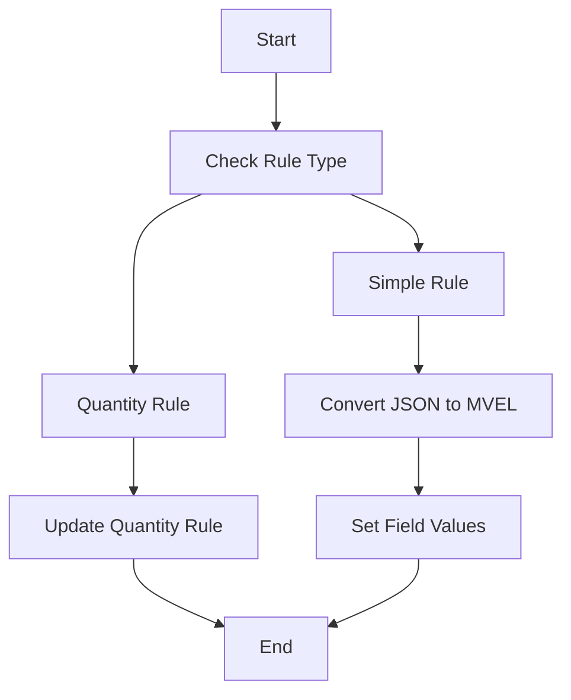

This document will cover the process of handling different rule types in the Broadleaf Commerce framework. We'll cover:

1. Overview of Handling Different Rule Types
2. Populating Quantity Rules
3. Updating Quantity-Based Rules
4. Handling Simple Rules
5. Setting Field Values
6. Converting JSON to MVEL

Technical document: <SwmLink doc-title="Handling Different Rule Types">[Handling Different Rule Types](/.swm/handling-different-rule-types.6phe8gdg.sw.md)</SwmLink>

# [Overview of Handling Different Rule Types](https://app.swimm.io/repos/Z2l0aHViJTNBJTNBQnJvYWRsZWFmQ29tbWVyY2UtZGVtby1uZXclM0ElM0FTd2ltbS1EZW1v/docs/6phe8gdg#handling-different-rule-types)

The process of handling different rule types in Broadleaf Commerce involves determining the type of rule specified in a request and delegating the processing to specific methods. This ensures that rules are correctly processed and updated based on their type, whether they involve quantities or are simple rules.

# [Populating Quantity Rules](https://app.swimm.io/repos/Z2l0aHViJTNBJTNBQnJvYWRsZWFmQ29tbWVyY2UtZGVtby1uZXclM0ElM0FTd2ltbS1EZW1v/docs/6phe8gdg#populating-quantity-rule)

When handling rules that involve quantities, the system retrieves the relevant field and ensures it is annotated with `@OneToMany`. This annotation indicates that the field is a collection of related entities. The system then calls the `updateQuantityRule` method to update the rule based on the provided data. This ensures that quantity-based rules are correctly processed and updated.

# [Updating Quantity-Based Rules](https://app.swimm.io/repos/Z2l0aHViJTNBJTNBQnJvYWRsZWFmQ29tbWVyY2UtZGVtby1uZXclM0ElM0FTd2ltbS1EZW1v/docs/6phe8gdg#updating-quantity-based-rules)

The `updateQuantityRule` method updates quantity-based rules by converting the provided JSON data into a `DataWrapper` object. It then iterates over the data to either update existing rules or create new ones. This ensures that the rules are correctly persisted and handles any necessary extensions. This process is crucial for maintaining accurate and up-to-date rules in the system.

# [Handling Simple Rules](https://app.swimm.io/repos/Z2l0aHViJTNBJTNBQnJvYWRsZWFmQ29tbWVyY2UtZGVtby1uZXclM0ElM0FTd2ltbS1EZW1v/docs/6phe8gdg#handling-simple-rules)

For simple rules, the system begins by checking if the property name contains a map field separator and ensures compatibility with `@OneToMany` annotations. It then converts the JSON rule to MVEL using the `convertSimpleMatchRuleJsonToMvel` method. If the rule is a simple string field, the system sets the field value using the MVEL expression. If the rule does not exist, it initializes the rule and sets the necessary field values, including handling `@OneToMany` relationships.

# [Setting Field Values](https://app.swimm.io/repos/Z2l0aHViJTNBJTNBQnJvYWRsZWFmQ29tbWVyY2UtZGVtby1uZXclM0ElM0FTd2ltbS1EZW1v/docs/6phe8gdg#setting-field-values)

The `setFieldValue` method in `FieldManager` is responsible for setting the value of a field on a given bean. It handles nested fields and map fields by tokenizing the field name and navigating through the object graph. If the field is a map field, it delegates to `handleMapFieldPopulation`. Otherwise, it sets the field value directly, potentially using a `FieldModifierManager` to modify the value before setting it.

# [Converting JSON to MVEL](https://app.swimm.io/repos/Z2l0aHViJTNBJTNBQnJvYWRsZWFmQ29tbWVyY2UtZGVtby1uZXclM0ElM0FTd2ltbS1EZW1v/docs/6phe8gdg#converting-json-to-mvel)

The `convertSimpleMatchRuleJsonToMvel` method is responsible for converting a `DataWrapper` object into an MVEL expression. It ensures that there is only one `DataDTO` in the `DataWrapper` and then calls `convertDTOToMvelString` to perform the conversion. This process is essential for translating JSON rules into a format that can be processed by the system.

&nbsp;

*This is an auto-generated document by Swimm AI 🌊 and has not yet been verified by a human*

<SwmMeta version="3.0.0" repo-id="Z2l0aHViJTNBJTNBQnJvYWRsZWFmQ29tbWVyY2UtZGVtby1uZXclM0ElM0FTd2ltbS1EZW1v" repo-name="BroadleafCommerce-demo-new" doc-type="product-flows">Powered by [Swimm](/)</SwmMeta>
