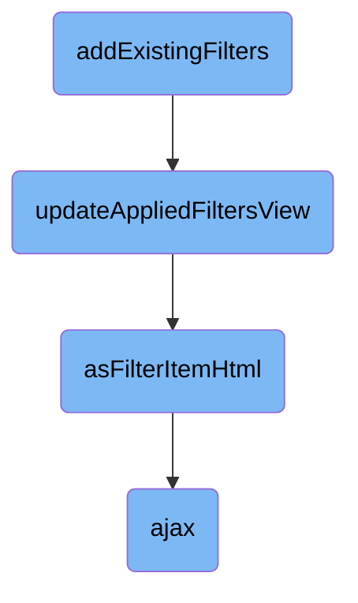

In this document, we will explain the process of handling existing filters in a filter builder component. The process involves checking for existing filters, updating the applied filters view, generating filter item HTML, and making AJAX requests.

The flow starts by checking if there are any existing filters on the page. If there are, it updates the filter builder accordingly. Next, it updates the visual representation of the applied filters by parsing the filter data and appending HTML elements for each filter rule. If no rules are present, it hides the filter wrapper. The HTML for each filter item is generated based on the rule's properties. Finally, AJAX requests are used to fetch data asynchronously, such as retrieving filter options.

# Flow drill down



<SwmSnippet path="/admin/broadleaf-open-admin-platform/src/main/resources/open_admin_style/js/admin/components/filterbuilder.js" line="913">

---

## Handling Existing Filters

The <SwmToken path="admin/broadleaf-open-admin-platform/src/main/resources/open_admin_style/js/admin/components/filterbuilder.js" pos="913:1:1" line-data="        addExistingFilters: function(filterBuilder) {">`addExistingFilters`</SwmToken> function is responsible for checking if there are any existing filters on the page and updating the filter builder accordingly. It retrieves existing filter data, processes each field to check for existing rules, and updates the filter button's state based on the presence of active filters.

```javascript
        addExistingFilters: function(filterBuilder) {
            var hiddenId = filterBuilder.hiddenId;
            // check if there are any existing filters on the page
            var filterData = BLCAdmin.filterBuilders.getEmptyFilterData();
            for (var i=0; i < filterBuilder.fields.length; i++) {
                var field = jQuery.extend({}, filterBuilder.fields[i]);
                if (typeof field.operators === 'string' ) {
                    field.operators = window[field.operators];
                }

                // check for existing rules in the url
                var queryString = BLCAdmin.filterBuilders.getQueryVariable(field.id);
                var ignoreModal = false;
                if (queryString == null) {
                    queryString = BLCAdmin.filterBuilders.getQueryVariableFromStoredField(field.id, hiddenId);
                    var ignoreModal = true;
                }
                // make sure its not modal
                var modal = BLCAdmin.currentModal();

                if ((queryString != null) && (ignoreModal || modal == undefined)) {
```

---

</SwmSnippet>

<SwmSnippet path="/admin/broadleaf-open-admin-platform/src/main/resources/open_admin_style/js/admin/components/filterbuilder.js" line="995">

---

## Updating the Applied Filters View

The <SwmToken path="admin/broadleaf-open-admin-platform/src/main/resources/open_admin_style/js/admin/components/filterbuilder.js" pos="995:1:1" line-data="        updateAppliedFiltersView: function(filterBuilder) {">`updateAppliedFiltersView`</SwmToken> function updates the visual representation of the applied filters. It parses the filter data, clears the current filter container, and appends HTML elements representing each filter rule. If no rules are present, it hides the filter wrapper.

```javascript
        updateAppliedFiltersView: function(filterBuilder) {
            var $container = $("#filter-pillow-container-" + filterBuilder.hiddenId);
            var $wrapper = $container.closest('.filter-pillow-wrapper');

            if (!$container.length || !$wrapper.length) {
                return;
            }

            var json = JSON.parse($("#" + filterBuilder.hiddenId).val());
            var rules = json && json.data && json.data[0] && json.data[0].rules ? json.data[0].rules : [];

            $container.html('');

            if (!rules.length) {
                $wrapper.hide();
                return;
            }

            for (var i = 0; i < rules.length; i++) {
                $container.append(asFilterItemHtml(filterBuilder, rules[i]));
            }
```

---

</SwmSnippet>

<SwmSnippet path="/admin/broadleaf-open-admin-platform/src/main/resources/open_admin_style/js/admin/components/filterbuilder.js" line="1019">

---

### Generating Filter Item HTML

The <SwmToken path="admin/broadleaf-open-admin-platform/src/main/resources/open_admin_style/js/admin/components/filterbuilder.js" pos="1019:3:3" line-data="            function asFilterItemHtml(filterBuilder, rule) {">`asFilterItemHtml`</SwmToken> function generates the HTML for a single filter item. It constructs the filter item's label, operator, and value based on the rule's properties and returns the HTML string.

```javascript
            function asFilterItemHtml(filterBuilder, rule) {
                var field = filterBuilder.getFieldById(rule.id);
                var label = "<b>" + field.label + "</b>";
                var operator = filterBuilder.builders.length ? filterBuilder.getOperatorLabelByOperatorType(rule.operator) : rule.operator;
                var value = "";

                switch(rule.operator) {
                    case "IS_NULL":
                        break;
                    case "BETWEEN":
                        var arr = Array.isArray(rule.value) ? rule.value : JSON.parse(rule.value);
                        value = "<b>" + arr[0] + " AND " + arr[1] + "</b>";
                        break;
                    case "COLLECTION_IN":
                    case "COLLECTION_NOT_IN":
                        var ruleVal;
                        try{
                            ruleVal = Array.isArray(rule.value) ? rule.value : JSON.parse(rule.value);
                        } catch (e) {
                            ruleVal = rule.value.slice(1, -1).split(',');
                        }
```

---

</SwmSnippet>

<SwmSnippet path="/common/src/main/resources/common_style/js/BLC.js" line="135">

---

## AJAX Requests

The <SwmToken path="common/src/main/resources/common_style/js/BLC.js" pos="135:3:3" line-data="    function ajax(options, callback) {">`ajax`</SwmToken> function is a utility for making AJAX requests. It sets default options, appends necessary parameters like CSRF tokens, and handles the success and error callbacks. This function is used to fetch data asynchronously, such as retrieving filter options.

```javascript
    function ajax(options, callback) {
        if (options.type == null) {
            options.type = 'GET';
        }

        var baseUrl = window.location.href;
        if (baseUrl.indexOf('isPostAdd') != -1) {
            if (options.url.indexOf('isPostAdd') < 0) {
                if (options.url.indexOf('?') > 0) {
                    options.url += "&";
                } else {
                    options.url += "?";
                }
                options.url += "isPostAdd=true";
            }
        }
        var savedCatalogElement = $('input[name ="catalogEntityCatalogDiscriminatorId"]');
        var savedCatalog=null;

        if(savedCatalogElement.length){
            //0 should be the one we need, other can be from the modal form
```

---

</SwmSnippet>

&nbsp;

*This is an auto-generated document by Swimm AI 🌊 and has not yet been verified by a human*

<SwmMeta version="3.0.0" repo-id="Z2l0aHViJTNBJTNBQnJvYWRsZWFmQ29tbWVyY2UtZGVtby1uZXclM0ElM0FTd2ltbS1EZW1v" repo-name="BroadleafCommerce-demo-new" doc-type="flows"><sup>Powered by [Swimm](/)</sup></SwmMeta>
