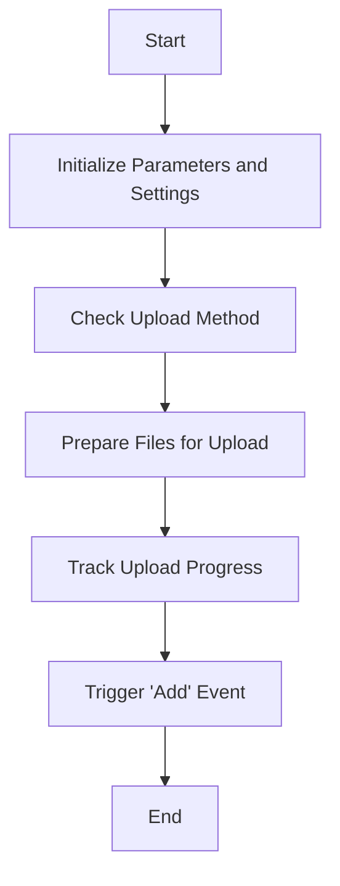

This document will cover the process of handling file addition in the Broadleaf Commerce platform. We'll cover:

1. Initializing parameters and settings
2. Checking upload method
3. Preparing files for upload
4. Tracking upload progress
5. Triggering the 'add' event

Technical document: <SwmLink doc-title="Handling File Addition">[Handling File Addition](/.swm/handling-file-addition.gldbcuz6.sw.md)</SwmLink>

# [Initializing Parameters and Settings](https://app.swimm.io/repos/Z2l0aHViJTNBJTNBQnJvYWRsZWFmQ29tbWVyY2UtZGVtby1uZXclM0ElM0FTd2ltbS1EZW1v/docs/gldbcuz6#_onadd)

When a file is added for upload, the system first initializes necessary parameters and settings. This includes extending the default options with any data provided by the user and determining the parameter names for the file input elements. This step ensures that all required settings are in place before proceeding with the upload.

# [Checking Upload Method](https://app.swimm.io/repos/Z2l0aHViJTNBJTNBQnJvYWRsZWFmQ29tbWVyY2UtZGVtby1uZXclM0ElM0FTd2ltbS1EZW1v/docs/gldbcuz6#_isxhrupload)

The system checks if the file can be uploaded using the XMLHttpRequest (XHR) method. This is important because XHR allows for more efficient and flexible file uploads compared to traditional form submissions. If XHR is not supported or not preferred, the system will fall back to using an iframe-based upload method.

# [Preparing Files for Upload](https://app.swimm.io/repos/Z2l0aHViJTNBJTNBQnJvYWRsZWFmQ29tbWVyY2UtZGVtby1uZXclM0ElM0FTd2ltbS1EZW1v/docs/gldbcuz6#_getparamname)

The system prepares the files for upload by organizing them into sets based on the upload options. For example, if multiple files are being uploaded and the limit for simultaneous uploads is set, the files are grouped accordingly. This step ensures that the files are ready to be processed and uploaded in an organized manner.

# [Tracking Upload Progress](https://app.swimm.io/repos/Z2l0aHViJTNBJTNBQnJvYWRsZWFmQ29tbWVyY2UtZGVtby1uZXclM0ElM0FTd2ltbS1EZW1v/docs/gldbcuz6#_initprogressobject)

The system sets up progress tracking for the file upload. This involves initializing a progress object that keeps track of the number of bytes loaded, the total number of bytes, and the upload bitrate. This information is used to provide real-time feedback to the user about the status of their upload.

# [Triggering the 'Add' Event](https://app.swimm.io/repos/Z2l0aHViJTNBJTNBQnJvYWRsZWFmQ29tbWVyY2UtZGVtby1uZXclM0ElM0FTd2ltbS1EZW1v/docs/gldbcuz6#_onadd)

Finally, the system triggers the 'add' event to notify that a new file has been added and is ready to be uploaded. This event can be used to execute additional actions or provide feedback to the user, such as updating the user interface to show the newly added file in the upload queue.

&nbsp;

*This is an auto-generated document by Swimm AI 🌊 and has not yet been verified by a human*

<SwmMeta version="3.0.0" repo-id="Z2l0aHViJTNBJTNBQnJvYWRsZWFmQ29tbWVyY2UtZGVtby1uZXclM0ElM0FTd2ltbS1EZW1v" repo-name="BroadleafCommerce-demo-new" doc-type="product-flows">Powered by [Swimm](/)</SwmMeta>
