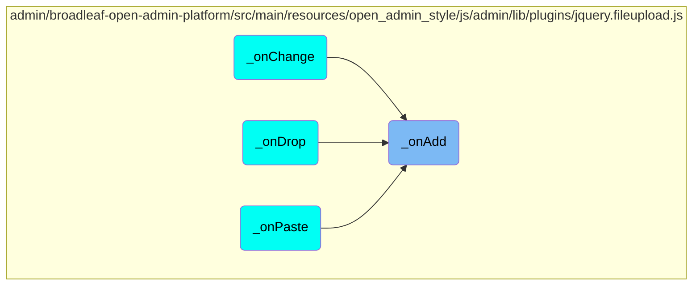

```mermaid
graph TD;
      subgraph admin/broadleaf-open-admin-platform/src/main/resources/open_admin_style/js/admin/lib/plugins
37f64a8e24a048bde5a8bc6cdada6d4dbbb3fffff6abd59e3b211ebfde95fb5b(_addConvenienceMethods):::mainFlowStyle --> 396e0abeb5aecc00eece66dd7d84275ec8ca9ad70dec5326144db1b545d828a7(abort)
end

subgraph admin/broadleaf-open-admin-platform/src/main/resources/open_admin_style/js/admin/lib/plugins
37f64a8e24a048bde5a8bc6cdada6d4dbbb3fffff6abd59e3b211ebfde95fb5b(_addConvenienceMethods):::mainFlowStyle --> d9ca9730109a50613c4f26da2222cc102f0d94313d1651d361d8378605155768(state)
end

subgraph admin/broadleaf-open-admin-platform/src/main/resources/open_admin_style/js/admin/lib/plugins
37f64a8e24a048bde5a8bc6cdada6d4dbbb3fffff6abd59e3b211ebfde95fb5b(_addConvenienceMethods):::mainFlowStyle --> 34befdf5c659d8118871909969d84dab6b08c911de85207578df89915dd47b62(_getXHRPromise)
end

subgraph admin/broadleaf-open-admin-platform/src/main/resources/open_admin_style/js/admin/lib/plugins
37f64a8e24a048bde5a8bc6cdada6d4dbbb3fffff6abd59e3b211ebfde95fb5b(_addConvenienceMethods):::mainFlowStyle --> e9fcef7b3adc5b268fbaf498fbe108831e853c519ca457f795a49d11aaf2dff4(_getDeferredState)
end

subgraph admin/broadleaf-open-admin-platform/src/main/resources/open_admin_style/js/admin/lib/plugins
37f64a8e24a048bde5a8bc6cdada6d4dbbb3fffff6abd59e3b211ebfde95fb5b(_addConvenienceMethods):::mainFlowStyle --> d91b58de8bcee409a18d491461925510e05defcb6b7781c3b03f992be8224c5a(_onSend):::mainFlowStyle
end

subgraph admin/broadleaf-open-admin-platform/src/main/resources/open_admin_style/js/admin/lib/plugins
d91b58de8bcee409a18d491461925510e05defcb6b7781c3b03f992be8224c5a(_onSend):::mainFlowStyle --> 4etvh(...)
end

subgraph admin/broadleaf-open-admin-platform/src/main/resources/open_admin_style/js/admin/lib/plugins
e9fcef7b3adc5b268fbaf498fbe108831e853c519ca457f795a49d11aaf2dff4(_getDeferredState) --> d9ca9730109a50613c4f26da2222cc102f0d94313d1651d361d8378605155768(state)
end

subgraph admin/broadleaf-open-admin-platform/src/main/resources/open_admin_style/js/admin/lib/plugins
e9fcef7b3adc5b268fbaf498fbe108831e853c519ca457f795a49d11aaf2dff4(_getDeferredState) --> b2fd5ab343d7f9a6fe6e0bf8163fcf8ab348d439aa07f3205c6a0514edd092b5(widget)
end

subgraph admin/broadleaf-open-admin-platform/src/main/resources/open_admin_style/js/admin/lib/plugins
b2fd5ab343d7f9a6fe6e0bf8163fcf8ab348d439aa07f3205c6a0514edd092b5(widget) --> 79db99c409192b041ef1a5706b6a9e166b69882cd4af7fd165acc49aeebfe166(bridge)
end

subgraph admin/broadleaf-open-admin-platform/src/main/resources/open_admin_style/js/admin/lib/plugins
d9ca9730109a50613c4f26da2222cc102f0d94313d1651d361d8378605155768(state) --> e9fcef7b3adc5b268fbaf498fbe108831e853c519ca457f795a49d11aaf2dff4(_getDeferredState)
end

subgraph admin/broadleaf-open-admin-platform/src/main/resources/open_admin_style/js/admin/lib/plugins
d9ca9730109a50613c4f26da2222cc102f0d94313d1651d361d8378605155768(state) --> b2fd5ab343d7f9a6fe6e0bf8163fcf8ab348d439aa07f3205c6a0514edd092b5(widget)
end

subgraph admin/broadleaf-open-admin-platform/src/main/resources/open_admin_style/js/admin/lib/plugins
34befdf5c659d8118871909969d84dab6b08c911de85207578df89915dd47b62(_getXHRPromise) --> 191c71e8bc6cc4a35f04eb85ca128bec3af7e45c119f72d2f84d41b43d0fc881(_enhancePromise)
end

subgraph admin/broadleaf-open-admin-platform/src/main/resources/open_admin_style/js/admin/lib/plugins
34befdf5c659d8118871909969d84dab6b08c911de85207578df89915dd47b62(_getXHRPromise) --> b2fd5ab343d7f9a6fe6e0bf8163fcf8ab348d439aa07f3205c6a0514edd092b5(widget)
end

subgraph admin/broadleaf-open-admin-platform/src/main/resources/open_admin_style/js/admin/lib/plugins
396e0abeb5aecc00eece66dd7d84275ec8ca9ad70dec5326144db1b545d828a7(abort) --> 34befdf5c659d8118871909969d84dab6b08c911de85207578df89915dd47b62(_getXHRPromise)
end

subgraph admin/broadleaf-open-admin-platform/src/main/resources/open_admin_style/js/admin/lib/plugins
396e0abeb5aecc00eece66dd7d84275ec8ca9ad70dec5326144db1b545d828a7(abort) --> b2fd5ab343d7f9a6fe6e0bf8163fcf8ab348d439aa07f3205c6a0514edd092b5(widget)
end


      classDef mainFlowStyle color:#000000,fill:#7CB9F4
classDef rootsStyle color:#000000,fill:#00FFF4
classDef Style1 color:#000000,fill:#00FFAA
classDef Style2 color:#000000,fill:#FFFF00
classDef Style3 color:#000000,fill:#AA7CB9

%% Swimm:
%% graph TD;
%%       subgraph <SwmPath>[admin/broadleaf-open-admin-platform/src/main/resources/open_admin_style/js/admin/lib/plugins/](admin/broadleaf-open-admin-platform/src/main/resources/open_admin_style/js/admin/lib/plugins/)</SwmPath>
%% 37f64a8e24a048bde5a8bc6cdada6d4dbbb3fffff6abd59e3b211ebfde95fb5b(_addConvenienceMethods):::mainFlowStyle --> 396e0abeb5aecc00eece66dd7d84275ec8ca9ad70dec5326144db1b545d828a7(abort)
%% end
%% 
%% subgraph <SwmPath>[admin/broadleaf-open-admin-platform/src/main/resources/open_admin_style/js/admin/lib/plugins/](admin/broadleaf-open-admin-platform/src/main/resources/open_admin_style/js/admin/lib/plugins/)</SwmPath>
%% 37f64a8e24a048bde5a8bc6cdada6d4dbbb3fffff6abd59e3b211ebfde95fb5b(_addConvenienceMethods):::mainFlowStyle --> d9ca9730109a50613c4f26da2222cc102f0d94313d1651d361d8378605155768(state)
%% end
%% 
%% subgraph <SwmPath>[admin/broadleaf-open-admin-platform/src/main/resources/open_admin_style/js/admin/lib/plugins/](admin/broadleaf-open-admin-platform/src/main/resources/open_admin_style/js/admin/lib/plugins/)</SwmPath>
%% 37f64a8e24a048bde5a8bc6cdada6d4dbbb3fffff6abd59e3b211ebfde95fb5b(_addConvenienceMethods):::mainFlowStyle --> 34befdf5c659d8118871909969d84dab6b08c911de85207578df89915dd47b62(_getXHRPromise)
%% end
%% 
%% subgraph <SwmPath>[admin/broadleaf-open-admin-platform/src/main/resources/open_admin_style/js/admin/lib/plugins/](admin/broadleaf-open-admin-platform/src/main/resources/open_admin_style/js/admin/lib/plugins/)</SwmPath>
%% 37f64a8e24a048bde5a8bc6cdada6d4dbbb3fffff6abd59e3b211ebfde95fb5b(_addConvenienceMethods):::mainFlowStyle --> e9fcef7b3adc5b268fbaf498fbe108831e853c519ca457f795a49d11aaf2dff4(_getDeferredState)
%% end
%% 
%% subgraph <SwmPath>[admin/broadleaf-open-admin-platform/src/main/resources/open_admin_style/js/admin/lib/plugins/](admin/broadleaf-open-admin-platform/src/main/resources/open_admin_style/js/admin/lib/plugins/)</SwmPath>
%% 37f64a8e24a048bde5a8bc6cdada6d4dbbb3fffff6abd59e3b211ebfde95fb5b(_addConvenienceMethods):::mainFlowStyle --> d91b58de8bcee409a18d491461925510e05defcb6b7781c3b03f992be8224c5a(_onSend):::mainFlowStyle
%% end
%% 
%% subgraph <SwmPath>[admin/broadleaf-open-admin-platform/src/main/resources/open_admin_style/js/admin/lib/plugins/](admin/broadleaf-open-admin-platform/src/main/resources/open_admin_style/js/admin/lib/plugins/)</SwmPath>
%% d91b58de8bcee409a18d491461925510e05defcb6b7781c3b03f992be8224c5a(_onSend):::mainFlowStyle --> 4etvh(...)
%% end
%% 
%% subgraph <SwmPath>[admin/broadleaf-open-admin-platform/src/main/resources/open_admin_style/js/admin/lib/plugins/](admin/broadleaf-open-admin-platform/src/main/resources/open_admin_style/js/admin/lib/plugins/)</SwmPath>
%% e9fcef7b3adc5b268fbaf498fbe108831e853c519ca457f795a49d11aaf2dff4(_getDeferredState) --> d9ca9730109a50613c4f26da2222cc102f0d94313d1651d361d8378605155768(state)
%% end
%% 
%% subgraph <SwmPath>[admin/broadleaf-open-admin-platform/src/main/resources/open_admin_style/js/admin/lib/plugins/](admin/broadleaf-open-admin-platform/src/main/resources/open_admin_style/js/admin/lib/plugins/)</SwmPath>
%% e9fcef7b3adc5b268fbaf498fbe108831e853c519ca457f795a49d11aaf2dff4(_getDeferredState) --> b2fd5ab343d7f9a6fe6e0bf8163fcf8ab348d439aa07f3205c6a0514edd092b5(widget)
%% end
%% 
%% subgraph <SwmPath>[admin/broadleaf-open-admin-platform/src/main/resources/open_admin_style/js/admin/lib/plugins/](admin/broadleaf-open-admin-platform/src/main/resources/open_admin_style/js/admin/lib/plugins/)</SwmPath>
%% b2fd5ab343d7f9a6fe6e0bf8163fcf8ab348d439aa07f3205c6a0514edd092b5(widget) --> 79db99c409192b041ef1a5706b6a9e166b69882cd4af7fd165acc49aeebfe166(bridge)
%% end
%% 
%% subgraph <SwmPath>[admin/broadleaf-open-admin-platform/src/main/resources/open_admin_style/js/admin/lib/plugins/](admin/broadleaf-open-admin-platform/src/main/resources/open_admin_style/js/admin/lib/plugins/)</SwmPath>
%% d9ca9730109a50613c4f26da2222cc102f0d94313d1651d361d8378605155768(state) --> e9fcef7b3adc5b268fbaf498fbe108831e853c519ca457f795a49d11aaf2dff4(_getDeferredState)
%% end
%% 
%% subgraph <SwmPath>[admin/broadleaf-open-admin-platform/src/main/resources/open_admin_style/js/admin/lib/plugins/](admin/broadleaf-open-admin-platform/src/main/resources/open_admin_style/js/admin/lib/plugins/)</SwmPath>
%% d9ca9730109a50613c4f26da2222cc102f0d94313d1651d361d8378605155768(state) --> b2fd5ab343d7f9a6fe6e0bf8163fcf8ab348d439aa07f3205c6a0514edd092b5(widget)
%% end
%% 
%% subgraph <SwmPath>[admin/broadleaf-open-admin-platform/src/main/resources/open_admin_style/js/admin/lib/plugins/](admin/broadleaf-open-admin-platform/src/main/resources/open_admin_style/js/admin/lib/plugins/)</SwmPath>
%% 34befdf5c659d8118871909969d84dab6b08c911de85207578df89915dd47b62(_getXHRPromise) --> 191c71e8bc6cc4a35f04eb85ca128bec3af7e45c119f72d2f84d41b43d0fc881(_enhancePromise)
%% end
%% 
%% subgraph <SwmPath>[admin/broadleaf-open-admin-platform/src/main/resources/open_admin_style/js/admin/lib/plugins/](admin/broadleaf-open-admin-platform/src/main/resources/open_admin_style/js/admin/lib/plugins/)</SwmPath>
%% 34befdf5c659d8118871909969d84dab6b08c911de85207578df89915dd47b62(_getXHRPromise) --> b2fd5ab343d7f9a6fe6e0bf8163fcf8ab348d439aa07f3205c6a0514edd092b5(widget)
%% end
%% 
%% subgraph <SwmPath>[admin/broadleaf-open-admin-platform/src/main/resources/open_admin_style/js/admin/lib/plugins/](admin/broadleaf-open-admin-platform/src/main/resources/open_admin_style/js/admin/lib/plugins/)</SwmPath>
%% 396e0abeb5aecc00eece66dd7d84275ec8ca9ad70dec5326144db1b545d828a7(abort) --> 34befdf5c659d8118871909969d84dab6b08c911de85207578df89915dd47b62(_getXHRPromise)
%% end
%% 
%% subgraph <SwmPath>[admin/broadleaf-open-admin-platform/src/main/resources/open_admin_style/js/admin/lib/plugins/](admin/broadleaf-open-admin-platform/src/main/resources/open_admin_style/js/admin/lib/plugins/)</SwmPath>
%% 396e0abeb5aecc00eece66dd7d84275ec8ca9ad70dec5326144db1b545d828a7(abort) --> b2fd5ab343d7f9a6fe6e0bf8163fcf8ab348d439aa07f3205c6a0514edd092b5(widget)
%% end
%% 
%% 
%%       classDef mainFlowStyle color:#000000,fill:#7CB9F4
%% classDef rootsStyle color:#000000,fill:#00FFF4
%% classDef Style1 color:#000000,fill:#00FFAA
%% classDef Style2 color:#000000,fill:#FFFF00
%% classDef Style3 color:#000000,fill:#AA7CB9
```

```mermaid
graph TD;
      subgraph admin/broadleaf-open-admin-platform/src/main/resources/open_admin_style/js/admin/lib/plugins
d91b58de8bcee409a18d491461925510e05defcb6b7781c3b03f992be8224c5a(_onSend):::mainFlowStyle --> 0481ec250854477c03ef35a67399579566c30f1654fb0ef9795824650874976b(_getAJAXSettings)
end

subgraph common/src/main/resources/common_style/js/BLC.js
d91b58de8bcee409a18d491461925510e05defcb6b7781c3b03f992be8224c5a(_onSend):::mainFlowStyle --> 735e8dabf9d808e57e1ae9226d6dc2bbd430d5caf620c06e056b1f2093d3b0a4(ajax)
end

subgraph admin/broadleaf-open-admin-platform/src/main/resources/open_admin_style/js/admin/lib/plugins
d91b58de8bcee409a18d491461925510e05defcb6b7781c3b03f992be8224c5a(_onSend):::mainFlowStyle --> 6a60af39305af908dca88ebffc1fba6ef0d21d7b1ecd37fdc12cabb130658cdc(_onDone)
end

subgraph admin/broadleaf-open-admin-platform/src/main/resources/open_admin_style/js/admin/lib/plugins
d91b58de8bcee409a18d491461925510e05defcb6b7781c3b03f992be8224c5a(_onSend):::mainFlowStyle --> 396e0abeb5aecc00eece66dd7d84275ec8ca9ad70dec5326144db1b545d828a7(abort)
end

subgraph admin/broadleaf-open-admin-platform/src/main/resources/open_admin_style/js/admin/lib/plugins
d91b58de8bcee409a18d491461925510e05defcb6b7781c3b03f992be8224c5a(_onSend):::mainFlowStyle --> 88d0856b4da7feb3c7f870bba8bba8c8c34db19f84c92f95f6dcd533951e5bf1(send):::mainFlowStyle
end

subgraph admin/broadleaf-open-admin-platform/src/main/resources/open_admin_style/js/admin/lib/plugins
88d0856b4da7feb3c7f870bba8bba8c8c34db19f84c92f95f6dcd533951e5bf1(send):::mainFlowStyle --> 4cx7t(...)
end

subgraph admin/broadleaf-open-admin-platform/src/main/resources/open_admin_style/js/admin/lib/plugins
396e0abeb5aecc00eece66dd7d84275ec8ca9ad70dec5326144db1b545d828a7(abort) --> 34befdf5c659d8118871909969d84dab6b08c911de85207578df89915dd47b62(_getXHRPromise)
end

subgraph admin/broadleaf-open-admin-platform/src/main/resources/open_admin_style/js/admin/lib/plugins
396e0abeb5aecc00eece66dd7d84275ec8ca9ad70dec5326144db1b545d828a7(abort) --> b2fd5ab343d7f9a6fe6e0bf8163fcf8ab348d439aa07f3205c6a0514edd092b5(widget)
end

subgraph admin/broadleaf-open-admin-platform/src/main/resources/open_admin_style/js/admin/lib/plugins
b2fd5ab343d7f9a6fe6e0bf8163fcf8ab348d439aa07f3205c6a0514edd092b5(widget) --> 79db99c409192b041ef1a5706b6a9e166b69882cd4af7fd165acc49aeebfe166(bridge)
end

subgraph admin/broadleaf-open-admin-platform/src/main/resources/open_admin_style/js/admin/lib/plugins
34befdf5c659d8118871909969d84dab6b08c911de85207578df89915dd47b62(_getXHRPromise) --> 191c71e8bc6cc4a35f04eb85ca128bec3af7e45c119f72d2f84d41b43d0fc881(_enhancePromise)
end

subgraph admin/broadleaf-open-admin-platform/src/main/resources/open_admin_style/js/admin/lib/plugins
34befdf5c659d8118871909969d84dab6b08c911de85207578df89915dd47b62(_getXHRPromise) --> b2fd5ab343d7f9a6fe6e0bf8163fcf8ab348d439aa07f3205c6a0514edd092b5(widget)
end

subgraph admin/broadleaf-open-admin-platform/src/main/resources/open_admin_style/js/admin/lib/plugins
6a60af39305af908dca88ebffc1fba6ef0d21d7b1ecd37fdc12cabb130658cdc(_onDone) --> c7f00a099cdd5a7db9322c0fc169c93838d99089da97416993a94330b106650e(_onProgress)
end

subgraph admin/broadleaf-open-admin-platform/src/main/resources/open_admin_style/js/admin/lib/plugins
6a60af39305af908dca88ebffc1fba6ef0d21d7b1ecd37fdc12cabb130658cdc(_onDone) --> b2fd5ab343d7f9a6fe6e0bf8163fcf8ab348d439aa07f3205c6a0514edd092b5(widget)
end

subgraph admin/broadleaf-open-admin-platform/src/main/resources/open_admin_style/js/admin/lib/plugins
c7f00a099cdd5a7db9322c0fc169c93838d99089da97416993a94330b106650e(_onProgress) --> e87b8045ba9f3807d16ff7bb7f29cf28880f4df727ff9f9c3b978ad07131c634(getBitrate)
end

subgraph admin/broadleaf-open-admin-platform/src/main/resources/open_admin_style/js/admin/lib/plugins
c7f00a099cdd5a7db9322c0fc169c93838d99089da97416993a94330b106650e(_onProgress) --> b2fd5ab343d7f9a6fe6e0bf8163fcf8ab348d439aa07f3205c6a0514edd092b5(widget)
end

subgraph admin/broadleaf-open-admin-platform/src/main/resources/open_admin_style/js/admin/blc-admin-init.js
735e8dabf9d808e57e1ae9226d6dc2bbd430d5caf620c06e056b1f2093d3b0a4(ajax) --> 27904be92202cd2eff089cef66b59791d02cebd758830360ad926dbf64c85e2d(callback)
end

subgraph admin/broadleaf-open-admin-platform/src/main/resources/open_admin_style/js/admin/lib/plugins
0481ec250854477c03ef35a67399579566c30f1654fb0ef9795824650874976b(_getAJAXSettings) --> 502154e4acc065b2f27781e16210c062db21cbed122a2d812061327261766b17(_initDataSettings)
end

subgraph admin/broadleaf-open-admin-platform/src/main/resources/open_admin_style/js/admin/lib/plugins
0481ec250854477c03ef35a67399579566c30f1654fb0ef9795824650874976b(_getAJAXSettings) --> d1f48192a8dc5e6413e6b11b68a3163cf433e6820eeec0cd43d4b3b8009b9f8b(_initFormSettings)
end

subgraph admin/broadleaf-open-admin-platform/src/main/resources/open_admin_style/js/admin/lib/plugins
0481ec250854477c03ef35a67399579566c30f1654fb0ef9795824650874976b(_getAJAXSettings) --> b2fd5ab343d7f9a6fe6e0bf8163fcf8ab348d439aa07f3205c6a0514edd092b5(widget)
end


      classDef mainFlowStyle color:#000000,fill:#7CB9F4
classDef rootsStyle color:#000000,fill:#00FFF4
classDef Style1 color:#000000,fill:#00FFAA
classDef Style2 color:#000000,fill:#FFFF00
classDef Style3 color:#000000,fill:#AA7CB9

%% Swimm:
%% graph TD;
%%       subgraph <SwmPath>[admin/broadleaf-open-admin-platform/src/main/resources/open_admin_style/js/admin/lib/plugins/](admin/broadleaf-open-admin-platform/src/main/resources/open_admin_style/js/admin/lib/plugins/)</SwmPath>
%% d91b58de8bcee409a18d491461925510e05defcb6b7781c3b03f992be8224c5a(_onSend):::mainFlowStyle --> 0481ec250854477c03ef35a67399579566c30f1654fb0ef9795824650874976b(_getAJAXSettings)
%% end
%% 
%% subgraph <SwmPath>[common/src/main/resources/common_style/js/BLC.js](common/src/main/resources/common_style/js/BLC.js)</SwmPath>
%% d91b58de8bcee409a18d491461925510e05defcb6b7781c3b03f992be8224c5a(_onSend):::mainFlowStyle --> 735e8dabf9d808e57e1ae9226d6dc2bbd430d5caf620c06e056b1f2093d3b0a4(ajax)
%% end
%% 
%% subgraph <SwmPath>[admin/broadleaf-open-admin-platform/src/main/resources/open_admin_style/js/admin/lib/plugins/](admin/broadleaf-open-admin-platform/src/main/resources/open_admin_style/js/admin/lib/plugins/)</SwmPath>
%% d91b58de8bcee409a18d491461925510e05defcb6b7781c3b03f992be8224c5a(_onSend):::mainFlowStyle --> 6a60af39305af908dca88ebffc1fba6ef0d21d7b1ecd37fdc12cabb130658cdc(_onDone)
%% end
%% 
%% subgraph <SwmPath>[admin/broadleaf-open-admin-platform/src/main/resources/open_admin_style/js/admin/lib/plugins/](admin/broadleaf-open-admin-platform/src/main/resources/open_admin_style/js/admin/lib/plugins/)</SwmPath>
%% d91b58de8bcee409a18d491461925510e05defcb6b7781c3b03f992be8224c5a(_onSend):::mainFlowStyle --> 396e0abeb5aecc00eece66dd7d84275ec8ca9ad70dec5326144db1b545d828a7(abort)
%% end
%% 
%% subgraph <SwmPath>[admin/broadleaf-open-admin-platform/src/main/resources/open_admin_style/js/admin/lib/plugins/](admin/broadleaf-open-admin-platform/src/main/resources/open_admin_style/js/admin/lib/plugins/)</SwmPath>
%% d91b58de8bcee409a18d491461925510e05defcb6b7781c3b03f992be8224c5a(_onSend):::mainFlowStyle --> 88d0856b4da7feb3c7f870bba8bba8c8c34db19f84c92f95f6dcd533951e5bf1(send):::mainFlowStyle
%% end
%% 
%% subgraph <SwmPath>[admin/broadleaf-open-admin-platform/src/main/resources/open_admin_style/js/admin/lib/plugins/](admin/broadleaf-open-admin-platform/src/main/resources/open_admin_style/js/admin/lib/plugins/)</SwmPath>
%% 88d0856b4da7feb3c7f870bba8bba8c8c34db19f84c92f95f6dcd533951e5bf1(send):::mainFlowStyle --> 4cx7t(...)
%% end
%% 
%% subgraph <SwmPath>[admin/broadleaf-open-admin-platform/src/main/resources/open_admin_style/js/admin/lib/plugins/](admin/broadleaf-open-admin-platform/src/main/resources/open_admin_style/js/admin/lib/plugins/)</SwmPath>
%% 396e0abeb5aecc00eece66dd7d84275ec8ca9ad70dec5326144db1b545d828a7(abort) --> 34befdf5c659d8118871909969d84dab6b08c911de85207578df89915dd47b62(_getXHRPromise)
%% end
%% 
%% subgraph <SwmPath>[admin/broadleaf-open-admin-platform/src/main/resources/open_admin_style/js/admin/lib/plugins/](admin/broadleaf-open-admin-platform/src/main/resources/open_admin_style/js/admin/lib/plugins/)</SwmPath>
%% 396e0abeb5aecc00eece66dd7d84275ec8ca9ad70dec5326144db1b545d828a7(abort) --> b2fd5ab343d7f9a6fe6e0bf8163fcf8ab348d439aa07f3205c6a0514edd092b5(widget)
%% end
%% 
%% subgraph <SwmPath>[admin/broadleaf-open-admin-platform/src/main/resources/open_admin_style/js/admin/lib/plugins/](admin/broadleaf-open-admin-platform/src/main/resources/open_admin_style/js/admin/lib/plugins/)</SwmPath>
%% b2fd5ab343d7f9a6fe6e0bf8163fcf8ab348d439aa07f3205c6a0514edd092b5(widget) --> 79db99c409192b041ef1a5706b6a9e166b69882cd4af7fd165acc49aeebfe166(bridge)
%% end
%% 
%% subgraph <SwmPath>[admin/broadleaf-open-admin-platform/src/main/resources/open_admin_style/js/admin/lib/plugins/](admin/broadleaf-open-admin-platform/src/main/resources/open_admin_style/js/admin/lib/plugins/)</SwmPath>
%% 34befdf5c659d8118871909969d84dab6b08c911de85207578df89915dd47b62(_getXHRPromise) --> 191c71e8bc6cc4a35f04eb85ca128bec3af7e45c119f72d2f84d41b43d0fc881(_enhancePromise)
%% end
%% 
%% subgraph <SwmPath>[admin/broadleaf-open-admin-platform/src/main/resources/open_admin_style/js/admin/lib/plugins/](admin/broadleaf-open-admin-platform/src/main/resources/open_admin_style/js/admin/lib/plugins/)</SwmPath>
%% 34befdf5c659d8118871909969d84dab6b08c911de85207578df89915dd47b62(_getXHRPromise) --> b2fd5ab343d7f9a6fe6e0bf8163fcf8ab348d439aa07f3205c6a0514edd092b5(widget)
%% end
%% 
%% subgraph <SwmPath>[admin/broadleaf-open-admin-platform/src/main/resources/open_admin_style/js/admin/lib/plugins/](admin/broadleaf-open-admin-platform/src/main/resources/open_admin_style/js/admin/lib/plugins/)</SwmPath>
%% 6a60af39305af908dca88ebffc1fba6ef0d21d7b1ecd37fdc12cabb130658cdc(_onDone) --> c7f00a099cdd5a7db9322c0fc169c93838d99089da97416993a94330b106650e(_onProgress)
%% end
%% 
%% subgraph <SwmPath>[admin/broadleaf-open-admin-platform/src/main/resources/open_admin_style/js/admin/lib/plugins/](admin/broadleaf-open-admin-platform/src/main/resources/open_admin_style/js/admin/lib/plugins/)</SwmPath>
%% 6a60af39305af908dca88ebffc1fba6ef0d21d7b1ecd37fdc12cabb130658cdc(_onDone) --> b2fd5ab343d7f9a6fe6e0bf8163fcf8ab348d439aa07f3205c6a0514edd092b5(widget)
%% end
%% 
%% subgraph <SwmPath>[admin/broadleaf-open-admin-platform/src/main/resources/open_admin_style/js/admin/lib/plugins/](admin/broadleaf-open-admin-platform/src/main/resources/open_admin_style/js/admin/lib/plugins/)</SwmPath>
%% c7f00a099cdd5a7db9322c0fc169c93838d99089da97416993a94330b106650e(_onProgress) --> e87b8045ba9f3807d16ff7bb7f29cf28880f4df727ff9f9c3b978ad07131c634(getBitrate)
%% end
%% 
%% subgraph <SwmPath>[admin/broadleaf-open-admin-platform/src/main/resources/open_admin_style/js/admin/lib/plugins/](admin/broadleaf-open-admin-platform/src/main/resources/open_admin_style/js/admin/lib/plugins/)</SwmPath>
%% c7f00a099cdd5a7db9322c0fc169c93838d99089da97416993a94330b106650e(_onProgress) --> b2fd5ab343d7f9a6fe6e0bf8163fcf8ab348d439aa07f3205c6a0514edd092b5(widget)
%% end
%% 
%% subgraph <SwmPath>[admin/broadleaf-open-admin-platform/src/main/resources/open_admin_style/js/admin/blc-admin-init.js](admin/broadleaf-open-admin-platform/src/main/resources/open_admin_style/js/admin/blc-admin-init.js)</SwmPath>
%% 735e8dabf9d808e57e1ae9226d6dc2bbd430d5caf620c06e056b1f2093d3b0a4(ajax) --> 27904be92202cd2eff089cef66b59791d02cebd758830360ad926dbf64c85e2d(callback)
%% end
%% 
%% subgraph <SwmPath>[admin/broadleaf-open-admin-platform/src/main/resources/open_admin_style/js/admin/lib/plugins/](admin/broadleaf-open-admin-platform/src/main/resources/open_admin_style/js/admin/lib/plugins/)</SwmPath>
%% 0481ec250854477c03ef35a67399579566c30f1654fb0ef9795824650874976b(_getAJAXSettings) --> 502154e4acc065b2f27781e16210c062db21cbed122a2d812061327261766b17(_initDataSettings)
%% end
%% 
%% subgraph <SwmPath>[admin/broadleaf-open-admin-platform/src/main/resources/open_admin_style/js/admin/lib/plugins/](admin/broadleaf-open-admin-platform/src/main/resources/open_admin_style/js/admin/lib/plugins/)</SwmPath>
%% 0481ec250854477c03ef35a67399579566c30f1654fb0ef9795824650874976b(_getAJAXSettings) --> d1f48192a8dc5e6413e6b11b68a3163cf433e6820eeec0cd43d4b3b8009b9f8b(_initFormSettings)
%% end
%% 
%% subgraph <SwmPath>[admin/broadleaf-open-admin-platform/src/main/resources/open_admin_style/js/admin/lib/plugins/](admin/broadleaf-open-admin-platform/src/main/resources/open_admin_style/js/admin/lib/plugins/)</SwmPath>
%% 0481ec250854477c03ef35a67399579566c30f1654fb0ef9795824650874976b(_getAJAXSettings) --> b2fd5ab343d7f9a6fe6e0bf8163fcf8ab348d439aa07f3205c6a0514edd092b5(widget)
%% end
%% 
%% 
%%       classDef mainFlowStyle color:#000000,fill:#7CB9F4
%% classDef rootsStyle color:#000000,fill:#00FFF4
%% classDef Style1 color:#000000,fill:#00FFAA
%% classDef Style2 color:#000000,fill:#FFFF00
%% classDef Style3 color:#000000,fill:#AA7CB9
```

```mermaid
graph TD;
      subgraph common/src/main/resources/common_style/js/BLC.js
88d0856b4da7feb3c7f870bba8bba8c8c34db19f84c92f95f6dcd533951e5bf1(send):::mainFlowStyle --> 735e8dabf9d808e57e1ae9226d6dc2bbd430d5caf620c06e056b1f2093d3b0a4(ajax)
end

subgraph admin/broadleaf-open-admin-platform/src/main/resources/open_admin_style/js/admin/lib/plugins
88d0856b4da7feb3c7f870bba8bba8c8c34db19f84c92f95f6dcd533951e5bf1(send):::mainFlowStyle --> 6a60af39305af908dca88ebffc1fba6ef0d21d7b1ecd37fdc12cabb130658cdc(_onDone)
end

subgraph admin/broadleaf-open-admin-platform/src/main/resources/open_admin_style/js/admin/lib/plugins
88d0856b4da7feb3c7f870bba8bba8c8c34db19f84c92f95f6dcd533951e5bf1(send):::mainFlowStyle --> 34befdf5c659d8118871909969d84dab6b08c911de85207578df89915dd47b62(_getXHRPromise)
end

subgraph admin/broadleaf-open-admin-platform/src/main/resources/open_admin_style/js/admin/lib/plugins
88d0856b4da7feb3c7f870bba8bba8c8c34db19f84c92f95f6dcd533951e5bf1(send):::mainFlowStyle --> 69cb61757a824ddd534cc7f95bb25752d2052a86cf418da94a4545516f9eec22(_onFail)
end

subgraph admin/broadleaf-open-admin-platform/src/main/resources/open_admin_style/js/admin/lib/plugins
88d0856b4da7feb3c7f870bba8bba8c8c34db19f84c92f95f6dcd533951e5bf1(send):::mainFlowStyle --> 58923a25f701069f5acd2d5c89e72cfe3b17759560b40c4ec9a4f4c0733ce1f7(_chunkedUpload):::mainFlowStyle
end

subgraph admin/broadleaf-open-admin-platform/src/main/resources/open_admin_style/js/admin/lib/plugins
58923a25f701069f5acd2d5c89e72cfe3b17759560b40c4ec9a4f4c0733ce1f7(_chunkedUpload):::mainFlowStyle --> h0268(...)
end

subgraph admin/broadleaf-open-admin-platform/src/main/resources/open_admin_style/js/admin/lib/plugins
69cb61757a824ddd534cc7f95bb25752d2052a86cf418da94a4545516f9eec22(_onFail) --> b2fd5ab343d7f9a6fe6e0bf8163fcf8ab348d439aa07f3205c6a0514edd092b5(widget)
end

subgraph admin/broadleaf-open-admin-platform/src/main/resources/open_admin_style/js/admin/lib/plugins
b2fd5ab343d7f9a6fe6e0bf8163fcf8ab348d439aa07f3205c6a0514edd092b5(widget) --> 79db99c409192b041ef1a5706b6a9e166b69882cd4af7fd165acc49aeebfe166(bridge)
end

subgraph admin/broadleaf-open-admin-platform/src/main/resources/open_admin_style/js/admin/lib/plugins
34befdf5c659d8118871909969d84dab6b08c911de85207578df89915dd47b62(_getXHRPromise) --> 191c71e8bc6cc4a35f04eb85ca128bec3af7e45c119f72d2f84d41b43d0fc881(_enhancePromise)
end

subgraph admin/broadleaf-open-admin-platform/src/main/resources/open_admin_style/js/admin/lib/plugins
34befdf5c659d8118871909969d84dab6b08c911de85207578df89915dd47b62(_getXHRPromise) --> b2fd5ab343d7f9a6fe6e0bf8163fcf8ab348d439aa07f3205c6a0514edd092b5(widget)
end

subgraph admin/broadleaf-open-admin-platform/src/main/resources/open_admin_style/js/admin/lib/plugins
6a60af39305af908dca88ebffc1fba6ef0d21d7b1ecd37fdc12cabb130658cdc(_onDone) --> c7f00a099cdd5a7db9322c0fc169c93838d99089da97416993a94330b106650e(_onProgress)
end

subgraph admin/broadleaf-open-admin-platform/src/main/resources/open_admin_style/js/admin/lib/plugins
6a60af39305af908dca88ebffc1fba6ef0d21d7b1ecd37fdc12cabb130658cdc(_onDone) --> b2fd5ab343d7f9a6fe6e0bf8163fcf8ab348d439aa07f3205c6a0514edd092b5(widget)
end

subgraph admin/broadleaf-open-admin-platform/src/main/resources/open_admin_style/js/admin/lib/plugins
c7f00a099cdd5a7db9322c0fc169c93838d99089da97416993a94330b106650e(_onProgress) --> e87b8045ba9f3807d16ff7bb7f29cf28880f4df727ff9f9c3b978ad07131c634(getBitrate)
end

subgraph admin/broadleaf-open-admin-platform/src/main/resources/open_admin_style/js/admin/lib/plugins
c7f00a099cdd5a7db9322c0fc169c93838d99089da97416993a94330b106650e(_onProgress) --> b2fd5ab343d7f9a6fe6e0bf8163fcf8ab348d439aa07f3205c6a0514edd092b5(widget)
end

subgraph admin/broadleaf-open-admin-platform/src/main/resources/open_admin_style/js/admin/blc-admin-init.js
735e8dabf9d808e57e1ae9226d6dc2bbd430d5caf620c06e056b1f2093d3b0a4(ajax) --> 27904be92202cd2eff089cef66b59791d02cebd758830360ad926dbf64c85e2d(callback)
end


      classDef mainFlowStyle color:#000000,fill:#7CB9F4
classDef rootsStyle color:#000000,fill:#00FFF4
classDef Style1 color:#000000,fill:#00FFAA
classDef Style2 color:#000000,fill:#FFFF00
classDef Style3 color:#000000,fill:#AA7CB9

%% Swimm:
%% graph TD;
%%       subgraph <SwmPath>[common/src/main/resources/common_style/js/BLC.js](common/src/main/resources/common_style/js/BLC.js)</SwmPath>
%% 88d0856b4da7feb3c7f870bba8bba8c8c34db19f84c92f95f6dcd533951e5bf1(send):::mainFlowStyle --> 735e8dabf9d808e57e1ae9226d6dc2bbd430d5caf620c06e056b1f2093d3b0a4(ajax)
%% end
%% 
%% subgraph <SwmPath>[admin/broadleaf-open-admin-platform/src/main/resources/open_admin_style/js/admin/lib/plugins/](admin/broadleaf-open-admin-platform/src/main/resources/open_admin_style/js/admin/lib/plugins/)</SwmPath>
%% 88d0856b4da7feb3c7f870bba8bba8c8c34db19f84c92f95f6dcd533951e5bf1(send):::mainFlowStyle --> 6a60af39305af908dca88ebffc1fba6ef0d21d7b1ecd37fdc12cabb130658cdc(_onDone)
%% end
%% 
%% subgraph <SwmPath>[admin/broadleaf-open-admin-platform/src/main/resources/open_admin_style/js/admin/lib/plugins/](admin/broadleaf-open-admin-platform/src/main/resources/open_admin_style/js/admin/lib/plugins/)</SwmPath>
%% 88d0856b4da7feb3c7f870bba8bba8c8c34db19f84c92f95f6dcd533951e5bf1(send):::mainFlowStyle --> 34befdf5c659d8118871909969d84dab6b08c911de85207578df89915dd47b62(_getXHRPromise)
%% end
%% 
%% subgraph <SwmPath>[admin/broadleaf-open-admin-platform/src/main/resources/open_admin_style/js/admin/lib/plugins/](admin/broadleaf-open-admin-platform/src/main/resources/open_admin_style/js/admin/lib/plugins/)</SwmPath>
%% 88d0856b4da7feb3c7f870bba8bba8c8c34db19f84c92f95f6dcd533951e5bf1(send):::mainFlowStyle --> 69cb61757a824ddd534cc7f95bb25752d2052a86cf418da94a4545516f9eec22(_onFail)
%% end
%% 
%% subgraph <SwmPath>[admin/broadleaf-open-admin-platform/src/main/resources/open_admin_style/js/admin/lib/plugins/](admin/broadleaf-open-admin-platform/src/main/resources/open_admin_style/js/admin/lib/plugins/)</SwmPath>
%% 88d0856b4da7feb3c7f870bba8bba8c8c34db19f84c92f95f6dcd533951e5bf1(send):::mainFlowStyle --> 58923a25f701069f5acd2d5c89e72cfe3b17759560b40c4ec9a4f4c0733ce1f7(_chunkedUpload):::mainFlowStyle
%% end
%% 
%% subgraph <SwmPath>[admin/broadleaf-open-admin-platform/src/main/resources/open_admin_style/js/admin/lib/plugins/](admin/broadleaf-open-admin-platform/src/main/resources/open_admin_style/js/admin/lib/plugins/)</SwmPath>
%% 58923a25f701069f5acd2d5c89e72cfe3b17759560b40c4ec9a4f4c0733ce1f7(_chunkedUpload):::mainFlowStyle --> h0268(...)
%% end
%% 
%% subgraph <SwmPath>[admin/broadleaf-open-admin-platform/src/main/resources/open_admin_style/js/admin/lib/plugins/](admin/broadleaf-open-admin-platform/src/main/resources/open_admin_style/js/admin/lib/plugins/)</SwmPath>
%% 69cb61757a824ddd534cc7f95bb25752d2052a86cf418da94a4545516f9eec22(_onFail) --> b2fd5ab343d7f9a6fe6e0bf8163fcf8ab348d439aa07f3205c6a0514edd092b5(widget)
%% end
%% 
%% subgraph <SwmPath>[admin/broadleaf-open-admin-platform/src/main/resources/open_admin_style/js/admin/lib/plugins/](admin/broadleaf-open-admin-platform/src/main/resources/open_admin_style/js/admin/lib/plugins/)</SwmPath>
%% b2fd5ab343d7f9a6fe6e0bf8163fcf8ab348d439aa07f3205c6a0514edd092b5(widget) --> 79db99c409192b041ef1a5706b6a9e166b69882cd4af7fd165acc49aeebfe166(bridge)
%% end
%% 
%% subgraph <SwmPath>[admin/broadleaf-open-admin-platform/src/main/resources/open_admin_style/js/admin/lib/plugins/](admin/broadleaf-open-admin-platform/src/main/resources/open_admin_style/js/admin/lib/plugins/)</SwmPath>
%% 34befdf5c659d8118871909969d84dab6b08c911de85207578df89915dd47b62(_getXHRPromise) --> 191c71e8bc6cc4a35f04eb85ca128bec3af7e45c119f72d2f84d41b43d0fc881(_enhancePromise)
%% end
%% 
%% subgraph <SwmPath>[admin/broadleaf-open-admin-platform/src/main/resources/open_admin_style/js/admin/lib/plugins/](admin/broadleaf-open-admin-platform/src/main/resources/open_admin_style/js/admin/lib/plugins/)</SwmPath>
%% 34befdf5c659d8118871909969d84dab6b08c911de85207578df89915dd47b62(_getXHRPromise) --> b2fd5ab343d7f9a6fe6e0bf8163fcf8ab348d439aa07f3205c6a0514edd092b5(widget)
%% end
%% 
%% subgraph <SwmPath>[admin/broadleaf-open-admin-platform/src/main/resources/open_admin_style/js/admin/lib/plugins/](admin/broadleaf-open-admin-platform/src/main/resources/open_admin_style/js/admin/lib/plugins/)</SwmPath>
%% 6a60af39305af908dca88ebffc1fba6ef0d21d7b1ecd37fdc12cabb130658cdc(_onDone) --> c7f00a099cdd5a7db9322c0fc169c93838d99089da97416993a94330b106650e(_onProgress)
%% end
%% 
%% subgraph <SwmPath>[admin/broadleaf-open-admin-platform/src/main/resources/open_admin_style/js/admin/lib/plugins/](admin/broadleaf-open-admin-platform/src/main/resources/open_admin_style/js/admin/lib/plugins/)</SwmPath>
%% 6a60af39305af908dca88ebffc1fba6ef0d21d7b1ecd37fdc12cabb130658cdc(_onDone) --> b2fd5ab343d7f9a6fe6e0bf8163fcf8ab348d439aa07f3205c6a0514edd092b5(widget)
%% end
%% 
%% subgraph <SwmPath>[admin/broadleaf-open-admin-platform/src/main/resources/open_admin_style/js/admin/lib/plugins/](admin/broadleaf-open-admin-platform/src/main/resources/open_admin_style/js/admin/lib/plugins/)</SwmPath>
%% c7f00a099cdd5a7db9322c0fc169c93838d99089da97416993a94330b106650e(_onProgress) --> e87b8045ba9f3807d16ff7bb7f29cf28880f4df727ff9f9c3b978ad07131c634(getBitrate)
%% end
%% 
%% subgraph <SwmPath>[admin/broadleaf-open-admin-platform/src/main/resources/open_admin_style/js/admin/lib/plugins/](admin/broadleaf-open-admin-platform/src/main/resources/open_admin_style/js/admin/lib/plugins/)</SwmPath>
%% c7f00a099cdd5a7db9322c0fc169c93838d99089da97416993a94330b106650e(_onProgress) --> b2fd5ab343d7f9a6fe6e0bf8163fcf8ab348d439aa07f3205c6a0514edd092b5(widget)
%% end
%% 
%% subgraph <SwmPath>[admin/broadleaf-open-admin-platform/src/main/resources/open_admin_style/js/admin/blc-admin-init.js](admin/broadleaf-open-admin-platform/src/main/resources/open_admin_style/js/admin/blc-admin-init.js)</SwmPath>
%% 735e8dabf9d808e57e1ae9226d6dc2bbd430d5caf620c06e056b1f2093d3b0a4(ajax) --> 27904be92202cd2eff089cef66b59791d02cebd758830360ad926dbf64c85e2d(callback)
%% end
%% 
%% 
%%       classDef mainFlowStyle color:#000000,fill:#7CB9F4
%% classDef rootsStyle color:#000000,fill:#00FFF4
%% classDef Style1 color:#000000,fill:#00FFAA
%% classDef Style2 color:#000000,fill:#FFFF00
%% classDef Style3 color:#000000,fill:#AA7CB9
```

```mermaid
graph TD;
      subgraph common/src/main/resources/common_style/js/BLC.js
58923a25f701069f5acd2d5c89e72cfe3b17759560b40c4ec9a4f4c0733ce1f7(_chunkedUpload):::mainFlowStyle --> 735e8dabf9d808e57e1ae9226d6dc2bbd430d5caf620c06e056b1f2093d3b0a4(ajax)
end

subgraph admin/broadleaf-open-admin-platform/src/main/resources/open_admin_style/js/admin/lib/plugins
58923a25f701069f5acd2d5c89e72cfe3b17759560b40c4ec9a4f4c0733ce1f7(_chunkedUpload):::mainFlowStyle --> 8bcbe14979dc078e72ed56ba056f42c1d95404cb14539ffc3c506ce3d703a4cf(_initProgressListener)
end

subgraph admin/broadleaf-open-admin-platform/src/main/resources/open_admin_style/js/admin/lib/plugins
58923a25f701069f5acd2d5c89e72cfe3b17759560b40c4ec9a4f4c0733ce1f7(_chunkedUpload):::mainFlowStyle --> e7f8de3fb9aed22e57a85e73d541e58e357612f382a02f99e43c8e4b855f67fd(_initXHRData)
end

subgraph admin/broadleaf-open-admin-platform/src/main/resources/open_admin_style/js/admin/lib/plugins
58923a25f701069f5acd2d5c89e72cfe3b17759560b40c4ec9a4f4c0733ce1f7(_chunkedUpload):::mainFlowStyle --> 396e0abeb5aecc00eece66dd7d84275ec8ca9ad70dec5326144db1b545d828a7(abort)
end

subgraph admin/broadleaf-open-admin-platform/src/main/resources/open_admin_style/js/admin/lib/plugins
58923a25f701069f5acd2d5c89e72cfe3b17759560b40c4ec9a4f4c0733ce1f7(_chunkedUpload):::mainFlowStyle --> 0deeaa034b1681b5a29ba03b362330aa439f50f2556f2b717027e32d57eda554(upload):::mainFlowStyle
end

subgraph admin/broadleaf-open-admin-platform/src/main/resources/open_admin_style/js/admin/lib/plugins
0deeaa034b1681b5a29ba03b362330aa439f50f2556f2b717027e32d57eda554(upload):::mainFlowStyle --> gip1c(...)
end

subgraph admin/broadleaf-open-admin-platform/src/main/resources/open_admin_style/js/admin/lib/plugins
396e0abeb5aecc00eece66dd7d84275ec8ca9ad70dec5326144db1b545d828a7(abort) --> 34befdf5c659d8118871909969d84dab6b08c911de85207578df89915dd47b62(_getXHRPromise)
end

subgraph admin/broadleaf-open-admin-platform/src/main/resources/open_admin_style/js/admin/lib/plugins
396e0abeb5aecc00eece66dd7d84275ec8ca9ad70dec5326144db1b545d828a7(abort) --> b2fd5ab343d7f9a6fe6e0bf8163fcf8ab348d439aa07f3205c6a0514edd092b5(widget)
end

subgraph admin/broadleaf-open-admin-platform/src/main/resources/open_admin_style/js/admin/lib/plugins
b2fd5ab343d7f9a6fe6e0bf8163fcf8ab348d439aa07f3205c6a0514edd092b5(widget) --> 79db99c409192b041ef1a5706b6a9e166b69882cd4af7fd165acc49aeebfe166(bridge)
end

subgraph admin/broadleaf-open-admin-platform/src/main/resources/open_admin_style/js/admin/lib/plugins
34befdf5c659d8118871909969d84dab6b08c911de85207578df89915dd47b62(_getXHRPromise) --> 191c71e8bc6cc4a35f04eb85ca128bec3af7e45c119f72d2f84d41b43d0fc881(_enhancePromise)
end

subgraph admin/broadleaf-open-admin-platform/src/main/resources/open_admin_style/js/admin/lib/plugins
34befdf5c659d8118871909969d84dab6b08c911de85207578df89915dd47b62(_getXHRPromise) --> b2fd5ab343d7f9a6fe6e0bf8163fcf8ab348d439aa07f3205c6a0514edd092b5(widget)
end

subgraph admin/broadleaf-open-admin-platform/src/main/resources/open_admin_style/js/admin/lib/plugins
e7f8de3fb9aed22e57a85e73d541e58e357612f382a02f99e43c8e4b855f67fd(_initXHRData) --> d389974a6afce3951d8aadf55b47c931a162ffa6987446f56b2c8cbc904ef178(_getFormData)
end

subgraph admin/broadleaf-open-admin-platform/src/main/resources/open_admin_style/js/admin/lib/plugins
e7f8de3fb9aed22e57a85e73d541e58e357612f382a02f99e43c8e4b855f67fd(_initXHRData) --> b2fd5ab343d7f9a6fe6e0bf8163fcf8ab348d439aa07f3205c6a0514edd092b5(widget)
end

subgraph admin/broadleaf-open-admin-platform/src/main/resources/open_admin_style/js/admin/lib/plugins
8bcbe14979dc078e72ed56ba056f42c1d95404cb14539ffc3c506ce3d703a4cf(_initProgressListener) --> c7f00a099cdd5a7db9322c0fc169c93838d99089da97416993a94330b106650e(_onProgress)
end

subgraph admin/broadleaf-open-admin-platform/src/main/resources/open_admin_style/js/admin/lib/plugins
8bcbe14979dc078e72ed56ba056f42c1d95404cb14539ffc3c506ce3d703a4cf(_initProgressListener) --> 38ae09716371297518de6b5e49e534972b1540ae98ee6ebc19be1285e64b0acb(xhr)
end

subgraph admin/broadleaf-open-admin-platform/src/main/resources/open_admin_style/js/admin/lib/plugins
8bcbe14979dc078e72ed56ba056f42c1d95404cb14539ffc3c506ce3d703a4cf(_initProgressListener) --> b2fd5ab343d7f9a6fe6e0bf8163fcf8ab348d439aa07f3205c6a0514edd092b5(widget)
end

subgraph admin/broadleaf-open-admin-platform/src/main/resources/open_admin_style/js/admin/lib/plugins
c7f00a099cdd5a7db9322c0fc169c93838d99089da97416993a94330b106650e(_onProgress) --> e87b8045ba9f3807d16ff7bb7f29cf28880f4df727ff9f9c3b978ad07131c634(getBitrate)
end

subgraph admin/broadleaf-open-admin-platform/src/main/resources/open_admin_style/js/admin/lib/plugins
c7f00a099cdd5a7db9322c0fc169c93838d99089da97416993a94330b106650e(_onProgress) --> b2fd5ab343d7f9a6fe6e0bf8163fcf8ab348d439aa07f3205c6a0514edd092b5(widget)
end

subgraph admin/broadleaf-open-admin-platform/src/main/resources/open_admin_style/js/admin/blc-admin-init.js
735e8dabf9d808e57e1ae9226d6dc2bbd430d5caf620c06e056b1f2093d3b0a4(ajax) --> 27904be92202cd2eff089cef66b59791d02cebd758830360ad926dbf64c85e2d(callback)
end


      classDef mainFlowStyle color:#000000,fill:#7CB9F4
classDef rootsStyle color:#000000,fill:#00FFF4
classDef Style1 color:#000000,fill:#00FFAA
classDef Style2 color:#000000,fill:#FFFF00
classDef Style3 color:#000000,fill:#AA7CB9

%% Swimm:
%% graph TD;
%%       subgraph <SwmPath>[common/src/main/resources/common_style/js/BLC.js](common/src/main/resources/common_style/js/BLC.js)</SwmPath>
%% 58923a25f701069f5acd2d5c89e72cfe3b17759560b40c4ec9a4f4c0733ce1f7(_chunkedUpload):::mainFlowStyle --> 735e8dabf9d808e57e1ae9226d6dc2bbd430d5caf620c06e056b1f2093d3b0a4(ajax)
%% end
%% 
%% subgraph <SwmPath>[admin/broadleaf-open-admin-platform/src/main/resources/open_admin_style/js/admin/lib/plugins/](admin/broadleaf-open-admin-platform/src/main/resources/open_admin_style/js/admin/lib/plugins/)</SwmPath>
%% 58923a25f701069f5acd2d5c89e72cfe3b17759560b40c4ec9a4f4c0733ce1f7(_chunkedUpload):::mainFlowStyle --> 8bcbe14979dc078e72ed56ba056f42c1d95404cb14539ffc3c506ce3d703a4cf(_initProgressListener)
%% end
%% 
%% subgraph <SwmPath>[admin/broadleaf-open-admin-platform/src/main/resources/open_admin_style/js/admin/lib/plugins/](admin/broadleaf-open-admin-platform/src/main/resources/open_admin_style/js/admin/lib/plugins/)</SwmPath>
%% 58923a25f701069f5acd2d5c89e72cfe3b17759560b40c4ec9a4f4c0733ce1f7(_chunkedUpload):::mainFlowStyle --> e7f8de3fb9aed22e57a85e73d541e58e357612f382a02f99e43c8e4b855f67fd(_initXHRData)
%% end
%% 
%% subgraph <SwmPath>[admin/broadleaf-open-admin-platform/src/main/resources/open_admin_style/js/admin/lib/plugins/](admin/broadleaf-open-admin-platform/src/main/resources/open_admin_style/js/admin/lib/plugins/)</SwmPath>
%% 58923a25f701069f5acd2d5c89e72cfe3b17759560b40c4ec9a4f4c0733ce1f7(_chunkedUpload):::mainFlowStyle --> 396e0abeb5aecc00eece66dd7d84275ec8ca9ad70dec5326144db1b545d828a7(abort)
%% end
%% 
%% subgraph <SwmPath>[admin/broadleaf-open-admin-platform/src/main/resources/open_admin_style/js/admin/lib/plugins/](admin/broadleaf-open-admin-platform/src/main/resources/open_admin_style/js/admin/lib/plugins/)</SwmPath>
%% 58923a25f701069f5acd2d5c89e72cfe3b17759560b40c4ec9a4f4c0733ce1f7(_chunkedUpload):::mainFlowStyle --> 0deeaa034b1681b5a29ba03b362330aa439f50f2556f2b717027e32d57eda554(upload):::mainFlowStyle
%% end
%% 
%% subgraph <SwmPath>[admin/broadleaf-open-admin-platform/src/main/resources/open_admin_style/js/admin/lib/plugins/](admin/broadleaf-open-admin-platform/src/main/resources/open_admin_style/js/admin/lib/plugins/)</SwmPath>
%% 0deeaa034b1681b5a29ba03b362330aa439f50f2556f2b717027e32d57eda554(upload):::mainFlowStyle --> gip1c(...)
%% end
%% 
%% subgraph <SwmPath>[admin/broadleaf-open-admin-platform/src/main/resources/open_admin_style/js/admin/lib/plugins/](admin/broadleaf-open-admin-platform/src/main/resources/open_admin_style/js/admin/lib/plugins/)</SwmPath>
%% 396e0abeb5aecc00eece66dd7d84275ec8ca9ad70dec5326144db1b545d828a7(abort) --> 34befdf5c659d8118871909969d84dab6b08c911de85207578df89915dd47b62(_getXHRPromise)
%% end
%% 
%% subgraph <SwmPath>[admin/broadleaf-open-admin-platform/src/main/resources/open_admin_style/js/admin/lib/plugins/](admin/broadleaf-open-admin-platform/src/main/resources/open_admin_style/js/admin/lib/plugins/)</SwmPath>
%% 396e0abeb5aecc00eece66dd7d84275ec8ca9ad70dec5326144db1b545d828a7(abort) --> b2fd5ab343d7f9a6fe6e0bf8163fcf8ab348d439aa07f3205c6a0514edd092b5(widget)
%% end
%% 
%% subgraph <SwmPath>[admin/broadleaf-open-admin-platform/src/main/resources/open_admin_style/js/admin/lib/plugins/](admin/broadleaf-open-admin-platform/src/main/resources/open_admin_style/js/admin/lib/plugins/)</SwmPath>
%% b2fd5ab343d7f9a6fe6e0bf8163fcf8ab348d439aa07f3205c6a0514edd092b5(widget) --> 79db99c409192b041ef1a5706b6a9e166b69882cd4af7fd165acc49aeebfe166(bridge)
%% end
%% 
%% subgraph <SwmPath>[admin/broadleaf-open-admin-platform/src/main/resources/open_admin_style/js/admin/lib/plugins/](admin/broadleaf-open-admin-platform/src/main/resources/open_admin_style/js/admin/lib/plugins/)</SwmPath>
%% 34befdf5c659d8118871909969d84dab6b08c911de85207578df89915dd47b62(_getXHRPromise) --> 191c71e8bc6cc4a35f04eb85ca128bec3af7e45c119f72d2f84d41b43d0fc881(_enhancePromise)
%% end
%% 
%% subgraph <SwmPath>[admin/broadleaf-open-admin-platform/src/main/resources/open_admin_style/js/admin/lib/plugins/](admin/broadleaf-open-admin-platform/src/main/resources/open_admin_style/js/admin/lib/plugins/)</SwmPath>
%% 34befdf5c659d8118871909969d84dab6b08c911de85207578df89915dd47b62(_getXHRPromise) --> b2fd5ab343d7f9a6fe6e0bf8163fcf8ab348d439aa07f3205c6a0514edd092b5(widget)
%% end
%% 
%% subgraph <SwmPath>[admin/broadleaf-open-admin-platform/src/main/resources/open_admin_style/js/admin/lib/plugins/](admin/broadleaf-open-admin-platform/src/main/resources/open_admin_style/js/admin/lib/plugins/)</SwmPath>
%% e7f8de3fb9aed22e57a85e73d541e58e357612f382a02f99e43c8e4b855f67fd(_initXHRData) --> d389974a6afce3951d8aadf55b47c931a162ffa6987446f56b2c8cbc904ef178(_getFormData)
%% end
%% 
%% subgraph <SwmPath>[admin/broadleaf-open-admin-platform/src/main/resources/open_admin_style/js/admin/lib/plugins/](admin/broadleaf-open-admin-platform/src/main/resources/open_admin_style/js/admin/lib/plugins/)</SwmPath>
%% e7f8de3fb9aed22e57a85e73d541e58e357612f382a02f99e43c8e4b855f67fd(_initXHRData) --> b2fd5ab343d7f9a6fe6e0bf8163fcf8ab348d439aa07f3205c6a0514edd092b5(widget)
%% end
%% 
%% subgraph <SwmPath>[admin/broadleaf-open-admin-platform/src/main/resources/open_admin_style/js/admin/lib/plugins/](admin/broadleaf-open-admin-platform/src/main/resources/open_admin_style/js/admin/lib/plugins/)</SwmPath>
%% 8bcbe14979dc078e72ed56ba056f42c1d95404cb14539ffc3c506ce3d703a4cf(_initProgressListener) --> c7f00a099cdd5a7db9322c0fc169c93838d99089da97416993a94330b106650e(_onProgress)
%% end
%% 
%% subgraph <SwmPath>[admin/broadleaf-open-admin-platform/src/main/resources/open_admin_style/js/admin/lib/plugins/](admin/broadleaf-open-admin-platform/src/main/resources/open_admin_style/js/admin/lib/plugins/)</SwmPath>
%% 8bcbe14979dc078e72ed56ba056f42c1d95404cb14539ffc3c506ce3d703a4cf(_initProgressListener) --> 38ae09716371297518de6b5e49e534972b1540ae98ee6ebc19be1285e64b0acb(xhr)
%% end
%% 
%% subgraph <SwmPath>[admin/broadleaf-open-admin-platform/src/main/resources/open_admin_style/js/admin/lib/plugins/](admin/broadleaf-open-admin-platform/src/main/resources/open_admin_style/js/admin/lib/plugins/)</SwmPath>
%% 8bcbe14979dc078e72ed56ba056f42c1d95404cb14539ffc3c506ce3d703a4cf(_initProgressListener) --> b2fd5ab343d7f9a6fe6e0bf8163fcf8ab348d439aa07f3205c6a0514edd092b5(widget)
%% end
%% 
%% subgraph <SwmPath>[admin/broadleaf-open-admin-platform/src/main/resources/open_admin_style/js/admin/lib/plugins/](admin/broadleaf-open-admin-platform/src/main/resources/open_admin_style/js/admin/lib/plugins/)</SwmPath>
%% c7f00a099cdd5a7db9322c0fc169c93838d99089da97416993a94330b106650e(_onProgress) --> e87b8045ba9f3807d16ff7bb7f29cf28880f4df727ff9f9c3b978ad07131c634(getBitrate)
%% end
%% 
%% subgraph <SwmPath>[admin/broadleaf-open-admin-platform/src/main/resources/open_admin_style/js/admin/lib/plugins/](admin/broadleaf-open-admin-platform/src/main/resources/open_admin_style/js/admin/lib/plugins/)</SwmPath>
%% c7f00a099cdd5a7db9322c0fc169c93838d99089da97416993a94330b106650e(_onProgress) --> b2fd5ab343d7f9a6fe6e0bf8163fcf8ab348d439aa07f3205c6a0514edd092b5(widget)
%% end
%% 
%% subgraph <SwmPath>[admin/broadleaf-open-admin-platform/src/main/resources/open_admin_style/js/admin/blc-admin-init.js](admin/broadleaf-open-admin-platform/src/main/resources/open_admin_style/js/admin/blc-admin-init.js)</SwmPath>
%% 735e8dabf9d808e57e1ae9226d6dc2bbd430d5caf620c06e056b1f2093d3b0a4(ajax) --> 27904be92202cd2eff089cef66b59791d02cebd758830360ad926dbf64c85e2d(callback)
%% end
%% 
%% 
%%       classDef mainFlowStyle color:#000000,fill:#7CB9F4
%% classDef rootsStyle color:#000000,fill:#00FFF4
%% classDef Style1 color:#000000,fill:#00FFAA
%% classDef Style2 color:#000000,fill:#FFFF00
%% classDef Style3 color:#000000,fill:#AA7CB9
```

```mermaid
graph TD;
      subgraph common/src/main/resources/common_style/js/BLC.js
0deeaa034b1681b5a29ba03b362330aa439f50f2556f2b717027e32d57eda554(upload):::mainFlowStyle --> 735e8dabf9d808e57e1ae9226d6dc2bbd430d5caf620c06e056b1f2093d3b0a4(ajax)
end

subgraph admin/broadleaf-open-admin-platform/src/main/resources/open_admin_style/js/admin/lib/plugins
0deeaa034b1681b5a29ba03b362330aa439f50f2556f2b717027e32d57eda554(upload):::mainFlowStyle --> 8bcbe14979dc078e72ed56ba056f42c1d95404cb14539ffc3c506ce3d703a4cf(_initProgressListener)
end

subgraph admin/broadleaf-open-admin-platform/src/main/resources/open_admin_style/js/admin/lib/plugins
0deeaa034b1681b5a29ba03b362330aa439f50f2556f2b717027e32d57eda554(upload):::mainFlowStyle --> e7f8de3fb9aed22e57a85e73d541e58e357612f382a02f99e43c8e4b855f67fd(_initXHRData)
end

subgraph admin/broadleaf-open-admin-platform/src/main/resources/open_admin_style/js/admin/lib/plugins
0deeaa034b1681b5a29ba03b362330aa439f50f2556f2b717027e32d57eda554(upload):::mainFlowStyle --> c7f00a099cdd5a7db9322c0fc169c93838d99089da97416993a94330b106650e(_onProgress)
end

subgraph admin/broadleaf-open-admin-platform/src/main/resources/open_admin_style/js/admin/lib/plugins
0deeaa034b1681b5a29ba03b362330aa439f50f2556f2b717027e32d57eda554(upload):::mainFlowStyle --> 753c3532b13819ce0a0ac1c4c53dcbf03fc796599e006925194fb2c73926c776(fail):::mainFlowStyle
end

subgraph admin/broadleaf-open-admin-platform/src/main/resources/open_admin_style/js/admin/lib/plugins
753c3532b13819ce0a0ac1c4c53dcbf03fc796599e006925194fb2c73926c776(fail):::mainFlowStyle --> 6puxi(...)
end

subgraph admin/broadleaf-open-admin-platform/src/main/resources/open_admin_style/js/admin/lib/plugins
c7f00a099cdd5a7db9322c0fc169c93838d99089da97416993a94330b106650e(_onProgress) --> e87b8045ba9f3807d16ff7bb7f29cf28880f4df727ff9f9c3b978ad07131c634(getBitrate)
end

subgraph admin/broadleaf-open-admin-platform/src/main/resources/open_admin_style/js/admin/lib/plugins
c7f00a099cdd5a7db9322c0fc169c93838d99089da97416993a94330b106650e(_onProgress) --> b2fd5ab343d7f9a6fe6e0bf8163fcf8ab348d439aa07f3205c6a0514edd092b5(widget)
end

subgraph admin/broadleaf-open-admin-platform/src/main/resources/open_admin_style/js/admin/lib/plugins
b2fd5ab343d7f9a6fe6e0bf8163fcf8ab348d439aa07f3205c6a0514edd092b5(widget) --> 79db99c409192b041ef1a5706b6a9e166b69882cd4af7fd165acc49aeebfe166(bridge)
end

subgraph admin/broadleaf-open-admin-platform/src/main/resources/open_admin_style/js/admin/lib/plugins
e7f8de3fb9aed22e57a85e73d541e58e357612f382a02f99e43c8e4b855f67fd(_initXHRData) --> d389974a6afce3951d8aadf55b47c931a162ffa6987446f56b2c8cbc904ef178(_getFormData)
end

subgraph admin/broadleaf-open-admin-platform/src/main/resources/open_admin_style/js/admin/lib/plugins
e7f8de3fb9aed22e57a85e73d541e58e357612f382a02f99e43c8e4b855f67fd(_initXHRData) --> b2fd5ab343d7f9a6fe6e0bf8163fcf8ab348d439aa07f3205c6a0514edd092b5(widget)
end

subgraph admin/broadleaf-open-admin-platform/src/main/resources/open_admin_style/js/admin/lib/plugins
8bcbe14979dc078e72ed56ba056f42c1d95404cb14539ffc3c506ce3d703a4cf(_initProgressListener) --> c7f00a099cdd5a7db9322c0fc169c93838d99089da97416993a94330b106650e(_onProgress)
end

subgraph admin/broadleaf-open-admin-platform/src/main/resources/open_admin_style/js/admin/lib/plugins
8bcbe14979dc078e72ed56ba056f42c1d95404cb14539ffc3c506ce3d703a4cf(_initProgressListener) --> 38ae09716371297518de6b5e49e534972b1540ae98ee6ebc19be1285e64b0acb(xhr)
end

subgraph admin/broadleaf-open-admin-platform/src/main/resources/open_admin_style/js/admin/lib/plugins
8bcbe14979dc078e72ed56ba056f42c1d95404cb14539ffc3c506ce3d703a4cf(_initProgressListener) --> b2fd5ab343d7f9a6fe6e0bf8163fcf8ab348d439aa07f3205c6a0514edd092b5(widget)
end

subgraph admin/broadleaf-open-admin-platform/src/main/resources/open_admin_style/js/admin/blc-admin-init.js
735e8dabf9d808e57e1ae9226d6dc2bbd430d5caf620c06e056b1f2093d3b0a4(ajax) --> 27904be92202cd2eff089cef66b59791d02cebd758830360ad926dbf64c85e2d(callback)
end


      classDef mainFlowStyle color:#000000,fill:#7CB9F4
classDef rootsStyle color:#000000,fill:#00FFF4
classDef Style1 color:#000000,fill:#00FFAA
classDef Style2 color:#000000,fill:#FFFF00
classDef Style3 color:#000000,fill:#AA7CB9

%% Swimm:
%% graph TD;
%%       subgraph <SwmPath>[common/src/main/resources/common_style/js/BLC.js](common/src/main/resources/common_style/js/BLC.js)</SwmPath>
%% 0deeaa034b1681b5a29ba03b362330aa439f50f2556f2b717027e32d57eda554(upload):::mainFlowStyle --> 735e8dabf9d808e57e1ae9226d6dc2bbd430d5caf620c06e056b1f2093d3b0a4(ajax)
%% end
%% 
%% subgraph <SwmPath>[admin/broadleaf-open-admin-platform/src/main/resources/open_admin_style/js/admin/lib/plugins/](admin/broadleaf-open-admin-platform/src/main/resources/open_admin_style/js/admin/lib/plugins/)</SwmPath>
%% 0deeaa034b1681b5a29ba03b362330aa439f50f2556f2b717027e32d57eda554(upload):::mainFlowStyle --> 8bcbe14979dc078e72ed56ba056f42c1d95404cb14539ffc3c506ce3d703a4cf(_initProgressListener)
%% end
%% 
%% subgraph <SwmPath>[admin/broadleaf-open-admin-platform/src/main/resources/open_admin_style/js/admin/lib/plugins/](admin/broadleaf-open-admin-platform/src/main/resources/open_admin_style/js/admin/lib/plugins/)</SwmPath>
%% 0deeaa034b1681b5a29ba03b362330aa439f50f2556f2b717027e32d57eda554(upload):::mainFlowStyle --> e7f8de3fb9aed22e57a85e73d541e58e357612f382a02f99e43c8e4b855f67fd(_initXHRData)
%% end
%% 
%% subgraph <SwmPath>[admin/broadleaf-open-admin-platform/src/main/resources/open_admin_style/js/admin/lib/plugins/](admin/broadleaf-open-admin-platform/src/main/resources/open_admin_style/js/admin/lib/plugins/)</SwmPath>
%% 0deeaa034b1681b5a29ba03b362330aa439f50f2556f2b717027e32d57eda554(upload):::mainFlowStyle --> c7f00a099cdd5a7db9322c0fc169c93838d99089da97416993a94330b106650e(_onProgress)
%% end
%% 
%% subgraph <SwmPath>[admin/broadleaf-open-admin-platform/src/main/resources/open_admin_style/js/admin/lib/plugins/](admin/broadleaf-open-admin-platform/src/main/resources/open_admin_style/js/admin/lib/plugins/)</SwmPath>
%% 0deeaa034b1681b5a29ba03b362330aa439f50f2556f2b717027e32d57eda554(upload):::mainFlowStyle --> 753c3532b13819ce0a0ac1c4c53dcbf03fc796599e006925194fb2c73926c776(fail):::mainFlowStyle
%% end
%% 
%% subgraph <SwmPath>[admin/broadleaf-open-admin-platform/src/main/resources/open_admin_style/js/admin/lib/plugins/](admin/broadleaf-open-admin-platform/src/main/resources/open_admin_style/js/admin/lib/plugins/)</SwmPath>
%% 753c3532b13819ce0a0ac1c4c53dcbf03fc796599e006925194fb2c73926c776(fail):::mainFlowStyle --> 6puxi(...)
%% end
%% 
%% subgraph <SwmPath>[admin/broadleaf-open-admin-platform/src/main/resources/open_admin_style/js/admin/lib/plugins/](admin/broadleaf-open-admin-platform/src/main/resources/open_admin_style/js/admin/lib/plugins/)</SwmPath>
%% c7f00a099cdd5a7db9322c0fc169c93838d99089da97416993a94330b106650e(_onProgress) --> e87b8045ba9f3807d16ff7bb7f29cf28880f4df727ff9f9c3b978ad07131c634(getBitrate)
%% end
%% 
%% subgraph <SwmPath>[admin/broadleaf-open-admin-platform/src/main/resources/open_admin_style/js/admin/lib/plugins/](admin/broadleaf-open-admin-platform/src/main/resources/open_admin_style/js/admin/lib/plugins/)</SwmPath>
%% c7f00a099cdd5a7db9322c0fc169c93838d99089da97416993a94330b106650e(_onProgress) --> b2fd5ab343d7f9a6fe6e0bf8163fcf8ab348d439aa07f3205c6a0514edd092b5(widget)
%% end
%% 
%% subgraph <SwmPath>[admin/broadleaf-open-admin-platform/src/main/resources/open_admin_style/js/admin/lib/plugins/](admin/broadleaf-open-admin-platform/src/main/resources/open_admin_style/js/admin/lib/plugins/)</SwmPath>
%% b2fd5ab343d7f9a6fe6e0bf8163fcf8ab348d439aa07f3205c6a0514edd092b5(widget) --> 79db99c409192b041ef1a5706b6a9e166b69882cd4af7fd165acc49aeebfe166(bridge)
%% end
%% 
%% subgraph <SwmPath>[admin/broadleaf-open-admin-platform/src/main/resources/open_admin_style/js/admin/lib/plugins/](admin/broadleaf-open-admin-platform/src/main/resources/open_admin_style/js/admin/lib/plugins/)</SwmPath>
%% e7f8de3fb9aed22e57a85e73d541e58e357612f382a02f99e43c8e4b855f67fd(_initXHRData) --> d389974a6afce3951d8aadf55b47c931a162ffa6987446f56b2c8cbc904ef178(_getFormData)
%% end
%% 
%% subgraph <SwmPath>[admin/broadleaf-open-admin-platform/src/main/resources/open_admin_style/js/admin/lib/plugins/](admin/broadleaf-open-admin-platform/src/main/resources/open_admin_style/js/admin/lib/plugins/)</SwmPath>
%% e7f8de3fb9aed22e57a85e73d541e58e357612f382a02f99e43c8e4b855f67fd(_initXHRData) --> b2fd5ab343d7f9a6fe6e0bf8163fcf8ab348d439aa07f3205c6a0514edd092b5(widget)
%% end
%% 
%% subgraph <SwmPath>[admin/broadleaf-open-admin-platform/src/main/resources/open_admin_style/js/admin/lib/plugins/](admin/broadleaf-open-admin-platform/src/main/resources/open_admin_style/js/admin/lib/plugins/)</SwmPath>
%% 8bcbe14979dc078e72ed56ba056f42c1d95404cb14539ffc3c506ce3d703a4cf(_initProgressListener) --> c7f00a099cdd5a7db9322c0fc169c93838d99089da97416993a94330b106650e(_onProgress)
%% end
%% 
%% subgraph <SwmPath>[admin/broadleaf-open-admin-platform/src/main/resources/open_admin_style/js/admin/lib/plugins/](admin/broadleaf-open-admin-platform/src/main/resources/open_admin_style/js/admin/lib/plugins/)</SwmPath>
%% 8bcbe14979dc078e72ed56ba056f42c1d95404cb14539ffc3c506ce3d703a4cf(_initProgressListener) --> 38ae09716371297518de6b5e49e534972b1540ae98ee6ebc19be1285e64b0acb(xhr)
%% end
%% 
%% subgraph <SwmPath>[admin/broadleaf-open-admin-platform/src/main/resources/open_admin_style/js/admin/lib/plugins/](admin/broadleaf-open-admin-platform/src/main/resources/open_admin_style/js/admin/lib/plugins/)</SwmPath>
%% 8bcbe14979dc078e72ed56ba056f42c1d95404cb14539ffc3c506ce3d703a4cf(_initProgressListener) --> b2fd5ab343d7f9a6fe6e0bf8163fcf8ab348d439aa07f3205c6a0514edd092b5(widget)
%% end
%% 
%% subgraph <SwmPath>[admin/broadleaf-open-admin-platform/src/main/resources/open_admin_style/js/admin/blc-admin-init.js](admin/broadleaf-open-admin-platform/src/main/resources/open_admin_style/js/admin/blc-admin-init.js)</SwmPath>
%% 735e8dabf9d808e57e1ae9226d6dc2bbd430d5caf620c06e056b1f2093d3b0a4(ajax) --> 27904be92202cd2eff089cef66b59791d02cebd758830360ad926dbf64c85e2d(callback)
%% end
%% 
%% 
%%       classDef mainFlowStyle color:#000000,fill:#7CB9F4
%% classDef rootsStyle color:#000000,fill:#00FFF4
%% classDef Style1 color:#000000,fill:#00FFAA
%% classDef Style2 color:#000000,fill:#FFFF00
%% classDef Style3 color:#000000,fill:#AA7CB9
```

```mermaid
graph TD;
      subgraph admin/broadleaf-open-admin-platform/src/main/resources/open_admin_style/js/admin/lib/plugins
753c3532b13819ce0a0ac1c4c53dcbf03fc796599e006925194fb2c73926c776(fail):::mainFlowStyle --> e95e51a3896765633cf8a4693efe9b66920758f2c005dd5cb2c58792aaaf04f7(_adjustMaxNumberOfFiles)
end

subgraph admin/broadleaf-open-admin-platform/src/main/resources/open_admin_style/js/admin/lib/plugins
753c3532b13819ce0a0ac1c4c53dcbf03fc796599e006925194fb2c73926c776(fail):::mainFlowStyle --> 6bc77c5148f2ddb6a690a26ba3351ba460d678151072f7a08d6266ada128dfc3(_renderUpload)
end

subgraph admin/broadleaf-open-admin-platform/src/main/resources/open_admin_style/js/admin/lib/plugins
753c3532b13819ce0a0ac1c4c53dcbf03fc796599e006925194fb2c73926c776(fail):::mainFlowStyle --> d4e03bef3e2c93abaeeedfd20a32b09e4e835c60af9e8a68b7608baecb1c0cf5(_transition)
end

subgraph admin/broadleaf-open-admin-platform/src/main/resources/open_admin_style/js/admin/lib/plugins
753c3532b13819ce0a0ac1c4c53dcbf03fc796599e006925194fb2c73926c776(fail):::mainFlowStyle --> b162ec917d4742ea81d98e0abf5a1245c3d8af78eacb4a4f05a0225917df559e(_addFinishedDeferreds)
end

subgraph admin/broadleaf-open-admin-platform/src/main/resources/open_admin_style/js/admin/lib/plugins
753c3532b13819ce0a0ac1c4c53dcbf03fc796599e006925194fb2c73926c776(fail):::mainFlowStyle --> 55bafa5850efc85bdc6ab9c10857022ff90be229ee38058ddd57bfe592a2c69f(done):::mainFlowStyle
end

subgraph admin/broadleaf-open-admin-platform/src/main/resources/open_admin_style/js/admin/lib/plugins
55bafa5850efc85bdc6ab9c10857022ff90be229ee38058ddd57bfe592a2c69f(done):::mainFlowStyle --> d5si8(...)
end

subgraph admin/broadleaf-open-admin-platform/src/main/resources/open_admin_style/js/admin/lib/plugins
b162ec917d4742ea81d98e0abf5a1245c3d8af78eacb4a4f05a0225917df559e(_addFinishedDeferreds) --> b2fd5ab343d7f9a6fe6e0bf8163fcf8ab348d439aa07f3205c6a0514edd092b5(widget)
end

subgraph admin/broadleaf-open-admin-platform/src/main/resources/open_admin_style/js/admin/lib/plugins
b2fd5ab343d7f9a6fe6e0bf8163fcf8ab348d439aa07f3205c6a0514edd092b5(widget) --> 79db99c409192b041ef1a5706b6a9e166b69882cd4af7fd165acc49aeebfe166(bridge)
end

subgraph admin/broadleaf-open-admin-platform/src/main/resources/open_admin_style/js/admin/lib/plugins
d4e03bef3e2c93abaeeedfd20a32b09e4e835c60af9e8a68b7608baecb1c0cf5(_transition) --> b2fd5ab343d7f9a6fe6e0bf8163fcf8ab348d439aa07f3205c6a0514edd092b5(widget)
end

subgraph admin/broadleaf-open-admin-platform/src/main/resources/open_admin_style/js/admin/lib/plugins
6bc77c5148f2ddb6a690a26ba3351ba460d678151072f7a08d6266ada128dfc3(_renderUpload) --> 1ec3157dd6ffb0036035f9fa83330d6762149bc5d77cb63009dcf161b1cf5a8f(_renderTemplate)
end

subgraph admin/broadleaf-open-admin-platform/src/main/resources/open_admin_style/js/admin/lib/plugins
6bc77c5148f2ddb6a690a26ba3351ba460d678151072f7a08d6266ada128dfc3(_renderUpload) --> b2fd5ab343d7f9a6fe6e0bf8163fcf8ab348d439aa07f3205c6a0514edd092b5(widget)
end

subgraph admin/broadleaf-open-admin-platform/src/main/resources/open_admin_style/js/admin/lib/plugins
1ec3157dd6ffb0036035f9fa83330d6762149bc5d77cb63009dcf161b1cf5a8f(_renderTemplate) --> b2fd5ab343d7f9a6fe6e0bf8163fcf8ab348d439aa07f3205c6a0514edd092b5(widget)
end

subgraph admin/broadleaf-open-admin-platform/src/main/resources/open_admin_style/js/admin/lib/plugins
e95e51a3896765633cf8a4693efe9b66920758f2c005dd5cb2c58792aaaf04f7(_adjustMaxNumberOfFiles) --> 4c32395fa567c25656e2e97c6c78545ee195fb0de1259533cd324bcb76bec9c7(_disableFileInputButton)
end

subgraph admin/broadleaf-open-admin-platform/src/main/resources/open_admin_style/js/admin/lib/plugins
e95e51a3896765633cf8a4693efe9b66920758f2c005dd5cb2c58792aaaf04f7(_adjustMaxNumberOfFiles) --> 2121d2cca2d8472c3440247a8d452bd973a439b66b799406b37cc36580a6747f(_enableFileInputButton)
end

subgraph admin/broadleaf-open-admin-platform/src/main/resources/open_admin_style/js/admin/lib/plugins
e95e51a3896765633cf8a4693efe9b66920758f2c005dd5cb2c58792aaaf04f7(_adjustMaxNumberOfFiles) --> b2fd5ab343d7f9a6fe6e0bf8163fcf8ab348d439aa07f3205c6a0514edd092b5(widget)
end


      classDef mainFlowStyle color:#000000,fill:#7CB9F4
classDef rootsStyle color:#000000,fill:#00FFF4
classDef Style1 color:#000000,fill:#00FFAA
classDef Style2 color:#000000,fill:#FFFF00
classDef Style3 color:#000000,fill:#AA7CB9

%% Swimm:
%% graph TD;
%%       subgraph <SwmPath>[admin/broadleaf-open-admin-platform/src/main/resources/open_admin_style/js/admin/lib/plugins/](admin/broadleaf-open-admin-platform/src/main/resources/open_admin_style/js/admin/lib/plugins/)</SwmPath>
%% 753c3532b13819ce0a0ac1c4c53dcbf03fc796599e006925194fb2c73926c776(fail):::mainFlowStyle --> e95e51a3896765633cf8a4693efe9b66920758f2c005dd5cb2c58792aaaf04f7(_adjustMaxNumberOfFiles)
%% end
%% 
%% subgraph <SwmPath>[admin/broadleaf-open-admin-platform/src/main/resources/open_admin_style/js/admin/lib/plugins/](admin/broadleaf-open-admin-platform/src/main/resources/open_admin_style/js/admin/lib/plugins/)</SwmPath>
%% 753c3532b13819ce0a0ac1c4c53dcbf03fc796599e006925194fb2c73926c776(fail):::mainFlowStyle --> 6bc77c5148f2ddb6a690a26ba3351ba460d678151072f7a08d6266ada128dfc3(_renderUpload)
%% end
%% 
%% subgraph <SwmPath>[admin/broadleaf-open-admin-platform/src/main/resources/open_admin_style/js/admin/lib/plugins/](admin/broadleaf-open-admin-platform/src/main/resources/open_admin_style/js/admin/lib/plugins/)</SwmPath>
%% 753c3532b13819ce0a0ac1c4c53dcbf03fc796599e006925194fb2c73926c776(fail):::mainFlowStyle --> d4e03bef3e2c93abaeeedfd20a32b09e4e835c60af9e8a68b7608baecb1c0cf5(_transition)
%% end
%% 
%% subgraph <SwmPath>[admin/broadleaf-open-admin-platform/src/main/resources/open_admin_style/js/admin/lib/plugins/](admin/broadleaf-open-admin-platform/src/main/resources/open_admin_style/js/admin/lib/plugins/)</SwmPath>
%% 753c3532b13819ce0a0ac1c4c53dcbf03fc796599e006925194fb2c73926c776(fail):::mainFlowStyle --> b162ec917d4742ea81d98e0abf5a1245c3d8af78eacb4a4f05a0225917df559e(_addFinishedDeferreds)
%% end
%% 
%% subgraph <SwmPath>[admin/broadleaf-open-admin-platform/src/main/resources/open_admin_style/js/admin/lib/plugins/](admin/broadleaf-open-admin-platform/src/main/resources/open_admin_style/js/admin/lib/plugins/)</SwmPath>
%% 753c3532b13819ce0a0ac1c4c53dcbf03fc796599e006925194fb2c73926c776(fail):::mainFlowStyle --> 55bafa5850efc85bdc6ab9c10857022ff90be229ee38058ddd57bfe592a2c69f(done):::mainFlowStyle
%% end
%% 
%% subgraph <SwmPath>[admin/broadleaf-open-admin-platform/src/main/resources/open_admin_style/js/admin/lib/plugins/](admin/broadleaf-open-admin-platform/src/main/resources/open_admin_style/js/admin/lib/plugins/)</SwmPath>
%% 55bafa5850efc85bdc6ab9c10857022ff90be229ee38058ddd57bfe592a2c69f(done):::mainFlowStyle --> d5si8(...)
%% end
%% 
%% subgraph <SwmPath>[admin/broadleaf-open-admin-platform/src/main/resources/open_admin_style/js/admin/lib/plugins/](admin/broadleaf-open-admin-platform/src/main/resources/open_admin_style/js/admin/lib/plugins/)</SwmPath>
%% b162ec917d4742ea81d98e0abf5a1245c3d8af78eacb4a4f05a0225917df559e(_addFinishedDeferreds) --> b2fd5ab343d7f9a6fe6e0bf8163fcf8ab348d439aa07f3205c6a0514edd092b5(widget)
%% end
%% 
%% subgraph <SwmPath>[admin/broadleaf-open-admin-platform/src/main/resources/open_admin_style/js/admin/lib/plugins/](admin/broadleaf-open-admin-platform/src/main/resources/open_admin_style/js/admin/lib/plugins/)</SwmPath>
%% b2fd5ab343d7f9a6fe6e0bf8163fcf8ab348d439aa07f3205c6a0514edd092b5(widget) --> 79db99c409192b041ef1a5706b6a9e166b69882cd4af7fd165acc49aeebfe166(bridge)
%% end
%% 
%% subgraph <SwmPath>[admin/broadleaf-open-admin-platform/src/main/resources/open_admin_style/js/admin/lib/plugins/](admin/broadleaf-open-admin-platform/src/main/resources/open_admin_style/js/admin/lib/plugins/)</SwmPath>
%% d4e03bef3e2c93abaeeedfd20a32b09e4e835c60af9e8a68b7608baecb1c0cf5(_transition) --> b2fd5ab343d7f9a6fe6e0bf8163fcf8ab348d439aa07f3205c6a0514edd092b5(widget)
%% end
%% 
%% subgraph <SwmPath>[admin/broadleaf-open-admin-platform/src/main/resources/open_admin_style/js/admin/lib/plugins/](admin/broadleaf-open-admin-platform/src/main/resources/open_admin_style/js/admin/lib/plugins/)</SwmPath>
%% 6bc77c5148f2ddb6a690a26ba3351ba460d678151072f7a08d6266ada128dfc3(_renderUpload) --> 1ec3157dd6ffb0036035f9fa83330d6762149bc5d77cb63009dcf161b1cf5a8f(_renderTemplate)
%% end
%% 
%% subgraph <SwmPath>[admin/broadleaf-open-admin-platform/src/main/resources/open_admin_style/js/admin/lib/plugins/](admin/broadleaf-open-admin-platform/src/main/resources/open_admin_style/js/admin/lib/plugins/)</SwmPath>
%% 6bc77c5148f2ddb6a690a26ba3351ba460d678151072f7a08d6266ada128dfc3(_renderUpload) --> b2fd5ab343d7f9a6fe6e0bf8163fcf8ab348d439aa07f3205c6a0514edd092b5(widget)
%% end
%% 
%% subgraph <SwmPath>[admin/broadleaf-open-admin-platform/src/main/resources/open_admin_style/js/admin/lib/plugins/](admin/broadleaf-open-admin-platform/src/main/resources/open_admin_style/js/admin/lib/plugins/)</SwmPath>
%% 1ec3157dd6ffb0036035f9fa83330d6762149bc5d77cb63009dcf161b1cf5a8f(_renderTemplate) --> b2fd5ab343d7f9a6fe6e0bf8163fcf8ab348d439aa07f3205c6a0514edd092b5(widget)
%% end
%% 
%% subgraph <SwmPath>[admin/broadleaf-open-admin-platform/src/main/resources/open_admin_style/js/admin/lib/plugins/](admin/broadleaf-open-admin-platform/src/main/resources/open_admin_style/js/admin/lib/plugins/)</SwmPath>
%% e95e51a3896765633cf8a4693efe9b66920758f2c005dd5cb2c58792aaaf04f7(_adjustMaxNumberOfFiles) --> 4c32395fa567c25656e2e97c6c78545ee195fb0de1259533cd324bcb76bec9c7(_disableFileInputButton)
%% end
%% 
%% subgraph <SwmPath>[admin/broadleaf-open-admin-platform/src/main/resources/open_admin_style/js/admin/lib/plugins/](admin/broadleaf-open-admin-platform/src/main/resources/open_admin_style/js/admin/lib/plugins/)</SwmPath>
%% e95e51a3896765633cf8a4693efe9b66920758f2c005dd5cb2c58792aaaf04f7(_adjustMaxNumberOfFiles) --> 2121d2cca2d8472c3440247a8d452bd973a439b66b799406b37cc36580a6747f(_enableFileInputButton)
%% end
%% 
%% subgraph <SwmPath>[admin/broadleaf-open-admin-platform/src/main/resources/open_admin_style/js/admin/lib/plugins/](admin/broadleaf-open-admin-platform/src/main/resources/open_admin_style/js/admin/lib/plugins/)</SwmPath>
%% e95e51a3896765633cf8a4693efe9b66920758f2c005dd5cb2c58792aaaf04f7(_adjustMaxNumberOfFiles) --> b2fd5ab343d7f9a6fe6e0bf8163fcf8ab348d439aa07f3205c6a0514edd092b5(widget)
%% end
%% 
%% 
%%       classDef mainFlowStyle color:#000000,fill:#7CB9F4
%% classDef rootsStyle color:#000000,fill:#00FFF4
%% classDef Style1 color:#000000,fill:#00FFAA
%% classDef Style2 color:#000000,fill:#FFFF00
%% classDef Style3 color:#000000,fill:#AA7CB9
```

```mermaid
graph TD;
      subgraph admin/broadleaf-open-admin-platform/src/main/resources/open_admin_style/js/admin/lib/plugins
55bafa5850efc85bdc6ab9c10857022ff90be229ee38058ddd57bfe592a2c69f(done):::mainFlowStyle --> e95e51a3896765633cf8a4693efe9b66920758f2c005dd5cb2c58792aaaf04f7(_adjustMaxNumberOfFiles)
end

subgraph admin/broadleaf-open-admin-platform/src/main/resources/open_admin_style/js/admin/lib/plugins
55bafa5850efc85bdc6ab9c10857022ff90be229ee38058ddd57bfe592a2c69f(done):::mainFlowStyle --> d4e03bef3e2c93abaeeedfd20a32b09e4e835c60af9e8a68b7608baecb1c0cf5(_transition)
end

subgraph admin/broadleaf-open-admin-platform/src/main/resources/open_admin_style/js/admin/lib/plugins
55bafa5850efc85bdc6ab9c10857022ff90be229ee38058ddd57bfe592a2c69f(done):::mainFlowStyle --> 513c03f7ddff1219450b9d095d3563f520fa327d07d221511ebc1e7c6d869bc9(_getFilesFromResponse)
end

subgraph admin/broadleaf-open-admin-platform/src/main/resources/open_admin_style/js/admin/lib/plugins
55bafa5850efc85bdc6ab9c10857022ff90be229ee38058ddd57bfe592a2c69f(done):::mainFlowStyle --> b162ec917d4742ea81d98e0abf5a1245c3d8af78eacb4a4f05a0225917df559e(_addFinishedDeferreds)
end

subgraph admin/broadleaf-open-admin-platform/src/main/resources/open_admin_style/js/admin/lib/plugins
55bafa5850efc85bdc6ab9c10857022ff90be229ee38058ddd57bfe592a2c69f(done):::mainFlowStyle --> 5495615a829954128951e6e67dc3154fdf28caf4681a1c681f5fe316f95cd2d7(_renderDownload):::mainFlowStyle
end

subgraph admin/broadleaf-open-admin-platform/src/main/resources/open_admin_style/js/admin/lib/plugins
5495615a829954128951e6e67dc3154fdf28caf4681a1c681f5fe316f95cd2d7(_renderDownload):::mainFlowStyle --> h67pn(...)
end

subgraph admin/broadleaf-open-admin-platform/src/main/resources/open_admin_style/js/admin/lib/plugins
b162ec917d4742ea81d98e0abf5a1245c3d8af78eacb4a4f05a0225917df559e(_addFinishedDeferreds) --> b2fd5ab343d7f9a6fe6e0bf8163fcf8ab348d439aa07f3205c6a0514edd092b5(widget)
end

subgraph admin/broadleaf-open-admin-platform/src/main/resources/open_admin_style/js/admin/lib/plugins
b2fd5ab343d7f9a6fe6e0bf8163fcf8ab348d439aa07f3205c6a0514edd092b5(widget) --> 79db99c409192b041ef1a5706b6a9e166b69882cd4af7fd165acc49aeebfe166(bridge)
end

subgraph admin/broadleaf-open-admin-platform/src/main/resources/open_admin_style/js/admin/lib/plugins
513c03f7ddff1219450b9d095d3563f520fa327d07d221511ebc1e7c6d869bc9(_getFilesFromResponse) --> b2fd5ab343d7f9a6fe6e0bf8163fcf8ab348d439aa07f3205c6a0514edd092b5(widget)
end

subgraph admin/broadleaf-open-admin-platform/src/main/resources/open_admin_style/js/admin/lib/plugins
d4e03bef3e2c93abaeeedfd20a32b09e4e835c60af9e8a68b7608baecb1c0cf5(_transition) --> b2fd5ab343d7f9a6fe6e0bf8163fcf8ab348d439aa07f3205c6a0514edd092b5(widget)
end

subgraph admin/broadleaf-open-admin-platform/src/main/resources/open_admin_style/js/admin/lib/plugins
e95e51a3896765633cf8a4693efe9b66920758f2c005dd5cb2c58792aaaf04f7(_adjustMaxNumberOfFiles) --> 4c32395fa567c25656e2e97c6c78545ee195fb0de1259533cd324bcb76bec9c7(_disableFileInputButton)
end

subgraph admin/broadleaf-open-admin-platform/src/main/resources/open_admin_style/js/admin/lib/plugins
e95e51a3896765633cf8a4693efe9b66920758f2c005dd5cb2c58792aaaf04f7(_adjustMaxNumberOfFiles) --> 2121d2cca2d8472c3440247a8d452bd973a439b66b799406b37cc36580a6747f(_enableFileInputButton)
end

subgraph admin/broadleaf-open-admin-platform/src/main/resources/open_admin_style/js/admin/lib/plugins
e95e51a3896765633cf8a4693efe9b66920758f2c005dd5cb2c58792aaaf04f7(_adjustMaxNumberOfFiles) --> b2fd5ab343d7f9a6fe6e0bf8163fcf8ab348d439aa07f3205c6a0514edd092b5(widget)
end


      classDef mainFlowStyle color:#000000,fill:#7CB9F4
classDef rootsStyle color:#000000,fill:#00FFF4
classDef Style1 color:#000000,fill:#00FFAA
classDef Style2 color:#000000,fill:#FFFF00
classDef Style3 color:#000000,fill:#AA7CB9

%% Swimm:
%% graph TD;
%%       subgraph <SwmPath>[admin/broadleaf-open-admin-platform/src/main/resources/open_admin_style/js/admin/lib/plugins/](admin/broadleaf-open-admin-platform/src/main/resources/open_admin_style/js/admin/lib/plugins/)</SwmPath>
%% 55bafa5850efc85bdc6ab9c10857022ff90be229ee38058ddd57bfe592a2c69f(done):::mainFlowStyle --> e95e51a3896765633cf8a4693efe9b66920758f2c005dd5cb2c58792aaaf04f7(_adjustMaxNumberOfFiles)
%% end
%% 
%% subgraph <SwmPath>[admin/broadleaf-open-admin-platform/src/main/resources/open_admin_style/js/admin/lib/plugins/](admin/broadleaf-open-admin-platform/src/main/resources/open_admin_style/js/admin/lib/plugins/)</SwmPath>
%% 55bafa5850efc85bdc6ab9c10857022ff90be229ee38058ddd57bfe592a2c69f(done):::mainFlowStyle --> d4e03bef3e2c93abaeeedfd20a32b09e4e835c60af9e8a68b7608baecb1c0cf5(_transition)
%% end
%% 
%% subgraph <SwmPath>[admin/broadleaf-open-admin-platform/src/main/resources/open_admin_style/js/admin/lib/plugins/](admin/broadleaf-open-admin-platform/src/main/resources/open_admin_style/js/admin/lib/plugins/)</SwmPath>
%% 55bafa5850efc85bdc6ab9c10857022ff90be229ee38058ddd57bfe592a2c69f(done):::mainFlowStyle --> 513c03f7ddff1219450b9d095d3563f520fa327d07d221511ebc1e7c6d869bc9(_getFilesFromResponse)
%% end
%% 
%% subgraph <SwmPath>[admin/broadleaf-open-admin-platform/src/main/resources/open_admin_style/js/admin/lib/plugins/](admin/broadleaf-open-admin-platform/src/main/resources/open_admin_style/js/admin/lib/plugins/)</SwmPath>
%% 55bafa5850efc85bdc6ab9c10857022ff90be229ee38058ddd57bfe592a2c69f(done):::mainFlowStyle --> b162ec917d4742ea81d98e0abf5a1245c3d8af78eacb4a4f05a0225917df559e(_addFinishedDeferreds)
%% end
%% 
%% subgraph <SwmPath>[admin/broadleaf-open-admin-platform/src/main/resources/open_admin_style/js/admin/lib/plugins/](admin/broadleaf-open-admin-platform/src/main/resources/open_admin_style/js/admin/lib/plugins/)</SwmPath>
%% 55bafa5850efc85bdc6ab9c10857022ff90be229ee38058ddd57bfe592a2c69f(done):::mainFlowStyle --> 5495615a829954128951e6e67dc3154fdf28caf4681a1c681f5fe316f95cd2d7(_renderDownload):::mainFlowStyle
%% end
%% 
%% subgraph <SwmPath>[admin/broadleaf-open-admin-platform/src/main/resources/open_admin_style/js/admin/lib/plugins/](admin/broadleaf-open-admin-platform/src/main/resources/open_admin_style/js/admin/lib/plugins/)</SwmPath>
%% 5495615a829954128951e6e67dc3154fdf28caf4681a1c681f5fe316f95cd2d7(_renderDownload):::mainFlowStyle --> h67pn(...)
%% end
%% 
%% subgraph <SwmPath>[admin/broadleaf-open-admin-platform/src/main/resources/open_admin_style/js/admin/lib/plugins/](admin/broadleaf-open-admin-platform/src/main/resources/open_admin_style/js/admin/lib/plugins/)</SwmPath>
%% b162ec917d4742ea81d98e0abf5a1245c3d8af78eacb4a4f05a0225917df559e(_addFinishedDeferreds) --> b2fd5ab343d7f9a6fe6e0bf8163fcf8ab348d439aa07f3205c6a0514edd092b5(widget)
%% end
%% 
%% subgraph <SwmPath>[admin/broadleaf-open-admin-platform/src/main/resources/open_admin_style/js/admin/lib/plugins/](admin/broadleaf-open-admin-platform/src/main/resources/open_admin_style/js/admin/lib/plugins/)</SwmPath>
%% b2fd5ab343d7f9a6fe6e0bf8163fcf8ab348d439aa07f3205c6a0514edd092b5(widget) --> 79db99c409192b041ef1a5706b6a9e166b69882cd4af7fd165acc49aeebfe166(bridge)
%% end
%% 
%% subgraph <SwmPath>[admin/broadleaf-open-admin-platform/src/main/resources/open_admin_style/js/admin/lib/plugins/](admin/broadleaf-open-admin-platform/src/main/resources/open_admin_style/js/admin/lib/plugins/)</SwmPath>
%% 513c03f7ddff1219450b9d095d3563f520fa327d07d221511ebc1e7c6d869bc9(_getFilesFromResponse) --> b2fd5ab343d7f9a6fe6e0bf8163fcf8ab348d439aa07f3205c6a0514edd092b5(widget)
%% end
%% 
%% subgraph <SwmPath>[admin/broadleaf-open-admin-platform/src/main/resources/open_admin_style/js/admin/lib/plugins/](admin/broadleaf-open-admin-platform/src/main/resources/open_admin_style/js/admin/lib/plugins/)</SwmPath>
%% d4e03bef3e2c93abaeeedfd20a32b09e4e835c60af9e8a68b7608baecb1c0cf5(_transition) --> b2fd5ab343d7f9a6fe6e0bf8163fcf8ab348d439aa07f3205c6a0514edd092b5(widget)
%% end
%% 
%% subgraph <SwmPath>[admin/broadleaf-open-admin-platform/src/main/resources/open_admin_style/js/admin/lib/plugins/](admin/broadleaf-open-admin-platform/src/main/resources/open_admin_style/js/admin/lib/plugins/)</SwmPath>
%% e95e51a3896765633cf8a4693efe9b66920758f2c005dd5cb2c58792aaaf04f7(_adjustMaxNumberOfFiles) --> 4c32395fa567c25656e2e97c6c78545ee195fb0de1259533cd324bcb76bec9c7(_disableFileInputButton)
%% end
%% 
%% subgraph <SwmPath>[admin/broadleaf-open-admin-platform/src/main/resources/open_admin_style/js/admin/lib/plugins/](admin/broadleaf-open-admin-platform/src/main/resources/open_admin_style/js/admin/lib/plugins/)</SwmPath>
%% e95e51a3896765633cf8a4693efe9b66920758f2c005dd5cb2c58792aaaf04f7(_adjustMaxNumberOfFiles) --> 2121d2cca2d8472c3440247a8d452bd973a439b66b799406b37cc36580a6747f(_enableFileInputButton)
%% end
%% 
%% subgraph <SwmPath>[admin/broadleaf-open-admin-platform/src/main/resources/open_admin_style/js/admin/lib/plugins/](admin/broadleaf-open-admin-platform/src/main/resources/open_admin_style/js/admin/lib/plugins/)</SwmPath>
%% e95e51a3896765633cf8a4693efe9b66920758f2c005dd5cb2c58792aaaf04f7(_adjustMaxNumberOfFiles) --> b2fd5ab343d7f9a6fe6e0bf8163fcf8ab348d439aa07f3205c6a0514edd092b5(widget)
%% end
%% 
%% 
%%       classDef mainFlowStyle color:#000000,fill:#7CB9F4
%% classDef rootsStyle color:#000000,fill:#00FFF4
%% classDef Style1 color:#000000,fill:#00FFAA
%% classDef Style2 color:#000000,fill:#FFFF00
%% classDef Style3 color:#000000,fill:#AA7CB9
```

```mermaid
graph TD;
      subgraph admin/broadleaf-open-admin-platform/src/main/resources/open_admin_style/js/admin/lib/plugins
5495615a829954128951e6e67dc3154fdf28caf4681a1c681f5fe316f95cd2d7(_renderDownload):::mainFlowStyle --> 1ec3157dd6ffb0036035f9fa83330d6762149bc5d77cb63009dcf161b1cf5a8f(_renderTemplate)
end

subgraph admin/broadleaf-open-admin-platform/src/main/resources/open_admin_style/js/admin/lib/plugins
5495615a829954128951e6e67dc3154fdf28caf4681a1c681f5fe316f95cd2d7(_renderDownload):::mainFlowStyle --> b2fd5ab343d7f9a6fe6e0bf8163fcf8ab348d439aa07f3205c6a0514edd092b5(widget)
end

subgraph admin/broadleaf-open-admin-platform/src/main/resources/open_admin_style/js/admin/lib/plugins
5495615a829954128951e6e67dc3154fdf28caf4681a1c681f5fe316f95cd2d7(_renderDownload):::mainFlowStyle --> 91509a0e1b40906ed568f6e8e5b50d65980239ff5090302340a8ef062a96ef75(end):::mainFlowStyle
end

subgraph admin/broadleaf-open-admin-platform/src/main/resources/open_admin_style/js/admin/lib/plugins
b2fd5ab343d7f9a6fe6e0bf8163fcf8ab348d439aa07f3205c6a0514edd092b5(widget) --> 79db99c409192b041ef1a5706b6a9e166b69882cd4af7fd165acc49aeebfe166(bridge)
end

subgraph admin/broadleaf-open-admin-platform/src/main/resources/open_admin_style/js/admin/lib/plugins
1ec3157dd6ffb0036035f9fa83330d6762149bc5d77cb63009dcf161b1cf5a8f(_renderTemplate) --> b2fd5ab343d7f9a6fe6e0bf8163fcf8ab348d439aa07f3205c6a0514edd092b5(widget)
end


      classDef mainFlowStyle color:#000000,fill:#7CB9F4
classDef rootsStyle color:#000000,fill:#00FFF4
classDef Style1 color:#000000,fill:#00FFAA
classDef Style2 color:#000000,fill:#FFFF00
classDef Style3 color:#000000,fill:#AA7CB9

%% Swimm:
%% graph TD;
%%       subgraph <SwmPath>[admin/broadleaf-open-admin-platform/src/main/resources/open_admin_style/js/admin/lib/plugins/](admin/broadleaf-open-admin-platform/src/main/resources/open_admin_style/js/admin/lib/plugins/)</SwmPath>
%% 5495615a829954128951e6e67dc3154fdf28caf4681a1c681f5fe316f95cd2d7(_renderDownload):::mainFlowStyle --> 1ec3157dd6ffb0036035f9fa83330d6762149bc5d77cb63009dcf161b1cf5a8f(_renderTemplate)
%% end
%% 
%% subgraph <SwmPath>[admin/broadleaf-open-admin-platform/src/main/resources/open_admin_style/js/admin/lib/plugins/](admin/broadleaf-open-admin-platform/src/main/resources/open_admin_style/js/admin/lib/plugins/)</SwmPath>
%% 5495615a829954128951e6e67dc3154fdf28caf4681a1c681f5fe316f95cd2d7(_renderDownload):::mainFlowStyle --> b2fd5ab343d7f9a6fe6e0bf8163fcf8ab348d439aa07f3205c6a0514edd092b5(widget)
%% end
%% 
%% subgraph <SwmPath>[admin/broadleaf-open-admin-platform/src/main/resources/open_admin_style/js/admin/lib/plugins/](admin/broadleaf-open-admin-platform/src/main/resources/open_admin_style/js/admin/lib/plugins/)</SwmPath>
%% 5495615a829954128951e6e67dc3154fdf28caf4681a1c681f5fe316f95cd2d7(_renderDownload):::mainFlowStyle --> 91509a0e1b40906ed568f6e8e5b50d65980239ff5090302340a8ef062a96ef75(end):::mainFlowStyle
%% end
%% 
%% subgraph <SwmPath>[admin/broadleaf-open-admin-platform/src/main/resources/open_admin_style/js/admin/lib/plugins/](admin/broadleaf-open-admin-platform/src/main/resources/open_admin_style/js/admin/lib/plugins/)</SwmPath>
%% b2fd5ab343d7f9a6fe6e0bf8163fcf8ab348d439aa07f3205c6a0514edd092b5(widget) --> 79db99c409192b041ef1a5706b6a9e166b69882cd4af7fd165acc49aeebfe166(bridge)
%% end
%% 
%% subgraph <SwmPath>[admin/broadleaf-open-admin-platform/src/main/resources/open_admin_style/js/admin/lib/plugins/](admin/broadleaf-open-admin-platform/src/main/resources/open_admin_style/js/admin/lib/plugins/)</SwmPath>
%% 1ec3157dd6ffb0036035f9fa83330d6762149bc5d77cb63009dcf161b1cf5a8f(_renderTemplate) --> b2fd5ab343d7f9a6fe6e0bf8163fcf8ab348d439aa07f3205c6a0514edd092b5(widget)
%% end
%% 
%% 
%%       classDef mainFlowStyle color:#000000,fill:#7CB9F4
%% classDef rootsStyle color:#000000,fill:#00FFF4
%% classDef Style1 color:#000000,fill:#00FFAA
%% classDef Style2 color:#000000,fill:#FFFF00
%% classDef Style3 color:#000000,fill:#AA7CB9
```

This document explains the <SwmToken path="admin/broadleaf-open-admin-platform/src/main/resources/open_admin_style/js/admin/lib/plugins/jquery.fileupload.js" pos="811:1:1" line-data="        _onAdd: function (e, data) {">`_onAdd`</SwmToken> function, which is responsible for handling the addition of files to the upload queue. It initializes necessary parameters, checks if the upload should be handled via XHR, processes the files, sets up progress tracking, and triggers the 'add' event.

When you add a file to be uploaded, the <SwmToken path="admin/broadleaf-open-admin-platform/src/main/resources/open_admin_style/js/admin/lib/plugins/jquery.fileupload.js" pos="811:1:1" line-data="        _onAdd: function (e, data) {">`_onAdd`</SwmToken> function kicks in. It first sets up some important settings and checks if the file can be uploaded using a special method called XHR. Then, it prepares the file for upload, keeps track of how much of the file has been uploaded, and finally, it tells the system that a new file has been added and is ready to be uploaded.

Here is a high level diagram of the flow, showing only the most important functions:

```mermaid
graph TD;
      subgraph admin/broadleaf-open-admin-platform/src/main/resources/open_admin_style/js/admin/lib/plugins
12cf10adaf0f640ad9a59c556538c61657a8c699ddb84d29841108913b465c73(_onAdd):::mainFlowStyle --> 099b299a869036839c06adf2f98c6608e7db3ef234bc2d7c59e5bf830ebc8715(_getParamName)
end

subgraph admin/broadleaf-open-admin-platform/src/main/resources/open_admin_style/js/admin/lib/plugins
12cf10adaf0f640ad9a59c556538c61657a8c699ddb84d29841108913b465c73(_onAdd):::mainFlowStyle --> 0c0123bd80b884401085e2bfa505cd818ab72c5f1067ec969ac2987f5aaf6775(_isXHRUpload)
end

subgraph admin/broadleaf-open-admin-platform/src/main/resources/open_admin_style/js/admin/lib/plugins
12cf10adaf0f640ad9a59c556538c61657a8c699ddb84d29841108913b465c73(_onAdd):::mainFlowStyle --> 10146aefc3ab0e69ae71c99d3e6f82160ca7c68877df3c048bdf7cff0879b4d1(_initProgressObject)
end

subgraph admin/broadleaf-open-admin-platform/src/main/resources/open_admin_style/js/admin/lib/plugins
12cf10adaf0f640ad9a59c556538c61657a8c699ddb84d29841108913b465c73(_onAdd):::mainFlowStyle --> b2fd5ab343d7f9a6fe6e0bf8163fcf8ab348d439aa07f3205c6a0514edd092b5(widget)
end

subgraph admin/broadleaf-open-admin-platform/src/main/resources/open_admin_style/js/admin/lib/plugins
12cf10adaf0f640ad9a59c556538c61657a8c699ddb84d29841108913b465c73(_onAdd):::mainFlowStyle --> 37f64a8e24a048bde5a8bc6cdada6d4dbbb3fffff6abd59e3b211ebfde95fb5b(_addConvenienceMethods):::mainFlowStyle
end

subgraph admin/broadleaf-open-admin-platform/src/main/resources/open_admin_style/js/admin/lib/plugins
37f64a8e24a048bde5a8bc6cdada6d4dbbb3fffff6abd59e3b211ebfde95fb5b(_addConvenienceMethods):::mainFlowStyle --> 396e0abeb5aecc00eece66dd7d84275ec8ca9ad70dec5326144db1b545d828a7(abort)
end

subgraph admin/broadleaf-open-admin-platform/src/main/resources/open_admin_style/js/admin/lib/plugins
37f64a8e24a048bde5a8bc6cdada6d4dbbb3fffff6abd59e3b211ebfde95fb5b(_addConvenienceMethods):::mainFlowStyle --> d9ca9730109a50613c4f26da2222cc102f0d94313d1651d361d8378605155768(state)
end

subgraph admin/broadleaf-open-admin-platform/src/main/resources/open_admin_style/js/admin/lib/plugins
37f64a8e24a048bde5a8bc6cdada6d4dbbb3fffff6abd59e3b211ebfde95fb5b(_addConvenienceMethods):::mainFlowStyle --> 34befdf5c659d8118871909969d84dab6b08c911de85207578df89915dd47b62(_getXHRPromise)
end

subgraph admin/broadleaf-open-admin-platform/src/main/resources/open_admin_style/js/admin/lib/plugins
37f64a8e24a048bde5a8bc6cdada6d4dbbb3fffff6abd59e3b211ebfde95fb5b(_addConvenienceMethods):::mainFlowStyle --> e9fcef7b3adc5b268fbaf498fbe108831e853c519ca457f795a49d11aaf2dff4(_getDeferredState)
end

subgraph admin/broadleaf-open-admin-platform/src/main/resources/open_admin_style/js/admin/lib/plugins
37f64a8e24a048bde5a8bc6cdada6d4dbbb3fffff6abd59e3b211ebfde95fb5b(_addConvenienceMethods):::mainFlowStyle --> d91b58de8bcee409a18d491461925510e05defcb6b7781c3b03f992be8224c5a(_onSend):::mainFlowStyle
end

subgraph admin/broadleaf-open-admin-platform/src/main/resources/open_admin_style/js/admin/lib/plugins
d91b58de8bcee409a18d491461925510e05defcb6b7781c3b03f992be8224c5a(_onSend):::mainFlowStyle --> 0481ec250854477c03ef35a67399579566c30f1654fb0ef9795824650874976b(_getAJAXSettings)
end

subgraph common/src/main/resources/common_style/js/BLC.js
d91b58de8bcee409a18d491461925510e05defcb6b7781c3b03f992be8224c5a(_onSend):::mainFlowStyle --> 735e8dabf9d808e57e1ae9226d6dc2bbd430d5caf620c06e056b1f2093d3b0a4(ajax)
end

subgraph admin/broadleaf-open-admin-platform/src/main/resources/open_admin_style/js/admin/lib/plugins
d91b58de8bcee409a18d491461925510e05defcb6b7781c3b03f992be8224c5a(_onSend):::mainFlowStyle --> 6a60af39305af908dca88ebffc1fba6ef0d21d7b1ecd37fdc12cabb130658cdc(_onDone)
end

subgraph admin/broadleaf-open-admin-platform/src/main/resources/open_admin_style/js/admin/lib/plugins
d91b58de8bcee409a18d491461925510e05defcb6b7781c3b03f992be8224c5a(_onSend):::mainFlowStyle --> 396e0abeb5aecc00eece66dd7d84275ec8ca9ad70dec5326144db1b545d828a7(abort)
end

subgraph admin/broadleaf-open-admin-platform/src/main/resources/open_admin_style/js/admin/lib/plugins
d91b58de8bcee409a18d491461925510e05defcb6b7781c3b03f992be8224c5a(_onSend):::mainFlowStyle --> 88d0856b4da7feb3c7f870bba8bba8c8c34db19f84c92f95f6dcd533951e5bf1(send):::mainFlowStyle
end

subgraph common/src/main/resources/common_style/js/BLC.js
88d0856b4da7feb3c7f870bba8bba8c8c34db19f84c92f95f6dcd533951e5bf1(send):::mainFlowStyle --> 735e8dabf9d808e57e1ae9226d6dc2bbd430d5caf620c06e056b1f2093d3b0a4(ajax)
end

subgraph admin/broadleaf-open-admin-platform/src/main/resources/open_admin_style/js/admin/lib/plugins
88d0856b4da7feb3c7f870bba8bba8c8c34db19f84c92f95f6dcd533951e5bf1(send):::mainFlowStyle --> 6a60af39305af908dca88ebffc1fba6ef0d21d7b1ecd37fdc12cabb130658cdc(_onDone)
end

subgraph admin/broadleaf-open-admin-platform/src/main/resources/open_admin_style/js/admin/lib/plugins
88d0856b4da7feb3c7f870bba8bba8c8c34db19f84c92f95f6dcd533951e5bf1(send):::mainFlowStyle --> 34befdf5c659d8118871909969d84dab6b08c911de85207578df89915dd47b62(_getXHRPromise)
end

subgraph admin/broadleaf-open-admin-platform/src/main/resources/open_admin_style/js/admin/lib/plugins
88d0856b4da7feb3c7f870bba8bba8c8c34db19f84c92f95f6dcd533951e5bf1(send):::mainFlowStyle --> 69cb61757a824ddd534cc7f95bb25752d2052a86cf418da94a4545516f9eec22(_onFail)
end

subgraph admin/broadleaf-open-admin-platform/src/main/resources/open_admin_style/js/admin/lib/plugins
88d0856b4da7feb3c7f870bba8bba8c8c34db19f84c92f95f6dcd533951e5bf1(send):::mainFlowStyle --> 58923a25f701069f5acd2d5c89e72cfe3b17759560b40c4ec9a4f4c0733ce1f7(_chunkedUpload):::mainFlowStyle
end

subgraph common/src/main/resources/common_style/js/BLC.js
58923a25f701069f5acd2d5c89e72cfe3b17759560b40c4ec9a4f4c0733ce1f7(_chunkedUpload):::mainFlowStyle --> 735e8dabf9d808e57e1ae9226d6dc2bbd430d5caf620c06e056b1f2093d3b0a4(ajax)
end

subgraph admin/broadleaf-open-admin-platform/src/main/resources/open_admin_style/js/admin/lib/plugins
58923a25f701069f5acd2d5c89e72cfe3b17759560b40c4ec9a4f4c0733ce1f7(_chunkedUpload):::mainFlowStyle --> 8bcbe14979dc078e72ed56ba056f42c1d95404cb14539ffc3c506ce3d703a4cf(_initProgressListener)
end

subgraph admin/broadleaf-open-admin-platform/src/main/resources/open_admin_style/js/admin/lib/plugins
58923a25f701069f5acd2d5c89e72cfe3b17759560b40c4ec9a4f4c0733ce1f7(_chunkedUpload):::mainFlowStyle --> e7f8de3fb9aed22e57a85e73d541e58e357612f382a02f99e43c8e4b855f67fd(_initXHRData)
end

subgraph admin/broadleaf-open-admin-platform/src/main/resources/open_admin_style/js/admin/lib/plugins
58923a25f701069f5acd2d5c89e72cfe3b17759560b40c4ec9a4f4c0733ce1f7(_chunkedUpload):::mainFlowStyle --> 396e0abeb5aecc00eece66dd7d84275ec8ca9ad70dec5326144db1b545d828a7(abort)
end

subgraph admin/broadleaf-open-admin-platform/src/main/resources/open_admin_style/js/admin/lib/plugins
58923a25f701069f5acd2d5c89e72cfe3b17759560b40c4ec9a4f4c0733ce1f7(_chunkedUpload):::mainFlowStyle --> 0deeaa034b1681b5a29ba03b362330aa439f50f2556f2b717027e32d57eda554(upload):::mainFlowStyle
end

subgraph common/src/main/resources/common_style/js/BLC.js
0deeaa034b1681b5a29ba03b362330aa439f50f2556f2b717027e32d57eda554(upload):::mainFlowStyle --> 735e8dabf9d808e57e1ae9226d6dc2bbd430d5caf620c06e056b1f2093d3b0a4(ajax)
end

subgraph admin/broadleaf-open-admin-platform/src/main/resources/open_admin_style/js/admin/lib/plugins
0deeaa034b1681b5a29ba03b362330aa439f50f2556f2b717027e32d57eda554(upload):::mainFlowStyle --> 8bcbe14979dc078e72ed56ba056f42c1d95404cb14539ffc3c506ce3d703a4cf(_initProgressListener)
end

subgraph admin/broadleaf-open-admin-platform/src/main/resources/open_admin_style/js/admin/lib/plugins
0deeaa034b1681b5a29ba03b362330aa439f50f2556f2b717027e32d57eda554(upload):::mainFlowStyle --> e7f8de3fb9aed22e57a85e73d541e58e357612f382a02f99e43c8e4b855f67fd(_initXHRData)
end

subgraph admin/broadleaf-open-admin-platform/src/main/resources/open_admin_style/js/admin/lib/plugins
0deeaa034b1681b5a29ba03b362330aa439f50f2556f2b717027e32d57eda554(upload):::mainFlowStyle --> c7f00a099cdd5a7db9322c0fc169c93838d99089da97416993a94330b106650e(_onProgress)
end

subgraph admin/broadleaf-open-admin-platform/src/main/resources/open_admin_style/js/admin/lib/plugins
0deeaa034b1681b5a29ba03b362330aa439f50f2556f2b717027e32d57eda554(upload):::mainFlowStyle --> 753c3532b13819ce0a0ac1c4c53dcbf03fc796599e006925194fb2c73926c776(fail):::mainFlowStyle
end

subgraph admin/broadleaf-open-admin-platform/src/main/resources/open_admin_style/js/admin/lib/plugins
753c3532b13819ce0a0ac1c4c53dcbf03fc796599e006925194fb2c73926c776(fail):::mainFlowStyle --> e95e51a3896765633cf8a4693efe9b66920758f2c005dd5cb2c58792aaaf04f7(_adjustMaxNumberOfFiles)
end

subgraph admin/broadleaf-open-admin-platform/src/main/resources/open_admin_style/js/admin/lib/plugins
753c3532b13819ce0a0ac1c4c53dcbf03fc796599e006925194fb2c73926c776(fail):::mainFlowStyle --> 6bc77c5148f2ddb6a690a26ba3351ba460d678151072f7a08d6266ada128dfc3(_renderUpload)
end

subgraph admin/broadleaf-open-admin-platform/src/main/resources/open_admin_style/js/admin/lib/plugins
753c3532b13819ce0a0ac1c4c53dcbf03fc796599e006925194fb2c73926c776(fail):::mainFlowStyle --> d4e03bef3e2c93abaeeedfd20a32b09e4e835c60af9e8a68b7608baecb1c0cf5(_transition)
end

subgraph admin/broadleaf-open-admin-platform/src/main/resources/open_admin_style/js/admin/lib/plugins
753c3532b13819ce0a0ac1c4c53dcbf03fc796599e006925194fb2c73926c776(fail):::mainFlowStyle --> b162ec917d4742ea81d98e0abf5a1245c3d8af78eacb4a4f05a0225917df559e(_addFinishedDeferreds)
end

subgraph admin/broadleaf-open-admin-platform/src/main/resources/open_admin_style/js/admin/lib/plugins
753c3532b13819ce0a0ac1c4c53dcbf03fc796599e006925194fb2c73926c776(fail):::mainFlowStyle --> 55bafa5850efc85bdc6ab9c10857022ff90be229ee38058ddd57bfe592a2c69f(done):::mainFlowStyle
end

subgraph admin/broadleaf-open-admin-platform/src/main/resources/open_admin_style/js/admin/lib/plugins
55bafa5850efc85bdc6ab9c10857022ff90be229ee38058ddd57bfe592a2c69f(done):::mainFlowStyle --> e95e51a3896765633cf8a4693efe9b66920758f2c005dd5cb2c58792aaaf04f7(_adjustMaxNumberOfFiles)
end

subgraph admin/broadleaf-open-admin-platform/src/main/resources/open_admin_style/js/admin/lib/plugins
55bafa5850efc85bdc6ab9c10857022ff90be229ee38058ddd57bfe592a2c69f(done):::mainFlowStyle --> d4e03bef3e2c93abaeeedfd20a32b09e4e835c60af9e8a68b7608baecb1c0cf5(_transition)
end

subgraph admin/broadleaf-open-admin-platform/src/main/resources/open_admin_style/js/admin/lib/plugins
55bafa5850efc85bdc6ab9c10857022ff90be229ee38058ddd57bfe592a2c69f(done):::mainFlowStyle --> 513c03f7ddff1219450b9d095d3563f520fa327d07d221511ebc1e7c6d869bc9(_getFilesFromResponse)
end

subgraph admin/broadleaf-open-admin-platform/src/main/resources/open_admin_style/js/admin/lib/plugins
55bafa5850efc85bdc6ab9c10857022ff90be229ee38058ddd57bfe592a2c69f(done):::mainFlowStyle --> b162ec917d4742ea81d98e0abf5a1245c3d8af78eacb4a4f05a0225917df559e(_addFinishedDeferreds)
end

subgraph admin/broadleaf-open-admin-platform/src/main/resources/open_admin_style/js/admin/lib/plugins
55bafa5850efc85bdc6ab9c10857022ff90be229ee38058ddd57bfe592a2c69f(done):::mainFlowStyle --> 5495615a829954128951e6e67dc3154fdf28caf4681a1c681f5fe316f95cd2d7(_renderDownload):::mainFlowStyle
end

subgraph admin/broadleaf-open-admin-platform/src/main/resources/open_admin_style/js/admin/lib/plugins
5495615a829954128951e6e67dc3154fdf28caf4681a1c681f5fe316f95cd2d7(_renderDownload):::mainFlowStyle --> 1ec3157dd6ffb0036035f9fa83330d6762149bc5d77cb63009dcf161b1cf5a8f(_renderTemplate)
end

subgraph admin/broadleaf-open-admin-platform/src/main/resources/open_admin_style/js/admin/lib/plugins
5495615a829954128951e6e67dc3154fdf28caf4681a1c681f5fe316f95cd2d7(_renderDownload):::mainFlowStyle --> b2fd5ab343d7f9a6fe6e0bf8163fcf8ab348d439aa07f3205c6a0514edd092b5(widget)
end

subgraph admin/broadleaf-open-admin-platform/src/main/resources/open_admin_style/js/admin/lib/plugins
5495615a829954128951e6e67dc3154fdf28caf4681a1c681f5fe316f95cd2d7(_renderDownload):::mainFlowStyle --> 91509a0e1b40906ed568f6e8e5b50d65980239ff5090302340a8ef062a96ef75(end):::mainFlowStyle
end


      classDef mainFlowStyle color:#000000,fill:#7CB9F4
classDef rootsStyle color:#000000,fill:#00FFF4
classDef Style1 color:#000000,fill:#00FFAA
classDef Style2 color:#000000,fill:#FFFF00
classDef Style3 color:#000000,fill:#AA7CB9

%% Swimm:
%% graph TD;
%%       subgraph <SwmPath>[admin/broadleaf-open-admin-platform/src/main/resources/open_admin_style/js/admin/lib/plugins/](admin/broadleaf-open-admin-platform/src/main/resources/open_admin_style/js/admin/lib/plugins/)</SwmPath>
%% 12cf10adaf0f640ad9a59c556538c61657a8c699ddb84d29841108913b465c73(_onAdd):::mainFlowStyle --> 099b299a869036839c06adf2f98c6608e7db3ef234bc2d7c59e5bf830ebc8715(_getParamName)
%% end
%% 
%% subgraph <SwmPath>[admin/broadleaf-open-admin-platform/src/main/resources/open_admin_style/js/admin/lib/plugins/](admin/broadleaf-open-admin-platform/src/main/resources/open_admin_style/js/admin/lib/plugins/)</SwmPath>
%% 12cf10adaf0f640ad9a59c556538c61657a8c699ddb84d29841108913b465c73(_onAdd):::mainFlowStyle --> 0c0123bd80b884401085e2bfa505cd818ab72c5f1067ec969ac2987f5aaf6775(_isXHRUpload)
%% end
%% 
%% subgraph <SwmPath>[admin/broadleaf-open-admin-platform/src/main/resources/open_admin_style/js/admin/lib/plugins/](admin/broadleaf-open-admin-platform/src/main/resources/open_admin_style/js/admin/lib/plugins/)</SwmPath>
%% 12cf10adaf0f640ad9a59c556538c61657a8c699ddb84d29841108913b465c73(_onAdd):::mainFlowStyle --> 10146aefc3ab0e69ae71c99d3e6f82160ca7c68877df3c048bdf7cff0879b4d1(_initProgressObject)
%% end
%% 
%% subgraph <SwmPath>[admin/broadleaf-open-admin-platform/src/main/resources/open_admin_style/js/admin/lib/plugins/](admin/broadleaf-open-admin-platform/src/main/resources/open_admin_style/js/admin/lib/plugins/)</SwmPath>
%% 12cf10adaf0f640ad9a59c556538c61657a8c699ddb84d29841108913b465c73(_onAdd):::mainFlowStyle --> b2fd5ab343d7f9a6fe6e0bf8163fcf8ab348d439aa07f3205c6a0514edd092b5(widget)
%% end
%% 
%% subgraph <SwmPath>[admin/broadleaf-open-admin-platform/src/main/resources/open_admin_style/js/admin/lib/plugins/](admin/broadleaf-open-admin-platform/src/main/resources/open_admin_style/js/admin/lib/plugins/)</SwmPath>
%% 12cf10adaf0f640ad9a59c556538c61657a8c699ddb84d29841108913b465c73(_onAdd):::mainFlowStyle --> 37f64a8e24a048bde5a8bc6cdada6d4dbbb3fffff6abd59e3b211ebfde95fb5b(_addConvenienceMethods):::mainFlowStyle
%% end
%% 
%% subgraph <SwmPath>[admin/broadleaf-open-admin-platform/src/main/resources/open_admin_style/js/admin/lib/plugins/](admin/broadleaf-open-admin-platform/src/main/resources/open_admin_style/js/admin/lib/plugins/)</SwmPath>
%% 37f64a8e24a048bde5a8bc6cdada6d4dbbb3fffff6abd59e3b211ebfde95fb5b(_addConvenienceMethods):::mainFlowStyle --> 396e0abeb5aecc00eece66dd7d84275ec8ca9ad70dec5326144db1b545d828a7(abort)
%% end
%% 
%% subgraph <SwmPath>[admin/broadleaf-open-admin-platform/src/main/resources/open_admin_style/js/admin/lib/plugins/](admin/broadleaf-open-admin-platform/src/main/resources/open_admin_style/js/admin/lib/plugins/)</SwmPath>
%% 37f64a8e24a048bde5a8bc6cdada6d4dbbb3fffff6abd59e3b211ebfde95fb5b(_addConvenienceMethods):::mainFlowStyle --> d9ca9730109a50613c4f26da2222cc102f0d94313d1651d361d8378605155768(state)
%% end
%% 
%% subgraph <SwmPath>[admin/broadleaf-open-admin-platform/src/main/resources/open_admin_style/js/admin/lib/plugins/](admin/broadleaf-open-admin-platform/src/main/resources/open_admin_style/js/admin/lib/plugins/)</SwmPath>
%% 37f64a8e24a048bde5a8bc6cdada6d4dbbb3fffff6abd59e3b211ebfde95fb5b(_addConvenienceMethods):::mainFlowStyle --> 34befdf5c659d8118871909969d84dab6b08c911de85207578df89915dd47b62(_getXHRPromise)
%% end
%% 
%% subgraph <SwmPath>[admin/broadleaf-open-admin-platform/src/main/resources/open_admin_style/js/admin/lib/plugins/](admin/broadleaf-open-admin-platform/src/main/resources/open_admin_style/js/admin/lib/plugins/)</SwmPath>
%% 37f64a8e24a048bde5a8bc6cdada6d4dbbb3fffff6abd59e3b211ebfde95fb5b(_addConvenienceMethods):::mainFlowStyle --> e9fcef7b3adc5b268fbaf498fbe108831e853c519ca457f795a49d11aaf2dff4(_getDeferredState)
%% end
%% 
%% subgraph <SwmPath>[admin/broadleaf-open-admin-platform/src/main/resources/open_admin_style/js/admin/lib/plugins/](admin/broadleaf-open-admin-platform/src/main/resources/open_admin_style/js/admin/lib/plugins/)</SwmPath>
%% 37f64a8e24a048bde5a8bc6cdada6d4dbbb3fffff6abd59e3b211ebfde95fb5b(_addConvenienceMethods):::mainFlowStyle --> d91b58de8bcee409a18d491461925510e05defcb6b7781c3b03f992be8224c5a(_onSend):::mainFlowStyle
%% end
%% 
%% subgraph <SwmPath>[admin/broadleaf-open-admin-platform/src/main/resources/open_admin_style/js/admin/lib/plugins/](admin/broadleaf-open-admin-platform/src/main/resources/open_admin_style/js/admin/lib/plugins/)</SwmPath>
%% d91b58de8bcee409a18d491461925510e05defcb6b7781c3b03f992be8224c5a(_onSend):::mainFlowStyle --> 0481ec250854477c03ef35a67399579566c30f1654fb0ef9795824650874976b(_getAJAXSettings)
%% end
%% 
%% subgraph <SwmPath>[common/src/main/resources/common_style/js/BLC.js](common/src/main/resources/common_style/js/BLC.js)</SwmPath>
%% d91b58de8bcee409a18d491461925510e05defcb6b7781c3b03f992be8224c5a(_onSend):::mainFlowStyle --> 735e8dabf9d808e57e1ae9226d6dc2bbd430d5caf620c06e056b1f2093d3b0a4(ajax)
%% end
%% 
%% subgraph <SwmPath>[admin/broadleaf-open-admin-platform/src/main/resources/open_admin_style/js/admin/lib/plugins/](admin/broadleaf-open-admin-platform/src/main/resources/open_admin_style/js/admin/lib/plugins/)</SwmPath>
%% d91b58de8bcee409a18d491461925510e05defcb6b7781c3b03f992be8224c5a(_onSend):::mainFlowStyle --> 6a60af39305af908dca88ebffc1fba6ef0d21d7b1ecd37fdc12cabb130658cdc(_onDone)
%% end
%% 
%% subgraph <SwmPath>[admin/broadleaf-open-admin-platform/src/main/resources/open_admin_style/js/admin/lib/plugins/](admin/broadleaf-open-admin-platform/src/main/resources/open_admin_style/js/admin/lib/plugins/)</SwmPath>
%% d91b58de8bcee409a18d491461925510e05defcb6b7781c3b03f992be8224c5a(_onSend):::mainFlowStyle --> 396e0abeb5aecc00eece66dd7d84275ec8ca9ad70dec5326144db1b545d828a7(abort)
%% end
%% 
%% subgraph <SwmPath>[admin/broadleaf-open-admin-platform/src/main/resources/open_admin_style/js/admin/lib/plugins/](admin/broadleaf-open-admin-platform/src/main/resources/open_admin_style/js/admin/lib/plugins/)</SwmPath>
%% d91b58de8bcee409a18d491461925510e05defcb6b7781c3b03f992be8224c5a(_onSend):::mainFlowStyle --> 88d0856b4da7feb3c7f870bba8bba8c8c34db19f84c92f95f6dcd533951e5bf1(send):::mainFlowStyle
%% end
%% 
%% subgraph <SwmPath>[common/src/main/resources/common_style/js/BLC.js](common/src/main/resources/common_style/js/BLC.js)</SwmPath>
%% 88d0856b4da7feb3c7f870bba8bba8c8c34db19f84c92f95f6dcd533951e5bf1(send):::mainFlowStyle --> 735e8dabf9d808e57e1ae9226d6dc2bbd430d5caf620c06e056b1f2093d3b0a4(ajax)
%% end
%% 
%% subgraph <SwmPath>[admin/broadleaf-open-admin-platform/src/main/resources/open_admin_style/js/admin/lib/plugins/](admin/broadleaf-open-admin-platform/src/main/resources/open_admin_style/js/admin/lib/plugins/)</SwmPath>
%% 88d0856b4da7feb3c7f870bba8bba8c8c34db19f84c92f95f6dcd533951e5bf1(send):::mainFlowStyle --> 6a60af39305af908dca88ebffc1fba6ef0d21d7b1ecd37fdc12cabb130658cdc(_onDone)
%% end
%% 
%% subgraph <SwmPath>[admin/broadleaf-open-admin-platform/src/main/resources/open_admin_style/js/admin/lib/plugins/](admin/broadleaf-open-admin-platform/src/main/resources/open_admin_style/js/admin/lib/plugins/)</SwmPath>
%% 88d0856b4da7feb3c7f870bba8bba8c8c34db19f84c92f95f6dcd533951e5bf1(send):::mainFlowStyle --> 34befdf5c659d8118871909969d84dab6b08c911de85207578df89915dd47b62(_getXHRPromise)
%% end
%% 
%% subgraph <SwmPath>[admin/broadleaf-open-admin-platform/src/main/resources/open_admin_style/js/admin/lib/plugins/](admin/broadleaf-open-admin-platform/src/main/resources/open_admin_style/js/admin/lib/plugins/)</SwmPath>
%% 88d0856b4da7feb3c7f870bba8bba8c8c34db19f84c92f95f6dcd533951e5bf1(send):::mainFlowStyle --> 69cb61757a824ddd534cc7f95bb25752d2052a86cf418da94a4545516f9eec22(_onFail)
%% end
%% 
%% subgraph <SwmPath>[admin/broadleaf-open-admin-platform/src/main/resources/open_admin_style/js/admin/lib/plugins/](admin/broadleaf-open-admin-platform/src/main/resources/open_admin_style/js/admin/lib/plugins/)</SwmPath>
%% 88d0856b4da7feb3c7f870bba8bba8c8c34db19f84c92f95f6dcd533951e5bf1(send):::mainFlowStyle --> 58923a25f701069f5acd2d5c89e72cfe3b17759560b40c4ec9a4f4c0733ce1f7(_chunkedUpload):::mainFlowStyle
%% end
%% 
%% subgraph <SwmPath>[common/src/main/resources/common_style/js/BLC.js](common/src/main/resources/common_style/js/BLC.js)</SwmPath>
%% 58923a25f701069f5acd2d5c89e72cfe3b17759560b40c4ec9a4f4c0733ce1f7(_chunkedUpload):::mainFlowStyle --> 735e8dabf9d808e57e1ae9226d6dc2bbd430d5caf620c06e056b1f2093d3b0a4(ajax)
%% end
%% 
%% subgraph <SwmPath>[admin/broadleaf-open-admin-platform/src/main/resources/open_admin_style/js/admin/lib/plugins/](admin/broadleaf-open-admin-platform/src/main/resources/open_admin_style/js/admin/lib/plugins/)</SwmPath>
%% 58923a25f701069f5acd2d5c89e72cfe3b17759560b40c4ec9a4f4c0733ce1f7(_chunkedUpload):::mainFlowStyle --> 8bcbe14979dc078e72ed56ba056f42c1d95404cb14539ffc3c506ce3d703a4cf(_initProgressListener)
%% end
%% 
%% subgraph <SwmPath>[admin/broadleaf-open-admin-platform/src/main/resources/open_admin_style/js/admin/lib/plugins/](admin/broadleaf-open-admin-platform/src/main/resources/open_admin_style/js/admin/lib/plugins/)</SwmPath>
%% 58923a25f701069f5acd2d5c89e72cfe3b17759560b40c4ec9a4f4c0733ce1f7(_chunkedUpload):::mainFlowStyle --> e7f8de3fb9aed22e57a85e73d541e58e357612f382a02f99e43c8e4b855f67fd(_initXHRData)
%% end
%% 
%% subgraph <SwmPath>[admin/broadleaf-open-admin-platform/src/main/resources/open_admin_style/js/admin/lib/plugins/](admin/broadleaf-open-admin-platform/src/main/resources/open_admin_style/js/admin/lib/plugins/)</SwmPath>
%% 58923a25f701069f5acd2d5c89e72cfe3b17759560b40c4ec9a4f4c0733ce1f7(_chunkedUpload):::mainFlowStyle --> 396e0abeb5aecc00eece66dd7d84275ec8ca9ad70dec5326144db1b545d828a7(abort)
%% end
%% 
%% subgraph <SwmPath>[admin/broadleaf-open-admin-platform/src/main/resources/open_admin_style/js/admin/lib/plugins/](admin/broadleaf-open-admin-platform/src/main/resources/open_admin_style/js/admin/lib/plugins/)</SwmPath>
%% 58923a25f701069f5acd2d5c89e72cfe3b17759560b40c4ec9a4f4c0733ce1f7(_chunkedUpload):::mainFlowStyle --> 0deeaa034b1681b5a29ba03b362330aa439f50f2556f2b717027e32d57eda554(upload):::mainFlowStyle
%% end
%% 
%% subgraph <SwmPath>[common/src/main/resources/common_style/js/BLC.js](common/src/main/resources/common_style/js/BLC.js)</SwmPath>
%% 0deeaa034b1681b5a29ba03b362330aa439f50f2556f2b717027e32d57eda554(upload):::mainFlowStyle --> 735e8dabf9d808e57e1ae9226d6dc2bbd430d5caf620c06e056b1f2093d3b0a4(ajax)
%% end
%% 
%% subgraph <SwmPath>[admin/broadleaf-open-admin-platform/src/main/resources/open_admin_style/js/admin/lib/plugins/](admin/broadleaf-open-admin-platform/src/main/resources/open_admin_style/js/admin/lib/plugins/)</SwmPath>
%% 0deeaa034b1681b5a29ba03b362330aa439f50f2556f2b717027e32d57eda554(upload):::mainFlowStyle --> 8bcbe14979dc078e72ed56ba056f42c1d95404cb14539ffc3c506ce3d703a4cf(_initProgressListener)
%% end
%% 
%% subgraph <SwmPath>[admin/broadleaf-open-admin-platform/src/main/resources/open_admin_style/js/admin/lib/plugins/](admin/broadleaf-open-admin-platform/src/main/resources/open_admin_style/js/admin/lib/plugins/)</SwmPath>
%% 0deeaa034b1681b5a29ba03b362330aa439f50f2556f2b717027e32d57eda554(upload):::mainFlowStyle --> e7f8de3fb9aed22e57a85e73d541e58e357612f382a02f99e43c8e4b855f67fd(_initXHRData)
%% end
%% 
%% subgraph <SwmPath>[admin/broadleaf-open-admin-platform/src/main/resources/open_admin_style/js/admin/lib/plugins/](admin/broadleaf-open-admin-platform/src/main/resources/open_admin_style/js/admin/lib/plugins/)</SwmPath>
%% 0deeaa034b1681b5a29ba03b362330aa439f50f2556f2b717027e32d57eda554(upload):::mainFlowStyle --> c7f00a099cdd5a7db9322c0fc169c93838d99089da97416993a94330b106650e(_onProgress)
%% end
%% 
%% subgraph <SwmPath>[admin/broadleaf-open-admin-platform/src/main/resources/open_admin_style/js/admin/lib/plugins/](admin/broadleaf-open-admin-platform/src/main/resources/open_admin_style/js/admin/lib/plugins/)</SwmPath>
%% 0deeaa034b1681b5a29ba03b362330aa439f50f2556f2b717027e32d57eda554(upload):::mainFlowStyle --> 753c3532b13819ce0a0ac1c4c53dcbf03fc796599e006925194fb2c73926c776(fail):::mainFlowStyle
%% end
%% 
%% subgraph <SwmPath>[admin/broadleaf-open-admin-platform/src/main/resources/open_admin_style/js/admin/lib/plugins/](admin/broadleaf-open-admin-platform/src/main/resources/open_admin_style/js/admin/lib/plugins/)</SwmPath>
%% 753c3532b13819ce0a0ac1c4c53dcbf03fc796599e006925194fb2c73926c776(fail):::mainFlowStyle --> e95e51a3896765633cf8a4693efe9b66920758f2c005dd5cb2c58792aaaf04f7(_adjustMaxNumberOfFiles)
%% end
%% 
%% subgraph <SwmPath>[admin/broadleaf-open-admin-platform/src/main/resources/open_admin_style/js/admin/lib/plugins/](admin/broadleaf-open-admin-platform/src/main/resources/open_admin_style/js/admin/lib/plugins/)</SwmPath>
%% 753c3532b13819ce0a0ac1c4c53dcbf03fc796599e006925194fb2c73926c776(fail):::mainFlowStyle --> 6bc77c5148f2ddb6a690a26ba3351ba460d678151072f7a08d6266ada128dfc3(_renderUpload)
%% end
%% 
%% subgraph <SwmPath>[admin/broadleaf-open-admin-platform/src/main/resources/open_admin_style/js/admin/lib/plugins/](admin/broadleaf-open-admin-platform/src/main/resources/open_admin_style/js/admin/lib/plugins/)</SwmPath>
%% 753c3532b13819ce0a0ac1c4c53dcbf03fc796599e006925194fb2c73926c776(fail):::mainFlowStyle --> d4e03bef3e2c93abaeeedfd20a32b09e4e835c60af9e8a68b7608baecb1c0cf5(_transition)
%% end
%% 
%% subgraph <SwmPath>[admin/broadleaf-open-admin-platform/src/main/resources/open_admin_style/js/admin/lib/plugins/](admin/broadleaf-open-admin-platform/src/main/resources/open_admin_style/js/admin/lib/plugins/)</SwmPath>
%% 753c3532b13819ce0a0ac1c4c53dcbf03fc796599e006925194fb2c73926c776(fail):::mainFlowStyle --> b162ec917d4742ea81d98e0abf5a1245c3d8af78eacb4a4f05a0225917df559e(_addFinishedDeferreds)
%% end
%% 
%% subgraph <SwmPath>[admin/broadleaf-open-admin-platform/src/main/resources/open_admin_style/js/admin/lib/plugins/](admin/broadleaf-open-admin-platform/src/main/resources/open_admin_style/js/admin/lib/plugins/)</SwmPath>
%% 753c3532b13819ce0a0ac1c4c53dcbf03fc796599e006925194fb2c73926c776(fail):::mainFlowStyle --> 55bafa5850efc85bdc6ab9c10857022ff90be229ee38058ddd57bfe592a2c69f(done):::mainFlowStyle
%% end
%% 
%% subgraph <SwmPath>[admin/broadleaf-open-admin-platform/src/main/resources/open_admin_style/js/admin/lib/plugins/](admin/broadleaf-open-admin-platform/src/main/resources/open_admin_style/js/admin/lib/plugins/)</SwmPath>
%% 55bafa5850efc85bdc6ab9c10857022ff90be229ee38058ddd57bfe592a2c69f(done):::mainFlowStyle --> e95e51a3896765633cf8a4693efe9b66920758f2c005dd5cb2c58792aaaf04f7(_adjustMaxNumberOfFiles)
%% end
%% 
%% subgraph <SwmPath>[admin/broadleaf-open-admin-platform/src/main/resources/open_admin_style/js/admin/lib/plugins/](admin/broadleaf-open-admin-platform/src/main/resources/open_admin_style/js/admin/lib/plugins/)</SwmPath>
%% 55bafa5850efc85bdc6ab9c10857022ff90be229ee38058ddd57bfe592a2c69f(done):::mainFlowStyle --> d4e03bef3e2c93abaeeedfd20a32b09e4e835c60af9e8a68b7608baecb1c0cf5(_transition)
%% end
%% 
%% subgraph <SwmPath>[admin/broadleaf-open-admin-platform/src/main/resources/open_admin_style/js/admin/lib/plugins/](admin/broadleaf-open-admin-platform/src/main/resources/open_admin_style/js/admin/lib/plugins/)</SwmPath>
%% 55bafa5850efc85bdc6ab9c10857022ff90be229ee38058ddd57bfe592a2c69f(done):::mainFlowStyle --> 513c03f7ddff1219450b9d095d3563f520fa327d07d221511ebc1e7c6d869bc9(_getFilesFromResponse)
%% end
%% 
%% subgraph <SwmPath>[admin/broadleaf-open-admin-platform/src/main/resources/open_admin_style/js/admin/lib/plugins/](admin/broadleaf-open-admin-platform/src/main/resources/open_admin_style/js/admin/lib/plugins/)</SwmPath>
%% 55bafa5850efc85bdc6ab9c10857022ff90be229ee38058ddd57bfe592a2c69f(done):::mainFlowStyle --> b162ec917d4742ea81d98e0abf5a1245c3d8af78eacb4a4f05a0225917df559e(_addFinishedDeferreds)
%% end
%% 
%% subgraph <SwmPath>[admin/broadleaf-open-admin-platform/src/main/resources/open_admin_style/js/admin/lib/plugins/](admin/broadleaf-open-admin-platform/src/main/resources/open_admin_style/js/admin/lib/plugins/)</SwmPath>
%% 55bafa5850efc85bdc6ab9c10857022ff90be229ee38058ddd57bfe592a2c69f(done):::mainFlowStyle --> 5495615a829954128951e6e67dc3154fdf28caf4681a1c681f5fe316f95cd2d7(_renderDownload):::mainFlowStyle
%% end
%% 
%% subgraph <SwmPath>[admin/broadleaf-open-admin-platform/src/main/resources/open_admin_style/js/admin/lib/plugins/](admin/broadleaf-open-admin-platform/src/main/resources/open_admin_style/js/admin/lib/plugins/)</SwmPath>
%% 5495615a829954128951e6e67dc3154fdf28caf4681a1c681f5fe316f95cd2d7(_renderDownload):::mainFlowStyle --> 1ec3157dd6ffb0036035f9fa83330d6762149bc5d77cb63009dcf161b1cf5a8f(_renderTemplate)
%% end
%% 
%% subgraph <SwmPath>[admin/broadleaf-open-admin-platform/src/main/resources/open_admin_style/js/admin/lib/plugins/](admin/broadleaf-open-admin-platform/src/main/resources/open_admin_style/js/admin/lib/plugins/)</SwmPath>
%% 5495615a829954128951e6e67dc3154fdf28caf4681a1c681f5fe316f95cd2d7(_renderDownload):::mainFlowStyle --> b2fd5ab343d7f9a6fe6e0bf8163fcf8ab348d439aa07f3205c6a0514edd092b5(widget)
%% end
%% 
%% subgraph <SwmPath>[admin/broadleaf-open-admin-platform/src/main/resources/open_admin_style/js/admin/lib/plugins/](admin/broadleaf-open-admin-platform/src/main/resources/open_admin_style/js/admin/lib/plugins/)</SwmPath>
%% 5495615a829954128951e6e67dc3154fdf28caf4681a1c681f5fe316f95cd2d7(_renderDownload):::mainFlowStyle --> 91509a0e1b40906ed568f6e8e5b50d65980239ff5090302340a8ef062a96ef75(end):::mainFlowStyle
%% end
%% 
%% 
%%       classDef mainFlowStyle color:#000000,fill:#7CB9F4
%% classDef rootsStyle color:#000000,fill:#00FFF4
%% classDef Style1 color:#000000,fill:#00FFAA
%% classDef Style2 color:#000000,fill:#FFFF00
%% classDef Style3 color:#000000,fill:#AA7CB9
```

# Flow drill down

First, we'll zoom into this section of the flow:

```mermaid
graph TD;
      subgraph admin/broadleaf-open-admin-platform/src/main/resources/open_admin_style/js/admin/lib/plugins
12cf10adaf0f640ad9a59c556538c61657a8c699ddb84d29841108913b465c73(_onAdd):::mainFlowStyle --> 099b299a869036839c06adf2f98c6608e7db3ef234bc2d7c59e5bf830ebc8715(_getParamName)
end

subgraph admin/broadleaf-open-admin-platform/src/main/resources/open_admin_style/js/admin/lib/plugins
12cf10adaf0f640ad9a59c556538c61657a8c699ddb84d29841108913b465c73(_onAdd):::mainFlowStyle --> 0c0123bd80b884401085e2bfa505cd818ab72c5f1067ec969ac2987f5aaf6775(_isXHRUpload)
end

subgraph admin/broadleaf-open-admin-platform/src/main/resources/open_admin_style/js/admin/lib/plugins
12cf10adaf0f640ad9a59c556538c61657a8c699ddb84d29841108913b465c73(_onAdd):::mainFlowStyle --> 10146aefc3ab0e69ae71c99d3e6f82160ca7c68877df3c048bdf7cff0879b4d1(_initProgressObject)
end

subgraph admin/broadleaf-open-admin-platform/src/main/resources/open_admin_style/js/admin/lib/plugins
12cf10adaf0f640ad9a59c556538c61657a8c699ddb84d29841108913b465c73(_onAdd):::mainFlowStyle --> b2fd5ab343d7f9a6fe6e0bf8163fcf8ab348d439aa07f3205c6a0514edd092b5(widget)
end

subgraph admin/broadleaf-open-admin-platform/src/main/resources/open_admin_style/js/admin/lib/plugins
12cf10adaf0f640ad9a59c556538c61657a8c699ddb84d29841108913b465c73(_onAdd):::mainFlowStyle --> 37f64a8e24a048bde5a8bc6cdada6d4dbbb3fffff6abd59e3b211ebfde95fb5b(_addConvenienceMethods):::mainFlowStyle
end

subgraph admin/broadleaf-open-admin-platform/src/main/resources/open_admin_style/js/admin/lib/plugins
37f64a8e24a048bde5a8bc6cdada6d4dbbb3fffff6abd59e3b211ebfde95fb5b(_addConvenienceMethods):::mainFlowStyle --> dddt0(...)
end

subgraph admin/broadleaf-open-admin-platform/src/main/resources/open_admin_style/js/admin/lib/plugins
b2fd5ab343d7f9a6fe6e0bf8163fcf8ab348d439aa07f3205c6a0514edd092b5(widget) --> 79db99c409192b041ef1a5706b6a9e166b69882cd4af7fd165acc49aeebfe166(bridge)
end

subgraph admin/broadleaf-open-admin-platform/src/main/resources/open_admin_style/js/admin/lib/plugins
10146aefc3ab0e69ae71c99d3e6f82160ca7c68877df3c048bdf7cff0879b4d1(_initProgressObject) --> b2fd5ab343d7f9a6fe6e0bf8163fcf8ab348d439aa07f3205c6a0514edd092b5(widget)
end

subgraph admin/broadleaf-open-admin-platform/src/main/resources/open_admin_style/js/admin/lib/plugins
0c0123bd80b884401085e2bfa505cd818ab72c5f1067ec969ac2987f5aaf6775(_isXHRUpload) --> b2fd5ab343d7f9a6fe6e0bf8163fcf8ab348d439aa07f3205c6a0514edd092b5(widget)
end

subgraph admin/broadleaf-open-admin-platform/src/main/resources/open_admin_style/js/admin/lib/plugins
099b299a869036839c06adf2f98c6608e7db3ef234bc2d7c59e5bf830ebc8715(_getParamName) --> b2fd5ab343d7f9a6fe6e0bf8163fcf8ab348d439aa07f3205c6a0514edd092b5(widget)
end


      classDef mainFlowStyle color:#000000,fill:#7CB9F4
classDef rootsStyle color:#000000,fill:#00FFF4
classDef Style1 color:#000000,fill:#00FFAA
classDef Style2 color:#000000,fill:#FFFF00
classDef Style3 color:#000000,fill:#AA7CB9

%% Swimm:
%% graph TD;
%%       subgraph <SwmPath>[admin/broadleaf-open-admin-platform/src/main/resources/open_admin_style/js/admin/lib/plugins/](admin/broadleaf-open-admin-platform/src/main/resources/open_admin_style/js/admin/lib/plugins/)</SwmPath>
%% 12cf10adaf0f640ad9a59c556538c61657a8c699ddb84d29841108913b465c73(_onAdd):::mainFlowStyle --> 099b299a869036839c06adf2f98c6608e7db3ef234bc2d7c59e5bf830ebc8715(_getParamName)
%% end
%% 
%% subgraph <SwmPath>[admin/broadleaf-open-admin-platform/src/main/resources/open_admin_style/js/admin/lib/plugins/](admin/broadleaf-open-admin-platform/src/main/resources/open_admin_style/js/admin/lib/plugins/)</SwmPath>
%% 12cf10adaf0f640ad9a59c556538c61657a8c699ddb84d29841108913b465c73(_onAdd):::mainFlowStyle --> 0c0123bd80b884401085e2bfa505cd818ab72c5f1067ec969ac2987f5aaf6775(_isXHRUpload)
%% end
%% 
%% subgraph <SwmPath>[admin/broadleaf-open-admin-platform/src/main/resources/open_admin_style/js/admin/lib/plugins/](admin/broadleaf-open-admin-platform/src/main/resources/open_admin_style/js/admin/lib/plugins/)</SwmPath>
%% 12cf10adaf0f640ad9a59c556538c61657a8c699ddb84d29841108913b465c73(_onAdd):::mainFlowStyle --> 10146aefc3ab0e69ae71c99d3e6f82160ca7c68877df3c048bdf7cff0879b4d1(_initProgressObject)
%% end
%% 
%% subgraph <SwmPath>[admin/broadleaf-open-admin-platform/src/main/resources/open_admin_style/js/admin/lib/plugins/](admin/broadleaf-open-admin-platform/src/main/resources/open_admin_style/js/admin/lib/plugins/)</SwmPath>
%% 12cf10adaf0f640ad9a59c556538c61657a8c699ddb84d29841108913b465c73(_onAdd):::mainFlowStyle --> b2fd5ab343d7f9a6fe6e0bf8163fcf8ab348d439aa07f3205c6a0514edd092b5(widget)
%% end
%% 
%% subgraph <SwmPath>[admin/broadleaf-open-admin-platform/src/main/resources/open_admin_style/js/admin/lib/plugins/](admin/broadleaf-open-admin-platform/src/main/resources/open_admin_style/js/admin/lib/plugins/)</SwmPath>
%% 12cf10adaf0f640ad9a59c556538c61657a8c699ddb84d29841108913b465c73(_onAdd):::mainFlowStyle --> 37f64a8e24a048bde5a8bc6cdada6d4dbbb3fffff6abd59e3b211ebfde95fb5b(_addConvenienceMethods):::mainFlowStyle
%% end
%% 
%% subgraph <SwmPath>[admin/broadleaf-open-admin-platform/src/main/resources/open_admin_style/js/admin/lib/plugins/](admin/broadleaf-open-admin-platform/src/main/resources/open_admin_style/js/admin/lib/plugins/)</SwmPath>
%% 37f64a8e24a048bde5a8bc6cdada6d4dbbb3fffff6abd59e3b211ebfde95fb5b(_addConvenienceMethods):::mainFlowStyle --> dddt0(...)
%% end
%% 
%% subgraph <SwmPath>[admin/broadleaf-open-admin-platform/src/main/resources/open_admin_style/js/admin/lib/plugins/](admin/broadleaf-open-admin-platform/src/main/resources/open_admin_style/js/admin/lib/plugins/)</SwmPath>
%% b2fd5ab343d7f9a6fe6e0bf8163fcf8ab348d439aa07f3205c6a0514edd092b5(widget) --> 79db99c409192b041ef1a5706b6a9e166b69882cd4af7fd165acc49aeebfe166(bridge)
%% end
%% 
%% subgraph <SwmPath>[admin/broadleaf-open-admin-platform/src/main/resources/open_admin_style/js/admin/lib/plugins/](admin/broadleaf-open-admin-platform/src/main/resources/open_admin_style/js/admin/lib/plugins/)</SwmPath>
%% 10146aefc3ab0e69ae71c99d3e6f82160ca7c68877df3c048bdf7cff0879b4d1(_initProgressObject) --> b2fd5ab343d7f9a6fe6e0bf8163fcf8ab348d439aa07f3205c6a0514edd092b5(widget)
%% end
%% 
%% subgraph <SwmPath>[admin/broadleaf-open-admin-platform/src/main/resources/open_admin_style/js/admin/lib/plugins/](admin/broadleaf-open-admin-platform/src/main/resources/open_admin_style/js/admin/lib/plugins/)</SwmPath>
%% 0c0123bd80b884401085e2bfa505cd818ab72c5f1067ec969ac2987f5aaf6775(_isXHRUpload) --> b2fd5ab343d7f9a6fe6e0bf8163fcf8ab348d439aa07f3205c6a0514edd092b5(widget)
%% end
%% 
%% subgraph <SwmPath>[admin/broadleaf-open-admin-platform/src/main/resources/open_admin_style/js/admin/lib/plugins/](admin/broadleaf-open-admin-platform/src/main/resources/open_admin_style/js/admin/lib/plugins/)</SwmPath>
%% 099b299a869036839c06adf2f98c6608e7db3ef234bc2d7c59e5bf830ebc8715(_getParamName) --> b2fd5ab343d7f9a6fe6e0bf8163fcf8ab348d439aa07f3205c6a0514edd092b5(widget)
%% end
%% 
%% 
%%       classDef mainFlowStyle color:#000000,fill:#7CB9F4
%% classDef rootsStyle color:#000000,fill:#00FFF4
%% classDef Style1 color:#000000,fill:#00FFAA
%% classDef Style2 color:#000000,fill:#FFFF00
%% classDef Style3 color:#000000,fill:#AA7CB9
```



<SwmSnippet path="/admin/broadleaf-open-admin-platform/src/main/resources/open_admin_style/js/admin/lib/plugins/jquery.fileupload.js" line="811">

---

## <SwmToken path="admin/broadleaf-open-admin-platform/src/main/resources/open_admin_style/js/admin/lib/plugins/jquery.fileupload.js" pos="811:1:1" line-data="        _onAdd: function (e, data) {">`_onAdd`</SwmToken>

The <SwmToken path="admin/broadleaf-open-admin-platform/src/main/resources/open_admin_style/js/admin/lib/plugins/jquery.fileupload.js" pos="811:1:1" line-data="        _onAdd: function (e, data) {">`_onAdd`</SwmToken> function is responsible for handling the addition of files to the upload queue. It initializes necessary parameters and checks if the upload should be handled via XHR. It then processes the files, sets up progress tracking, and triggers the 'add' event.

```javascript
        _onAdd: function (e, data) {
            var that = this,
                result = true,
                options = $.extend({}, this.options, data),
                limit = options.limitMultiFileUploads,
                paramName = this._getParamName(options),
                paramNameSet,
                paramNameSlice,
                fileSet,
                i;
            if (!(options.singleFileUploads || limit) ||
                    !this._isXHRUpload(options)) {
                fileSet = [data.files];
                paramNameSet = [paramName];
            } else if (!options.singleFileUploads && limit) {
                fileSet = [];
                paramNameSet = [];
                for (i = 0; i < data.files.length; i += limit) {
                    fileSet.push(data.files.slice(i, i + limit));
                    paramNameSlice = paramName.slice(i, i + limit);
                    if (!paramNameSlice.length) {
```

---

</SwmSnippet>

<SwmSnippet path="/admin/broadleaf-open-admin-platform/src/main/resources/open_admin_style/js/admin/lib/plugins/jquery.fileupload.js" line="433">

---

### <SwmToken path="admin/broadleaf-open-admin-platform/src/main/resources/open_admin_style/js/admin/lib/plugins/jquery.fileupload.js" pos="433:1:1" line-data="        _getParamName: function (options) {">`_getParamName`</SwmToken>

The <SwmToken path="admin/broadleaf-open-admin-platform/src/main/resources/open_admin_style/js/admin/lib/plugins/jquery.fileupload.js" pos="433:1:1" line-data="        _getParamName: function (options) {">`_getParamName`</SwmToken> function determines the parameter name for the file input elements. It ensures that the correct parameter names are used for the files being uploaded.

```javascript
        _getParamName: function (options) {
            var fileInput = $(options.fileInput),
                paramName = options.paramName;
            if (!paramName) {
                paramName = [];
                fileInput.each(function () {
                    var input = $(this),
                        name = input.prop('name') || 'files[]',
                        i = (input.prop('files') || [1]).length;
                    while (i) {
                        paramName.push(name);
                        i -= 1;
                    }
                });
                if (!paramName.length) {
                    paramName = [fileInput.prop('name') || 'files[]'];
                }
            } else if (!$.isArray(paramName)) {
                paramName = [paramName];
            }
            return paramName;
```

---

</SwmSnippet>

<SwmSnippet path="/admin/broadleaf-open-admin-platform/src/main/resources/open_admin_style/js/admin/lib/plugins/jquery.fileupload.js" line="232">

---

### <SwmToken path="admin/broadleaf-open-admin-platform/src/main/resources/open_admin_style/js/admin/lib/plugins/jquery.fileupload.js" pos="232:1:1" line-data="        _isXHRUpload: function (options) {">`_isXHRUpload`</SwmToken>

The <SwmToken path="admin/broadleaf-open-admin-platform/src/main/resources/open_admin_style/js/admin/lib/plugins/jquery.fileupload.js" pos="232:1:1" line-data="        _isXHRUpload: function (options) {">`_isXHRUpload`</SwmToken> function checks if the upload should be performed using XHR (XMLHttpRequest). It ensures that the appropriate transport method is used based on the options provided.

```javascript
        _isXHRUpload: function (options) {
            return !options.forceIframeTransport &&
                ((!options.multipart && $.support.xhrFileUpload) ||
                $.support.xhrFormDataFileUpload);
        },
```

---

</SwmSnippet>

<SwmSnippet path="/admin/broadleaf-open-admin-platform/src/main/resources/open_admin_style/js/admin/lib/plugins/jquery.fileupload.js" line="264">

---

### <SwmToken path="admin/broadleaf-open-admin-platform/src/main/resources/open_admin_style/js/admin/lib/plugins/jquery.fileupload.js" pos="264:1:1" line-data="        _initProgressObject: function (obj) {">`_initProgressObject`</SwmToken>

The <SwmToken path="admin/broadleaf-open-admin-platform/src/main/resources/open_admin_style/js/admin/lib/plugins/jquery.fileupload.js" pos="264:1:1" line-data="        _initProgressObject: function (obj) {">`_initProgressObject`</SwmToken> function initializes the progress tracking object for the file upload. It sets up the initial values for loaded bytes, total bytes, and bitrate.

```javascript
        _initProgressObject: function (obj) {
            obj._progress = {
                loaded: 0,
                total: 0,
                bitrate: 0
            };
        },
```

---

</SwmSnippet>

<SwmSnippet path="/admin/broadleaf-open-admin-platform/src/main/resources/open_admin_style/js/admin/lib/plugins/jquery.ui.widget.js" line="35">

---

### widget

The <SwmToken path="admin/broadleaf-open-admin-platform/src/main/resources/open_admin_style/js/admin/lib/plugins/jquery.ui.widget.js" pos="35:1:1" line-data="$.widget = function( name, base, prototype ) {">`widget`</SwmToken> function is a core part of the <SwmToken path="admin/broadleaf-open-admin-platform/src/main/resources/open_admin_style/js/admin/lib/plugins/jquery.fileupload.js" pos="490:3:3" line-data="        // jQuery 1.6 doesn&#39;t provide .state(),">`jQuery`</SwmToken> UI widget factory. It defines how widgets are created, extended, and managed. This function is crucial for creating reusable UI components.

```javascript
$.widget = function( name, base, prototype ) {
	var fullName, existingConstructor, constructor, basePrototype,
		// proxiedPrototype allows the provided prototype to remain unmodified
		// so that it can be used as a mixin for multiple widgets (#8876)
		proxiedPrototype = {},
		namespace = name.split( "." )[ 0 ];

	name = name.split( "." )[ 1 ];
	fullName = namespace + "-" + name;

	if ( !prototype ) {
		prototype = base;
		base = $.Widget;
	}

	// create selector for plugin
	$.expr[ ":" ][ fullName.toLowerCase() ] = function( elem ) {
		return !!$.data( elem, fullName );
	};

	$[ namespace ] = $[ namespace ] || {};
```

---

</SwmSnippet>

<SwmSnippet path="/admin/broadleaf-open-admin-platform/src/main/resources/open_admin_style/js/admin/lib/plugins/jquery.ui.widget.js" line="174">

---

### bridge

The <SwmToken path="admin/broadleaf-open-admin-platform/src/main/resources/open_admin_style/js/admin/lib/plugins/jquery.ui.widget.js" pos="174:3:3" line-data="$.widget.bridge = function( name, object ) {">`bridge`</SwmToken> function facilitates the integration of <SwmToken path="admin/broadleaf-open-admin-platform/src/main/resources/open_admin_style/js/admin/lib/plugins/jquery.fileupload.js" pos="490:3:3" line-data="        // jQuery 1.6 doesn&#39;t provide .state(),">`jQuery`</SwmToken> UI widgets with <SwmToken path="admin/broadleaf-open-admin-platform/src/main/resources/open_admin_style/js/admin/lib/plugins/jquery.fileupload.js" pos="138:7:9" line-data="            // handlers using jQuery&#39;s Deferred callbacks:">`jQuery's`</SwmToken> plugin system. It ensures that widget methods can be called on <SwmToken path="admin/broadleaf-open-admin-platform/src/main/resources/open_admin_style/js/admin/lib/plugins/jquery.fileupload.js" pos="490:3:3" line-data="        // jQuery 1.6 doesn&#39;t provide .state(),">`jQuery`</SwmToken> objects and handles the initialization of widgets.

```javascript
$.widget.bridge = function( name, object ) {
	var fullName = object.prototype.widgetFullName || name;
	$.fn[ name ] = function( options ) {
		var isMethodCall = typeof options === "string",
			args = slice.call( arguments, 1 ),
			returnValue = this;

		// allow multiple hashes to be passed on init
		options = !isMethodCall && args.length ?
			$.widget.extend.apply( null, [ options ].concat(args) ) :
			options;

		if ( isMethodCall ) {
			this.each(function() {
				var methodValue,
					instance = $.data( this, fullName );
				if ( !instance ) {
					return $.error( "cannot call methods on " + name + " prior to initialization; " +
						"attempted to call method '" + options + "'" );
				}
				if ( !$.isFunction( instance[options] ) || options.charAt( 0 ) === "_" ) {
```

---

</SwmSnippet>

Now, lets zoom into this section of the flow:



<SwmSnippet path="/admin/broadleaf-open-admin-platform/src/main/resources/open_admin_style/js/admin/lib/plugins/jquery.fileupload.js" line="529">

---

## Adding Convenience Methods

The <SwmToken path="admin/broadleaf-open-admin-platform/src/main/resources/open_admin_style/js/admin/lib/plugins/jquery.fileupload.js" pos="530:1:1" line-data="        _addConvenienceMethods: function (e, data) {">`_addConvenienceMethods`</SwmToken> function augments the <SwmToken path="admin/broadleaf-open-admin-platform/src/main/resources/open_admin_style/js/admin/lib/plugins/jquery.fileupload.js" pos="530:10:10" line-data="        _addConvenienceMethods: function (e, data) {">`data`</SwmToken> object with several utility methods to streamline the file upload process. These methods include <SwmToken path="admin/broadleaf-open-admin-platform/src/main/resources/open_admin_style/js/admin/lib/plugins/jquery.fileupload.js" pos="532:3:3" line-data="            data.submit = function () {">`submit`</SwmToken>, <SwmToken path="admin/broadleaf-open-admin-platform/src/main/resources/open_admin_style/js/admin/lib/plugins/jquery.fileupload.js" pos="540:3:3" line-data="            data.abort = function () {">`abort`</SwmToken>, <SwmToken path="admin/broadleaf-open-admin-platform/src/main/resources/open_admin_style/js/admin/lib/plugins/jquery.fileupload.js" pos="533:6:6" line-data="                if (this.state() !== &#39;pending&#39;) {">`state`</SwmToken>, and <SwmToken path="admin/broadleaf-open-admin-platform/src/main/resources/open_admin_style/js/admin/lib/plugins/jquery.fileupload.js" pos="313:9:9" line-data="            // for the upload progress event:">`progress`</SwmToken>, each providing a specific functionality to manage the upload lifecycle. For instance, <SwmToken path="admin/broadleaf-open-admin-platform/src/main/resources/open_admin_style/js/admin/lib/plugins/jquery.fileupload.js" pos="532:3:3" line-data="            data.submit = function () {">`submit`</SwmToken> triggers the upload, <SwmToken path="admin/broadleaf-open-admin-platform/src/main/resources/open_admin_style/js/admin/lib/plugins/jquery.fileupload.js" pos="540:3:3" line-data="            data.abort = function () {">`abort`</SwmToken> cancels it, <SwmToken path="admin/broadleaf-open-admin-platform/src/main/resources/open_admin_style/js/admin/lib/plugins/jquery.fileupload.js" pos="533:6:6" line-data="                if (this.state() !== &#39;pending&#39;) {">`state`</SwmToken> checks its current status, and <SwmToken path="admin/broadleaf-open-admin-platform/src/main/resources/open_admin_style/js/admin/lib/plugins/jquery.fileupload.js" pos="313:9:9" line-data="            // for the upload progress event:">`progress`</SwmToken> tracks the upload progress.

```javascript
        // Adds convenience methods to the callback arguments:
        _addConvenienceMethods: function (e, data) {
            var that = this;
            data.submit = function () {
                if (this.state() !== 'pending') {
                    data.jqXHR = this.jqXHR =
                        (that._trigger('submit', e, this) !== false) &&
                        that._onSend(e, this);
                }
                return this.jqXHR || that._getXHRPromise();
            };
            data.abort = function () {
                if (this.jqXHR) {
                    return this.jqXHR.abort();
                }
                return this._getXHRPromise();
            };
            data.state = function () {
                if (this.jqXHR) {
                    return that._getDeferredState(this.jqXHR);
                }
```

---

</SwmSnippet>

<SwmSnippet path="/admin/broadleaf-open-admin-platform/src/main/resources/open_admin_style/js/admin/lib/plugins/jquery.fileupload.js" line="540">

---

### Aborting an Upload

The <SwmToken path="admin/broadleaf-open-admin-platform/src/main/resources/open_admin_style/js/admin/lib/plugins/jquery.fileupload.js" pos="540:3:3" line-data="            data.abort = function () {">`abort`</SwmToken> method within <SwmToken path="admin/broadleaf-open-admin-platform/src/main/resources/open_admin_style/js/admin/lib/plugins/jquery.fileupload.js" pos="530:1:1" line-data="        _addConvenienceMethods: function (e, data) {">`_addConvenienceMethods`</SwmToken> allows the upload to be canceled if it is in progress. If the <SwmToken path="admin/broadleaf-open-admin-platform/src/main/resources/open_admin_style/js/admin/lib/plugins/jquery.fileupload.js" pos="541:6:6" line-data="                if (this.jqXHR) {">`jqXHR`</SwmToken> object exists, it calls the <SwmToken path="admin/broadleaf-open-admin-platform/src/main/resources/open_admin_style/js/admin/lib/plugins/jquery.fileupload.js" pos="540:3:3" line-data="            data.abort = function () {">`abort`</SwmToken> method on it; otherwise, it returns a promise indicating the action.

```javascript
            data.abort = function () {
                if (this.jqXHR) {
                    return this.jqXHR.abort();
                }
                return this._getXHRPromise();
            };
```

---

</SwmSnippet>

<SwmSnippet path="/admin/broadleaf-open-admin-platform/src/main/resources/open_admin_style/js/admin/lib/plugins/jquery.fileupload.js" line="546">

---

### Checking Upload State

The <SwmToken path="admin/broadleaf-open-admin-platform/src/main/resources/open_admin_style/js/admin/lib/plugins/jquery.fileupload.js" pos="546:3:3" line-data="            data.state = function () {">`state`</SwmToken> method checks the current state of the upload by calling <SwmToken path="admin/broadleaf-open-admin-platform/src/main/resources/open_admin_style/js/admin/lib/plugins/jquery.fileupload.js" pos="548:5:5" line-data="                    return that._getDeferredState(this.jqXHR);">`_getDeferredState`</SwmToken> on the <SwmToken path="admin/broadleaf-open-admin-platform/src/main/resources/open_admin_style/js/admin/lib/plugins/jquery.fileupload.js" pos="547:6:6" line-data="                if (this.jqXHR) {">`jqXHR`</SwmToken> object if it exists. This helps in determining whether the upload is pending, resolved, or rejected.

```javascript
            data.state = function () {
                if (this.jqXHR) {
                    return that._getDeferredState(this.jqXHR);
                }
            };
```

---

</SwmSnippet>

<SwmSnippet path="/admin/broadleaf-open-admin-platform/src/main/resources/open_admin_style/js/admin/lib/plugins/jquery.fileupload.js" line="514">

---

## Creating XHR Promise

The <SwmToken path="admin/broadleaf-open-admin-platform/src/main/resources/open_admin_style/js/admin/lib/plugins/jquery.fileupload.js" pos="516:1:1" line-data="        _getXHRPromise: function (resolveOrReject, context, args) {">`_getXHRPromise`</SwmToken> function creates and returns a promise object enhanced with <SwmToken path="admin/broadleaf-open-admin-platform/src/main/resources/open_admin_style/js/admin/lib/plugins/jquery.fileupload.js" pos="515:5:5" line-data="        // the jqXHR methods abort, success, error and complete:">`jqXHR`</SwmToken> methods like <SwmToken path="admin/broadleaf-open-admin-platform/src/main/resources/open_admin_style/js/admin/lib/plugins/jquery.fileupload.js" pos="515:9:9" line-data="        // the jqXHR methods abort, success, error and complete:">`abort`</SwmToken>, <SwmToken path="admin/broadleaf-open-admin-platform/src/main/resources/open_admin_style/js/admin/lib/plugins/jquery.fileupload.js" pos="515:12:12" line-data="        // the jqXHR methods abort, success, error and complete:">`success`</SwmToken>, <SwmToken path="admin/broadleaf-open-admin-platform/src/main/resources/open_admin_style/js/admin/lib/plugins/jquery.fileupload.js" pos="515:15:15" line-data="        // the jqXHR methods abort, success, error and complete:">`error`</SwmToken>, and <SwmToken path="admin/broadleaf-open-admin-platform/src/main/resources/open_admin_style/js/admin/lib/plugins/jquery.fileupload.js" pos="515:19:19" line-data="        // the jqXHR methods abort, success, error and complete:">`complete`</SwmToken>. This promise is used to manage the asynchronous behavior of the file upload process.

```javascript
        // Creates and returns a Promise object enhanced with
        // the jqXHR methods abort, success, error and complete:
        _getXHRPromise: function (resolveOrReject, context, args) {
            var dfd = $.Deferred(),
                promise = dfd.promise();
            context = context || this.options.context || promise;
            if (resolveOrReject === true) {
                dfd.resolveWith(context, args);
            } else if (resolveOrReject === false) {
                dfd.rejectWith(context, args);
            }
            promise.abort = dfd.promise;
            return this._enhancePromise(promise);
        },
```

---

</SwmSnippet>

<SwmSnippet path="/admin/broadleaf-open-admin-platform/src/main/resources/open_admin_style/js/admin/lib/plugins/jquery.fileupload.js" line="490">

---

## Getting Deferred State

The <SwmToken path="admin/broadleaf-open-admin-platform/src/main/resources/open_admin_style/js/admin/lib/plugins/jquery.fileupload.js" pos="492:1:1" line-data="        _getDeferredState: function (deferred) {">`_getDeferredState`</SwmToken> function determines the state of a deferred object. It checks for the presence of the <SwmToken path="admin/broadleaf-open-admin-platform/src/main/resources/open_admin_style/js/admin/lib/plugins/jquery.fileupload.js" pos="490:16:16" line-data="        // jQuery 1.6 doesn&#39;t provide .state(),">`state`</SwmToken> method and returns its value. If the method is not available, it falls back to checking <SwmToken path="admin/broadleaf-open-admin-platform/src/main/resources/open_admin_style/js/admin/lib/plugins/jquery.fileupload.js" pos="491:22:22" line-data="        // while jQuery 1.8+ removed .isRejected() and .isResolved():">`isResolved`</SwmToken> and <SwmToken path="admin/broadleaf-open-admin-platform/src/main/resources/open_admin_style/js/admin/lib/plugins/jquery.fileupload.js" pos="491:15:15" line-data="        // while jQuery 1.8+ removed .isRejected() and .isResolved():">`isRejected`</SwmToken> methods to determine if the state is 'resolved', 'rejected', or 'pending'.

```javascript
        // jQuery 1.6 doesn't provide .state(),
        // while jQuery 1.8+ removed .isRejected() and .isResolved():
        _getDeferredState: function (deferred) {
            if (deferred.state) {
                return deferred.state();
            }
            if (deferred.isResolved()) {
                return 'resolved';
            }
            if (deferred.isRejected()) {
                return 'rejected';
            }
            return 'pending';
        },
```

---

</SwmSnippet>

<SwmSnippet path="/admin/broadleaf-open-admin-platform/src/main/resources/open_admin_style/js/admin/lib/plugins/jquery.fileupload.js" line="505">

---

## Enhancing Promise

The <SwmToken path="admin/broadleaf-open-admin-platform/src/main/resources/open_admin_style/js/admin/lib/plugins/jquery.fileupload.js" pos="507:1:1" line-data="        _enhancePromise: function (promise) {">`_enhancePromise`</SwmToken> function maps <SwmToken path="admin/broadleaf-open-admin-platform/src/main/resources/open_admin_style/js/admin/lib/plugins/jquery.fileupload.js" pos="505:5:5" line-data="        // Maps jqXHR callbacks to the equivalent">`jqXHR`</SwmToken> callbacks to the equivalent methods of the given promise object. It adds <SwmToken path="admin/broadleaf-open-admin-platform/src/main/resources/open_admin_style/js/admin/lib/plugins/jquery.fileupload.js" pos="508:3:3" line-data="            promise.success = promise.done;">`success`</SwmToken>, <SwmToken path="admin/broadleaf-open-admin-platform/src/main/resources/open_admin_style/js/admin/lib/plugins/jquery.fileupload.js" pos="509:3:3" line-data="            promise.error = promise.fail;">`error`</SwmToken>, and <SwmToken path="admin/broadleaf-open-admin-platform/src/main/resources/open_admin_style/js/admin/lib/plugins/jquery.fileupload.js" pos="510:3:3" line-data="            promise.complete = promise.always;">`complete`</SwmToken> methods to the promise, which correspond to <SwmToken path="admin/broadleaf-open-admin-platform/src/main/resources/open_admin_style/js/admin/lib/plugins/jquery.fileupload.js" pos="508:9:9" line-data="            promise.success = promise.done;">`done`</SwmToken>, <SwmToken path="admin/broadleaf-open-admin-platform/src/main/resources/open_admin_style/js/admin/lib/plugins/jquery.fileupload.js" pos="509:9:9" line-data="            promise.error = promise.fail;">`fail`</SwmToken>, and <SwmToken path="admin/broadleaf-open-admin-platform/src/main/resources/open_admin_style/js/admin/lib/plugins/jquery.fileupload.js" pos="510:9:9" line-data="            promise.complete = promise.always;">`always`</SwmToken> methods respectively.

```javascript
        // Maps jqXHR callbacks to the equivalent
        // methods of the given Promise object:
        _enhancePromise: function (promise) {
            promise.success = promise.done;
            promise.error = promise.fail;
            promise.complete = promise.always;
            return promise;
        },
```

---

</SwmSnippet>

Now, lets zoom into this section of the flow:



<SwmSnippet path="/admin/broadleaf-open-admin-platform/src/main/resources/open_admin_style/js/admin/lib/plugins/jquery.fileupload.js" line="736">

---

## <SwmToken path="admin/broadleaf-open-admin-platform/src/main/resources/open_admin_style/js/admin/lib/plugins/jquery.fileupload.js" pos="736:1:1" line-data="        _onSend: function (e, data) {">`_onSend`</SwmToken>

The <SwmToken path="admin/broadleaf-open-admin-platform/src/main/resources/open_admin_style/js/admin/lib/plugins/jquery.fileupload.js" pos="736:1:1" line-data="        _onSend: function (e, data) {">`_onSend`</SwmToken> function is responsible for initiating the file upload process. It first checks if the <SwmToken path="admin/broadleaf-open-admin-platform/src/main/resources/open_admin_style/js/admin/lib/plugins/jquery.fileupload.js" pos="737:7:7" line-data="            if (!data.submit) {">`submit`</SwmToken> method is available and, if not, adds convenience methods to the event and data objects. It then retrieves the AJAX settings using <SwmToken path="admin/broadleaf-open-admin-platform/src/main/resources/open_admin_style/js/admin/lib/plugins/jquery.fileupload.js" pos="745:7:7" line-data="                options = that._getAJAXSettings(data),">`_getAJAXSettings`</SwmToken> and defines the <SwmToken path="admin/broadleaf-open-admin-platform/src/main/resources/open_admin_style/js/admin/lib/plugins/jquery.fileupload.js" pos="746:1:1" line-data="                send = function () {">`send`</SwmToken> function, which handles the actual upload process. The <SwmToken path="admin/broadleaf-open-admin-platform/src/main/resources/open_admin_style/js/admin/lib/plugins/jquery.fileupload.js" pos="746:1:1" line-data="                send = function () {">`send`</SwmToken> function increments the sending counter, sets a timer for bitrate calculation, and triggers the upload using either chunked upload or a standard AJAX request. The function also manages the upload queue for sequential or limited concurrent uploads, ensuring that uploads are processed in the correct order.

```javascript
        _onSend: function (e, data) {
            if (!data.submit) {
                this._addConvenienceMethods(e, data);
            }
            var that = this,
                jqXHR,
                aborted,
                slot,
                pipe,
                options = that._getAJAXSettings(data),
                send = function () {
                    that._sending += 1;
                    // Set timer for bitrate progress calculation:
                    options._bitrateTimer = new that._BitrateTimer();
                    jqXHR = jqXHR || (
                        ((aborted || that._trigger('send', e, options) === false) &&
                        that._getXHRPromise(false, options.context, aborted)) ||
                        that._chunkedUpload(options) || $.ajax(options)
                    ).done(function (result, textStatus, jqXHR) {
                        that._onDone(result, textStatus, jqXHR, options);
                    }).fail(function (jqXHR, textStatus, errorThrown) {
```

---

</SwmSnippet>

<SwmSnippet path="/admin/broadleaf-open-admin-platform/src/main/resources/open_admin_style/js/admin/lib/plugins/jquery.fileupload.js" line="483">

---

### <SwmToken path="admin/broadleaf-open-admin-platform/src/main/resources/open_admin_style/js/admin/lib/plugins/jquery.fileupload.js" pos="483:1:1" line-data="        _getAJAXSettings: function (data) {">`_getAJAXSettings`</SwmToken>

The <SwmToken path="admin/broadleaf-open-admin-platform/src/main/resources/open_admin_style/js/admin/lib/plugins/jquery.fileupload.js" pos="483:1:1" line-data="        _getAJAXSettings: function (data) {">`_getAJAXSettings`</SwmToken> function merges the provided data with the default options and initializes form and data settings. This function ensures that the AJAX request is configured correctly with all necessary parameters before the upload begins.

```javascript
        _getAJAXSettings: function (data) {
            var options = $.extend({}, this.options, data);
            this._initFormSettings(options);
            this._initDataSettings(options);
            return options;
        },
```

---

</SwmSnippet>

<SwmSnippet path="/common/src/main/resources/common_style/js/BLC.js" line="135">

---

### ajax

The <SwmToken path="common/src/main/resources/common_style/js/BLC.js" pos="135:3:3" line-data="    function ajax(options, callback) {">`ajax`</SwmToken> function is a wrapper around the <SwmToken path="admin/broadleaf-open-admin-platform/src/main/resources/open_admin_style/js/admin/lib/plugins/jquery.fileupload.js" pos="490:3:3" line-data="        // jQuery 1.6 doesn&#39;t provide .state(),">`jQuery`</SwmToken> AJAX method, adding additional functionality such as CSRF token handling, state version token handling, and URL modifications. It also sets up success and error callbacks to handle the response from the server.

```javascript
    function ajax(options, callback) {
        if (options.type == null) {
            options.type = 'GET';
        }

        var baseUrl = window.location.href;
        if (baseUrl.indexOf('isPostAdd') != -1) {
            if (options.url.indexOf('isPostAdd') < 0) {
                if (options.url.indexOf('?') > 0) {
                    options.url += "&";
                } else {
                    options.url += "?";
                }
                options.url += "isPostAdd=true";
            }
        }
        var savedCatalogElement = $('input[name ="catalogEntityCatalogDiscriminatorId"]');
        var savedCatalog=null;

        if(savedCatalogElement.length){
            //0 should be the one we need, other can be from the modal form
```

---

</SwmSnippet>

<SwmSnippet path="/admin/broadleaf-open-admin-platform/src/main/resources/open_admin_style/js/admin/lib/plugins/jquery.fileupload.js" line="694">

---

### <SwmToken path="admin/broadleaf-open-admin-platform/src/main/resources/open_admin_style/js/admin/lib/plugins/jquery.fileupload.js" pos="694:1:1" line-data="        _onDone: function (result, textStatus, jqXHR, options) {">`_onDone`</SwmToken>

The <SwmToken path="admin/broadleaf-open-admin-platform/src/main/resources/open_admin_style/js/admin/lib/plugins/jquery.fileupload.js" pos="694:1:1" line-data="        _onDone: function (result, textStatus, jqXHR, options) {">`_onDone`</SwmToken> function is called when the upload is successfully completed. It updates the progress to reflect the total bytes loaded, triggers a custom 'done' event, and stores the result, text status, and <SwmToken path="admin/broadleaf-open-admin-platform/src/main/resources/open_admin_style/js/admin/lib/plugins/jquery.fileupload.js" pos="694:13:13" line-data="        _onDone: function (result, textStatus, jqXHR, options) {">`jqXHR`</SwmToken> object in the options.

```javascript
        _onDone: function (result, textStatus, jqXHR, options) {
            var total = options._progress.total;
            if (options._progress.loaded < total) {
                // Create a progress event if no final progress event
                // with loaded equaling total has been triggered:
                this._onProgress($.Event('progress', {
                    lengthComputable: true,
                    loaded: total,
                    total: total
                }), options);
            }
            options.result = result;
            options.textStatus = textStatus;
            options.jqXHR = jqXHR;
            this._trigger('done', null, options);
        },
```

---

</SwmSnippet>

<SwmSnippet path="/admin/broadleaf-open-admin-platform/src/main/resources/open_admin_style/js/admin/lib/plugins/jquery.fileupload.js" line="272">

---

### <SwmToken path="admin/broadleaf-open-admin-platform/src/main/resources/open_admin_style/js/admin/lib/plugins/jquery.fileupload.js" pos="272:1:1" line-data="        _onProgress: function (e, data) {">`_onProgress`</SwmToken>

The <SwmToken path="admin/broadleaf-open-admin-platform/src/main/resources/open_admin_style/js/admin/lib/plugins/jquery.fileupload.js" pos="272:1:1" line-data="        _onProgress: function (e, data) {">`_onProgress`</SwmToken> function handles the progress events during the file upload. It calculates the loaded bytes, updates the global progress, and triggers custom 'progress' and 'progressall' events to provide real-time feedback on the upload status.

```javascript
        _onProgress: function (e, data) {
            if (e.lengthComputable) {
                var now = +(new Date()),
                    loaded;
                if (data._time && data.progressInterval &&
                        (now - data._time < data.progressInterval) &&
                        e.loaded !== e.total) {
                    return;
                }
                data._time = now;
                loaded = Math.floor(
                    e.loaded / e.total * (data.chunkSize || data._progress.total)
                ) + (data.uploadedBytes || 0);
                // Add the difference from the previously loaded state
                // to the global loaded counter:
                this._progress.loaded += (loaded - data._progress.loaded);
                this._progress.bitrate = this._bitrateTimer.getBitrate(
                    now,
                    this._progress.loaded,
                    data.bitrateInterval
                );
```

---

</SwmSnippet>

<SwmSnippet path="/admin/broadleaf-open-admin-platform/src/main/resources/open_admin_style/js/admin/lib/plugins/jquery.fileupload.js" line="221">

---

### <SwmToken path="admin/broadleaf-open-admin-platform/src/main/resources/open_admin_style/js/admin/lib/plugins/jquery.fileupload.js" pos="221:3:3" line-data="            this.getBitrate = function (now, loaded, interval) {">`getBitrate`</SwmToken>

The <SwmToken path="admin/broadleaf-open-admin-platform/src/main/resources/open_admin_style/js/admin/lib/plugins/jquery.fileupload.js" pos="221:3:3" line-data="            this.getBitrate = function (now, loaded, interval) {">`getBitrate`</SwmToken> function calculates the bitrate of the upload based on the time elapsed and the bytes loaded. This information is used to provide accurate progress updates during the upload process.

```javascript
            this.getBitrate = function (now, loaded, interval) {
                var timeDiff = now - this.timestamp;
                if (!this.bitrate || !interval || timeDiff > interval) {
                    this.bitrate = (loaded - this.loaded) * (1000 / timeDiff) * 8;
                    this.loaded = loaded;
                    this.timestamp = now;
                }
                return this.bitrate;
            };
```

---

</SwmSnippet>

<SwmSnippet path="/admin/broadleaf-open-admin-platform/src/main/resources/open_admin_style/js/admin/blc-admin-init.js" line="33">

---

### callback

The <SwmToken path="admin/broadleaf-open-admin-platform/src/main/resources/open_admin_style/js/admin/blc-admin-init.js" pos="33:1:1" line-data="            callback: function() {">`callback`</SwmToken> function initializes and updates the fields in the active tab of the admin interface. This function is typically called after an AJAX request completes to refresh the UI with the latest data.

```javascript
            callback: function() {
                BLCAdmin.initializeFields(BLCAdmin.getActiveTab());
                BLCAdmin.updateFields(BLCAdmin.getActiveTab());
            }
```

---

</SwmSnippet>

<SwmSnippet path="/admin/broadleaf-open-admin-platform/src/main/resources/open_admin_style/js/admin/lib/plugins/jquery.fileupload.js" line="415">

---

### <SwmToken path="admin/broadleaf-open-admin-platform/src/main/resources/open_admin_style/js/admin/lib/plugins/jquery.fileupload.js" pos="415:1:1" line-data="        _initDataSettings: function (options) {">`_initDataSettings`</SwmToken>

The <SwmToken path="admin/broadleaf-open-admin-platform/src/main/resources/open_admin_style/js/admin/lib/plugins/jquery.fileupload.js" pos="415:1:1" line-data="        _initDataSettings: function (options) {">`_initDataSettings`</SwmToken> function initializes the data settings for the AJAX request. It checks if the upload is an XHR upload and, if so, initializes the XHR data and progress listener. If the upload uses <SwmToken path="admin/broadleaf-open-admin-platform/src/main/resources/open_admin_style/js/admin/lib/plugins/jquery.fileupload.js" pos="423:6:6" line-data="                if (options.postMessage) {">`postMessage`</SwmToken>, it sets the appropriate data type.

```javascript
        _initDataSettings: function (options) {
            if (this._isXHRUpload(options)) {
                if (!this._chunkedUpload(options, true)) {
                    if (!options.data) {
                        this._initXHRData(options);
                    }
                    this._initProgressListener(options);
                }
                if (options.postMessage) {
                    // Setting the dataType to postmessage enables the
                    // postMessage transport:
                    options.dataType = 'postmessage ' + (options.dataType || '');
                }
            } else {
                this._initIframeSettings(options, 'iframe');
            }
        },
```

---

</SwmSnippet>

<SwmSnippet path="/admin/broadleaf-open-admin-platform/src/main/resources/open_admin_style/js/admin/lib/plugins/jquery.fileupload.js" line="456">

---

### <SwmToken path="admin/broadleaf-open-admin-platform/src/main/resources/open_admin_style/js/admin/lib/plugins/jquery.fileupload.js" pos="456:1:1" line-data="        _initFormSettings: function (options) {">`_initFormSettings`</SwmToken>

The <SwmToken path="admin/broadleaf-open-admin-platform/src/main/resources/open_admin_style/js/admin/lib/plugins/jquery.fileupload.js" pos="456:1:1" line-data="        _initFormSettings: function (options) {">`_initFormSettings`</SwmToken> function retrieves and sets the form-related options for the AJAX request. It ensures that the form, URL, request method, and character set are correctly configured before the upload begins.

```javascript
        _initFormSettings: function (options) {
            // Retrieve missing options from the input field and the
            // associated form, if available:
            if (!options.form || !options.form.length) {
                options.form = $(options.fileInput.prop('form'));
                // If the given file input doesn't have an associated form,
                // use the default widget file input's form:
                if (!options.form.length) {
                    options.form = $(this.options.fileInput.prop('form'));
                }
            }
            options.paramName = this._getParamName(options);
            if (!options.url) {
                options.url = options.form.prop('action') || location.href;
            }
            // The HTTP request method must be "POST" or "PUT":
            options.type = (options.type || options.form.prop('method') || '')
                .toUpperCase();
            if (options.type !== 'POST' && options.type !== 'PUT' &&
                    options.type !== 'PATCH') {
                options.type = 'POST';
```

---

</SwmSnippet>

Now, lets zoom into this section of the flow:



<SwmSnippet path="/admin/broadleaf-open-admin-platform/src/main/resources/open_admin_style/js/admin/lib/plugins/jquery.fileupload.js" line="746">

---

## Handling the send process

The <SwmToken path="admin/broadleaf-open-admin-platform/src/main/resources/open_admin_style/js/admin/lib/plugins/jquery.fileupload.js" pos="746:1:1" line-data="                send = function () {">`send`</SwmToken> function initiates the file upload process. It increments the <SwmToken path="admin/broadleaf-open-admin-platform/src/main/resources/open_admin_style/js/admin/lib/plugins/jquery.fileupload.js" pos="747:3:3" line-data="                    that._sending += 1;">`_sending`</SwmToken> counter and sets a timer for bitrate progress calculation. The function then triggers the <SwmToken path="admin/broadleaf-open-admin-platform/src/main/resources/open_admin_style/js/admin/lib/plugins/jquery.fileupload.js" pos="746:1:1" line-data="                send = function () {">`send`</SwmToken> event and checks if the upload should proceed. If not aborted, it either performs a chunked upload or a standard AJAX request.

```javascript
                send = function () {
                    that._sending += 1;
                    // Set timer for bitrate progress calculation:
                    options._bitrateTimer = new that._BitrateTimer();
                    jqXHR = jqXHR || (
                        ((aborted || that._trigger('send', e, options) === false) &&
                        that._getXHRPromise(false, options.context, aborted)) ||
                        that._chunkedUpload(options) || $.ajax(options)
```

---

</SwmSnippet>

<SwmSnippet path="/admin/broadleaf-open-admin-platform/src/main/resources/open_admin_style/js/admin/lib/plugins/jquery.fileupload.js" line="754">

---

### Handling completion and failure

Upon completion of the upload, the <SwmToken path="admin/broadleaf-open-admin-platform/src/main/resources/open_admin_style/js/admin/lib/plugins/jquery.fileupload.js" pos="746:1:1" line-data="                send = function () {">`send`</SwmToken> function calls <SwmToken path="admin/broadleaf-open-admin-platform/src/main/resources/open_admin_style/js/admin/lib/plugins/jquery.fileupload.js" pos="755:3:3" line-data="                        that._onDone(result, textStatus, jqXHR, options);">`_onDone`</SwmToken> for successful uploads and <SwmToken path="admin/broadleaf-open-admin-platform/src/main/resources/open_admin_style/js/admin/lib/plugins/jquery.fileupload.js" pos="757:3:3" line-data="                        that._onFail(jqXHR, textStatus, errorThrown, options);">`_onFail`</SwmToken> for failed uploads. It also ensures that the <SwmToken path="admin/broadleaf-open-admin-platform/src/main/resources/open_admin_style/js/admin/lib/plugins/jquery.fileupload.js" pos="759:3:3" line-data="                        that._sending -= 1;">`_sending`</SwmToken> counter is decremented and manages the queue for concurrent uploads.

```javascript
                    ).done(function (result, textStatus, jqXHR) {
                        that._onDone(result, textStatus, jqXHR, options);
                    }).fail(function (jqXHR, textStatus, errorThrown) {
                        that._onFail(jqXHR, textStatus, errorThrown, options);
                    }).always(function (jqXHRorResult, textStatus, jqXHRorError) {
                        that._sending -= 1;
                        that._onAlways(
                            jqXHRorResult,
                            textStatus,
                            jqXHRorError,
                            options
                        );
                        if (options.limitConcurrentUploads &&
                                options.limitConcurrentUploads > that._sending) {
                            // Start the next queued upload,
                            // that has not been aborted:
                            var nextSlot = that._slots.shift();
                            while (nextSlot) {
                                if (that._getDeferredState(nextSlot) === 'pending') {
                                    nextSlot.resolve();
                                    break;
```

---

</SwmSnippet>

<SwmSnippet path="/admin/broadleaf-open-admin-platform/src/main/resources/open_admin_style/js/admin/lib/plugins/jquery.fileupload.js" line="711">

---

## Handling failure scenarios

The <SwmToken path="admin/broadleaf-open-admin-platform/src/main/resources/open_admin_style/js/admin/lib/plugins/jquery.fileupload.js" pos="711:1:1" line-data="        _onFail: function (jqXHR, textStatus, errorThrown, options) {">`_onFail`</SwmToken> function handles upload failures by updating the <SwmToken path="admin/broadleaf-open-admin-platform/src/main/resources/open_admin_style/js/admin/lib/plugins/jquery.fileupload.js" pos="711:16:16" line-data="        _onFail: function (jqXHR, textStatus, errorThrown, options) {">`options`</SwmToken> object with error details and triggering the <SwmToken path="admin/broadleaf-open-admin-platform/src/main/resources/open_admin_style/js/admin/lib/plugins/jquery.fileupload.js" pos="715:6:6" line-data="            this._trigger(&#39;fail&#39;, null, options);">`fail`</SwmToken> event. If progress recalculation is needed, it adjusts the global progress by removing the failed upload's progress.

```javascript
        _onFail: function (jqXHR, textStatus, errorThrown, options) {
            options.jqXHR = jqXHR;
            options.textStatus = textStatus;
            options.errorThrown = errorThrown;
            this._trigger('fail', null, options);
            if (options.recalculateProgress) {
                // Remove the failed (error or abort) file upload from
                // the global progress calculation:
                this._progress.loaded -= options._progress.loaded;
                this._progress.total -= options._progress.total;
            }
        },
```

---

</SwmSnippet>

Now, lets zoom into this section of the flow:



<SwmSnippet path="/admin/broadleaf-open-admin-platform/src/main/resources/open_admin_style/js/admin/lib/plugins/jquery.fileupload.js" line="566">

---

## <SwmToken path="admin/broadleaf-open-admin-platform/src/main/resources/open_admin_style/js/admin/lib/plugins/jquery.fileupload.js" pos="571:1:1" line-data="        _chunkedUpload: function (options, testOnly) {">`_chunkedUpload`</SwmToken>

The <SwmToken path="admin/broadleaf-open-admin-platform/src/main/resources/open_admin_style/js/admin/lib/plugins/jquery.fileupload.js" pos="571:1:1" line-data="        _chunkedUpload: function (options, testOnly) {">`_chunkedUpload`</SwmToken> function is responsible for uploading a file in multiple, sequential requests by splitting the file into multiple blob chunks. This method ensures that large files can be uploaded without overwhelming the server or the network. It first checks if the file should be uploaded in chunks and then proceeds to upload each chunk while updating the progress and handling any errors.

```javascript
        // Uploads a file in multiple, sequential requests
        // by splitting the file up in multiple blob chunks.
        // If the second parameter is true, only tests if the file
        // should be uploaded in chunks, but does not invoke any
        // upload requests:
        _chunkedUpload: function (options, testOnly) {
            var that = this,
                file = options.files[0],
                fs = file.size,
                ub = options.uploadedBytes = options.uploadedBytes || 0,
                mcs = options.maxChunkSize || fs,
                slice = file.slice || file.webkitSlice || file.mozSlice,
                dfd = $.Deferred(),
                promise = dfd.promise(),
                jqXHR,
                upload;
            if (!(this._isXHRUpload(options) && slice && (ub || mcs < fs)) ||
                    options.data) {
                return false;
            }
            if (testOnly) {
```

---

</SwmSnippet>

<SwmSnippet path="/admin/broadleaf-open-admin-platform/src/main/resources/open_admin_style/js/admin/lib/plugins/jquery.fileupload.js" line="309">

---

### <SwmToken path="admin/broadleaf-open-admin-platform/src/main/resources/open_admin_style/js/admin/lib/plugins/jquery.fileupload.js" pos="309:1:1" line-data="        _initProgressListener: function (options) {">`_initProgressListener`</SwmToken>

The <SwmToken path="admin/broadleaf-open-admin-platform/src/main/resources/open_admin_style/js/admin/lib/plugins/jquery.fileupload.js" pos="309:1:1" line-data="        _initProgressListener: function (options) {">`_initProgressListener`</SwmToken> function adds event listeners for the upload progress event. It ensures that the progress of each chunk upload is tracked and updated, providing feedback to the user about the upload status.

```javascript
        _initProgressListener: function (options) {
            var that = this,
                xhr = options.xhr ? options.xhr() : $.ajaxSettings.xhr();
            // Accesss to the native XHR object is required to add event listeners
            // for the upload progress event:
            if (xhr.upload) {
                $(xhr.upload).bind('progress', function (e) {
                    var oe = e.originalEvent;
                    // Make sure the progress event properties get copied over:
                    e.lengthComputable = oe.lengthComputable;
                    e.loaded = oe.loaded;
                    e.total = oe.total;
                    that._onProgress(e, options);
                });
                options.xhr = function () {
                    return xhr;
                };
            }
        },
```

---

</SwmSnippet>

<SwmSnippet path="/admin/broadleaf-open-admin-platform/src/main/resources/open_admin_style/js/admin/lib/plugins/jquery.fileupload.js" line="329">

---

### <SwmToken path="admin/broadleaf-open-admin-platform/src/main/resources/open_admin_style/js/admin/lib/plugins/jquery.fileupload.js" pos="329:1:1" line-data="        _initXHRData: function (options) {">`_initXHRData`</SwmToken>

The <SwmToken path="admin/broadleaf-open-admin-platform/src/main/resources/open_admin_style/js/admin/lib/plugins/jquery.fileupload.js" pos="329:1:1" line-data="        _initXHRData: function (options) {">`_initXHRData`</SwmToken> function prepares the data for the XMLHttpRequest (XHR). It sets the necessary headers and form data required for the upload, ensuring that each chunk is correctly formatted and ready to be sent to the server.

```javascript
        _initXHRData: function (options) {
            var formData,
                file = options.files[0],
                // Ignore non-multipart setting if not supported:
                multipart = options.multipart || !$.support.xhrFileUpload,
                paramName = options.paramName[0];
            options.headers = options.headers || {};
            if (options.contentRange) {
                options.headers['Content-Range'] = options.contentRange;
            }
            if (!multipart) {
                options.headers['Content-Disposition'] = 'attachment; filename="' +
                    encodeURI(file.name) + '"';
                options.contentType = file.type;
                options.data = options.blob || file;
            } else if ($.support.xhrFormDataFileUpload) {
                if (options.postMessage) {
                    // window.postMessage does not allow sending FormData
                    // objects, so we just add the File/Blob objects to
                    // the formData array and let the postMessage window
                    // create the FormData object out of this array:
```

---

</SwmSnippet>

<SwmSnippet path="/admin/broadleaf-open-admin-platform/src/main/resources/open_admin_style/js/admin/lib/plugins/jquery.fileupload.js" line="238">

---

### <SwmToken path="admin/broadleaf-open-admin-platform/src/main/resources/open_admin_style/js/admin/lib/plugins/jquery.fileupload.js" pos="238:1:1" line-data="        _getFormData: function (options) {">`_getFormData`</SwmToken>

The <SwmToken path="admin/broadleaf-open-admin-platform/src/main/resources/open_admin_style/js/admin/lib/plugins/jquery.fileupload.js" pos="238:1:1" line-data="        _getFormData: function (options) {">`_getFormData`</SwmToken> function retrieves the form data to be sent along with the file upload. It supports various formats, including functions, arrays, and objects, ensuring flexibility in how form data is provided.

```javascript
        _getFormData: function (options) {
            var formData;
            if (typeof options.formData === 'function') {
                return options.formData(options.form);
            }
            if ($.isArray(options.formData)) {
                return options.formData;
            }
            if (options.formData) {
                formData = [];
                $.each(options.formData, function (name, value) {
                    formData.push({name: name, value: value});
                });
                return formData;
            }
            return [];
        },
```

---

</SwmSnippet>

<SwmSnippet path="/admin/broadleaf-open-admin-platform/src/main/resources/open_admin_style/js/admin/lib/plugins/jquery.fileupload.js" line="322">

---

### xhr

The <SwmToken path="admin/broadleaf-open-admin-platform/src/main/resources/open_admin_style/js/admin/lib/plugins/jquery.fileupload.js" pos="323:3:3" line-data="                options.xhr = function () {">`xhr`</SwmToken> function returns the native XMLHttpRequest object. This is necessary for adding custom event listeners and handling the upload process at a lower level.

```javascript
                });
                options.xhr = function () {
                    return xhr;
                };
            }
```

---

</SwmSnippet>

Now, lets zoom into this section of the flow:



<SwmSnippet path="/admin/broadleaf-open-admin-platform/src/main/resources/open_admin_style/js/admin/lib/plugins/jquery.fileupload.js" line="598">

---

## Handling Chunked Uploads

The <SwmToken path="admin/broadleaf-open-admin-platform/src/main/resources/open_admin_style/js/admin/lib/plugins/jquery.fileupload.js" pos="598:1:1" line-data="            upload = function () {">`upload`</SwmToken> function handles chunked uploads by cloning the options object for each chunk and slicing the file into smaller blobs. This ensures that large files are uploaded in manageable chunks.

```javascript
            upload = function () {
                // Clone the options object for each chunk upload:
                var o = $.extend({}, options),
                    currentLoaded = o._progress.loaded;
                o.blob = slice.call(
                    file,
                    ub,
                    ub + mcs,
                    file.type
                );
```

---

</SwmSnippet>

<SwmSnippet path="/admin/broadleaf-open-admin-platform/src/main/resources/open_admin_style/js/admin/lib/plugins/jquery.fileupload.js" line="615">

---

## Initializing XHR Data

The function <SwmToken path="admin/broadleaf-open-admin-platform/src/main/resources/open_admin_style/js/admin/lib/plugins/jquery.fileupload.js" pos="615:3:3" line-data="                that._initXHRData(o);">`_initXHRData`</SwmToken> is called to process the upload data, including the blob and any potential form data. This prepares the data for the AJAX request.

```javascript
                that._initXHRData(o);
```

---

</SwmSnippet>

<SwmSnippet path="/admin/broadleaf-open-admin-platform/src/main/resources/open_admin_style/js/admin/lib/plugins/jquery.fileupload.js" line="617">

---

## Adding Progress Listeners

The function <SwmToken path="admin/broadleaf-open-admin-platform/src/main/resources/open_admin_style/js/admin/lib/plugins/jquery.fileupload.js" pos="617:3:3" line-data="                that._initProgressListener(o);">`_initProgressListener`</SwmToken> is called to add progress listeners for the chunk upload. This helps in tracking the upload progress of each chunk.

```javascript
                that._initProgressListener(o);
```

---

</SwmSnippet>

<SwmSnippet path="/admin/broadleaf-open-admin-platform/src/main/resources/open_admin_style/js/admin/lib/plugins/jquery.fileupload.js" line="618">

---

## Handling AJAX Requests

The AJAX request is initiated to upload the current chunk. If the <SwmToken path="admin/broadleaf-open-admin-platform/src/main/resources/open_admin_style/js/admin/lib/plugins/jquery.fileupload.js" pos="618:12:12" line-data="                jqXHR = ((that._trigger(&#39;chunksend&#39;, null, o) !== false &amp;&amp; $.ajax(o)) ||">`chunksend`</SwmToken> event is not canceled, the chunk is uploaded using <SwmToken path="admin/broadleaf-open-admin-platform/src/main/resources/open_admin_style/js/admin/lib/plugins/jquery.fileupload.js" pos="618:28:29" line-data="                jqXHR = ((that._trigger(&#39;chunksend&#39;, null, o) !== false &amp;&amp; $.ajax(o)) ||">`$.ajax`</SwmToken>.

```javascript
                jqXHR = ((that._trigger('chunksend', null, o) !== false && $.ajax(o)) ||
                        that._getXHRPromise(false, o.context))
                    .done(function (result, textStatus, jqXHR) {
```

---

</SwmSnippet>

<SwmSnippet path="/admin/broadleaf-open-admin-platform/src/main/resources/open_admin_style/js/admin/lib/plugins/jquery.fileupload.js" line="639">

---

## Handling Upload Completion

If the file upload is not yet complete, the <SwmToken path="admin/broadleaf-open-admin-platform/src/main/resources/open_admin_style/js/admin/lib/plugins/jquery.fileupload.js" pos="640:5:5" line-data="                            // File upload not yet complete,">`upload`</SwmToken> function is called recursively to continue with the next chunk. This ensures that the entire file is uploaded chunk by chunk.

```javascript
                        if (ub < fs) {
                            // File upload not yet complete,
                            // continue with the next chunk:
                            upload();
                        } else {
```

---

</SwmSnippet>

<SwmSnippet path="/admin/broadleaf-open-admin-platform/src/main/resources/open_admin_style/js/admin/lib/plugins/jquery.fileupload.js" line="650">

---

## Handling Upload Failures

If the upload fails, the <SwmToken path="admin/broadleaf-open-admin-platform/src/main/resources/open_admin_style/js/admin/lib/plugins/jquery.fileupload.js" pos="650:2:2" line-data="                    .fail(function (jqXHR, textStatus, errorThrown) {">`fail`</SwmToken> callback is triggered. This handles any errors that occur during the upload process and triggers the <SwmToken path="admin/broadleaf-open-admin-platform/src/main/resources/open_admin_style/js/admin/lib/plugins/jquery.fileupload.js" pos="654:6:6" line-data="                        that._trigger(&#39;chunkfail&#39;, null, o);">`chunkfail`</SwmToken> and <SwmToken path="admin/broadleaf-open-admin-platform/src/main/resources/open_admin_style/js/admin/lib/plugins/jquery.fileupload.js" pos="655:6:6" line-data="                        that._trigger(&#39;chunkalways&#39;, null, o);">`chunkalways`</SwmToken> events.

```javascript
                    .fail(function (jqXHR, textStatus, errorThrown) {
                        o.jqXHR = jqXHR;
                        o.textStatus = textStatus;
                        o.errorThrown = errorThrown;
                        that._trigger('chunkfail', null, o);
                        that._trigger('chunkalways', null, o);
                        dfd.rejectWith(
                            o.context,
                            [jqXHR, textStatus, errorThrown]
                        );
                    });
```

---

</SwmSnippet>

Now, lets zoom into this section of the flow:



<SwmSnippet path="/admin/broadleaf-open-admin-platform/src/main/resources/open_admin_style/js/admin/lib/plugins/jquery.fileupload-ui.js" line="199">

---

## Handling failed uploads

The <SwmToken path="admin/broadleaf-open-admin-platform/src/main/resources/open_admin_style/js/admin/lib/plugins/jquery.fileupload-ui.js" pos="200:1:1" line-data="            fail: function (e, data) {">`fail`</SwmToken> function is responsible for handling failed uploads. It adjusts the maximum number of files, updates the UI, and triggers the appropriate events. This function ensures that the user is informed about the failure and the system remains in a consistent state.

```javascript
            // Callback for failed (abort or error) uploads:
            fail: function (e, data) {
                var that = $(this).data('blueimp-fileupload') ||
                        $(this).data('fileupload'),
                    template,
                    deferred;
                if (data.maxNumberOfFilesAdjusted) {
                    that._adjustMaxNumberOfFiles(data.files.length);
                }
                if (data.context) {
                    data.context.each(function (index) {
                        if (data.errorThrown !== 'abort') {
                            var file = data.files[index];
                            file.error = file.error || data.errorThrown ||
                                true;
                            deferred = that._addFinishedDeferreds();
                            that._transition($(this)).done(
                                function () {
                                    var node = $(this);
                                    template = that._renderDownload([file])
                                        .replaceAll(node);
```

---

</SwmSnippet>

<SwmSnippet path="/admin/broadleaf-open-admin-platform/src/main/resources/open_admin_style/js/admin/lib/plugins/jquery.fileupload-ui.js" line="383">

---

### Adjusting the maximum number of files

The <SwmToken path="admin/broadleaf-open-admin-platform/src/main/resources/open_admin_style/js/admin/lib/plugins/jquery.fileupload-ui.js" pos="383:1:1" line-data="        _adjustMaxNumberOfFiles: function (operand) {">`_adjustMaxNumberOfFiles`</SwmToken> function modifies the maximum number of files that can be uploaded. It either enables or disables the file input button based on the new limit.

```javascript
        _adjustMaxNumberOfFiles: function (operand) {
            if (typeof this.options.maxNumberOfFiles === 'number') {
                this.options.maxNumberOfFiles += operand;
                if (this.options.maxNumberOfFiles < 1) {
                    this._disableFileInputButton();
                } else {
                    this._enableFileInputButton();
                }
            }
        },
```

---

</SwmSnippet>

<SwmSnippet path="/admin/broadleaf-open-admin-platform/src/main/resources/open_admin_style/js/admin/lib/plugins/jquery.fileupload-ui.js" line="563">

---

### Rendering the upload template

The <SwmToken path="admin/broadleaf-open-admin-platform/src/main/resources/open_admin_style/js/admin/lib/plugins/jquery.fileupload-ui.js" pos="563:1:1" line-data="        _renderUpload: function (files) {">`_renderUpload`</SwmToken> function generates the HTML for the upload template using the provided files. This is used to update the UI with the current upload status.

```javascript
        _renderUpload: function (files) {
            return this._renderTemplate(
                this.options.uploadTemplate,
                files
            );
        },
```

---

</SwmSnippet>

<SwmSnippet path="/admin/broadleaf-open-admin-platform/src/main/resources/open_admin_style/js/admin/lib/plugins/jquery.fileupload-ui.js" line="614">

---

### Transitioning UI elements

The <SwmToken path="admin/broadleaf-open-admin-platform/src/main/resources/open_admin_style/js/admin/lib/plugins/jquery.fileupload-ui.js" pos="614:1:1" line-data="        _transition: function (node) {">`_transition`</SwmToken> function handles the visual transition of UI elements. It uses <SwmToken path="admin/broadleaf-open-admin-platform/src/main/resources/open_admin_style/js/admin/lib/plugins/jquery.fileupload.js" pos="138:7:9" line-data="            // handlers using jQuery&#39;s Deferred callbacks:">`jQuery's`</SwmToken> Deferred object to manage the transition's completion.

```javascript
        _transition: function (node) {
            var dfd = $.Deferred();
            if ($.support.transition && node.hasClass('fade') && node.is(':visible')) {
                node.bind(
                    $.support.transition.end,
                    function (e) {
                        // Make sure we don't respond to other transitions events
                        // in the container element, e.g. from button elements:
                        if (e.target === node[0]) {
                            node.unbind($.support.transition.end);
                            dfd.resolveWith(node);
                        }
                    }
                ).toggleClass('in');
            } else {
                node.toggleClass('in');
                dfd.resolveWith(node);
            }
            return dfd;
        },
```

---

</SwmSnippet>

<SwmSnippet path="/admin/broadleaf-open-admin-platform/src/main/resources/open_admin_style/js/admin/lib/plugins/jquery.fileupload-ui.js" line="347">

---

### Adding finished deferreds

The <SwmToken path="admin/broadleaf-open-admin-platform/src/main/resources/open_admin_style/js/admin/lib/plugins/jquery.fileupload-ui.js" pos="347:1:1" line-data="        _addFinishedDeferreds: function (deferred) {">`_addFinishedDeferreds`</SwmToken> function adds a deferred object to the list of finished uploads. This helps in managing the state of multiple uploads.

```javascript
        _addFinishedDeferreds: function (deferred) {
            if (!deferred) {
                deferred = $.Deferred();
            }
            this._finishedUploads.push(deferred);
            return deferred;
        },
```

---

</SwmSnippet>

<SwmSnippet path="/admin/broadleaf-open-admin-platform/src/main/resources/open_admin_style/js/admin/lib/plugins/jquery.fileupload-ui.js" line="489">

---

### Rendering the template

The <SwmToken path="admin/broadleaf-open-admin-platform/src/main/resources/open_admin_style/js/admin/lib/plugins/jquery.fileupload-ui.js" pos="489:1:1" line-data="        _renderTemplate: function (func, files) {">`_renderTemplate`</SwmToken> function generates the HTML for a given template function and files. It ensures that the template is correctly formatted and inserted into the DOM.

```javascript
        _renderTemplate: function (func, files) {
            if (!func) {
                return $();
            }
            var result = func({
                files: files,
                formatFileSize: this._formatFileSize,
                options: this.options
            });
            if (result instanceof $) {
                return result;
            }
            return $(this.options.templatesContainer).html(result).children();
        },
```

---

</SwmSnippet>

<SwmSnippet path="/admin/broadleaf-open-admin-platform/src/main/resources/open_admin_style/js/admin/lib/plugins/jquery.fileupload-ui.js" line="704">

---

### Disabling the file input button

The <SwmToken path="admin/broadleaf-open-admin-platform/src/main/resources/open_admin_style/js/admin/lib/plugins/jquery.fileupload-ui.js" pos="704:1:1" line-data="        _disableFileInputButton: function () {">`_disableFileInputButton`</SwmToken> function disables the file input button, preventing users from adding more files when the limit is reached.

```javascript
        _disableFileInputButton: function () {
            this.element.find('.fileinput-button input')
                .prop('disabled', true)
                .parent().addClass('disabled');
        },
```

---

</SwmSnippet>

<SwmSnippet path="/admin/broadleaf-open-admin-platform/src/main/resources/open_admin_style/js/admin/lib/plugins/jquery.fileupload-ui.js" line="698">

---

### Enabling the file input button

The <SwmToken path="admin/broadleaf-open-admin-platform/src/main/resources/open_admin_style/js/admin/lib/plugins/jquery.fileupload-ui.js" pos="698:1:1" line-data="        _enableFileInputButton: function () {">`_enableFileInputButton`</SwmToken> function enables the file input button, allowing users to add more files when the limit permits.

```javascript
        _enableFileInputButton: function () {
            this.element.find('.fileinput-button input')
                .prop('disabled', false)
                .parent().removeClass('disabled');
        },
```

---

</SwmSnippet>

Now, lets zoom into this section of the flow:



<SwmSnippet path="/admin/broadleaf-open-admin-platform/src/main/resources/open_admin_style/js/admin/lib/plugins/jquery.fileupload-ui.js" line="142">

---

## Handling Successful Uploads

The <SwmToken path="admin/broadleaf-open-admin-platform/src/main/resources/open_admin_style/js/admin/lib/plugins/jquery.fileupload-ui.js" pos="142:1:1" line-data="            done: function (e, data) {">`done`</SwmToken> function is a callback for successful uploads. It retrieves the uploaded files using <SwmToken path="admin/broadleaf-open-admin-platform/src/main/resources/open_admin_style/js/admin/lib/plugins/jquery.fileupload-ui.js" pos="145:7:7" line-data="                    files = that._getFilesFromResponse(data),">`_getFilesFromResponse`</SwmToken>, processes each file, and updates the UI accordingly. If there are errors in the uploaded files, it adjusts the maximum number of files allowed. The function also triggers 'completed' and 'finished' events once the upload process is done.

```javascript
            done: function (e, data) {
                var that = $(this).data('blueimp-fileupload') ||
                        $(this).data('fileupload'),
                    files = that._getFilesFromResponse(data),
                    template,
                    deferred;
                if (data.context) {
                    data.context.each(function (index) {
                        var file = files[index] ||
                                {error: 'Empty file upload result'},
                            deferred = that._addFinishedDeferreds();
                        if (file.error) {
                            that._adjustMaxNumberOfFiles(1);
                        }
                        that._transition($(this)).done(
                            function () {
                                var node = $(this);
                                template = that._renderDownload([file])
                                    .replaceAll(node);
                                that._forceReflow(template);
                                that._transition(template).done(
```

---

</SwmSnippet>

<SwmSnippet path="/admin/broadleaf-open-admin-platform/src/main/resources/open_admin_style/js/admin/lib/plugins/jquery.fileupload-ui.js" line="359">

---

## Extracting Files from Response

The <SwmToken path="admin/broadleaf-open-admin-platform/src/main/resources/open_admin_style/js/admin/lib/plugins/jquery.fileupload-ui.js" pos="359:1:1" line-data="        _getFilesFromResponse: function (data) {">`_getFilesFromResponse`</SwmToken> function extracts the files from the server response. It checks if the response contains a <SwmToken path="admin/broadleaf-open-admin-platform/src/main/resources/open_admin_style/js/admin/lib/plugins/jquery.fileupload-ui.js" pos="360:17:17" line-data="            if (data.result &amp;&amp; $.isArray(data.result.files)) {">`files`</SwmToken> array and returns it. If not, it returns an empty array. This function is crucial for processing the uploaded files in the <SwmToken path="admin/broadleaf-open-admin-platform/src/main/resources/open_admin_style/js/admin/lib/plugins/jquery.fileupload.js" pos="508:9:9" line-data="            promise.success = promise.done;">`done`</SwmToken> callback.

```javascript
        _getFilesFromResponse: function (data) {
            if (data.result && $.isArray(data.result.files)) {
                return data.result.files;
            }
            return [];
        },
```

---

</SwmSnippet>

Now, lets zoom into this section of the flow:



<SwmSnippet path="/admin/broadleaf-open-admin-platform/src/main/resources/open_admin_style/js/admin/lib/plugins/jquery.fileupload-ui.js" line="570">

---

## <SwmToken path="admin/broadleaf-open-admin-platform/src/main/resources/open_admin_style/js/admin/lib/plugins/jquery.fileupload-ui.js" pos="570:1:1" line-data="        _renderDownload: function (files) {">`_renderDownload`</SwmToken>

The <SwmToken path="admin/broadleaf-open-admin-platform/src/main/resources/open_admin_style/js/admin/lib/plugins/jquery.fileupload-ui.js" pos="570:1:1" line-data="        _renderDownload: function (files) {">`_renderDownload`</SwmToken> function is responsible for rendering the download template for the provided files. It utilizes the <SwmToken path="admin/broadleaf-open-admin-platform/src/main/resources/open_admin_style/js/admin/lib/plugins/jquery.fileupload-ui.js" pos="571:5:5" line-data="            return this._renderTemplate(">`_renderTemplate`</SwmToken> method to generate the HTML for the download links and then enables drag-and-drop functionality for these links by calling <SwmToken path="admin/broadleaf-open-admin-platform/src/main/resources/open_admin_style/js/admin/lib/plugins/jquery.fileupload-ui.js" pos="574:17:17" line-data="            ).find(&#39;a[download]&#39;).each(this._enableDragToDesktop).end();">`_enableDragToDesktop`</SwmToken> on each anchor tag with the <SwmToken path="admin/broadleaf-open-admin-platform/src/main/resources/open_admin_style/js/admin/lib/plugins/jquery.fileupload-ui.js" pos="574:8:8" line-data="            ).find(&#39;a[download]&#39;).each(this._enableDragToDesktop).end();">`download`</SwmToken> attribute.

```javascript
        _renderDownload: function (files) {
            return this._renderTemplate(
                this.options.downloadTemplate,
                files
            ).find('a[download]').each(this._enableDragToDesktop).end();
```

---

</SwmSnippet>

<SwmSnippet path="/admin/broadleaf-open-admin-platform/src/main/resources/open_admin_style/js/admin/lib/plugins/jquery.foundation.joyride.js" line="581">

---

## end

The <SwmToken path="admin/broadleaf-open-admin-platform/src/main/resources/open_admin_style/js/admin/lib/plugins/jquery.foundation.joyride.js" pos="581:1:1" line-data="      end : function () {">`end`</SwmToken> function finalizes the Joyride tour by performing several cleanup tasks. It sets a cookie if <SwmToken path="admin/broadleaf-open-admin-platform/src/main/resources/open_admin_style/js/admin/lib/plugins/jquery.foundation.joyride.js" pos="582:6:6" line-data="        if (settings.cookieMonster) {">`cookieMonster`</SwmToken> is enabled, clears any active timers, hides the modal background, and hides the current tip. Additionally, it calls the <SwmToken path="admin/broadleaf-open-admin-platform/src/main/resources/open_admin_style/js/admin/lib/plugins/jquery.foundation.joyride.js" pos="592:3:3" line-data="        settings.postStepCallback(settings.$li.index(), settings.$current_tip);">`postStepCallback`</SwmToken> and <SwmToken path="admin/broadleaf-open-admin-platform/src/main/resources/open_admin_style/js/admin/lib/plugins/jquery.foundation.joyride.js" pos="593:3:3" line-data="        settings.postRideCallback(settings.$li.index(), settings.$current_tip);">`postRideCallback`</SwmToken> functions to execute any custom logic defined for the end of the tour.

```javascript
      end : function () {
        if (settings.cookieMonster) {
          $.cookie(settings.cookieName, 'ridden', { expires: 365, domain: settings.cookieDomain });
        }

        if (settings.timer > 0) {
          clearTimeout(settings.automate);
        }

        $('.joyride-modal-bg').hide();
        settings.$current_tip.hide();
        settings.postStepCallback(settings.$li.index(), settings.$current_tip);
        settings.postRideCallback(settings.$li.index(), settings.$current_tip);
```

---

</SwmSnippet>

# Where is this flow used?

This flow is used multiple times in the codebase as represented in the following diagram:



&nbsp;

*This is an auto-generated document by Swimm AI 🌊 and has not yet been verified by a human*

<SwmMeta version="3.0.0" repo-id="Z2l0aHViJTNBJTNBQnJvYWRsZWFmQ29tbWVyY2UtZGVtby1uZXclM0ElM0FTd2ltbS1EZW1v" repo-name="BroadleafCommerce-demo-new" doc-type="flows"><sup>Powered by [Swimm](/)</sup></SwmMeta>
