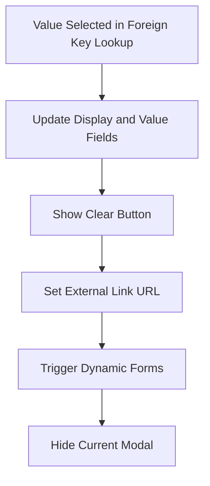

This document will cover the process of handling foreign key lookup selection, which includes:

1. Updating display and value fields
2. Showing the clear button
3. Setting the external link URL
4. Triggering dynamic forms
5. Hiding the current modal.

Technical document: <SwmLink doc-title="Handling Foreign Key Lookup Selection">[Handling Foreign Key Lookup Selection](/.swm/handling-foreign-key-lookup-selection.hv943k00.sw.md)</SwmLink>

# [Updating Display and Value Fields](https://app.swimm.io/repos/Z2l0aHViJTNBJTNBQnJvYWRsZWFmQ29tbWVyY2UtZGVtby1uZXclM0ElM0FTd2ltbS1EZW1v/docs/hv943k00#handling-the-selection-of-a-value-in-a-foreign-key-lookup)

When a value is selected in a foreign key lookup, the system updates the display and value fields to reflect the selected value. This ensures that the user sees the correct information associated with their selection. The display field shows a human-readable value, while the value field holds the actual identifier used by the system.

# [Showing the Clear Button](https://app.swimm.io/repos/Z2l0aHViJTNBJTNBQnJvYWRsZWFmQ29tbWVyY2UtZGVtby1uZXclM0ElM0FTd2ltbS1EZW1v/docs/hv943k00#handling-the-selection-of-a-value-in-a-foreign-key-lookup)

After updating the display and value fields, a clear button is shown. This button allows the user to clear their selection if they change their mind or made a mistake. It enhances user experience by providing an easy way to reset the selection.

# [Setting the External Link URL](https://app.swimm.io/repos/Z2l0aHViJTNBJTNBQnJvYWRsZWFmQ29tbWVyY2UtZGVtby1uZXclM0ElM0FTd2ltbS1EZW1v/docs/hv943k00#handling-the-selection-of-a-value-in-a-foreign-key-lookup)

The external link URL is set to point to the details of the selected value. This allows users to quickly navigate to a detailed view of the selected item, providing them with more information and context about their selection.

# [Triggering Dynamic Forms](https://app.swimm.io/repos/Z2l0aHViJTNBJTNBQnJvYWRsZWFmQ29tbWVyY2UtZGVtby1uZXclM0ElM0FTd2ltbS1EZW1v/docs/hv943k00#handling-the-selection-of-a-value-in-a-foreign-key-lookup)

If there are any dynamic forms that need to be updated based on the selection, they are triggered at this stage. Dynamic forms may need to change their content or options based on the selected value, ensuring that the user interface remains consistent and relevant.

# [Hiding the Current Modal](https://app.swimm.io/repos/Z2l0aHViJTNBJTNBQnJvYWRsZWFmQ29tbWVyY2UtZGVtby1uZXclM0ElM0FTd2ltbS1EZW1v/docs/hv943k00#handling-the-selection-of-a-value-in-a-foreign-key-lookup)

Finally, the current modal is hidden to complete the process. This step ensures that the user is returned to the main interface with their selection applied, providing a seamless and intuitive user experience.

&nbsp;

*This is an auto-generated document by Swimm AI 🌊 and has not yet been verified by a human*

<SwmMeta version="3.0.0" repo-id="Z2l0aHViJTNBJTNBQnJvYWRsZWFmQ29tbWVyY2UtZGVtby1uZXclM0ElM0FTd2ltbS1EZW1v" repo-name="BroadleafCommerce-demo-new" doc-type="product-flows">Powered by [Swimm](/)</SwmMeta>
