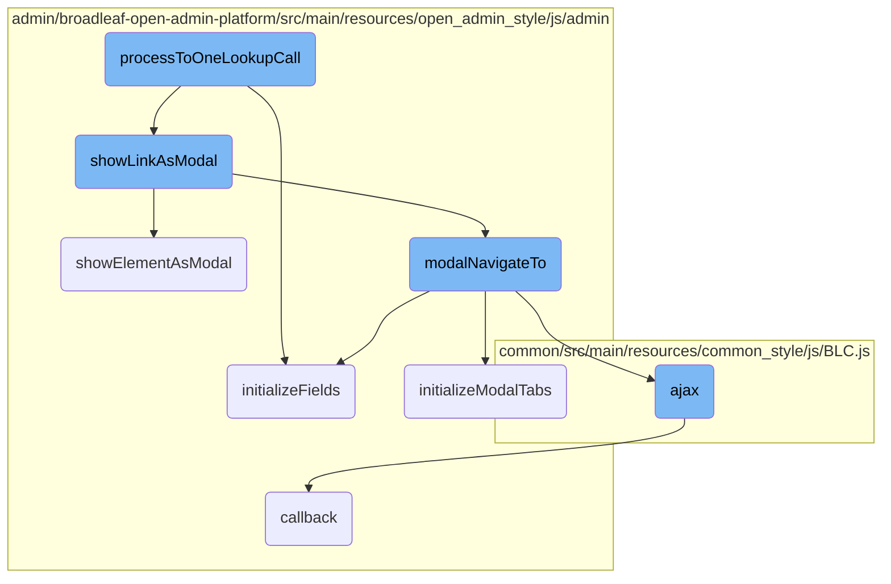
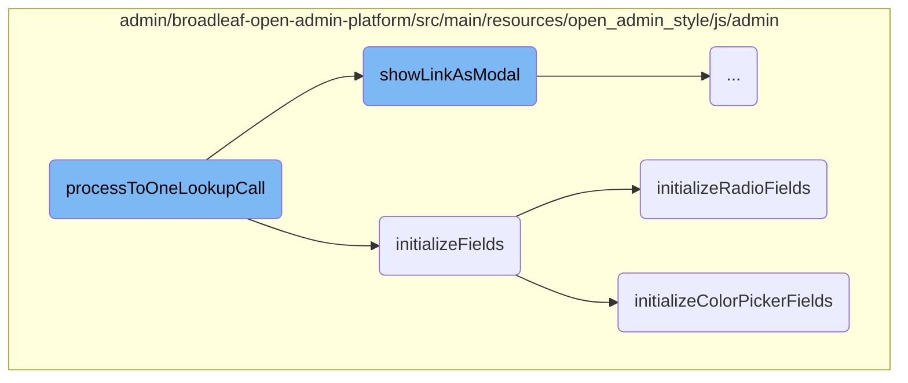
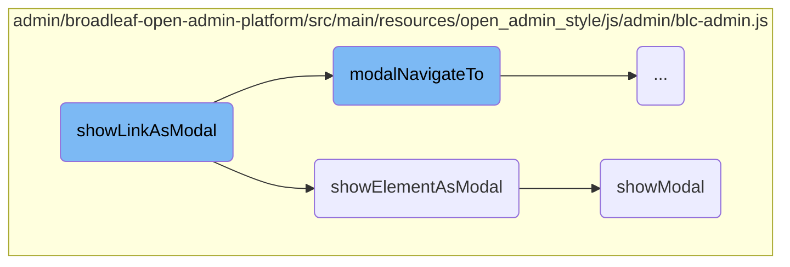

```mermaid
graph TD;
      subgraph admin/broadleaf-open-admin-platform/src/main/resources/open_admin_style/js/admin
be50d404053e390164a1f7ed1303c2cd51ca7a76c002cca07f958b894bf73fbf(modalNavigateTo):::mainFlowStyle --> 20765157e7caf47cfebacf124dbb54d87c5a924adf517dbde5cfb0bca79d1b33(initializeModalTabs)
end

subgraph admin/broadleaf-open-admin-platform/src/main/resources/open_admin_style/js/admin
be50d404053e390164a1f7ed1303c2cd51ca7a76c002cca07f958b894bf73fbf(modalNavigateTo):::mainFlowStyle --> a6a3ca24e1b4b5f47b35b79ad693e368ff18f4804a874395b6067f6d5a30db79(initializeFields)
end

subgraph common/src/main/resources/common_style/js/BLC.js
be50d404053e390164a1f7ed1303c2cd51ca7a76c002cca07f958b894bf73fbf(modalNavigateTo):::mainFlowStyle --> 735e8dabf9d808e57e1ae9226d6dc2bbd430d5caf620c06e056b1f2093d3b0a4(ajax):::mainFlowStyle
end

subgraph admin/broadleaf-open-admin-platform/src/main/resources/open_admin_style/js/admin
a6a3ca24e1b4b5f47b35b79ad693e368ff18f4804a874395b6067f6d5a30db79(initializeFields) --> f3f786b632f6aeed5cea30dc5e39700c333958642dd5f8e79fe0d86144a9fdf4(initializeRadioFields)
end

subgraph admin/broadleaf-open-admin-platform/src/main/resources/open_admin_style/js/admin
a6a3ca24e1b4b5f47b35b79ad693e368ff18f4804a874395b6067f6d5a30db79(initializeFields) --> a3d4a3da082952a6c51bc77c5212988bb7e2598c138fd3ffa0cfe3f1a01ba1bc(initializeColorPickerFields)
end

subgraph admin/broadleaf-open-admin-platform/src/main/resources/open_admin_style/js/admin
20765157e7caf47cfebacf124dbb54d87c5a924adf517dbde5cfb0bca79d1b33(initializeModalTabs) --> 02f5ebfc4c173995c97e887e34854c9e5262b2d09c51754d3293f5c1f10d096f(broadleafTabs)
end


      classDef mainFlowStyle color:#000000,fill:#7CB9F4
classDef rootsStyle color:#000000,fill:#00FFF4
classDef Style1 color:#000000,fill:#00FFAA
classDef Style2 color:#000000,fill:#FFFF00
classDef Style3 color:#000000,fill:#AA7CB9

%% Swimm:
%% graph TD;
%%       subgraph <SwmPath>[admin/broadleaf-open-admin-platform/src/main/resources/open_admin_style/js/admin/](admin/broadleaf-open-admin-platform/src/main/resources/open_admin_style/js/admin/)</SwmPath>
%% be50d404053e390164a1f7ed1303c2cd51ca7a76c002cca07f958b894bf73fbf(modalNavigateTo):::mainFlowStyle --> 20765157e7caf47cfebacf124dbb54d87c5a924adf517dbde5cfb0bca79d1b33(initializeModalTabs)
%% end
%% 
%% subgraph <SwmPath>[admin/broadleaf-open-admin-platform/src/main/resources/open_admin_style/js/admin/](admin/broadleaf-open-admin-platform/src/main/resources/open_admin_style/js/admin/)</SwmPath>
%% be50d404053e390164a1f7ed1303c2cd51ca7a76c002cca07f958b894bf73fbf(modalNavigateTo):::mainFlowStyle --> a6a3ca24e1b4b5f47b35b79ad693e368ff18f4804a874395b6067f6d5a30db79(initializeFields)
%% end
%% 
%% subgraph <SwmPath>[common/src/main/resources/common_style/js/BLC.js](common/src/main/resources/common_style/js/BLC.js)</SwmPath>
%% be50d404053e390164a1f7ed1303c2cd51ca7a76c002cca07f958b894bf73fbf(modalNavigateTo):::mainFlowStyle --> 735e8dabf9d808e57e1ae9226d6dc2bbd430d5caf620c06e056b1f2093d3b0a4(ajax):::mainFlowStyle
%% end
%% 
%% subgraph <SwmPath>[admin/broadleaf-open-admin-platform/src/main/resources/open_admin_style/js/admin/](admin/broadleaf-open-admin-platform/src/main/resources/open_admin_style/js/admin/)</SwmPath>
%% a6a3ca24e1b4b5f47b35b79ad693e368ff18f4804a874395b6067f6d5a30db79(initializeFields) --> f3f786b632f6aeed5cea30dc5e39700c333958642dd5f8e79fe0d86144a9fdf4(initializeRadioFields)
%% end
%% 
%% subgraph <SwmPath>[admin/broadleaf-open-admin-platform/src/main/resources/open_admin_style/js/admin/](admin/broadleaf-open-admin-platform/src/main/resources/open_admin_style/js/admin/)</SwmPath>
%% a6a3ca24e1b4b5f47b35b79ad693e368ff18f4804a874395b6067f6d5a30db79(initializeFields) --> a3d4a3da082952a6c51bc77c5212988bb7e2598c138fd3ffa0cfe3f1a01ba1bc(initializeColorPickerFields)
%% end
%% 
%% subgraph <SwmPath>[admin/broadleaf-open-admin-platform/src/main/resources/open_admin_style/js/admin/](admin/broadleaf-open-admin-platform/src/main/resources/open_admin_style/js/admin/)</SwmPath>
%% 20765157e7caf47cfebacf124dbb54d87c5a924adf517dbde5cfb0bca79d1b33(initializeModalTabs) --> 02f5ebfc4c173995c97e887e34854c9e5262b2d09c51754d3293f5c1f10d096f(broadleafTabs)
%% end
%% 
%% 
%%       classDef mainFlowStyle color:#000000,fill:#7CB9F4
%% classDef rootsStyle color:#000000,fill:#00FFF4
%% classDef Style1 color:#000000,fill:#00FFAA
%% classDef Style2 color:#000000,fill:#FFFF00
%% classDef Style3 color:#000000,fill:#AA7CB9
```

In this document, we will explain the flow of handling the selection of a value in a foreign key lookup. This process involves updating display and value fields, showing the clear button, setting the external link URL, triggering dynamic forms if necessary, and hiding the current modal.

The flow starts when a value is selected in a foreign key lookup. First, the display and value fields are updated to reflect the selected value. Then, a clear button is shown to allow the user to clear the selection if needed. The external link URL is set to point to the selected value's details. If there are any dynamic forms that need to be updated based on the selection, they are triggered. Finally, the current modal is hidden to complete the process.

Here is a high level diagram of the flow, showing only the most important functions:



# Flow drill down

First, we'll zoom into this section of the flow:



<SwmSnippet path="/admin/broadleaf-open-admin-platform/src/main/resources/open_admin_style/js/admin/components/listGrid.js" line="808">

---

## Handling the Selection of a Value in a Foreign Key Lookup

The function <SwmToken path="admin/broadleaf-open-admin-platform/src/main/resources/open_admin_style/js/admin/components/listGrid.js" pos="802:11:11" line-data="        BLCAdmin.confirmProcessBeforeProceeding(mustConfirm, confirmMsg, processToOneLookupCall, [$lookupButton]);">`processToOneLookupCall`</SwmToken> handles the selection of a value in a foreign key lookup. It updates the display and value fields, shows the clear button, and sets the external link URL. Additionally, it triggers dynamic forms if necessary and hides the current modal.

```javascript
            $container.on('valueSelected', function (event, $target, fields, link, currentUrl) {
                var $this = $(this);
                var displayValueProp = $this.find('input.display-value-property').val();
                var displayValue = fields[displayValueProp];
                var $selectedRow = BLCAdmin.currentModal().find('tr[data-link="' + link + '"]');
                var $displayField = $selectedRow.find('td[data-fieldname=' + displayValueProp.split(".").join("\\.") + ']');
                if ($displayField.hasClass('derived')) {
                    displayValue = $.trim($displayField.text());
                }
                if (typeof BLCAdmin.treeListGrid !== 'undefined' && $this.closest('.modal-add-entity-form.enterprise-tree-add').length) {
                    BLCAdmin.treeListGrid.buildParentPathJson($this.closest('.modal-add-entity-form.enterprise-tree-add'), $selectedRow);
                }
                var $valueField = $this.find('input.value');
                $valueField.val(fields['id']);
                $this.find('.display-value-none-selected').hide();
                $this.find('span.display-value').html(displayValue);
                $this.find('input.display-value').val(displayValue).show();
                $this.find('input.hidden-display-value').val(displayValue).trigger('input');
                // Ensure that the clear button shows up after selecting a value
                $this.find('button.clear-foreign-key').show();
                // Ensure that the external link button points to the correct URL
```

---

</SwmSnippet>

<SwmSnippet path="/admin/broadleaf-open-admin-platform/src/main/resources/open_admin_style/js/admin/blc-admin.js" line="489">

---

## Initializing Fields

The function <SwmToken path="admin/broadleaf-open-admin-platform/src/main/resources/open_admin_style/js/admin/blc-admin.js" pos="489:1:1" line-data="        initializeFields : function($container) {">`initializeFields`</SwmToken> initializes various field types within a specified container. It runs field initialization handlers, sets blank values for foreign key lookups, shows tab error indicators, and initializes specific field types like text areas, color pickers, selectize fields, radio fields, and date fields.

```javascript
        initializeFields : function($container) {

            // If there is no container specified, we'll initialize the active tab (or the body if there are no tabs)
            if ($container == null) {
                $container = BLCAdmin.getActiveTab();
            }

            // run field initialization handlers and see if we should continue initializing fields
            var continueInitialization = BLCAdmin.runFieldInitializationHandlers($container);

            // If we've already initialized this container, we'll skip it.
            if ($container.data('initialized') === 'true' || !continueInitialization) {
                if ($container.closest('.oms-tab').length) {
                    return;
                }
                // Update all listgrids sizing on the current tab just in case.
                $container.find('.listgrid-container tbody').each(function (index, element) {
                    BLCAdmin.listGrid.updateGridTitleBarSize($(element).closest('.listgrid-container').find('.fieldgroup-listgrid-wrapper-header'));
                    BLCAdmin.listGrid.paginate.updateGridSize($(element));
                });
                return;
```

---

</SwmSnippet>

<SwmSnippet path="/admin/broadleaf-open-admin-platform/src/main/resources/open_admin_style/js/admin/blc-admin.js" line="634">

---

### Initializing Radio Fields

The function <SwmToken path="admin/broadleaf-open-admin-platform/src/main/resources/open_admin_style/js/admin/blc-admin.js" pos="634:1:1" line-data="        initializeRadioFields : function($container) {">`initializeRadioFields`</SwmToken> sets up click event handlers for radio button labels to ensure the corresponding radio button is checked when the label is clicked.

```javascript
        initializeRadioFields : function($container) {
            $container.find('.radio-label').on("click", function(e) {
                if (!$(this).hasClass('disabled')) {
                    e.preventDefault();
                    $(this).prev('input').prop("checked", true).change();
                }
            });
        },
```

---

</SwmSnippet>

<SwmSnippet path="/admin/broadleaf-open-admin-platform/src/main/resources/open_admin_style/js/admin/blc-admin.js" line="678">

---

### Initializing Color Picker Fields

The function <SwmToken path="admin/broadleaf-open-admin-platform/src/main/resources/open_admin_style/js/admin/blc-admin.js" pos="678:1:1" line-data="        initializeColorPickerFields : function($container) {">`initializeColorPickerFields`</SwmToken> initializes color picker fields using the Spectrum library. It sets up event handlers to update the associated input field with the selected color value.

```javascript
        initializeColorPickerFields : function($container) {
            $container.find(".color-picker").spectrum({
                showButtons: false,
                preferredFormat: "hex6",
                change: function(color) {
                    $(this).closest('.field-group').find('input.color-picker-value').val(color).trigger('input');
                },
                move: function(color) {
                    $(this).closest('.field-group').find('input.color-picker-value').val(color).trigger('input');
                }
            });
        },
```

---

</SwmSnippet>

Now, lets zoom into this section of the flow:



<SwmSnippet path="/admin/broadleaf-open-admin-platform/src/main/resources/open_admin_style/js/admin/blc-admin.js" line="364">

---

## <SwmToken path="admin/broadleaf-open-admin-platform/src/main/resources/open_admin_style/js/admin/blc-admin.js" pos="364:1:1" line-data="        showLinkAsModal : function(link, onModalHide, onModalHideArgs) {">`showLinkAsModal`</SwmToken>

The <SwmToken path="admin/broadleaf-open-admin-platform/src/main/resources/open_admin_style/js/admin/blc-admin.js" pos="364:1:1" line-data="        showLinkAsModal : function(link, onModalHide, onModalHideArgs) {">`showLinkAsModal`</SwmToken> function is responsible for displaying a link as a modal dialog. It first shows a loading message by creating a modal skeleton and adding a loading spinner. Then, it calls <SwmToken path="admin/broadleaf-open-admin-platform/src/main/resources/open_admin_style/js/admin/blc-admin.js" pos="372:3:3" line-data="            BLCAdmin.showElementAsModal($modal, onModalHide, onModalHideArgs);">`showElementAsModal`</SwmToken> to display the modal and finally replaces the loading message with the actual content by calling <SwmToken path="admin/broadleaf-open-admin-platform/src/main/resources/open_admin_style/js/admin/blc-admin.js" pos="375:3:3" line-data="            BLCAdmin.modalNavigateTo(link);">`modalNavigateTo`</SwmToken>.

```javascript
        showLinkAsModal : function(link, onModalHide, onModalHideArgs) {
            // Show a loading message
            var $modal = BLCAdmin.getModalSkeleton();
            $modal.addClass('loading-modal');
            $modal.find('.modal-header h3').text(BLCAdmin.messages.loading);
            $modal.find('.modal-body').append($('<i>', { 'class' : 'fa-pulse fa fa-spinner' }));
            $modal.find('.modal-body').css('text-align', 'center').css('font-size', '24px').css('padding-bottom', '15px');

            BLCAdmin.showElementAsModal($modal, onModalHide, onModalHideArgs);

            // Then replace it with the actual requested link
            BLCAdmin.modalNavigateTo(link);
        },
```

---

</SwmSnippet>

<SwmSnippet path="/admin/broadleaf-open-admin-platform/src/main/resources/open_admin_style/js/admin/blc-admin.js" line="348">

---

## <SwmToken path="admin/broadleaf-open-admin-platform/src/main/resources/open_admin_style/js/admin/blc-admin.js" pos="348:1:1" line-data="        showElementAsModal : function($element, onModalHide, onModalHideArgs) {">`showElementAsModal`</SwmToken>

The <SwmToken path="admin/broadleaf-open-admin-platform/src/main/resources/open_admin_style/js/admin/blc-admin.js" pos="348:1:1" line-data="        showElementAsModal : function($element, onModalHide, onModalHideArgs) {">`showElementAsModal`</SwmToken> function is used to display a given element as a modal. It first checks if there is an existing modal with a loading state and hides it. Then, it wraps the content in a modal structure if necessary and appends it to the body. Finally, it calls <SwmToken path="admin/broadleaf-open-admin-platform/src/main/resources/open_admin_style/js/admin/blc-admin.js" pos="361:1:1" line-data="            showModal($element, onModalHide, onModalHideArgs);">`showModal`</SwmToken> to display the modal.

```javascript
        showElementAsModal : function($element, onModalHide, onModalHideArgs) {
            if (BLCAdmin.currentModal() != null && BLCAdmin.currentModal().hasClass('loading-modal')) {
                BLCAdmin.hideCurrentModal();
            }

            if (!$element.find('.content-yield').length) {
                var content = $('<div>', { 'class': 'content-yield'});
                $element.find('.modal-body').wrapInner(content);
            }
            if($element.hasClass('wrap-in-modal')) {
                $element = wrapInModal($element);
            }
            $('body').append($element);
            showModal($element, onModalHide, onModalHideArgs);
        },
```

---

</SwmSnippet>

<SwmSnippet path="/admin/broadleaf-open-admin-platform/src/main/resources/open_admin_style/js/admin/blc-admin.js" line="52">

---

## <SwmToken path="admin/broadleaf-open-admin-platform/src/main/resources/open_admin_style/js/admin/blc-admin.js" pos="52:3:3" line-data="    function showModal($data, onModalHide, onModalHideArgs) {">`showModal`</SwmToken>

The <SwmToken path="admin/broadleaf-open-admin-platform/src/main/resources/open_admin_style/js/admin/blc-admin.js" pos="52:3:3" line-data="    function showModal($data, onModalHide, onModalHideArgs) {">`showModal`</SwmToken> function is responsible for the actual display of the modal dialog. It handles the modal's backdrop, <SwmToken path="admin/broadleaf-open-admin-platform/src/main/resources/open_admin_style/js/admin/blc-admin.js" pos="59:28:30" line-data="        // If we already have an active modal, we need to modify its z-index so that it will be">`z-index`</SwmToken> adjustments for multiple modals, and binds a callback for when the modal is hidden. It also initializes fields, tabs, buttons, and sets the maximum height for the modal.

```javascript
    function showModal($data, onModalHide, onModalHideArgs) {
        // If we already have an active modal, we don't need another backdrop on subsequent modals
        $data.modal({
            backdrop: (modals.length < 1),
            keyboard: false  // disable default keyboard behavior; wasn't intended to work with layered modals
        });

        // If we already have an active modal, we need to modify its z-index so that it will be
        // hidden by the current backdrop
        if (modals.length > 0) {
            modals.last().css('z-index', '1040');

            // We will also offset modals by the given option values
            $data.css('left', $data.position().left + (stackedModalOptions.left * modals.length) + 'px');
            $data.css('top', $data.position().top + (stackedModalOptions.top * modals.length) + 'px');
        }

        // Save our new modal into our stack
        modals.push($data);
        // Bind a callback for the modal hidden event...
        $data.on('hidden', function() {
```

---

</SwmSnippet>

Now, lets zoom into this section of the flow:



<SwmSnippet path="/admin/broadleaf-open-admin-platform/src/main/resources/open_admin_style/js/admin/blc-admin.js" line="378">

---

## Modal Navigation

The <SwmToken path="admin/broadleaf-open-admin-platform/src/main/resources/open_admin_style/js/admin/blc-admin.js" pos="379:1:1" line-data="        modalNavigateTo : function(link) {">`modalNavigateTo`</SwmToken> function is responsible for handling the navigation within a modal. It replaces the current modal content with new content fetched from a given link. This function ensures that the modal is properly initialized and styled, and it also handles specific cases like asset selectors and adorned forms.

```javascript
        // Convenience function for hiding the replacing the current modal with the given link
        modalNavigateTo : function(link) {
            if (BLCAdmin.currentModal()) {
                BLCAdmin.currentModal().data('initialized', 'false');
                BLC.ajax({
                    url : link,
                    type : "GET"
                }, function(data) {
                    // Create a modal out of the server response
                    var $data = $(data);

                    // check if the modal has any additional classes
                    var classes = $data.attr('class').split(' ');
                    if (classes.length > 2) {
                        for (var i = 2; i < classes.length; i++) {
                            BLCAdmin.currentModal().addClass(classes[i]);
                        }
                    }

                    $data = $data.children();

```

---

</SwmSnippet>

<SwmSnippet path="/admin/broadleaf-open-admin-platform/src/main/resources/open_admin_style/js/admin/blc-admin.js" line="302">

---

### Initializing Modal Tabs

The <SwmToken path="admin/broadleaf-open-admin-platform/src/main/resources/open_admin_style/js/admin/blc-admin.js" pos="302:1:1" line-data="        initializeModalTabs : function($data) {">`initializeModalTabs`</SwmToken> function initializes the tabs within the modal. It uses the <SwmToken path="admin/broadleaf-open-admin-platform/src/main/resources/open_admin_style/js/admin/blc-admin.js" pos="303:4:4" line-data="            $.fn.broadleafTabs();">`broadleafTabs`</SwmToken> plugin to set up the tab functionality and ensures that the active tab is correctly displayed.

```javascript
        initializeModalTabs : function($data) {
            $.fn.broadleafTabs();

            BLCAdmin.currentModal().find('.nav-tabs li.active > a').click();
        },
```

---

</SwmSnippet>

<SwmSnippet path="/common/src/main/resources/common_style/js/BLC.js" line="135">

---

### AJAX Requests

The <SwmToken path="common/src/main/resources/common_style/js/BLC.js" pos="135:3:3" line-data="    function ajax(options, callback) {">`ajax`</SwmToken> function is a utility for making AJAX requests. It handles various configurations like setting the request type, appending necessary tokens, and managing success and error callbacks. This function is used within <SwmToken path="admin/broadleaf-open-admin-platform/src/main/resources/open_admin_style/js/admin/blc-admin.js" pos="375:3:3" line-data="            BLCAdmin.modalNavigateTo(link);">`modalNavigateTo`</SwmToken> to fetch the new modal content.

```javascript
    function ajax(options, callback) {
        if (options.type == null) {
            options.type = 'GET';
        }

        var baseUrl = window.location.href;
        if (baseUrl.indexOf('isPostAdd') != -1) {
            if (options.url.indexOf('isPostAdd') < 0) {
                if (options.url.indexOf('?') > 0) {
                    options.url += "&";
                } else {
                    options.url += "?";
                }
                options.url += "isPostAdd=true";
            }
        }
        var savedCatalogElement = $('input[name ="catalogEntityCatalogDiscriminatorId"]');
        var savedCatalog=null;

        if(savedCatalogElement.length){
            //0 should be the one we need, other can be from the modal form
```

---

</SwmSnippet>

<SwmSnippet path="/admin/broadleaf-open-admin-platform/src/main/resources/open_admin_style/js/admin/ui/tabs.js" line="19">

---

### Broadleaf Tabs

The <SwmToken path="admin/broadleaf-open-admin-platform/src/main/resources/open_admin_style/js/admin/ui/tabs.js" pos="21:4:4" line-data="    $.fn.broadleafTabs = function(options) {">`broadleafTabs`</SwmToken> function is a <SwmToken path="admin/broadleaf-open-admin-platform/src/main/resources/open_admin_style/js/admin/components/listGrid.js" pos="525:3:3" line-data="})(jQuery, BLCAdmin);">`jQuery`</SwmToken> plugin that manages the tab functionality within the modal. It handles tab switching, content display, and triggers necessary events when a tab is activated.

```javascript
    'use strict';

    $.fn.broadleafTabs = function(options) {
        $(document).on('click', '.nav-tabs li a:not(.hidden)', function(e) {
            e.preventDefault();

            // Remove 'selected' outline from tab
            $(this).blur();

            var tabs = $(this).closest('.nav-tabs');
            // Remove 'active' class from all tabs
            $.each(tabs.find('li'), function (key, value) {
                $(value).removeClass('active');
            });

            // Add 'active' class to current tab
            $(this).parent().addClass('active');

            // Remove 'active' class from all tab content
            var entityForms = tabs.parent().parent().find('.entityFormTab');
            $.each(entityForms, function (key, value) {
```

---

</SwmSnippet>

&nbsp;

*This is an auto-generated document by Swimm AI 🌊 and has not yet been verified by a human*

<SwmMeta version="3.0.0" repo-id="Z2l0aHViJTNBJTNBQnJvYWRsZWFmQ29tbWVyY2UtZGVtby1uZXclM0ElM0FTd2ltbS1EZW1v" repo-name="BroadleafCommerce-demo-new" doc-type="flows"><sup>Powered by [Swimm](/)</sup></SwmMeta>
