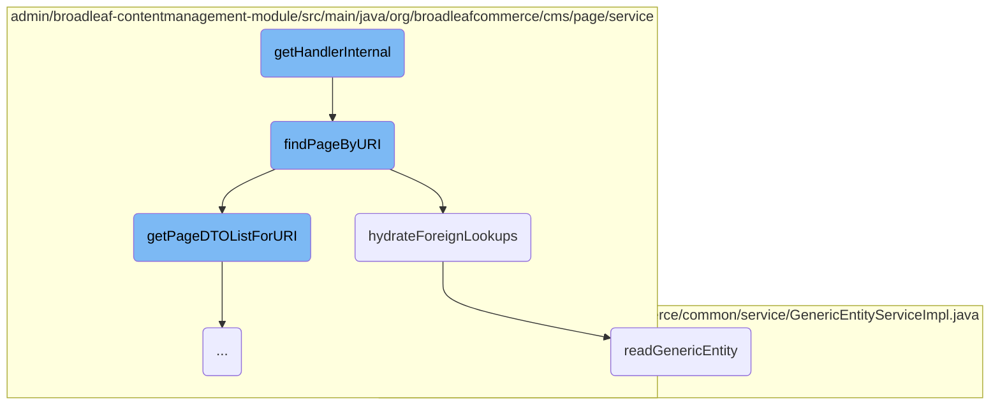

This document explains the process of handling incoming HTTP requests and determining the appropriate page to display. It involves retrieving the request URI, setting up the context for internal validation, fetching the corresponding page, and resolving any foreign key references.

When a request comes in, the system first gets the request URI and sets up the necessary context. It then looks for the page that matches the URI. If it finds a matching page, it checks if there are any foreign key references that need to be resolved. Once everything is set, the page is displayed to the user.

Here is a high level diagram of the flow, showing only the most important functions:

```mermaid
graph TD;
      subgraph admin/broadleaf-contentmanagement-module/src/main/java/org/broadleafcommerce/cms/page/service
6ef7ea899106034a41c410b51f25a54435f91c695d4fbf17b181eba6dfa3b7f0(getHandlerInternal):::mainFlowStyle --> 918e7a7651d2a5b9b33cc3b516cb9e02f5b5d56e737dec5f8d393f6e2c2206e1(findPageByURI):::mainFlowStyle
end

subgraph admin/broadleaf-contentmanagement-module/src/main/java/org/broadleafcommerce/cms/page/service
918e7a7651d2a5b9b33cc3b516cb9e02f5b5d56e737dec5f8d393f6e2c2206e1(findPageByURI):::mainFlowStyle --> 08b14212f6fc4d087e69c01e8de926ded7b1a7de0ce55a00c5d350e3a395a822(hydrateForeignLookups)
end

subgraph admin/broadleaf-contentmanagement-module/src/main/java/org/broadleafcommerce/cms/page/service
918e7a7651d2a5b9b33cc3b516cb9e02f5b5d56e737dec5f8d393f6e2c2206e1(findPageByURI):::mainFlowStyle --> 2ae106fcfcc044246ba42ba9c7a4091a9e011f45a2a869ad2ec7e3d15c196bbe(getPageDTOListForURI):::mainFlowStyle
end

subgraph admin/broadleaf-contentmanagement-module/src/main/java/org/broadleafcommerce/cms/page/service
2ae106fcfcc044246ba42ba9c7a4091a9e011f45a2a869ad2ec7e3d15c196bbe(getPageDTOListForURI):::mainFlowStyle --> 1ca30e2b8c8bbfdca0ca7c7e365c9d0fcea46b880193ed4540fc83b9cf2d7cf3(buildPageDTOList):::mainFlowStyle
end

subgraph admin/broadleaf-contentmanagement-module/src/main/java/org/broadleafcommerce/cms/page/service
1ca30e2b8c8bbfdca0ca7c7e365c9d0fcea46b880193ed4540fc83b9cf2d7cf3(buildPageDTOList):::mainFlowStyle --> 19b49f66287c2a0c853166aa47a07ef7cd4aa2877015951a5239c891b07700e6(buildPageDTOListUsingCache):::mainFlowStyle
end

subgraph admin/broadleaf-contentmanagement-module/src/main/java/org/broadleafcommerce/cms/page/service
19b49f66287c2a0c853166aa47a07ef7cd4aa2877015951a5239c891b07700e6(buildPageDTOListUsingCache):::mainFlowStyle --> 3e266e1d88b9f0a6bc696d99832c5fd543896bd57ffa92660fd4cdd32ba2a2a8(getCachedPageDTOList)
end

subgraph admin/broadleaf-contentmanagement-module/src/main/java/org/broadleafcommerce/cms/page/service
19b49f66287c2a0c853166aa47a07ef7cd4aa2877015951a5239c891b07700e6(buildPageDTOListUsingCache):::mainFlowStyle --> 133f7a31184bad6500d3f50c4f24774ae2352cb1ac0f707d67bb3eb2db733c15(addPageListToPageDTOList):::mainFlowStyle
end

subgraph admin/broadleaf-contentmanagement-module/src/main/java/org/broadleafcommerce/cms/page/service
133f7a31184bad6500d3f50c4f24774ae2352cb1ac0f707d67bb3eb2db733c15(addPageListToPageDTOList):::mainFlowStyle --> fb4625e1472de8da4f3624f66f9feb2d877d00d95867f692a81ca7edefc9b051(buildPageDTO):::mainFlowStyle
end


      classDef mainFlowStyle color:#000000,fill:#7CB9F4
classDef rootsStyle color:#000000,fill:#00FFF4
classDef Style1 color:#000000,fill:#00FFAA
classDef Style2 color:#000000,fill:#FFFF00
classDef Style3 color:#000000,fill:#AA7CB9

%% Swimm:
%% graph TD;
%%       subgraph <SwmPath>[admin/broadleaf-contentmanagement-module/src/main/java/org/broadleafcommerce/cms/page/service/](admin/broadleaf-contentmanagement-module/src/main/java/org/broadleafcommerce/cms/page/service/)</SwmPath>
%% 6ef7ea899106034a41c410b51f25a54435f91c695d4fbf17b181eba6dfa3b7f0(getHandlerInternal):::mainFlowStyle --> 918e7a7651d2a5b9b33cc3b516cb9e02f5b5d56e737dec5f8d393f6e2c2206e1(findPageByURI):::mainFlowStyle
%% end
%% 
%% subgraph <SwmPath>[admin/broadleaf-contentmanagement-module/src/main/java/org/broadleafcommerce/cms/page/service/](admin/broadleaf-contentmanagement-module/src/main/java/org/broadleafcommerce/cms/page/service/)</SwmPath>
%% 918e7a7651d2a5b9b33cc3b516cb9e02f5b5d56e737dec5f8d393f6e2c2206e1(findPageByURI):::mainFlowStyle --> 08b14212f6fc4d087e69c01e8de926ded7b1a7de0ce55a00c5d350e3a395a822(hydrateForeignLookups)
%% end
%% 
%% subgraph <SwmPath>[admin/broadleaf-contentmanagement-module/src/main/java/org/broadleafcommerce/cms/page/service/](admin/broadleaf-contentmanagement-module/src/main/java/org/broadleafcommerce/cms/page/service/)</SwmPath>
%% 918e7a7651d2a5b9b33cc3b516cb9e02f5b5d56e737dec5f8d393f6e2c2206e1(findPageByURI):::mainFlowStyle --> 2ae106fcfcc044246ba42ba9c7a4091a9e011f45a2a869ad2ec7e3d15c196bbe(getPageDTOListForURI):::mainFlowStyle
%% end
%% 
%% subgraph <SwmPath>[admin/broadleaf-contentmanagement-module/src/main/java/org/broadleafcommerce/cms/page/service/](admin/broadleaf-contentmanagement-module/src/main/java/org/broadleafcommerce/cms/page/service/)</SwmPath>
%% 2ae106fcfcc044246ba42ba9c7a4091a9e011f45a2a869ad2ec7e3d15c196bbe(getPageDTOListForURI):::mainFlowStyle --> 1ca30e2b8c8bbfdca0ca7c7e365c9d0fcea46b880193ed4540fc83b9cf2d7cf3(buildPageDTOList):::mainFlowStyle
%% end
%% 
%% subgraph <SwmPath>[admin/broadleaf-contentmanagement-module/src/main/java/org/broadleafcommerce/cms/page/service/](admin/broadleaf-contentmanagement-module/src/main/java/org/broadleafcommerce/cms/page/service/)</SwmPath>
%% 1ca30e2b8c8bbfdca0ca7c7e365c9d0fcea46b880193ed4540fc83b9cf2d7cf3(buildPageDTOList):::mainFlowStyle --> 19b49f66287c2a0c853166aa47a07ef7cd4aa2877015951a5239c891b07700e6(buildPageDTOListUsingCache):::mainFlowStyle
%% end
%% 
%% subgraph <SwmPath>[admin/broadleaf-contentmanagement-module/src/main/java/org/broadleafcommerce/cms/page/service/](admin/broadleaf-contentmanagement-module/src/main/java/org/broadleafcommerce/cms/page/service/)</SwmPath>
%% 19b49f66287c2a0c853166aa47a07ef7cd4aa2877015951a5239c891b07700e6(buildPageDTOListUsingCache):::mainFlowStyle --> 3e266e1d88b9f0a6bc696d99832c5fd543896bd57ffa92660fd4cdd32ba2a2a8(getCachedPageDTOList)
%% end
%% 
%% subgraph <SwmPath>[admin/broadleaf-contentmanagement-module/src/main/java/org/broadleafcommerce/cms/page/service/](admin/broadleaf-contentmanagement-module/src/main/java/org/broadleafcommerce/cms/page/service/)</SwmPath>
%% 19b49f66287c2a0c853166aa47a07ef7cd4aa2877015951a5239c891b07700e6(buildPageDTOListUsingCache):::mainFlowStyle --> 133f7a31184bad6500d3f50c4f24774ae2352cb1ac0f707d67bb3eb2db733c15(addPageListToPageDTOList):::mainFlowStyle
%% end
%% 
%% subgraph <SwmPath>[admin/broadleaf-contentmanagement-module/src/main/java/org/broadleafcommerce/cms/page/service/](admin/broadleaf-contentmanagement-module/src/main/java/org/broadleafcommerce/cms/page/service/)</SwmPath>
%% 133f7a31184bad6500d3f50c4f24774ae2352cb1ac0f707d67bb3eb2db733c15(addPageListToPageDTOList):::mainFlowStyle --> fb4625e1472de8da4f3624f66f9feb2d877d00d95867f692a81ca7edefc9b051(buildPageDTO):::mainFlowStyle
%% end
%% 
%% 
%%       classDef mainFlowStyle color:#000000,fill:#7CB9F4
%% classDef rootsStyle color:#000000,fill:#00FFF4
%% classDef Style1 color:#000000,fill:#00FFAA
%% classDef Style2 color:#000000,fill:#FFFF00
%% classDef Style3 color:#000000,fill:#AA7CB9
```



# Flow drill down

First, we'll zoom into this section of the flow:



<SwmSnippet path="/admin/broadleaf-contentmanagement-module/src/main/java/org/broadleafcommerce/cms/web/PageHandlerMapping.java" line="67">

---

## <SwmToken path="admin/broadleaf-contentmanagement-module/src/main/java/org/broadleafcommerce/cms/web/PageHandlerMapping.java" pos="68:5:5" line-data="    protected Object getHandlerInternal(HttpServletRequest request) throws Exception {">`getHandlerInternal`</SwmToken>

The <SwmToken path="admin/broadleaf-contentmanagement-module/src/main/java/org/broadleafcommerce/cms/web/PageHandlerMapping.java" pos="68:5:5" line-data="    protected Object getHandlerInternal(HttpServletRequest request) throws Exception {">`getHandlerInternal`</SwmToken> method is responsible for handling incoming HTTP requests and determining the appropriate page to display. It retrieves the request URI, sets up the context for internal validation, and calls <SwmToken path="admin/broadleaf-contentmanagement-module/src/main/java/org/broadleafcommerce/cms/web/PageHandlerMapping.java" pos="81:7:7" line-data="                page = pageService.findPageByURI(context.getLocale(), requestUri, buildMvelParameters(request), context.isSecure());">`findPageByURI`</SwmToken> to fetch the corresponding page. If a valid page is found, it sets the page as a request attribute and returns the controller name.

```java
    @Override
    protected Object getHandlerInternal(HttpServletRequest request) throws Exception {
        BroadleafRequestContext context = BroadleafRequestContext.getBroadleafRequestContext();
        if (context != null && context.getRequestURIWithoutContext() != null) {
            String requestUri = URLDecoder.decode(context.getRequestURIWithoutContext(), charEncoding);
            
            Boolean internalValidateFindPreviouslySet = false;
            PageDTO page;
            
            try {
                if (!BroadleafRequestContext.getBroadleafRequestContext().getInternalValidateFind()) {
                    BroadleafRequestContext.getBroadleafRequestContext().setInternalValidateFind(true);
                    internalValidateFindPreviouslySet = true;
                }
                page = pageService.findPageByURI(context.getLocale(), requestUri, buildMvelParameters(request), context.isSecure());

            } finally {
                if (internalValidateFindPreviouslySet) {
                    BroadleafRequestContext.getBroadleafRequestContext().setInternalValidateFind(false);
                }
            }
```

---

</SwmSnippet>

<SwmSnippet path="/admin/broadleaf-contentmanagement-module/src/main/java/org/broadleafcommerce/cms/page/service/PageServiceImpl.java" line="136">

---

## <SwmToken path="admin/broadleaf-contentmanagement-module/src/main/java/org/broadleafcommerce/cms/page/service/PageServiceImpl.java" pos="140:5:5" line-data="    public PageDTO findPageByURI(Locale locale, String uri, Map&lt;String,Object&gt; ruleDTOs, boolean secure) {">`findPageByURI`</SwmToken>

The <SwmToken path="admin/broadleaf-contentmanagement-module/src/main/java/org/broadleafcommerce/cms/page/service/PageServiceImpl.java" pos="140:5:5" line-data="    public PageDTO findPageByURI(Locale locale, String uri, Map&lt;String,Object&gt; ruleDTOs, boolean secure) {">`findPageByURI`</SwmToken> method retrieves a page based on the provided URI. It first checks if the page is cached. If not, it fetches a list of page DTOs for the URI and evaluates them against the provided rules. If a valid page is found, it calls <SwmToken path="admin/broadleaf-contentmanagement-module/src/main/java/org/broadleafcommerce/cms/page/service/PageServiceUtility.java" pos="187:5:5" line-data="    public PageDTO hydrateForeignLookups(PageDTO page) {">`hydrateForeignLookups`</SwmToken> to populate any foreign key references before returning the page DTO.

```java
    /*
     * Retrieve the page if one is available for the passed in uri.
     */
    @Override
    public PageDTO findPageByURI(Locale locale, String uri, Map<String,Object> ruleDTOs, boolean secure) {
        PageDTO dto;

        if (!isNullPageCached(locale, uri, secure)) {
            final List<PageDTO> returnList = getPageDTOListForURI(locale, uri, secure);
            dto = evaluatePageRules(returnList, locale, ruleDTOs);

            if (dto.getId() != null) {
                final Page page = findPageById(dto.getId());
                final ExtensionResultHolder<PageDTO> newDTO = new ExtensionResultHolder<>();

                // Allow an extension point to override the page to render.
                extensionManager.getProxy().overridePageDto(newDTO, dto, page);
                if (newDTO.getResult() != null) {
                    dto = newDTO.getResult();
                }
            }
```

---

</SwmSnippet>

<SwmSnippet path="/admin/broadleaf-contentmanagement-module/src/main/java/org/broadleafcommerce/cms/page/service/PageServiceUtility.java" line="187">

---

## <SwmToken path="admin/broadleaf-contentmanagement-module/src/main/java/org/broadleafcommerce/cms/page/service/PageServiceUtility.java" pos="187:5:5" line-data="    public PageDTO hydrateForeignLookups(PageDTO page) {">`hydrateForeignLookups`</SwmToken>

The <SwmToken path="admin/broadleaf-contentmanagement-module/src/main/java/org/broadleafcommerce/cms/page/service/PageServiceUtility.java" pos="187:5:5" line-data="    public PageDTO hydrateForeignLookups(PageDTO page) {">`hydrateForeignLookups`</SwmToken> method processes the page DTO to resolve any foreign key references. It iterates through the page fields, identifies foreign lookups, and uses <SwmToken path="admin/broadleaf-contentmanagement-module/src/main/java/org/broadleafcommerce/cms/page/service/PageServiceUtility.java" pos="203:7:7" line-data="                    newValue = genericDao.readGenericEntity(genericDao.getImplClass(clazz), id);">`readGenericEntity`</SwmToken> to fetch the corresponding entities. The resolved entities are then added back to the page fields.

```java
    public PageDTO hydrateForeignLookups(PageDTO page) {
        for (Entry<String, Object> entry : page.getPageFields().entrySet()) {
            if (entry.getValue() instanceof String && ((String) entry.getValue()).startsWith(FOREIGN_LOOKUP)) {
                page.getForeignPageFields().put(entry.getKey(), entry.getValue());
            }
        }

        if (page.getForeignPageFields().size() > 0) {
            PageDTO clone = new PageDTO();
            clone.copy(page);

            for (Entry<String, Object> entry : page.getForeignPageFields().entrySet()) {
                String clazz = ((String) entry.getValue()).split("\\|")[1];
                String id = ((String) entry.getValue()).split("\\|")[2];
                Object newValue = null;
                if (StringUtils.isNotBlank(clazz) && StringUtils.isNotBlank(id) && !"null".equals(id)) {
                    newValue = genericDao.readGenericEntity(genericDao.getImplClass(clazz), id);
                }
                if (newValue != null) {
                    clone.getPageFields().put(entry.getKey(), newValue);
                } else {
```

---

</SwmSnippet>

<SwmSnippet path="/common/src/main/java/org/broadleafcommerce/common/service/GenericEntityServiceImpl.java" line="39">

---

## <SwmToken path="common/src/main/java/org/broadleafcommerce/common/service/GenericEntityServiceImpl.java" pos="40:5:5" line-data="    public Object readGenericEntity(String className, Object id) {">`readGenericEntity`</SwmToken>

The <SwmToken path="common/src/main/java/org/broadleafcommerce/common/service/GenericEntityServiceImpl.java" pos="40:5:5" line-data="    public Object readGenericEntity(String className, Object id) {">`readGenericEntity`</SwmToken> method reads a generic entity based on the provided class name and ID. It uses the <SwmToken path="common/src/main/java/org/broadleafcommerce/common/service/GenericEntityServiceImpl.java" pos="41:8:8" line-data="        Class&lt;?&gt; clazz = genericEntityDao.getImplClass(className);">`genericEntityDao`</SwmToken> to fetch the implementation class and then retrieves the entity from the database.

```java
    @Override
    public Object readGenericEntity(String className, Object id) {
        Class<?> clazz = genericEntityDao.getImplClass(className);
        return genericEntityDao.readGenericEntity(clazz, id);
    }
```

---

</SwmSnippet>

Now, lets zoom into this section of the flow:

```mermaid
graph TD;
      subgraph admin/broadleaf-contentmanagement-module/src/main/java/org/broadleafcommerce/cms/page/service
2ae106fcfcc044246ba42ba9c7a4091a9e011f45a2a869ad2ec7e3d15c196bbe(getPageDTOListForURI):::mainFlowStyle --> 1ca30e2b8c8bbfdca0ca7c7e365c9d0fcea46b880193ed4540fc83b9cf2d7cf3(buildPageDTOList):::mainFlowStyle
end

subgraph admin/broadleaf-contentmanagement-module/src/main/java/org/broadleafcommerce/cms/page/service
1ca30e2b8c8bbfdca0ca7c7e365c9d0fcea46b880193ed4540fc83b9cf2d7cf3(buildPageDTOList):::mainFlowStyle --> 19b49f66287c2a0c853166aa47a07ef7cd4aa2877015951a5239c891b07700e6(buildPageDTOListUsingCache):::mainFlowStyle
end

subgraph admin/broadleaf-contentmanagement-module/src/main/java/org/broadleafcommerce/cms/page/service
19b49f66287c2a0c853166aa47a07ef7cd4aa2877015951a5239c891b07700e6(buildPageDTOListUsingCache):::mainFlowStyle --> 3e266e1d88b9f0a6bc696d99832c5fd543896bd57ffa92660fd4cdd32ba2a2a8(getCachedPageDTOList)
end

subgraph admin/broadleaf-contentmanagement-module/src/main/java/org/broadleafcommerce/cms/page/service
19b49f66287c2a0c853166aa47a07ef7cd4aa2877015951a5239c891b07700e6(buildPageDTOListUsingCache):::mainFlowStyle --> 133f7a31184bad6500d3f50c4f24774ae2352cb1ac0f707d67bb3eb2db733c15(addPageListToPageDTOList):::mainFlowStyle
end

subgraph admin/broadleaf-contentmanagement-module/src/main/java/org/broadleafcommerce/cms/page/service
133f7a31184bad6500d3f50c4f24774ae2352cb1ac0f707d67bb3eb2db733c15(addPageListToPageDTOList):::mainFlowStyle --> fb4625e1472de8da4f3624f66f9feb2d877d00d95867f692a81ca7edefc9b051(buildPageDTO):::mainFlowStyle
end

subgraph admin/broadleaf-contentmanagement-module/src/main/java/org/broadleafcommerce/cms/page/service
3e266e1d88b9f0a6bc696d99832c5fd543896bd57ffa92660fd4cdd32ba2a2a8(getCachedPageDTOList) --> 8ae37b5070d62914746b5cd7c13ea418d916cd55b857287faaa7606165e7bb0b(getPageListFromCache)
end


      classDef mainFlowStyle color:#000000,fill:#7CB9F4
classDef rootsStyle color:#000000,fill:#00FFF4
classDef Style1 color:#000000,fill:#00FFAA
classDef Style2 color:#000000,fill:#FFFF00
classDef Style3 color:#000000,fill:#AA7CB9

%% Swimm:
%% graph TD;
%%       subgraph <SwmPath>[admin/broadleaf-contentmanagement-module/src/main/java/org/broadleafcommerce/cms/page/service/](admin/broadleaf-contentmanagement-module/src/main/java/org/broadleafcommerce/cms/page/service/)</SwmPath>
%% 2ae106fcfcc044246ba42ba9c7a4091a9e011f45a2a869ad2ec7e3d15c196bbe(getPageDTOListForURI):::mainFlowStyle --> 1ca30e2b8c8bbfdca0ca7c7e365c9d0fcea46b880193ed4540fc83b9cf2d7cf3(buildPageDTOList):::mainFlowStyle
%% end
%% 
%% subgraph <SwmPath>[admin/broadleaf-contentmanagement-module/src/main/java/org/broadleafcommerce/cms/page/service/](admin/broadleaf-contentmanagement-module/src/main/java/org/broadleafcommerce/cms/page/service/)</SwmPath>
%% 1ca30e2b8c8bbfdca0ca7c7e365c9d0fcea46b880193ed4540fc83b9cf2d7cf3(buildPageDTOList):::mainFlowStyle --> 19b49f66287c2a0c853166aa47a07ef7cd4aa2877015951a5239c891b07700e6(buildPageDTOListUsingCache):::mainFlowStyle
%% end
%% 
%% subgraph <SwmPath>[admin/broadleaf-contentmanagement-module/src/main/java/org/broadleafcommerce/cms/page/service/](admin/broadleaf-contentmanagement-module/src/main/java/org/broadleafcommerce/cms/page/service/)</SwmPath>
%% 19b49f66287c2a0c853166aa47a07ef7cd4aa2877015951a5239c891b07700e6(buildPageDTOListUsingCache):::mainFlowStyle --> 3e266e1d88b9f0a6bc696d99832c5fd543896bd57ffa92660fd4cdd32ba2a2a8(getCachedPageDTOList)
%% end
%% 
%% subgraph <SwmPath>[admin/broadleaf-contentmanagement-module/src/main/java/org/broadleafcommerce/cms/page/service/](admin/broadleaf-contentmanagement-module/src/main/java/org/broadleafcommerce/cms/page/service/)</SwmPath>
%% 19b49f66287c2a0c853166aa47a07ef7cd4aa2877015951a5239c891b07700e6(buildPageDTOListUsingCache):::mainFlowStyle --> 133f7a31184bad6500d3f50c4f24774ae2352cb1ac0f707d67bb3eb2db733c15(addPageListToPageDTOList):::mainFlowStyle
%% end
%% 
%% subgraph <SwmPath>[admin/broadleaf-contentmanagement-module/src/main/java/org/broadleafcommerce/cms/page/service/](admin/broadleaf-contentmanagement-module/src/main/java/org/broadleafcommerce/cms/page/service/)</SwmPath>
%% 133f7a31184bad6500d3f50c4f24774ae2352cb1ac0f707d67bb3eb2db733c15(addPageListToPageDTOList):::mainFlowStyle --> fb4625e1472de8da4f3624f66f9feb2d877d00d95867f692a81ca7edefc9b051(buildPageDTO):::mainFlowStyle
%% end
%% 
%% subgraph <SwmPath>[admin/broadleaf-contentmanagement-module/src/main/java/org/broadleafcommerce/cms/page/service/](admin/broadleaf-contentmanagement-module/src/main/java/org/broadleafcommerce/cms/page/service/)</SwmPath>
%% 3e266e1d88b9f0a6bc696d99832c5fd543896bd57ffa92660fd4cdd32ba2a2a8(getCachedPageDTOList) --> 8ae37b5070d62914746b5cd7c13ea418d916cd55b857287faaa7606165e7bb0b(getPageListFromCache)
%% end
%% 
%% 
%%       classDef mainFlowStyle color:#000000,fill:#7CB9F4
%% classDef rootsStyle color:#000000,fill:#00FFF4
%% classDef Style1 color:#000000,fill:#00FFAA
%% classDef Style2 color:#000000,fill:#FFFF00
%% classDef Style3 color:#000000,fill:#AA7CB9
```



<SwmSnippet path="/admin/broadleaf-contentmanagement-module/src/main/java/org/broadleafcommerce/cms/page/service/PageServiceImpl.java" line="181">

---

## Building and caching <SwmToken path="admin/broadleaf-contentmanagement-module/src/main/java/org/broadleafcommerce/cms/page/service/PageServiceImpl.java" pos="224:21:21" line-data="     * Converts a list of pages to a list of pageDTOs, and caches the list.">`pageDTOs`</SwmToken>

The <SwmToken path="admin/broadleaf-contentmanagement-module/src/main/java/org/broadleafcommerce/cms/page/service/PageServiceImpl.java" pos="181:8:8" line-data="    protected List&lt;PageDTO&gt; getPageDTOListForURI(final Locale locale, final String uri, final boolean secure) {">`getPageDTOListForURI`</SwmToken> method is responsible for retrieving a list of <SwmToken path="admin/broadleaf-contentmanagement-module/src/main/java/org/broadleafcommerce/cms/page/service/PageServiceImpl.java" pos="181:5:5" line-data="    protected List&lt;PageDTO&gt; getPageDTOListForURI(final Locale locale, final String uri, final boolean secure) {">`PageDTO`</SwmToken> objects for a given URI. It first builds a cache key and checks if the pages are already cached. If not, it retrieves the pages from the database and converts them into <SwmToken path="admin/broadleaf-contentmanagement-module/src/main/java/org/broadleafcommerce/cms/page/service/PageServiceImpl.java" pos="181:5:5" line-data="    protected List&lt;PageDTO&gt; getPageDTOListForURI(final Locale locale, final String uri, final boolean secure) {">`PageDTO`</SwmToken> objects using the <SwmToken path="admin/broadleaf-contentmanagement-module/src/main/java/org/broadleafcommerce/cms/page/service/PageServiceImpl.java" pos="196:5:5" line-data="            dtoList = buildPageDTOList(pageList, secure, uri, locale);">`buildPageDTOList`</SwmToken> method.

```java
    protected List<PageDTO> getPageDTOListForURI(final Locale locale, final String uri, final boolean secure) {
        final List<PageDTO> dtoList;

        if (uri != null) {
            final String key = buildKey(uri, locale, secure);
            addCachedDate(key);

            final List<Page> pageList = pageDao.findPageByURIAndActiveDate(uri, getCachedDate(key));

            // if page doesn't exist - cached NullPageDTO to reduce queries to DB
            if (pageList.isEmpty()) {
                getPageCache().put(key, Collections.singletonList(NULL_PAGE));
                addPageMapCacheEntry(uri, key);
            }

            dtoList = buildPageDTOList(pageList, secure, uri, locale);
        } else {
            dtoList = null;
        }

        return dtoList;
```

---

</SwmSnippet>

<SwmSnippet path="/admin/broadleaf-contentmanagement-module/src/main/java/org/broadleafcommerce/cms/page/service/PageServiceImpl.java" line="223">

---

### Converting pages to <SwmToken path="admin/broadleaf-contentmanagement-module/src/main/java/org/broadleafcommerce/cms/page/service/PageServiceImpl.java" pos="224:21:21" line-data="     * Converts a list of pages to a list of pageDTOs, and caches the list.">`pageDTOs`</SwmToken>

The <SwmToken path="admin/broadleaf-contentmanagement-module/src/main/java/org/broadleafcommerce/cms/page/service/PageServiceImpl.java" pos="227:8:8" line-data="    public List&lt;PageDTO&gt; buildPageDTOList(List&lt;Page&gt; pageList, boolean secure, String identifier, Locale locale) {">`buildPageDTOList`</SwmToken> method converts a list of <SwmToken path="admin/broadleaf-contentmanagement-module/src/main/java/org/broadleafcommerce/cms/page/service/PageServiceImpl.java" pos="227:12:12" line-data="    public List&lt;PageDTO&gt; buildPageDTOList(List&lt;Page&gt; pageList, boolean secure, String identifier, Locale locale) {">`Page`</SwmToken> objects into a list of <SwmToken path="admin/broadleaf-contentmanagement-module/src/main/java/org/broadleafcommerce/cms/page/service/PageServiceImpl.java" pos="227:5:5" line-data="    public List&lt;PageDTO&gt; buildPageDTOList(List&lt;Page&gt; pageList, boolean secure, String identifier, Locale locale) {">`PageDTO`</SwmToken> objects. If the context is a production sandbox, it uses caching to optimize performance by calling <SwmToken path="admin/broadleaf-contentmanagement-module/src/main/java/org/broadleafcommerce/cms/page/service/PageServiceImpl.java" pos="232:5:5" line-data="            dtoList = buildPageDTOListUsingCache(pageList, identifier, locale, secure);">`buildPageDTOListUsingCache`</SwmToken>. Otherwise, it directly adds the pages to the <SwmToken path="admin/broadleaf-contentmanagement-module/src/main/java/org/broadleafcommerce/cms/page/service/PageServiceImpl.java" pos="227:5:5" line-data="    public List&lt;PageDTO&gt; buildPageDTOList(List&lt;Page&gt; pageList, boolean secure, String identifier, Locale locale) {">`PageDTO`</SwmToken> list.

```java
    /*
     * Converts a list of pages to a list of pageDTOs, and caches the list.
     */
    @Override
    public List<PageDTO> buildPageDTOList(List<Page> pageList, boolean secure, String identifier, Locale locale) {
        List<PageDTO> dtoList = new ArrayList<>();
        BroadleafRequestContext context = BroadleafRequestContext.getBroadleafRequestContext();

        if (context.isProductionSandBox()) {
            dtoList = buildPageDTOListUsingCache(pageList, identifier, locale, secure);
        } else {
            // no caching actions needed if not production sandbox
            addPageListToPageDTOList(pageList, secure, dtoList);
        }

        return copyDTOList(dtoList);
    }
```

---

</SwmSnippet>

<SwmSnippet path="/admin/broadleaf-contentmanagement-module/src/main/java/org/broadleafcommerce/cms/page/service/PageServiceImpl.java" line="241">

---

### Using cache for <SwmToken path="admin/broadleaf-contentmanagement-module/src/main/java/org/broadleafcommerce/cms/page/service/PageServiceImpl.java" pos="224:21:21" line-data="     * Converts a list of pages to a list of pageDTOs, and caches the list.">`pageDTOs`</SwmToken>

The <SwmToken path="admin/broadleaf-contentmanagement-module/src/main/java/org/broadleafcommerce/cms/page/service/PageServiceImpl.java" pos="242:8:8" line-data="    protected List&lt;PageDTO&gt; buildPageDTOListUsingCache(List&lt;Page&gt; pageList, String identifier, Locale locale, boolean secure) {">`buildPageDTOListUsingCache`</SwmToken> method attempts to retrieve <SwmToken path="admin/broadleaf-contentmanagement-module/src/main/java/org/broadleafcommerce/cms/page/service/PageServiceImpl.java" pos="242:5:5" line-data="    protected List&lt;PageDTO&gt; buildPageDTOListUsingCache(List&lt;Page&gt; pageList, String identifier, Locale locale, boolean secure) {">`PageDTO`</SwmToken> objects from the cache. If the cache is empty or outdated, it adds the pages to the <SwmToken path="admin/broadleaf-contentmanagement-module/src/main/java/org/broadleafcommerce/cms/page/service/PageServiceImpl.java" pos="242:5:5" line-data="    protected List&lt;PageDTO&gt; buildPageDTOListUsingCache(List&lt;Page&gt; pageList, String identifier, Locale locale, boolean secure) {">`PageDTO`</SwmToken> list and updates the cache.

```java
    @SuppressWarnings("unchecked")
    protected List<PageDTO> buildPageDTOListUsingCache(List<Page> pageList, String identifier, Locale locale, boolean secure) {
        List<PageDTO> dtoList = getCachedPageDTOList(pageList, identifier, locale, secure);

        if (dtoList == null || dtoList.isEmpty()) {
            addPageListToPageDTOList(pageList, secure, dtoList);

            if (dtoList != null && !dtoList.isEmpty()) {
                Collections.sort(dtoList, new BeanComparator("priority"));
                addPageListToCache(dtoList, identifier, locale, secure);
            }
        }

        return dtoList;
    }
```

---

</SwmSnippet>

<SwmSnippet path="/admin/broadleaf-contentmanagement-module/src/main/java/org/broadleafcommerce/cms/page/service/PageServiceImpl.java" line="257">

---

### Retrieving cached <SwmToken path="admin/broadleaf-contentmanagement-module/src/main/java/org/broadleafcommerce/cms/page/service/PageServiceImpl.java" pos="224:21:21" line-data="     * Converts a list of pages to a list of pageDTOs, and caches the list.">`pageDTOs`</SwmToken>

The <SwmToken path="admin/broadleaf-contentmanagement-module/src/main/java/org/broadleafcommerce/cms/page/service/PageServiceImpl.java" pos="257:8:8" line-data="    protected List&lt;PageDTO&gt; getCachedPageDTOList(List&lt;Page&gt; pageList, String identifier, Locale locale, boolean secure) {">`getCachedPageDTOList`</SwmToken> method retrieves a list of <SwmToken path="admin/broadleaf-contentmanagement-module/src/main/java/org/broadleafcommerce/cms/page/service/PageServiceImpl.java" pos="257:5:5" line-data="    protected List&lt;PageDTO&gt; getCachedPageDTOList(List&lt;Page&gt; pageList, String identifier, Locale locale, boolean secure) {">`PageDTO`</SwmToken> objects from the cache using a cache key. If the cached list matches the size of the page list, it returns the cached list.

```java
    protected List<PageDTO> getCachedPageDTOList(List<Page> pageList, String identifier, Locale locale, boolean secure) {
        List<PageDTO> dtoList = new ArrayList<>();
        String key = buildKey(identifier, locale, secure);
        List<PageDTO> cachedList = getPageListFromCache(key);

        if (cachedList != null && cachedList.size() == pageList.size()) {
            dtoList = cachedList;
        }

        return dtoList;
    }
```

---

</SwmSnippet>

<SwmSnippet path="/admin/broadleaf-contentmanagement-module/src/main/java/org/broadleafcommerce/cms/page/service/PageServiceImpl.java" line="269">

---

### Adding pages to <SwmToken path="admin/broadleaf-contentmanagement-module/src/main/java/org/broadleafcommerce/cms/page/service/PageServiceImpl.java" pos="269:22:22" line-data="    protected void addPageListToPageDTOList(List&lt;Page&gt; pageList, boolean secure, List&lt;PageDTO&gt; dtoList) {">`PageDTO`</SwmToken> list

The <SwmToken path="admin/broadleaf-contentmanagement-module/src/main/java/org/broadleafcommerce/cms/page/service/PageServiceImpl.java" pos="269:5:5" line-data="    protected void addPageListToPageDTOList(List&lt;Page&gt; pageList, boolean secure, List&lt;PageDTO&gt; dtoList) {">`addPageListToPageDTOList`</SwmToken> method converts each <SwmToken path="admin/broadleaf-contentmanagement-module/src/main/java/org/broadleafcommerce/cms/page/service/PageServiceImpl.java" pos="269:9:9" line-data="    protected void addPageListToPageDTOList(List&lt;Page&gt; pageList, boolean secure, List&lt;PageDTO&gt; dtoList) {">`Page`</SwmToken> object into a <SwmToken path="admin/broadleaf-contentmanagement-module/src/main/java/org/broadleafcommerce/cms/page/service/PageServiceImpl.java" pos="269:22:22" line-data="    protected void addPageListToPageDTOList(List&lt;Page&gt; pageList, boolean secure, List&lt;PageDTO&gt; dtoList) {">`PageDTO`</SwmToken> object using the <SwmToken path="admin/broadleaf-contentmanagement-module/src/main/java/org/broadleafcommerce/cms/page/service/PageServiceImpl.java" pos="272:9:9" line-data="                PageDTO pageDTO = pageServiceUtility.buildPageDTO(page, secure);">`buildPageDTO`</SwmToken> method and adds it to the <SwmToken path="admin/broadleaf-contentmanagement-module/src/main/java/org/broadleafcommerce/cms/page/service/PageServiceImpl.java" pos="269:22:22" line-data="    protected void addPageListToPageDTOList(List&lt;Page&gt; pageList, boolean secure, List&lt;PageDTO&gt; dtoList) {">`PageDTO`</SwmToken> list if it is not already present.

```java
    protected void addPageListToPageDTOList(List<Page> pageList, boolean secure, List<PageDTO> dtoList) {
        if (pageList != null) {
            for(Page page : pageList) {
                PageDTO pageDTO = pageServiceUtility.buildPageDTO(page, secure);

                if (!dtoList.contains(pageDTO)) {
                    dtoList.add(pageDTO);
                }
            }
        }
    }
```

---

</SwmSnippet>

<SwmSnippet path="/admin/broadleaf-contentmanagement-module/src/main/java/org/broadleafcommerce/cms/page/service/PageServiceUtility.java" line="75">

---

### Building a <SwmToken path="admin/broadleaf-contentmanagement-module/src/main/java/org/broadleafcommerce/cms/page/service/PageServiceUtility.java" pos="75:3:3" line-data="    public PageDTO buildPageDTO(Page page, boolean secure) {">`PageDTO`</SwmToken>

The <SwmToken path="admin/broadleaf-contentmanagement-module/src/main/java/org/broadleafcommerce/cms/page/service/PageServiceUtility.java" pos="75:5:5" line-data="    public PageDTO buildPageDTO(Page page, boolean secure) {">`buildPageDTO`</SwmToken> method constructs a <SwmToken path="admin/broadleaf-contentmanagement-module/src/main/java/org/broadleafcommerce/cms/page/service/PageServiceUtility.java" pos="75:3:3" line-data="    public PageDTO buildPageDTO(Page page, boolean secure) {">`PageDTO`</SwmToken> object from a <SwmToken path="admin/broadleaf-contentmanagement-module/src/main/java/org/broadleafcommerce/cms/page/service/PageServiceUtility.java" pos="75:7:7" line-data="    public PageDTO buildPageDTO(Page page, boolean secure) {">`Page`</SwmToken> object. It sets various properties such as ID, description, URL, priority, template path, locale code, and additional attributes.

```java
    public PageDTO buildPageDTO(Page page, boolean secure) {
        PageDTO pageDTO = new PageDTO();
        pageDTO.setId(page.getId());
        pageDTO.setDescription(page.getDescription());
        pageDTO.setUrl(page.getFullUrl());
        pageDTO.setPriority(page.getPriority());

        if (page.getPageTemplate() != null) {
            pageDTO.setTemplatePath(page.getPageTemplate().getTemplatePath());
            if (page.getPageTemplate().getLocale() != null) {
                pageDTO.setLocaleCode(page.getPageTemplate().getLocale().getLocaleCode());
            }
        }

        for (String fieldKey : page.getPageFields().keySet()) {
            addPageFieldToDTO(page, secure, pageDTO, fieldKey);
        }

        pageDTO.setRuleExpression(buildRuleExpression(page));

        if (page.getQualifyingItemCriteria() != null && page.getQualifyingItemCriteria().size() > 0) {
```

---

</SwmSnippet>

<SwmSnippet path="/admin/broadleaf-contentmanagement-module/src/main/java/org/broadleafcommerce/cms/page/service/PageServiceImpl.java" line="281">

---

### Retrieving <SwmToken path="admin/broadleaf-contentmanagement-module/src/main/java/org/broadleafcommerce/cms/page/service/PageServiceImpl.java" pos="224:21:21" line-data="     * Converts a list of pages to a list of pageDTOs, and caches the list.">`pageDTOs`</SwmToken> from cache

The <SwmToken path="admin/broadleaf-contentmanagement-module/src/main/java/org/broadleafcommerce/cms/page/service/PageServiceImpl.java" pos="282:8:8" line-data="    protected List&lt;PageDTO&gt; getPageListFromCache(String key) {">`getPageListFromCache`</SwmToken> method retrieves a list of <SwmToken path="admin/broadleaf-contentmanagement-module/src/main/java/org/broadleafcommerce/cms/page/service/PageServiceImpl.java" pos="282:5:5" line-data="    protected List&lt;PageDTO&gt; getPageListFromCache(String key) {">`PageDTO`</SwmToken> objects from the cache using a cache key. It also updates cache hit rate statistics.

```java
    @SuppressWarnings("unchecked")
    protected List<PageDTO> getPageListFromCache(String key) {
        if (key != null) {
            Object cacheElement = getPageCache().get(key);

            if (cacheElement != null ) {
                statisticsService.addCacheStat(CacheStatType.PAGE_CACHE_HIT_RATE.toString(), true);
                return (List<PageDTO>) cacheElement;
            }

            statisticsService.addCacheStat(CacheStatType.PAGE_CACHE_HIT_RATE.toString(), false);
        }

        return null;
    }
```

---

</SwmSnippet>

&nbsp;

*This is an auto-generated document by Swimm AI 🌊 and has not yet been verified by a human*

<SwmMeta version="3.0.0" repo-id="Z2l0aHViJTNBJTNBQnJvYWRsZWFmQ29tbWVyY2UtZGVtby1uZXclM0ElM0FTd2ltbS1EZW1v" repo-name="BroadleafCommerce-demo-new" doc-type="flows"><sup>Powered by [Swimm](/)</sup></SwmMeta>
