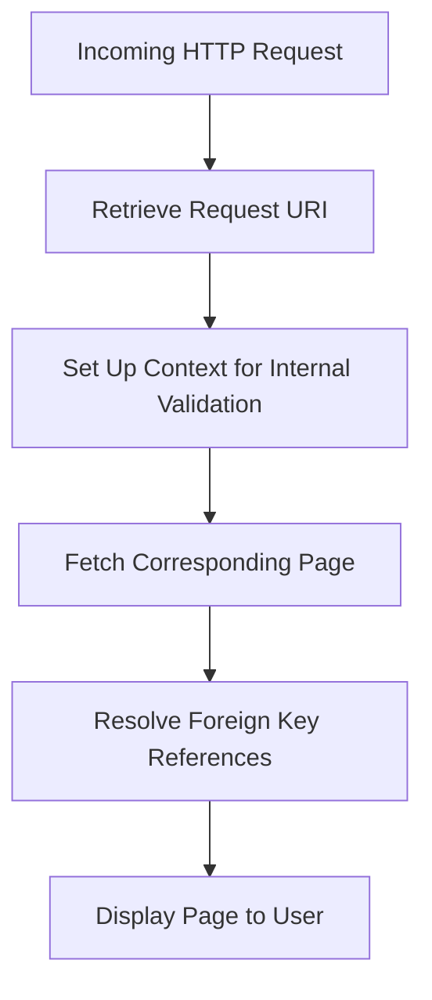

This document will cover the process of handling HTTP requests and displaying pages, which includes:

1. Retrieving the request URI
2. Setting up the context for internal validation
3. Fetching the corresponding page
4. Resolving any foreign key references
5. Displaying the page to the user.

Technical document: <SwmLink doc-title="Handling HTTP Requests and Displaying Pages">[Handling HTTP Requests and Displaying Pages](/.swm/handling-http-requests-and-displaying-pages.075q7mo5.sw.md)</SwmLink>

# [Retrieving the Request URI](https://app.swimm.io/repos/Z2l0aHViJTNBJTNBQnJvYWRsZWFmQ29tbWVyY2UtZGVtby1uZXclM0ElM0FTd2ltbS1EZW1v/docs/075q7mo5#gethandlerinternal)

When an HTTP request is received, the system first retrieves the request URI. This URI is essential as it helps in identifying which page the user is trying to access. The URI is decoded to ensure it is in a readable format for further processing.

# [Setting Up Context for Internal Validation](https://app.swimm.io/repos/Z2l0aHViJTNBJTNBQnJvYWRsZWFmQ29tbWVyY2UtZGVtby1uZXclM0ElM0FTd2ltbS1EZW1v/docs/075q7mo5#gethandlerinternal)

After retrieving the request URI, the system sets up the necessary context for internal validation. This involves preparing the environment to ensure that the request can be processed correctly. It includes setting flags and parameters that will be used in subsequent steps to validate and fetch the appropriate page.

# [Fetching the Corresponding Page](https://app.swimm.io/repos/Z2l0aHViJTNBJTNBQnJvYWRsZWFmQ29tbWVyY2UtZGVtby1uZXclM0ElM0FTd2ltbS1EZW1v/docs/075q7mo5#findpagebyuri)

The system then attempts to fetch the page that corresponds to the request URI. It first checks if the page is available in the cache to improve performance. If the page is not cached, it retrieves a list of potential pages from the database and evaluates them against predefined rules to find the most appropriate page.

# [Resolving Foreign Key References](https://app.swimm.io/repos/Z2l0aHViJTNBJTNBQnJvYWRsZWFmQ29tbWVyY2UtZGVtby1uZXclM0ElM0FTd2ltbS1EZW1v/docs/075q7mo5#hydrateforeignlookups)

Once a page is identified, the system checks for any foreign key references within the page's data. Foreign key references are links to other data entities that need to be resolved to display the page correctly. The system iterates through the page fields, identifies these references, and fetches the corresponding entities from the database.

# [Displaying the Page to the User](https://app.swimm.io/repos/Z2l0aHViJTNBJTNBQnJvYWRsZWFmQ29tbWVyY2UtZGVtby1uZXclM0ElM0FTd2ltbS1EZW1v/docs/075q7mo5#gethandlerinternal)

After resolving all necessary references, the system sets the page as a request attribute and prepares it for display. The page is then rendered and displayed to the user, completing the process of handling the HTTP request.

&nbsp;

*This is an auto-generated document by Swimm AI 🌊 and has not yet been verified by a human*

<SwmMeta version="3.0.0" repo-id="Z2l0aHViJTNBJTNBQnJvYWRsZWFmQ29tbWVyY2UtZGVtby1uZXclM0ElM0FTd2ltbS1EZW1v" repo-name="BroadleafCommerce-demo-new" doc-type="product-flows">Powered by [Swimm](/)</SwmMeta>
