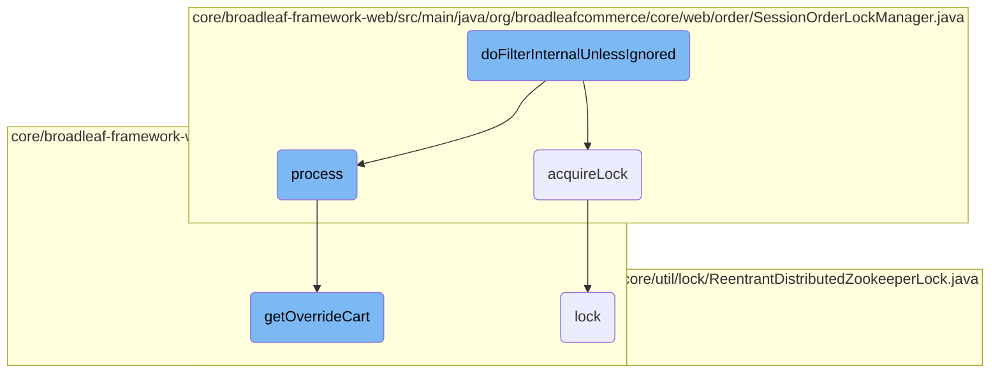

In this document, we will explain the process of handling requests that may require locking in an e-commerce application. The process involves checking if a request needs a lock, acquiring the lock if necessary, and ensuring data consistency by reloading the order from the database.

The flow starts by processing the incoming request to see if it needs a lock. If it doesn't, the request is passed along without any changes. If a lock is needed, the system tries to acquire it. Once the lock is obtained, the order is reloaded from the database to make sure everything is up-to-date. This ensures that only one thread can change the order at a time, preventing any conflicts.

# Flow drill down



<SwmSnippet path="/core/broadleaf-framework-web/src/main/java/org/broadleafcommerce/core/web/order/security/CartStateFilter.java" line="85">

---

## <SwmToken path="core/broadleaf-framework-web/src/main/java/org/broadleafcommerce/core/web/order/security/CartStateFilter.java" pos="86:5:5" line-data="    public void doFilterInternalUnlessIgnored(HttpServletRequest request, HttpServletResponse response, FilterChain chain)">`doFilterInternalUnlessIgnored`</SwmToken>

The <SwmToken path="core/broadleaf-framework-web/src/main/java/org/broadleafcommerce/core/web/order/security/CartStateFilter.java" pos="86:5:5" line-data="    public void doFilterInternalUnlessIgnored(HttpServletRequest request, HttpServletResponse response, FilterChain chain)">`doFilterInternalUnlessIgnored`</SwmToken> method is responsible for processing the incoming request and determining if it requires a lock. If a lock is required, it attempts to acquire it and reloads the order from the database to ensure data consistency. This method ensures that only one thread can modify the order at a time, preventing race conditions.

```java
    @Override
    public void doFilterInternalUnlessIgnored(HttpServletRequest request, HttpServletResponse response, FilterChain chain)
            throws IOException, ServletException {        
        cartStateProcessor.process(new ServletWebRequest(request, response));
        
        if (!requestRequiresLock(request)) {
            chain.doFilter(request, response);
            return;
        }

        Order order = CartState.getCart();

        if (LOG.isTraceEnabled()) {
            LOG.trace("Thread[" + Thread.currentThread().getId() + "] attempting to lock order[" + order.getId() + "]");
        }

        Object lockObject = null;
        try {
            if (lockObject == null) {
                if (getErrorInsteadOfQueue()) {
                    lockObject = orderLockManager.acquireLockIfAvailable(order);
```

---

</SwmSnippet>

<SwmSnippet path="/core/broadleaf-framework-web/src/main/java/org/broadleafcommerce/core/web/order/SessionOrderLockManager.java" line="56">

---

## <SwmToken path="core/broadleaf-framework-web/src/main/java/org/broadleafcommerce/core/web/order/SessionOrderLockManager.java" pos="63:5:5" line-data="    public Object acquireLock(Order order) {">`acquireLock`</SwmToken>

The <SwmToken path="core/broadleaf-framework-web/src/main/java/org/broadleafcommerce/core/web/order/SessionOrderLockManager.java" pos="63:5:5" line-data="    public Object acquireLock(Order order) {">`acquireLock`</SwmToken> method in <SwmToken path="core/broadleaf-framework-web/src/main/java/org/broadleafcommerce/core/web/order/SessionOrderLockManager.java" pos="46:4:4" line-data="public class SessionOrderLockManager implements OrderLockManager, ApplicationListener&lt;HttpSessionDestroyedEvent&gt; {">`SessionOrderLockManager`</SwmToken> is used to obtain a lock for the current session. This ensures that operations requiring a lock are executed sequentially, preventing concurrent modifications.

```java
    /**
     * Note that although this method accepts an {@link Order} parameter, it does not use it in any way. This 
     * session-based lock manager implementation will prevent all operations that are identified as requiring a
     * lock from happening in parallel. Instead, it will execute them sequentially as locks are released from 
     * previous implementations.
     */
    @Override
    public Object acquireLock(Order order) {
        ReentrantLock lockObject = getSessionLock();
        lockObject.lock();
        return lockObject;
    }
```

---

</SwmSnippet>

<SwmSnippet path="/core/broadleaf-framework-web/src/main/java/org/broadleafcommerce/core/web/order/security/CartStateRequestProcessor.java" line="99">

---

## process

The <SwmToken path="core/broadleaf-framework-web/src/main/java/org/broadleafcommerce/core/web/order/security/CartStateRequestProcessor.java" pos="100:5:5" line-data="    public void process(WebRequest request) {">`process`</SwmToken> method in <SwmToken path="core/broadleaf-framework-web/src/main/java/org/broadleafcommerce/core/web/order/security/CartStateFilter.java" pos="73:3:3" line-data="    protected CartStateRequestProcessor cartStateProcessor;">`CartStateRequestProcessor`</SwmToken> is responsible for associating a cart with the current request. It retrieves the customer from the request, looks up or creates a cart for the customer, and updates the request attributes with the cart information.

```java
    @Override
    public void process(WebRequest request) {
        Customer customer = CustomerState.getCustomer();

        if (customer == null) {
            LOG.info("No customer was found on the current request, no cart will be added to the current request. Ensure that the"
                    + " blCustomerStateFilter occurs prior to the blCartStateFilter");
            return;
        }

        ExtensionResultHolder<Order> erh = new ExtensionResultHolder<Order>();
        extensionManager.getProxy().lookupOrCreateCart(request, customer, erh);

        Order cart;
        if (erh.getResult() != null) {
            cart = orderService.findCartForCustomerWithEnhancements(customer, erh.getResult());
        } else {
            cart = getOverrideCart(request);
            if (cart == null && mergeCartNeeded(customer, request)) {
                if (LOG.isDebugEnabled()) {
                    LOG.debug("Merge cart required, calling mergeCart " + customer.getId());
```

---

</SwmSnippet>

<SwmSnippet path="/core/broadleaf-framework-web/src/main/java/org/broadleafcommerce/core/web/order/security/CartStateRequestProcessor.java" line="154">

---

### <SwmToken path="core/broadleaf-framework-web/src/main/java/org/broadleafcommerce/core/web/order/security/CartStateRequestProcessor.java" pos="154:5:5" line-data="    public Order getOverrideCart(WebRequest request) {">`getOverrideCart`</SwmToken>

The <SwmToken path="core/broadleaf-framework-web/src/main/java/org/broadleafcommerce/core/web/order/security/CartStateRequestProcessor.java" pos="154:5:5" line-data="    public Order getOverrideCart(WebRequest request) {">`getOverrideCart`</SwmToken> method checks if there is an override cart attribute in the session and retrieves the corresponding order. It ensures that the order is valid and not in a submitted or cancelled state.

```java
    public Order getOverrideCart(WebRequest request) {
        Long orderId = null;
        if (BLCRequestUtils.isOKtoUseSession(request)) {
            orderId = (Long) request.getAttribute(OVERRIDE_CART_ATTR_NAME, WebRequest.SCOPE_SESSION);
        }
        Order cart = null;
        if (orderId != null) {
            cart = orderService.findOrderById(orderId);
    
            if (cart == null || 
                    cart.getStatus().equals(OrderStatus.SUBMITTED) || 
                    cart.getStatus().equals(OrderStatus.CANCELLED)) {
                return null;
            }
        }

        return cart;
    }
```

---

</SwmSnippet>

<SwmSnippet path="/core/broadleaf-framework/src/main/java/org/broadleafcommerce/core/util/lock/ReentrantDistributedZookeeperLock.java" line="278">

---

## lock

The <SwmToken path="core/broadleaf-framework/src/main/java/org/broadleafcommerce/core/util/lock/ReentrantDistributedZookeeperLock.java" pos="279:5:5" line-data="    public void lock() {">`lock`</SwmToken> method in <SwmToken path="core/broadleaf-framework/src/main/java/org/broadleafcommerce/core/util/lock/ReentrantDistributedZookeeperLock.java" pos="51:11:11" line-data=" * Lock lock = new ReentrantDistributedZookeeperLock(zk, &quot;/solr-update/locks&quot;, &quot;solrUpdate_commandLock&quot;);">`ReentrantDistributedZookeeperLock`</SwmToken> is used to acquire a distributed lock using Zookeeper. This method ensures that the current thread obtains the lock, handling any interruptions appropriately.

```java
    @Override
    public void lock() {
        try {
            lockInternally(-1L);
        } catch (InterruptedException e) {
            Thread.currentThread().interrupt();
            throw new DistributedLockException("Thread was interruptted trying to obtain distributed lock from Zookeeper.", e);
        }
    }
```

---

</SwmSnippet>

&nbsp;

*This is an auto-generated document by Swimm AI 🌊 and has not yet been verified by a human*

<SwmMeta version="3.0.0" repo-id="Z2l0aHViJTNBJTNBQnJvYWRsZWFmQ29tbWVyY2UtZGVtby1uZXclM0ElM0FTd2ltbS1EZW1v" repo-name="BroadleafCommerce-demo-new" doc-type="flows"><sup>Powered by [Swimm](/)</sup></SwmMeta>
