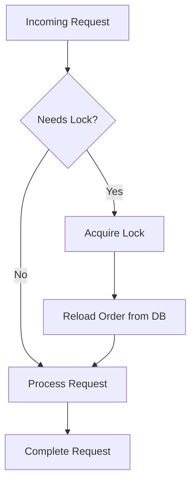

This document will cover the process of handling request locking in an e-commerce application. We'll cover:

1. Determining if a request needs a lock
2. Acquiring the lock
3. Reloading the order from the database.

Technical document: <SwmLink doc-title="Handling Request Locking">[Handling Request Locking](/.swm/handling-request-locking.4vmsk6xq.sw.md)</SwmLink>

# [Determining if a request needs a lock](https://app.swimm.io/repos/Z2l0aHViJTNBJTNBQnJvYWRsZWFmQ29tbWVyY2UtZGVtby1uZXclM0ElM0FTd2ltbS1EZW1v/docs/4vmsk6xq#dofilterinternalunlessignored)

When a request comes in, the system first checks if it requires a lock. This is determined based on the type of request and the current state of the order. If the request does not need a lock, it is processed normally without any changes. This step ensures that only requests that could potentially cause conflicts are locked, optimizing performance by avoiding unnecessary locking.

# [Acquiring the lock](https://app.swimm.io/repos/Z2l0aHViJTNBJTNBQnJvYWRsZWFmQ29tbWVyY2UtZGVtby1uZXclM0ElM0FTd2ltbS1EZW1v/docs/4vmsk6xq#acquirelock)

If the request requires a lock, the system attempts to acquire it. This involves obtaining a session-based lock that ensures no other thread can modify the order at the same time. This step is crucial for maintaining data consistency and preventing race conditions, where multiple threads try to update the same order simultaneously.

# [Reloading the order from the database](https://app.swimm.io/repos/Z2l0aHViJTNBJTNBQnJvYWRsZWFmQ29tbWVyY2UtZGVtby1uZXclM0ElM0FTd2ltbS1EZW1v/docs/4vmsk6xq#dofilterinternalunlessignored)

Once the lock is acquired, the order is reloaded from the database to ensure that the most up-to-date information is being used. This step is important because it guarantees that any changes made by other threads before the lock was acquired are taken into account. Reloading the order helps in maintaining the integrity of the data and ensures that the order state is consistent.

&nbsp;

*This is an auto-generated document by Swimm AI 🌊 and has not yet been verified by a human*

<SwmMeta version="3.0.0" repo-id="Z2l0aHViJTNBJTNBQnJvYWRsZWFmQ29tbWVyY2UtZGVtby1uZXclM0ElM0FTd2ltbS1EZW1v" repo-name="BroadleafCommerce-demo-new" doc-type="product-flows">Powered by [Swimm](/)</SwmMeta>
