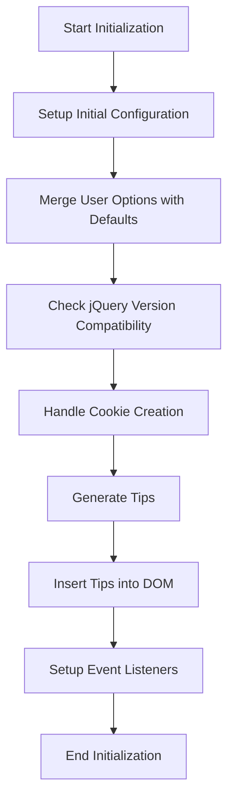

The initialization process for the Joyride plugin involves several key steps to ensure a smooth user experience. This document will cover:

1. Setting up initial configuration
2. Merging user options with default settings
3. Checking jQuery version compatibility
4. Handling cookie creation
5. Generating and displaying tips
6. Setting up event listeners for user interactions

Technical document: <SwmLink doc-title="Initialization Process">[Initialization Process](/.swm/initialization-process.t98kgk2e.sw.md)</SwmLink>

# [Setting up initial configuration](https://app.swimm.io/repos/Z2l0aHViJTNBJTNBQnJvYWRsZWFmQ29tbWVyY2UtZGVtby1uZXclM0ElM0FTd2ltbS1EZW1v/docs/t98kgk2e#initialization)

The initialization process begins by setting up the initial configuration for the Joyride plugin. This involves defining the basic settings and parameters that will be used throughout the plugin's operation. These settings include references to the document, window, and content elements, as well as the body offset and tip content. This step ensures that the plugin has all the necessary information to function correctly.

# [Merging user options with default settings](https://app.swimm.io/repos/Z2l0aHViJTNBJTNBQnJvYWRsZWFmQ29tbWVyY2UtZGVtby1uZXclM0ElM0FTd2ltbS1EZW1v/docs/t98kgk2e#initialization)

Next, the plugin merges any user-provided options with the default settings. This allows users to customize the behavior and appearance of the Joyride plugin according to their preferences. By combining user options with defaults, the plugin ensures that it operates with a complete set of configurations, enhancing flexibility and user satisfaction.

# [Checking jQuery version compatibility](https://app.swimm.io/repos/Z2l0aHViJTNBJTNBQnJvYWRsZWFmQ29tbWVyY2UtZGVtby1uZXclM0ElM0FTd2ltbS1EZW1v/docs/t98kgk2e#initialization)

The plugin then checks if the jQuery version being used is compatible with its requirements. This step is crucial to prevent any potential issues that could arise from version mismatches. Ensuring compatibility helps maintain the stability and reliability of the plugin, providing a seamless experience for the end user.

# [Handling cookie creation](https://app.swimm.io/repos/Z2l0aHViJTNBJTNBQnJvYWRsZWFmQ29tbWVyY2UtZGVtby1uZXclM0ElM0FTd2ltbS1EZW1v/docs/t98kgk2e#managing-cookies)

If necessary, the plugin handles the creation of cookies to manage user sessions and preferences. Cookies are used to store information such as the completion status of the tour, ensuring that users do not see the same tips repeatedly. This step enhances the user experience by providing a personalized and consistent interaction with the plugin.

# [Generating and displaying tips](https://app.swimm.io/repos/Z2l0aHViJTNBJTNBQnJvYWRsZWFmQ29tbWVyY2UtZGVtby1uZXclM0ElM0FTd2ltbS1EZW1v/docs/t98kgk2e#displaying-tips)

The plugin generates the tips that will be displayed to the user. These tips are created based on the configuration settings and user options. Once generated, the tips are inserted into the DOM (Document Object Model), making them visible on the webpage. This step is essential for guiding users through the tour and providing them with helpful information.

# [Setting up event listeners for user interactions](https://app.swimm.io/repos/Z2l0aHViJTNBJTNBQnJvYWRsZWFmQ29tbWVyY2UtZGVtby1uZXclM0ElM0FTd2ltbS1EZW1v/docs/t98kgk2e#initialization)

Finally, the plugin sets up event listeners to handle user interactions such as clicking on next or close buttons. These event listeners ensure that the plugin responds appropriately to user actions, advancing the tour or closing tips as needed. This step is crucial for creating an interactive and user-friendly experience.

&nbsp;

*This is an auto-generated document by Swimm AI 🌊 and has not yet been verified by a human*

<SwmMeta version="3.0.0" repo-id="Z2l0aHViJTNBJTNBQnJvYWRsZWFmQ29tbWVyY2UtZGVtby1uZXclM0ElM0FTd2ltbS1EZW1v" repo-name="BroadleafCommerce-demo-new" doc-type="product-flows">Powered by [Swimm](/)</SwmMeta>
