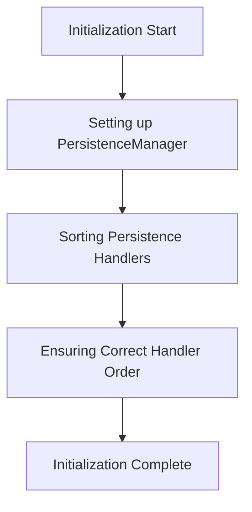

This document will cover the initialization process using the postConstruct method, which includes:

1. Setting up the PersistenceManager
2. Sorting persistence handlers
3. Ensuring correct handler order.

Technical document: <SwmLink doc-title="Initialization with postConstruct">[Initialization with postConstruct](/.swm/initialization-with-postconstruct.vbuggg38.sw.md)</SwmLink>

# [Setting up the PersistenceManager](https://app.swimm.io/repos/Z2l0aHViJTNBJTNBQnJvYWRsZWFmQ29tbWVyY2UtZGVtby1uZXclM0ElM0FTd2ltbS1EZW1v/docs/vbuggg38#postconstruct)

The initialization process begins with setting up the PersistenceManager. This involves configuring each PersistenceModule to use the PersistenceManager. This step ensures that all modules are correctly linked to the manager, allowing them to function cohesively within the system.

# [Sorting Persistence Handlers](https://app.swimm.io/repos/Z2l0aHViJTNBJTNBQnJvYWRsZWFmQ29tbWVyY2UtZGVtby1uZXclM0ElM0FTd2ltbS1EZW1v/docs/vbuggg38#postconstruct)

After setting up the PersistenceManager, the next step is to sort the persistence handlers. These handlers are responsible for managing various persistence-related events. Sorting them ensures that they are processed in the correct order, which is crucial for maintaining data integrity and consistency.

# [Ensuring Correct Handler Order](https://app.swimm.io/repos/Z2l0aHViJTNBJTNBQnJvYWRsZWFmQ29tbWVyY2UtZGVtby1uZXclM0ElM0FTd2ltbS1EZW1v/docs/vbuggg38#honorexplicitpersistencehandlersorting)

The final step in the initialization process is to ensure that the handlers are in the correct order. This involves honoring any explicitly declared orders for custom persistence handlers. By doing so, the system ensures that handlers with specific requirements are positioned appropriately, which helps in achieving the desired processing sequence.

&nbsp;

*This is an auto-generated document by Swimm AI 🌊 and has not yet been verified by a human*

<SwmMeta version="3.0.0" repo-id="Z2l0aHViJTNBJTNBQnJvYWRsZWFmQ29tbWVyY2UtZGVtby1uZXclM0ElM0FTd2ltbS1EZW1v" repo-name="BroadleafCommerce-demo-new" doc-type="product-flows">Powered by [Swimm](/)</SwmMeta>
