In this document, we will explain the initialization process for the Joyride plugin. The process involves setting up the initial configuration, merging user-provided options with default settings, checking for <SwmToken path="admin/broadleaf-open-admin-platform/src/main/resources/open_admin_style/js/admin/lib/plugins/jquery.foundation.joyride.js" pos="2:3:3" line-data=" * jQuery Foundation Joyride Plugin 2.0.3">`jQuery`</SwmToken> version compatibility, and handling cookie creation if necessary. It also includes generating the tips, inserting them into the DOM, and setting up event listeners for user interactions.

The initialization process starts by setting up the initial configuration and merging user options with default settings. It then checks if the <SwmToken path="admin/broadleaf-open-admin-platform/src/main/resources/open_admin_style/js/admin/lib/plugins/jquery.foundation.joyride.js" pos="2:3:3" line-data=" * jQuery Foundation Joyride Plugin 2.0.3">`jQuery`</SwmToken> version is compatible and handles cookie creation if needed. After that, it generates the tips and inserts them into the DOM. Finally, it sets up event listeners for user interactions like clicking on next or close buttons.

# Flow drill down

```mermaid
graph TD;
      subgraph admin/broadleaf-open-admin-platform/src/main/resources/open_admin_style/js/admin/lib/plugins
700a62dc1745e9198e985707597f0dbafeb38a9386371da3025d6f21e74eda69(init):::mainFlowStyle --> f89c6c149ddaa3277aaf847b652ff75f0effb5d4939a02c2ab2a6a3ce4d380ba(restart)
end

subgraph admin/broadleaf-open-admin-platform/src/main/resources/open_admin_style/js/admin/lib/plugins
700a62dc1745e9198e985707597f0dbafeb38a9386371da3025d6f21e74eda69(init):::mainFlowStyle --> 91509a0e1b40906ed568f6e8e5b50d65980239ff5090302340a8ef062a96ef75(end)
end

subgraph admin/broadleaf-open-admin-platform/src/main/resources/open_admin_style/js/admin/lib/plugins
700a62dc1745e9198e985707597f0dbafeb38a9386371da3025d6f21e74eda69(init):::mainFlowStyle --> 720628984f806e2658647ee6c3c90076459b5ce3db002d00004e211844d11be1(cookie)
end

subgraph admin/broadleaf-open-admin-platform/src/main/resources/open_admin_style/js/admin/lib/plugins
700a62dc1745e9198e985707597f0dbafeb38a9386371da3025d6f21e74eda69(init):::mainFlowStyle --> 0037cab790cf1eaf6a287f1f3a4356dad6f83ece17442092d11d802a0f256096(startTimer):::mainFlowStyle
end

subgraph admin/broadleaf-open-admin-platform/src/main/resources/open_admin_style/js/admin/lib/plugins
0037cab790cf1eaf6a287f1f3a4356dad6f83ece17442092d11d802a0f256096(startTimer):::mainFlowStyle --> 7db43f7a49d600d1fa2bd6fd4bf2e29204d7d963fe12716906091b6177e7c147(show):::mainFlowStyle
end

subgraph admin/broadleaf-open-admin-platform/src/main/resources/open_admin_style/js/admin/lib/plugins
720628984f806e2658647ee6c3c90076459b5ce3db002d00004e211844d11be1(cookie) --> 9266c80e3a5f8e82107fbd57c14b8c9b9b1f578e500c561910f2741db69ca4d6(shift)
end

subgraph admin/broadleaf-open-admin-platform/src/main/resources/open_admin_style/js/admin/lib/plugins
91509a0e1b40906ed568f6e8e5b50d65980239ff5090302340a8ef062a96ef75(end) --> 720628984f806e2658647ee6c3c90076459b5ce3db002d00004e211844d11be1(cookie)
end


      classDef mainFlowStyle color:#000000,fill:#7CB9F4
classDef rootsStyle color:#000000,fill:#00FFF4
classDef Style1 color:#000000,fill:#00FFAA
classDef Style2 color:#000000,fill:#FFFF00
classDef Style3 color:#000000,fill:#AA7CB9

%% Swimm:
%% graph TD;
%%       subgraph <SwmPath>[admin/broadleaf-open-admin-platform/src/main/resources/open_admin_style/js/admin/lib/plugins/](admin/broadleaf-open-admin-platform/src/main/resources/open_admin_style/js/admin/lib/plugins/)</SwmPath>
%% 700a62dc1745e9198e985707597f0dbafeb38a9386371da3025d6f21e74eda69(init):::mainFlowStyle --> f89c6c149ddaa3277aaf847b652ff75f0effb5d4939a02c2ab2a6a3ce4d380ba(restart)
%% end
%% 
%% subgraph <SwmPath>[admin/broadleaf-open-admin-platform/src/main/resources/open_admin_style/js/admin/lib/plugins/](admin/broadleaf-open-admin-platform/src/main/resources/open_admin_style/js/admin/lib/plugins/)</SwmPath>
%% 700a62dc1745e9198e985707597f0dbafeb38a9386371da3025d6f21e74eda69(init):::mainFlowStyle --> 91509a0e1b40906ed568f6e8e5b50d65980239ff5090302340a8ef062a96ef75(end)
%% end
%% 
%% subgraph <SwmPath>[admin/broadleaf-open-admin-platform/src/main/resources/open_admin_style/js/admin/lib/plugins/](admin/broadleaf-open-admin-platform/src/main/resources/open_admin_style/js/admin/lib/plugins/)</SwmPath>
%% 700a62dc1745e9198e985707597f0dbafeb38a9386371da3025d6f21e74eda69(init):::mainFlowStyle --> 720628984f806e2658647ee6c3c90076459b5ce3db002d00004e211844d11be1(cookie)
%% end
%% 
%% subgraph <SwmPath>[admin/broadleaf-open-admin-platform/src/main/resources/open_admin_style/js/admin/lib/plugins/](admin/broadleaf-open-admin-platform/src/main/resources/open_admin_style/js/admin/lib/plugins/)</SwmPath>
%% 700a62dc1745e9198e985707597f0dbafeb38a9386371da3025d6f21e74eda69(init):::mainFlowStyle --> 0037cab790cf1eaf6a287f1f3a4356dad6f83ece17442092d11d802a0f256096(startTimer):::mainFlowStyle
%% end
%% 
%% subgraph <SwmPath>[admin/broadleaf-open-admin-platform/src/main/resources/open_admin_style/js/admin/lib/plugins/](admin/broadleaf-open-admin-platform/src/main/resources/open_admin_style/js/admin/lib/plugins/)</SwmPath>
%% 0037cab790cf1eaf6a287f1f3a4356dad6f83ece17442092d11d802a0f256096(startTimer):::mainFlowStyle --> 7db43f7a49d600d1fa2bd6fd4bf2e29204d7d963fe12716906091b6177e7c147(show):::mainFlowStyle
%% end
%% 
%% subgraph <SwmPath>[admin/broadleaf-open-admin-platform/src/main/resources/open_admin_style/js/admin/lib/plugins/](admin/broadleaf-open-admin-platform/src/main/resources/open_admin_style/js/admin/lib/plugins/)</SwmPath>
%% 720628984f806e2658647ee6c3c90076459b5ce3db002d00004e211844d11be1(cookie) --> 9266c80e3a5f8e82107fbd57c14b8c9b9b1f578e500c561910f2741db69ca4d6(shift)
%% end
%% 
%% subgraph <SwmPath>[admin/broadleaf-open-admin-platform/src/main/resources/open_admin_style/js/admin/lib/plugins/](admin/broadleaf-open-admin-platform/src/main/resources/open_admin_style/js/admin/lib/plugins/)</SwmPath>
%% 91509a0e1b40906ed568f6e8e5b50d65980239ff5090302340a8ef062a96ef75(end) --> 720628984f806e2658647ee6c3c90076459b5ce3db002d00004e211844d11be1(cookie)
%% end
%% 
%% 
%%       classDef mainFlowStyle color:#000000,fill:#7CB9F4
%% classDef rootsStyle color:#000000,fill:#00FFF4
%% classDef Style1 color:#000000,fill:#00FFAA
%% classDef Style2 color:#000000,fill:#FFFF00
%% classDef Style3 color:#000000,fill:#AA7CB9
```



<SwmSnippet path="/admin/broadleaf-open-admin-platform/src/main/resources/open_admin_style/js/admin/lib/plugins/jquery.foundation.joyride.js" line="47">

---

## Initialization

The <SwmToken path="admin/broadleaf-open-admin-platform/src/main/resources/open_admin_style/js/admin/lib/plugins/jquery.foundation.joyride.js" pos="47:1:1" line-data="      init : function (opts) {">`init`</SwmToken> function is responsible for setting up the initial configuration for the Joyride plugin. It merges user-provided options with default settings, checks for <SwmToken path="admin/broadleaf-open-admin-platform/src/main/resources/open_admin_style/js/admin/lib/plugins/jquery.foundation.joyride.js" pos="2:3:3" line-data=" * jQuery Foundation Joyride Plugin 2.0.3">`jQuery`</SwmToken> version compatibility, and handles cookie creation if necessary. It also generates the tips and inserts them into the DOM, and sets up event listeners for user interactions such as clicking on next or close buttons.

```javascript
      init : function (opts) {
        return this.each(function () {

          if ($.isEmptyObject(settings)) {
            settings = $.extend(true, defaults, opts);

            // non configurable settings
            settings.document = window.document;
            settings.$document = $(settings.document);
            settings.$window = $(window);
            settings.$content_el = $(this);
            settings.body_offset = $(settings.tipContainer).position();
            settings.$tip_content = $('> li', settings.$content_el);
            settings.paused = false;
            settings.attempts = 0;

            settings.tipLocationPatterns = {
              top: ['bottom'],
              bottom: [], // bottom should not need to be repositioned
              left: ['right', 'top', 'bottom'],
              right: ['left', 'top', 'bottom']
```

---

</SwmSnippet>

<SwmSnippet path="/admin/broadleaf-open-admin-platform/src/main/resources/open_admin_style/js/admin/lib/plugins/jquery.foundation.joyride.js" line="370">

---

## Restarting the Tour

The <SwmToken path="admin/broadleaf-open-admin-platform/src/main/resources/open_admin_style/js/admin/lib/plugins/jquery.foundation.joyride.js" pos="370:1:1" line-data="      restart : function () {">`restart`</SwmToken> function hides the current tip, resets the current list item, and shows the first tip again. This is useful for restarting the tour from the beginning.

```javascript
      restart : function () {
        methods.hide();
        settings.$li = undefined;
        methods.show('init');
      },
```

---

</SwmSnippet>

<SwmSnippet path="/admin/broadleaf-open-admin-platform/src/main/resources/open_admin_style/js/admin/lib/plugins/jquery.foundation.joyride.js" line="581">

---

## Ending the Tour

The <SwmToken path="admin/broadleaf-open-admin-platform/src/main/resources/open_admin_style/js/admin/lib/plugins/jquery.foundation.joyride.js" pos="581:1:1" line-data="      end : function () {">`end`</SwmToken> function handles the cleanup process when the tour is finished. It sets a cookie to indicate that the tour has been completed, clears any active timers, hides the modal background, and calls post-step and post-ride callbacks.

```javascript
      end : function () {
        if (settings.cookieMonster) {
          $.cookie(settings.cookieName, 'ridden', { expires: 365, domain: settings.cookieDomain });
        }

        if (settings.timer > 0) {
          clearTimeout(settings.automate);
        }

        $('.joyride-modal-bg').hide();
        settings.$current_tip.hide();
        settings.postStepCallback(settings.$li.index(), settings.$current_tip);
        settings.postRideCallback(settings.$li.index(), settings.$current_tip);
      },
```

---

</SwmSnippet>

<SwmSnippet path="/admin/broadleaf-open-admin-platform/src/main/resources/open_admin_style/js/admin/lib/plugins/jquery.cookie.js" line="15">

---

## Managing Cookies

The <SwmToken path="admin/broadleaf-open-admin-platform/src/main/resources/open_admin_style/js/admin/lib/plugins/jquery.cookie.js" pos="15:2:2" line-data="  $.cookie = function (key, value, options) {">`cookie`</SwmToken> function is used to create, read, and delete cookies. It handles setting cookie attributes such as expiration, path, domain, and secure flag. This function is essential for managing user sessions and preferences.

```javascript
  $.cookie = function (key, value, options) {

    // key and at least value given, set cookie...
    if (value !== undefined && !/Object/.test(Object.prototype.toString.call(value))) {
      options = $.extend({}, $.cookie.defaults, options);

      if (value === null) {
        options.expires = -1;
      }

      if (typeof options.expires === 'number') {
        var days = options.expires, t = options.expires = new Date();
        t.setDate(t.getDate() + days);
      }

      value = String(value);

      return (document.cookie = [
        encodeURIComponent(key), '=', options.raw ? value : encodeURIComponent(value),
        options.expires ? '; expires=' + options.expires.toUTCString() : '', // use expires attribute, max-age is not supported by IE
        options.path    ? '; path=' + options.path : '',
```

---

</SwmSnippet>

<SwmSnippet path="/admin/broadleaf-open-admin-platform/src/main/resources/open_admin_style/js/admin/lib/plugins/jquery.foundation.joyride.js" line="569">

---

## Starting the Timer

The <SwmToken path="admin/broadleaf-open-admin-platform/src/main/resources/open_admin_style/js/admin/lib/plugins/jquery.foundation.joyride.js" pos="569:1:1" line-data="      startTimer : function () {">`startTimer`</SwmToken> function initiates a countdown timer that automatically advances the tour to the next step after a specified duration. If there are no more steps, it clears the timer.

```javascript
      startTimer : function () {
        if (settings.$li.length) {
          settings.automate = setTimeout(function () {
            methods.hide();
            methods.show();
            methods.startTimer();
          }, settings.timer);
        } else {
          clearTimeout(settings.automate);
        }
      },
```

---

</SwmSnippet>

<SwmSnippet path="/admin/broadleaf-open-admin-platform/src/main/resources/open_admin_style/js/admin/lib/plugins/jquery.foundation.joyride.js" line="190">

---

## Displaying Tips

The <SwmToken path="admin/broadleaf-open-admin-platform/src/main/resources/open_admin_style/js/admin/lib/plugins/jquery.foundation.joyride.js" pos="190:1:1" line-data="      show : function (init) {">`show`</SwmToken> function is responsible for displaying the current tip. It handles positioning, animation, and scrolling to ensure the tip is visible to the user. It also manages the transition between tips and handles cases where the target element is not found.

```javascript
      show : function (init) {
        var opts = {}, ii, opts_arr = [], opts_len = 0, p,
            $timer = null;

        // are we paused?
        if (settings.$li === undefined || ($.inArray(settings.$li.index(), settings.pauseAfter) === -1)) {

          // don't go to the next li if the tour was paused
          if (settings.paused) {
            settings.paused = false;
          } else {
            methods.set_li(init);
          }

          settings.attempts = 0;

          if (settings.$li.length && settings.$target.length > 0) {
            opts_arr = (settings.$li.data('options') || ':').split(';');
            opts_len = opts_arr.length;

            // parse options
```

---

</SwmSnippet>

<SwmSnippet path="/admin/broadleaf-open-admin-platform/src/main/resources/open_admin_style/js/admin/lib/plugins/jquery.foundation.orbit.js" line="508">

---

## Shifting Slides

The <SwmToken path="admin/broadleaf-open-admin-platform/src/main/resources/open_admin_style/js/admin/lib/plugins/jquery.foundation.orbit.js" pos="508:1:1" line-data="    shift: function (direction) {">`shift`</SwmToken> function manages the transition between slides in the Orbit slider. It handles different animation types such as fade, <SwmToken path="admin/broadleaf-open-admin-platform/src/main/resources/open_admin_style/js/admin/lib/plugins/jquery.foundation.orbit.js" pos="23:16:18" line-data="      animation: &#39;horizontal-push&#39;,     // fade, horizontal-slide, vertical-slide, horizontal-push, vertical-push">`horizontal-slide`</SwmToken>, <SwmToken path="admin/broadleaf-open-admin-platform/src/main/resources/open_admin_style/js/admin/lib/plugins/jquery.foundation.orbit.js" pos="23:21:23" line-data="      animation: &#39;horizontal-push&#39;,     // fade, horizontal-slide, vertical-slide, horizontal-push, vertical-push">`vertical-slide`</SwmToken>, and push. It also updates the active slide and bullet indicators.

```javascript
    shift: function (direction) {
      var slideDirection = direction;

      //remember previous activeSlide
      this.prevActiveSlide = this.activeSlide;

      //exit function if bullet clicked is same as the current image
      if (this.prevActiveSlide == slideDirection) { return false; }

      if (this.$slides.length == "1") { return false; }
      if (!this.locked) {
        this.lock();
        //deduce the proper activeImage
        if (direction == "next") {
          this.activeSlide++;
          if (this.activeSlide == this.numberSlides) {
              this.activeSlide = 0;
          }
        } else if (direction == "prev") {
          this.activeSlide--
          if (this.activeSlide < 0) {
```

---

</SwmSnippet>

&nbsp;

*This is an auto-generated document by Swimm AI 🌊 and has not yet been verified by a human*

<SwmMeta version="3.0.0" repo-id="Z2l0aHViJTNBJTNBQnJvYWRsZWFmQ29tbWVyY2UtZGVtby1uZXclM0ElM0FTd2ltbS1EZW1v" repo-name="BroadleafCommerce-demo-new" doc-type="flows"><sup>Powered by [Swimm](/)</sup></SwmMeta>
