In this document, we will explain the <SwmToken path="admin/broadleaf-open-admin-platform/src/main/java/org/broadleafcommerce/openadmin/server/service/persistence/PersistenceManagerImpl.java" pos="124:2:2" line-data="    @PostConstruct">`PostConstruct`</SwmToken> method, its purpose, and how it fits into the overall initialization process. The <SwmToken path="admin/broadleaf-open-admin-platform/src/main/java/org/broadleafcommerce/openadmin/server/service/persistence/PersistenceManagerImpl.java" pos="124:2:2" line-data="    @PostConstruct">`PostConstruct`</SwmToken> method is crucial for setting up the <SwmToken path="admin/broadleaf-open-admin-platform/src/main/java/org/broadleafcommerce/openadmin/server/service/persistence/PersistenceManagerImpl.java" pos="90:11:11" line-data="public class PersistenceManagerImpl implements InspectHelper, PersistenceManager, ApplicationContextAware {">`PersistenceManager`</SwmToken> and ensuring that all persistence handlers are correctly sorted and ready for use.

The <SwmToken path="admin/broadleaf-open-admin-platform/src/main/java/org/broadleafcommerce/openadmin/server/service/persistence/PersistenceManagerImpl.java" pos="124:2:2" line-data="    @PostConstruct">`PostConstruct`</SwmToken> method is like a setup routine that runs after everything is ready. Imagine you are setting up a new phone. First, you install all the apps (initializing properties), and then you arrange them on your home screen (sorting handlers). Finally, you make sure everything is in the right place (honoring explicit sorting). This method ensures that all the necessary components are in place and correctly ordered before the system starts handling tasks.

Here is a high level diagram of the flow, showing only the most important functions:

```mermaid
graph TD;
      subgraph admin/broadleaf-open-admin-platform/src/main/java/org/broadleafcommerce/openadmin/server/service/persistence/PersistenceManagerImpl.java
0d3e88712105914caf942ba17fd3b2531928ff80d7cff3a4ca535e5094041967(postConstruct):::mainFlowStyle --> ef3c8a4c3fc22528a80e40a144fd39a8cdae213da8e7b43687e3511179a485af(honorExplicitPersistenceHandlerSorting):::mainFlowStyle
end

subgraph admin/broadleaf-open-admin-platform/src/main/java/org/broadleafcommerce/openadmin/server/service/persistence/PersistenceManagerImpl.java
ef3c8a4c3fc22528a80e40a144fd39a8cdae213da8e7b43687e3511179a485af(honorExplicitPersistenceHandlerSorting):::mainFlowStyle --> 3f91c8df0213afc051969115a37bdff423ded42d02e59273ca4e7698380f7627(add):::mainFlowStyle
end

subgraph admin/broadleaf-open-admin-platform/src/main/java/org/broadleafcommerce/openadmin/server/service/persistence/PersistenceManagerImpl.java
3f91c8df0213afc051969115a37bdff423ded42d02e59273ca4e7698380f7627(add):::mainFlowStyle --> 78703d131a3e7e34a9908003578c6e778b6440d902851b80b5bafd9d0e92c143(executePostAddHandlers)
end

subgraph admin/broadleaf-open-admin-platform/src/main/java/org/broadleafcommerce/openadmin/server/service/persistence/PersistenceManagerImpl.java
3f91c8df0213afc051969115a37bdff423ded42d02e59273ca4e7698380f7627(add):::mainFlowStyle --> 21db18b4845a8f8b37168a183d9b7f42820f6525469fe7a26751f0aed5784da9(getCustomPersistenceHandlers):::mainFlowStyle
end

subgraph admin/broadleaf-open-admin-platform/src/main/java/org/broadleafcommerce/openadmin/server/service/persistence/PersistenceManagerImpl.java
21db18b4845a8f8b37168a183d9b7f42820f6525469fe7a26751f0aed5784da9(getCustomPersistenceHandlers):::mainFlowStyle --> 073b624faede818a8f8bf2f136f958f0d52fa6e96b5e5e2142d1b05d98147033(remove):::mainFlowStyle
end

subgraph admin/broadleaf-open-admin-platform/src/main/java/org/broadleafcommerce/openadmin/server/service/persistence/PersistenceManagerImpl.java
073b624faede818a8f8bf2f136f958f0d52fa6e96b5e5e2142d1b05d98147033(remove):::mainFlowStyle --> ec586af2eb236c6be3a6abfd1ebae6263eabe409a8dbd86c86c10f8cbde92300(executePostRemoveHandlers):::mainFlowStyle
end

subgraph admin/broadleaf-open-admin-platform/src/main/java/org/broadleafcommerce/openadmin/server/service/persistence/PersistenceManagerImpl.java
ec586af2eb236c6be3a6abfd1ebae6263eabe409a8dbd86c86c10f8cbde92300(executePostRemoveHandlers):::mainFlowStyle --> 23e83c4148b533e2f9256af9bec38cde552b4c678240926989819a297b842305(executeDeferredOperations):::mainFlowStyle
end

subgraph admin/broadleaf-open-admin-platform/src/main/java/org/broadleafcommerce/openadmin/server/service/persistence/PersistenceManagerImpl.java
23e83c4148b533e2f9256af9bec38cde552b4c678240926989819a297b842305(executeDeferredOperations):::mainFlowStyle --> 8a118ca49de03ffaeb215222a436d8ad17893861c3847aa72c5cfdef65ff6c23(update):::mainFlowStyle
end

subgraph admin/broadleaf-open-admin-platform/src/main/java/org/broadleafcommerce/openadmin/server/service/persistence/PersistenceManagerImpl.java
8a118ca49de03ffaeb215222a436d8ad17893861c3847aa72c5cfdef65ff6c23(update):::mainFlowStyle --> 55f403e76390d59a0ed07b188b28b98538efce49723816d62b3a6efbd6b478b0(getCompatibleModule):::mainFlowStyle
end

subgraph admin/broadleaf-open-admin-platform/src/main/resources/open_admin_style/js/admin
55f403e76390d59a0ed07b188b28b98538efce49723816d62b3a6efbd6b478b0(getCompatibleModule):::mainFlowStyle --> cf5fa59716bd2f0b585d4f8cd206c74d7ce1d70aaa3165b817320ca5c2d1a685(error):::mainFlowStyle
end

subgraph common/src/main/resources/common_style/js/BLC.js
cf5fa59716bd2f0b585d4f8cd206c74d7ce1d70aaa3165b817320ca5c2d1a685(error):::mainFlowStyle --> 735e8dabf9d808e57e1ae9226d6dc2bbd430d5caf620c06e056b1f2093d3b0a4(ajax):::mainFlowStyle
end

subgraph admin/broadleaf-open-admin-platform/src/main/resources/open_admin_style/js/admin
735e8dabf9d808e57e1ae9226d6dc2bbd430d5caf620c06e056b1f2093d3b0a4(ajax):::mainFlowStyle --> 27904be92202cd2eff089cef66b59791d02cebd758830360ad926dbf64c85e2d(callback)
end


      classDef mainFlowStyle color:#000000,fill:#7CB9F4
classDef rootsStyle color:#000000,fill:#00FFF4
classDef Style1 color:#000000,fill:#00FFAA
classDef Style2 color:#000000,fill:#FFFF00
classDef Style3 color:#000000,fill:#AA7CB9

%% Swimm:
%% graph TD;
%%       subgraph <SwmPath>[admin/broadleaf-open-admin-platform/src/main/java/org/broadleafcommerce/openadmin/server/service/persistence/PersistenceManagerImpl.java](admin/broadleaf-open-admin-platform/src/main/java/org/broadleafcommerce/openadmin/server/service/persistence/PersistenceManagerImpl.java)</SwmPath>
%% 0d3e88712105914caf942ba17fd3b2531928ff80d7cff3a4ca535e5094041967(postConstruct):::mainFlowStyle --> ef3c8a4c3fc22528a80e40a144fd39a8cdae213da8e7b43687e3511179a485af(honorExplicitPersistenceHandlerSorting):::mainFlowStyle
%% end
%% 
%% subgraph <SwmPath>[admin/broadleaf-open-admin-platform/src/main/java/org/broadleafcommerce/openadmin/server/service/persistence/PersistenceManagerImpl.java](admin/broadleaf-open-admin-platform/src/main/java/org/broadleafcommerce/openadmin/server/service/persistence/PersistenceManagerImpl.java)</SwmPath>
%% ef3c8a4c3fc22528a80e40a144fd39a8cdae213da8e7b43687e3511179a485af(honorExplicitPersistenceHandlerSorting):::mainFlowStyle --> 3f91c8df0213afc051969115a37bdff423ded42d02e59273ca4e7698380f7627(add):::mainFlowStyle
%% end
%% 
%% subgraph <SwmPath>[admin/broadleaf-open-admin-platform/src/main/java/org/broadleafcommerce/openadmin/server/service/persistence/PersistenceManagerImpl.java](admin/broadleaf-open-admin-platform/src/main/java/org/broadleafcommerce/openadmin/server/service/persistence/PersistenceManagerImpl.java)</SwmPath>
%% 3f91c8df0213afc051969115a37bdff423ded42d02e59273ca4e7698380f7627(add):::mainFlowStyle --> 78703d131a3e7e34a9908003578c6e778b6440d902851b80b5bafd9d0e92c143(executePostAddHandlers)
%% end
%% 
%% subgraph <SwmPath>[admin/broadleaf-open-admin-platform/src/main/java/org/broadleafcommerce/openadmin/server/service/persistence/PersistenceManagerImpl.java](admin/broadleaf-open-admin-platform/src/main/java/org/broadleafcommerce/openadmin/server/service/persistence/PersistenceManagerImpl.java)</SwmPath>
%% 3f91c8df0213afc051969115a37bdff423ded42d02e59273ca4e7698380f7627(add):::mainFlowStyle --> 21db18b4845a8f8b37168a183d9b7f42820f6525469fe7a26751f0aed5784da9(getCustomPersistenceHandlers):::mainFlowStyle
%% end
%% 
%% subgraph <SwmPath>[admin/broadleaf-open-admin-platform/src/main/java/org/broadleafcommerce/openadmin/server/service/persistence/PersistenceManagerImpl.java](admin/broadleaf-open-admin-platform/src/main/java/org/broadleafcommerce/openadmin/server/service/persistence/PersistenceManagerImpl.java)</SwmPath>
%% 21db18b4845a8f8b37168a183d9b7f42820f6525469fe7a26751f0aed5784da9(getCustomPersistenceHandlers):::mainFlowStyle --> 073b624faede818a8f8bf2f136f958f0d52fa6e96b5e5e2142d1b05d98147033(remove):::mainFlowStyle
%% end
%% 
%% subgraph <SwmPath>[admin/broadleaf-open-admin-platform/src/main/java/org/broadleafcommerce/openadmin/server/service/persistence/PersistenceManagerImpl.java](admin/broadleaf-open-admin-platform/src/main/java/org/broadleafcommerce/openadmin/server/service/persistence/PersistenceManagerImpl.java)</SwmPath>
%% 073b624faede818a8f8bf2f136f958f0d52fa6e96b5e5e2142d1b05d98147033(remove):::mainFlowStyle --> ec586af2eb236c6be3a6abfd1ebae6263eabe409a8dbd86c86c10f8cbde92300(executePostRemoveHandlers):::mainFlowStyle
%% end
%% 
%% subgraph <SwmPath>[admin/broadleaf-open-admin-platform/src/main/java/org/broadleafcommerce/openadmin/server/service/persistence/PersistenceManagerImpl.java](admin/broadleaf-open-admin-platform/src/main/java/org/broadleafcommerce/openadmin/server/service/persistence/PersistenceManagerImpl.java)</SwmPath>
%% ec586af2eb236c6be3a6abfd1ebae6263eabe409a8dbd86c86c10f8cbde92300(executePostRemoveHandlers):::mainFlowStyle --> 23e83c4148b533e2f9256af9bec38cde552b4c678240926989819a297b842305(executeDeferredOperations):::mainFlowStyle
%% end
%% 
%% subgraph <SwmPath>[admin/broadleaf-open-admin-platform/src/main/java/org/broadleafcommerce/openadmin/server/service/persistence/PersistenceManagerImpl.java](admin/broadleaf-open-admin-platform/src/main/java/org/broadleafcommerce/openadmin/server/service/persistence/PersistenceManagerImpl.java)</SwmPath>
%% 23e83c4148b533e2f9256af9bec38cde552b4c678240926989819a297b842305(executeDeferredOperations):::mainFlowStyle --> 8a118ca49de03ffaeb215222a436d8ad17893861c3847aa72c5cfdef65ff6c23(update):::mainFlowStyle
%% end
%% 
%% subgraph <SwmPath>[admin/broadleaf-open-admin-platform/src/main/java/org/broadleafcommerce/openadmin/server/service/persistence/PersistenceManagerImpl.java](admin/broadleaf-open-admin-platform/src/main/java/org/broadleafcommerce/openadmin/server/service/persistence/PersistenceManagerImpl.java)</SwmPath>
%% 8a118ca49de03ffaeb215222a436d8ad17893861c3847aa72c5cfdef65ff6c23(update):::mainFlowStyle --> 55f403e76390d59a0ed07b188b28b98538efce49723816d62b3a6efbd6b478b0(getCompatibleModule):::mainFlowStyle
%% end
%% 
%% subgraph <SwmPath>[admin/broadleaf-open-admin-platform/src/main/resources/open_admin_style/js/admin/](admin/broadleaf-open-admin-platform/src/main/resources/open_admin_style/js/admin/)</SwmPath>
%% 55f403e76390d59a0ed07b188b28b98538efce49723816d62b3a6efbd6b478b0(getCompatibleModule):::mainFlowStyle --> cf5fa59716bd2f0b585d4f8cd206c74d7ce1d70aaa3165b817320ca5c2d1a685(error):::mainFlowStyle
%% end
%% 
%% subgraph <SwmPath>[common/src/main/resources/common_style/js/BLC.js](common/src/main/resources/common_style/js/BLC.js)</SwmPath>
%% cf5fa59716bd2f0b585d4f8cd206c74d7ce1d70aaa3165b817320ca5c2d1a685(error):::mainFlowStyle --> 735e8dabf9d808e57e1ae9226d6dc2bbd430d5caf620c06e056b1f2093d3b0a4(ajax):::mainFlowStyle
%% end
%% 
%% subgraph <SwmPath>[admin/broadleaf-open-admin-platform/src/main/resources/open_admin_style/js/admin/](admin/broadleaf-open-admin-platform/src/main/resources/open_admin_style/js/admin/)</SwmPath>
%% 735e8dabf9d808e57e1ae9226d6dc2bbd430d5caf620c06e056b1f2093d3b0a4(ajax):::mainFlowStyle --> 27904be92202cd2eff089cef66b59791d02cebd758830360ad926dbf64c85e2d(callback)
%% end
%% 
%% 
%%       classDef mainFlowStyle color:#000000,fill:#7CB9F4
%% classDef rootsStyle color:#000000,fill:#00FFF4
%% classDef Style1 color:#000000,fill:#00FFAA
%% classDef Style2 color:#000000,fill:#FFFF00
%% classDef Style3 color:#000000,fill:#AA7CB9
```



# Flow drill down

First, we'll zoom into this section of the flow:

```mermaid
graph TD;
      subgraph admin/broadleaf-open-admin-platform/src/main/java/org/broadleafcommerce/openadmin/server/service/persistence/PersistenceManagerImpl.java
0d3e88712105914caf942ba17fd3b2531928ff80d7cff3a4ca535e5094041967(postConstruct):::mainFlowStyle --> ef3c8a4c3fc22528a80e40a144fd39a8cdae213da8e7b43687e3511179a485af(honorExplicitPersistenceHandlerSorting):::mainFlowStyle
end

subgraph admin/broadleaf-open-admin-platform/src/main/java/org/broadleafcommerce/openadmin/server/service/persistence/PersistenceManagerImpl.java
ef3c8a4c3fc22528a80e40a144fd39a8cdae213da8e7b43687e3511179a485af(honorExplicitPersistenceHandlerSorting):::mainFlowStyle --> 3f91c8df0213afc051969115a37bdff423ded42d02e59273ca4e7698380f7627(add):::mainFlowStyle
end

subgraph admin/broadleaf-open-admin-platform/src/main/java/org/broadleafcommerce/openadmin/server/service/persistence/PersistenceManagerImpl.java
3f91c8df0213afc051969115a37bdff423ded42d02e59273ca4e7698380f7627(add):::mainFlowStyle --> 78703d131a3e7e34a9908003578c6e778b6440d902851b80b5bafd9d0e92c143(executePostAddHandlers)
end

subgraph admin/broadleaf-open-admin-platform/src/main/java/org/broadleafcommerce/openadmin/server/service/persistence/PersistenceManagerImpl.java
3f91c8df0213afc051969115a37bdff423ded42d02e59273ca4e7698380f7627(add):::mainFlowStyle --> 21db18b4845a8f8b37168a183d9b7f42820f6525469fe7a26751f0aed5784da9(getCustomPersistenceHandlers):::mainFlowStyle
end

subgraph admin/broadleaf-open-admin-platform/src/main/java/org/broadleafcommerce/openadmin/server/service/persistence/PersistenceManagerImpl.java
21db18b4845a8f8b37168a183d9b7f42820f6525469fe7a26751f0aed5784da9(getCustomPersistenceHandlers):::mainFlowStyle --> mf83n(...)
end


      classDef mainFlowStyle color:#000000,fill:#7CB9F4
classDef rootsStyle color:#000000,fill:#00FFF4
classDef Style1 color:#000000,fill:#00FFAA
classDef Style2 color:#000000,fill:#FFFF00
classDef Style3 color:#000000,fill:#AA7CB9

%% Swimm:
%% graph TD;
%%       subgraph <SwmPath>[admin/broadleaf-open-admin-platform/src/main/java/org/broadleafcommerce/openadmin/server/service/persistence/PersistenceManagerImpl.java](admin/broadleaf-open-admin-platform/src/main/java/org/broadleafcommerce/openadmin/server/service/persistence/PersistenceManagerImpl.java)</SwmPath>
%% 0d3e88712105914caf942ba17fd3b2531928ff80d7cff3a4ca535e5094041967(postConstruct):::mainFlowStyle --> ef3c8a4c3fc22528a80e40a144fd39a8cdae213da8e7b43687e3511179a485af(honorExplicitPersistenceHandlerSorting):::mainFlowStyle
%% end
%% 
%% subgraph <SwmPath>[admin/broadleaf-open-admin-platform/src/main/java/org/broadleafcommerce/openadmin/server/service/persistence/PersistenceManagerImpl.java](admin/broadleaf-open-admin-platform/src/main/java/org/broadleafcommerce/openadmin/server/service/persistence/PersistenceManagerImpl.java)</SwmPath>
%% ef3c8a4c3fc22528a80e40a144fd39a8cdae213da8e7b43687e3511179a485af(honorExplicitPersistenceHandlerSorting):::mainFlowStyle --> 3f91c8df0213afc051969115a37bdff423ded42d02e59273ca4e7698380f7627(add):::mainFlowStyle
%% end
%% 
%% subgraph <SwmPath>[admin/broadleaf-open-admin-platform/src/main/java/org/broadleafcommerce/openadmin/server/service/persistence/PersistenceManagerImpl.java](admin/broadleaf-open-admin-platform/src/main/java/org/broadleafcommerce/openadmin/server/service/persistence/PersistenceManagerImpl.java)</SwmPath>
%% 3f91c8df0213afc051969115a37bdff423ded42d02e59273ca4e7698380f7627(add):::mainFlowStyle --> 78703d131a3e7e34a9908003578c6e778b6440d902851b80b5bafd9d0e92c143(executePostAddHandlers)
%% end
%% 
%% subgraph <SwmPath>[admin/broadleaf-open-admin-platform/src/main/java/org/broadleafcommerce/openadmin/server/service/persistence/PersistenceManagerImpl.java](admin/broadleaf-open-admin-platform/src/main/java/org/broadleafcommerce/openadmin/server/service/persistence/PersistenceManagerImpl.java)</SwmPath>
%% 3f91c8df0213afc051969115a37bdff423ded42d02e59273ca4e7698380f7627(add):::mainFlowStyle --> 21db18b4845a8f8b37168a183d9b7f42820f6525469fe7a26751f0aed5784da9(getCustomPersistenceHandlers):::mainFlowStyle
%% end
%% 
%% subgraph <SwmPath>[admin/broadleaf-open-admin-platform/src/main/java/org/broadleafcommerce/openadmin/server/service/persistence/PersistenceManagerImpl.java](admin/broadleaf-open-admin-platform/src/main/java/org/broadleafcommerce/openadmin/server/service/persistence/PersistenceManagerImpl.java)</SwmPath>
%% 21db18b4845a8f8b37168a183d9b7f42820f6525469fe7a26751f0aed5784da9(getCustomPersistenceHandlers):::mainFlowStyle --> mf83n(...)
%% end
%% 
%% 
%%       classDef mainFlowStyle color:#000000,fill:#7CB9F4
%% classDef rootsStyle color:#000000,fill:#00FFF4
%% classDef Style1 color:#000000,fill:#00FFAA
%% classDef Style2 color:#000000,fill:#FFFF00
%% classDef Style3 color:#000000,fill:#AA7CB9
```



<SwmSnippet path="/admin/broadleaf-open-admin-platform/src/main/java/org/broadleafcommerce/openadmin/server/service/persistence/PersistenceManagerImpl.java" line="124">

---

## <SwmToken path="admin/broadleaf-open-admin-platform/src/main/java/org/broadleafcommerce/openadmin/server/service/persistence/PersistenceManagerImpl.java" pos="124:2:2" line-data="    @PostConstruct">`PostConstruct`</SwmToken>

The <SwmToken path="admin/broadleaf-open-admin-platform/src/main/java/org/broadleafcommerce/openadmin/server/service/persistence/PersistenceManagerImpl.java" pos="124:2:2" line-data="    @PostConstruct">`PostConstruct`</SwmToken> method is annotated with <SwmToken path="admin/broadleaf-open-admin-platform/src/main/java/org/broadleafcommerce/openadmin/server/service/persistence/PersistenceManagerImpl.java" pos="124:1:2" line-data="    @PostConstruct">`@PostConstruct`</SwmToken>, indicating that it should be executed after the bean's properties have been initialized. This method sets the <SwmToken path="admin/broadleaf-open-admin-platform/src/main/java/org/broadleafcommerce/openadmin/server/service/persistence/PersistenceManagerImpl.java" pos="90:11:11" line-data="public class PersistenceManagerImpl implements InspectHelper, PersistenceManager, ApplicationContextAware {">`PersistenceManager`</SwmToken> for each <SwmToken path="admin/broadleaf-open-admin-platform/src/main/java/org/broadleafcommerce/openadmin/server/service/persistence/PersistenceManagerImpl.java" pos="126:4:4" line-data="        for (PersistenceModule module : modules) {">`PersistenceModule`</SwmToken> and sorts the <SwmToken path="admin/broadleaf-open-admin-platform/src/main/java/org/broadleafcommerce/openadmin/server/service/persistence/PersistenceManagerImpl.java" pos="129:5:5" line-data="        Collections.sort(persistenceManagerEventHandlers, new Comparator&lt;PersistenceManagerEventHandler&gt;() {">`persistenceManagerEventHandlers`</SwmToken> based on their order. Finally, it calls the <SwmToken path="admin/broadleaf-open-admin-platform/src/main/java/org/broadleafcommerce/openadmin/server/service/persistence/PersistenceManagerImpl.java" pos="135:1:1" line-data="        honorExplicitPersistenceHandlerSorting();">`honorExplicitPersistenceHandlerSorting`</SwmToken> method to ensure that custom persistence handlers with explicit orders are correctly positioned.

```java
    @PostConstruct
    public void postConstruct() {
        for (PersistenceModule module : modules) {
            module.setPersistenceManager(this);
        }
        Collections.sort(persistenceManagerEventHandlers, new Comparator<PersistenceManagerEventHandler>() {
            @Override
            public int compare(PersistenceManagerEventHandler o1, PersistenceManagerEventHandler o2) {
                return Integer.valueOf(o1.getOrder()).compareTo(Integer.valueOf(o2.getOrder()));
            }
        });
        honorExplicitPersistenceHandlerSorting();

    }
```

---

</SwmSnippet>

<SwmSnippet path="/admin/broadleaf-open-admin-platform/src/main/java/org/broadleafcommerce/openadmin/server/service/persistence/PersistenceManagerImpl.java" line="969">

---

## <SwmToken path="admin/broadleaf-open-admin-platform/src/main/java/org/broadleafcommerce/openadmin/server/service/persistence/PersistenceManagerImpl.java" pos="975:5:5" line-data="    protected void honorExplicitPersistenceHandlerSorting() {">`honorExplicitPersistenceHandlerSorting`</SwmToken>

The <SwmToken path="admin/broadleaf-open-admin-platform/src/main/java/org/broadleafcommerce/openadmin/server/service/persistence/PersistenceManagerImpl.java" pos="975:5:5" line-data="    protected void honorExplicitPersistenceHandlerSorting() {">`honorExplicitPersistenceHandlerSorting`</SwmToken> method ensures that custom persistence handlers with explicitly declared orders are correctly positioned within the list. It separates handlers with the default order from those with custom orders, then integrates the custom-ordered handlers into the sorted list at the appropriate positions.

```java
    /**
     * Honor ordering for those CPH instances that have explicitly declared a order other than the default order
     * This achieves several goals:
     * 1. We leave the general CPH population in its established order, which is the best for backwards compatibility
     * 2. Those items that are intended to get explicit ordering still achieve their goal
     */
    protected void honorExplicitPersistenceHandlerSorting() {
        List<CustomPersistenceHandler> exceptions = new ArrayList<>(customPersistenceHandlers.size());
        List<CustomPersistenceHandler> sorted = new ArrayList<>(customPersistenceHandlers.size());
        for (CustomPersistenceHandler handler : customPersistenceHandlers) {
            if (CustomPersistenceHandler.DEFAULT_ORDER == handler.getOrder()) {
                sorted.add(handler);
            } else {
                exceptions.add(handler);
            }
        }
        if (!CollectionUtils.isEmpty(exceptions)) {
            Integer position = 0;
            Map<Integer, List<CustomPersistenceHandler>> positions = new HashMap<>();
            for (CustomPersistenceHandler handler : sorted) {
                if (CollectionUtils.isEmpty(exceptions)) {
```

---

</SwmSnippet>

<SwmSnippet path="/admin/broadleaf-open-admin-platform/src/main/java/org/broadleafcommerce/openadmin/server/service/persistence/PersistenceManagerImpl.java" line="475">

---

## add

The <SwmToken path="admin/broadleaf-open-admin-platform/src/main/java/org/broadleafcommerce/openadmin/server/service/persistence/PersistenceManagerImpl.java" pos="476:5:5" line-data="    public PersistenceResponse add(PersistencePackage persistencePackage) throws ServiceException {">`add`</SwmToken> method handles the addition of a new entity. It first invokes pre-add event handlers and checks for custom persistence handlers that can handle the add operation. If no custom handler is found, it delegates the operation to the appropriate <SwmToken path="admin/broadleaf-open-admin-platform/src/main/java/org/broadleafcommerce/openadmin/server/service/persistence/PersistenceManagerImpl.java" pos="126:4:4" line-data="        for (PersistenceModule module : modules) {">`PersistenceModule`</SwmToken>. The method also processes any sub-packages and accumulates validation errors, if any. Finally, it calls <SwmToken path="admin/broadleaf-open-admin-platform/src/main/java/org/broadleafcommerce/openadmin/server/service/persistence/PersistenceManagerImpl.java" pos="596:5:5" line-data="    protected PersistenceResponse executePostAddHandlers(PersistencePackage persistencePackage, PersistenceResponse persistenceResponse) throws ServiceException {">`executePostAddHandlers`</SwmToken> to handle post-add operations.

```java
    @Override
    public PersistenceResponse add(PersistencePackage persistencePackage) throws ServiceException {
        for (PersistenceManagerEventHandler handler : persistenceManagerEventHandlers) {
            PersistenceManagerEventHandlerResponse response = handler.preAdd(this, persistencePackage);
            if (PersistenceManagerEventHandlerResponse.PersistenceManagerEventHandlerResponseStatus.HANDLED_BREAK==response.getStatus()) {
                break;
            }
        }
        //check to see if there is a custom handler registered
        //execute the root PersistencePackage
        Entity response;
        try {
            checkRoot: {
                //if there is a validation exception in the root check, let it bubble, as we need a valid, persisted
                //entity to execute the subPackage code later
                for (CustomPersistenceHandler handler : getCustomPersistenceHandlers()) {
                    if (handler.canHandleAdd(persistencePackage)) {
                        if (!handler.willHandleSecurity(persistencePackage)) {
                            adminRemoteSecurityService.securityCheck(persistencePackage, EntityOperationType.ADD);
                        }
                        response = handler.add(persistencePackage, dynamicEntityDao, (RecordHelper) getCompatibleModule(OperationType.BASIC));
```

---

</SwmSnippet>

<SwmSnippet path="/admin/broadleaf-open-admin-platform/src/main/java/org/broadleafcommerce/openadmin/server/service/persistence/PersistenceManagerImpl.java" line="596">

---

## <SwmToken path="admin/broadleaf-open-admin-platform/src/main/java/org/broadleafcommerce/openadmin/server/service/persistence/PersistenceManagerImpl.java" pos="596:5:5" line-data="    protected PersistenceResponse executePostAddHandlers(PersistencePackage persistencePackage, PersistenceResponse persistenceResponse) throws ServiceException {">`executePostAddHandlers`</SwmToken>

The <SwmToken path="admin/broadleaf-open-admin-platform/src/main/java/org/broadleafcommerce/openadmin/server/service/persistence/PersistenceManagerImpl.java" pos="596:5:5" line-data="    protected PersistenceResponse executePostAddHandlers(PersistencePackage persistencePackage, PersistenceResponse persistenceResponse) throws ServiceException {">`executePostAddHandlers`</SwmToken> method is responsible for executing post-add event handlers after an entity has been added. It flushes the <SwmToken path="admin/broadleaf-open-admin-platform/src/main/java/org/broadleafcommerce/openadmin/server/service/persistence/PersistenceManagerImpl.java" pos="597:1:1" line-data="        dynamicEntityDao.flush();">`dynamicEntityDao`</SwmToken>, sets the main entity name, and iterates through the <SwmToken path="admin/broadleaf-open-admin-platform/src/main/java/org/broadleafcommerce/openadmin/server/service/persistence/PersistenceManagerImpl.java" pos="599:10:10" line-data="        for (PersistenceManagerEventHandler handler : persistenceManagerEventHandlers) {">`persistenceManagerEventHandlers`</SwmToken> to invoke their <SwmToken path="admin/broadleaf-open-admin-platform/src/main/java/org/broadleafcommerce/openadmin/server/service/persistence/PersistenceManagerImpl.java" pos="600:9:9" line-data="            PersistenceManagerEventHandlerResponse response = handler.postAdd(this, persistenceResponse.getEntity(), persistencePackage);">`postAdd`</SwmToken> methods. It also supports legacy API by calling <SwmToken path="admin/broadleaf-open-admin-platform/src/main/java/org/broadleafcommerce/openadmin/server/service/persistence/PersistenceManagerImpl.java" pos="600:9:9" line-data="            PersistenceManagerEventHandlerResponse response = handler.postAdd(this, persistenceResponse.getEntity(), persistencePackage);">`postAdd`</SwmToken> and executes any deferred operations.

```java
    protected PersistenceResponse executePostAddHandlers(PersistencePackage persistencePackage, PersistenceResponse persistenceResponse) throws ServiceException {
        dynamicEntityDao.flush();
        setMainEntityName(persistencePackage, persistenceResponse.getEntity());
        for (PersistenceManagerEventHandler handler : persistenceManagerEventHandlers) {
            PersistenceManagerEventHandlerResponse response = handler.postAdd(this, persistenceResponse.getEntity(), persistencePackage);
            if (PersistenceManagerEventHandlerResponse.PersistenceManagerEventHandlerResponseStatus.HANDLED_BREAK==response.getStatus()) {
                persistenceResponse.setEntity(response.getEntity());
                if (!MapUtils.isEmpty(response.getAdditionalData())) {
                    persistenceResponse.getAdditionalData().putAll(response.getAdditionalData());
                }
                break;
            } else if (PersistenceManagerEventHandlerResponse.PersistenceManagerEventHandlerResponseStatus.HANDLED==response.getStatus()) {
                persistenceResponse.setEntity(response.getEntity());
                if (!MapUtils.isEmpty(response.getAdditionalData())) {
                    persistenceResponse.getAdditionalData().putAll(response.getAdditionalData());
                }
            }
        }
        //support legacy api
        persistenceResponse.setEntity(postAdd(persistenceResponse.getEntity(), persistencePackage));

```

---

</SwmSnippet>

Now, lets zoom into this section of the flow:

```mermaid
graph TD;
      subgraph admin/broadleaf-open-admin-platform/src/main
21db18b4845a8f8b37168a183d9b7f42820f6525469fe7a26751f0aed5784da9(getCustomPersistenceHandlers):::mainFlowStyle --> 073b624faede818a8f8bf2f136f958f0d52fa6e96b5e5e2142d1b05d98147033(remove):::mainFlowStyle
end

subgraph admin/broadleaf-open-admin-platform/src/main
073b624faede818a8f8bf2f136f958f0d52fa6e96b5e5e2142d1b05d98147033(remove):::mainFlowStyle --> ec586af2eb236c6be3a6abfd1ebae6263eabe409a8dbd86c86c10f8cbde92300(executePostRemoveHandlers):::mainFlowStyle
end

subgraph admin/broadleaf-open-admin-platform/src/main
ec586af2eb236c6be3a6abfd1ebae6263eabe409a8dbd86c86c10f8cbde92300(executePostRemoveHandlers):::mainFlowStyle --> 23e83c4148b533e2f9256af9bec38cde552b4c678240926989819a297b842305(executeDeferredOperations):::mainFlowStyle
end

subgraph admin/broadleaf-open-admin-platform/src/main
23e83c4148b533e2f9256af9bec38cde552b4c678240926989819a297b842305(executeDeferredOperations):::mainFlowStyle --> 8a118ca49de03ffaeb215222a436d8ad17893861c3847aa72c5cfdef65ff6c23(update):::mainFlowStyle
end

subgraph admin/broadleaf-open-admin-platform/src/main
8a118ca49de03ffaeb215222a436d8ad17893861c3847aa72c5cfdef65ff6c23(update):::mainFlowStyle --> 55f403e76390d59a0ed07b188b28b98538efce49723816d62b3a6efbd6b478b0(getCompatibleModule):::mainFlowStyle
end

subgraph admin/broadleaf-open-admin-platform/src/main
55f403e76390d59a0ed07b188b28b98538efce49723816d62b3a6efbd6b478b0(getCompatibleModule):::mainFlowStyle --> cf5fa59716bd2f0b585d4f8cd206c74d7ce1d70aaa3165b817320ca5c2d1a685(error):::mainFlowStyle
end

subgraph common/src/main/resources/common_style/js/BLC.js
cf5fa59716bd2f0b585d4f8cd206c74d7ce1d70aaa3165b817320ca5c2d1a685(error):::mainFlowStyle --> 735e8dabf9d808e57e1ae9226d6dc2bbd430d5caf620c06e056b1f2093d3b0a4(ajax):::mainFlowStyle
end


      classDef mainFlowStyle color:#000000,fill:#7CB9F4
classDef rootsStyle color:#000000,fill:#00FFF4
classDef Style1 color:#000000,fill:#00FFAA
classDef Style2 color:#000000,fill:#FFFF00
classDef Style3 color:#000000,fill:#AA7CB9

%% Swimm:
%% graph TD;
%%       subgraph <SwmPath>[admin/broadleaf-open-admin-platform/src/main/](admin/broadleaf-open-admin-platform/src/main/)</SwmPath>
%% 21db18b4845a8f8b37168a183d9b7f42820f6525469fe7a26751f0aed5784da9(getCustomPersistenceHandlers):::mainFlowStyle --> 073b624faede818a8f8bf2f136f958f0d52fa6e96b5e5e2142d1b05d98147033(remove):::mainFlowStyle
%% end
%% 
%% subgraph <SwmPath>[admin/broadleaf-open-admin-platform/src/main/](admin/broadleaf-open-admin-platform/src/main/)</SwmPath>
%% 073b624faede818a8f8bf2f136f958f0d52fa6e96b5e5e2142d1b05d98147033(remove):::mainFlowStyle --> ec586af2eb236c6be3a6abfd1ebae6263eabe409a8dbd86c86c10f8cbde92300(executePostRemoveHandlers):::mainFlowStyle
%% end
%% 
%% subgraph <SwmPath>[admin/broadleaf-open-admin-platform/src/main/](admin/broadleaf-open-admin-platform/src/main/)</SwmPath>
%% ec586af2eb236c6be3a6abfd1ebae6263eabe409a8dbd86c86c10f8cbde92300(executePostRemoveHandlers):::mainFlowStyle --> 23e83c4148b533e2f9256af9bec38cde552b4c678240926989819a297b842305(executeDeferredOperations):::mainFlowStyle
%% end
%% 
%% subgraph <SwmPath>[admin/broadleaf-open-admin-platform/src/main/](admin/broadleaf-open-admin-platform/src/main/)</SwmPath>
%% 23e83c4148b533e2f9256af9bec38cde552b4c678240926989819a297b842305(executeDeferredOperations):::mainFlowStyle --> 8a118ca49de03ffaeb215222a436d8ad17893861c3847aa72c5cfdef65ff6c23(update):::mainFlowStyle
%% end
%% 
%% subgraph <SwmPath>[admin/broadleaf-open-admin-platform/src/main/](admin/broadleaf-open-admin-platform/src/main/)</SwmPath>
%% 8a118ca49de03ffaeb215222a436d8ad17893861c3847aa72c5cfdef65ff6c23(update):::mainFlowStyle --> 55f403e76390d59a0ed07b188b28b98538efce49723816d62b3a6efbd6b478b0(getCompatibleModule):::mainFlowStyle
%% end
%% 
%% subgraph <SwmPath>[admin/broadleaf-open-admin-platform/src/main/](admin/broadleaf-open-admin-platform/src/main/)</SwmPath>
%% 55f403e76390d59a0ed07b188b28b98538efce49723816d62b3a6efbd6b478b0(getCompatibleModule):::mainFlowStyle --> cf5fa59716bd2f0b585d4f8cd206c74d7ce1d70aaa3165b817320ca5c2d1a685(error):::mainFlowStyle
%% end
%% 
%% subgraph <SwmPath>[common/src/main/resources/common_style/js/BLC.js](common/src/main/resources/common_style/js/BLC.js)</SwmPath>
%% cf5fa59716bd2f0b585d4f8cd206c74d7ce1d70aaa3165b817320ca5c2d1a685(error):::mainFlowStyle --> 735e8dabf9d808e57e1ae9226d6dc2bbd430d5caf620c06e056b1f2093d3b0a4(ajax):::mainFlowStyle
%% end
%% 
%% 
%%       classDef mainFlowStyle color:#000000,fill:#7CB9F4
%% classDef rootsStyle color:#000000,fill:#00FFF4
%% classDef Style1 color:#000000,fill:#00FFAA
%% classDef Style2 color:#000000,fill:#FFFF00
%% classDef Style3 color:#000000,fill:#AA7CB9
```



<SwmSnippet path="/admin/broadleaf-open-admin-platform/src/main/java/org/broadleafcommerce/openadmin/server/service/persistence/PersistenceManagerImpl.java" line="908">

---

## Handling Custom Persistence

The <SwmToken path="admin/broadleaf-open-admin-platform/src/main/java/org/broadleafcommerce/openadmin/server/service/persistence/PersistenceManagerImpl.java" pos="908:8:8" line-data="    public List&lt;CustomPersistenceHandler&gt; getCustomPersistenceHandlers() {">`getCustomPersistenceHandlers`</SwmToken> method retrieves and filters custom persistence handlers, ensuring they are sorted and ready for use in subsequent operations.

```java
    public List<CustomPersistenceHandler> getCustomPersistenceHandlers() {
        List<CustomPersistenceHandler> cloned = new ArrayList<>();
        cloned.addAll(customPersistenceHandlers);
        if (getCustomPersistenceHandlerFilters() != null) {
            for (CustomPersistenceHandlerFilter filter : getCustomPersistenceHandlerFilters()) {
                Iterator<CustomPersistenceHandler> itr = cloned.iterator();
                while (itr.hasNext()) {
                    CustomPersistenceHandler handler = itr.next();
                    if (!filter.shouldUseHandler(handler.getClass().getName())) {
                        itr.remove();
                    }
                }
            }
        }
        Collections.sort(cloned, new Comparator<CustomPersistenceHandler>() {
            @Override
            public int compare(CustomPersistenceHandler o1, CustomPersistenceHandler o2) {
                return new Integer(o1.getOrder()).compareTo(new Integer(o2.getOrder()));
            }
        });
        return cloned;
```

---

</SwmSnippet>

<SwmSnippet path="/admin/broadleaf-open-admin-platform/src/main/java/org/broadleafcommerce/openadmin/server/service/persistence/PersistenceManagerImpl.java" line="804">

---

## Removing Entities

The <SwmToken path="admin/broadleaf-open-admin-platform/src/main/java/org/broadleafcommerce/openadmin/server/service/persistence/PersistenceManagerImpl.java" pos="804:5:5" line-data="    public PersistenceResponse remove(PersistencePackage persistencePackage) throws ServiceException {">`remove`</SwmToken> method handles the removal of entities, checking for custom handlers and performing security checks before executing the removal.

```java
    public PersistenceResponse remove(PersistencePackage persistencePackage) throws ServiceException {
        for (PersistenceManagerEventHandler handler : persistenceManagerEventHandlers) {
            PersistenceManagerEventHandlerResponse response = handler.preRemove(this, persistencePackage);
            if (PersistenceManagerEventHandlerResponse.PersistenceManagerEventHandlerResponseStatus.HANDLED_BREAK==response.getStatus()) {
                break;
            }
        }
        //check to see if there is a custom handler registered
        for (CustomPersistenceHandler handler : getCustomPersistenceHandlers()) {
            if (handler.canHandleRemove(persistencePackage)) {
                if (!handler.willHandleSecurity(persistencePackage)) {
                    adminRemoteSecurityService.securityCheck(persistencePackage, EntityOperationType.REMOVE);
                }
                handler.remove(persistencePackage, dynamicEntityDao, (RecordHelper) getCompatibleModule(OperationType.BASIC));
                return executePostRemoveHandlers(persistencePackage, new PersistenceResponse());
            }
        }
        adminRemoteSecurityService.securityCheck(persistencePackage, EntityOperationType.REMOVE);
        PersistenceModule myModule = getCompatibleModule(persistencePackage.getPersistencePerspective().getOperationTypes().getRemoveType());
        myModule.remove(persistencePackage);

```

---

</SwmSnippet>

<SwmSnippet path="/admin/broadleaf-open-admin-platform/src/main/java/org/broadleafcommerce/openadmin/server/service/persistence/PersistenceManagerImpl.java" line="828">

---

## Executing Post-Remove Handlers

The <SwmToken path="admin/broadleaf-open-admin-platform/src/main/java/org/broadleafcommerce/openadmin/server/service/persistence/PersistenceManagerImpl.java" pos="828:5:5" line-data="    protected PersistenceResponse executePostRemoveHandlers(PersistencePackage persistencePackage, PersistenceResponse persistenceResponse) throws ServiceException {">`executePostRemoveHandlers`</SwmToken> method is responsible for executing any post-remove handlers and deferred operations after an entity is removed.

```java
    protected PersistenceResponse executePostRemoveHandlers(PersistencePackage persistencePackage, PersistenceResponse persistenceResponse) throws ServiceException {
        dynamicEntityDao.flush();
        setMainEntityName(persistencePackage, persistenceResponse.getEntity());
        for (PersistenceManagerEventHandler handler : persistenceManagerEventHandlers) {
            PersistenceManagerEventHandlerResponse response = handler.postRemove(this, persistencePackage);
            if (PersistenceManagerEventHandlerResponse.PersistenceManagerEventHandlerResponseStatus.HANDLED_BREAK==response.getStatus()) {
                if (!MapUtils.isEmpty(response.getAdditionalData())) {
                    persistenceResponse.getAdditionalData().putAll(response.getAdditionalData());
                }
                break;
            } else if (PersistenceManagerEventHandlerResponse.PersistenceManagerEventHandlerResponseStatus.HANDLED==response.getStatus()) {
                if (!MapUtils.isEmpty(response.getAdditionalData())) {
                    persistenceResponse.getAdditionalData().putAll(response.getAdditionalData());
                }
            }
        }

        executeDeferredOperations(persistencePackage);

        return persistenceResponse;
```

---

</SwmSnippet>

<SwmSnippet path="/admin/broadleaf-open-admin-platform/src/main/java/org/broadleafcommerce/openadmin/server/service/persistence/PersistenceManagerImpl.java" line="622">

---

## Executing Deferred Operations

The <SwmToken path="admin/broadleaf-open-admin-platform/src/main/java/org/broadleafcommerce/openadmin/server/service/persistence/PersistenceManagerImpl.java" pos="622:5:5" line-data="    protected void executeDeferredOperations(PersistencePackage persistencePackage) throws ServiceException {">`executeDeferredOperations`</SwmToken> method processes deferred operations such as updates, additions, and deletions that were postponed during the main operation.

```java
    protected void executeDeferredOperations(PersistencePackage persistencePackage) throws ServiceException {
        if (!persistencePackage.getDeferredOperations().isEmpty()) {
            for (Map.Entry<ChangeType, List<PersistencePackage>> entry : persistencePackage.getDeferredOperations().entrySet()) {
                for (PersistencePackage change : entry.getValue()) {
                    switch (entry.getKey()) {
                        case UPDATE:
                            update(change);
                            break;
                        case ADD:
                            add(change);
                            break;
                        case DELETE:
                            remove(change);
                            break;
                    }
                }
            }
        }
        for (Map.Entry<String, PersistencePackage> subPackage : persistencePackage.getSubPackages().entrySet()) {
            for (Map.Entry<ChangeType, List<PersistencePackage>> entry : subPackage.getValue().getDeferredOperations().entrySet()) {
                for (PersistencePackage change : entry.getValue()) {
```

---

</SwmSnippet>

<SwmSnippet path="/admin/broadleaf-open-admin-platform/src/main/java/org/broadleafcommerce/openadmin/server/service/persistence/PersistenceManagerImpl.java" line="675">

---

## Updating Entities

The <SwmToken path="admin/broadleaf-open-admin-platform/src/main/java/org/broadleafcommerce/openadmin/server/service/persistence/PersistenceManagerImpl.java" pos="675:5:5" line-data="    public PersistenceResponse update(PersistencePackage persistencePackage) throws ServiceException {">`update`</SwmToken> method handles the updating of entities, including security checks, validation, and executing custom handlers if available.

```java
    public PersistenceResponse update(PersistencePackage persistencePackage) throws ServiceException {
        for (PersistenceManagerEventHandler handler : persistenceManagerEventHandlers) {
            PersistenceManagerEventHandlerResponse response = handler.preUpdate(this, persistencePackage);
            if (PersistenceManagerEventHandlerResponse.PersistenceManagerEventHandlerResponseStatus.HANDLED_BREAK==response.getStatus()) {
                break;
            }
        }
        //check to see if there is a custom handler registered
        //execute the root PersistencePackage
        Entity response;
        try {
            checkRoot: {
                for (CustomPersistenceHandler handler : getCustomPersistenceHandlers()) {
                    if (handler.canHandleUpdate(persistencePackage)) {
                        if (!handler.willHandleSecurity(persistencePackage)) {
                            adminRemoteSecurityService.securityCheck(persistencePackage, EntityOperationType.UPDATE);
                        }
                        response = handler.update(persistencePackage, dynamicEntityDao, (RecordHelper) getCompatibleModule(OperationType.BASIC));
                        break checkRoot;
                    }
                }
```

---

</SwmSnippet>

<SwmSnippet path="/admin/broadleaf-open-admin-platform/src/main/java/org/broadleafcommerce/openadmin/server/service/persistence/PersistenceManagerImpl.java" line="851">

---

## Module Compatibility

The <SwmToken path="admin/broadleaf-open-admin-platform/src/main/java/org/broadleafcommerce/openadmin/server/service/persistence/PersistenceManagerImpl.java" pos="851:5:5" line-data="    public PersistenceModule getCompatibleModule(OperationType operationType) {">`getCompatibleModule`</SwmToken> method determines the appropriate module to handle a given operation type, ensuring the correct processing of the operation.

```java
    public PersistenceModule getCompatibleModule(OperationType operationType) {
        PersistenceModule myModule = null;
        for (PersistenceModule module : modules) {
            if (module.isCompatible(operationType)) {
                myModule = module;
                break;
            }
        }
        if (myModule == null) {
            LOG.error("Unable to find a compatible remote service module for the operation type: " + operationType);
            throw new RuntimeException("Unable to find a compatible remote service module for the operation type: " + operationType);
        }

        return myModule;
    }
```

---

</SwmSnippet>

&nbsp;

*This is an auto-generated document by Swimm AI 🌊 and has not yet been verified by a human*

<SwmMeta version="3.0.0" repo-id="Z2l0aHViJTNBJTNBQnJvYWRsZWFmQ29tbWVyY2UtZGVtby1uZXclM0ElM0FTd2ltbS1EZW1v" repo-name="BroadleafCommerce-demo-new" doc-type="flows"><sup>Powered by [Swimm](/)</sup></SwmMeta>
