In this document, we will explain the process of initializing a date-time picker. The process involves checking the state of the input field, setting a timeout for initialization, and creating the date-time picker UI elements.

The flow starts when an input field is interacted with (opened, focused, or clicked). First, it checks if the input is disabled, hidden, or already has a date-time picker. If none of these conditions are met, it sets a timeout to initialize the date-time picker. After the timeout, it creates the date-time picker UI elements and sets up its options. Finally, it updates the UI to reflect the selected date and time.

# Flow drill down

```mermaid
graph TD;
      subgraph admin/broadleaf-open-admin-platform/src/main/resources/open_admin_style/js/admin/lib/plugins
e44e79370ba64d0a1118b433364cde802b7365e18dbcbf9401d1fc2842878da3(initOnActionCallback):::mainFlowStyle --> c4b78b471189dd65024d7e68c5d86d801d41ef8ad705f7daebccf9617da08929(createDateTimePicker):::mainFlowStyle
end

subgraph admin/broadleaf-open-admin-platform/src/main/resources/open_admin_style/js/admin/lib/plugins
c4b78b471189dd65024d7e68c5d86d801d41ef8ad705f7daebccf9617da08929(createDateTimePicker):::mainFlowStyle --> 478af971df1cc58a2b19fa2f81e6f77e376c3e569893160674868bd2ce48db6b(xdsoftScroller)
end

subgraph admin/broadleaf-open-admin-platform/src/main/resources/open_admin_style/js/admin/lib/plugins
c4b78b471189dd65024d7e68c5d86d801d41ef8ad705f7daebccf9617da08929(createDateTimePicker):::mainFlowStyle --> 216f584e095c79b2f2bf2751a84cd65c133c366ca5f256881cdaf0962fbc3705(show)
end

subgraph admin/broadleaf-open-admin-platform/src/main/resources/open_admin_style/js/admin/lib/plugins
c4b78b471189dd65024d7e68c5d86d801d41ef8ad705f7daebccf9617da08929(createDateTimePicker):::mainFlowStyle --> e99c22fca9e5d0821ab37e591218b4bb971aee4b41dfc962830547b904d271f4(setOptions):::mainFlowStyle
end

subgraph admin/broadleaf-open-admin-platform/src/main/resources/open_admin_style/js/admin/lib/plugins
216f584e095c79b2f2bf2751a84cd65c133c366ca5f256881cdaf0962fbc3705(show) --> c2075116c18ea5b28bdccc5f48fd1e869761de9ba9bd384813190b87b4046f61(reflow)
end

subgraph admin/broadleaf-open-admin-platform/src/main/resources/open_admin_style/js/admin/lib/plugins
216f584e095c79b2f2bf2751a84cd65c133c366ca5f256881cdaf0962fbc3705(show) --> eeefc90edb35bd32ed31ecb4a4b5b3a0b232df48d153e328de117a1fc73ad18f(updateUI)
end

subgraph admin/broadleaf-open-admin-platform/src/main/resources/open_admin_style/js/admin/lib/plugins
478af971df1cc58a2b19fa2f81e6f77e376c3e569893160674868bd2ce48db6b(xdsoftScroller) --> 216f584e095c79b2f2bf2751a84cd65c133c366ca5f256881cdaf0962fbc3705(show)
end


      classDef mainFlowStyle color:#000000,fill:#7CB9F4
classDef rootsStyle color:#000000,fill:#00FFF4
classDef Style1 color:#000000,fill:#00FFAA
classDef Style2 color:#000000,fill:#FFFF00
classDef Style3 color:#000000,fill:#AA7CB9

%% Swimm:
%% graph TD;
%%       subgraph <SwmPath>[admin/broadleaf-open-admin-platform/src/main/resources/open_admin_style/js/admin/lib/plugins/](admin/broadleaf-open-admin-platform/src/main/resources/open_admin_style/js/admin/lib/plugins/)</SwmPath>
%% e44e79370ba64d0a1118b433364cde802b7365e18dbcbf9401d1fc2842878da3(initOnActionCallback):::mainFlowStyle --> c4b78b471189dd65024d7e68c5d86d801d41ef8ad705f7daebccf9617da08929(createDateTimePicker):::mainFlowStyle
%% end
%% 
%% subgraph <SwmPath>[admin/broadleaf-open-admin-platform/src/main/resources/open_admin_style/js/admin/lib/plugins/](admin/broadleaf-open-admin-platform/src/main/resources/open_admin_style/js/admin/lib/plugins/)</SwmPath>
%% c4b78b471189dd65024d7e68c5d86d801d41ef8ad705f7daebccf9617da08929(createDateTimePicker):::mainFlowStyle --> 478af971df1cc58a2b19fa2f81e6f77e376c3e569893160674868bd2ce48db6b(xdsoftScroller)
%% end
%% 
%% subgraph <SwmPath>[admin/broadleaf-open-admin-platform/src/main/resources/open_admin_style/js/admin/lib/plugins/](admin/broadleaf-open-admin-platform/src/main/resources/open_admin_style/js/admin/lib/plugins/)</SwmPath>
%% c4b78b471189dd65024d7e68c5d86d801d41ef8ad705f7daebccf9617da08929(createDateTimePicker):::mainFlowStyle --> 216f584e095c79b2f2bf2751a84cd65c133c366ca5f256881cdaf0962fbc3705(show)
%% end
%% 
%% subgraph <SwmPath>[admin/broadleaf-open-admin-platform/src/main/resources/open_admin_style/js/admin/lib/plugins/](admin/broadleaf-open-admin-platform/src/main/resources/open_admin_style/js/admin/lib/plugins/)</SwmPath>
%% c4b78b471189dd65024d7e68c5d86d801d41ef8ad705f7daebccf9617da08929(createDateTimePicker):::mainFlowStyle --> e99c22fca9e5d0821ab37e591218b4bb971aee4b41dfc962830547b904d271f4(setOptions):::mainFlowStyle
%% end
%% 
%% subgraph <SwmPath>[admin/broadleaf-open-admin-platform/src/main/resources/open_admin_style/js/admin/lib/plugins/](admin/broadleaf-open-admin-platform/src/main/resources/open_admin_style/js/admin/lib/plugins/)</SwmPath>
%% 216f584e095c79b2f2bf2751a84cd65c133c366ca5f256881cdaf0962fbc3705(show) --> c2075116c18ea5b28bdccc5f48fd1e869761de9ba9bd384813190b87b4046f61(reflow)
%% end
%% 
%% subgraph <SwmPath>[admin/broadleaf-open-admin-platform/src/main/resources/open_admin_style/js/admin/lib/plugins/](admin/broadleaf-open-admin-platform/src/main/resources/open_admin_style/js/admin/lib/plugins/)</SwmPath>
%% 216f584e095c79b2f2bf2751a84cd65c133c366ca5f256881cdaf0962fbc3705(show) --> eeefc90edb35bd32ed31ecb4a4b5b3a0b232df48d153e328de117a1fc73ad18f(updateUI)
%% end
%% 
%% subgraph <SwmPath>[admin/broadleaf-open-admin-platform/src/main/resources/open_admin_style/js/admin/lib/plugins/](admin/broadleaf-open-admin-platform/src/main/resources/open_admin_style/js/admin/lib/plugins/)</SwmPath>
%% 478af971df1cc58a2b19fa2f81e6f77e376c3e569893160674868bd2ce48db6b(xdsoftScroller) --> 216f584e095c79b2f2bf2751a84cd65c133c366ca5f256881cdaf0962fbc3705(show)
%% end
%% 
%% 
%%       classDef mainFlowStyle color:#000000,fill:#7CB9F4
%% classDef rootsStyle color:#000000,fill:#00FFF4
%% classDef Style1 color:#000000,fill:#00FFAA
%% classDef Style2 color:#000000,fill:#FFFF00
%% classDef Style3 color:#000000,fill:#AA7CB9
```



<SwmSnippet path="/admin/broadleaf-open-admin-platform/src/main/resources/open_admin_style/js/admin/lib/plugins/jquery.datetimepicker.js" line="697">

---

## <SwmToken path="admin/broadleaf-open-admin-platform/src/main/resources/open_admin_style/js/admin/lib/plugins/jquery.datetimepicker.js" pos="697:21:21" line-data="					.on(&#39;open.xdsoft focusin.xdsoft mousedown.xdsoft&#39;, function initOnActionCallback(event) {">`initOnActionCallback`</SwmToken>

The <SwmToken path="admin/broadleaf-open-admin-platform/src/main/resources/open_admin_style/js/admin/lib/plugins/jquery.datetimepicker.js" pos="697:21:21" line-data="					.on(&#39;open.xdsoft focusin.xdsoft mousedown.xdsoft&#39;, function initOnActionCallback(event) {">`initOnActionCallback`</SwmToken> function initializes the date-time picker when certain events occur on the input field. It checks if the input is disabled, hidden, or already has a date-time picker initialized. If not, it sets a timeout to initialize the date-time picker by calling <SwmToken path="admin/broadleaf-open-admin-platform/src/main/resources/open_admin_style/js/admin/lib/plugins/jquery.datetimepicker.js" pos="705:1:1" line-data="								createDateTimePicker(input);">`createDateTimePicker`</SwmToken>.

```javascript
					.on('open.xdsoft focusin.xdsoft mousedown.xdsoft', function initOnActionCallback(event) {
						if (input.is(':disabled') || input.is(':hidden') || !input.is(':visible') || input.data('xdsoft_datetimepicker')) {
							return;
						}
						clearTimeout(lazyInitTimer);
						lazyInitTimer = setTimeout(function () {

							if (!input.data('xdsoft_datetimepicker')) {
								createDateTimePicker(input);
							}
							input
								.off('open.xdsoft focusin.xdsoft mousedown.xdsoft', initOnActionCallback)
								.trigger('open.xdsoft');
						}, 100);
					});
```

---

</SwmSnippet>

<SwmSnippet path="/admin/broadleaf-open-admin-platform/src/main/resources/open_admin_style/js/admin/lib/plugins/jquery.datetimepicker.js" line="714">

---

## <SwmToken path="admin/broadleaf-open-admin-platform/src/main/resources/open_admin_style/js/admin/lib/plugins/jquery.datetimepicker.js" pos="714:1:1" line-data="		createDateTimePicker = function (input) {">`createDateTimePicker`</SwmToken>

The <SwmToken path="admin/broadleaf-open-admin-platform/src/main/resources/open_admin_style/js/admin/lib/plugins/jquery.datetimepicker.js" pos="714:1:1" line-data="		createDateTimePicker = function (input) {">`createDateTimePicker`</SwmToken> function is responsible for creating the date-time picker UI elements and setting up its options. It creates various HTML elements like date picker, month picker, and time picker, and appends them to the input field. It also sets options for the date-time picker using the <SwmToken path="admin/broadleaf-open-admin-platform/src/main/resources/open_admin_style/js/admin/lib/plugins/jquery.datetimepicker.js" pos="803:3:3" line-data="			datetimepicker.setOptions = function (_options) {">`setOptions`</SwmToken> function.

```javascript
		createDateTimePicker = function (input) {
			var datetimepicker = $('<div ' + (options.id ? 'id="' + options.id + '"' : '') + ' ' + (options.style ? 'style="' + options.style + '"' : '') + ' class="xdsoft_datetimepicker xdsoft_' + options.theme + ' xdsoft_noselect ' + (options.weeks ? ' xdsoft_showweeks' : '') + options.className + '"></div>'),
				xdsoft_copyright = $('<div class="xdsoft_copyright"><a target="_blank" href="http://xdsoft.net/jqplugins/datetimepicker/">xdsoft.net</a></div>'),
				datepicker = $('<div class="xdsoft_datepicker active"></div>'),
				mounth_picker = $('<div class="xdsoft_mounthpicker"><button type="button" class="xdsoft_prev"></button><button type="button" class="xdsoft_today_button"></button>' +
					'<div class="xdsoft_label xdsoft_month"><span></span><i></i></div>' +
					'<div class="xdsoft_label xdsoft_year"><span></span><i></i></div>' +
					'<button type="button" class="xdsoft_next"></button></div>'),
				calendar = $('<div class="xdsoft_calendar"></div>'),
				timepicker = $('<div class="xdsoft_timepicker active"><button type="button" class="xdsoft_prev"></button><div class="xdsoft_time_box"></div><button type="button" class="xdsoft_next"></button></div>'),
				timeboxparent = timepicker.find('.xdsoft_time_box').eq(0),
				timebox = $('<div class="xdsoft_time_variant"></div>'),
				/*scrollbar = $('<div class="xdsoft_scrollbar"></div>'),
				scroller = $('<div class="xdsoft_scroller"></div>'),*/
				monthselect = $('<div class="xdsoft_select xdsoft_monthselect"><div></div></div>'),
				yearselect = $('<div class="xdsoft_select xdsoft_yearselect"><div></div></div>'),
				triggerAfterOpen = false,
				XDSoft_datetime,
				//scroll_element,
				xchangeTimer,
				timerclick,
```

---

</SwmSnippet>

<SwmSnippet path="/admin/broadleaf-open-admin-platform/src/main/resources/open_admin_style/js/admin/lib/plugins/jquery.datetimepicker.js" line="803">

---

### <SwmToken path="admin/broadleaf-open-admin-platform/src/main/resources/open_admin_style/js/admin/lib/plugins/jquery.datetimepicker.js" pos="803:3:3" line-data="			datetimepicker.setOptions = function (_options) {">`setOptions`</SwmToken>

The <SwmToken path="admin/broadleaf-open-admin-platform/src/main/resources/open_admin_style/js/admin/lib/plugins/jquery.datetimepicker.js" pos="803:3:3" line-data="			datetimepicker.setOptions = function (_options) {">`setOptions`</SwmToken> function merges the provided options with the default options for the date-time picker. It ensures that the date-time picker behaves according to the specified configurations, such as allowed times and date formats.

```javascript
			datetimepicker.setOptions = function (_options) {
				options = $.extend(true, {}, options, _options);

				if (_options.allowTimes && $.isArray(_options.allowTimes) && _options.allowTimes.length) {
					options.allowTimes = $.extend(true, [], _options.allowTimes);
				}

				if (_options.weekends && $.isArray(_options.weekends) && _options.weekends.length) {
					options.weekends = $.extend(true, [], _options.weekends);
				}

				if (_options.disabledDates && $.isArray(_options.disabledDates) && _options.disabledDates.length) {
                    options.disabledDates = $.extend(true, [], _options.disabledDates);
                }

				if ((options.open || options.opened) && (!options.inline)) {
					input.trigger('open.xdsoft');
				}

				if (options.inline) {
					triggerAfterOpen = true;
```

---

</SwmSnippet>

<SwmSnippet path="/admin/broadleaf-open-admin-platform/src/main/resources/open_admin_style/js/admin/lib/plugins/jquery.datetimepicker.js" line="509">

---

## <SwmToken path="admin/broadleaf-open-admin-platform/src/main/resources/open_admin_style/js/admin/lib/plugins/jquery.datetimepicker.js" pos="509:4:4" line-data="	$.fn.xdsoftScroller = function (percent) {">`xdsoftScroller`</SwmToken>

The <SwmToken path="admin/broadleaf-open-admin-platform/src/main/resources/open_admin_style/js/admin/lib/plugins/jquery.datetimepicker.js" pos="509:4:4" line-data="	$.fn.xdsoftScroller = function (percent) {">`xdsoftScroller`</SwmToken> function handles the scrolling behavior within the date-time picker. It calculates the offset for scrolling and updates the position of the scroll bar and the time box accordingly.

```javascript
	$.fn.xdsoftScroller = function (percent) {
		return this.each(function () {
			var timeboxparent = $(this),
				pointerEventToXY = function (e) {
					var out = {x: 0, y: 0},
						touch;
					if (e.type === 'touchstart' || e.type === 'touchmove' || e.type === 'touchend' || e.type === 'touchcancel') {
						touch  = e.originalEvent.touches[0] || e.originalEvent.changedTouches[0];
						out.x = touch.clientX;
						out.y = touch.clientY;
					} else if (e.type === 'mousedown' || e.type === 'mouseup' || e.type === 'mousemove' || e.type === 'mouseover' || e.type === 'mouseout' || e.type === 'mouseenter' || e.type === 'mouseleave') {
						out.x = e.clientX;
						out.y = e.clientY;
					}
					return out;
				},
				move = 0,
				timebox,
				parentHeight,
				height,
				scrollbar,
```

---

</SwmSnippet>

<SwmSnippet path="/admin/broadleaf-open-admin-platform/src/main/resources/open_admin_style/js/admin/lib/plugins/spectrum.js" line="613">

---

## show

The <SwmToken path="admin/broadleaf-open-admin-platform/src/main/resources/open_admin_style/js/admin/lib/plugins/spectrum.js" pos="613:3:3" line-data="        function show() {">`show`</SwmToken> function is responsible for displaying the date-time picker. It triggers the <SwmToken path="admin/broadleaf-open-admin-platform/src/main/resources/open_admin_style/js/admin/lib/plugins/spectrum.js" pos="614:11:11" line-data="            var event = $.Event(&#39;beforeShow.spectrum&#39;);">`beforeShow`</SwmToken> event, checks if the picker is already visible, and if not, it makes the picker visible, attaches necessary event handlers, and updates the UI.

```javascript
        function show() {
            var event = $.Event('beforeShow.spectrum');

            if (visible) {
                reflow();
                return;
            }

            boundElement.trigger(event, [ get() ]);

            if (callbacks.beforeShow(get()) === false || event.isDefaultPrevented()) {
                return;
            }

            hideAll();
            visible = true;

            $(doc).on("keydown.spectrum", onkeydown);
            $(doc).on("click.spectrum", clickout);
            $(window).on("resize.spectrum", resize);
            replacer.addClass("sp-active");
```

---

</SwmSnippet>

<SwmSnippet path="/admin/broadleaf-open-admin-platform/src/main/resources/open_admin_style/js/admin/lib/plugins/spectrum.js" line="887">

---

### reflow

The <SwmToken path="admin/broadleaf-open-admin-platform/src/main/resources/open_admin_style/js/admin/lib/plugins/spectrum.js" pos="887:3:3" line-data="        function reflow() {">`reflow`</SwmToken> function recalculates the dimensions and positions of the date-time picker elements to ensure they are correctly displayed. It updates the helper locations and triggers the <SwmToken path="admin/broadleaf-open-admin-platform/src/main/resources/open_admin_style/js/admin/lib/plugins/spectrum.js" pos="887:3:3" line-data="        function reflow() {">`reflow`</SwmToken> event.

```javascript
        function reflow() {
            if (!visible) {
                return; // Calculations would be useless and wouldn't be reliable anyways
            }
            dragWidth = dragger.width();
            dragHeight = dragger.height();
            dragHelperHeight = dragHelper.height();
            slideWidth = slider.width();
            slideHeight = slider.height();
            slideHelperHeight = slideHelper.height();
            alphaWidth = alphaSlider.width();
            alphaSlideHelperWidth = alphaSlideHelper.width();

            if (!flat) {
                container.css("position", "absolute");
                if (opts.offset) {
                    container.offset(opts.offset);
                } else {
                    container.offset(getOffset(container, offsetElement));
                }
            }
```

---

</SwmSnippet>

<SwmSnippet path="/admin/broadleaf-open-admin-platform/src/main/resources/open_admin_style/js/admin/lib/plugins/spectrum.js" line="745">

---

### <SwmToken path="admin/broadleaf-open-admin-platform/src/main/resources/open_admin_style/js/admin/lib/plugins/spectrum.js" pos="745:3:3" line-data="        function updateUI() {">`updateUI`</SwmToken>

The <SwmToken path="admin/broadleaf-open-admin-platform/src/main/resources/open_admin_style/js/admin/lib/plugins/spectrum.js" pos="745:3:3" line-data="        function updateUI() {">`updateUI`</SwmToken> function updates the visual elements of the date-time picker based on the current state. It adjusts the background colors, input values, and other UI components to reflect the selected date and time.

```javascript
        function updateUI() {

            textInput.removeClass("sp-validation-error");

            updateHelperLocations();

            // Update dragger background color (gradients take care of saturation and value).
            var flatColor = tinycolor.fromRatio({ h: currentHue, s: 1, v: 1 });
            dragger.css("background-color", flatColor.toHexString());

            // Get a format that alpha will be included in (hex and names ignore alpha)
            var format = currentPreferredFormat;
            if (currentAlpha < 1 && !(currentAlpha === 0 && format === "name")) {
                if (format === "hex" || format === "hex3" || format === "hex6" || format === "name") {
                    format = "rgb";
                }
            }

            var realColor = get({ format: format }),
                displayColor = '';

```

---

</SwmSnippet>

&nbsp;

*This is an auto-generated document by Swimm AI 🌊 and has not yet been verified by a human*

<SwmMeta version="3.0.0" repo-id="Z2l0aHViJTNBJTNBQnJvYWRsZWFmQ29tbWVyY2UtZGVtby1uZXclM0ElM0FTd2ltbS1EZW1v" repo-name="BroadleafCommerce-demo-new" doc-type="flows"><sup>Powered by [Swimm](/)</sup></SwmMeta>
