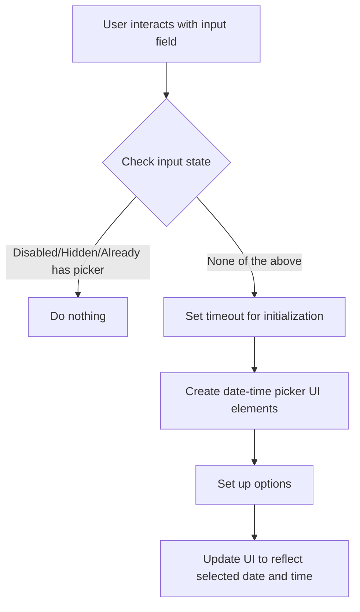

This document will cover the process of initializing a date-time picker. We'll cover:

1. Checking the state of the input field
2. Setting a timeout for initialization
3. Creating the date-time picker UI elements
4. Updating the UI to reflect the selected date and time.

Technical document: <SwmLink doc-title="Initializing a Date-Time Picker">[Initializing a Date-Time Picker](/.swm/initializing-a-date-time-picker.q6b3kuik.sw.md)</SwmLink>

# [Checking the state of the input field](https://app.swimm.io/repos/Z2l0aHViJTNBJTNBQnJvYWRsZWFmQ29tbWVyY2UtZGVtby1uZXclM0ElM0FTd2ltbS1EZW1v/docs/q6b3kuik#initonactioncallback)

When a user interacts with the input field (by opening, focusing, or clicking), the system first checks if the input field is disabled, hidden, or already has a date-time picker initialized. If any of these conditions are true, the system does nothing further. This ensures that the date-time picker is only initialized when it is needed and prevents multiple initializations on the same input field.

# [Setting a timeout for initialization](https://app.swimm.io/repos/Z2l0aHViJTNBJTNBQnJvYWRsZWFmQ29tbWVyY2UtZGVtby1uZXclM0ElM0FTd2ltbS1EZW1v/docs/q6b3kuik#initonactioncallback)

If the input field is eligible for initialization, a timeout is set to delay the creation of the date-time picker. This delay helps in managing performance, ensuring that the picker is not created immediately upon interaction, which could lead to a laggy user experience. The timeout is cleared if the input field is interacted with again before the picker is initialized.

# [Creating the date-time picker UI elements](https://app.swimm.io/repos/Z2l0aHViJTNBJTNBQnJvYWRsZWFmQ29tbWVyY2UtZGVtby1uZXclM0ElM0FTd2ltbS1EZW1v/docs/q6b3kuik#createdatetimepicker)

After the timeout, the system creates the date-time picker UI elements. This involves generating various HTML elements such as the date picker, month picker, and time picker, and appending them to the input field. These elements provide the user with an interface to select dates and times in a visually intuitive manner.

# [Setting up options](https://app.swimm.io/repos/Z2l0aHViJTNBJTNBQnJvYWRsZWFmQ29tbWVyY2UtZGVtby1uZXclM0ElM0FTd2ltbS1EZW1v/docs/q6b3kuik#setoptions)

The date-time picker is configured with specific options to tailor its behavior. These options include allowed times, date formats, and other configurations that ensure the picker meets the user's requirements. The options are merged with default settings to provide a consistent and customizable experience.

# [Updating the UI to reflect the selected date and time](https://app.swimm.io/repos/Z2l0aHViJTNBJTNBQnJvYWRsZWFmQ29tbWVyY2UtZGVtby1uZXclM0ElM0FTd2ltbS1EZW1v/docs/q6b3kuik#updateui)

Once the date-time picker is created and configured, the UI is updated to reflect the selected date and time. This involves adjusting the visual elements of the picker, such as background colors and input values, to ensure that the user's selections are clearly displayed. This step is crucial for providing immediate feedback to the user, confirming their selections.

&nbsp;

*This is an auto-generated document by Swimm AI 🌊 and has not yet been verified by a human*

<SwmMeta version="3.0.0" repo-id="Z2l0aHViJTNBJTNBQnJvYWRsZWFmQ29tbWVyY2UtZGVtby1uZXclM0ElM0FTd2ltbS1EZW1v" repo-name="BroadleafCommerce-demo-new" doc-type="product-flows">Powered by [Swimm](/)</SwmMeta>
