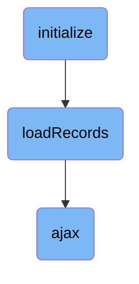

In this document, we will explain the process of initializing a list grid. The process involves setting up the grid, configuring infinite scrolling, loading records, and making AJAX calls to fetch data from the server.

The flow starts with initializing the list grid, which involves adjusting the table size and preparing it for infinite scrolling. Next, records are loaded into the grid by determining the range of records to load based on the visible viewport. Finally, AJAX calls are made to fetch data from the server, and the responses are handled to ensure the data is correctly processed and displayed.

# Flow drill down



<SwmSnippet path="/admin/broadleaf-open-admin-platform/src/main/resources/open_admin_style/js/admin/components/listGrid-paginate.js" line="974">

---

## Initializing the List Grid

The <SwmToken path="admin/broadleaf-open-admin-platform/src/main/resources/open_admin_style/js/admin/components/listGrid-paginate.js" pos="974:1:1" line-data="        initialize : function($container) {">`initialize`</SwmToken> function sets up the list grid by adjusting the table size, cloning the table, and preparing it for infinite scrolling. This ensures that the table is correctly displayed and ready for dynamic data loading.

```javascript
        initialize : function($container) {
            var $table = $container.find('table.list-grid-table');
            var $tbody = $table.children('tbody');
            var $container = $table.closest('.listgrid-container');
            var thWidths = [];
            var $modalBody = $container.closest('.modal-body');

            // If we're in a modal, we need to hide overflow in the modal to calculate sizes correclty. We'll restore this.
            $modalBody.css('overflow-y', 'hidden');

            // We want to remove the padding on the right side
            $table.css('padding-right', '0');

            // First, we'll adjust the size of the table to be 15px less, since this is the margin we need
            // for our scrollbar. This will ensure the widths are correct once we draw the scrollbar
            if ($table.width() == $container.width() - 2) {
                $table.css('width', ($table.width() - 15) + 'px');

                // Figure out what the currently drawn widths are for each row
                // This is effectively the same for all rows for both the head and the body for now
                // Also, set the width we determined directly on the element
```

---

</SwmSnippet>

<SwmSnippet path="/admin/broadleaf-open-admin-platform/src/main/resources/open_admin_style/js/admin/components/listGrid-paginate.js" line="1017">

---

### Setting Up Infinite Scrolling

The <SwmToken path="admin/broadleaf-open-admin-platform/src/main/resources/open_admin_style/js/admin/components/listGrid-paginate.js" pos="974:1:1" line-data="        initialize : function($container) {">`initialize`</SwmToken> function configures the custom scrollbar and binds events to enable infinite scrolling. This allows the table to load more records as the user scrolls, providing a seamless user experience.

```javascript
            // Get the first tr's height
            var trHeight = parseInt(this.getRowHeight($tbody), 10);

            // Set up the mCustomScrollbar on the table body. Also bind the necessary events to enable infinite scrolling
            $wrapper.mCustomScrollbar({
                theme: 'dark',
                scrollEasing: "linear",
                scrollInertia: 500,
                mouseWheelPixels: trHeight,
                advanced:{
                    autoScrollOnFocus: false,
                },
                callbacks: {
                    onScroll: function() {
                        var singleGrid = BLCAdmin.listGrid.getListGridCount($) == 1;
                        var inModal = $tbody.closest('.modal-body').length === 1;
                        var listGridType = $table.data('listgridtype');

                        // Update the currently visible range
                        BLCAdmin.listGrid.paginate.updateTableFooter($tbody);
                        
```

---

</SwmSnippet>

<SwmSnippet path="/admin/broadleaf-open-admin-platform/src/main/resources/open_admin_style/js/admin/components/listGrid-paginate.js" line="338">

---

## Loading Records

The <SwmToken path="admin/broadleaf-open-admin-platform/src/main/resources/open_admin_style/js/admin/components/listGrid-paginate.js" pos="338:1:1" line-data="        loadRecords : function($tbody, baseUrl) {">`loadRecords`</SwmToken> function is responsible for loading records into the list grid. It first acquires a lock to ensure that only one load operation is performed at a time and checks if the list grid is visible before proceeding.

```javascript
        loadRecords : function($tbody, baseUrl) {
            while (!this.acquireLock()) {
                var _this = this;
                //console.log("Couldn't acquire lock. Will try again in " + lockDebounce + "ms");
                $.doTimeout('acquirelock', lockDebounce, function() {
                    _this.loadRecords($tbody, baseUrl);
                });
                return false;
            }
            
            // If we can't see the list grid at all, don't load anything
            if (!$tbody.is(':visible')) {
                this.releaseLock();
                return false;
            }
```

---

</SwmSnippet>

<SwmSnippet path="/admin/broadleaf-open-admin-platform/src/main/resources/open_admin_style/js/admin/components/listGrid-paginate.js" line="363">

---

### Determining Record Range

The <SwmToken path="admin/broadleaf-open-admin-platform/src/main/resources/open_admin_style/js/admin/components/listGrid-paginate.js" pos="338:1:1" line-data="        loadRecords : function($tbody, baseUrl) {">`loadRecords`</SwmToken> function determines the range of records to load based on the visible viewport and the already loaded ranges. This ensures that only the necessary records are loaded, optimizing performance.

```javascript
            var startIndex = null;
            var maxIndex = null;
            
            // This is responsible for determining which range of records to load, considering what the currently
            // visible viewport is, what ranges are already loaded near the viewport, and the maximum page size
            if (!topIndexLoaded && !botIndexLoaded) {
                var potentialStart = this.findLastLoadedIndex($tbody, topIndex);
                var potentialMax = this.findFirstLoadedIndex($tbody, botIndex);
                
                if (potentialStart == null) {
                    potentialStart = 0;
                } else {
                    potentialStart = potentialStart + 1;
                }
                
                if (potentialMax == null) {
                    potentialMax = Math.max(totalRecords - 1, 0);
                } else {
                    potentialMax = Math.max(potentialMax - 1, 0);
                }
                
```

---

</SwmSnippet>

<SwmSnippet path="/common/src/main/resources/common_style/js/BLC.js" line="135">

---

## Making AJAX Calls

The <SwmToken path="common/src/main/resources/common_style/js/BLC.js" pos="135:3:3" line-data="    function ajax(options, callback) {">`ajax`</SwmToken> function is a utility for making AJAX calls. It sets default options, appends necessary parameters to the URL, and handles CSRF tokens. This function is used by <SwmToken path="admin/broadleaf-open-admin-platform/src/main/resources/open_admin_style/js/admin/components/listGrid-paginate.js" pos="338:1:1" line-data="        loadRecords : function($tbody, baseUrl) {">`loadRecords`</SwmToken> to fetch data from the server.

```javascript
    function ajax(options, callback) {
        if (options.type == null) {
            options.type = 'GET';
        }

        var baseUrl = window.location.href;
        if (baseUrl.indexOf('isPostAdd') != -1) {
            if (options.url.indexOf('isPostAdd') < 0) {
                if (options.url.indexOf('?') > 0) {
                    options.url += "&";
                } else {
                    options.url += "?";
                }
                options.url += "isPostAdd=true";
            }
        }
```

---

</SwmSnippet>

<SwmSnippet path="/common/src/main/resources/common_style/js/BLC.js" line="214">

---

### Handling AJAX Responses

The <SwmToken path="common/src/main/resources/common_style/js/BLC.js" pos="135:3:3" line-data="    function ajax(options, callback) {">`ajax`</SwmToken> function processes the server response, runs internal data handlers, tracks analytics, and invokes the provided callback. This ensures that the data is correctly handled and any additional processing is performed.

```javascript
        options.success = function(data) {
            if (typeof data == "string" && !this.noParse) {
                data = $($.trim(data));
            }
            
            var internalData = getInternalData(data);
            if (internalData != null) {
                runInternalDataHandlers(internalData);
            }
            
            if (options.trackAnalytics != false) {
                trackAjaxAnalytics(this, data);
            }
                        
            if (runPreAjaxCallbackHandlers(data)) {
                var extraData = getExtraData(data);
                callback(data, extraData);
            }
        };
        
        if (!options.error) {
```

---

</SwmSnippet>

&nbsp;

*This is an auto-generated document by Swimm AI 🌊 and has not yet been verified by a human*

<SwmMeta version="3.0.0" repo-id="Z2l0aHViJTNBJTNBQnJvYWRsZWFmQ29tbWVyY2UtZGVtby1uZXclM0ElM0FTd2ltbS1EZW1v" repo-name="BroadleafCommerce-demo-new" doc-type="flows"><sup>Powered by [Swimm](/)</sup></SwmMeta>
